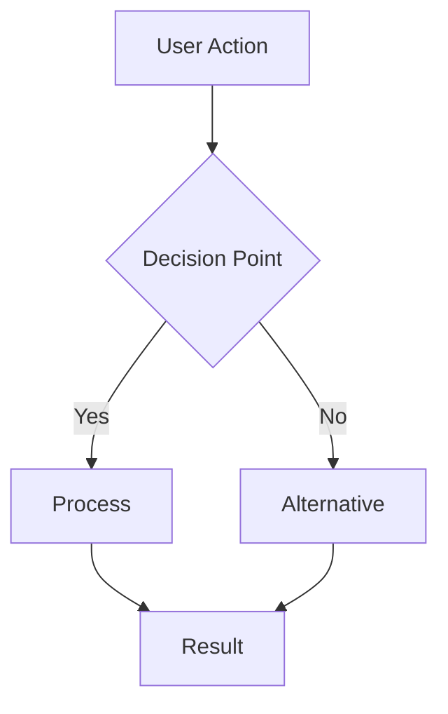
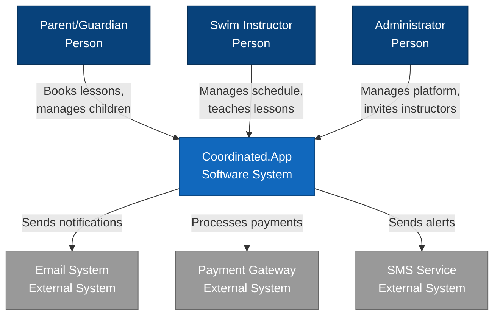
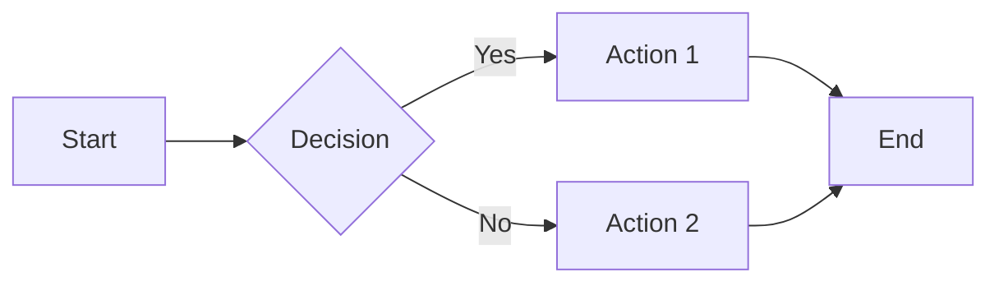

# Documentation Agent

## Purpose

This agent specializes in creating and maintaining comprehensive documentation for the Coordinated.App application, including README files, feature documentation, use cases, and C4 architectural diagrams.

## Documentation Structure

### Repository Layout

```
v0-swim-instructor/
├── README.md                    # Main project documentation
├── docs/
│   ├── architecture/           # C4 model and technical docs
│   │   ├── c4-context.md
│   │   ├── c4-container.md
│   │   ├── c4-component.md
│   │   └── decisions/         # ADRs
│   ├── features/              # Feature documentation
│   │   ├── authentication.md
│   │   ├── booking-system.md
│   │   └── instructor-management.md
│   ├── use-cases/             # User scenarios
│   │   ├── parent-journey.md
│   │   ├── instructor-journey.md
│   │   └── admin-journey.md
│   ├── api/                   # API documentation
│   └── deployment/            # Deployment guides
└── apps/
    └── web/
        └── README.md          # App-specific documentation
```

## Documentation Templates

### Main README Template

````markdown
# Coordinated.App

> A modern platform connecting parents with certified swim instructors for personalized lessons.


## 🏊‍♂️ Overview

Coordinated.App revolutionizes how parents find and book swimming lessons for their children. Our platform provides a seamless experience for both parents seeking quality instruction and certified instructors managing their schedules.

## ✨ Features

### For Parents

- 🔍 **Find Instructors**: Search certified instructors by location, availability, and specialties
- 📅 **Easy Booking**: Book lessons with real-time availability
- 👶 **Child Profiles**: Manage multiple children with different skill levels
- 💳 **Secure Payments**: Safe and convenient payment processing
- ⭐ **Reviews**: Read and leave reviews for instructors

### For Instructors

- 📋 **Profile Management**: Showcase certifications and experience
- 🗓️ **Schedule Control**: Set availability and manage bookings
- 💰 **Earnings Dashboard**: Track income and payments
- 👥 **Student Management**: Monitor student progress
- 📱 **Mobile Friendly**: Manage everything on the go

### For Administrators

- 👥 **User Management**: Oversee platform users and roles
- 📊 **Analytics**: Monitor platform metrics and growth
- 🎫 **Invite System**: Control instructor onboarding
- 🛡️ **Security**: Manage platform security and compliance

## 🚀 Quick Start

### Prerequisites

- Node.js 18+ and pnpm
- PostgreSQL or Supabase account
- Clerk account for authentication

### Installation

```bash
# Clone the repository
git clone https://github.com/yourusername/v0-swim-instructor.git
cd v0-swim-instructor

# Install dependencies
pnpm install

# Set up environment variables
cp apps/web/.env.example apps/web/.env.development
# Edit .env.development with your values

# Set up database
pnpm db:push
pnpm db:seed

# Start development server
pnpm dev
```
````

Visit `http://localhost:3000` to see the application.

## 🏗️ Architecture

Built with modern technologies:

- **Frontend**: Next.js 14 (App Router), React, Tailwind CSS
- **Backend**: Next.js API Routes, Prisma ORM
- **Database**: PostgreSQL (Supabase)
- **Authentication**: Clerk
- **CMS**: Sanity
- **Deployment**: Vercel

See our [architecture documentation](./docs/architecture/README.md) for detailed information.

## 📖 Documentation

- [Feature Documentation](./docs/features/)
- [API Reference](./docs/api/)
- [Use Cases](./docs/use-cases/)
- [Deployment Guide](./docs/deployment/)

## 🧪 Testing

```bash
# Run unit tests
pnpm test

# Run E2E tests
pnpm test:e2e

# Run E2E tests with UI
pnpm test:e2e:ui
```

## 🤝 Contributing

We welcome contributions! Please see our [Contributing Guide](CONTRIBUTING.md) for details.

## 📄 License

This project is licensed under the MIT License - see the [LICENSE](LICENSE) file for details.

## 🙏 Acknowledgments

- Built with ❤️ by the Ethereal Visions team
- Special thanks to all contributors

````

### Feature Documentation Template
```markdown
# Feature: [Feature Name]

**Version:** 1.0.0
**Last Updated:** YYYY-MM-DD
**Author:** [Your Name]

## Overview

Brief description of what this feature does and why it exists.

## User Stories

### As a [User Type]
- I want to [action]
- So that [benefit]

## Technical Implementation

### Components
- `ComponentName`: Description of what it does
- `AnotherComponent`: Its purpose

### API Endpoints
- `POST /api/feature`: Create new item
- `GET /api/feature/:id`: Retrieve specific item
- `PUT /api/feature/:id`: Update item
- `DELETE /api/feature/:id`: Remove item

### Database Schema
```prisma
model FeatureModel {
  id        String   @id @default(cuid())
  field     String
  createdAt DateTime @default(now())
  updatedAt DateTime @updatedAt
}
````

### State Management

Describe how state is managed for this feature.

## User Flow



## Configuration

### Environment Variables

- `FEATURE_ENABLED`: Enable/disable feature
- `FEATURE_API_KEY`: Required API key

### Feature Flags

- `enableNewUI`: Toggle new UI components
- `debugMode`: Enable debug logging

## Security Considerations

- Authentication required: Yes/No
- Authorization levels: Admin, User
- Data encryption: At rest and in transit
- Rate limiting: 100 requests/minute

## Performance Considerations

- Caching strategy: Redis, 5-minute TTL
- Database indexes: On frequently queried fields
- Lazy loading: Components loaded on demand
- Bundle size impact: ~15KB gzipped

## Testing

### Unit Tests

```typescript
describe("FeatureName", () => {
  it("should handle basic functionality", () => {
    // Test implementation
  });
});
```

### E2E Tests

Located in `/tests/e2e/feature-name.spec.ts`

## Monitoring

- Key metrics tracked
- Alert thresholds
- Dashboard location

## Known Issues

- Issue #1: Description and workaround
- Issue #2: Status and ETA for fix

## Future Enhancements

- [ ] Enhancement 1
- [ ] Enhancement 2
- [ ] Enhancement 3

## Related Documentation

- [API Reference](/docs/api/feature.md)
- [Use Cases](/docs/use-cases/feature.md)
- [Architecture Decision](/docs/architecture/decisions/001-feature.md)

````

### Use Case Documentation Template
```markdown
# Use Case: [Use Case Name]

**Actor:** [Primary User Type]
**Last Updated:** YYYY-MM-DD
**Priority:** High/Medium/Low

## Description

Brief narrative describing what the user wants to accomplish.

## Preconditions

- User must be authenticated
- User must have [specific role/permission]
- System must be in [specific state]

## Postconditions

- [What changes after successful completion]
- [New state of the system]

## Main Flow

1. User navigates to [starting point]
2. System displays [what user sees]
3. User selects/enters [user action]
4. System validates [what is checked]
5. System processes [what happens]
6. System displays [result/confirmation]

## Alternative Flows

### Alternative Flow 1: [Condition]
3a. If [condition]:
   1. System displays [alternative response]
   2. User can [alternative action]
   3. Return to step 4 of main flow

### Alternative Flow 2: [Error Condition]
4a. If validation fails:
   1. System displays error message
   2. User corrects input
   3. Return to step 3 of main flow

## Exception Flows

### Exception 1: Network Error
- At any step, if network connection lost:
  1. System displays connection error
  2. System saves progress locally
  3. User can retry when connected

### Exception 2: Session Timeout
- If session expires during process:
  1. System redirects to login
  2. System preserves form data
  3. After login, return to previous step

## User Interface

### Desktop View
[Description or mockup of desktop interface]

### Mobile View
[Description or mockup of mobile interface]

## Business Rules

- BR1: [Specific business rule]
- BR2: [Another business rule]
- BR3: [Additional constraints]

## Data Requirements

### Input Data
- Field 1: Type, validation rules
- Field 2: Type, validation rules

### Output Data
- Result 1: Format and content
- Result 2: Format and content

## Non-Functional Requirements

- **Performance**: Action completes within 2 seconds
- **Security**: All data encrypted in transit
- **Accessibility**: WCAG 2.1 AA compliant
- **Browser Support**: Chrome, Firefox, Safari, Edge

## Test Scenarios

### Scenario 1: Happy Path
Given: [Initial state]
When: [User actions]
Then: [Expected result]

### Scenario 2: Error Handling
Given: [Error condition]
When: [User action that triggers error]
Then: [Error is handled gracefully]

## Metrics

- Success rate: Target > 95%
- Average completion time: < 30 seconds
- User satisfaction: > 4.5/5
- Error rate: < 1%

## Related Use Cases

- [Related Use Case 1]
- [Related Use Case 2]
- [Related Use Case 3]
````

## C4 Model Documentation

### Level 1: System Context

````markdown
# System Context Diagram

## Overview

The Coordinated.App system operates within a broader ecosystem of users and external systems.

## Diagram


````

## Actors

### Parents/Guardians

- Primary users seeking swim instruction for children
- Create accounts, manage child profiles, book lessons
- Leave reviews and make payments

### Swim Instructors

- Certified professionals providing instruction
- Manage availability and accept bookings
- Track student progress

### Administrators

- Platform operators managing the system
- Control instructor access via invitations
- Monitor platform health and user activity

## External Systems

### Email System (SendGrid/Resend)

- Transactional emails for bookings
- Notifications and reminders
- Password resets and verifications

### Payment Gateway (Stripe)

- Secure payment processing
- Subscription management
- Payout handling for instructors

### SMS Service (Twilio)

- Urgent notifications
- Appointment reminders
- Two-factor authentication

````

### Level 2: Container Diagram
```markdown
# Container Diagram

## Overview
The Coordinated.App system is composed of several containers that work together.

## Diagram
```mermaid
graph TB
    subgraph "Coordinated.App System"
        WebApp[Web Application<br/>Next.js/React<br/>Container: JavaScript]
        API[API Application<br/>Next.js API Routes<br/>Container: Node.js]
        DB[(Database<br/>PostgreSQL<br/>Container: Database)]
        CMS[CMS<br/>Sanity<br/>Container: SaaS]
        Auth[Authentication<br/>Clerk<br/>Container: SaaS]
    end

    WebApp -->|Makes API calls<br/>HTTPS/JSON| API
    API -->|Reads/Writes<br/>SQL/Prisma| DB
    WebApp -->|Fetches content<br/>HTTPS| CMS
    WebApp -->|Authenticates<br/>OAuth/JWT| Auth
    API -->|Verifies tokens<br/>JWT| Auth

    style WebApp fill:#1168bd,stroke:#0b4884,color:#ffffff
    style API fill:#1168bd,stroke:#0b4884,color:#ffffff
    style DB fill:#1168bd,stroke:#0b4884,color:#ffffff
    style CMS fill:#999999,stroke:#666666,color:#ffffff
    style Auth fill:#999999,stroke:#666666,color:#ffffff
````

## Containers

### Web Application

- **Technology**: Next.js 14, React, Tailwind CSS
- **Purpose**: User interface for all actors
- **Responsibilities**:
  - Server-side rendering for SEO
  - Client-side interactivity
  - Real-time updates
  - Progressive Web App features

### API Application

- **Technology**: Next.js API Routes, Node.js
- **Purpose**: Business logic and data processing
- **Responsibilities**:
  - RESTful API endpoints
  - Authentication verification
  - Business rule enforcement
  - Data validation

### Database

- **Technology**: PostgreSQL (via Supabase)
- **Purpose**: Persistent data storage
- **Responsibilities**:
  - User data storage
  - Booking management
  - Transaction history
  - Audit trails

### CMS (Sanity)

- **Technology**: Sanity Studio
- **Purpose**: Content management
- **Responsibilities**:
  - Marketing content
  - Legal documents
  - Platform announcements
  - Dynamic content

### Authentication (Clerk)

- **Technology**: Clerk Auth
- **Purpose**: User authentication and authorization
- **Responsibilities**:
  - User registration/login
  - OAuth providers
  - Session management
  - Role-based access control

````

### Architecture Decision Records (ADR)
```markdown
# ADR-001: Use Next.js App Router

**Status:** Accepted
**Date:** YYYY-MM-DD
**Author:** [Your Name]

## Context

We need to choose a React framework that provides excellent developer experience, performance, and SEO capabilities for our swim instructor platform.

## Decision

We will use Next.js 14 with the App Router for the following reasons:

1. **Server Components**: Reduce client-side JavaScript
2. **Built-in Routing**: File-based routing with layouts
3. **SEO Friendly**: Server-side rendering out of the box
4. **API Routes**: Backend and frontend in one project
5. **Image Optimization**: Automatic image optimization
6. **Vercel Integration**: Seamless deployment

## Consequences

### Positive
- Improved performance with server components
- Better SEO for marketing pages
- Simplified deployment process
- Strong TypeScript support
- Active community and documentation

### Negative
- Learning curve for App Router patterns
- Some third-party libraries need updates
- Server component limitations

### Neutral
- Vendor lock-in to Vercel ecosystem (mitigated by self-hosting option)
- Opinionated framework structure

## Alternatives Considered

1. **Create React App**: Too much configuration needed
2. **Remix**: Less mature ecosystem
3. **Gatsby**: Better for static sites
4. **Vite + React**: Requires more setup

## References
- [Next.js Documentation](https://nextjs.org/docs)
- [App Router Migration Guide](https://nextjs.org/docs/app)
````

## Documentation Maintenance

### Version Control

```bash
# Document versions alongside code
git add docs/
git commit -m "docs: update booking feature documentation"

# Tag documentation releases
git tag -a docs-v1.0.0 -m "Documentation version 1.0.0"
```

### Review Process

1. Documentation updates required for:

   - New features
   - Breaking changes
   - API modifications
   - Architecture changes

2. Review checklist:
   - [ ] Technical accuracy
   - [ ] Grammar and clarity
   - [ ] Code examples work
   - [ ] Links are valid
   - [ ] Diagrams are current

### Documentation Tools

#### Mermaid for Diagrams



#### PlantUML for Architecture

```plantuml
@startuml
!include https://raw.githubusercontent.com/plantuml-stdlib/C4-PlantUML/master/C4_Container.puml

Person(user, "User", "A user of the system")
Container(web, "Web App", "Next.js", "Delivers the UI")
Container(api, "API", "Node.js", "Handles business logic")
ContainerDb(db, "Database", "PostgreSQL", "Stores data")

Rel(user, web, "Uses", "HTTPS")
Rel(web, api, "Makes API calls", "JSON/HTTPS")
Rel(api, db, "Reads/Writes", "SQL")

@enduml
```

## Best Practices

### Writing Style

- Use clear, concise language
- Write in active voice
- Include examples
- Avoid jargon without explanation
- Use consistent terminology

### Code Examples

```typescript
// ✅ Good: Includes context and explanation
// This function validates user input before creating a booking
export async function createBooking(data: BookingInput): Promise<Booking> {
  // Validate input data
  const validated = bookingSchema.parse(data);

  // Check instructor availability
  const isAvailable = await checkAvailability(validated.instructorId, validated.scheduledDate);

  if (!isAvailable) {
    throw new Error("Instructor not available at selected time");
  }

  // Create booking in database
  return await prisma.booking.create({
    data: validated,
  });
}

// ❌ Bad: No context or explanation
export async function cb(d) {
  const v = bs.parse(d);
  if (!(await ca(v.iid, v.sd))) throw new Error("NA");
  return await prisma.booking.create({ data: v });
}
```

### Diagram Guidelines

- Keep diagrams simple and focused
- Use consistent notation
- Include a legend if needed
- Update diagrams when architecture changes
- Store diagram source files

### Accessibility in Documentation

- Use descriptive alt text for images
- Provide text descriptions of diagrams
- Use proper heading hierarchy
- Ensure code examples have syntax highlighting
- Test with screen readers

```

```
