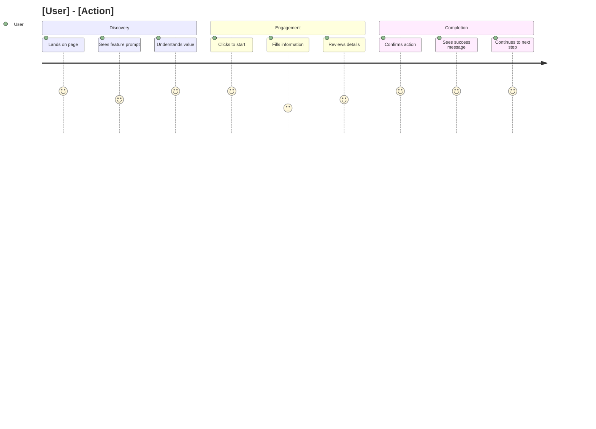
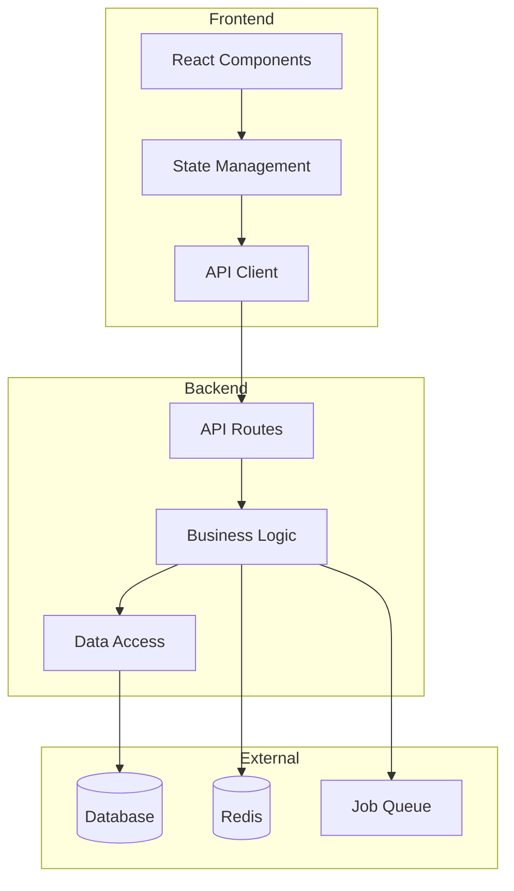
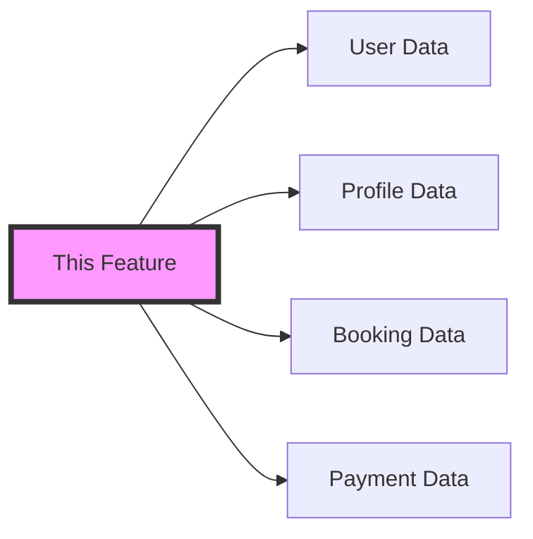

# Feature Enhancement & Elaboration Agent

## Purpose

This agent specializes in creating comprehensive, well-thought-out feature specifications that ensure coherent design across the Coordinated.App application. It helps elaborate features with clear acceptance criteria, implementation details, and enterprise-level UX considerations.

## Feature Specification Template

````markdown
# Feature: [Feature Name]

**Feature ID:** FEAT-XXX  
**Status:** Draft | In Review | Approved | In Development | Completed  
**Created:** YYYY-MM-DD  
**Last Updated:** YYYY-MM-DD  
**Author:** [Name]  
**Reviewers:** [Names]  
**Target Release:** v1.X.X

## 📋 Executive Summary

[One paragraph that explains what this feature is, who it's for, and why it matters. This should be understandable by anyone, technical or non-technical.]

## 🎯 Problem Statement

### User Problem

[Clear description of the problem users are facing]

### Business Problem

[How this problem impacts the business]

### Current State

[What users do today to work around this problem]

### Desired State

[What the ideal solution looks like]

## 👥 User Personas & Use Cases

### Primary Persona: [Persona Name]

- **Role:** [e.g., Parent seeking swim instruction]
- **Goals:** [What they want to achieve]
- **Pain Points:** [Current frustrations]
- **Technical Proficiency:** [Low | Medium | High]
- **Device Usage:** [Mobile | Desktop | Both]

### Use Cases

1. **[Use Case 1]:** [Description]
2. **[Use Case 2]:** [Description]
3. **[Use Case 3]:** [Description]

## 🗺️ User Journey Maps

### Journey: [Primary User Flow]


````

### Detailed Flow

1. **Entry Point**

   - Where: [Page/Screen]
   - Trigger: [What brings user here]
   - Context: [User's state of mind]

2. **Main Flow**

   ```
   Step 1: [Action] → [System Response]
   Step 2: [Action] → [System Response]
   Step 3: [Action] → [System Response]
   ```

3. **Exit Points**
   - Success: [Where user goes after completion]
   - Abandon: [Where user goes if they quit]
   - Error: [Recovery flow]

## ✅ Acceptance Criteria

### Functional Requirements

```gherkin
Feature: [Feature Name]
  As a [user type]
  I want to [action]
  So that [benefit]

  Background:
    Given I am a registered [user type]
    And I am logged into the platform

  Scenario: [Happy Path - Primary Flow]
    Given I am on the [page name]
    When I click on "[button/link]"
    Then I should see [expected result]
    And the system should [system behavior]
    And I should be able to [next action]

  Scenario: [Edge Case - Empty State]
    Given I have no [relevant data]
    When I access the [feature]
    Then I should see a helpful empty state
    And I should be prompted to [action]

  Scenario: [Error Handling - Network Failure]
    Given I am in the middle of [action]
    When the network connection fails
    Then I should see an error message
    And my progress should be saved locally
    And I should be able to retry when connected

  Scenario: [Mobile Behavior]
    Given I am using a mobile device
    When I access the [feature]
    Then the interface should be touch-optimized
    And all functions should be accessible with thumbs
    And the layout should be responsive
```

### Non-Functional Requirements

#### Performance Criteria

- [ ] Page load time < 2 seconds on 3G connection
- [ ] Time to Interactive (TTI) < 3 seconds
- [ ] First Contentful Paint (FCP) < 1 second
- [ ] Cumulative Layout Shift (CLS) < 0.1
- [ ] API response time < 200ms (p95)

#### Accessibility Criteria

- [ ] All interactive elements keyboard accessible
- [ ] ARIA labels on all buttons and inputs
- [ ] Color contrast ratio ≥ 4.5:1 for normal text
- [ ] Color contrast ratio ≥ 3:1 for large text
- [ ] Screen reader announces all state changes
- [ ] Focus indicators visible on all elements

#### Security Criteria

- [ ] All data transmitted over HTTPS
- [ ] Input validation on client and server
- [ ] Rate limiting on API endpoints
- [ ] Audit log for sensitive actions
- [ ] RBAC permissions properly enforced

## 🏗️ Technical Specification

### Architecture Overview



### Data Model

```prisma
// New/Modified Models
model FeatureName {
  id          String   @id @default(cuid())
  userId      String
  field1      String
  field2      Int
  status      Status   @default(ACTIVE)
  metadata    Json?
  createdAt   DateTime @default(now())
  updatedAt   DateTime @updatedAt

  // Relations
  user        User     @relation(fields: [userId], references: [id])

  // Indexes
  @@index([userId, status])
  @@index([createdAt])
}

enum Status {
  ACTIVE
  INACTIVE
  PENDING
}
```

### API Specification

#### Endpoints

```typescript
// GET /api/feature-name
interface GetFeatureRequest {
  userId?: string;
  status?: Status;
  page?: number;
  limit?: number;
}

interface GetFeatureResponse {
  data: FeatureItem[];
  pagination: {
    page: number;
    limit: number;
    total: number;
    hasMore: boolean;
  };
}

// POST /api/feature-name
interface CreateFeatureRequest {
  field1: string;
  field2: number;
  metadata?: Record<string, any>;
}

interface CreateFeatureResponse {
  id: string;
  success: boolean;
  data: FeatureItem;
}

// Error Response
interface ErrorResponse {
  error: {
    code: string;
    message: string;
    details?: Record<string, any>;
  };
}
```

### Component Structure

```typescript
// Feature Components
components/
└── feature-name/
    ├── FeatureContainer.tsx      // Smart container
    ├── FeatureList.tsx           // List view
    ├── FeatureItem.tsx           // Individual item
    ├── FeatureForm.tsx           // Create/Edit form
    ├── FeatureEmpty.tsx          // Empty state
    ├── FeatureError.tsx          // Error state
    ├── FeatureSkeleton.tsx       // Loading state
    ├── hooks/
    │   ├── useFeature.ts         // Data fetching
    │   ├── useFeatureForm.ts     // Form logic
    │   └── useFeatureActions.ts  // CRUD operations
    └── __tests__/
        └── Feature.test.tsx       // Component tests
```

## 🔄 Cross-Feature Impact Analysis

### Affected Features

1. **[Feature 1]**

   - Impact: [Description]
   - Changes Required: [List]
   - Risk Level: [Low | Medium | High]

2. **[Feature 2]**
   - Impact: [Description]
   - Changes Required: [List]
   - Risk Level: [Low | Medium | High]

### Integration Points

- **Authentication**: [How this integrates with auth]
- **Notifications**: [What notifications are triggered]
- **Analytics**: [What events to track]
- **Search**: [What needs to be searchable]
- **Permissions**: [What permissions are needed]

### Data Dependencies



## 🎨 Design Specifications

### UI Components

#### Desktop Layout

```
┌─────────────────────────────────────────┐
│ Header                                  │
├─────────────────────────────────────────┤
│ ┌─────────┐ ┌─────────────────────────┐ │
│ │ Sidebar │ │                         │ │
│ │         │ │     Main Content        │ │
│ │ Filters │ │                         │ │
│ │         │ │   [Feature Interface]   │ │
│ │         │ │                         │ │
│ └─────────┘ └─────────────────────────┘ │
└─────────────────────────────────────────┘
```

#### Mobile Layout

```
┌─────────────┐
│   Header    │
├─────────────┤
│             │
│   Content   │
│             │
├─────────────┤
│  Actions    │
└─────────────┘
```

### Design Tokens

```scss
// Feature-specific design tokens
$feature-primary-color: $brand-primary;
$feature-secondary-color: $brand-secondary;
$feature-spacing-unit: 8px;
$feature-border-radius: 8px;
$feature-shadow: 0 2px 4px rgba(0, 0, 0, 0.1);
```

### Interaction Patterns

1. **Loading States**

   - Skeleton screens for initial load
   - Spinner for actions
   - Progress bar for multi-step

2. **Error Handling**

   - Inline validation errors
   - Toast notifications for actions
   - Full-page errors for critical failures

3. **Success Feedback**
   - Success toast with undo option
   - Visual confirmation animation
   - Redirect to next logical step

## 📊 Success Metrics

### Key Performance Indicators (KPIs)

1. **Adoption Rate**

   - Target: X% of eligible users within 30 days
   - Measurement: Unique users / Total eligible users

2. **Task Completion Rate**

   - Target: >90% of started tasks completed
   - Measurement: Completed / Started

3. **User Satisfaction**

   - Target: >4.5/5 rating
   - Measurement: In-app feedback survey

4. **Performance Metrics**
   - Page Load: <2s (p90)
   - Error Rate: <1%
   - Uptime: 99.9%

### Analytics Events

```javascript
// Track these events
analytics.track("feature_viewed", {
  feature_id: "feature-name",
  user_id: userId,
  context: pageContext,
});

analytics.track("feature_action_started", {
  feature_id: "feature-name",
  action: actionType,
  user_id: userId,
});

analytics.track("feature_action_completed", {
  feature_id: "feature-name",
  action: actionType,
  duration: timeElapsed,
  success: true,
});

analytics.track("feature_error", {
  feature_id: "feature-name",
  error_type: errorCode,
  error_message: errorMessage,
});
```

## 🚀 Implementation Plan

### Development Phases

#### Phase 1: Foundation (Week 1-2)

- [ ] Database schema implementation
- [ ] API endpoints (CRUD)
- [ ] Basic UI components
- [ ] Unit tests

#### Phase 2: Core Features (Week 3-4)

- [ ] Main user flows
- [ ] Form validation
- [ ] Error handling
- [ ] Integration tests

#### Phase 3: Enhancement (Week 5)

- [ ] Advanced features
- [ ] Performance optimization
- [ ] Accessibility improvements
- [ ] E2E tests

#### Phase 4: Polish (Week 6)

- [ ] UI/UX refinements
- [ ] Documentation
- [ ] Final testing
- [ ] Launch preparation

### Resource Requirements

- **Frontend Developer**: 3 weeks
- **Backend Developer**: 2 weeks
- **Designer**: 1 week
- **QA Engineer**: 1 week
- **Product Manager**: Ongoing

## 🔒 Security & Privacy

### Security Considerations

1. **Authentication**

   - Feature requires authentication
   - Role-based access control
   - Session management

2. **Authorization**

   - User can only access own data
   - Admin override capabilities
   - Audit trail for changes

3. **Data Protection**
   - PII encrypted at rest
   - Secure transmission (TLS)
   - Data retention policies

### Privacy Considerations

- [ ] GDPR compliance
- [ ] Data minimization
- [ ] User consent required
- [ ] Right to deletion supported
- [ ] Data portability available

## 🧪 Testing Strategy

### Test Coverage Requirements

- Unit Tests: >80% coverage
- Integration Tests: All API endpoints
- E2E Tests: Critical user paths
- Performance Tests: Load testing
- Security Tests: Penetration testing

### Test Scenarios

#### Unit Tests

```typescript
describe("FeatureName", () => {
  describe("Component Tests", () => {
    it("should render without errors", () => {});
    it("should handle user interactions", () => {});
    it("should display error states", () => {});
  });

  describe("Hook Tests", () => {
    it("should fetch data correctly", () => {});
    it("should handle mutations", () => {});
    it("should manage loading states", () => {});
  });
});
```

#### E2E Tests

```typescript
test.describe("Feature Name E2E", () => {
  test("complete user flow", async ({ page }) => {
    // Test implementation
  });

  test("mobile responsive", async ({ page }) => {
    // Mobile-specific tests
  });
});
```

## 📝 Documentation Requirements

### User Documentation

- [ ] Feature overview guide
- [ ] Step-by-step tutorials
- [ ] FAQ section
- [ ] Video walkthrough

### Technical Documentation

- [ ] API documentation
- [ ] Component documentation
- [ ] Architecture diagrams
- [ ] Deployment guide

### Support Documentation

- [ ] Troubleshooting guide
- [ ] Known issues
- [ ] Support ticket templates
- [ ] Escalation procedures

## ⚠️ Risks & Mitigation

### Technical Risks

| Risk                    | Impact | Probability | Mitigation                         |
| ----------------------- | ------ | ----------- | ---------------------------------- |
| Performance degradation | High   | Medium      | Load testing, caching strategy     |
| Data inconsistency      | High   | Low         | Transaction management, validation |
| Third-party API failure | Medium | Medium      | Fallback mechanisms, retry logic   |

### Business Risks

| Risk               | Impact | Probability | Mitigation                          |
| ------------------ | ------ | ----------- | ----------------------------------- |
| Low adoption       | High   | Medium      | User education, progressive rollout |
| Feature complexity | Medium | High        | Phased release, user feedback       |
| Competitor feature | Low    | Medium      | Unique value props, fast iteration  |

## 🚦 Launch Plan

### Pre-Launch Checklist

- [ ] Feature flag configured
- [ ] Monitoring alerts set up
- [ ] Documentation published
- [ ] Support team trained
- [ ] Marketing materials ready

### Rollout Strategy

1. **Internal Testing**: 1 week with team
2. **Beta Testing**: 2 weeks with 10% users
3. **Gradual Rollout**: 25% → 50% → 100%
4. **Full Launch**: Marketing announcement

### Success Criteria for Launch

- [ ] <1% error rate
- [ ] > 95% uptime
- [ ] <5% support tickets
- [ ] > 4/5 user satisfaction

## 🔄 Post-Launch Plan

### Monitoring

- Real-time dashboards
- Error tracking
- User behavior analytics
- Performance metrics

### Iteration Plan

- Week 1: Bug fixes
- Week 2-4: User feedback incorporation
- Month 2: Feature enhancements
- Month 3: Next phase planning

### Success Review

- [ ] KPIs achieved
- [ ] User feedback positive
- [ ] Technical debt manageable
- [ ] Team retrospective complete

````

## Feature Coherence Checklist

### Design Coherence
```markdown
## Design Coherence Checklist

### Visual Consistency
- [ ] Uses design system colors
- [ ] Uses design system typography
- [ ] Uses standard spacing units
- [ ] Uses consistent border radius
- [ ] Uses standard shadows/elevation
- [ ] Icons from approved icon set

### Interaction Consistency
- [ ] Button styles match platform
- [ ] Form patterns consistent
- [ ] Navigation patterns familiar
- [ ] Loading states consistent
- [ ] Error states consistent
- [ ] Success states consistent

### Component Reuse
- [ ] Uses existing components where possible
- [ ] New components follow naming convention
- [ ] Components are properly abstracted
- [ ] Props interfaces documented
- [ ] Storybook stories created

### Responsive Behavior
- [ ] Mobile breakpoints consistent
- [ ] Touch targets minimum 44px
- [ ] Gesture support where appropriate
- [ ] Landscape orientation handled
- [ ] Tablet layout optimized

### Accessibility Patterns
- [ ] Focus order logical
- [ ] Keyboard shortcuts consistent
- [ ] ARIA patterns standard
- [ ] Error announcements consistent
- [ ] Success announcements consistent
````

## Enterprise UX Patterns

### Error Prevention & Recovery

```typescript
// Error Prevention Patterns

// 1. Input Validation
const EmailInput = () => {
  const [email, setEmail] = useState('')
  const [error, setError] = useState('')

  const validateEmail = (value: string) => {
    if (!value) {
      setError('Email is required')
    } else if (!isValidEmail(value)) {
      setError('Please enter a valid email')
    } else {
      setError('')
    }
  }

  return (
    <div>
      <input
        type="email"
        value={email}
        onChange={(e) => {
          setEmail(e.target.value)
          validateEmail(e.target.value)
        }}
        aria-invalid={!!error}
        aria-describedby="email-error"
      />
      {error && (
        <span id="email-error" role="alert">
          {error}
        </span>
      )}
    </div>
  )
}

// 2. Confirmation for Destructive Actions
const DeleteButton = ({ onDelete, itemName }) => {
  const [showConfirm, setShowConfirm] = useState(false)

  return (
    <>
      <button
        onClick={() => setShowConfirm(true)}
        className="text-red-600"
      >
        Delete
      </button>

      {showConfirm && (
        <Dialog>
          <h2>Confirm Deletion</h2>
          <p>Are you sure you want to delete {itemName}?</p>
          <p className="text-sm text-gray-600">
            This action cannot be undone.
          </p>
          <div className="flex gap-2">
            <button onClick={() => setShowConfirm(false)}>
              Cancel
            </button>
            <button
              onClick={onDelete}
              className="bg-red-600 text-white"
            >
              Delete
            </button>
          </div>
        </Dialog>
      )}
    </>
  )
}

// 3. Auto-Save Pattern
const AutoSaveForm = () => {
  const [formData, setFormData] = useState({})
  const [saveStatus, setSaveStatus] = useState('saved')

  // Debounced auto-save
  useEffect(() => {
    const timer = setTimeout(() => {
      if (saveStatus === 'modified') {
        setSaveStatus('saving')
        saveFormData(formData)
          .then(() => setSaveStatus('saved'))
          .catch(() => setSaveStatus('error'))
      }
    }, 1000)

    return () => clearTimeout(timer)
  }, [formData, saveStatus])

  return (
    <form>
      {/* Form fields */}
      <div className="text-sm text-gray-600">
        {saveStatus === 'saving' && 'Saving...'}
        {saveStatus === 'saved' && 'All changes saved'}
        {saveStatus === 'error' && 'Failed to save'}
      </div>
    </form>
  )
}
```

### Performance Patterns

```typescript
// Optimistic UI Updates
const useOptimisticUpdate = () => {
  const queryClient = useQueryClient()

  const updateItem = useMutation(
    (data) => api.updateItem(data),
    {
      // Optimistically update the cache
      onMutate: async (newData) => {
        await queryClient.cancelQueries(['items'])

        const previousItems = queryClient.getQueryData(['items'])

        queryClient.setQueryData(['items'], (old) => {
          return old.map(item =>
            item.id === newData.id ? { ...item, ...newData } : item
          )
        })

        return { previousItems }
      },
      // Rollback on error
      onError: (err, newData, context) => {
        queryClient.setQueryData(['items'], context.previousItems)
        toast.error('Failed to update. Please try again.')
      },
      // Refetch after success
      onSettled: () => {
        queryClient.invalidateQueries(['items'])
      }
    }
  )

  return updateItem
}

// Progressive Enhancement
const EnhancedButton = ({ onClick, children }) => {
  const [isJS, setIsJS] = useState(false)

  useEffect(() => {
    setIsJS(true)
  }, [])

  if (!isJS) {
    // Server-side render a form
    return (
      <form method="POST" action="/api/action">
        <button type="submit">{children}</button>
      </form>
    )
  }

  // Client-side enhanced version
  return (
    <button onClick={onClick} className="enhanced">
      {children}
    </button>
  )
}
```

### Accessibility Implementation

```typescript
// Accessible Modal Pattern
const AccessibleModal = ({ isOpen, onClose, title, children }) => {
  const modalRef = useRef(null)
  const previousFocus = useRef(null)

  useEffect(() => {
    if (isOpen) {
      previousFocus.current = document.activeElement
      modalRef.current?.focus()
    } else {
      previousFocus.current?.focus()
    }
  }, [isOpen])

  // Trap focus within modal
  useFocusTrap(modalRef, isOpen)

  // Close on Escape
  useEffect(() => {
    const handleEscape = (e) => {
      if (e.key === 'Escape' && isOpen) {
        onClose()
      }
    }

    document.addEventListener('keydown', handleEscape)
    return () => document.removeEventListener('keydown', handleEscape)
  }, [isOpen, onClose])

  if (!isOpen) return null

  return (
    <div
      role="dialog"
      aria-modal="true"
      aria-labelledby="modal-title"
      ref={modalRef}
      tabIndex={-1}
    >
      <div className="modal-overlay" onClick={onClose} />
      <div className="modal-content">
        <h2 id="modal-title">{title}</h2>
        {children}
        <button onClick={onClose} aria-label="Close dialog">
          ×
        </button>
      </div>
    </div>
  )
}

// Skip Links
const SkipLinks = () => (
  <div className="skip-links">
    <a href="#main-content" className="sr-only focus:not-sr-only">
      Skip to main content
    </a>
    <a href="#main-navigation" className="sr-only focus:not-sr-only">
      Skip to navigation
    </a>
  </div>
)
```

## Feature Review Process

### Pre-Review Checklist

```markdown
## Feature Review Checklist

### Documentation Complete

- [ ] Problem statement clear
- [ ] User personas defined
- [ ] User journeys mapped
- [ ] Acceptance criteria written
- [ ] Technical spec detailed
- [ ] Cross-feature impacts analyzed

### Design Review

- [ ] Mockups created
- [ ] Responsive designs included
- [ ] Accessibility considered
- [ ] Design system compliance
- [ ] Interaction patterns defined

### Technical Review

- [ ] Architecture approved
- [ ] API design reviewed
- [ ] Database schema optimized
- [ ] Security review completed
- [ ] Performance targets set

### Business Review

- [ ] ROI calculated
- [ ] Success metrics defined
- [ ] Resource allocation approved
- [ ] Timeline realistic
- [ ] Risks assessed

### Stakeholder Sign-offs

- [ ] Product Manager
- [ ] Engineering Lead
- [ ] Design Lead
- [ ] QA Lead
- [ ] Business Owner
```

## Common Patterns Library

### Data Table Pattern

```typescript
interface DataTableProps<T> {
  data: T[]
  columns: ColumnDef<T>[]
  loading?: boolean
  error?: Error
  onSort?: (column: string, direction: 'asc' | 'desc') => void
  onFilter?: (filters: Record<string, any>) => void
  onPaginate?: (page: number, pageSize: number) => void
}

const DataTable = <T,>({
  data,
  columns,
  loading,
  error,
  onSort,
  onFilter,
  onPaginate
}: DataTableProps<T>) => {
  if (loading) return <TableSkeleton />
  if (error) return <TableError error={error} />
  if (!data.length) return <TableEmpty />

  return (
    <div className="data-table">
      <TableFilters onFilter={onFilter} />
      <Table>
        <TableHeader columns={columns} onSort={onSort} />
        <TableBody data={data} columns={columns} />
      </Table>
      <TablePagination
        total={data.length}
        onPaginate={onPaginate}
      />
    </div>
  )
}
```

### Form Pattern

```typescript
interface FormConfig<T> {
  fields: FormField<T>[]
  validation: ValidationSchema<T>
  onSubmit: (data: T) => Promise<void>
  onCancel?: () => void
}

const DynamicForm = <T,>({
  fields,
  validation,
  onSubmit,
  onCancel
}: FormConfig<T>) => {
  const {
    register,
    handleSubmit,
    formState: { errors, isSubmitting }
  } = useForm<T>({
    resolver: zodResolver(validation)
  })

  return (
    <form onSubmit={handleSubmit(onSubmit)}>
      {fields.map((field) => (
        <FormField
          key={field.name}
          {...field}
          register={register}
          error={errors[field.name]}
        />
      ))}

      <div className="form-actions">
        {onCancel && (
          <button type="button" onClick={onCancel}>
            Cancel
          </button>
        )}
        <button
          type="submit"
          disabled={isSubmitting}
        >
          {isSubmitting ? 'Saving...' : 'Save'}
        </button>
      </div>
    </form>
  )
}
```

## Tools & Resources

### Feature Planning Tools

- **User Story Mapping**: For visualizing user journeys
- **Figma**: For design mockups and prototypes
- **Miro/Mural**: For collaborative planning
- **Notion/Confluence**: For documentation

### Development Tools

- **Storybook**: Component development
- **Jest/Vitest**: Unit testing
- **Playwright**: E2E testing
- **Bundle Analyzer**: Performance optimization

### Monitoring Tools

- **Sentry**: Error tracking
- **Analytics**: User behavior
- **Lighthouse**: Performance monitoring
- **Datadog/New Relic**: APM

### Communication Templates

```markdown
## Feature Announcement Template

### Internal Announcement

Subject: New Feature Launch: [Feature Name]

Team,

We're excited to announce the launch of [Feature Name], which [brief description of what it does].

**What's New:**

- [Key capability 1]
- [Key capability 2]
- [Key capability 3]

**Why It Matters:**
[Business value and user benefit]

**How to Access:**
[Step-by-step instructions]

**Resources:**

- [Documentation link]
- [Training video]
- [Support channel]

**Feedback:**
Please share your feedback in [channel/form]

### User Announcement

Subject: Introducing [Feature Name] - [Benefit Statement]

Hi [User Name],

We've been listening to your feedback, and we're thrilled to introduce [Feature Name]!

**What You Can Now Do:**
✨ [Benefit 1]
✨ [Benefit 2]
✨ [Benefit 3]

**Getting Started:**

1. [Simple step 1]
2. [Simple step 2]
3. [Simple step 3]

[CTA Button: Try It Now]

Questions? Check out our [help docs] or [contact support].

Happy swimming!
The Coordinated.App Team
```
