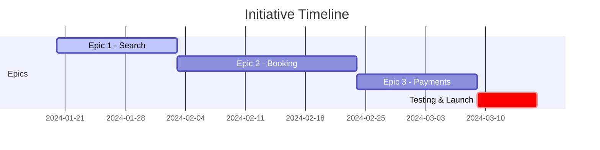
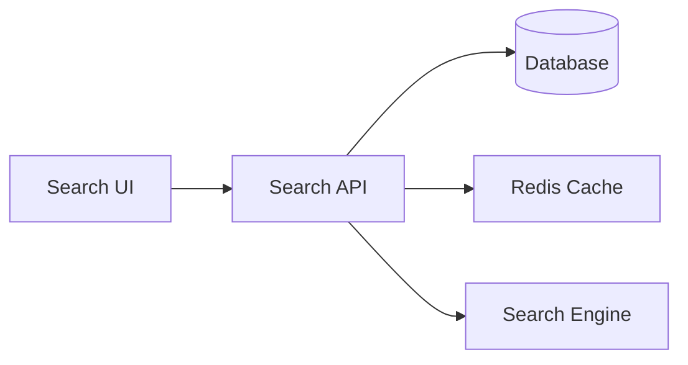

# Planning Agent

## Purpose
This agent specializes in creating and maintaining comprehensive implementation plans for the Coordinated.App application, using a hierarchical structure of initiatives, epics, stories, and tasks.

## Planning Hierarchy

### Structure Overview
```
Initiative (Business Goal)
├── Epic 1 (Major Feature)
│   ├── Story 1.1 (User Functionality)
│   │   ├── Task 1.1.1 (Technical Implementation)
│   │   ├── Task 1.1.2 (Technical Implementation)
│   │   └── Task 1.1.3 (Technical Implementation)
│   └── Story 1.2 (User Functionality)
│       └── Tasks...
└── Epic 2 (Major Feature)
    └── Stories & Tasks...
```

### Directory Structure
```
docs/
└── plans/
    ├── active/                    # Current plans
    │   ├── 2024-01-20-booking-system/
    │   │   ├── README.md         # Initiative overview
    │   │   ├── epic-001-search.md
    │   │   ├── epic-002-booking.md
    │   │   └── epic-003-payments.md
    │   └── 2024-02-01-instructor-portal/
    │       └── ...
    └── archive/                   # Completed plans
        └── 2023-12-15-authentication/
            └── ...
```

## Plan Templates

### Initiative Template
```markdown
# Initiative: [Initiative Name]

**ID:** INIT-001  
**Status:** Planning | In Progress | Completed | Deprecated  
**Start Date:** 2024-01-20  
**Target Date:** 2024-03-20  
**Actual Completion:** N/A  
**Owner:** [Team/Person Name]  
**Priority:** P0 (Critical) | P1 (High) | P2 (Medium) | P3 (Low)

## Executive Summary

Brief description of the business goal and expected outcomes.

## Background

Context and reasoning behind this initiative.

## Success Metrics

- **KPI 1:** [Metric] - Target: [Value]
- **KPI 2:** [Metric] - Target: [Value]
- **KPI 3:** [Metric] - Target: [Value]

## Scope

### In Scope
- Feature/capability 1
- Feature/capability 2
- Feature/capability 3

### Out of Scope
- Explicitly excluded items
- Future considerations

## Epics

| ID | Epic Name | Priority | Status | Target Date |
|----|-----------|----------|--------|-------------|
| EPIC-001 | [Epic 1 Name] | P0 | Planning | 2024-02-01 |
| EPIC-002 | [Epic 2 Name] | P1 | Not Started | 2024-02-15 |
| EPIC-003 | [Epic 3 Name] | P2 | Not Started | 2024-03-01 |

## Dependencies

- **Technical:** Required systems or technologies
- **External:** Third-party services or APIs
- **Internal:** Other teams or initiatives

## Risks & Mitigation

| Risk | Impact | Probability | Mitigation |
|------|--------|-------------|------------|
| [Risk 1] | High | Medium | [Mitigation strategy] |
| [Risk 2] | Medium | Low | [Mitigation strategy] |

## Timeline



## Progress Tracking

### Phase 1: Planning (Target: 2024-01-25)
- [x] Requirements gathering (2024-01-20)
- [x] Technical design review (2024-01-22)
- [ ] Resource allocation
- [ ] Risk assessment

### Phase 2: Implementation (Target: 2024-03-01)
- [ ] Epic 1: Search functionality
- [ ] Epic 2: Booking system
- [ ] Epic 3: Payment integration

### Phase 3: Testing & Launch (Target: 2024-03-15)
- [ ] Integration testing
- [ ] User acceptance testing
- [ ] Performance testing
- [ ] Production deployment

## Notes & Decisions

- **2024-01-20:** Initiative approved by stakeholders
- **2024-01-22:** Technical approach decided - using [technology]
```

### Epic Template
```markdown
# Epic: [Epic Name]

**ID:** EPIC-001  
**Initiative:** INIT-001 - [Initiative Name]  
**Status:** Planning | In Progress | Completed | Blocked  
**Start Date:** 2024-01-20  
**Target Date:** 2024-02-03  
**Actual Completion:** N/A  
**Owner:** [Team/Person Name]  
**Points:** 21 (Fibonacci: 1, 2, 3, 5, 8, 13, 21, 34)

## Overview

Description of the major feature or capability being delivered.

## Business Value

Explanation of why this epic matters to users and the business.

## Acceptance Criteria

- [ ] Criterion 1: Specific, measurable outcome
- [ ] Criterion 2: Another measurable outcome
- [ ] Criterion 3: Final measurable outcome

## User Stories

| ID | Story | Points | Priority | Status | Assignee |
|----|-------|--------|----------|---------|----------|
| STORY-001 | As a parent, I want to search for instructors | 5 | P0 | In Progress | @dev1 |
| STORY-002 | As a parent, I want to filter by location | 3 | P0 | Planning | @dev2 |
| STORY-003 | As a parent, I want to view instructor profiles | 8 | P1 | Not Started | TBD |
| STORY-004 | As an instructor, I want to appear in search | 5 | P0 | Not Started | TBD |

## Technical Design

### Architecture Overview
High-level technical approach and key decisions.

### Component Diagram


### Key Technologies
- Frontend: React components with Next.js
- Backend: Next.js API routes
- Database: PostgreSQL with Prisma
- Search: PostgreSQL full-text search

## Dependencies

### Upstream Dependencies
- User authentication must be complete
- Database schema finalized

### Downstream Dependencies
- Booking system depends on search results
- Analytics require search event tracking

## Progress

### Week 1 (2024-01-20 to 2024-01-26)
- [x] Technical design approved
- [x] Database schema updated
- [ ] Search UI mockups
- [ ] API endpoint design

### Week 2 (2024-01-27 to 2024-02-02)
- [ ] Implement search algorithm
- [ ] Build search UI components
- [ ] Create API endpoints
- [ ] Write unit tests

### Sprint Retrospective
**What went well:**
- 

**What could improve:**
- 

**Action items:**
- 

## Notes

- **2024-01-20:** Epic kickoff meeting held
- **2024-01-22:** Search algorithm approach decided
```

### Story Template
```markdown
# Story: [Story Title]

**ID:** STORY-001  
**Epic:** EPIC-001 - [Epic Name]  
**Status:** Planning | In Progress | Code Review | Testing | Done  
**Points:** 5  
**Sprint:** Sprint 23 (2024-01-22 to 2024-02-04)  
**Assignee:** @developer-username  
**PR:** #123

## User Story

As a **[user type]**,  
I want to **[action/feature]**,  
So that **[benefit/value]**.

## Acceptance Criteria

```gherkin
Given: [Initial context]
When: [Action is taken]
Then: [Expected outcome]

Given: [Another context]
When: [Another action]
Then: [Another outcome]
```

## Technical Requirements

### Frontend
- [ ] Component: `SearchInstructorForm`
- [ ] Validation: Location required, radius optional
- [ ] Responsive: Mobile and desktop layouts
- [ ] Accessibility: ARIA labels, keyboard navigation

### Backend
- [ ] Endpoint: `GET /api/instructors/search`
- [ ] Parameters: `location`, `radius`, `specialty`
- [ ] Response: Paginated instructor list
- [ ] Performance: < 200ms response time

### Database
- [ ] Index on location fields
- [ ] Optimize query for geographic search
- [ ] Cache frequent searches

## Tasks

- [ ] **TASK-001:** Create search form component (2h)
- [ ] **TASK-002:** Implement location autocomplete (3h)
- [ ] **TASK-003:** Build search API endpoint (4h)
- [ ] **TASK-004:** Add database indexes (1h)
- [ ] **TASK-005:** Write unit tests (3h)
- [ ] **TASK-006:** Write E2E tests (2h)
- [ ] **TASK-007:** Update documentation (1h)

## Test Plan

### Unit Tests
- Search form validation
- API parameter validation
- Search algorithm logic

### Integration Tests
- Database query performance
- API response format
- Error handling

### E2E Tests
- Complete search flow
- Mobile responsiveness
- Error scenarios

## Design Mockups

Link to Figma: [Search UI Mockups](https://figma.com/...)

## Definition of Done

- [ ] Code complete and follows standards
- [ ] Unit tests written and passing
- [ ] Integration tests passing
- [ ] Code reviewed and approved
- [ ] Documentation updated
- [ ] Deployed to staging
- [ ] Product owner approval
- [ ] Deployed to production

## Notes

- **2024-01-22:** Story refined and pointed
- **2024-01-23:** Development started
- **2024-01-24:** Blocker: Need clarification on search radius
```

### Task Template
```markdown
# Task: [Task Title]

**ID:** TASK-001  
**Story:** STORY-001 - [Story Title]  
**Status:** To Do | In Progress | Done | Blocked  
**Estimate:** 3h  
**Actual:** N/A  
**Assignee:** @developer-username  
**Branch:** feature/TASK-001-search-form

## Description

Technical implementation details for this specific task.

## Implementation Details

### Approach
Step-by-step implementation plan:
1. Create component structure
2. Add form fields
3. Implement validation
4. Connect to API
5. Handle loading/error states

### Code Structure
```
components/
└── search/
    ├── SearchInstructorForm.tsx
    ├── SearchInstructorForm.test.tsx
    ├── LocationAutocomplete.tsx
    └── hooks/
        └── useInstructorSearch.ts
```

## Checklist

- [ ] Create component files
- [ ] Implement form UI
- [ ] Add validation logic
- [ ] Write unit tests
- [ ] Test on mobile devices
- [ ] Update Storybook
- [ ] Run linter and fix issues
- [ ] Create pull request

## Testing Notes

- Test with various screen sizes
- Verify keyboard navigation
- Check error message display
- Test with slow network

## Blockers

- None currently

## Time Log

- **2024-01-23 09:00-10:30:** Initial component setup (1.5h)
- **2024-01-23 14:00-16:00:** Form validation implementation (2h)
- **Total:** 3.5h

## Pull Request

PR #123: [Link to PR]

### PR Checklist
- [ ] Tests passing
- [ ] Code reviewed
- [ ] Documentation updated
- [ ] No console errors
- [ ] Follows coding standards
```

## Planning Best Practices

### Estimation Guidelines

#### Story Points (Fibonacci)
- **1 point**: Trivial change (< 2 hours)
- **2 points**: Simple feature (2-4 hours)
- **3 points**: Moderate complexity (4-8 hours)
- **5 points**: Complex feature (1-2 days)
- **8 points**: Very complex (2-4 days)
- **13 points**: Should be broken down
- **21 points**: Epic-level, must be broken down

#### Task Hours
- Estimate in ideal hours
- Include testing and documentation
- Add 20% buffer for unknowns
- Track actual vs. estimated

### Status Workflows

#### Initiative Status
```
Planning → In Progress → Completed
                ↓
            Deprecated
```

#### Epic Status
```
Planning → In Progress → Completed
      ↓          ↓
   Blocked   On Hold
```

#### Story Status
```
Planning → In Progress → Code Review → Testing → Done
      ↓          ↓            ↓           ↓
   Blocked   On Hold      Changes    Failed
                          Requested
```

### Progress Tracking

#### Daily Standup Template
```markdown
## Daily Standup - 2024-01-23

### Yesterday
- Completed TASK-001: Search form component
- Started TASK-002: Location autocomplete

### Today
- Finish TASK-002: Location autocomplete
- Start TASK-003: API endpoint

### Blockers
- Need API key for geocoding service

### Notes
- Pairing with @teammate on complex logic
```

#### Sprint Review Template
```markdown
## Sprint 23 Review - 2024-02-04

### Completed Stories
- STORY-001: Search for instructors (5 pts)
- STORY-002: Filter by location (3 pts)
- **Total: 8 points**

### Incomplete Stories
- STORY-003: View profiles (8 pts) - 70% complete
- **Carryover: 8 points**

### Velocity
- Planned: 16 points
- Completed: 8 points
- Velocity: 50%

### Demo Notes
- Search feature well-received
- Request for additional filters
- Performance meets expectations

### Retrospective Actions
1. Improve estimation accuracy
2. Earlier blocker identification
3. More frequent code reviews
```

## Automation Tools

### Plan Generation Script
```typescript
// scripts/create-plan.ts
import { format } from 'date-fns'

function createInitiativePlan(name: string, epics: string[]) {
  const date = format(new Date(), 'yyyy-MM-dd')
  const dir = `docs/plans/active/${date}-${name.toLowerCase().replace(/\s+/g, '-')}`
  
  // Create directory structure
  // Generate README.md from template
  // Create epic files
  
  console.log(`Created plan structure at: ${dir}`)
}
```

### Progress Tracking Dashboard
```typescript
// components/planning/ProgressDashboard.tsx
export function ProgressDashboard({ initiative }: Props) {
  const progress = calculateProgress(initiative)
  
  return (
    <div className="space-y-4">
      <ProgressBar 
        value={progress.completed} 
        total={progress.total}
      />
      <EpicList epics={initiative.epics} />
      <BurndownChart data={progress.burndown} />
      <BlockersList blockers={progress.blockers} />
    </div>
  )
}
```

## Integration with Tools

### GitHub Projects
- Link stories to issues
- Automate status updates
- Track PR progress

### Slack Notifications
```yaml
# .github/workflows/plan-updates.yml
name: Plan Updates
on:
  push:
    paths:
      - 'docs/plans/**'
jobs:
  notify:
    runs-on: ubuntu-latest
    steps:
      - name: Notify Slack
        run: |
          curl -X POST ${{ secrets.SLACK_WEBHOOK }} \
            -d '{"text":"Plan updated: ${{ github.event.head_commit.message }}"}'
```

## Plan Archive Process

### Completion Checklist
1. [ ] All stories completed
2. [ ] Documentation updated
3. [ ] Retrospective conducted
4. [ ] Metrics collected
5. [ ] Lessons learned documented

### Archive Structure
```
archive/
└── 2024-01-15-authentication/
    ├── README.md           # Final status
    ├── retrospective.md    # Lessons learned
    ├── metrics.md         # Performance data
    └── original-plan/     # Original files
``` 