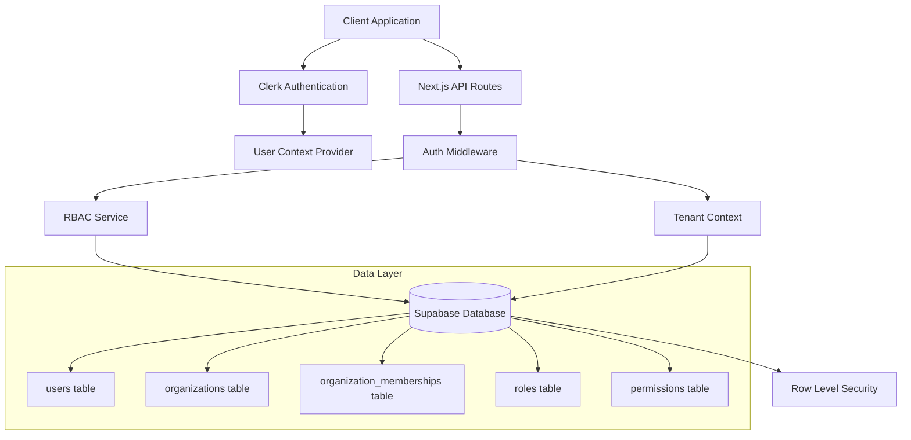
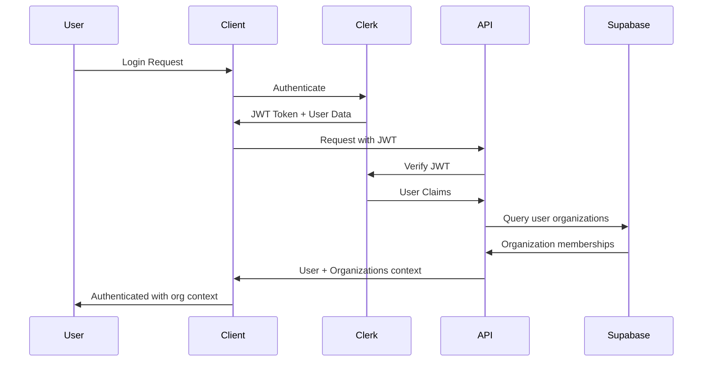

# Design Document

## Overview

The Account Management & Organizational Modeling system provides a multi-tenant architecture that supports both individual users and organizations with role-based access control. The design leverages Clerk for authentication, Supabase for data persistence with Row Level Security (RLS), and implements a context-aware permission system that dynamically adjusts user access based on their current organizational context.

The system architecture follows a tenant-per-organization model where each organization represents a separate tenant with isolated data and resources, while individual users can maintain memberships across multiple organizations.

## Architecture

### High-Level Architecture



### Authentication Flow



## Components and Interfaces

### Core Services

#### AuthenticationService
```typescript
interface AuthenticationService {
  getCurrentUser(): Promise<User | null>
  signIn(credentials: SignInCredentials): Promise<AuthResult>
  signOut(): Promise<void>
  refreshToken(): Promise<string>
}
```

#### OrganizationService
```typescript
interface OrganizationService {
  createOrganization(data: CreateOrganizationData): Promise<Organization>
  getOrganization(id: string): Promise<Organization | null>
  updateOrganization(id: string, data: UpdateOrganizationData): Promise<Organization>
  deleteOrganization(id: string): Promise<void>
  getUserOrganizations(userId: string): Promise<Organization[]>
}
```

#### MembershipService
```typescript
interface MembershipService {
  inviteUser(orgId: string, email: string, roleId: string): Promise<Invitation>
  acceptInvitation(token: string): Promise<Membership>
  removeMember(orgId: string, userId: string): Promise<void>
  updateMemberRole(orgId: string, userId: string, roleId: string): Promise<Membership>
  getOrganizationMembers(orgId: string): Promise<Membership[]>
}
```

#### RBACService
```typescript
interface RBACService {
  hasPermission(userId: string, orgId: string, permission: string): Promise<boolean>
  getUserRoles(userId: string, orgId: string): Promise<Role[]>
  getUserPermissions(userId: string, orgId: string): Promise<Permission[]>
  assignRole(userId: string, orgId: string, roleId: string): Promise<void>
  revokeRole(userId: string, orgId: string, roleId: string): Promise<void>
}
```

### Context Providers

#### UserContextProvider
Manages global user state and authentication status across the application.

```typescript
interface UserContextValue {
  user: User | null
  isLoading: boolean
  organizations: Organization[]
  currentOrganization: Organization | null
  switchOrganization: (orgId: string) => Promise<void>
  refreshUser: () => Promise<void>
}
```

#### OrganizationContextProvider
Manages the current organizational context and associated permissions.

```typescript
interface OrganizationContextValue {
  organization: Organization | null
  membership: Membership | null
  permissions: Permission[]
  roles: Role[]
  canAccess: (resource: string, action: string) => boolean
}
```

### UI Components

#### AccountManagement
- User profile management
- Password/security settings
- Account preferences
- Multi-factor authentication setup

#### OrganizationDashboard
- Organization overview and settings
- Member management interface
- Role and permission assignment
- Invitation management

#### OrganizationSwitcher
- Dropdown component for switching between organizations
- Visual indication of current organization
- Quick access to organization settings

## Data Models

### Database Schema

```sql
-- Users table (managed by Clerk, extended with custom fields)
CREATE TABLE users (
  id UUID PRIMARY KEY DEFAULT gen_random_uuid(),
  clerk_user_id TEXT UNIQUE NOT NULL,
  email TEXT NOT NULL,
  first_name TEXT,
  last_name TEXT,
  avatar_url TEXT,
  preferences JSONB DEFAULT '{}',
  created_at TIMESTAMP WITH TIME ZONE DEFAULT NOW(),
  updated_at TIMESTAMP WITH TIME ZONE DEFAULT NOW()
);

-- Organizations table
CREATE TABLE organizations (
  id UUID PRIMARY KEY DEFAULT gen_random_uuid(),
  name TEXT NOT NULL,
  slug TEXT UNIQUE NOT NULL,
  description TEXT,
  avatar_url TEXT,
  metadata JSONB DEFAULT '{}',
  settings JSONB DEFAULT '{}',
  created_at TIMESTAMP WITH TIME ZONE DEFAULT NOW(),
  updated_at TIMESTAMP WITH TIME ZONE DEFAULT NOW()
);

-- Organization memberships
CREATE TABLE organization_memberships (
  id UUID PRIMARY KEY DEFAULT gen_random_uuid(),
  user_id UUID REFERENCES users(id) ON DELETE CASCADE,
  organization_id UUID REFERENCES organizations(id) ON DELETE CASCADE,
  role_id UUID REFERENCES roles(id),
  status TEXT DEFAULT 'active' CHECK (status IN ('active', 'inactive', 'pending')),
  joined_at TIMESTAMP WITH TIME ZONE DEFAULT NOW(),
  created_at TIMESTAMP WITH TIME ZONE DEFAULT NOW(),
  updated_at TIMESTAMP WITH TIME ZONE DEFAULT NOW(),
  UNIQUE(user_id, organization_id)
);

-- Roles table
CREATE TABLE roles (
  id UUID PRIMARY KEY DEFAULT gen_random_uuid(),
  name TEXT NOT NULL,
  description TEXT,
  organization_id UUID REFERENCES organizations(id) ON DELETE CASCADE,
  is_system_role BOOLEAN DEFAULT FALSE,
  permissions TEXT[] DEFAULT '{}',
  created_at TIMESTAMP WITH TIME ZONE DEFAULT NOW(),
  updated_at TIMESTAMP WITH TIME ZONE DEFAULT NOW(),
  UNIQUE(name, organization_id)
);

-- Permissions table
CREATE TABLE permissions (
  id UUID PRIMARY KEY DEFAULT gen_random_uuid(),
  name TEXT UNIQUE NOT NULL,
  description TEXT,
  resource TEXT NOT NULL,
  action TEXT NOT NULL,
  created_at TIMESTAMP WITH TIME ZONE DEFAULT NOW()
);

-- Invitations table
CREATE TABLE invitations (
  id UUID PRIMARY KEY DEFAULT gen_random_uuid(),
  organization_id UUID REFERENCES organizations(id) ON DELETE CASCADE,
  email TEXT NOT NULL,
  role_id UUID REFERENCES roles(id),
  invited_by UUID REFERENCES users(id),
  token TEXT UNIQUE NOT NULL,
  status TEXT DEFAULT 'pending' CHECK (status IN ('pending', 'accepted', 'expired', 'revoked')),
  expires_at TIMESTAMP WITH TIME ZONE NOT NULL,
  created_at TIMESTAMP WITH TIME ZONE DEFAULT NOW(),
  updated_at TIMESTAMP WITH TIME ZONE DEFAULT NOW()
);

-- Audit log table
CREATE TABLE audit_logs (
  id UUID PRIMARY KEY DEFAULT gen_random_uuid(),
  user_id UUID REFERENCES users(id),
  organization_id UUID REFERENCES organizations(id),
  action TEXT NOT NULL,
  resource_type TEXT NOT NULL,
  resource_id TEXT,
  metadata JSONB DEFAULT '{}',
  ip_address INET,
  user_agent TEXT,
  created_at TIMESTAMP WITH TIME ZONE DEFAULT NOW()
);
```

### TypeScript Interfaces

```typescript
interface User {
  id: string
  clerkUserId: string
  email: string
  firstName?: string
  lastName?: string
  avatarUrl?: string
  preferences: Record<string, any>
  createdAt: Date
  updatedAt: Date
}

interface Organization {
  id: string
  name: string
  slug: string
  description?: string
  avatarUrl?: string
  metadata: Record<string, any>
  settings: Record<string, any>
  createdAt: Date
  updatedAt: Date
}

interface Membership {
  id: string
  userId: string
  organizationId: string
  roleId: string
  status: 'active' | 'inactive' | 'pending'
  joinedAt: Date
  createdAt: Date
  updatedAt: Date
  user?: User
  organization?: Organization
  role?: Role
}

interface Role {
  id: string
  name: string
  description?: string
  organizationId: string
  isSystemRole: boolean
  permissions: string[]
  createdAt: Date
  updatedAt: Date
}

interface Permission {
  id: string
  name: string
  description?: string
  resource: string
  action: string
  createdAt: Date
}
```

## Error Handling

### Authentication Errors
- **InvalidCredentials**: User provides incorrect login information
- **AccountLocked**: Account temporarily locked due to security concerns
- **TokenExpired**: JWT token has expired and needs refresh
- **UnauthorizedAccess**: User lacks permission for requested resource

### Organization Errors
- **OrganizationNotFound**: Requested organization doesn't exist
- **InsufficientPermissions**: User lacks required role/permission
- **DuplicateOrganization**: Organization name/slug already exists
- **MembershipLimitExceeded**: Organization has reached member limit

### Validation Errors
- **InvalidEmail**: Email format validation failed
- **RequiredFieldMissing**: Required form field not provided
- **InvalidSlug**: Organization slug contains invalid characters
- **PasswordTooWeak**: Password doesn't meet security requirements

### Error Response Format
```typescript
interface ErrorResponse {
  error: {
    code: string
    message: string
    details?: Record<string, any>
    timestamp: string
    requestId: string
  }
}
```

## Testing Strategy

### Unit Testing
- **Service Layer**: Test all business logic in isolation
- **Utility Functions**: Test permission checking, validation functions
- **Data Models**: Test model validation and transformation
- **Context Providers**: Test state management and context switching

### Integration Testing
- **Authentication Flow**: End-to-end authentication with Clerk
- **Database Operations**: Test CRUD operations with RLS policies
- **API Endpoints**: Test all REST endpoints with various user contexts
- **Permission System**: Test RBAC enforcement across different scenarios

### End-to-End Testing
- **User Registration**: Complete user onboarding flow
- **Organization Creation**: Create organization and invite members
- **Role Management**: Assign roles and verify permission changes
- **Context Switching**: Switch between organizations and verify access

### Security Testing
- **Authorization**: Verify users can only access permitted resources
- **Tenant Isolation**: Ensure cross-tenant data access is prevented
- **Input Validation**: Test against injection attacks and malformed data
- **Session Management**: Test token expiration and refresh flows

### Test Data Management
- **Fixtures**: Predefined test users, organizations, and roles
- **Factories**: Dynamic test data generation for various scenarios
- **Cleanup**: Automated test data cleanup between test runs
- **Seeding**: Database seeding for consistent test environments

### Performance Testing
- **Permission Checks**: Measure RBAC query performance
- **Context Switching**: Test organization switching response times
- **Concurrent Users**: Test system behavior under load
- **Database Queries**: Optimize and test query performance with RLS