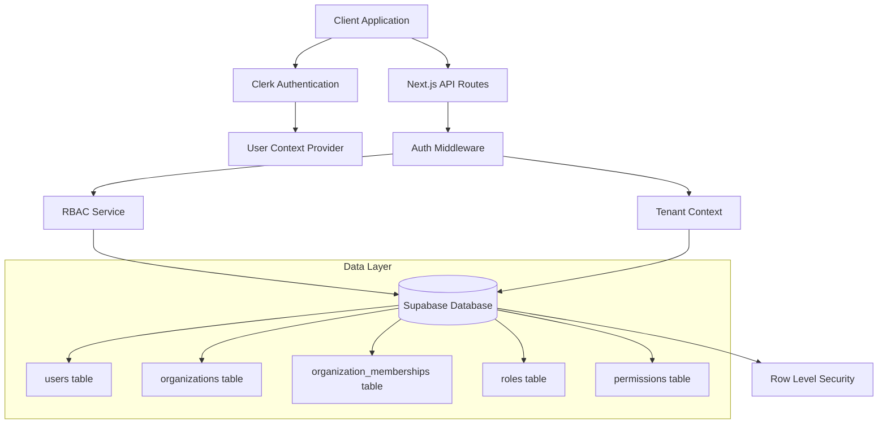
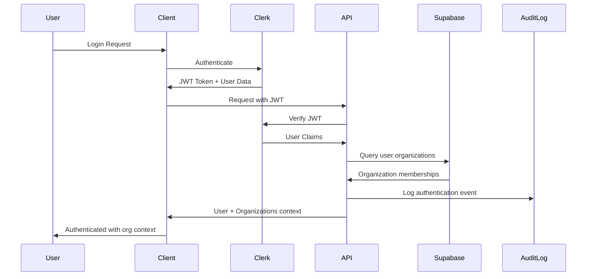
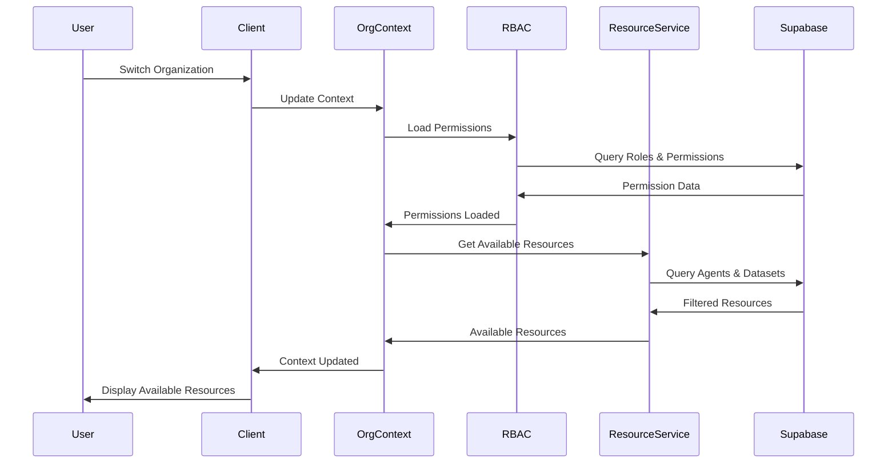

# Design Document

## Overview

The Account Management & Organizational Modeling system provides a multi-tenant architecture that supports both individual users and organizations with role-based access control. The design leverages Clerk for authentication, Supabase for data persistence with Row Level Security (RLS), and implements a context-aware permission system that dynamically adjusts user access based on their current organizational context.

The system architecture follows a tenant-per-organization model where each organization represents a separate tenant with isolated data and resources, while individual users can maintain memberships across multiple organizations. This design ensures that organizational context determines access to platform resources including agents and datasets, with comprehensive audit logging for security and compliance monitoring.

**Key Design Decisions:**
- **Clerk Integration**: Chosen for robust authentication with built-in session management and security features, following Clerk's official testing guidelines for E2E tests
- **Tenant-per-Organization Model**: Provides clear isolation boundaries and simplifies permission management
- **Context-Aware Permissions**: Dynamic permission evaluation based on current organizational context enables seamless multi-organization workflows
- **Supabase RLS**: Database-level security enforcement ensures data isolation even if application logic fails
- **Vercel Deployment**: Architecture optimized for Vercel's edge network with serverless functions and edge middleware
- **Existing Schema Alignment**: Integrates with existing Supabase schema and follows established patterns for database interactions
- **Real Service Testing**: Integration tests use real Supabase, Clerk, and Phase.dev services with proper test data lifecycle management

## Architecture

### High-Level Architecture


```mermaid
graph TB
    Client[Client Application] --> Auth[Clerk Authentication]
    Client --> API[Next.js API Routes]
    
    Auth --> UserCtx[User Context Provider]
    API --> AuthMiddleware[Auth Middleware]
    
    AuthMiddleware --> RBAC[RBAC Service]
    AuthMiddleware --> TenantCtx[Tenant Context]
    
    RBAC --> DB[(Supabase Database)]
    TenantCtx --> DB
    
    DB --> RLS[Row Level Security]
    
    subgraph "Data Layer"
        DB --> Users[users table]
        DB --> Orgs[organizations table]
        DB --> Memberships[organization_memberships table]
        DB --> Roles[roles table]
        DB --> Permissions[permissions table]
    end
```

### Authentication Flow


```mermaid
sequenceDiagram
    participant User
    participant Client
    participant Clerk
    participant API
    participant Supabase
    participant AuditLog
    
    User->>Client: Login Request
    Client->>Clerk: Authenticate
    Clerk->>Client: JWT Token + User Data
    Client->>API: Request with JWT
    API->>Clerk: Verify JWT
    Clerk->>API: User Claims
    API->>Supabase: Query user organizations
    Supabase->>API: Organization memberships
    API->>AuditLog: Log authentication event
    API->>Client: User + Organizations context
    Client->>User: Authenticated with org context
```

### Resource Access Flow


```mermaid
sequenceDiagram
    participant User
    participant Client
    participant OrgContext
    participant RBAC
    participant ResourceService
    participant Supabase
    
    User->>Client: Switch Organization
    Client->>OrgContext: Update Context
    OrgContext->>RBAC: Load Permissions
    RBAC->>Supabase: Query Roles & Permissions
    Supabase->>RBAC: Permission Data
    RBAC->>OrgContext: Permissions Loaded
    OrgContext->>ResourceService: Get Available Resources
    ResourceService->>Supabase: Query Agents & Datasets
    Supabase->>ResourceService: Filtered Resources
    ResourceService->>OrgContext: Available Resources
    OrgContext->>Client: Context Updated
    Client->>User: Display Available Resources
```

**Design Rationale**: The resource access flow demonstrates how organizational context changes trigger permission evaluation and resource filtering (Requirement 7.4). This ensures users only see resources available to their current organizational context.

## Components and Interfaces

### Audit Logging Architecture

The audit logging system captures all significant actions across the platform with comprehensive metadata for security monitoring and compliance.

#### AuditService
```typescript
interface AuditService {
  logAction(params: AuditLogParams): Promise<void>
  logSecurityEvent(params: SecurityEventParams): Promise<void>
  queryLogs(filters: AuditLogFilters): Promise<PaginatedAuditLogs>
  generateAlert(event: AuditLog): Promise<void>
  ensureAvailability(): Promise<boolean>
}

interface AuditLogParams {
  userId: string
  organizationId?: string
  action: string
  resourceType: string
  resourceId?: string
  metadata?: Record<string, any>
  severity?: 'info' | 'warning' | 'error' | 'critical'
  isSecurityEvent?: boolean
}

interface AuditLogFilters {
  userId?: string
  organizationId?: string
  action?: string
  resourceType?: string
  startDate?: Date
  endDate?: Date
  severity?: string[]
  isSecurityEvent?: boolean
  page?: number
  pageSize?: number
}
```

**Design Rationale**: The audit service provides comprehensive logging with filtering capabilities (Requirement 8.3), security event detection (Requirement 8.4), and resilience to ensure service availability even if logging fails (Requirement 8.5). All authentication, profile changes, and organizational modifications are automatically logged.

### Core Services

#### AuthenticationService
```typescript
interface AuthenticationService {
  getCurrentUser(): Promise<User | null>
  signIn(credentials: SignInCredentials): Promise<AuthResult>
  signOut(): Promise<void>
  refreshToken(): Promise<string>
}
```

#### OrganizationService
```typescript
interface OrganizationService {
  createOrganization(data: CreateOrganizationData): Promise<Organization>
  getOrganization(id: string): Promise<Organization | null>
  updateOrganization(id: string, data: UpdateOrganizationData): Promise<Organization>
  deleteOrganization(id: string): Promise<void>
  getUserOrganizations(userId: string): Promise<Organization[]>
}
```

#### MembershipService
```typescript
interface MembershipService {
  inviteUser(orgId: string, email: string, roleId: string): Promise<Invitation>
  acceptInvitation(token: string): Promise<Membership>
  removeMember(orgId: string, userId: string): Promise<void>
  updateMemberRole(orgId: string, userId: string, roleId: string): Promise<Membership>
  getOrganizationMembers(orgId: string): Promise<Membership[]>
}
```

#### RBACService
```typescript
interface RBACService {
  hasPermission(userId: string, orgId: string, permission: string): Promise<boolean>
  getUserRoles(userId: string, orgId: string): Promise<Role[]>
  getUserPermissions(userId: string, orgId: string): Promise<Permission[]>
  assignRole(userId: string, orgId: string, roleId: string): Promise<void>
  revokeRole(userId: string, orgId: string, roleId: string): Promise<void>
  refreshUserPermissions(userId: string, orgId: string): Promise<void>
  validateResourceAccess(userId: string, orgId: string, resourceType: string, resourceId: string): Promise<boolean>
}
```

**Design Rationale**: The RBAC service provides centralized permission management with real-time permission refresh capabilities (Requirement 6.4) and resource-level access validation for agents and datasets (Requirement 7).

### Context Providers

#### UserContextProvider
Manages global user state and authentication status across the application.

```typescript
interface UserContextValue {
  user: User | null
  isLoading: boolean
  organizations: Organization[]
  currentOrganization: Organization | null
  switchOrganization: (orgId: string) => Promise<void>
  refreshUser: () => Promise<void>
  hasIndividualContext: boolean
}
```

**Design Rationale**: The user context tracks whether the user is operating in individual account mode (Requirement 3.5) and provides organization switching capabilities that trigger resource access updates (Requirement 3.2).

#### OrganizationContextProvider
Manages the current organizational context and associated permissions.

```typescript
interface OrganizationContextValue {
  organization: Organization | null
  membership: Membership | null
  permissions: Permission[]
  roles: Role[]
  canAccess: (resource: string, action: string) => boolean
  availableAgents: Agent[]
  availableDatasets: Dataset[]
  refreshContext: () => Promise<void>
}
```

**Design Rationale**: The context provider includes agent and dataset availability (Requirement 7.1, 7.2) and provides a refresh mechanism to update permissions without re-authentication (Requirement 6.4). This ensures that organizational context changes immediately reflect in resource access.

### Permission Refresh Mechanism

The system implements real-time permission updates without requiring user re-authentication:

```typescript
interface PermissionRefreshService {
  subscribeToRoleChanges(userId: string, orgId: string, callback: (permissions: Permission[]) => void): () => void
  notifyPermissionChange(userId: string, orgId: string): Promise<void>
  invalidatePermissionCache(userId: string, orgId: string): Promise<void>
}
```

**Design Rationale**: When an administrator changes a user's role (Requirement 4.2), the system:
1. Updates the role assignment in the database
2. Invalidates the permission cache for that user/organization
3. Notifies active sessions via WebSocket or polling
4. Client-side context automatically refreshes permissions
5. UI updates to reflect new access levels immediately

This ensures permission changes take effect immediately (Requirement 4.1) without forcing users to log out and back in (Requirement 6.4).

### Resource Access Management

#### ResourceAccessService
Manages access to organizational resources (agents and datasets) based on context.

```typescript
interface ResourceAccessService {
  getAvailableAgents(userId: string, orgId: string): Promise<Agent[]>
  getAvailableDatasets(userId: string, orgId: string): Promise<Dataset[]>
  associateResourceWithOrg(resourceType: string, resourceId: string, orgId: string): Promise<void>
  validateResourceAccess(userId: string, orgId: string, resourceType: string, resourceId: string): Promise<boolean>
  revokeResourceAccess(userId: string, orgId: string): Promise<void>
}
```

**Design Rationale**: Centralized resource access management ensures consistent enforcement of organizational context across all platform resources (Requirement 7). The service integrates with RBAC to provide fine-grained access control and automatically updates available resources when organizational context changes.

### Tenant Isolation Enforcement

Multi-layered tenant isolation ensures data security:

#### Database Layer (RLS Policies)
```sql
-- Example RLS policy for organizations table
CREATE POLICY "Users can only access their organizations"
ON organizations
FOR SELECT
USING (
  id IN (
    SELECT organization_id 
    FROM organization_memberships 
    WHERE user_id = auth.uid()
  )
);

-- Example RLS policy for agents
CREATE POLICY "Users can only access organization agents"
ON agents
FOR SELECT
USING (
  organization_id IN (
    SELECT organization_id 
    FROM organization_memberships 
    WHERE user_id = auth.uid()
  )
);
```

#### Application Layer
```typescript
interface TenantIsolationService {
  validateTenantAccess(userId: string, orgId: string): Promise<boolean>
  enforceTenantBoundary(userId: string, orgId: string, operation: string): Promise<void>
  logTenantViolation(userId: string, attemptedOrgId: string, operation: string): Promise<void>
}
```

**Design Rationale**: 
- **Database RLS**: First line of defense, enforces isolation even if application logic fails (Requirement 5.1, 5.3)
- **Application Validation**: Explicit checks before operations (Requirement 5.2)
- **Violation Logging**: Security events logged for monitoring (Requirement 5.5)
- **Context Switching**: Prevents cross-tenant access during organization switches (Requirement 5.4)

### UI Components

#### AccountManagement
- User profile management
- Password/security settings
- Account preferences
- Multi-factor authentication setup
- Duplicate account prevention feedback (Requirement 1.5)

#### OrganizationDashboard
- Organization overview and settings
- Member management interface
- Role and permission assignment with immediate application (Requirement 4.1)
- Invitation management
- Audit log viewer for administrators (Requirement 8.3)

#### OrganizationSwitcher
- Dropdown component for switching between organizations
- Visual indication of current organization
- Quick access to organization settings
- Resource availability preview (agents/datasets count)
- Individual account context option (Requirement 3.5)

## Data Models

### Database Schema

```sql
-- Users table (managed by Clerk, extended with custom fields)
CREATE TABLE users (
  id UUID PRIMARY KEY DEFAULT gen_random_uuid(),
  clerk_user_id TEXT UNIQUE NOT NULL,
  email TEXT NOT NULL,
  first_name TEXT,
  last_name TEXT,
  avatar_url TEXT,
  preferences JSONB DEFAULT '{}',
  created_at TIMESTAMP WITH TIME ZONE DEFAULT NOW(),
  updated_at TIMESTAMP WITH TIME ZONE DEFAULT NOW()
);

-- Organizations table
CREATE TABLE organizations (
  id UUID PRIMARY KEY DEFAULT gen_random_uuid(),
  name TEXT NOT NULL,
  slug TEXT UNIQUE NOT NULL,
  description TEXT,
  avatar_url TEXT,
  metadata JSONB DEFAULT '{}',
  settings JSONB DEFAULT '{}',
  created_at TIMESTAMP WITH TIME ZONE DEFAULT NOW(),
  updated_at TIMESTAMP WITH TIME ZONE DEFAULT NOW()
);

-- Organization memberships
CREATE TABLE organization_memberships (
  id UUID PRIMARY KEY DEFAULT gen_random_uuid(),
  user_id UUID REFERENCES users(id) ON DELETE CASCADE,
  organization_id UUID REFERENCES organizations(id) ON DELETE CASCADE,
  role_id UUID REFERENCES roles(id),
  status TEXT DEFAULT 'active' CHECK (status IN ('active', 'inactive', 'pending')),
  joined_at TIMESTAMP WITH TIME ZONE DEFAULT NOW(),
  created_at TIMESTAMP WITH TIME ZONE DEFAULT NOW(),
  updated_at TIMESTAMP WITH TIME ZONE DEFAULT NOW(),
  UNIQUE(user_id, organization_id)
);

-- Roles table
CREATE TABLE roles (
  id UUID PRIMARY KEY DEFAULT gen_random_uuid(),
  name TEXT NOT NULL,
  description TEXT,
  organization_id UUID REFERENCES organizations(id) ON DELETE CASCADE,
  is_system_role BOOLEAN DEFAULT FALSE,
  permissions TEXT[] DEFAULT '{}',
  created_at TIMESTAMP WITH TIME ZONE DEFAULT NOW(),
  updated_at TIMESTAMP WITH TIME ZONE DEFAULT NOW(),
  UNIQUE(name, organization_id)
);

-- Permissions table
CREATE TABLE permissions (
  id UUID PRIMARY KEY DEFAULT gen_random_uuid(),
  name TEXT UNIQUE NOT NULL,
  description TEXT,
  resource TEXT NOT NULL,
  action TEXT NOT NULL,
  created_at TIMESTAMP WITH TIME ZONE DEFAULT NOW()
);

-- Invitations table
CREATE TABLE invitations (
  id UUID PRIMARY KEY DEFAULT gen_random_uuid(),
  organization_id UUID REFERENCES organizations(id) ON DELETE CASCADE,
  email TEXT NOT NULL,
  role_id UUID REFERENCES roles(id),
  invited_by UUID REFERENCES users(id),
  token TEXT UNIQUE NOT NULL,
  status TEXT DEFAULT 'pending' CHECK (status IN ('pending', 'accepted', 'expired', 'revoked')),
  expires_at TIMESTAMP WITH TIME ZONE NOT NULL,
  created_at TIMESTAMP WITH TIME ZONE DEFAULT NOW(),
  updated_at TIMESTAMP WITH TIME ZONE DEFAULT NOW()
);

-- Audit log table
CREATE TABLE audit_logs (
  id UUID PRIMARY KEY DEFAULT gen_random_uuid(),
  user_id UUID REFERENCES users(id),
  organization_id UUID REFERENCES organizations(id),
  action TEXT NOT NULL,
  resource_type TEXT NOT NULL,
  resource_id TEXT,
  metadata JSONB DEFAULT '{}',
  ip_address INET,
  user_agent TEXT,
  severity TEXT DEFAULT 'info' CHECK (severity IN ('info', 'warning', 'error', 'critical')),
  is_security_event BOOLEAN DEFAULT FALSE,
  created_at TIMESTAMP WITH TIME ZONE DEFAULT NOW()
);

-- Indexes for audit log queries
CREATE INDEX idx_audit_logs_user_id ON audit_logs(user_id);
CREATE INDEX idx_audit_logs_organization_id ON audit_logs(organization_id);
CREATE INDEX idx_audit_logs_created_at ON audit_logs(created_at DESC);
CREATE INDEX idx_audit_logs_security_events ON audit_logs(is_security_event) WHERE is_security_event = TRUE;
CREATE INDEX idx_audit_logs_action ON audit_logs(action);
```

**Design Rationale**: Enhanced audit logging with severity levels and security event flagging (Requirement 8.4) enables efficient filtering and alerting. Indexes optimize query performance for searchable, filterable activity history (Requirement 8.3).

### TypeScript Interfaces

```typescript
interface User {
  id: string
  clerkUserId: string
  email: string
  firstName?: string
  lastName?: string
  avatarUrl?: string
  preferences: Record<string, any>
  createdAt: Date
  updatedAt: Date
}

interface Organization {
  id: string
  name: string
  slug: string
  description?: string
  avatarUrl?: string
  metadata: Record<string, any>
  settings: Record<string, any>
  createdAt: Date
  updatedAt: Date
}

interface Membership {
  id: string
  userId: string
  organizationId: string
  roleId: string
  status: 'active' | 'inactive' | 'pending'
  joinedAt: Date
  createdAt: Date
  updatedAt: Date
  user?: User
  organization?: Organization
  role?: Role
}

interface Role {
  id: string
  name: string
  description?: string
  organizationId: string
  isSystemRole: boolean
  permissions: string[]
  createdAt: Date
  updatedAt: Date
}

interface Permission {
  id: string
  name: string
  description?: string
  resource: string
  action: string
  createdAt: Date
}

interface AuditLog {
  id: string
  userId: string
  organizationId?: string
  action: string
  resourceType: string
  resourceId?: string
  metadata: Record<string, any>
  ipAddress?: string
  userAgent?: string
  severity: 'info' | 'warning' | 'error' | 'critical'
  isSecurityEvent: boolean
  createdAt: Date
}

interface Agent {
  id: string
  name: string
  organizationId: string
  createdBy: string
  permissions: string[]
  createdAt: Date
  updatedAt: Date
}

interface Dataset {
  id: string
  name: string
  organizationId: string
  createdBy: string
  permissions: string[]
  createdAt: Date
  updatedAt: Date
}
```

**Design Rationale**: These interfaces support audit logging (Requirement 8) and resource access management (Requirement 7). The Agent and Dataset interfaces include organizational association and permission metadata for fine-grained access control.

## Error Handling

### Authentication Errors
- **InvalidCredentials**: User provides incorrect login information (Requirement 1.2)
- **AccountLocked**: Account temporarily locked due to security concerns
- **TokenExpired**: JWT token has expired and needs refresh
- **UnauthorizedAccess**: User lacks permission for requested resource (Requirement 6.3)
- **AuthenticationFailed**: General authentication failure preventing all access (Requirement 6.5)

### Organization Errors
- **OrganizationNotFound**: Requested organization doesn't exist
- **InsufficientPermissions**: User lacks required role/permission (Requirement 4.3, 6.3)
- **DuplicateOrganization**: Organization name/slug already exists (Requirement 2.5)
- **MembershipLimitExceeded**: Organization has reached member limit
- **TenantIsolationViolation**: Attempted cross-tenant data access (Requirement 5.5)

### Validation Errors
- **InvalidEmail**: Email format validation failed
- **RequiredFieldMissing**: Required form field not provided (Requirement 1.4)
- **InvalidSlug**: Organization slug contains invalid characters
- **PasswordTooWeak**: Password doesn't meet security requirements
- **DuplicateAccount**: Attempted registration with existing email (Requirement 1.5)

### Resource Access Errors
- **ResourceAccessDenied**: User lacks permission to access specific agent or dataset (Requirement 7.5)
- **OrganizationContextRequired**: Operation requires active organizational context (Requirement 3.5)

### Error Response Format
```typescript
interface ErrorResponse {
  error: {
    code: string
    message: string
    details?: Record<string, any>
    timestamp: string
    requestId: string
  }
}
```

**Design Rationale**: Comprehensive error taxonomy covers all requirement scenarios with specific error codes for client-side handling and user feedback. Each error type maps to specific acceptance criteria for traceability.

## Testing Strategy

### Unit Testing
- **Service Layer**: Test all business logic in isolation with 100% coverage requirement
- **Utility Functions**: Test permission checking, validation functions
- **Data Models**: Test model validation and transformation with 95% coverage requirement
- **Context Providers**: Test state management and context switching
- **Permission Refresh**: Test real-time permission updates without re-authentication (Requirement 6.4)

### Integration Testing
**CRITICAL**: All integration tests MUST use real services (Supabase, Clerk, Phase.dev) with proper test data lifecycle management.

- **Authentication Flow**: End-to-end authentication with Clerk using @clerk/testing utilities
- **Database Operations**: Test CRUD operations with RLS policies using real Supabase instance
  - Test data created at test start, cleaned up at test end
  - Unique identifiers (UUIDs, timestamps) ensure parallel execution safety
  - No shared test data between test runs
- **API Endpoints**: Test all REST endpoints with various user contexts (90% coverage requirement)
  - Each test creates its own users, organizations, and memberships
  - Cleanup ensures no data pollution between tests
- **Permission System**: Test RBAC enforcement across different scenarios with real database queries
- **Resource Access**: Test agent and dataset filtering based on organizational context (Requirement 7)
- **Audit Logging**: Verify all actions are logged with proper metadata (Requirement 8)
- **Idempotency**: All tests can run multiple times without side effects
- **Parallel Execution**: Tests use isolated data and can run concurrently

**Test Data Lifecycle Pattern:**
```typescript
describe('Integration Test Suite', () => {
  let testContext: TestContext
  
  beforeEach(async () => {
    // Create isolated test data with unique identifiers
    testContext = await createTestContext({
      userId: `test_user_${Date.now()}_${Math.random()}`,
      orgId: `test_org_${Date.now()}_${Math.random()}`
    })
  })
  
  afterEach(async () => {
    // Clean up all test data
    await cleanupTestContext(testContext)
  })
  
  it('should test with real services', async () => {
    // Test uses real Supabase, Clerk, etc.
    // Data is isolated and will be cleaned up
  })
})
```

### End-to-End Testing
**CRITICAL**: All E2E tests MUST follow Clerk's official authentication guidelines and manage their own seed data.

- **Clerk Authentication Pattern**: Use Clerk's recommended E2E testing approach
  ```typescript
  // Follow Clerk's official E2E testing methodology
  import { clerkSetup } from '@clerk/testing/playwright'
  
  test.beforeEach(async ({ page }) => {
    await clerkSetup({
      page,
      signInUrl: '/sign-in'
    })
  })
  ```

- **Seed Data Management**: Each E2E test creates and manages its own data
  ```typescript
  test('user registration flow', async ({ page }) => {
    // Create unique test user data
    const testUser = {
      email: `test_${Date.now()}@example.com`,
      password: generateSecurePassword()
    }
    
    // Test registration flow
    await page.goto('/sign-up')
    // ... test steps ...
    
    // Cleanup: Delete test user after test
    await cleanupTestUser(testUser.email)
  })
  ```

- **Idempotent Test Design**: Tests can run multiple times without conflicts
  - Unique email addresses for each test run
  - Unique organization names with timestamps
  - Cleanup ensures no residual data

- **Test Scenarios**:
  - **User Registration**: Complete user onboarding flow with duplicate prevention (Requirement 1.5)
  - **Organization Creation**: Create organization and invite members with unique naming enforcement (Requirement 2.5)
  - **Role Management**: Assign roles and verify immediate permission application (Requirement 4.1)
  - **Context Switching**: Switch between organizations and verify resource access updates (Requirement 3.2, 7.4)
  - **Multi-Organization Workflow**: Test user working across multiple organizations (Requirement 3)

- **Parallel Execution Support**: 
  - Each test uses unique identifiers
  - No shared state between tests
  - Database transactions or cleanup ensure isolation

### Security Testing
- **Authorization**: Verify users can only access permitted resources (Requirement 6.2)
- **Tenant Isolation**: Ensure cross-tenant data access is prevented with security event logging (Requirement 5.4, 5.5)
- **Input Validation**: Test against injection attacks and malformed data
- **Session Management**: Test token expiration and refresh flows
- **Permission Conflicts**: Verify most restrictive permissions applied (Requirement 4.5)
- **Resource Revocation**: Test immediate access restriction on role/membership changes (Requirement 7.5)

### Audit and Compliance Testing
- **Audit Log Coverage**: Verify all authentication and profile changes logged (Requirement 8.1)
- **Organizational Changes**: Verify membership, role, and permission modifications logged (Requirement 8.2)
- **Log Searchability**: Test filtering and searching audit history (Requirement 8.3)
- **Security Alerts**: Verify security events generate proper alerts (Requirement 8.4)
- **Audit Resilience**: Test system maintains availability if audit logging fails (Requirement 8.5)

### Test Data Management

**CRITICAL**: Complete lifecycle management with no datastore pollution.

#### Test Context Factory
```typescript
interface TestContext {
  users: TestUser[]
  organizations: TestOrganization[]
  memberships: TestMembership[]
  cleanup: () => Promise<void>
}

async function createTestContext(options?: TestContextOptions): Promise<TestContext> {
  const timestamp = Date.now()
  const random = Math.random().toString(36).substring(7)
  
  // Create isolated test data with unique identifiers
  const users = await createTestUsers({
    prefix: `test_${timestamp}_${random}`,
    count: options?.userCount || 1
  })
  
  const organizations = await createTestOrganizations({
    prefix: `test_org_${timestamp}_${random}`,
    count: options?.orgCount || 1
  })
  
  // Track all created resources for cleanup
  return {
    users,
    organizations,
    memberships: [],
    cleanup: async () => {
      // Delete in reverse dependency order
      await deleteTestMemberships(memberships)
      await deleteTestOrganizations(organizations)
      await deleteTestUsers(users)
    }
  }
}
```

#### Idempotent Test Pattern
```typescript
describe('Organization Management', () => {
  let context: TestContext
  
  beforeEach(async () => {
    // Create fresh, isolated test data
    context = await createTestContext({
      userCount: 2,
      orgCount: 1
    })
  })
  
  afterEach(async () => {
    // Guaranteed cleanup - runs even if test fails
    await context.cleanup()
  })
  
  it('should handle organization creation', async () => {
    // Test uses context.users, context.organizations
    // No shared state with other tests
    // Can run in parallel with other tests
  })
})
```

#### Parallel Execution Safety
```typescript
// Each test gets unique identifiers
const uniqueEmail = `test_${Date.now()}_${Math.random()}@example.com`
const uniqueOrgSlug = `test-org-${Date.now()}-${Math.random().toString(36)}`

// Database queries use these unique identifiers
// No conflicts between parallel test runs
```

**Test Data Principles**:
- **Isolation**: Each test creates its own data
- **Uniqueness**: Timestamps and random strings prevent conflicts
- **Cleanup**: Guaranteed cleanup in afterEach hooks
- **No Pollution**: Tests leave no residual data
- **Parallel Safe**: Tests can run concurrently
- **Idempotent**: Multiple runs produce same results

### Performance Testing
- **Permission Checks**: Measure RBAC query performance with caching
- **Context Switching**: Test organization switching response times
- **Concurrent Users**: Test system behavior under load
- **Database Queries**: Optimize and test query performance with RLS
- **Audit Log Performance**: Test high-volume logging scenarios

**Testing Framework Requirements:**
- Use Vitest with proper memory management (NODE_OPTIONS="--max-old-space-size=8192")
- Use @clerk/testing for official Clerk integration testing
- Never mock Phase.dev - use real API calls with PHASE_SERVICE_TOKEN
- Enforce tiered coverage: Services 100%, Models 95%, API Routes 90%, Global 85%
- **100% Test Pass Rate Required**: All tests must pass for task completion
- **Real Services Priority**: Integration tests use real Supabase, Clerk, Phase.dev
- **Test Data Lifecycle**: Complete lifecycle management (create → use → cleanup)
- **No Datastore Pollution**: Tests must not leave residual data
- **Idempotent Design**: Tests can run multiple times with same results
- **Parallel Execution**: Tests must support concurrent execution
- **Clerk E2E Guidelines**: Follow official Clerk E2E authentication methodology

## Deployment Architecture

### Vercel Integration

The system is optimized for Vercel's serverless and edge infrastructure:

#### Edge Middleware
```typescript
// middleware.ts - Runs on Vercel Edge Network
import { authMiddleware } from '@clerk/nextjs'

export default authMiddleware({
  publicRoutes: ['/sign-in', '/sign-up', '/api/health'],
  afterAuth(auth, req) {
    // Lightweight permission checks at edge
    // Heavy operations deferred to serverless functions
  }
})

export const config = {
  matcher: ['/((?!.+\\.[\\w]+$|_next).*)', '/', '/(api|trpc)(.*)']
}
```

#### Serverless Functions
```typescript
// app/api/organizations/[id]/route.ts
export const runtime = 'nodejs' // Use Node.js runtime for database operations
export const maxDuration = 30 // 30 second timeout for complex operations

export async function GET(request: NextRequest) {
  // Serverless function handles database queries
  // Automatic scaling based on load
}
```

#### Environment Configuration
```typescript
// Vercel environment variables (managed via Phase.dev)
- NEXT_PUBLIC_CLERK_PUBLISHABLE_KEY
- CLERK_SECRET_KEY
- NEXT_PUBLIC_SUPABASE_URL
- NEXT_PUBLIC_SUPABASE_ANON_KEY
- SUPABASE_SERVICE_ROLE_KEY
- REDIS_URL (for caching)
- PHASE_SERVICE_TOKEN
```

**Design Rationale**:
- **Edge Middleware**: Fast authentication checks at edge locations
- **Serverless Functions**: Automatic scaling for API routes
- **Environment Management**: Phase.dev integration for secure configuration
- **Regional Deployment**: Vercel's global CDN for low latency

### Database Schema Alignment

The design integrates with existing Supabase schema patterns:

```typescript
// Follows existing naming conventions
- snake_case for database columns
- camelCase for TypeScript interfaces
- UUID primary keys
- created_at/updated_at timestamps
- JSONB for flexible metadata

// Integrates with existing tables
- Extends user authentication from Clerk
- Links to existing agent and dataset tables
- Maintains referential integrity
```

**Design Rationale**: Consistency with existing schema reduces migration complexity and maintains data integrity across the platform.

## Performance Optimization

### Caching Strategy

The system implements Redis-based multi-level caching to optimize permission checks and resource access:

```typescript
interface CacheStrategy {
  // User permissions cached per organization
  userPermissions: {
    key: `user:${userId}:org:${orgId}:permissions`
    ttl: 300 // 5 minutes
    invalidateOn: ['role.assigned', 'role.revoked', 'role.updated']
  }
  
  // Available resources cached per organization
  organizationResources: {
    key: `org:${orgId}:resources:${resourceType}`
    ttl: 600 // 10 minutes
    invalidateOn: ['resource.created', 'resource.deleted', 'resource.updated']
  }
  
  // Organization memberships cached per user
  userMemberships: {
    key: `user:${userId}:memberships`
    ttl: 900 // 15 minutes
    invalidateOn: ['membership.created', 'membership.deleted', 'membership.updated']
  }
}
```

#### Redis Integration
```typescript
// lib/cache/redis-client.ts
import { Redis } from '@upstash/redis'

export class CacheService {
  private static redis = new Redis({
    url: process.env.REDIS_URL!,
    token: process.env.REDIS_TOKEN!
  })
  
  static async get<T>(key: string): Promise<T | null> {
    const cached = await this.redis.get(key)
    return cached as T | null
  }
  
  static async set<T>(key: string, value: T, ttl: number): Promise<void> {
    await this.redis.setex(key, ttl, JSON.stringify(value))
  }
  
  static async invalidate(pattern: string): Promise<void> {
    // Pattern-based invalidation for related keys
    const keys = await this.redis.keys(pattern)
    if (keys.length > 0) {
      await this.redis.del(...keys)
    }
  }
}
```

**Design Rationale**: 
- **Redis on Vercel**: Upstash Redis integration for serverless-friendly caching
- **Permission Caching**: Reduces database queries for frequent permission checks while ensuring updates propagate quickly (Requirement 4.1, 6.4)
- **Resource Caching**: Improves performance for agent/dataset listings (Requirement 7.1, 7.2)
- **Selective Invalidation**: Cache invalidation triggered by specific events ensures data consistency
- **TTL Fallback**: Time-based expiration provides safety net if invalidation events are missed
- **Edge Compatibility**: Redis client works with Vercel Edge Functions

### Database Query Optimization

```typescript
// Optimized permission check query
const hasPermission = await supabase
  .rpc('check_user_permission', {
    p_user_id: userId,
    p_org_id: orgId,
    p_permission: permission
  })

// Database function for efficient permission checking
CREATE OR REPLACE FUNCTION check_user_permission(
  p_user_id UUID,
  p_org_id UUID,
  p_permission TEXT
) RETURNS BOOLEAN AS $$
BEGIN
  RETURN EXISTS (
    SELECT 1
    FROM organization_memberships om
    JOIN roles r ON r.id = om.role_id
    WHERE om.user_id = p_user_id
      AND om.organization_id = p_org_id
      AND om.status = 'active'
      AND p_permission = ANY(r.permissions)
  );
END;
$$ LANGUAGE plpgsql STABLE;
```

**Design Rationale**: Database functions reduce round-trips and leverage PostgreSQL's query optimization for complex permission checks.