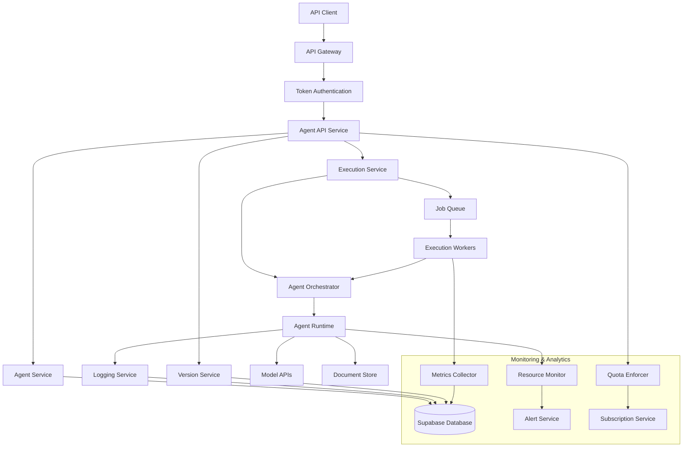
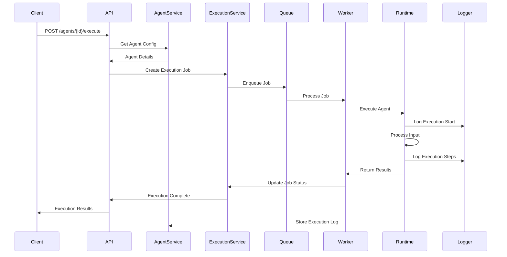
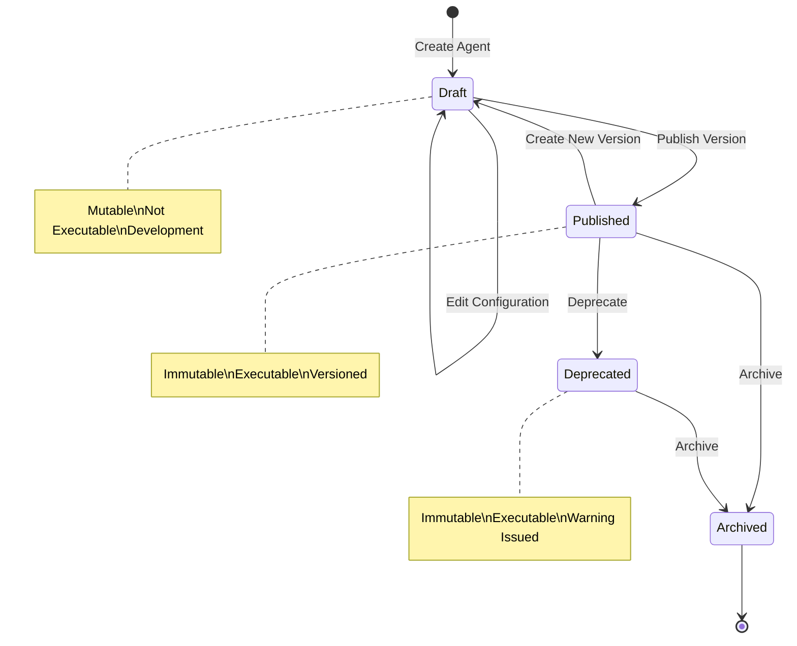

# Design Document

## Overview

The Agent Management via API system provides a comprehensive REST API for programmatic agent lifecycle management within the C9d.ai platform. The design implements a resource-oriented architecture with full CRUD operations, versioning support, and execution orchestration. The system integrates with existing authentication, authorization, and organizational management to provide secure, scalable agent management capabilities with proper resource monitoring and quota enforcement.

The architecture follows microservices principles with dedicated services for agent management, execution orchestration, and monitoring, enabling independent scaling and maintenance of different system components.

## Architecture

### High-Level Architecture



### Agent Execution Flow



### Agent Versioning Flow



## Components and Interfaces

### Core Services

#### AgentService
```typescript
interface AgentService {
  createAgent(userId: string, orgId: string, config: AgentConfig): Promise<Agent>
  getAgent(agentId: string): Promise<Agent | null>
  updateAgent(agentId: string, config: Partial<AgentConfig>): Promise<Agent>
  deleteAgent(agentId: string): Promise<void>
  listAgents(filters: AgentFilters): Promise<PaginatedAgents>
  validateAgentConfig(config: AgentConfig): Promise<ValidationResult>
}
```

#### ExecutionService
```typescript
interface ExecutionService {
  executeAgent(agentId: string, input: any, context: ExecutionContext): Promise<ExecutionResult>
  getExecution(executionId: string): Promise<Execution | null>
  listExecutions(agentId: string, filters: ExecutionFilters): Promise<PaginatedExecutions>
  cancelExecution(executionId: string): Promise<void>
  getExecutionLogs(executionId: string): Promise<ExecutionLog[]>
  scheduleExecution(agentId: string, schedule: CronSchedule): Promise<ScheduledExecution>
}
```

#### VersionService
```typescript
interface VersionService {
  createVersion(agentId: string, config: AgentConfig): Promise<AgentVersion>
  getVersion(agentId: string, version: string): Promise<AgentVersion | null>
  listVersions(agentId: string): Promise<AgentVersion[]>
  publishVersion(agentId: string, version: string): Promise<AgentVersion>
  rollbackToVersion(agentId: string, version: string): Promise<Agent>
  compareVersions(agentId: string, v1: string, v2: string): Promise<VersionDiff>
}
```

#### ChainService
```typescript
interface ChainService {
  createChain(config: ChainConfig): Promise<AgentChain>
  executeChain(chainId: string, input: any): Promise<ChainExecutionResult>
  validateChain(config: ChainConfig): Promise<ChainValidationResult>
  getChainExecution(executionId: string): Promise<ChainExecution>
  optimizeChain(chainId: string): Promise<OptimizationSuggestions>
}
```

### API Controllers

#### AgentController
Handles HTTP requests for agent CRUD operations with proper authentication and validation.

```typescript
interface AgentController {
  createAgent(req: Request, res: Response): Promise<void>
  getAgent(req: Request, res: Response): Promise<void>
  updateAgent(req: Request, res: Response): Promise<void>
  deleteAgent(req: Request, res: Response): Promise<void>
  listAgents(req: Request, res: Response): Promise<void>
  executeAgent(req: Request, res: Response): Promise<void>
}
```

#### ExecutionController
Manages agent execution requests and monitoring endpoints.

```typescript
interface ExecutionController {
  executeAgent(req: Request, res: Response): Promise<void>
  getExecution(req: Request, res: Response): Promise<void>
  listExecutions(req: Request, res: Response): Promise<void>
  cancelExecution(req: Request, res: Response): Promise<void>
  getExecutionLogs(req: Request, res: Response): Promise<void>
  streamExecution(req: Request, res: Response): Promise<void>
}
```

## Data Models

### Database Schema

```sql
-- Agents
CREATE TABLE agents (
  id UUID PRIMARY KEY DEFAULT gen_random_uuid(),
  name TEXT NOT NULL,
  description TEXT,
  user_id UUID REFERENCES users(id) ON DELETE CASCADE,
  organization_id UUID REFERENCES organizations(id) ON DELETE CASCADE,
  persona_id UUID,
  skillset TEXT[],
  input_schema JSONB,
  output_schema JSONB,
  trigger_mode TEXT CHECK (trigger_mode IN ('manual', 'event', 'scheduled')),
  trigger_config JSONB DEFAULT '{}',
  execution_config JSONB DEFAULT '{}',
  visibility TEXT DEFAULT 'private' CHECK (visibility IN ('private', 'team', 'organization', 'public')),
  status TEXT DEFAULT 'draft' CHECK (status IN ('draft', 'published', 'deprecated', 'archived')),
  current_version TEXT DEFAULT '1.0.0',
  metadata JSONB DEFAULT '{}',
  created_at TIMESTAMP WITH TIME ZONE DEFAULT NOW(),
  updated_at TIMESTAMP WITH TIME ZONE DEFAULT NOW()
);

-- Agent versions
CREATE TABLE agent_versions (
  id UUID PRIMARY KEY DEFAULT gen_random_uuid(),
  agent_id UUID REFERENCES agents(id) ON DELETE CASCADE,
  version TEXT NOT NULL,
  config JSONB NOT NULL,
  changelog TEXT,
  published_at TIMESTAMP WITH TIME ZONE,
  created_by UUID REFERENCES users(id),
  is_current BOOLEAN DEFAULT FALSE,
  created_at TIMESTAMP WITH TIME ZONE DEFAULT NOW(),
  UNIQUE(agent_id, version)
);

-- Agent executions
CREATE TABLE agent_executions (
  id UUID PRIMARY KEY DEFAULT gen_random_uuid(),
  agent_id UUID REFERENCES agents(id) ON DELETE CASCADE,
  agent_version TEXT NOT NULL,
  input_data JSONB,
  output_data JSONB,
  status TEXT DEFAULT 'pending' CHECK (status IN ('pending', 'running', 'completed', 'failed', 'cancelled')),
  started_at TIMESTAMP WITH TIME ZONE,
  completed_at TIMESTAMP WITH TIME ZONE,
  execution_time_ms INTEGER,
  error_message TEXT,
  error_details JSONB,
  resource_usage JSONB DEFAULT '{}',
  triggered_by UUID REFERENCES users(id),
  execution_context JSONB DEFAULT '{}',
  created_at TIMESTAMP WITH TIME ZONE DEFAULT NOW()
);

-- Agent chains
CREATE TABLE agent_chains (
  id UUID PRIMARY KEY DEFAULT gen_random_uuid(),
  name TEXT NOT NULL,
  description TEXT,
  user_id UUID REFERENCES users(id) ON DELETE CASCADE,
  organization_id UUID REFERENCES organizations(id) ON DELETE CASCADE,
  chain_config JSONB NOT NULL,
  status TEXT DEFAULT 'active' CHECK (status IN ('active', 'inactive', 'deprecated')),
  created_at TIMESTAMP WITH TIME ZONE DEFAULT NOW(),
  updated_at TIMESTAMP WITH TIME ZONE DEFAULT NOW()
);

-- Chain executions
CREATE TABLE chain_executions (
  id UUID PRIMARY KEY DEFAULT gen_random_uuid(),
  chain_id UUID REFERENCES agent_chains(id) ON DELETE CASCADE,
  input_data JSONB,
  output_data JSONB,
  status TEXT DEFAULT 'pending' CHECK (status IN ('pending', 'running', 'completed', 'failed', 'cancelled')),
  started_at TIMESTAMP WITH TIME ZONE,
  completed_at TIMESTAMP WITH TIME ZONE,
  execution_steps JSONB DEFAULT '[]',
  triggered_by UUID REFERENCES users(id),
  created_at TIMESTAMP WITH TIME ZONE DEFAULT NOW()
);

-- Execution logs
CREATE TABLE execution_logs (
  id UUID PRIMARY KEY DEFAULT gen_random_uuid(),
  execution_id UUID REFERENCES agent_executions(id) ON DELETE CASCADE,
  log_level TEXT NOT NULL CHECK (log_level IN ('debug', 'info', 'warn', 'error')),
  message TEXT NOT NULL,
  metadata JSONB DEFAULT '{}',
  timestamp TIMESTAMP WITH TIME ZONE DEFAULT NOW()
);

-- Agent permissions
CREATE TABLE agent_permissions (
  id UUID PRIMARY KEY DEFAULT gen_random_uuid(),
  agent_id UUID REFERENCES agents(id) ON DELETE CASCADE,
  user_id UUID REFERENCES users(id) ON DELETE CASCADE,
  permission_type TEXT NOT NULL CHECK (permission_type IN ('read', 'write', 'execute', 'admin')),
  granted_by UUID REFERENCES users(id),
  granted_at TIMESTAMP WITH TIME ZONE DEFAULT NOW()
);

-- Scheduled executions
CREATE TABLE scheduled_executions (
  id UUID PRIMARY KEY DEFAULT gen_random_uuid(),
  agent_id UUID REFERENCES agents(id) ON DELETE CASCADE,
  cron_expression TEXT NOT NULL,
  timezone TEXT DEFAULT 'UTC',
  input_data JSONB,
  is_active BOOLEAN DEFAULT TRUE,
  last_execution_at TIMESTAMP WITH TIME ZONE,
  next_execution_at TIMESTAMP WITH TIME ZONE,
  created_by UUID REFERENCES users(id),
  created_at TIMESTAMP WITH TIME ZONE DEFAULT NOW(),
  updated_at TIMESTAMP WITH TIME ZONE DEFAULT NOW()
);

-- Resource usage tracking
CREATE TABLE agent_resource_usage (
  id UUID PRIMARY KEY DEFAULT gen_random_uuid(),
  agent_id UUID REFERENCES agents(id) ON DELETE CASCADE,
  execution_id UUID REFERENCES agent_executions(id) ON DELETE CASCADE,
  cpu_time_ms INTEGER,
  memory_peak_mb INTEGER,
  api_calls_count INTEGER,
  tokens_consumed INTEGER,
  cost_cents INTEGER,
  recorded_at TIMESTAMP WITH TIME ZONE DEFAULT NOW()
);
```

### TypeScript Interfaces

```typescript
interface Agent {
  id: string
  name: string
  description?: string
  userId: string
  organizationId?: string
  personaId?: string
  skillset: string[]
  inputSchema?: JSONSchema
  outputSchema?: JSONSchema
  triggerMode: 'manual' | 'event' | 'scheduled'
  triggerConfig: Record<string, any>
  executionConfig: Record<string, any>
  visibility: 'private' | 'team' | 'organization' | 'public'
  status: 'draft' | 'published' | 'deprecated' | 'archived'
  currentVersion: string
  metadata: Record<string, any>
  createdAt: Date
  updatedAt: Date
}

interface AgentConfig {
  name: string
  description?: string
  personaId?: string
  skillset: string[]
  inputSchema?: JSONSchema
  outputSchema?: JSONSchema
  triggerMode: 'manual' | 'event' | 'scheduled'
  triggerConfig?: Record<string, any>
  executionConfig?: Record<string, any>
  visibility?: 'private' | 'team' | 'organization' | 'public'
  metadata?: Record<string, any>
}

interface AgentExecution {
  id: string
  agentId: string
  agentVersion: string
  inputData?: any
  outputData?: any
  status: 'pending' | 'running' | 'completed' | 'failed' | 'cancelled'
  startedAt?: Date
  completedAt?: Date
  executionTimeMs?: number
  errorMessage?: string
  errorDetails?: Record<string, any>
  resourceUsage: ResourceUsage
  triggeredBy: string
  executionContext: Record<string, any>
  createdAt: Date
}

interface AgentChain {
  id: string
  name: string
  description?: string
  userId: string
  organizationId?: string
  chainConfig: ChainConfig
  status: 'active' | 'inactive' | 'deprecated'
  createdAt: Date
  updatedAt: Date
}

interface ChainConfig {
  steps: ChainStep[]
  errorHandling: ErrorHandlingConfig
  timeout: number
  retryPolicy: RetryPolicy
}

interface ChainStep {
  id: string
  agentId: string
  inputMapping: Record<string, string>
  outputMapping: Record<string, string>
  condition?: string
  timeout?: number
}

interface ExecutionResult {
  executionId: string
  status: 'completed' | 'failed'
  output?: any
  error?: string
  executionTime: number
  resourceUsage: ResourceUsage
}

interface ResourceUsage {
  cpuTimeMs: number
  memoryPeakMb: number
  apiCallsCount: number
  tokensConsumed: number
  costCents: number
}

interface AgentVersion {
  id: string
  agentId: string
  version: string
  config: AgentConfig
  changelog?: string
  publishedAt?: Date
  createdBy: string
  isCurrent: boolean
  createdAt: Date
}
```

## Error Handling

### Agent Management Errors
- **AgentNotFound**: Requested agent doesn't exist or user lacks access
- **InvalidAgentConfig**: Agent configuration validation failed
- **AgentCreationFailed**: Unable to create agent due to system or quota limits
- **VersionConflict**: Attempt to modify published agent version
- **DuplicateAgentName**: Agent name already exists in organization

### Execution Errors
- **ExecutionFailed**: Agent execution encountered runtime error
- **ExecutionTimeout**: Agent execution exceeded time limit
- **InvalidInput**: Input data doesn't match agent's input schema
- **ResourceExhausted**: Execution exceeded resource quotas
- **ChainExecutionFailed**: Agent chain execution failed at specific step

### Permission Errors
- **InsufficientPermissions**: User lacks required permissions for operation
- **AgentAccessDenied**: Token doesn't have required agent scopes
- **OrganizationLimitExceeded**: Organization has reached agent limits
- **VisibilityViolation**: Attempt to access agent outside visibility scope

### Error Response Format
```typescript
interface AgentErrorResponse {
  error: {
    code: string
    message: string
    details?: {
      agentId?: string
      executionId?: string
      validationErrors?: ValidationError[]
      resourceUsage?: ResourceUsage
      suggestedActions?: string[]
    }
    timestamp: string
    requestId: string
  }
}
```

## Testing Strategy

### Unit Testing
- **Agent Service**: Test agent CRUD operations, validation, and configuration management
- **Execution Service**: Test agent execution logic, error handling, and resource tracking
- **Version Service**: Test versioning operations, rollback functionality, and diff generation
- **Chain Service**: Test chain validation, execution orchestration, and error propagation

### Integration Testing
- **API Endpoints**: Test all REST endpoints with various authentication and authorization scenarios
- **Database Operations**: Test agent storage, retrieval, and relationship management
- **Execution Pipeline**: Test complete agent execution flow from API request to result
- **Permission System**: Test RBAC integration and organizational access controls

### End-to-End Testing
- **Agent Lifecycle**: Complete agent creation, configuration, execution, and deletion flows
- **Chain Execution**: Test complex agent chains with multiple steps and error scenarios
- **Version Management**: Test version creation, publishing, and rollback workflows
- **Resource Monitoring**: Test quota enforcement and resource usage tracking

### Performance Testing
- **Concurrent Executions**: Test system behavior with multiple simultaneous agent executions
- **Large Agent Chains**: Test performance with complex multi-step agent workflows
- **Database Queries**: Test query performance for agent listing and execution history
- **Resource Usage**: Monitor memory and CPU usage during agent execution

### Security Testing
- **Authentication**: Verify token-based authentication for all agent operations
- **Authorization**: Test organizational and visibility-based access controls
- **Input Validation**: Test agent input validation and schema enforcement
- **Resource Limits**: Verify quota enforcement and resource abuse prevention

### Load Testing
- **API Throughput**: Test API performance under high request volumes
- **Execution Scaling**: Test agent execution scaling with worker pool management
- **Database Performance**: Test database performance with large numbers of agents and executions
- **Memory Management**: Monitor memory usage and garbage collection during load testing