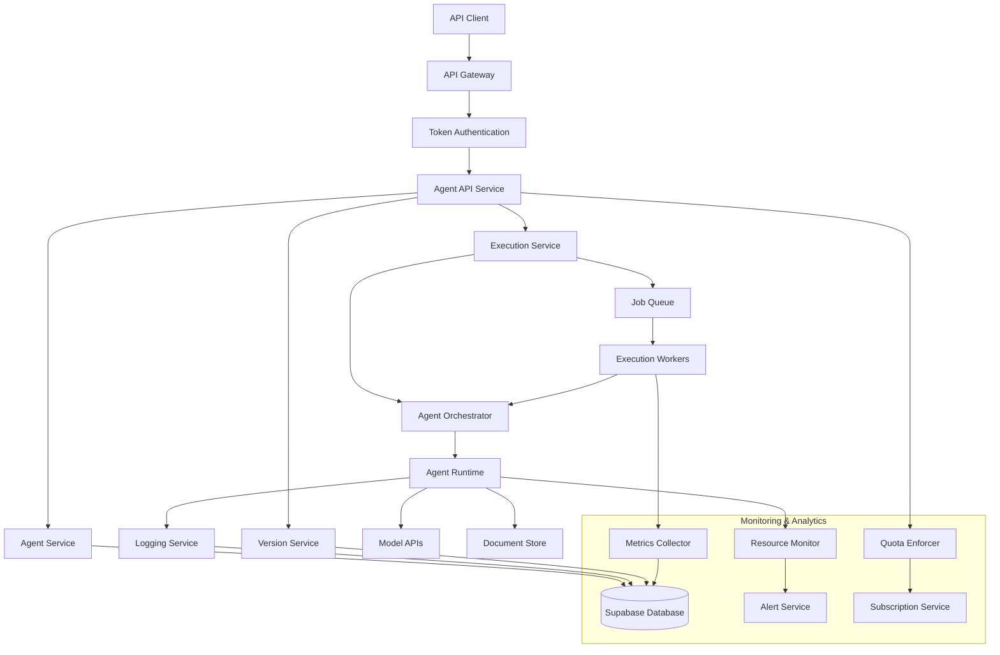
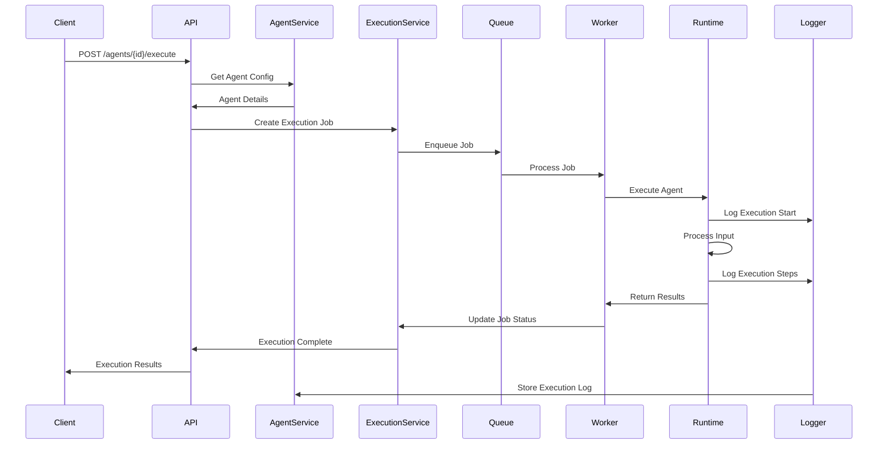
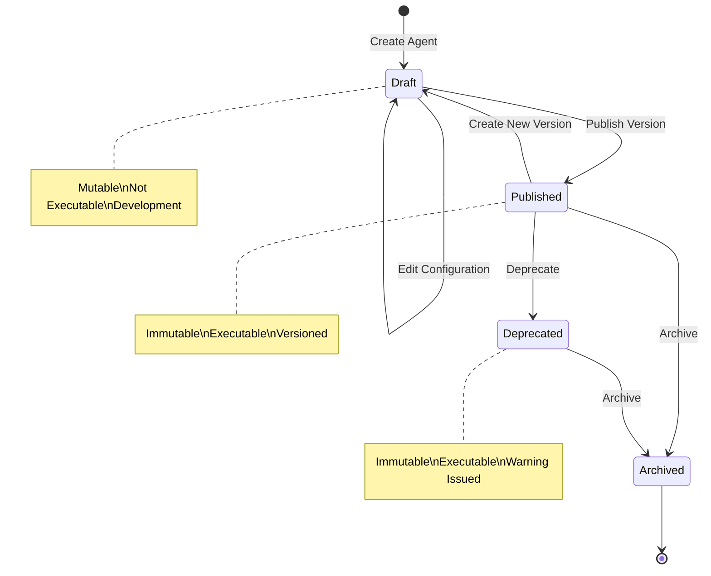
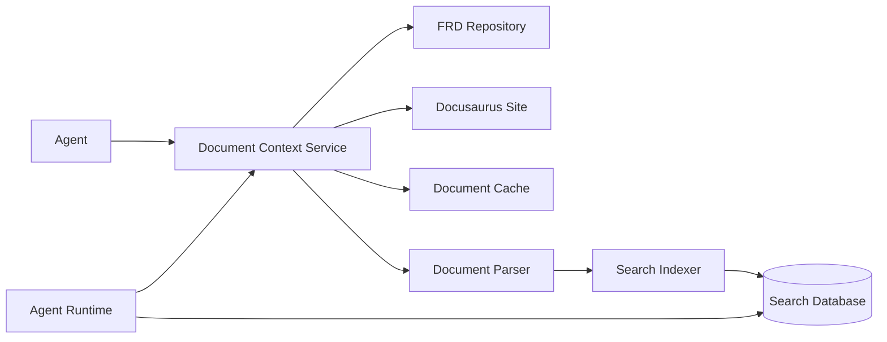
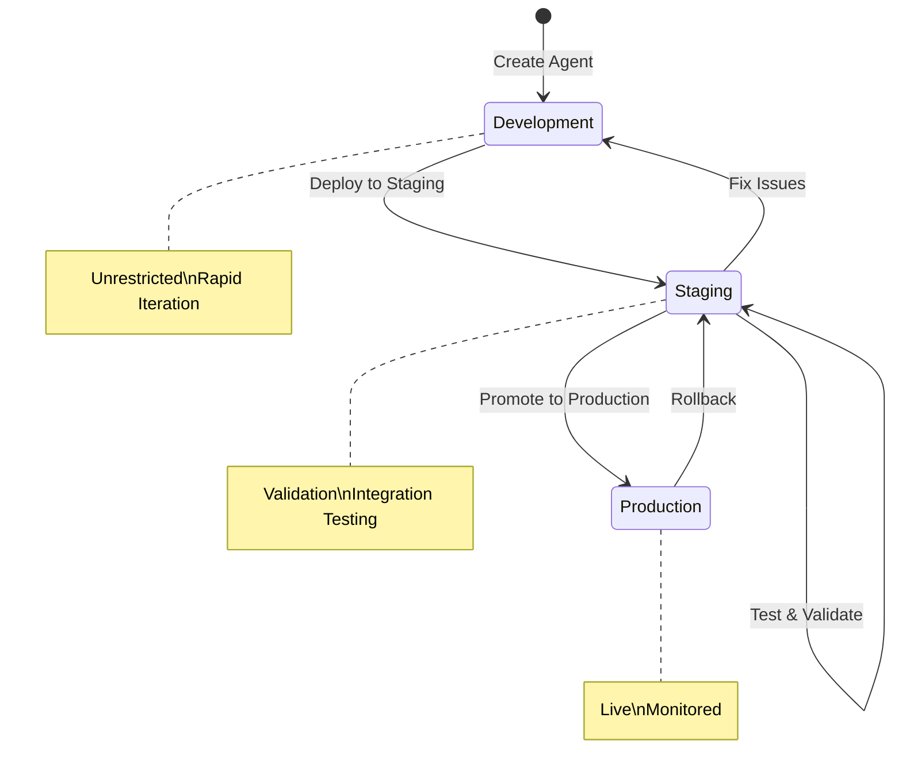

# Design Document

## Overview

The Agent Management via API system provides a comprehensive REST API for programmatic agent lifecycle management within the C9d.ai platform. The design implements a resource-oriented architecture with full CRUD operations, versioning support, and execution orchestration. The system integrates with existing authentication, authorization, and organizational management to provide secure, scalable agent management capabilities with proper resource monitoring and quota enforcement.

The architecture follows microservices principles with dedicated services for agent management, execution orchestration, and monitoring, enabling independent scaling and maintenance of different system components.

## Architecture

### High-Level Architecture


```mermaid
graph TB
    Client[API Client] --> Gateway[API Gateway]
    Gateway --> Auth[Token Authentication]
    Auth --> AgentAPI[Agent API Service]
    
    AgentAPI --> AgentService[Agent Service]
    AgentAPI --> ExecutionService[Execution Service]
    AgentAPI --> VersionService[Version Service]
    
    AgentService --> DB[(Supabase Database)]
    ExecutionService --> Queue[Job Queue]
    ExecutionService --> Orchestrator[Agent Orchestrator]
    
    Queue --> Workers[Execution Workers]
    Workers --> Orchestrator
    Orchestrator --> AgentRuntime[Agent Runtime]
    
    AgentRuntime --> ModelAPI[Model APIs]
    AgentRuntime --> DocumentStore[Document Store]
    AgentRuntime --> LogService[Logging Service]
    
    LogService --> DB
    VersionService --> DB
    
    subgraph "Monitoring & Analytics"
        MetricsCollector[Metrics Collector] --> DB
        ResourceMonitor[Resource Monitor] --> AlertService[Alert Service]
        QuotaEnforcer[Quota Enforcer] --> SubscriptionService[Subscription Service]
    end
    
    Workers --> MetricsCollector
    AgentRuntime --> ResourceMonitor
    AgentAPI --> QuotaEnforcer
```

### Agent Execution Flow


```mermaid
sequenceDiagram
    participant Client
    participant API
    participant AgentService
    participant ExecutionService
    participant Queue
    participant Worker
    participant Runtime
    participant Logger
    
    Client->>API: POST /agents/{id}/execute
    API->>AgentService: Get Agent Config
    AgentService->>API: Agent Details
    API->>ExecutionService: Create Execution Job
    ExecutionService->>Queue: Enqueue Job
    Queue->>Worker: Process Job
    Worker->>Runtime: Execute Agent
    Runtime->>Logger: Log Execution Start
    Runtime->>Runtime: Process Input
    Runtime->>Logger: Log Execution Steps
    Runtime->>Worker: Return Results
    Worker->>ExecutionService: Update Job Status
    ExecutionService->>API: Execution Complete
    API->>Client: Execution Results
    Logger->>AgentService: Store Execution Log
```

### Agent Versioning Flow


```mermaid
stateDiagram-v2
    [*] --> Draft : Create Agent
    Draft --> Draft : Edit Configuration
    Draft --> Published : Publish Version
    Published --> Draft : Create New Version
    Published --> Deprecated : Deprecate
    Published --> Archived : Archive
    Deprecated --> Archived : Archive
    Archived --> [*]
    
    note right of Published : Immutable\nExecutable\nVersioned
    note right of Draft : Mutable\nNot Executable\nDevelopment
    note right of Deprecated : Immutable\nExecutable\nWarning Issued
```

## Components and Interfaces

### Core Services

#### AgentService
```typescript
interface AgentService {
  createAgent(userId: string, orgId: string, config: AgentConfig): Promise<Agent>
  getAgent(agentId: string): Promise<Agent | null>
  updateAgent(agentId: string, config: Partial<AgentConfig>): Promise<Agent>
  deleteAgent(agentId: string): Promise<void>
  listAgents(filters: AgentFilters): Promise<PaginatedAgents>
  validateAgentConfig(config: AgentConfig): Promise<ValidationResult>
}
```

#### ExecutionService
```typescript
interface ExecutionService {
  executeAgent(agentId: string, input: any, context: ExecutionContext): Promise<ExecutionResult>
  getExecution(executionId: string): Promise<Execution | null>
  listExecutions(agentId: string, filters: ExecutionFilters): Promise<PaginatedExecutions>
  cancelExecution(executionId: string): Promise<void>
  getExecutionLogs(executionId: string): Promise<ExecutionLog[]>
  scheduleExecution(agentId: string, schedule: CronSchedule): Promise<ScheduledExecution>
}
```

#### VersionService
```typescript
interface VersionService {
  createVersion(agentId: string, config: AgentConfig): Promise<AgentVersion>
  getVersion(agentId: string, version: string): Promise<AgentVersion | null>
  listVersions(agentId: string): Promise<AgentVersion[]>
  publishVersion(agentId: string, version: string): Promise<AgentVersion>
  rollbackToVersion(agentId: string, version: string): Promise<Agent>
  compareVersions(agentId: string, v1: string, v2: string): Promise<VersionDiff>
}
```

#### ChainService
```typescript
interface ChainService {
  createChain(config: ChainConfig): Promise<AgentChain>
  executeChain(chainId: string, input: any): Promise<ChainExecutionResult>
  validateChain(config: ChainConfig): Promise<ChainValidationResult>
  getChainExecution(executionId: string): Promise<ChainExecution>
  optimizeChain(chainId: string): Promise<OptimizationSuggestions>
}
```

#### DocumentContextService
```typescript
interface DocumentContextService {
  attachDocumentation(agentId: string, docConfig: DocumentationConfig): Promise<void>
  getDocumentContext(agentId: string): Promise<DocumentContext>
  refreshDocumentation(agentId: string): Promise<void>
  searchDocumentation(agentId: string, query: string): Promise<DocumentSearchResult[]>
  validateDocumentAccess(agentId: string, docPath: string): Promise<boolean>
}

interface DocumentationConfig {
  source: 'frd' | 'docusaurus' | 'custom'
  paths: string[]
  autoRefresh: boolean
  refreshInterval?: number
}

interface DocumentContext {
  agentId: string
  documents: DocumentReference[]
  lastRefreshed: Date
  totalSize: number
}
```

#### AuditService
```typescript
interface AuditService {
  logAgentOperation(operation: AgentOperation): Promise<void>
  getAuditLogs(filters: AuditFilters): Promise<PaginatedAuditLogs>
  exportAuditLogs(filters: AuditFilters, format: 'json' | 'csv'): Promise<string>
}

interface AgentOperation {
  operationType: 'create' | 'read' | 'update' | 'delete' | 'execute'
  agentId: string
  userId: string
  tokenId?: string
  organizationId?: string
  timestamp: Date
  ipAddress?: string
  userAgent?: string
  success: boolean
  errorCode?: string
}
```

### API Controllers

#### AgentController
Handles HTTP requests for agent CRUD operations with proper authentication and validation.

```typescript
interface AgentController {
  createAgent(req: Request, res: Response): Promise<void>
  getAgent(req: Request, res: Response): Promise<void>
  updateAgent(req: Request, res: Response): Promise<void>
  deleteAgent(req: Request, res: Response): Promise<void>
  listAgents(req: Request, res: Response): Promise<void>
  executeAgent(req: Request, res: Response): Promise<void>
}
```

#### ExecutionController
Manages agent execution requests and monitoring endpoints.

```typescript
interface ExecutionController {
  executeAgent(req: Request, res: Response): Promise<void>
  getExecution(req: Request, res: Response): Promise<void>
  listExecutions(req: Request, res: Response): Promise<void>
  cancelExecution(req: Request, res: Response): Promise<void>
  getExecutionLogs(req: Request, res: Response): Promise<void>
  exportExecutionLogs(req: Request, res: Response): Promise<void>
  streamExecution(req: Request, res: Response): Promise<void>
  getPerformanceMetrics(req: Request, res: Response): Promise<void>
}
```

#### VersionController
Manages agent versioning and deployment operations.

```typescript
interface VersionController {
  createVersion(req: Request, res: Response): Promise<void>
  getVersion(req: Request, res: Response): Promise<void>
  listVersions(req: Request, res: Response): Promise<void>
  publishVersion(req: Request, res: Response): Promise<void>
  rollbackVersion(req: Request, res: Response): Promise<void>
  compareVersions(req: Request, res: Response): Promise<void>
  deployToEnvironment(req: Request, res: Response): Promise<void>
}
```

#### ChainController
Manages agent chain configuration and execution.

```typescript
interface ChainController {
  createChain(req: Request, res: Response): Promise<void>
  getChain(req: Request, res: Response): Promise<void>
  updateChain(req: Request, res: Response): Promise<void>
  deleteChain(req: Request, res: Response): Promise<void>
  executeChain(req: Request, res: Response): Promise<void>
  getChainExecution(req: Request, res: Response): Promise<void>
}
```

## Data Models

### Database Schema

```sql
-- Agents
CREATE TABLE agents (
  id UUID PRIMARY KEY DEFAULT gen_random_uuid(),
  name TEXT NOT NULL,
  description TEXT,
  user_id UUID REFERENCES users(id) ON DELETE CASCADE,
  organization_id UUID REFERENCES organizations(id) ON DELETE CASCADE,
  persona_id UUID,
  skillset TEXT[],
  input_schema JSONB,
  output_schema JSONB,
  trigger_mode TEXT CHECK (trigger_mode IN ('manual', 'event', 'scheduled')),
  trigger_config JSONB DEFAULT '{}',
  execution_config JSONB DEFAULT '{}',
  visibility TEXT DEFAULT 'private' CHECK (visibility IN ('private', 'team', 'organization', 'public')),
  status TEXT DEFAULT 'draft' CHECK (status IN ('draft', 'published', 'deprecated', 'archived')),
  current_version TEXT DEFAULT '1.0.0',
  metadata JSONB DEFAULT '{}',
  created_at TIMESTAMP WITH TIME ZONE DEFAULT NOW(),
  updated_at TIMESTAMP WITH TIME ZONE DEFAULT NOW()
);

-- Agent versions
CREATE TABLE agent_versions (
  id UUID PRIMARY KEY DEFAULT gen_random_uuid(),
  agent_id UUID REFERENCES agents(id) ON DELETE CASCADE,
  version TEXT NOT NULL,
  config JSONB NOT NULL,
  changelog TEXT,
  published_at TIMESTAMP WITH TIME ZONE,
  created_by UUID REFERENCES users(id),
  is_current BOOLEAN DEFAULT FALSE,
  created_at TIMESTAMP WITH TIME ZONE DEFAULT NOW(),
  UNIQUE(agent_id, version)
);

-- Agent executions
CREATE TABLE agent_executions (
  id UUID PRIMARY KEY DEFAULT gen_random_uuid(),
  agent_id UUID REFERENCES agents(id) ON DELETE CASCADE,
  agent_version TEXT NOT NULL,
  input_data JSONB,
  output_data JSONB,
  status TEXT DEFAULT 'pending' CHECK (status IN ('pending', 'running', 'completed', 'failed', 'cancelled')),
  started_at TIMESTAMP WITH TIME ZONE,
  completed_at TIMESTAMP WITH TIME ZONE,
  execution_time_ms INTEGER,
  error_message TEXT,
  error_details JSONB,
  resource_usage JSONB DEFAULT '{}',
  triggered_by UUID REFERENCES users(id),
  execution_context JSONB DEFAULT '{}',
  created_at TIMESTAMP WITH TIME ZONE DEFAULT NOW()
);

-- Agent chains
CREATE TABLE agent_chains (
  id UUID PRIMARY KEY DEFAULT gen_random_uuid(),
  name TEXT NOT NULL,
  description TEXT,
  user_id UUID REFERENCES users(id) ON DELETE CASCADE,
  organization_id UUID REFERENCES organizations(id) ON DELETE CASCADE,
  chain_config JSONB NOT NULL,
  status TEXT DEFAULT 'active' CHECK (status IN ('active', 'inactive', 'deprecated')),
  created_at TIMESTAMP WITH TIME ZONE DEFAULT NOW(),
  updated_at TIMESTAMP WITH TIME ZONE DEFAULT NOW()
);

-- Chain executions
CREATE TABLE chain_executions (
  id UUID PRIMARY KEY DEFAULT gen_random_uuid(),
  chain_id UUID REFERENCES agent_chains(id) ON DELETE CASCADE,
  input_data JSONB,
  output_data JSONB,
  status TEXT DEFAULT 'pending' CHECK (status IN ('pending', 'running', 'completed', 'failed', 'cancelled')),
  started_at TIMESTAMP WITH TIME ZONE,
  completed_at TIMESTAMP WITH TIME ZONE,
  execution_steps JSONB DEFAULT '[]',
  triggered_by UUID REFERENCES users(id),
  created_at TIMESTAMP WITH TIME ZONE DEFAULT NOW()
);

-- Execution logs
CREATE TABLE execution_logs (
  id UUID PRIMARY KEY DEFAULT gen_random_uuid(),
  execution_id UUID REFERENCES agent_executions(id) ON DELETE CASCADE,
  log_level TEXT NOT NULL CHECK (log_level IN ('debug', 'info', 'warn', 'error')),
  message TEXT NOT NULL,
  metadata JSONB DEFAULT '{}',
  timestamp TIMESTAMP WITH TIME ZONE DEFAULT NOW()
);

-- Agent permissions
CREATE TABLE agent_permissions (
  id UUID PRIMARY KEY DEFAULT gen_random_uuid(),
  agent_id UUID REFERENCES agents(id) ON DELETE CASCADE,
  user_id UUID REFERENCES users(id) ON DELETE CASCADE,
  permission_type TEXT NOT NULL CHECK (permission_type IN ('read', 'write', 'execute', 'admin')),
  granted_by UUID REFERENCES users(id),
  granted_at TIMESTAMP WITH TIME ZONE DEFAULT NOW()
);

-- Scheduled executions
CREATE TABLE scheduled_executions (
  id UUID PRIMARY KEY DEFAULT gen_random_uuid(),
  agent_id UUID REFERENCES agents(id) ON DELETE CASCADE,
  cron_expression TEXT NOT NULL,
  timezone TEXT DEFAULT 'UTC',
  input_data JSONB,
  is_active BOOLEAN DEFAULT TRUE,
  last_execution_at TIMESTAMP WITH TIME ZONE,
  next_execution_at TIMESTAMP WITH TIME ZONE,
  created_by UUID REFERENCES users(id),
  created_at TIMESTAMP WITH TIME ZONE DEFAULT NOW(),
  updated_at TIMESTAMP WITH TIME ZONE DEFAULT NOW()
);

-- Resource usage tracking
CREATE TABLE agent_resource_usage (
  id UUID PRIMARY KEY DEFAULT gen_random_uuid(),
  agent_id UUID REFERENCES agents(id) ON DELETE CASCADE,
  execution_id UUID REFERENCES agent_executions(id) ON DELETE CASCADE,
  cpu_time_ms INTEGER,
  memory_peak_mb INTEGER,
  api_calls_count INTEGER,
  tokens_consumed INTEGER,
  cost_cents INTEGER,
  recorded_at TIMESTAMP WITH TIME ZONE DEFAULT NOW()
);

-- Agent documentation context
CREATE TABLE agent_documentation (
  id UUID PRIMARY KEY DEFAULT gen_random_uuid(),
  agent_id UUID REFERENCES agents(id) ON DELETE CASCADE,
  source_type TEXT NOT NULL CHECK (source_type IN ('frd', 'docusaurus', 'custom')),
  document_paths TEXT[] NOT NULL,
  auto_refresh BOOLEAN DEFAULT FALSE,
  refresh_interval_minutes INTEGER,
  last_refreshed_at TIMESTAMP WITH TIME ZONE,
  created_at TIMESTAMP WITH TIME ZONE DEFAULT NOW(),
  updated_at TIMESTAMP WITH TIME ZONE DEFAULT NOW()
);

-- Agent deployment environments
CREATE TABLE agent_deployments (
  id UUID PRIMARY KEY DEFAULT gen_random_uuid(),
  agent_id UUID REFERENCES agents(id) ON DELETE CASCADE,
  version TEXT NOT NULL,
  environment TEXT NOT NULL CHECK (environment IN ('development', 'staging', 'production')),
  deployed_at TIMESTAMP WITH TIME ZONE DEFAULT NOW(),
  deployed_by UUID REFERENCES users(id),
  status TEXT DEFAULT 'active' CHECK (status IN ('active', 'inactive', 'failed')),
  rollback_version TEXT,
  metadata JSONB DEFAULT '{}'
);

-- Audit logs
CREATE TABLE agent_audit_logs (
  id UUID PRIMARY KEY DEFAULT gen_random_uuid(),
  operation_type TEXT NOT NULL CHECK (operation_type IN ('create', 'read', 'update', 'delete', 'execute')),
  agent_id UUID REFERENCES agents(id) ON DELETE SET NULL,
  user_id UUID REFERENCES users(id) ON DELETE SET NULL,
  token_id UUID,
  organization_id UUID REFERENCES organizations(id) ON DELETE SET NULL,
  ip_address INET,
  user_agent TEXT,
  success BOOLEAN NOT NULL,
  error_code TEXT,
  request_data JSONB,
  response_data JSONB,
  timestamp TIMESTAMP WITH TIME ZONE DEFAULT NOW()
);

-- Performance metrics aggregation
CREATE TABLE agent_performance_metrics (
  id UUID PRIMARY KEY DEFAULT gen_random_uuid(),
  agent_id UUID REFERENCES agents(id) ON DELETE CASCADE,
  time_period TIMESTAMP WITH TIME ZONE NOT NULL,
  total_executions INTEGER DEFAULT 0,
  successful_executions INTEGER DEFAULT 0,
  failed_executions INTEGER DEFAULT 0,
  average_execution_time_ms INTEGER,
  p95_execution_time_ms INTEGER,
  p99_execution_time_ms INTEGER,
  total_cost_cents INTEGER DEFAULT 0,
  created_at TIMESTAMP WITH TIME ZONE DEFAULT NOW()
);
```

### TypeScript Interfaces

```typescript
interface Agent {
  id: string
  name: string
  description?: string
  userId: string
  organizationId?: string
  personaId?: string
  skillset: string[]
  inputSchema?: JSONSchema
  outputSchema?: JSONSchema
  triggerMode: 'manual' | 'event' | 'scheduled'
  triggerConfig: Record<string, any>
  executionConfig: Record<string, any>
  visibility: 'private' | 'team' | 'organization' | 'public'
  status: 'draft' | 'published' | 'deprecated' | 'archived'
  currentVersion: string
  metadata: Record<string, any>
  createdAt: Date
  updatedAt: Date
}

interface AgentConfig {
  name: string
  description?: string
  personaId?: string
  skillset: string[]
  inputSchema?: JSONSchema
  outputSchema?: JSONSchema
  triggerMode: 'manual' | 'event' | 'scheduled'
  triggerConfig?: Record<string, any>
  executionConfig?: Record<string, any>
  visibility?: 'private' | 'team' | 'organization' | 'public'
  metadata?: Record<string, any>
}

interface AgentExecution {
  id: string
  agentId: string
  agentVersion: string
  inputData?: any
  outputData?: any
  status: 'pending' | 'running' | 'completed' | 'failed' | 'cancelled'
  startedAt?: Date
  completedAt?: Date
  executionTimeMs?: number
  errorMessage?: string
  errorDetails?: Record<string, any>
  resourceUsage: ResourceUsage
  triggeredBy: string
  executionContext: Record<string, any>
  createdAt: Date
}

interface AgentChain {
  id: string
  name: string
  description?: string
  userId: string
  organizationId?: string
  chainConfig: ChainConfig
  status: 'active' | 'inactive' | 'deprecated'
  createdAt: Date
  updatedAt: Date
}

interface ChainConfig {
  steps: ChainStep[]
  errorHandling: ErrorHandlingConfig
  timeout: number
  retryPolicy: RetryPolicy
}

interface ChainStep {
  id: string
  agentId: string
  inputMapping: Record<string, string>
  outputMapping: Record<string, string>
  condition?: string
  timeout?: number
}

interface ExecutionResult {
  executionId: string
  status: 'completed' | 'failed'
  output?: any
  error?: string
  executionTime: number
  resourceUsage: ResourceUsage
}

interface ResourceUsage {
  cpuTimeMs: number
  memoryPeakMb: number
  apiCallsCount: number
  tokensConsumed: number
  costCents: number
}

interface AgentVersion {
  id: string
  agentId: string
  version: string
  config: AgentConfig
  changelog?: string
  publishedAt?: Date
  createdBy: string
  isCurrent: boolean
  createdAt: Date
}

interface AgentDeployment {
  id: string
  agentId: string
  version: string
  environment: 'development' | 'staging' | 'production'
  deployedAt: Date
  deployedBy: string
  status: 'active' | 'inactive' | 'failed'
  rollbackVersion?: string
  metadata: Record<string, any>
}

interface DocumentationConfig {
  source: 'frd' | 'docusaurus' | 'custom'
  paths: string[]
  autoRefresh: boolean
  refreshInterval?: number
}

interface DocumentContext {
  agentId: string
  documents: DocumentReference[]
  lastRefreshed: Date
  totalSize: number
}

interface DocumentReference {
  path: string
  title: string
  content: string
  lastModified: Date
}

interface PerformanceMetrics {
  agentId: string
  timePeriod: Date
  totalExecutions: number
  successfulExecutions: number
  failedExecutions: number
  successRate: number
  averageExecutionTime: number
  p95ExecutionTime: number
  p99ExecutionTime: number
  totalCost: number
  errorPatterns: ErrorPattern[]
}

interface ErrorPattern {
  errorCode: string
  count: number
  percentage: number
  lastOccurrence: Date
}

interface AuditLog {
  id: string
  operationType: 'create' | 'read' | 'update' | 'delete' | 'execute'
  agentId?: string
  userId?: string
  tokenId?: string
  organizationId?: string
  ipAddress?: string
  userAgent?: string
  success: boolean
  errorCode?: string
  requestData?: Record<string, any>
  responseData?: Record<string, any>
  timestamp: Date
}
```

## API Documentation and SDK Design

### OpenAPI Specification
The API will be fully documented using OpenAPI 3.0 specification with:
- Complete endpoint documentation with request/response schemas
- Authentication and authorization requirements
- Error response formats and codes
- Example requests and responses for all operations
- Interactive API documentation via Swagger UI

**Design Rationale**: OpenAPI provides a standard, machine-readable format that enables automatic SDK generation, interactive documentation, and API client tooling.

### SDK Architecture

#### JavaScript/TypeScript SDK
```typescript
// SDK Client initialization
import { C9dAgentClient } from '@c9d/agent-sdk'

const client = new C9dAgentClient({
  apiKey: 'your-api-key',
  baseUrl: 'https://api.c9d.ai',
  timeout: 30000
})

// Agent management
const agent = await client.agents.create({
  name: 'My Agent',
  description: 'Agent description',
  triggerMode: 'manual',
  skillset: ['analysis', 'generation']
})

// Agent execution
const execution = await client.agents.execute(agent.id, {
  input: { query: 'Analyze this data' }
})

// Version management
const version = await client.versions.create(agent.id, {
  changelog: 'Updated configuration'
})
await client.versions.publish(agent.id, version.version)

// Chain execution
const chain = await client.chains.create({
  name: 'Analysis Pipeline',
  steps: [
    { agentId: agent1.id, inputMapping: {} },
    { agentId: agent2.id, inputMapping: { input: 'step1.output' } }
  ]
})
```

#### Python SDK
```python
from c9d_agent_sdk import C9dAgentClient

# Client initialization
client = C9dAgentClient(
    api_key='your-api-key',
    base_url='https://api.c9d.ai',
    timeout=30
)

# Agent management
agent = client.agents.create(
    name='My Agent',
    description='Agent description',
    trigger_mode='manual',
    skillset=['analysis', 'generation']
)

# Agent execution
execution = client.agents.execute(
    agent.id,
    input={'query': 'Analyze this data'}
)

# Version management
version = client.versions.create(
    agent.id,
    changelog='Updated configuration'
)
client.versions.publish(agent.id, version.version)
```

### SDK Features
- **Type Safety**: Full TypeScript types and Python type hints
- **Error Handling**: Structured error classes with detailed messages
- **Retry Logic**: Automatic retry with exponential backoff
- **Pagination**: Automatic pagination handling for list operations
- **Streaming**: Support for streaming execution results
- **Validation**: Client-side validation before API calls
- **Caching**: Optional response caching for read operations

**Design Rationale**: Official SDKs reduce integration complexity, provide type safety, and ensure consistent error handling across different programming languages.

### Documentation Structure
```
docs/
├── getting-started/
│   ├── quickstart.md
│   ├── authentication.md
│   └── basic-concepts.md
├── guides/
│   ├── creating-agents.md
│   ├── agent-execution.md
│   ├── version-management.md
│   ├── agent-chains.md
│   └── monitoring-performance.md
├── api-reference/
│   ├── agents.md
│   ├── executions.md
│   ├── versions.md
│   ├── chains.md
│   └── errors.md
├── sdk-reference/
│   ├── typescript.md
│   └── python.md
└── examples/
    ├── basic-agent.md
    ├── scheduled-execution.md
    ├── agent-chain.md
    └── error-handling.md
```

### Backward Compatibility Strategy
- **Semantic Versioning**: API versions follow semver (v1.0.0, v1.1.0, v2.0.0)
- **Deprecation Policy**: 6-month deprecation notice for breaking changes
- **Version Headers**: Support multiple API versions via `X-API-Version` header
- **Migration Guides**: Detailed guides for major version upgrades
- **Changelog**: Comprehensive changelog with migration instructions

**Design Rationale**: Clear versioning and deprecation policies ensure developers can upgrade at their own pace without breaking existing integrations.

## FRD Documentation Integration

### Architecture
The system integrates with FRD (Functional Requirements Document) sources and Docusaurus documentation to provide agents with contextual knowledge.


```mermaid
graph LR
    Agent[Agent] --> DocService[Document Context Service]
    DocService --> FRD[FRD Repository]
    DocService --> Docusaurus[Docusaurus Site]
    DocService --> Cache[Document Cache]
    DocService --> Parser[Document Parser]
    
    Parser --> Indexer[Search Indexer]
    Indexer --> SearchDB[(Search Database)]
    
    AgentRuntime[Agent Runtime] --> DocService
    AgentRuntime --> SearchDB
```

### Document Context Service
Manages the lifecycle of documentation attached to agents:

1. **Document Attachment**: Link FRD or Docusaurus documentation to agents
2. **Automatic Refresh**: Poll for documentation updates based on configured intervals
3. **Content Parsing**: Extract and structure documentation content
4. **Search Indexing**: Index documentation for fast retrieval during execution
5. **Context Injection**: Provide relevant documentation to agent runtime

### Document Refresh Strategy
- **Manual Refresh**: Triggered by API call or user action
- **Scheduled Refresh**: Automatic refresh based on configured interval
- **Webhook Refresh**: Triggered by documentation repository webhooks
- **Version-Based Refresh**: Refresh when documentation version changes

**Design Rationale**: Automatic documentation refresh ensures agents always have access to the latest project context without manual intervention.

### Context Retrieval During Execution
When an agent executes:
1. Agent runtime requests relevant documentation context
2. Document service searches indexed documentation based on agent query
3. Top-N relevant documents are retrieved and ranked
4. Context is injected into agent's execution environment
5. Agent processes input with documentation context available

### Graceful Degradation
If documentation access fails:
- Agent execution continues without documentation context
- Warning logged to execution logs
- Fallback to cached documentation if available
- Error reported in execution metadata

**Design Rationale**: Agents should not fail due to documentation unavailability; documentation enhances functionality but is not required for execution.

## Error Handling

### Agent Management Errors
- **AgentNotFound**: Requested agent doesn't exist or user lacks access
- **InvalidAgentConfig**: Agent configuration validation failed
- **AgentCreationFailed**: Unable to create agent due to system or quota limits
- **VersionConflict**: Attempt to modify published agent version
- **DuplicateAgentName**: Agent name already exists in organization

### Execution Errors
- **ExecutionFailed**: Agent execution encountered runtime error
- **ExecutionTimeout**: Agent execution exceeded time limit
- **InvalidInput**: Input data doesn't match agent's input schema
- **ResourceExhausted**: Execution exceeded resource quotas
- **ChainExecutionFailed**: Agent chain execution failed at specific step

### Permission Errors
- **InsufficientPermissions**: User lacks required permissions for operation
- **AgentAccessDenied**: Token doesn't have required agent scopes
- **OrganizationLimitExceeded**: Organization has reached agent limits
- **VisibilityViolation**: Attempt to access agent outside visibility scope

### Error Response Format
```typescript
interface AgentErrorResponse {
  error: {
    code: string
    message: string
    details?: {
      agentId?: string
      executionId?: string
      validationErrors?: ValidationError[]
      resourceUsage?: ResourceUsage
      suggestedActions?: string[]
    }
    timestamp: string
    requestId: string
  }
}
```

## Logging and Monitoring

### Execution Log Management
The system provides comprehensive logging capabilities with multiple export formats:

#### Log Structure
```typescript
interface ExecutionLog {
  id: string
  executionId: string
  logLevel: 'debug' | 'info' | 'warn' | 'error'
  message: string
  metadata: Record<string, any>
  timestamp: Date
}
```

#### Log Export Formats

**JSON Export**
```json
{
  "executionId": "exec_123",
  "logs": [
    {
      "timestamp": "2024-01-15T10:30:00Z",
      "level": "info",
      "message": "Agent execution started",
      "metadata": {
        "agentId": "agent_456",
        "version": "1.0.0"
      }
    }
  ],
  "summary": {
    "totalLogs": 150,
    "errorCount": 2,
    "warnCount": 5,
    "executionTime": 2500
  }
}
```

**CSV Export**
```csv
timestamp,level,message,execution_id,agent_id,metadata
2024-01-15T10:30:00Z,info,Agent execution started,exec_123,agent_456,"{""version"":""1.0.0""}"
2024-01-15T10:30:01Z,debug,Processing input,exec_123,agent_456,"{""inputSize"":1024}"
```

**Design Rationale**: Multiple export formats support different analysis tools and workflows. JSON for programmatic processing, CSV for spreadsheet analysis and data science tools.

### Performance Metrics Collection

#### Real-Time Metrics
- **Execution Duration**: Time from start to completion
- **Resource Usage**: CPU, memory, API calls, token consumption
- **Success/Failure Rates**: Percentage of successful executions
- **Error Patterns**: Categorized error types and frequencies

#### Aggregated Metrics
Metrics are aggregated at multiple time intervals:
- **Hourly**: Last 24 hours of detailed metrics
- **Daily**: Last 30 days of daily aggregates
- **Monthly**: Historical monthly summaries

#### Metrics API Response
```typescript
interface MetricsResponse {
  agentId: string
  period: {
    start: Date
    end: Date
  }
  executions: {
    total: number
    successful: number
    failed: number
    cancelled: number
    successRate: number
  }
  performance: {
    averageExecutionTime: number
    medianExecutionTime: number
    p95ExecutionTime: number
    p99ExecutionTime: number
  }
  resources: {
    totalCpuTime: number
    totalMemoryUsed: number
    totalApiCalls: number
    totalTokens: number
    totalCost: number
  }
  errors: ErrorPattern[]
}
```

**Design Rationale**: Aggregated metrics reduce storage requirements while providing sufficient granularity for performance analysis and optimization.

### Log Filtering and Search
Logs support advanced filtering:
- **Time Range**: Filter by start/end timestamps
- **Log Level**: Filter by severity (debug, info, warn, error)
- **Agent ID**: Filter by specific agent
- **Execution ID**: Filter by specific execution
- **Text Search**: Full-text search in log messages
- **Metadata Filters**: Filter by custom metadata fields

**Design Rationale**: Flexible filtering enables efficient debugging and analysis of agent behavior across different dimensions.

## Environment and Deployment Management

### Multi-Environment Support
The system supports separate deployment environments for safe agent development and deployment:

#### Environment Types
1. **Development**: Unrestricted testing environment
2. **Staging**: Pre-production validation environment
3. **Production**: Live production environment

#### Environment Isolation
- **Separate Deployments**: Each environment has independent agent deployments
- **Configuration Overrides**: Environment-specific configuration values
- **Resource Quotas**: Different quota limits per environment
- **Access Controls**: Environment-specific permissions

### Deployment Workflow

```mermaid
stateDiagram-v2
    [*] --> Development : Create Agent
    Development --> Staging : Deploy to Staging
    Staging --> Staging : Test & Validate
    Staging --> Production : Promote to Production
    Production --> Staging : Rollback
    Staging --> Development : Fix Issues
    
    note right of Development : Unrestricted\nRapid Iteration
    note right of Staging : Validation\nIntegration Testing
    note right of Production : Live\nMonitored
```

### Deployment Operations
```typescript
interface DeploymentService {
  deployToEnvironment(
    agentId: string,
    version: string,
    environment: 'development' | 'staging' | 'production'
  ): Promise<AgentDeployment>
  
  promoteToProduction(
    agentId: string,
    stagingVersion: string
  ): Promise<AgentDeployment>
  
  rollback(
    agentId: string,
    environment: string,
    targetVersion: string
  ): Promise<AgentDeployment>
  
  getDeploymentStatus(
    agentId: string,
    environment: string
  ): Promise<DeploymentStatus>
}
```

**Design Rationale**: Multi-environment support enables safe testing and validation before production deployment, reducing the risk of production incidents.

### Rollback Capabilities
- **Instant Rollback**: Revert to previous version immediately
- **Automatic Rollback**: Trigger rollback on error threshold
- **Partial Rollback**: Rollback specific environment without affecting others
- **Rollback History**: Track all rollback operations for audit

**Design Rationale**: Quick rollback capabilities minimize downtime and impact when issues are detected in production.

## Audit and Compliance

### Audit Logging
All agent operations are logged for security and compliance:

#### Logged Operations
- **Agent Creation**: Who created which agent, when
- **Configuration Changes**: All updates to agent configuration
- **Executions**: Who triggered executions, with what input
- **Permission Changes**: Access control modifications
- **Deletions**: Agent and resource deletions

#### Audit Log Structure
```typescript
interface AuditLog {
  id: string
  operationType: 'create' | 'read' | 'update' | 'delete' | 'execute'
  resourceType: 'agent' | 'execution' | 'version' | 'chain'
  resourceId: string
  userId: string
  tokenId?: string
  organizationId: string
  ipAddress: string
  userAgent: string
  requestData: Record<string, any>
  responseData: Record<string, any>
  success: boolean
  errorCode?: string
  timestamp: Date
}
```

### Audit Trail Features
- **Immutable Logs**: Audit logs cannot be modified or deleted
- **Retention Policy**: Configurable retention period (default: 2 years)
- **Export Capability**: Export audit logs for external compliance systems
- **Real-Time Alerts**: Trigger alerts on suspicious activities
- **Compliance Reports**: Generate compliance reports for auditors

**Design Rationale**: Comprehensive audit logging ensures accountability, supports security investigations, and meets compliance requirements for regulated industries.

### Security Event Detection
The system monitors for suspicious patterns:
- **Unusual Access Patterns**: Detect abnormal API usage
- **Permission Escalation**: Alert on permission changes
- **Failed Authentication**: Track failed auth attempts
- **Resource Abuse**: Detect quota violations and abuse
- **Data Exfiltration**: Monitor for unusual data access patterns

**Design Rationale**: Proactive security monitoring helps detect and respond to security incidents before they cause significant damage.

## Correctness Properties

*A property is a characteristic or behavior that should hold true across all valid executions of a system—essentially, a formal statement about what the system should do. Properties serve as the bridge between human-readable specifications and machine-verifiable correctness guarantees.*

### Property 1: Agent Creation Returns Valid Configuration
*For any* valid agent configuration submitted via API, creating an agent should return a complete agent object with a unique identifier and all provided configuration fields preserved.
**Validates: Requirements 1.1, 1.2**

### Property 2: Invalid Configuration Rejection
*For any* agent configuration that violates validation rules (missing required fields, invalid schema, etc.), the system should reject creation and return specific validation errors with correction guidance.
**Validates: Requirements 1.3, 2.5**

### Property 3: Token Permission Enforcement
*For any* API request to create or modify agents, the system should validate that the API token has the required permissions before allowing the operation.
**Validates: Requirements 1.4**

### Property 4: Quota Limit Enforcement
*For any* organization that has reached its agent creation limit, attempting to create a new agent should be rejected with quota information.
**Validates: Requirements 1.5**

### Property 5: Schema Validation Consistency
*For any* agent with defined input/output schemas, all execution inputs should be validated against the input schema, and all outputs should conform to the output schema.
**Validates: Requirements 2.1, 2.4**

### Property 6: Trigger Mode Configuration
*For any* agent, the system should support configuration of manual, event-based, or scheduled trigger modes, and execute the agent according to the configured trigger.
**Validates: Requirements 2.2**

### Property 7: CRUD Operation Completeness
*For any* agent resource, the system should support complete CRUD operations (create, read, update, delete) with proper validation and error handling at each step.
**Validates: Requirements 3.1, 3.2, 3.3**

### Property 8: Organizational Context Filtering
*For any* list operation, the system should return only agents visible within the current token's organizational context, respecting visibility settings.
**Validates: Requirements 3.4, 7.1**

### Property 9: Chain Compatibility Validation
*For any* agent chain configuration, the system should validate that output schemas of upstream agents are compatible with input schemas of downstream agents.
**Validates: Requirements 4.1, 4.2**

### Property 10: Chain Execution Data Flow
*For any* agent chain execution, data should flow correctly from one agent to the next according to the configured input/output mappings.
**Validates: Requirements 4.3**

### Property 11: Chain Failure Handling
*For any* agent chain where a step fails, the system should provide detailed failure information including which step failed and support rollback capabilities.
**Validates: Requirements 4.5**

### Property 12: Execution Log Completeness
*For any* agent execution, the system should record detailed logs including timestamps, inputs, outputs, and execution duration.
**Validates: Requirements 5.1**

### Property 13: Performance Metrics Accuracy
*For any* agent, querying performance metrics should return accurate success rates, average execution times, and error patterns based on historical executions.
**Validates: Requirements 5.2**

### Property 14: Log Export Format Consistency
*For any* execution log export request, the system should generate valid output in the requested format (JSON or CSV) with all log entries properly formatted.
**Validates: Requirements 5.4**

### Property 15: Version History Preservation
*For any* agent, creating a new version should preserve the complete version history with semantic versioning, and no version should be lost or overwritten.
**Validates: Requirements 6.1**

### Property 16: Environment Deployment Isolation
*For any* agent version deployed to different environments (staging, production), changes in one environment should not affect deployments in other environments.
**Validates: Requirements 6.2**

### Property 17: Version Rollback Consistency
*For any* agent, rolling back to a previous version should restore the exact configuration that existed in that version.
**Validates: Requirements 6.3**

### Property 18: Version Comparison Accuracy
*For any* two versions of an agent, comparing them should accurately identify all configuration differences between the versions.
**Validates: Requirements 6.4**

### Property 19: Permission-Based Access Control
*For any* agent operation, the system should enforce organizational RBAC rules and deny operations when the user lacks required permissions.
**Validates: Requirements 7.2, 7.5**

### Property 20: Audit Log Completeness
*For any* agent operation (create, read, update, delete, execute), the system should log the operation with user, token, and timestamp attribution.
**Validates: Requirements 7.4**

### Property 21: Documentation Context Availability
*For any* agent with attached documentation, executing the agent should provide access to the relevant documentation context without failing if documentation is unavailable.
**Validates: Requirements 8.3, 8.5**

### Property 22: Documentation Auto-Refresh
*For any* agent with auto-refresh enabled, the system should automatically update the agent's documentation context when the source documentation changes.
**Validates: Requirements 8.4**

### Property 23: API Documentation Completeness
*For any* API endpoint, the OpenAPI specification should include complete request/response schemas, authentication requirements, and error codes.
**Validates: Requirements 9.1, 9.4**

### Property 24: SDK Type Safety
*For any* SDK operation (TypeScript/Python), the SDK should provide complete type definitions that match the API's request/response schemas.
**Validates: Requirements 9.2**

### Property 25: Resource Usage Tracking
*For any* agent execution, the system should accurately track and record execution time, memory usage, API calls, and token consumption.
**Validates: Requirements 10.1**

### Property 26: Quota Enforcement Consistency
*For any* organization with defined execution quotas, the system should prevent executions that would exceed the quota and provide clear quota information.
**Validates: Requirements 10.2**

### Property 27: Resource Abuse Detection
*For any* agent that exhibits resource abuse patterns (excessive executions, high resource usage), the system should automatically throttle or suspend the agent.
**Validates: Requirements 10.3**

### Property 28: Cost Attribution Accuracy
*For any* agent execution, the system should accurately calculate and attribute costs based on resource consumption.
**Validates: Requirements 10.4**

## Testing Strategy

### Unit Testing
- **Agent Service**: Test agent CRUD operations, validation, and configuration management
- **Execution Service**: Test agent execution logic, error handling, and resource tracking
- **Version Service**: Test versioning operations, rollback functionality, and diff generation
- **Chain Service**: Test chain validation, execution orchestration, and error propagation

### Integration Testing
- **API Endpoints**: Test all REST endpoints with various authentication and authorization scenarios
- **Database Operations**: Test agent storage, retrieval, and relationship management
- **Execution Pipeline**: Test complete agent execution flow from API request to result
- **Permission System**: Test RBAC integration and organizational access controls

### End-to-End Testing
- **Agent Lifecycle**: Complete agent creation, configuration, execution, and deletion flows
- **Chain Execution**: Test complex agent chains with multiple steps and error scenarios
- **Version Management**: Test version creation, publishing, and rollback workflows
- **Resource Monitoring**: Test quota enforcement and resource usage tracking

### Performance Testing
- **Concurrent Executions**: Test system behavior with multiple simultaneous agent executions
- **Large Agent Chains**: Test performance with complex multi-step agent workflows
- **Database Queries**: Test query performance for agent listing and execution history
- **Resource Usage**: Monitor memory and CPU usage during agent execution

### Security Testing
- **Authentication**: Verify token-based authentication for all agent operations
- **Authorization**: Test organizational and visibility-based access controls
- **Input Validation**: Test agent input validation and schema enforcement
- **Resource Limits**: Verify quota enforcement and resource abuse prevention

### Load Testing
- **API Throughput**: Test API performance under high request volumes
- **Execution Scaling**: Test agent execution scaling with worker pool management
- **Database Performance**: Test database performance with large numbers of agents and executions
- **Memory Management**: Monitor memory usage and garbage collection during load testing