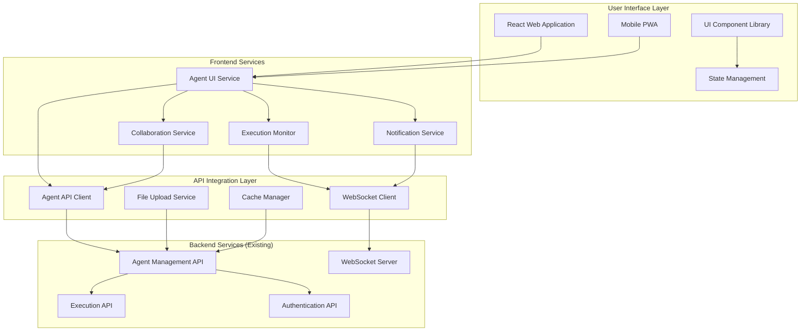
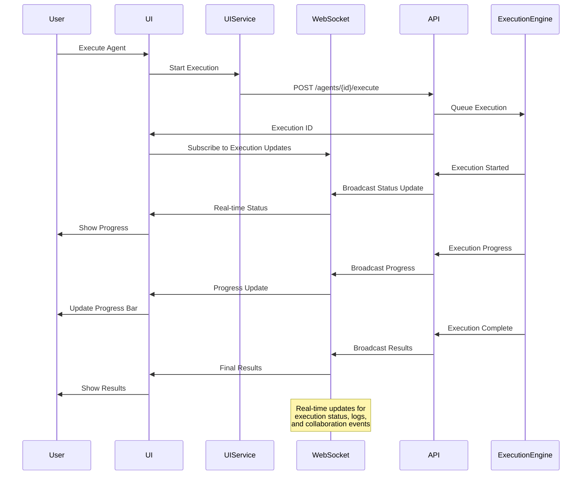

# Design Document

## Overview

The Agent Management via UI system provides a comprehensive web-based interface for managing AI agents, built on top of the existing Agent Management via API infrastructure. The design emphasizes user experience, visual clarity, and accessibility while maintaining the full power and flexibility of the underlying API system. The interface supports both technical and non-technical users through progressive disclosure, contextual help, and role-based feature presentation.

The architecture follows a component-based approach using React with TypeScript, providing responsive design, real-time updates, and seamless integration with the existing C9d.ai platform ecosystem.

## Architecture

### High-Level Architecture



### Component Architecture

```mermaid
graph TB
    subgraph "Page Components"
        AgentDashboard[Agent Dashboard]
        AgentEditor[Agent Editor]
        ExecutionMonitor[Execution Monitor]
        ChainBuilder[Chain Builder]
        AnalyticsDashboard[Analytics Dashboard]
    end
    
    subgraph "Feature Components"
        AgentCard[Agent Card]
        ExecutionViewer[Execution Viewer]
        SchemaBuilder[Schema Builder]
        WorkflowCanvas[Workflow Canvas]
        CollaborationPanel[Collaboration Panel]
    end
    
    subgraph "Common Components"
        SearchBar[Search Bar]
        FilterPanel[Filter Panel]
        ProgressIndicator[Progress Indicator]
        NotificationToast[Notification Toast]
        HelpSystem[Help System]
    end
    
    subgraph "Layout Components"
        AppLayout[App Layout]
        Sidebar[Sidebar]
        Header[Header]
        Modal[Modal System]
    end
    
    AgentDashboard --> AgentCard
    AgentDashboard --> SearchBar
    AgentDashboard --> FilterPanel
    
    AgentEditor --> SchemaBuilder
    AgentEditor --> CollaborationPanel
    AgentEditor --> HelpSystem
    
    ExecutionMonitor --> ExecutionViewer
    ExecutionMonitor --> ProgressIndicator
    
    ChainBuilder --> WorkflowCanvas
    ChainBuilder --> SchemaBuilder
    
    AnalyticsDashboard --> ExecutionViewer
    
    AppLayout --> Sidebar
    AppLayout --> Header
    AppLayout --> NotificationToast
```



### Real-time Data Flow



## Components and Interfaces

### Core UI Services

#### AgentUIService
```typescript
interface AgentUIService {
  getAgentDashboardData(filters: AgentFilters): Promise<AgentDashboardData>
  createAgent(config: AgentConfig): Promise<Agent>
  updateAgent(agentId: string, updates: Partial<AgentConfig>): Promise<Agent>
  duplicateAgent(agentId: string, newName: string): Promise<Agent>
  deleteAgent(agentId: string): Promise<void>
  executeAgent(agentId: string, input: any): Promise<ExecutionResult>
  getExecutionHistory(agentId: string, pagination: Pagination): Promise<ExecutionHistory>
}
```

#### ExecutionMonitor
```typescript
interface ExecutionMonitor {
  subscribeToExecution(executionId: string): Observable<ExecutionUpdate>
  getExecutionStatus(executionId: string): Promise<ExecutionStatus>
  cancelExecution(executionId: string): Promise<void>
  getExecutionLogs(executionId: string): Promise<ExecutionLog[]>
  streamExecutionLogs(executionId: string): Observable<LogEntry>
}
```

#### CollaborationService
```typescript
interface CollaborationService {
  shareAgent(agentId: string, shareConfig: ShareConfig): Promise<ShareResult>
  addComment(agentId: string, comment: Comment): Promise<Comment>
  getComments(agentId: string): Promise<Comment[]>
  subscribeToCollaborationEvents(agentId: string): Observable<CollaborationEvent>
  lockAgentForEditing(agentId: string): Promise<EditLock>
  releaseEditLock(agentId: string): Promise<void>
}
```

### Page Components

#### AgentDashboard
Main dashboard component for browsing and managing agents.

```typescript
interface AgentDashboardProps {
  organizationId?: string
  initialFilters?: AgentFilters
  viewMode: 'grid' | 'table'
  onAgentSelect: (agent: Agent) => void
  onCreateAgent: () => void
}

interface AgentDashboardState {
  agents: Agent[]
  loading: boolean
  filters: AgentFilters
  sortConfig: SortConfig
  selectedAgents: string[]
  searchQuery: string
}
```

#### AgentEditor
Comprehensive agent configuration interface with visual schema building.

```typescript
interface AgentEditorProps {
  agentId?: string
  mode: 'create' | 'edit' | 'duplicate'
  onSave: (agent: Agent) => void
  onCancel: () => void
  collaborationEnabled: boolean
}

interface AgentEditorState {
  agent: AgentConfig
  validation: ValidationResult
  isDirty: boolean
  isLocked: boolean
  collaborators: Collaborator[]
  comments: Comment[]
}
```

#### ChainBuilder
Visual workflow builder for creating agent chains.

```typescript
interface ChainBuilderProps {
  chainId?: string
  availableAgents: Agent[]
  onSave: (chain: AgentChain) => void
  onTest: (chain: AgentChain) => void
  readOnly?: boolean
}

interface ChainBuilderState {
  nodes: ChainNode[]
  connections: ChainConnection[]
  selectedNode?: string
  validationErrors: ValidationError[]
  testResults?: ChainTestResult
}
```

### Feature Components

#### SchemaBuilder
Visual interface for building input/output schemas.

```typescript
interface SchemaBuilderProps {
  schema: JSONSchema
  onChange: (schema: JSONSchema) => void
  mode: 'input' | 'output'
  examples?: any[]
}

interface SchemaField {
  name: string
  type: 'string' | 'number' | 'boolean' | 'object' | 'array'
  required: boolean
  description?: string
  validation?: FieldValidation
}
```

#### ExecutionViewer
Component for displaying execution results and history.

```typescript
interface ExecutionViewerProps {
  execution: Execution
  showLogs: boolean
  showMetrics: boolean
  onRerun?: () => void
  onCompare?: (otherExecution: Execution) => void
}

interface ExecutionDisplay {
  input: FormattedData
  output: FormattedData
  logs: LogEntry[]
  metrics: ExecutionMetrics
  timeline: ExecutionTimeline
}
```

#### WorkflowCanvas
Drag-and-drop canvas for building agent workflows.

```typescript
interface WorkflowCanvasProps {
  nodes: WorkflowNode[]
  connections: WorkflowConnection[]
  onNodeAdd: (node: WorkflowNode) => void
  onNodeUpdate: (nodeId: string, updates: Partial<WorkflowNode>) => void
  onConnectionCreate: (connection: WorkflowConnection) => void
  readOnly?: boolean
}
```

## Data Models

### UI-Specific Models

```typescript
interface AgentDashboardData {
  agents: AgentSummary[]
  totalCount: number
  filters: AvailableFilters
  recentExecutions: RecentExecution[]
  usage: UsageStatistics
}

interface AgentSummary {
  id: string
  name: string
  description: string
  status: AgentStatus
  lastExecuted?: Date
  executionCount: number
  successRate: number
  averageExecutionTime: number
  tags: string[]
  isShared: boolean
  collaboratorCount: number
}

interface ExecutionUpdate {
  executionId: string
  status: ExecutionStatus
  progress: number
  currentStep?: string
  logs?: LogEntry[]
  metrics?: ExecutionMetrics
  error?: ExecutionError
}

interface CollaborationEvent {
  type: 'comment_added' | 'agent_updated' | 'user_joined' | 'user_left' | 'lock_acquired' | 'lock_released'
  userId: string
  timestamp: Date
  data: any
}

interface ShareConfig {
  users: string[]
  permissions: SharePermission[]
  expiresAt?: Date
  message?: string
  allowResharing: boolean
}

interface SharePermission {
  type: 'view' | 'edit' | 'execute' | 'admin'
  restrictions?: PermissionRestriction[]
}
```

### Workflow and Chain Models

```typescript
interface ChainNode {
  id: string
  agentId: string
  position: Position
  configuration: NodeConfiguration
  inputMappings: InputMapping[]
  outputMappings: OutputMapping[]
  conditions?: ExecutionCondition[]
}

interface ChainConnection {
  id: string
  sourceNodeId: string
  targetNodeId: string
  sourcePort: string
  targetPort: string
  dataTransformation?: DataTransformation
}

interface WorkflowNode {
  id: string
  type: 'agent' | 'condition' | 'merge' | 'split'
  position: Position
  data: NodeData
  inputs: NodePort[]
  outputs: NodePort[]
}

interface NodePort {
  id: string
  name: string
  type: string
  required: boolean
  connected: boolean
}

interface DataTransformation {
  type: 'direct' | 'transform' | 'filter'
  expression?: string
  mapping?: Record<string, string>
}
```

### UI State Models

```typescript
interface UIState {
  currentView: 'dashboard' | 'editor' | 'execution' | 'analytics'
  selectedAgent?: string
  activeExecution?: string
  sidebarCollapsed: boolean
  notifications: Notification[]
  modals: ModalState[]
}

interface FilterState {
  search: string
  status: AgentStatus[]
  tags: string[]
  dateRange: DateRange
  sortBy: string
  sortOrder: 'asc' | 'desc'
}

interface EditorState {
  currentTab: 'config' | 'schema' | 'testing' | 'collaboration'
  unsavedChanges: boolean
  validationErrors: ValidationError[]
  previewMode: boolean
}
```

## Error Handling

### UI-Specific Errors
- **ValidationError**: Form validation failed with specific field errors
- **NetworkError**: API request failed due to network connectivity issues
- **AuthenticationExpired**: User session expired during operation
- **ConcurrentEditError**: Multiple users attempting to edit the same agent
- **ResourceNotFound**: Requested agent or execution no longer exists

### User Experience Errors
- **UnsavedChangesWarning**: User attempting to navigate away with unsaved changes
- **ExecutionTimeout**: Agent execution exceeded maximum allowed time
- **InsufficientPermissions**: User lacks required permissions for operation
- **QuotaExceeded**: User has reached execution or storage limits
- **BrowserCompatibility**: Browser doesn't support required features

### Error Response Handling
```typescript
interface UIErrorResponse {
  error: {
    code: string
    message: string
    field?: string
    suggestions?: string[]
    recoveryActions?: RecoveryAction[]
  }
  timestamp: string
  requestId: string
}

interface RecoveryAction {
  label: string
  action: 'retry' | 'refresh' | 'navigate' | 'contact_support'
  url?: string
}
```

## Testing Strategy

### Unit Testing
- **Component Testing**: Test individual React components with various props and states
- **Service Testing**: Test UI services and API integration layers
- **State Management**: Test Redux/Zustand stores and state transitions
- **Utility Functions**: Test data transformation and validation utilities

### Integration Testing
- **API Integration**: Test UI interactions with backend API endpoints
- **Real-time Features**: Test WebSocket connections and real-time updates
- **Authentication Flow**: Test login, logout, and session management
- **File Upload**: Test agent configuration and asset upload functionality

### End-to-End Testing
- **User Workflows**: Test complete user journeys from agent creation to execution
- **Collaboration Features**: Test multi-user editing and sharing scenarios
- **Mobile Experience**: Test responsive design and mobile-specific features
- **Error Scenarios**: Test error handling and recovery workflows

### Accessibility Testing
- **WCAG Compliance**: Test compliance with Web Content Accessibility Guidelines 2.1
- **Keyboard Navigation**: Test full keyboard accessibility for all interactive elements
- **Screen Reader Support**: Test compatibility with screen readers and assistive technologies
- **Color Contrast**: Test color contrast ratios and visual accessibility

### Performance Testing
- **Component Rendering**: Test component render performance with large datasets
- **Memory Usage**: Test memory consumption and cleanup in long-running sessions
- **Network Optimization**: Test API request optimization and caching strategies
- **Mobile Performance**: Test performance on mobile devices and slower networks

### User Experience Testing
- **Usability Testing**: Test interface usability with real users across different skill levels
- **A/B Testing**: Test different UI approaches and measure user engagement
- **Load Testing**: Test UI performance under high concurrent user loads
- **Cross-browser Testing**: Test compatibility across different browsers and versions