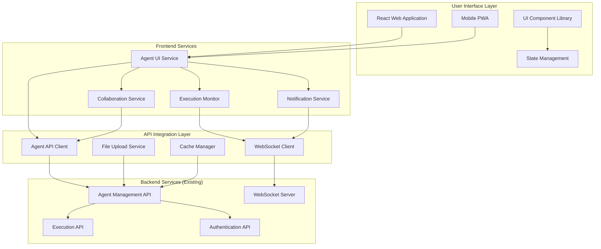
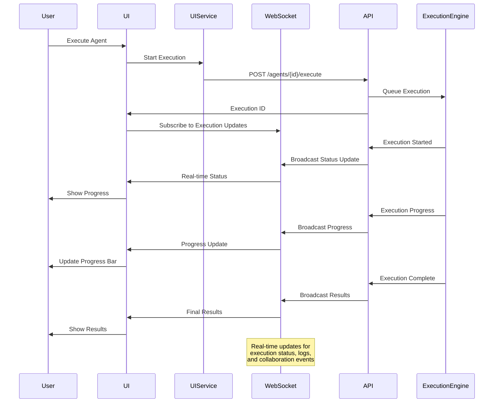

# Design Document

## Overview

The Agent Management via UI system provides a comprehensive web-based interface for managing AI agents, built on top of the existing Agent Management via API infrastructure. The design emphasizes user experience, visual clarity, and accessibility while maintaining the full power and flexibility of the underlying API system. The interface supports both technical and non-technical users through progressive disclosure, contextual help, and role-based feature presentation.

The architecture follows a component-based approach using React with TypeScript, providing responsive design, real-time updates, and seamless integration with the existing C9d.ai platform ecosystem.

## Architecture

### High-Level Architecture


```mermaid
graph TB
    subgraph "User Interface Layer"
        WebApp[React Web Application]
        MobileApp[Mobile PWA]
        Components[UI Component Library]
        StateManager[State Management]
    end
    
    subgraph "Frontend Services"
        AgentUIService[Agent UI Service]
        ExecutionMonitor[Execution Monitor]
        CollaborationService[Collaboration Service]
        NotificationService[Notification Service]
    end
    
    subgraph "API Integration Layer"
        AgentAPIClient[Agent API Client]
        WebSocketClient[WebSocket Client]
        FileUploadService[File Upload Service]
        CacheManager[Cache Manager]
    end
    
    subgraph "Backend Services (Existing)"
        AgentAPI[Agent Management API]
        ExecutionAPI[Execution API]
        AuthAPI[Authentication API]
        WebSocketServer[WebSocket Server]
    end
    
    WebApp --> AgentUIService
    MobileApp --> AgentUIService
    Components --> StateManager
    
    AgentUIService --> ExecutionMonitor
    AgentUIService --> CollaborationService
    AgentUIService --> NotificationService
    
    AgentUIService --> AgentAPIClient
    ExecutionMonitor --> WebSocketClient
    CollaborationService --> AgentAPIClient
    NotificationService --> WebSocketClient
    
    AgentAPIClient --> AgentAPI
    WebSocketClient --> WebSocketServer
    FileUploadService --> AgentAPI
    CacheManager --> AgentAPI
    
    AgentAPI --> ExecutionAPI
    AgentAPI --> AuthAPI
```

### Component Architecture


```mermaid
graph TB
    subgraph "Page Components"
        AgentDashboard[Agent Dashboard]
        AgentEditor[Agent Editor]
        ExecutionMonitor[Execution Monitor]
        ChainBuilder[Chain Builder]
        AnalyticsDashboard[Analytics Dashboard]
    end
    
    subgraph "Feature Components"
        AgentCard[Agent Card]
        ExecutionViewer[Execution Viewer]
        SchemaBuilder[Schema Builder]
        WorkflowCanvas[Workflow Canvas]
        CollaborationPanel[Collaboration Panel]
    end
    
    subgraph "Common Components"
        SearchBar[Search Bar]
        FilterPanel[Filter Panel]
        ProgressIndicator[Progress Indicator]
        NotificationToast[Notification Toast]
        HelpSystem[Help System]
    end
    
    subgraph "Layout Components"
        AppLayout[App Layout]
        Sidebar[Sidebar]
        Header[Header]
        Modal[Modal System]
    end
    
    AgentDashboard --> AgentCard
    AgentDashboard --> SearchBar
    AgentDashboard --> FilterPanel
    
    AgentEditor --> SchemaBuilder
    AgentEditor --> CollaborationPanel
    AgentEditor --> HelpSystem
    
    ExecutionMonitor --> ExecutionViewer
    ExecutionMonitor --> ProgressIndicator
    
    ChainBuilder --> WorkflowCanvas
    ChainBuilder --> SchemaBuilder
    
    AnalyticsDashboard --> ExecutionViewer
    
    AppLayout --> Sidebar
    AppLayout --> Header
    AppLayout --> NotificationToast
```

### Real-time Data Flow


```mermaid
sequenceDiagram
    participant User
    participant UI
    participant UIService
    participant WebSocket
    participant API
    participant ExecutionEngine
    
    User->>UI: Execute Agent
    UI->>UIService: Start Execution
    UIService->>API: POST /agents/{id}/execute
    API->>ExecutionEngine: Queue Execution
    API->>UI: Execution ID
    UI->>WebSocket: Subscribe to Execution Updates
    
    ExecutionEngine->>API: Execution Started
    API->>WebSocket: Broadcast Status Update
    WebSocket->>UI: Real-time Status
    UI->>User: Show Progress
    
    ExecutionEngine->>API: Execution Progress
    API->>WebSocket: Broadcast Progress
    WebSocket->>UI: Progress Update
    UI->>User: Update Progress Bar
    
    ExecutionEngine->>API: Execution Complete
    API->>WebSocket: Broadcast Results
    WebSocket->>UI: Final Results
    UI->>User: Show Results
    
    Note over WebSocket: Real-time updates for<br/>execution status, logs,<br/>and collaboration events
```

## Components and Interfaces

### Core UI Services

#### AgentUIService
```typescript
interface AgentUIService {
  // Agent CRUD operations
  getAgentDashboardData(filters: AgentFilters): Promise<AgentDashboardData>
  createAgent(config: AgentConfig): Promise<Agent>
  updateAgent(agentId: string, updates: Partial<AgentConfig>): Promise<Agent>
  duplicateAgent(agentId: string, newName: string): Promise<Agent>
  deleteAgent(agentId: string): Promise<void>
  
  // Agent execution
  executeAgent(agentId: string, input: any): Promise<ExecutionResult>
  cancelExecution(executionId: string): Promise<void>
  retryExecution(executionId: string): Promise<ExecutionResult>
  
  // Execution history and analytics
  getExecutionHistory(agentId: string, pagination: Pagination): Promise<ExecutionHistory>
  getExecutionAnalytics(agentId: string, timeRange: TimeRange): Promise<ExecutionAnalytics>
  compareExecutions(executionIds: string[]): Promise<ExecutionComparison>
  exportExecutionData(agentId: string, format: ExportFormat): Promise<Blob>
  
  // Template management
  createTemplate(agentId: string, templateConfig: TemplateConfig): Promise<Template>
  getTemplates(filters: TemplateFilters): Promise<Template[]>
  applyTemplate(templateId: string, parameters: Record<string, any>): Promise<Agent>
  exportAgentConfig(agentId: string): Promise<AgentConfigExport>
  importAgentConfig(config: AgentConfigExport): Promise<Agent>
  
  // Persona library
  getPersonaLibrary(): Promise<Persona[]>
  getPersonaById(personaId: string): Promise<Persona>
}
```

#### ExecutionMonitor
```typescript
interface ExecutionMonitor {
  subscribeToExecution(executionId: string): Observable<ExecutionUpdate>
  getExecutionStatus(executionId: string): Promise<ExecutionStatus>
  cancelExecution(executionId: string): Promise<void>
  getExecutionLogs(executionId: string): Promise<ExecutionLog[]>
  streamExecutionLogs(executionId: string): Observable<LogEntry>
}
```

#### CollaborationService
```typescript
interface CollaborationService {
  // Sharing and permissions
  shareAgent(agentId: string, shareConfig: ShareConfig): Promise<ShareResult>
  updateSharePermissions(shareId: string, permissions: SharePermission[]): Promise<void>
  revokeShare(shareId: string): Promise<void>
  getSharedUsers(agentId: string): Promise<SharedUser[]>
  
  // Comments and discussions
  addComment(agentId: string, comment: Comment): Promise<Comment>
  getComments(agentId: string): Promise<Comment[]>
  updateComment(commentId: string, content: string): Promise<Comment>
  deleteComment(commentId: string): Promise<void>
  addAnnotation(agentId: string, annotation: Annotation): Promise<Annotation>
  
  // Version control
  getVersionHistory(agentId: string): Promise<Version[]>
  compareVersions(versionId1: string, versionId2: string): Promise<VersionDiff>
  rollbackToVersion(agentId: string, versionId: string): Promise<Agent>
  createVersionSnapshot(agentId: string, description: string): Promise<Version>
  
  // Real-time collaboration
  subscribeToCollaborationEvents(agentId: string): Observable<CollaborationEvent>
  lockAgentForEditing(agentId: string): Promise<EditLock>
  releaseEditLock(agentId: string): Promise<void>
  getActiveEditors(agentId: string): Promise<ActiveEditor[]>
  
  // Conflict resolution
  detectConflicts(agentId: string, localChanges: AgentChanges): Promise<Conflict[]>
  resolveConflict(conflictId: string, resolution: ConflictResolution): Promise<void>
}
```

### Page Components

#### AgentDashboard
Main dashboard component for browsing and managing agents with comprehensive search, filtering, and sorting capabilities.

**Design Rationale**: The dashboard serves as the primary entry point for agent management, requiring efficient data presentation and intuitive navigation. The dual view mode (grid/table) accommodates different user preferences and use cases.

```typescript
interface AgentDashboardProps {
  organizationId?: string
  initialFilters?: AgentFilters
  viewMode: 'grid' | 'table'
  onAgentSelect: (agent: Agent) => void
  onCreateAgent: () => void
  showEmptyState?: boolean
}

interface AgentDashboardState {
  agents: Agent[]
  loading: boolean
  filters: AgentFilters
  sortConfig: SortConfig
  selectedAgents: string[]
  searchQuery: string
  viewMode: 'grid' | 'table'
  pagination: PaginationState
}

interface AgentFilters {
  status?: AgentStatus[]
  persona?: string[]
  tags?: string[]
  createdDateRange?: DateRange
  lastExecutedRange?: DateRange
  createdBy?: string[]
}

interface SortConfig {
  field: 'name' | 'createdAt' | 'lastModified' | 'executionFrequency' | 'successRate'
  order: 'asc' | 'desc'
}
```

#### AgentEditor
Comprehensive agent configuration interface with guided wizard, visual schema building, and real-time validation.

**Design Rationale**: The editor supports both novice and advanced users through progressive disclosure. The wizard mode guides non-technical users through agent creation, while advanced mode provides full configuration access. Real-time validation prevents configuration errors before submission.

```typescript
interface AgentEditorProps {
  agentId?: string
  mode: 'create' | 'edit' | 'duplicate'
  wizardMode?: boolean // Guided wizard for non-technical users
  onSave: (agent: Agent) => void
  onCancel: () => void
  collaborationEnabled: boolean
  personaLibrary?: Persona[]
}

interface AgentEditorState {
  agent: AgentConfig
  validation: ValidationResult
  isDirty: boolean
  isLocked: boolean
  collaborators: Collaborator[]
  comments: Comment[]
  currentStep?: WizardStep // For wizard mode
  selectedPersona?: Persona
  previewMode: boolean
}

interface WizardStep {
  id: string
  title: string
  description: string
  completed: boolean
  fields: FormField[]
}

interface Persona {
  id: string
  name: string
  description: string
  useCases: string[]
  defaultConfig: Partial<AgentConfig>
  icon?: string
  category: string
}
```

#### ChainBuilder
Visual workflow builder for creating agent chains with drag-and-drop interface, conditional logic, and step-by-step testing.

**Design Rationale**: The node-based visual interface makes complex workflows accessible to non-technical users. Real-time validation prevents incompatible connections, and step-by-step testing enables debugging of multi-agent workflows.

```typescript
interface ChainBuilderProps {
  chainId?: string
  availableAgents: Agent[]
  onSave: (chain: AgentChain) => void
  onTest: (chain: AgentChain) => void
  readOnly?: boolean
  enableConditionalLogic?: boolean
}

interface ChainBuilderState {
  nodes: ChainNode[]
  connections: ChainConnection[]
  selectedNode?: string
  validationErrors: ValidationError[]
  testResults?: ChainTestResult
  testingMode: boolean
  currentTestStep?: string
  conditionalBranches: ConditionalBranch[]
  errorHandlers: ErrorHandler[]
}

interface ConditionalBranch {
  id: string
  condition: string
  truePath: string
  falsePath: string
}

interface ErrorHandler {
  nodeId: string
  errorType: string
  action: 'retry' | 'skip' | 'fallback' | 'terminate'
  fallbackNodeId?: string
  retryConfig?: RetryConfig
}
```

#### AnalyticsDashboard
Comprehensive analytics and performance monitoring dashboard for agents.

**Design Rationale**: Provides data-driven insights into agent performance, enabling users to optimize configurations and identify issues. Charts and visualizations make complex data accessible.

```typescript
interface AnalyticsDashboardProps {
  agentId?: string
  organizationId?: string
  timeRange: TimeRange
  onExport: (format: ExportFormat) => void
}

interface AnalyticsDashboardState {
  metrics: PerformanceMetrics
  executionHistory: ExecutionSummary[]
  charts: ChartData[]
  recommendations: OptimizationRecommendation[]
  loading: boolean
}

interface PerformanceMetrics {
  totalExecutions: number
  successRate: number
  averageExecutionTime: number
  errorRate: number
  usageByDay: TimeSeriesData[]
  performanceTrends: TrendData[]
}

interface OptimizationRecommendation {
  type: 'performance' | 'cost' | 'reliability'
  severity: 'low' | 'medium' | 'high'
  description: string
  suggestedAction: string
  estimatedImpact: string
}
```

#### OrganizationAdminPanel
Administrative interface for organization-wide agent management and governance.

**Design Rationale**: Centralizes administrative functions for team management, usage monitoring, and policy enforcement. Role-based access ensures only authorized users can modify organizational settings.

```typescript
interface OrganizationAdminPanelProps {
  organizationId: string
  currentUserRole: OrganizationRole
}

interface OrganizationAdminPanelState {
  members: OrganizationMember[]
  usageStatistics: UsageStatistics
  policies: OrganizationPolicy[]
  auditLogs: AuditLogEntry[]
  quotas: ResourceQuota[]
  alerts: PolicyAlert[]
}

interface OrganizationPolicy {
  id: string
  type: 'creation_limit' | 'execution_quota' | 'approval_workflow'
  enabled: boolean
  configuration: Record<string, any>
  enforcementLevel: 'warning' | 'blocking'
}

interface AuditLogEntry {
  id: string
  timestamp: Date
  userId: string
  userName: string
  action: string
  resourceType: string
  resourceId: string
  details: Record<string, any>
  ipAddress?: string
}
```

#### HelpSystem
Integrated contextual help and documentation system.

**Design Rationale**: Reduces friction by providing help within the application context. Interactive tutorials and guided tours improve feature adoption for new users.

```typescript
interface HelpSystemProps {
  context: string // Current page/feature context
  onFeedback: (feedback: HelpFeedback) => void
  onSupportTicket: (ticket: SupportTicket) => void
}

interface HelpSystemState {
  tooltips: ContextualTooltip[]
  tutorials: InteractiveTutorial[]
  documentation: DocumentationLink[]
  activeTour?: GuidedTour
  feedbackEnabled: boolean
}

interface GuidedTour {
  id: string
  steps: TourStep[]
  currentStep: number
  completed: boolean
}

interface InteractiveTutorial {
  id: string
  title: string
  description: string
  estimatedTime: number
  difficulty: 'beginner' | 'intermediate' | 'advanced'
  steps: TutorialStep[]
  exampleConfigs: AgentConfig[]
}
```

### Feature Components

#### SchemaBuilder
Visual interface for building input/output schemas with drag-and-drop field creation.

**Design Rationale**: Abstracts JSON Schema complexity behind an intuitive visual interface. Drag-and-drop field creation and real-time validation make schema definition accessible to non-technical users.

```typescript
interface SchemaBuilderProps {
  schema: JSONSchema
  onChange: (schema: JSONSchema) => void
  mode: 'input' | 'output'
  examples?: any[]
  enableDragDrop?: boolean
  showPreview?: boolean
}

interface SchemaBuilderState {
  fields: SchemaField[]
  selectedField?: string
  validationErrors: ValidationError[]
  previewData?: any
  draggedField?: SchemaField
}

interface SchemaField {
  id: string
  name: string
  type: 'string' | 'number' | 'boolean' | 'object' | 'array'
  required: boolean
  description?: string
  validation?: FieldValidation
  nested?: SchemaField[] // For objects and arrays
  defaultValue?: any
  examples?: any[]
}

interface FieldValidation {
  min?: number
  max?: number
  pattern?: string
  enum?: any[]
  custom?: string
}
```

#### ExecutionViewer
Component for displaying execution results, history, and real-time monitoring with download and sharing capabilities.

**Design Rationale**: Provides comprehensive execution visibility with formatted results, live logs, and performance metrics. Download and sharing options enable collaboration and result reuse.

```typescript
interface ExecutionViewerProps {
  execution: Execution
  showLogs: boolean
  showMetrics: boolean
  realTimeUpdates?: boolean
  onRerun?: () => void
  onCompare?: (otherExecution: Execution) => void
  onDownload?: (format: ExportFormat) => void
  onShare?: () => void
  onUseAsInput?: (targetAgentId: string) => void
}

interface ExecutionViewerState {
  display: ExecutionDisplay
  selectedTab: 'results' | 'logs' | 'metrics' | 'timeline'
  logFilter: LogFilter
  expandedSections: string[]
}

interface ExecutionDisplay {
  input: FormattedData
  output: FormattedData
  logs: LogEntry[]
  metrics: ExecutionMetrics
  timeline: ExecutionTimeline
  errorDetails?: ErrorDetails
  troubleshootingSuggestions?: string[]
}

interface ErrorDetails {
  message: string
  code: string
  stack?: string
  context: Record<string, any>
  suggestedFixes: string[]
  documentationLinks: string[]
}
```

#### WorkflowCanvas
Drag-and-drop canvas for building agent workflows with visual data flow mapping.

**Design Rationale**: Node-based visual programming interface makes workflow creation intuitive. Visual data flow mapping helps users understand how data moves between agents.

```typescript
interface WorkflowCanvasProps {
  nodes: WorkflowNode[]
  connections: WorkflowConnection[]
  onNodeAdd: (node: WorkflowNode) => void
  onNodeUpdate: (nodeId: string, updates: Partial<WorkflowNode>) => void
  onConnectionCreate: (connection: WorkflowConnection) => void
  onConnectionDelete: (connectionId: string) => void
  readOnly?: boolean
  showDataFlow?: boolean
  validationEnabled?: boolean
}

interface WorkflowCanvasState {
  selectedNodes: string[]
  selectedConnections: string[]
  draggedNode?: WorkflowNode
  connectionInProgress?: PartialConnection
  validationErrors: ConnectionValidationError[]
  zoom: number
  panOffset: { x: number; y: number }
}

interface ConnectionValidationError {
  connectionId: string
  sourceNodeId: string
  targetNodeId: string
  error: string
  suggestion: string
}
```

#### TemplateGallery
Component for browsing, searching, and applying agent templates.

**Design Rationale**: Template gallery accelerates agent creation by providing reusable configurations. Search and filtering help users find relevant templates quickly.

```typescript
interface TemplateGalleryProps {
  onTemplateSelect: (template: Template) => void
  onTemplatePreview: (template: Template) => void
  organizationId?: string
  showPublicTemplates?: boolean
}

interface TemplateGalleryState {
  templates: Template[]
  filters: TemplateFilters
  searchQuery: string
  selectedTemplate?: Template
  previewMode: boolean
}

interface Template {
  id: string
  name: string
  description: string
  category: string
  tags: string[]
  author: string
  usageCount: number
  rating: number
  parameters: TemplateParameter[]
  agentConfig: Partial<AgentConfig>
  isPublic: boolean
  organizationId?: string
}

interface TemplateParameter {
  name: string
  type: string
  required: boolean
  description: string
  defaultValue?: any
  validation?: FieldValidation
}
```

#### MobileAgentView
Mobile-optimized component for agent monitoring and basic operations.

**Design Rationale**: Simplified interface optimized for touch interactions and small screens. Focuses on essential monitoring and execution features while clearly indicating desktop-only functionality.

```typescript
interface MobileAgentViewProps {
  agentId: string
  enableNotifications?: boolean
  onExecute: (input: any) => void
}

interface MobileAgentViewState {
  agent: Agent
  recentExecutions: ExecutionSummary[]
  notifications: Notification[]
  quickActions: QuickAction[]
  desktopOnlyFeatures: string[]
}

interface QuickAction {
  id: string
  label: string
  icon: string
  action: () => void
  requiresDesktop: boolean
}

interface Notification {
  id: string
  type: 'execution_complete' | 'execution_failed' | 'agent_shared' | 'comment_added'
  title: string
  message: string
  timestamp: Date
  read: boolean
  actionUrl?: string
}
```

## Data Models

### Database Schema Alignment

**CRITICAL REQUIREMENT**: All data models MUST align with existing Supabase schema and Agent Management API models.

The UI layer uses the same database schema as the Agent Management API to ensure consistency and avoid data duplication. All database operations respect Row Level Security (RLS) policies enforced at the database level.

**Schema Integration Strategy**:
- Reuse existing `agents` table from Agent Management API
- Reuse existing `executions` table for execution history
- Extend with UI-specific tables for collaboration features:
  - `agent_shares`: Sharing permissions and configurations
  - `agent_comments`: Comments and annotations
  - `agent_versions`: Version history snapshots
  - `agent_templates`: Reusable agent templates
  - `organization_policies`: Organization-level policies
  - `audit_logs`: Comprehensive audit trail

**RLS Policy Requirements**:
- All tables MUST have RLS enabled
- Policies MUST use Clerk user IDs for authentication
- Policies MUST enforce organization-level isolation
- Policies MUST respect role-based permissions
- Policies MUST be tested in integration tests

**Data Type Consistency**:
- Use existing `AgentConfig` type from Agent Management API
- Use existing `ExecutionResult` type for execution data
- Extend types for UI-specific features (comments, versions, templates)
- Maintain TypeScript type safety across API and UI layers

### UI-Specific Models

```typescript
interface AgentDashboardData {
  agents: AgentSummary[]
  totalCount: number
  filters: AvailableFilters
  recentExecutions: RecentExecution[]
  usage: UsageStatistics
  suggestions: AgentSuggestion[] // For empty state and no results
}

interface AgentSummary {
  id: string
  name: string
  description: string
  status: AgentStatus
  persona?: string
  lastExecuted?: Date
  executionCount: number
  successRate: number
  averageExecutionTime: number
  tags: string[]
  isShared: boolean
  collaboratorCount: number
  createdAt: Date
  lastModified: Date
  createdBy: string
}

interface AgentSuggestion {
  type: 'create' | 'template' | 'tutorial'
  title: string
  description: string
  action: () => void
  icon?: string
}

interface ExecutionUpdate {
  executionId: string
  status: ExecutionStatus
  progress: number
  currentStep?: string
  logs?: LogEntry[]
  metrics?: ExecutionMetrics
  error?: ExecutionError
  retryable: boolean
}

interface ExecutionAnalytics {
  agentId: string
  timeRange: TimeRange
  totalExecutions: number
  successRate: number
  failureRate: number
  averageExecutionTime: number
  executionsByDay: TimeSeriesData[]
  errorDistribution: ErrorDistribution[]
  performanceTrends: TrendData[]
  recommendations: OptimizationRecommendation[]
}

interface ExecutionComparison {
  executions: Execution[]
  differences: ComparisonDifference[]
  performanceComparison: PerformanceComparison
  configurationDifferences: ConfigDifference[]
}

interface CollaborationEvent {
  type: 'comment_added' | 'agent_updated' | 'user_joined' | 'user_left' | 'lock_acquired' | 'lock_released' | 'version_created' | 'conflict_detected'
  userId: string
  userName: string
  timestamp: Date
  data: any
}

interface ShareConfig {
  users: string[]
  permissions: SharePermission[]
  expiresAt?: Date
  message?: string
  allowResharing: boolean
  notifyUsers: boolean
}

interface SharePermission {
  type: 'view' | 'edit' | 'execute' | 'admin'
  restrictions?: PermissionRestriction[]
}

interface Version {
  id: string
  agentId: string
  versionNumber: number
  description: string
  createdBy: string
  createdAt: Date
  changes: AgentChanges
  snapshot: AgentConfig
}

interface VersionDiff {
  version1: Version
  version2: Version
  additions: ConfigChange[]
  deletions: ConfigChange[]
  modifications: ConfigChange[]
}

interface Conflict {
  id: string
  agentId: string
  type: 'concurrent_edit' | 'version_mismatch'
  localChanges: AgentChanges
  remoteChanges: AgentChanges
  conflictingFields: string[]
  detectedAt: Date
}

interface ConflictResolution {
  strategy: 'accept_local' | 'accept_remote' | 'merge' | 'manual'
  mergedChanges?: AgentChanges
}
```

### Workflow and Chain Models

```typescript
interface ChainNode {
  id: string
  agentId: string
  position: Position
  configuration: NodeConfiguration
  inputMappings: InputMapping[]
  outputMappings: OutputMapping[]
  conditions?: ExecutionCondition[]
}

interface ChainConnection {
  id: string
  sourceNodeId: string
  targetNodeId: string
  sourcePort: string
  targetPort: string
  dataTransformation?: DataTransformation
}

interface WorkflowNode {
  id: string
  type: 'agent' | 'condition' | 'merge' | 'split'
  position: Position
  data: NodeData
  inputs: NodePort[]
  outputs: NodePort[]
}

interface NodePort {
  id: string
  name: string
  type: string
  required: boolean
  connected: boolean
}

interface DataTransformation {
  type: 'direct' | 'transform' | 'filter'
  expression?: string
  mapping?: Record<string, string>
}
```

### Organization and Administration Models

```typescript
interface OrganizationMember {
  userId: string
  userName: string
  email: string
  role: OrganizationRole
  permissions: string[]
  joinedAt: Date
  lastActive: Date
}

interface OrganizationRole {
  id: string
  name: string
  permissions: Permission[]
  isCustom: boolean
}

interface Permission {
  resource: 'agent' | 'execution' | 'template' | 'organization'
  actions: ('create' | 'read' | 'update' | 'delete' | 'execute' | 'share')[]
}

interface UsageStatistics {
  organizationId: string
  period: TimeRange
  totalAgents: number
  totalExecutions: number
  activeUsers: number
  storageUsed: number
  executionTimeUsed: number
  quotaLimits: ResourceQuota
  usageByUser: UserUsage[]
  usageByAgent: AgentUsage[]
}

interface ResourceQuota {
  maxAgents: number
  maxExecutionsPerMonth: number
  maxStorageGB: number
  maxExecutionTimeMinutes: number
  currentUsage: {
    agents: number
    executions: number
    storage: number
    executionTime: number
  }
}

interface PolicyAlert {
  id: string
  type: 'quota_exceeded' | 'policy_violation' | 'suspicious_activity'
  severity: 'low' | 'medium' | 'high' | 'critical'
  message: string
  details: Record<string, any>
  timestamp: Date
  resolved: boolean
  actions: AlertAction[]
}

interface AlertAction {
  label: string
  action: 'notify' | 'block' | 'throttle' | 'review'
  automated: boolean
}
```

### UI State Models

```typescript
interface UIState {
  currentView: 'dashboard' | 'editor' | 'execution' | 'analytics' | 'admin' | 'templates'
  selectedAgent?: string
  activeExecution?: string
  sidebarCollapsed: boolean
  notifications: Notification[]
  modals: ModalState[]
  helpContext?: string
  activeTour?: string
  isMobile: boolean
}

interface FilterState {
  search: string
  status: AgentStatus[]
  persona: string[]
  tags: string[]
  dateRange: DateRange
  sortBy: string
  sortOrder: 'asc' | 'desc'
  createdBy: string[]
}

interface EditorState {
  currentTab: 'config' | 'schema' | 'testing' | 'collaboration' | 'versions'
  unsavedChanges: boolean
  validationErrors: ValidationError[]
  previewMode: boolean
  wizardStep?: number
  selectedPersona?: string
}

interface MobileState {
  orientation: 'portrait' | 'landscape'
  touchEnabled: boolean
  notificationsEnabled: boolean
  offlineMode: boolean
  simplifiedView: boolean
}
```

## Correctness Properties

*A property is a characteristic or behavior that should hold true across all valid executions of a system—essentially, a formal statement about what the system should do. Properties serve as the bridge between human-readable specifications and machine-verifiable correctness guarantees.*

### Property 1: Agent Creation Validation
*For any* agent configuration submitted through the wizard or editor, the system should validate all required fields and reject invalid configurations before submission.
**Validates: Requirements 1.1, 1.2, 1.5**

### Property 2: Search Result Consistency
*For any* search query, all returned agents should match the search criteria across names, descriptions, and tags.
**Validates: Requirements 2.2**

### Property 3: Filter Application Correctness
*For any* combination of filters (status, persona, tags, dates), the displayed agents should satisfy all active filter conditions.
**Validates: Requirements 2.3**

### Property 4: Sort Order Preservation
*For any* sort configuration, agents should be ordered consistently according to the selected field and direction.
**Validates: Requirements 2.4**

### Property 5: Real-time Execution Updates
*For any* agent execution, status updates received via WebSocket should be reflected in the UI within 100ms.
**Validates: Requirements 3.2, 3.4**

### Property 6: Execution Input Validation
*For any* agent execution, the input form should validate data against the agent's input schema before submission.
**Validates: Requirements 3.1**

### Property 7: Execution History Completeness
*For any* agent, the execution history should include all executions with complete input, output, and performance data.
**Validates: Requirements 4.1**

### Property 8: Analytics Accuracy
*For any* time range, calculated metrics (success rate, average execution time) should accurately reflect the underlying execution data.
**Validates: Requirements 4.2**

### Property 9: Execution Comparison Consistency
*For any* set of executions being compared, differences should be accurately identified and displayed side-by-side.
**Validates: Requirements 4.3**

### Property 10: Permission Enforcement
*For any* shared agent, users should only be able to perform actions permitted by their assigned permissions (view, edit, execute, admin).
**Validates: Requirements 5.1**

### Property 11: Version History Integrity
*For any* agent with version history, each version should preserve a complete snapshot of the configuration at that point in time.
**Validates: Requirements 5.3**

### Property 12: Edit Lock Prevention
*For any* agent being edited, the system should prevent concurrent modifications by acquiring an edit lock.
**Validates: Requirements 5.4**

### Property 13: Conflict Detection
*For any* concurrent edit scenario, the system should detect conflicting changes and present resolution options.
**Validates: Requirements 5.5**

### Property 14: Chain Validation
*For any* agent chain, all connections should be validated for type compatibility between output and input schemas.
**Validates: Requirements 6.1, 6.5**

### Property 15: Data Flow Mapping Correctness
*For any* chain connection, data transformations should correctly map source outputs to target inputs.
**Validates: Requirements 6.2**

### Property 16: Step-by-step Execution Accuracy
*For any* chain being tested, intermediate results at each step should be captured and available for inspection.
**Validates: Requirements 6.3**

### Property 17: Role-Based Access Control
*For any* organization member, available actions should be restricted to those permitted by their role.
**Validates: Requirements 7.1**

### Property 18: Usage Statistics Accuracy
*For any* organization, displayed usage statistics should accurately reflect actual resource consumption.
**Validates: Requirements 7.2**

### Property 19: Policy Enforcement
*For any* policy violation (quota exceeded, limit reached), the system should prevent the action and alert administrators.
**Validates: Requirements 7.3, 7.5**

### Property 20: Audit Log Completeness
*For any* agent operation, an audit log entry should be created with user attribution, timestamp, and operation details.
**Validates: Requirements 7.4**

### Property 21: Template Parameter Validation
*For any* template being applied, all required parameters should be validated before agent creation.
**Validates: Requirements 8.2, 8.5**

### Property 22: Configuration Export/Import Round-trip
*For any* agent configuration, exporting then importing should produce an equivalent agent configuration.
**Validates: Requirements 8.4**

### Property 23: Contextual Help Relevance
*For any* page or feature, displayed help content should be relevant to the current context.
**Validates: Requirements 9.1**

### Property 24: Error Message Clarity
*For any* error scenario, the system should provide clear error messages with actionable suggestions.
**Validates: Requirements 9.2**

### Property 25: Mobile Responsive Layout
*For any* screen size below 768px, the interface should adapt to a mobile-optimized layout.
**Validates: Requirements 10.1**

### Property 26: Touch Interaction Support
*For any* interactive element on mobile, touch gestures should work correctly without requiring precise pointer input.
**Validates: Requirements 10.1**

### Property 27: Mobile Notification Delivery
*For any* important agent event (execution complete, failure), mobile users should receive push notifications.
**Validates: Requirements 10.4**

### Property 28: Feature Availability Indication
*For any* feature not available on mobile, the system should clearly indicate desktop requirement and provide alternatives.
**Validates: Requirements 10.5**

## Error Handling

### UI-Specific Errors
- **ValidationError**: Form validation failed with specific field errors
- **NetworkError**: API request failed due to network connectivity issues
- **AuthenticationExpired**: User session expired during operation
- **ConcurrentEditError**: Multiple users attempting to edit the same agent
- **ResourceNotFound**: Requested agent or execution no longer exists

### User Experience Errors
- **UnsavedChangesWarning**: User attempting to navigate away with unsaved changes
- **ExecutionTimeout**: Agent execution exceeded maximum allowed time
- **InsufficientPermissions**: User lacks required permissions for operation
- **QuotaExceeded**: User has reached execution or storage limits
- **BrowserCompatibility**: Browser doesn't support required features

### Error Response Handling
```typescript
interface UIErrorResponse {
  error: {
    code: string
    message: string
    field?: string
    suggestions?: string[]
    recoveryActions?: RecoveryAction[]
  }
  timestamp: string
  requestId: string
}

interface RecoveryAction {
  label: string
  action: 'retry' | 'refresh' | 'navigate' | 'contact_support'
  url?: string
}
```

## Technology Stack and Implementation Details

### Frontend Framework
- **Next.js 15+**: App Router for server-side rendering and optimal performance
- **React 19+**: Latest React features including Server Components
- **TypeScript 5+**: Full type safety across the application
- **Tailwind CSS**: Utility-first styling with shadcn/ui components

**Rationale**: Next.js provides excellent performance through SSR/SSG, built-in optimization, and seamless Vercel deployment. React Server Components reduce client-side JavaScript bundle size.

### State Management
- **Zustand**: Lightweight state management for client-side state
- **React Query**: Server state management with caching and real-time updates
- **WebSocket Integration**: Real-time collaboration and execution monitoring

**Rationale**: Zustand provides simple, performant state management without Redux boilerplate. React Query handles server state caching and synchronization efficiently.

### UI Component Library
- **shadcn/ui**: Accessible, customizable component primitives
- **Radix UI**: Unstyled, accessible component foundation
- **Lucide Icons**: Consistent icon system
- **React Flow**: Node-based workflow canvas for chain builder

**Rationale**: shadcn/ui provides production-ready components with full accessibility support. React Flow offers robust node-based UI for workflow building.

### Form Management
- **React Hook Form**: Performant form handling with minimal re-renders
- **Zod**: Schema validation for forms and API data
- **Visual Schema Builder**: Custom drag-and-drop schema editor

**Rationale**: React Hook Form provides excellent performance for complex forms. Zod enables type-safe validation with TypeScript integration.

### Real-time Communication
- **WebSocket Client**: Real-time execution updates and collaboration
- **Server-Sent Events**: Fallback for real-time updates
- **Optimistic Updates**: Immediate UI feedback with rollback on error

**Rationale**: WebSocket provides low-latency bidirectional communication for real-time features. Optimistic updates improve perceived performance.

### Authentication and Authorization
- **Clerk**: User authentication and session management
- **@clerk/testing**: Official testing utilities for Clerk integration
- **Role-Based Access Control**: Organization-level permissions

**Rationale**: Clerk provides enterprise-grade authentication with minimal implementation effort. Official testing utilities ensure reliable test coverage.

### Data Fetching and Caching
- **React Query**: Automatic caching, background refetching, and stale data management
- **Supabase Client**: Direct database access with Row Level Security (RLS) policies
- **Redis**: Server-side caching for frequently accessed data and session management
- **Optimistic Updates**: Immediate UI feedback with automatic rollback on error

**Rationale**: React Query provides sophisticated caching strategies that reduce API calls and improve performance. Supabase RLS ensures data security at the database level. Redis caching reduces database load for frequently accessed data.

**Database Integration**:
- All agent data stored in Supabase PostgreSQL with proper RLS policies
- Clerk user IDs used for RLS policy enforcement
- Database schema aligns with existing Agent Management API models
- Real-time subscriptions via Supabase for collaboration features

### Mobile Support
- **Progressive Web App (PWA)**: Offline capabilities and app-like experience
- **Responsive Design**: Mobile-first approach with breakpoint-based layouts
- **Touch Optimizations**: Larger touch targets and gesture support
- **Push Notifications**: Web Push API for mobile notifications

**Rationale**: PWA provides native app-like experience without separate mobile app development. Responsive design ensures consistent experience across devices.

### Performance Optimization
- **Code Splitting**: Dynamic imports for route-based code splitting
- **Image Optimization**: Next.js Image component with automatic optimization
- **Bundle Analysis**: Regular bundle size monitoring and optimization
- **Lazy Loading**: Defer loading of non-critical components

**Rationale**: Performance optimizations ensure fast load times and smooth interactions, especially important for mobile users and complex workflows.

### Deployment and Infrastructure
- **Vercel**: Hosting platform optimized for Next.js with automatic deployments from Git
- **Edge Functions**: Geographically distributed API endpoints for low-latency responses
- **CDN**: Global content delivery for static assets with automatic cache invalidation
- **Environment Management**: Phase.dev for secure environment variable management (never use .env files)
- **Build Configuration**: Turbo for monorepo build orchestration with proper caching
- **Memory Management**: NODE_OPTIONS configured for large builds and test suites

**Rationale**: Vercel provides seamless Next.js deployment with automatic optimization and preview deployments. Phase.dev ensures secure environment variable management across all environments. Turbo enables efficient monorepo builds with intelligent caching.

**Vercel-Specific Optimizations**:
- Next.js App Router for optimal Vercel edge runtime performance
- Automatic image optimization via Vercel Image Optimization
- Edge middleware for authentication and routing
- Vercel Analytics for Core Web Vitals monitoring
- Preview deployments for every pull request

### Monitoring and Observability
- **Vercel Analytics**: Core Web Vitals and performance monitoring
- **Error Tracking**: Sentry for error monitoring and debugging
- **User Analytics**: PostHog for product analytics and feature usage
- **Performance Monitoring**: Real User Monitoring (RUM) for actual user experience

**Rationale**: Comprehensive monitoring enables data-driven optimization and rapid issue detection.

## Testing Strategy

### Testing Philosophy
The testing strategy follows modern testing standards with official testing utilities, memory-optimized execution, and tiered coverage requirements. All tests must use official utilities (e.g., @clerk/testing) and never mock critical external dependencies like Phase.dev.

### Unit Testing
- **Component Testing**: Test individual React components with various props and states using @testing-library/react
- **Service Testing**: Test UI services and API integration layers with proper mocking
- **State Management**: Test Zustand stores and state transitions
- **Utility Functions**: Test data transformation and validation utilities
- **Schema Builder**: Test visual schema building logic and validation
- **Template System**: Test template parameter replacement and validation

**Coverage Target**: 100% for services, 95% for models, 90% for API routes, 85% global minimum

### Integration Testing
**CRITICAL REQUIREMENT**: All integration tests MUST use real services (Supabase, Redis, Phase.dev) - never mocks.

- **Database Integration**: Test with real Supabase instance using test-specific schemas or namespaces
- **API Integration**: Test UI interactions with backend API endpoints using real HTTP calls
- **Real-time Features**: Test Supabase real-time subscriptions with actual connections
- **Authentication Flow**: Test Clerk integration using @clerk/testing utilities (never custom mocks)
- **Collaboration Features**: Test multi-user scenarios with real-time event handling via Supabase
- **Version Control**: Test version history, diff generation, and rollback functionality with real database
- **Template Application**: Test end-to-end template usage from gallery to agent creation
- **Cache Integration**: Test Redis caching behavior with real Redis instance

**Test Data Management Requirements**:
- Each test MUST manage its own test data lifecycle (create, use, cleanup)
- Test data MUST be isolated using unique identifiers (e.g., test-specific prefixes)
- Tests MUST clean up all created data in afterEach/afterAll hooks
- Tests MUST NOT pollute production or shared development databases
- Tests MUST be idempotent - running multiple times produces same result
- Tests MUST support parallel execution without conflicts

**Test Isolation Strategy**:
```typescript
// Example test data isolation
const testPrefix = `test_${Date.now()}_${Math.random().toString(36)}`
const testAgent = await createTestAgent({ name: `${testPrefix}_agent` })
// ... test logic ...
await cleanupTestData(testPrefix) // Cleanup in afterEach
```

**Memory Management**: All test commands must include `NODE_OPTIONS="--max-old-space-size=8192"` for standard tests and `NODE_OPTIONS="--max-old-space-size=16384"` for coverage tests.

### End-to-End Testing
**CRITICAL REQUIREMENT**: All E2E tests MUST follow Clerk authentication guidelines and manage their own seed data.

- **Agent Creation Workflow**: Test complete wizard-guided agent creation from start to finish
- **Agent Execution Flow**: Test agent execution with input validation, real-time monitoring, and result display
- **Chain Building**: Test visual workflow builder with drag-and-drop, validation, and step-by-step testing
- **Collaboration Workflows**: Test sharing, commenting, version control, and conflict resolution
- **Mobile Experience**: Test responsive design and mobile-specific features on actual devices
- **Admin Workflows**: Test organization management, policy enforcement, and audit logging
- **Template Workflows**: Test template creation, gallery browsing, and application

**E2E Authentication Requirements**:
- Use Clerk's official E2E testing methodology (https://clerk.com/docs/testing/e2e)
- Create test users programmatically using Clerk API
- Authenticate test users following Clerk's recommended patterns
- Clean up test users after test completion
- Never hardcode credentials or use production users

**E2E Test Data Management**:
```typescript
// Example E2E test structure
describe('Agent Creation E2E', () => {
  let testUser: ClerkUser
  let testOrg: Organization
  let createdAgentIds: string[] = []
  
  beforeAll(async () => {
    // Create test user via Clerk API
    testUser = await createTestUser()
    testOrg = await createTestOrganization(testUser.id)
  })
  
  afterEach(async () => {
    // Clean up agents created during test
    await Promise.all(createdAgentIds.map(id => deleteAgent(id)))
    createdAgentIds = []
  })
  
  afterAll(async () => {
    // Clean up test user and organization
    await deleteTestOrganization(testOrg.id)
    await deleteTestUser(testUser.id)
  })
  
  it('should create agent through wizard', async () => {
    // Test logic with proper cleanup tracking
    const agent = await createAgentViaUI()
    createdAgentIds.push(agent.id)
    // ... assertions ...
  })
})
```

**Idempotency Requirements**:
- Tests MUST produce identical results when run multiple times
- Tests MUST handle existing data gracefully (skip or clean up)
- Tests MUST use unique identifiers to avoid conflicts
- Tests MUST support parallel execution across multiple test runners

**Test Completion Criteria**:
- 100% of tests MUST pass for task completion
- No skipped tests allowed in final implementation
- All test data MUST be cleaned up successfully
- No database pollution or orphaned records

### Accessibility Testing
- **WCAG 2.1 AA Compliance**: Test compliance with Web Content Accessibility Guidelines 2.1 Level AA
- **Keyboard Navigation**: Test full keyboard accessibility for all interactive elements including drag-and-drop
- **Screen Reader Support**: Test compatibility with NVDA, JAWS, and VoiceOver
- **Color Contrast**: Test color contrast ratios meet WCAG requirements (4.5:1 for normal text)
- **Focus Management**: Test focus indicators and logical tab order
- **ARIA Labels**: Test proper ARIA labels and roles for complex components

### Performance Testing
- **Component Rendering**: Test component render performance with large agent lists (1000+ agents)
- **Memory Usage**: Test memory consumption and cleanup in long-running sessions
- **Network Optimization**: Test API request batching, caching, and debouncing
- **Mobile Performance**: Test performance on mobile devices and slower 3G networks
- **Real-time Updates**: Test WebSocket performance with high-frequency updates
- **Large Workflow Rendering**: Test canvas performance with complex workflows (50+ nodes)

**Performance Targets**:
- Initial page load: < 2 seconds
- Agent list rendering (100 items): < 500ms
- Real-time update latency: < 100ms
- Workflow canvas interaction: 60 FPS

### User Experience Testing
- **Usability Testing**: Test interface usability with both technical and non-technical users
- **Wizard Effectiveness**: Test guided wizard completion rates and user satisfaction
- **Error Recovery**: Test error message clarity and recovery action effectiveness
- **Help System**: Test contextual help relevance and tutorial completion rates
- **Mobile Usability**: Test touch interactions and mobile-specific features
- **Cross-browser Testing**: Test compatibility across Chrome, Firefox, Safari, and Edge

### Security Testing
- **Input Validation**: Test all form inputs for XSS and injection vulnerabilities
- **Permission Enforcement**: Test role-based access controls at UI and API levels
- **Session Management**: Test Clerk session handling and timeout behavior
- **Data Exposure**: Test that sensitive data is not exposed in client-side code
- **CSRF Protection**: Test CSRF token validation for state-changing operations

### Testing Infrastructure Requirements

**Mandatory Testing Standards**:
- **Official Testing Utilities**: Use @clerk/testing for Clerk integration (mandatory)
- **Real Service Integration**: Never mock Phase.dev, Supabase, or Redis - use real services with test configurations
- **Memory Configuration**: All test scripts must include proper NODE_OPTIONS
- **Test Isolation**: Tests must run independently without side effects
- **Global Mocks**: Maintain stable global mocks for infrastructure (Clerk, accessibility context)
- **Coverage Enforcement**: Vitest configured with tiered coverage thresholds that fail builds if not met

**Test Environment Configuration**:
```typescript
// vitest.config.ts - Required configuration
export default defineConfig({
  test: {
    environment: 'jsdom',
    globals: true,
    setupFiles: ['./vitest.setup.ts'],
    
    // Memory optimization for large test suites
    pool: 'forks',
    poolOptions: {
      forks: {
        singleFork: true, // Prevent memory leaks
        isolate: true
      }
    },
    
    // Extended timeouts for real service integration
    testTimeout: 60000,
    hookTimeout: 30000,
    
    // Tiered coverage enforcement
    coverage: {
      provider: 'v8',
      reporter: ['text', 'json', 'html'],
      thresholds: {
        global: { branches: 85, functions: 85, lines: 85, statements: 85 },
        'lib/services/**': { branches: 100, functions: 100, lines: 100, statements: 100 },
        'lib/models/**': { branches: 95, functions: 95, lines: 95, statements: 95 },
        'app/api/**': { branches: 90, functions: 90, lines: 90, statements: 90 }
      }
    }
  }
})
```

**Test Data Management Utilities**:
```typescript
// __tests__/setup/test-data-manager.ts
export class TestDataManager {
  private createdResources: Map<string, string[]> = new Map()
  
  async createTestAgent(config: Partial<AgentConfig>): Promise<Agent> {
    const agent = await AgentService.create({
      ...defaultTestConfig,
      ...config,
      name: `test_${Date.now()}_${config.name}`
    })
    this.track('agents', agent.id)
    return agent
  }
  
  async cleanup(): Promise<void> {
    // Clean up all tracked resources in reverse order
    for (const [type, ids] of this.createdResources) {
      await this.cleanupResourceType(type, ids)
    }
    this.createdResources.clear()
  }
  
  private track(type: string, id: string): void {
    if (!this.createdResources.has(type)) {
      this.createdResources.set(type, [])
    }
    this.createdResources.get(type)!.push(id)
  }
}
```

**Parallel Execution Support**:
- Tests MUST use unique identifiers to avoid conflicts
- Database operations MUST use transactions where appropriate
- Test data MUST be isolated per test run
- Cleanup MUST be idempotent (safe to run multiple times)

**Test Completion Criteria (MANDATORY)**:
- ✅ 100% test pass rate - no failures allowed
- ✅ All integration tests use real services (Supabase, Redis, Phase.dev)
- ✅ All E2E tests follow Clerk authentication guidelines
- ✅ All test data properly managed and cleaned up
- ✅ Tests are idempotent and support parallel execution
- ✅ Coverage thresholds met (100% services, 95% models, 90% API, 85% global)
- ✅ No database pollution or orphaned test data
- ✅ Memory management properly configured (NODE_OPTIONS)

**Forbidden Patterns**:
- ❌ Mocking Supabase, Redis, or Phase.dev in integration tests
- ❌ Using production databases for testing
- ❌ Hardcoding test credentials
- ❌ Skipping test cleanup
- ❌ Tests that depend on execution order
- ❌ Tests that modify shared state without cleanup
- ❌ Custom Clerk mocks (use @clerk/testing only)