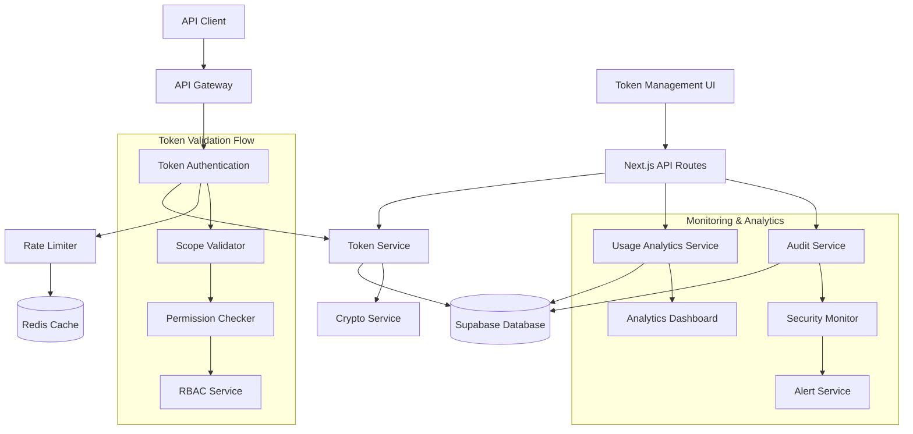
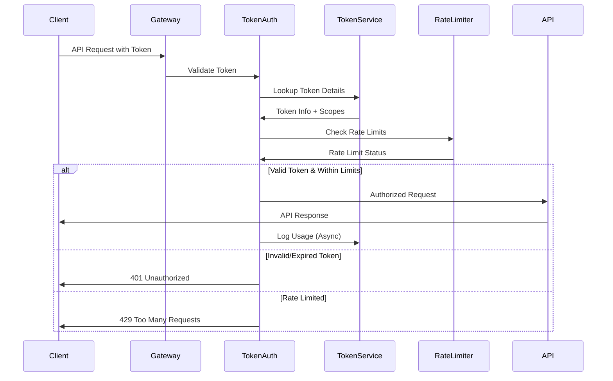
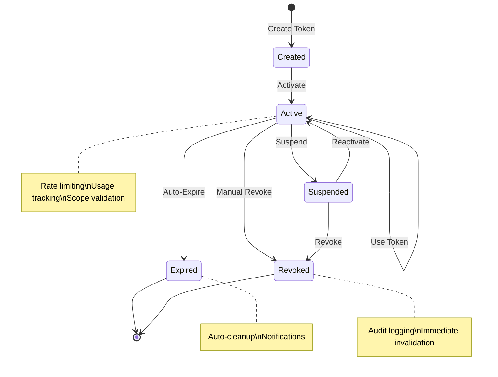

# Design Document

## Overview

The API Token Management system provides a secure, scalable solution for managing programmatic access to C9d.ai services. The design implements industry-standard token security practices with JWT-based authentication, granular scope-based permissions, and comprehensive audit logging. The system integrates with existing organizational RBAC and subscription management to provide consistent access control across all platform touchpoints.

The architecture follows a token-centric approach where each token carries its own permissions, rate limits, and usage tracking, enabling fine-grained control and monitoring of API access patterns.

## Architecture

### High-Level Architecture



### Token Authentication Flow



### Token Lifecycle Management



## Components and Interfaces

### Core Services

#### TokenService
```typescript
interface TokenService {
  createToken(userId: string, orgId: string, config: TokenConfig): Promise<ApiToken>
  getToken(tokenId: string): Promise<ApiToken | null>
  validateToken(tokenHash: string): Promise<TokenValidationResult>
  revokeToken(tokenId: string, reason: string): Promise<void>
  rotateToken(tokenId: string): Promise<ApiToken>
  getUserTokens(userId: string, orgId?: string): Promise<ApiToken[]>
  getOrganizationTokens(orgId: string): Promise<ApiToken[]>
}
```

#### TokenAuthenticationService
```typescript
interface TokenAuthenticationService {
  authenticateRequest(token: string, endpoint: string): Promise<AuthenticationResult>
  validateScopes(token: ApiToken, requiredScopes: string[]): Promise<boolean>
  checkRateLimit(tokenId: string, endpoint: string): Promise<RateLimitResult>
  logTokenUsage(tokenId: string, request: ApiRequest): Promise<void>
}
```

#### TokenAnalyticsService
```typescript
interface TokenAnalyticsService {
  getTokenUsageMetrics(tokenId: string, period: TimePeriod): Promise<UsageMetrics>
  getOrganizationUsage(orgId: string, period: TimePeriod): Promise<OrganizationUsage>
  detectAnomalies(tokenId: string): Promise<SecurityAnomaly[]>
  generateUsageReport(filters: ReportFilters): Promise<UsageReport>
  exportAnalytics(format: 'csv' | 'json', filters: ReportFilters): Promise<string>
}
```

#### TokenSecurityService
```typescript
interface TokenSecurityService {
  generateSecureToken(): Promise<string>
  hashToken(token: string): Promise<string>
  validateTokenFormat(token: string): boolean
  detectSuspiciousActivity(tokenId: string, activity: TokenActivity): Promise<SecurityAlert[]>
  enforceSecurityPolicies(token: ApiToken, request: ApiRequest): Promise<PolicyResult>
}
```

### Token Management Components

#### TokenCreationWizard
Guided token creation with scope selection and security recommendations.

```typescript
interface TokenCreationWizardProps {
  userId: string
  organizationId?: string
  onTokenCreated: (token: ApiToken) => void
  availableScopes: TokenScope[]
  recommendedConfigs: TokenTemplate[]
}
```

#### TokenDashboard
Overview of all user/organization tokens with usage metrics and management actions.

```typescript
interface TokenDashboardProps {
  tokens: ApiToken[]
  usageMetrics: Record<string, UsageMetrics>
  onTokenAction: (tokenId: string, action: TokenAction) => void
  filters: TokenFilters
}
```

#### TokenSecurityPanel
Security-focused view for administrators with audit logs and security alerts.

```typescript
interface TokenSecurityPanelProps {
  organizationId: string
  securityEvents: SecurityEvent[]
  suspiciousActivity: SecurityAnomaly[]
  onSecurityAction: (action: SecurityAction) => void
}
```

## Data Models

### Database Schema

```sql
-- API tokens
CREATE TABLE api_tokens (
  id UUID PRIMARY KEY DEFAULT gen_random_uuid(),
  name TEXT NOT NULL,
  description TEXT,
  token_hash TEXT UNIQUE NOT NULL,
  token_prefix TEXT NOT NULL, -- First 8 chars for identification
  user_id UUID REFERENCES users(id) ON DELETE CASCADE,
  organization_id UUID REFERENCES organizations(id) ON DELETE CASCADE,
  token_type TEXT NOT NULL CHECK (token_type IN ('individual', 'service_account')),
  scopes TEXT[] DEFAULT '{}',
  status TEXT DEFAULT 'active' CHECK (status IN ('active', 'suspended', 'expired', 'revoked')),
  expires_at TIMESTAMP WITH TIME ZONE,
  last_used_at TIMESTAMP WITH TIME ZONE,
  last_used_ip INET,
  usage_count INTEGER DEFAULT 0,
  rate_limit_override JSONB,
  metadata JSONB DEFAULT '{}',
  created_at TIMESTAMP WITH TIME ZONE DEFAULT NOW(),
  updated_at TIMESTAMP WITH TIME ZONE DEFAULT NOW()
);

-- Token scopes definition
CREATE TABLE token_scopes (
  id UUID PRIMARY KEY DEFAULT gen_random_uuid(),
  name TEXT UNIQUE NOT NULL,
  description TEXT,
  resource TEXT NOT NULL,
  actions TEXT[] NOT NULL,
  is_sensitive BOOLEAN DEFAULT FALSE,
  requires_admin BOOLEAN DEFAULT FALSE,
  created_at TIMESTAMP WITH TIME ZONE DEFAULT NOW()
);

-- Token usage logs
CREATE TABLE token_usage_logs (
  id UUID PRIMARY KEY DEFAULT gen_random_uuid(),
  token_id UUID REFERENCES api_tokens(id) ON DELETE CASCADE,
  endpoint TEXT NOT NULL,
  method TEXT NOT NULL,
  status_code INTEGER NOT NULL,
  response_time_ms INTEGER,
  request_size_bytes INTEGER,
  response_size_bytes INTEGER,
  ip_address INET,
  user_agent TEXT,
  metadata JSONB DEFAULT '{}',
  created_at TIMESTAMP WITH TIME ZONE DEFAULT NOW()
);

-- Token rate limits
CREATE TABLE token_rate_limits (
  id UUID PRIMARY KEY DEFAULT gen_random_uuid(),
  token_id UUID REFERENCES api_tokens(id) ON DELETE CASCADE,
  limit_type TEXT NOT NULL CHECK (limit_type IN ('requests_per_minute', 'requests_per_hour', 'requests_per_day')),
  limit_value INTEGER NOT NULL,
  current_usage INTEGER DEFAULT 0,
  reset_at TIMESTAMP WITH TIME ZONE NOT NULL,
  created_at TIMESTAMP WITH TIME ZONE DEFAULT NOW(),
  updated_at TIMESTAMP WITH TIME ZONE DEFAULT NOW(),
  UNIQUE(token_id, limit_type)
);

-- Token security events
CREATE TABLE token_security_events (
  id UUID PRIMARY KEY DEFAULT gen_random_uuid(),
  token_id UUID REFERENCES api_tokens(id) ON DELETE CASCADE,
  event_type TEXT NOT NULL,
  severity TEXT NOT NULL CHECK (severity IN ('low', 'medium', 'high', 'critical')),
  description TEXT NOT NULL,
  ip_address INET,
  user_agent TEXT,
  metadata JSONB DEFAULT '{}',
  resolved BOOLEAN DEFAULT FALSE,
  resolved_at TIMESTAMP WITH TIME ZONE,
  resolved_by UUID REFERENCES users(id),
  created_at TIMESTAMP WITH TIME ZONE DEFAULT NOW()
);

-- Token templates for common use cases
CREATE TABLE token_templates (
  id UUID PRIMARY KEY DEFAULT gen_random_uuid(),
  name TEXT NOT NULL,
  description TEXT,
  use_case TEXT NOT NULL,
  recommended_scopes TEXT[] DEFAULT '{}',
  default_expiration_days INTEGER,
  rate_limit_config JSONB DEFAULT '{}',
  is_system_template BOOLEAN DEFAULT FALSE,
  organization_id UUID REFERENCES organizations(id) ON DELETE CASCADE,
  created_at TIMESTAMP WITH TIME ZONE DEFAULT NOW(),
  updated_at TIMESTAMP WITH TIME ZONE DEFAULT NOW()
);

-- Token rotation history
CREATE TABLE token_rotation_history (
  id UUID PRIMARY KEY DEFAULT gen_random_uuid(),
  token_id UUID REFERENCES api_tokens(id) ON DELETE CASCADE,
  old_token_hash TEXT NOT NULL,
  new_token_hash TEXT NOT NULL,
  rotation_reason TEXT,
  rotated_by UUID REFERENCES users(id),
  created_at TIMESTAMP WITH TIME ZONE DEFAULT NOW()
);
```

### TypeScript Interfaces

```typescript
interface ApiToken {
  id: string
  name: string
  description?: string
  tokenHash: string
  tokenPrefix: string
  userId: string
  organizationId?: string
  tokenType: 'individual' | 'service_account'
  scopes: string[]
  status: 'active' | 'suspended' | 'expired' | 'revoked'
  expiresAt?: Date
  lastUsedAt?: Date
  lastUsedIp?: string
  usageCount: number
  rateLimitOverride?: RateLimitConfig
  metadata: Record<string, any>
  createdAt: Date
  updatedAt: Date
}

interface TokenConfig {
  name: string
  description?: string
  tokenType: 'individual' | 'service_account'
  scopes: string[]
  expiresAt?: Date
  rateLimitOverride?: RateLimitConfig
  metadata?: Record<string, any>
}

interface TokenScope {
  id: string
  name: string
  description?: string
  resource: string
  actions: string[]
  isSensitive: boolean
  requiresAdmin: boolean
  createdAt: Date
}

interface TokenValidationResult {
  isValid: boolean
  token?: ApiToken
  error?: string
  remainingRequests?: number
  resetTime?: Date
}

interface RateLimitConfig {
  requestsPerMinute?: number
  requestsPerHour?: number
  requestsPerDay?: number
  burstLimit?: number
}

interface RateLimitResult {
  allowed: boolean
  remaining: number
  resetTime: Date
  retryAfter?: number
}

interface UsageMetrics {
  totalRequests: number
  successfulRequests: number
  errorRequests: number
  averageResponseTime: number
  topEndpoints: EndpointUsage[]
  dailyUsage: DailyUsage[]
  rateLimitHits: number
}

interface SecurityAnomaly {
  id: string
  tokenId: string
  type: 'unusual_location' | 'high_frequency' | 'suspicious_pattern' | 'failed_attempts'
  severity: 'low' | 'medium' | 'high' | 'critical'
  description: string
  detectedAt: Date
  metadata: Record<string, any>
}

interface TokenTemplate {
  id: string
  name: string
  description?: string
  useCase: string
  recommendedScopes: string[]
  defaultExpirationDays?: number
  rateLimitConfig: RateLimitConfig
  isSystemTemplate: boolean
  organizationId?: string
  createdAt: Date
  updatedAt: Date
}
```

## Error Handling

### Token Authentication Errors
- **InvalidToken**: Token format is invalid or malformed
- **ExpiredToken**: Token has passed its expiration date
- **RevokedToken**: Token has been manually revoked
- **SuspendedToken**: Token is temporarily suspended
- **InsufficientScope**: Token lacks required permissions for endpoint

### Rate Limiting Errors
- **RateLimitExceeded**: Token has exceeded rate limit for time period
- **QuotaExhausted**: Token has reached usage quota for billing period
- **ConcurrentLimitReached**: Too many concurrent requests from token

### Token Management Errors
- **TokenCreationFailed**: Unable to create token due to validation or system error
- **DuplicateTokenName**: Token name already exists for user/organization
- **InvalidScopes**: Requested scopes are invalid or not available to user
- **PermissionDenied**: User lacks permission to perform token operation

### Security Errors
- **SuspiciousActivity**: Unusual usage pattern detected
- **SecurityPolicyViolation**: Token usage violates security policies
- **UnauthorizedAccess**: Attempt to access token without proper permissions

### Error Response Format
```typescript
interface TokenErrorResponse {
  error: {
    code: string
    message: string
    details?: {
      tokenId?: string
      scopes?: string[]
      rateLimitReset?: string
      retryAfter?: number
    }
    timestamp: string
    requestId: string
  }
}
```

## Testing Strategy

### Unit Testing
- **Token Service**: Test token CRUD operations, validation, and lifecycle management
- **Authentication**: Test token validation, scope checking, and permission enforcement
- **Rate Limiting**: Test rate limit calculations, reset logic, and quota enforcement
- **Security**: Test anomaly detection, policy enforcement, and audit logging

### Integration Testing
- **API Gateway**: Test token authentication flow with various token types and scopes
- **Database Operations**: Test token storage, retrieval, and audit trail consistency
- **Rate Limiting**: Test Redis-based rate limiting with concurrent requests
- **Analytics**: Test usage tracking and metrics aggregation accuracy

### End-to-End Testing
- **Token Lifecycle**: Complete token creation, usage, rotation, and revocation flows
- **Security Workflows**: Test suspicious activity detection and response
- **Administrative Actions**: Test organization-level token management and emergency controls
- **API Access**: Test various API endpoints with different token scopes and permissions

### Security Testing
- **Token Security**: Test token generation, hashing, and secure storage
- **Authentication Bypass**: Attempt to bypass token validation and scope checking
- **Rate Limit Evasion**: Test rate limiting effectiveness against various attack patterns
- **Privilege Escalation**: Verify tokens cannot access resources beyond their scopes

### Performance Testing
- **Token Validation**: Test authentication performance under high request volumes
- **Rate Limiting**: Test Redis performance with concurrent rate limit checks
- **Usage Logging**: Test async logging performance and data consistency
- **Analytics Queries**: Test dashboard query performance with large datasets

### Load Testing
- **Concurrent Authentication**: Test system behavior with many simultaneous token validations
- **Rate Limit Enforcement**: Test rate limiting accuracy under high load
- **Database Performance**: Test token lookup and usage logging performance
- **Memory Usage**: Monitor Redis memory usage for rate limiting and caching