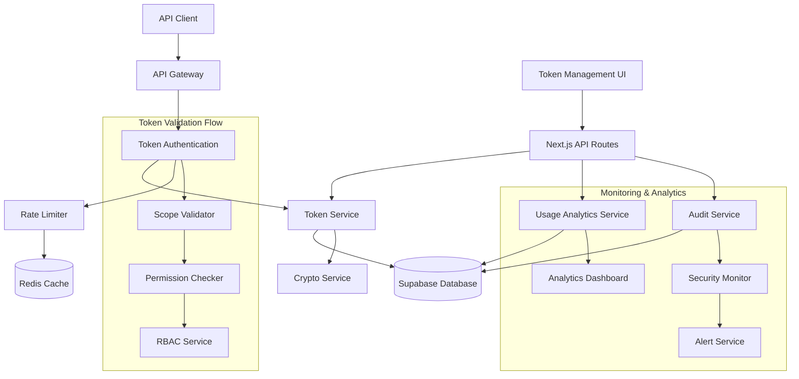
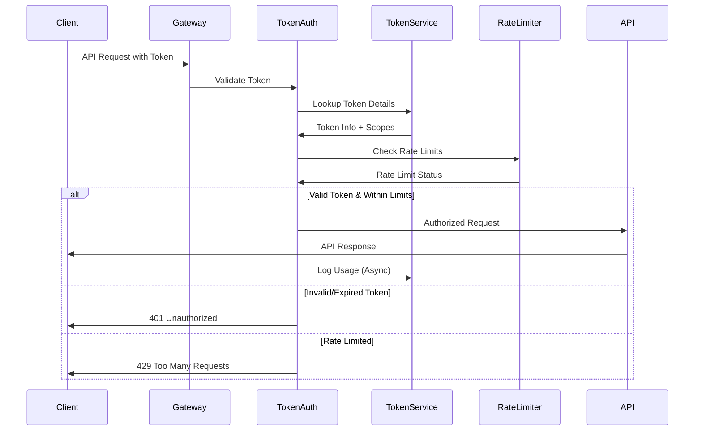
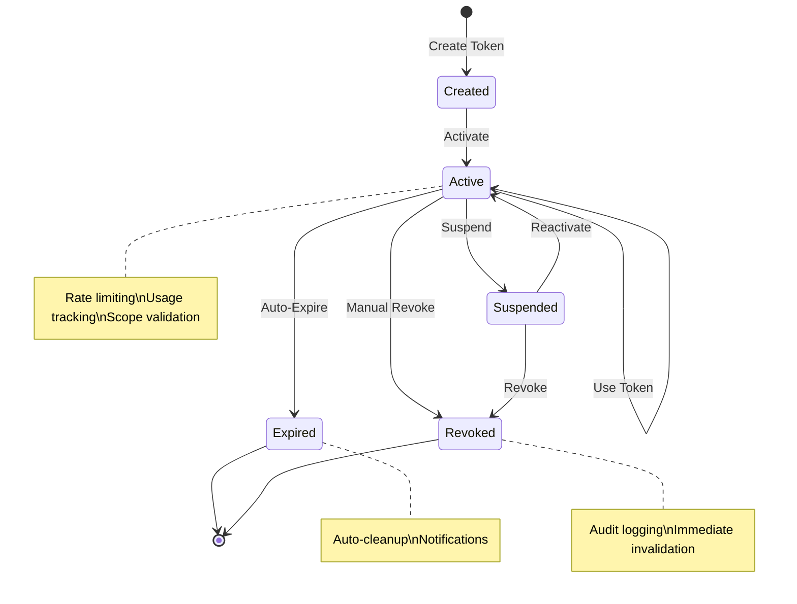

# Design Document

## Overview

The API Token Management system provides a secure, scalable solution for managing programmatic access to C9d.ai services. The design implements industry-standard token security practices with JWT-based authentication, granular scope-based permissions, and comprehensive audit logging. The system integrates with existing organizational RBAC and subscription management to provide consistent access control across all platform touchpoints.

The architecture follows a token-centric approach where each token carries its own permissions, rate limits, and usage tracking, enabling fine-grained control and monitoring of API access patterns.

### Architectural Alignment

**Vercel Deployment**: The system is designed for Vercel's serverless architecture with:
- Edge-compatible authentication middleware
- Stateless token validation using Redis for rate limiting
- API routes optimized for Vercel's 30-second function timeout
- Environment variable management through Phase.dev integration

**Existing Infrastructure Integration**:
- **Supabase**: Leverages existing database schema patterns, RLS policies, and connection pooling
- **Clerk**: Integrates with existing authentication system for user identity and organizational context
- **Redis**: Uses existing Redis instance for rate limiting and token caching
- **Phase.dev**: Follows established environment variable management patterns

**Schema Consistency**: All database tables follow existing naming conventions (snake_case), use existing user and organization references, and implement standard RLS policies consistent with the platform.

## Architecture

### High-Level Architecture


```mermaid
graph TB
    Client[API Client] --> Gateway[API Gateway]
    UI[Token Management UI] --> API[Next.js API Routes]
    
    Gateway --> TokenAuth[Token Authentication]
    TokenAuth --> TokenService[Token Service]
    TokenAuth --> RateLimiter[Rate Limiter]
    
    TokenService --> DB[(Supabase Database)]
    RateLimiter --> Redis[(Redis Cache)]
    
    API --> TokenService
    API --> UsageService[Usage Analytics Service]
    API --> AuditService[Audit Service]
    
    TokenService --> Crypto[Crypto Service]
    UsageService --> DB
    AuditService --> DB
    
    subgraph "Token Validation Flow"
        TokenAuth --> ScopeValidator[Scope Validator]
        ScopeValidator --> PermissionChecker[Permission Checker]
        PermissionChecker --> RBAC[RBAC Service]
    end
    
    subgraph "Monitoring & Analytics"
        UsageService --> Analytics[Analytics Dashboard]
        AuditService --> SecurityMonitor[Security Monitor]
        SecurityMonitor --> AlertService[Alert Service]
    end
```

### Token Authentication Flow


```mermaid
sequenceDiagram
    participant Client
    participant Gateway
    participant TokenAuth
    participant TokenService
    participant RateLimiter
    participant API
    
    Client->>Gateway: API Request with Token
    Gateway->>TokenAuth: Validate Token
    TokenAuth->>TokenService: Lookup Token Details
    TokenService->>TokenAuth: Token Info + Scopes
    TokenAuth->>RateLimiter: Check Rate Limits
    RateLimiter->>TokenAuth: Rate Limit Status
    
    alt Valid Token & Within Limits
        TokenAuth->>API: Authorized Request
        API->>Client: API Response
        TokenAuth->>TokenService: Log Usage (Async)
    else Invalid/Expired Token
        TokenAuth->>Client: 401 Unauthorized
    else Rate Limited
        TokenAuth->>Client: 429 Too Many Requests
    end
```

### Token Lifecycle Management


```mermaid
stateDiagram-v2
    [*] --> Created : Create Token
    Created --> Active : Activate
    Active --> Active : Use Token
    Active --> Suspended : Suspend
    Active --> Expired : Auto-Expire
    Active --> Revoked : Manual Revoke
    Suspended --> Active : Reactivate
    Suspended --> Revoked : Revoke
    Expired --> [*]
    Revoked --> [*]
    
    note right of Active : Rate limiting\nUsage tracking\nScope validation
    note right of Expired : Auto-cleanup\nNotifications
    note right of Revoked : Audit logging\nImmediate invalidation
```

## Components and Interfaces

### Core Services

#### TokenService
```typescript
interface TokenService {
  createToken(userId: string, orgId: string, config: TokenConfig): Promise<ApiToken>
  getToken(tokenId: string): Promise<ApiToken | null>
  validateToken(tokenHash: string): Promise<TokenValidationResult>
  revokeToken(tokenId: string, reason: string): Promise<void>
  rotateToken(tokenId: string): Promise<ApiToken>
  rotateTokenWithoutInterruption(tokenId: string): Promise<{ oldToken: ApiToken, newToken: ApiToken }>
  getUserTokens(userId: string, orgId?: string): Promise<ApiToken[]>
  getOrganizationTokens(orgId: string): Promise<ApiToken[]>
  emergencyRevokeAllOrganizationTokens(orgId: string, reason: string): Promise<void>
  updateTokenPermissions(tokenId: string, userId: string, newScopes: string[]): Promise<ApiToken>
}
```

#### TokenAuthenticationService
```typescript
interface TokenAuthenticationService {
  authenticateRequest(token: string, endpoint: string): Promise<AuthenticationResult>
  validateScopes(token: ApiToken, requiredScopes: string[]): Promise<boolean>
  checkRateLimit(tokenId: string, endpoint: string): Promise<RateLimitResult>
  logTokenUsage(tokenId: string, request: ApiRequest): Promise<void>
}
```

#### TokenAnalyticsService
```typescript
interface TokenAnalyticsService {
  getTokenUsageMetrics(tokenId: string, period: TimePeriod): Promise<UsageMetrics>
  getOrganizationUsage(orgId: string, period: TimePeriod): Promise<OrganizationUsage>
  detectAnomalies(tokenId: string): Promise<SecurityAnomaly[]>
  generateUsageReport(filters: ReportFilters): Promise<UsageReport>
  exportAnalytics(format: 'csv' | 'json', filters: ReportFilters): Promise<string>
  getAgentPerformanceMetrics(tokenId: string): Promise<AgentPerformanceMetrics>
  getEndpointUsagePatterns(tokenId: string, period: TimePeriod): Promise<EndpointPattern[]>
  checkQuotaThresholds(tokenId: string): Promise<QuotaStatus>
}

interface AgentPerformanceMetrics {
  totalAgentCalls: number
  averageExecutionTime: number
  modelSelectionDistribution: Record<string, number>
  successRate: number
  errorBreakdown: Record<string, number>
}

interface QuotaStatus {
  currentUsage: number
  limit: number
  percentageUsed: number
  isNearingLimit: boolean
  estimatedTimeToLimit?: Date
}
```

#### TokenSecurityService
```typescript
interface TokenSecurityService {
  generateSecureToken(): Promise<string>
  hashToken(token: string): Promise<string>
  validateTokenFormat(token: string): boolean
  detectSuspiciousActivity(tokenId: string, activity: TokenActivity): Promise<SecurityAlert[]>
  enforceSecurityPolicies(token: ApiToken, request: ApiRequest): Promise<PolicyResult>
  autoSuspendToken(tokenId: string, reason: string): Promise<void>
  sendSecurityAlert(tokenId: string, alert: SecurityAlert): Promise<void>
  handleTokenExpiration(tokenId: string): Promise<void>
}
```

### Token Management Components

#### TokenCreationWizard
Guided token creation with scope selection and security recommendations.

**Design Rationale**: Provides a step-by-step wizard to prevent security mistakes and ensure developers select appropriate scopes. Includes templates for common use cases (CI/CD, development, production) to accelerate setup while maintaining security best practices.

```typescript
interface TokenCreationWizardProps {
  userId: string
  organizationId?: string
  onTokenCreated: (token: ApiToken) => void
  availableScopes: TokenScope[]
  recommendedConfigs: TokenTemplate[]
  userRole: string // For RBAC-based scope filtering
}
```

#### TokenDashboard
Overview of all user/organization tokens with usage metrics and management actions.

**Design Rationale**: Centralized dashboard provides at-a-glance visibility into all tokens with filtering, search, and tagging capabilities. Visual indicators for expiration warnings and quota status enable proactive management.

```typescript
interface TokenDashboardProps {
  tokens: ApiToken[]
  usageMetrics: Record<string, UsageMetrics>
  onTokenAction: (tokenId: string, action: TokenAction) => void
  filters: TokenFilters
  quotaStatus: Record<string, QuotaStatus>
  expirationWarnings: TokenExpirationWarning[]
}

interface TokenFilters {
  status?: TokenStatus[]
  tokenType?: ('individual' | 'service_account')[]
  scopes?: string[]
  tags?: string[]
  searchQuery?: string
  teamMember?: string
}

interface TokenExpirationWarning {
  tokenId: string
  tokenName: string
  expiresAt: Date
  daysUntilExpiration: number
  severity: 'info' | 'warning' | 'critical'
}
```

#### TokenDetailsPanel
Detailed view of individual token with security information, usage history, and management actions.

**Design Rationale**: Provides comprehensive token information including secure copy functionality, regeneration options, IP history, and usage patterns. Supports quick actions like rotation and revocation.

```typescript
interface TokenDetailsPanelProps {
  token: ApiToken
  usageHistory: TokenUsageLog[]
  securityEvents: SecurityEvent[]
  onCopyToken: () => void
  onRegenerateToken: () => void
  onRevokeToken: (reason: string) => void
  onRotateToken: () => void
}
```

#### TokenSecurityPanel
Security-focused view for administrators with audit logs and security alerts.

**Design Rationale**: Dedicated security interface for administrators to monitor threats, review audit logs, and take emergency actions. Includes emergency kill-switch for organization-wide token revocation.

```typescript
interface TokenSecurityPanelProps {
  organizationId: string
  securityEvents: SecurityEvent[]
  suspiciousActivity: SecurityAnomaly[]
  auditLogs: AuditLog[]
  onSecurityAction: (action: SecurityAction) => void
  onEmergencyKillSwitch: (reason: string) => void
}

interface SecurityAction {
  type: 'suspend' | 'revoke' | 'investigate' | 'resolve'
  tokenId: string
  reason: string
}
```

#### OrganizationTokenManager
Administrative interface for managing team member tokens.

**Design Rationale**: Enables administrators to oversee all organizational tokens with bulk operations, policy enforcement, and team-based filtering. Supports delegation of token management while maintaining security controls.

```typescript
interface OrganizationTokenManagerProps {
  organizationId: string
  teamTokens: ApiToken[]
  teamMembers: TeamMember[]
  onBulkAction: (tokenIds: string[], action: BulkTokenAction) => void
  onUpdatePermissions: (tokenId: string, newScopes: string[]) => void
  onViewUsageAnalytics: (tokenId: string) => void
}

interface BulkTokenAction {
  type: 'revoke' | 'rotate' | 'suspend' | 'update_policy'
  reason?: string
  newPolicy?: TokenPolicy
}
```

## Agent Management Integration

### Agent API Endpoints

**Design Rationale**: Agent management through API tokens enables programmatic agent creation and configuration for CI/CD pipelines and automated workflows. Scope-based access control ensures tokens only have necessary permissions.

#### Agent CRUD Operations
```typescript
// POST /api/v1/agents - Create new agent
interface CreateAgentRequest {
  name: string
  description?: string
  persona?: string
  inputSchema?: JSONSchema
  outputSchema?: JSONSchema
  triggerMode: 'manual' | 'scheduled' | 'event'
  configuration: AgentConfiguration
}

// GET /api/v1/agents - List agents
interface ListAgentsRequest {
  page?: number
  limit?: number
  filter?: AgentFilter
}

// GET /api/v1/agents/:id - Get agent details
// PUT /api/v1/agents/:id - Update agent
// DELETE /api/v1/agents/:id - Delete agent

// GET /api/v1/agents/:id/logs - Get agent execution logs
interface AgentExecutionLog {
  id: string
  agentId: string
  startTime: Date
  endTime: Date
  status: 'success' | 'error' | 'timeout'
  inputData: any
  outputData: any
  performanceMetrics: {
    executionTime: number
    modelUsed: string
    tokensConsumed: number
  }
}
```

### Agent Scopes
```typescript
const AGENT_SCOPES = {
  'agent:read': 'View agent configurations and details',
  'agent:create': 'Create new agents',
  'agent:update': 'Modify existing agents',
  'agent:delete': 'Delete agents',
  'agent:execute': 'Trigger agent execution',
  'agent:logs:read': 'View agent execution logs and metrics'
}
```

### Agent Access Control
**Design Rationale**: Granular scopes enable fine-grained control over agent operations. Tokens can be restricted to read-only access, specific agent operations, or full management capabilities.

```typescript
interface AgentAccessValidator {
  validateAgentAccess(token: ApiToken, agentId: string, operation: AgentOperation): Promise<boolean>
  getAccessibleAgents(token: ApiToken): Promise<string[]>
  checkAgentScope(token: ApiToken, requiredScope: string): boolean
}
```

## RBAC Integration

### Permission Inheritance

**Design Rationale**: Token permissions automatically align with user's organizational role to prevent privilege escalation. When user roles change, token permissions update automatically to maintain security posture.

```typescript
interface RBACIntegrationService {
  // Validate token creation against user's organizational permissions
  validateTokenCreation(userId: string, orgId: string, requestedScopes: string[]): Promise<ValidationResult>
  
  // Automatically update token permissions when user role changes
  syncTokenPermissionsWithRole(userId: string, newRoleId: string): Promise<void>
  
  // Get maximum allowed scopes for user based on role
  getMaximumAllowedScopes(userId: string, orgId: string): Promise<string[]>
  
  // Check if token permissions exceed user's current permissions
  detectPermissionEscalation(tokenId: string, userId: string): Promise<boolean>
  
  // Apply most restrictive permissions when conflicts arise
  resolvePermissionConflicts(userPermissions: string[], tokenScopes: string[]): string[]
}

interface ValidationResult {
  isValid: boolean
  allowedScopes: string[]
  deniedScopes: string[]
  reason?: string
}
```

### Role-Based Scope Filtering

**Design Rationale**: UI dynamically shows only scopes available to user based on their organizational role, preventing confusion and failed token creation attempts.

```typescript
interface RoleBasedScopeFilter {
  // Filter available scopes based on user's role
  getAvailableScopes(userId: string, orgId: string): Promise<TokenScope[]>
  
  // Check if user can assign specific scope
  canAssignScope(userId: string, orgId: string, scope: string): Promise<boolean>
  
  // Get scope categories accessible to role
  getAccessibleScopeCategories(roleId: string): Promise<string[]>
}
```

### Permission Change Handling

**Design Rationale**: Automatic permission synchronization ensures tokens remain compliant with user's current access level. Audit logging tracks all permission changes for compliance.

```typescript
interface PermissionChangeHandler {
  // Handle user role change
  onUserRoleChanged(userId: string, oldRoleId: string, newRoleId: string): Promise<void>
  
  // Handle user removed from organization
  onUserRemovedFromOrganization(userId: string, orgId: string): Promise<void>
  
  // Handle organization policy change
  onOrganizationPolicyChanged(orgId: string, newPolicy: OrganizationPolicy): Promise<void>
  
  // Log permission changes for audit
  logPermissionChange(change: PermissionChange): Promise<void>
}

interface PermissionChange {
  tokenId: string
  userId: string
  changeType: 'role_change' | 'policy_update' | 'manual_override'
  oldPermissions: string[]
  newPermissions: string[]
  reason: string
  timestamp: Date
}
```

### Policy Enforcement

**Design Rationale**: Organizational policies override individual token configurations to ensure compliance. Most restrictive permissions always apply to prevent security gaps.

```typescript
interface PolicyEnforcementService {
  // Enforce organizational token policies
  enforceOrganizationPolicy(orgId: string, token: ApiToken): Promise<ApiToken>
  
  // Validate token against security policies
  validateAgainstPolicies(token: ApiToken, policies: SecurityPolicy[]): Promise<PolicyViolation[]>
  
  // Apply most restrictive permissions
  applyMostRestrictivePermissions(
    userPermissions: string[],
    tokenScopes: string[],
    orgPolicies: OrganizationPolicy[]
  ): string[]
}

interface SecurityPolicy {
  id: string
  name: string
  organizationId: string
  rules: PolicyRule[]
  enforcement: 'strict' | 'advisory'
}

interface PolicyRule {
  type: 'scope_restriction' | 'rate_limit' | 'expiration' | 'ip_whitelist'
  configuration: Record<string, any>
}

interface PolicyViolation {
  policyId: string
  rule: PolicyRule
  violation: string
  severity: 'low' | 'medium' | 'high' | 'critical'
}
```

## Vercel Deployment Architecture

### Serverless Function Optimization

**Design Rationale**: Vercel's serverless architecture requires stateless, fast-executing functions. Token validation must complete within Vercel's 30-second timeout with optimal cold start performance.

```typescript
// Edge-compatible token validation
export const config = {
  runtime: 'edge', // Use edge runtime for fastest response
}

// Optimized for cold starts
export async function validateTokenEdge(tokenHash: string): Promise<TokenValidationResult> {
  // Use edge-compatible Redis client
  // Minimize database queries
  // Cache token validation results
}
```

### Environment Variable Management

**Phase.dev Integration**: All sensitive configuration managed through Phase.dev following existing patterns:

```bash
# Token management specific variables
PHASE_SERVICE_TOKEN=<service_token>
REDIS_URL=<redis_connection_string>
SUPABASE_SERVICE_ROLE_KEY=<service_role_key>
TOKEN_ENCRYPTION_KEY=<encryption_key>
```

### API Route Configuration

**Vercel Function Settings**:
```json
{
  "functions": {
    "app/api/tokens/**/*.ts": {
      "maxDuration": 30,
      "memory": 1024
    },
    "app/api/tokens/validate/route.ts": {
      "maxDuration": 10,
      "memory": 512
    }
  }
}
```

### Caching Strategy

**Vercel Edge Caching**: Token validation results cached at edge for performance:
- Token metadata cached for 60 seconds
- Rate limit state cached in Redis
- Scope definitions cached for 5 minutes
- User permission mappings cached for 2 minutes

### Database Connection Management

**Supabase Connection Pooling**: Leverage existing Supabase connection patterns:
```typescript
// Use existing connection pool
import { createSupabaseClient } from '@/lib/database'

// Reuse connections across function invocations
const supabase = createSupabaseClient()
```

### Redis Integration

**Existing Redis Instance**: Use platform's existing Redis instance for:
- Rate limiting state (sliding window counters)
- Token validation cache
- Session data (if needed)
- Distributed locks for token rotation

**Connection Pattern**:
```typescript
// Use existing Redis client
import { getRedisClient } from '@/lib/cache'

const redis = getRedisClient()
// Connection pooling handled by existing infrastructure
```

## Notification System

### Notification Types

**Design Rationale**: Proactive notifications prevent service disruptions by alerting users before tokens expire or quotas are exhausted. Security alerts enable rapid response to threats.

```typescript
interface NotificationService {
  // Send expiration warnings
  sendExpirationWarning(tokenId: string, daysUntilExpiration: number): Promise<void>
  
  // Send quota threshold alerts
  sendQuotaAlert(tokenId: string, percentageUsed: number): Promise<void>
  
  // Send security alerts
  sendSecurityAlert(tokenId: string, alert: SecurityAlert): Promise<void>
  
  // Send rate limit notifications
  sendRateLimitNotification(tokenId: string, limitType: string): Promise<void>
  
  // Send token revocation notification
  sendRevocationNotification(tokenId: string, reason: string): Promise<void>
}

interface SecurityAlert {
  type: 'suspicious_activity' | 'auto_suspended' | 'policy_violation'
  severity: 'low' | 'medium' | 'high' | 'critical'
  description: string
  recommendedAction: string
  timestamp: Date
}
```

## Data Models

### Schema Design Principles

**Alignment with Existing Schema**:
- Follow existing table naming conventions (snake_case)
- Use existing user and organization references
- Implement standard RLS policies consistent with platform
- Use existing timestamp patterns (created_at, updated_at)
- Follow existing UUID primary key patterns
- Use existing JSONB patterns for flexible metadata

**Row Level Security (RLS)**:
All tables implement RLS policies following existing platform patterns:
- Users can only access their own tokens
- Organization admins can access all organizational tokens
- Service role bypasses RLS for system operations
- Audit logs are read-only for non-admin users

### Database Schema

```sql
-- API tokens
CREATE TABLE api_tokens (
  id UUID PRIMARY KEY DEFAULT gen_random_uuid(),
  name TEXT NOT NULL,
  description TEXT,
  token_hash TEXT UNIQUE NOT NULL,
  token_prefix TEXT NOT NULL, -- First 8 chars for identification
  user_id UUID REFERENCES users(id) ON DELETE CASCADE,
  organization_id UUID REFERENCES organizations(id) ON DELETE CASCADE,
  token_type TEXT NOT NULL CHECK (token_type IN ('individual', 'service_account')),
  scopes TEXT[] DEFAULT '{}',
  status TEXT DEFAULT 'active' CHECK (status IN ('active', 'suspended', 'expired', 'revoked')),
  expires_at TIMESTAMP WITH TIME ZONE,
  last_used_at TIMESTAMP WITH TIME ZONE,
  last_used_ip INET,
  usage_count INTEGER DEFAULT 0,
  rate_limit_override JSONB,
  tags TEXT[] DEFAULT '{}',
  metadata JSONB DEFAULT '{}',
  created_at TIMESTAMP WITH TIME ZONE DEFAULT NOW(),
  updated_at TIMESTAMP WITH TIME ZONE DEFAULT NOW(),
  CONSTRAINT unique_token_name_per_user UNIQUE (user_id, name)
);

-- Token scopes definition
CREATE TABLE token_scopes (
  id UUID PRIMARY KEY DEFAULT gen_random_uuid(),
  name TEXT UNIQUE NOT NULL,
  description TEXT,
  resource TEXT NOT NULL,
  actions TEXT[] NOT NULL,
  category TEXT NOT NULL CHECK (category IN ('agent', 'user', 'organization', 'analytics', 'system')),
  is_sensitive BOOLEAN DEFAULT FALSE,
  requires_admin BOOLEAN DEFAULT FALSE,
  created_at TIMESTAMP WITH TIME ZONE DEFAULT NOW()
);

-- Token usage logs
CREATE TABLE token_usage_logs (
  id UUID PRIMARY KEY DEFAULT gen_random_uuid(),
  token_id UUID REFERENCES api_tokens(id) ON DELETE CASCADE,
  endpoint TEXT NOT NULL,
  method TEXT NOT NULL,
  status_code INTEGER NOT NULL,
  response_time_ms INTEGER,
  request_size_bytes INTEGER,
  response_size_bytes INTEGER,
  ip_address INET,
  user_agent TEXT,
  metadata JSONB DEFAULT '{}',
  created_at TIMESTAMP WITH TIME ZONE DEFAULT NOW()
);

-- Token rate limits
CREATE TABLE token_rate_limits (
  id UUID PRIMARY KEY DEFAULT gen_random_uuid(),
  token_id UUID REFERENCES api_tokens(id) ON DELETE CASCADE,
  limit_type TEXT NOT NULL CHECK (limit_type IN ('requests_per_minute', 'requests_per_hour', 'requests_per_day')),
  limit_value INTEGER NOT NULL,
  current_usage INTEGER DEFAULT 0,
  reset_at TIMESTAMP WITH TIME ZONE NOT NULL,
  created_at TIMESTAMP WITH TIME ZONE DEFAULT NOW(),
  updated_at TIMESTAMP WITH TIME ZONE DEFAULT NOW(),
  UNIQUE(token_id, limit_type)
);

-- Token security events
CREATE TABLE token_security_events (
  id UUID PRIMARY KEY DEFAULT gen_random_uuid(),
  token_id UUID REFERENCES api_tokens(id) ON DELETE CASCADE,
  event_type TEXT NOT NULL,
  severity TEXT NOT NULL CHECK (severity IN ('low', 'medium', 'high', 'critical')),
  description TEXT NOT NULL,
  ip_address INET,
  user_agent TEXT,
  metadata JSONB DEFAULT '{}',
  resolved BOOLEAN DEFAULT FALSE,
  resolved_at TIMESTAMP WITH TIME ZONE,
  resolved_by UUID REFERENCES users(id),
  created_at TIMESTAMP WITH TIME ZONE DEFAULT NOW()
);

-- Token templates for common use cases
CREATE TABLE token_templates (
  id UUID PRIMARY KEY DEFAULT gen_random_uuid(),
  name TEXT NOT NULL,
  description TEXT,
  use_case TEXT NOT NULL,
  recommended_scopes TEXT[] DEFAULT '{}',
  default_expiration_days INTEGER,
  rate_limit_config JSONB DEFAULT '{}',
  is_system_template BOOLEAN DEFAULT FALSE,
  organization_id UUID REFERENCES organizations(id) ON DELETE CASCADE,
  created_at TIMESTAMP WITH TIME ZONE DEFAULT NOW(),
  updated_at TIMESTAMP WITH TIME ZONE DEFAULT NOW()
);

-- Token rotation history
CREATE TABLE token_rotation_history (
  id UUID PRIMARY KEY DEFAULT gen_random_uuid(),
  token_id UUID REFERENCES api_tokens(id) ON DELETE CASCADE,
  old_token_hash TEXT NOT NULL,
  new_token_hash TEXT NOT NULL,
  rotation_reason TEXT,
  rotated_by UUID REFERENCES users(id),
  created_at TIMESTAMP WITH TIME ZONE DEFAULT NOW()
);

-- Token notifications configuration
CREATE TABLE token_notifications (
  id UUID PRIMARY KEY DEFAULT gen_random_uuid(),
  token_id UUID REFERENCES api_tokens(id) ON DELETE CASCADE,
  notify_on_expiration BOOLEAN DEFAULT TRUE,
  notify_on_quota_threshold INTEGER DEFAULT 80,
  notify_on_suspicious_activity BOOLEAN DEFAULT TRUE,
  notify_on_rate_limit BOOLEAN DEFAULT FALSE,
  recipients TEXT[] DEFAULT '{}',
  created_at TIMESTAMP WITH TIME ZONE DEFAULT NOW(),
  updated_at TIMESTAMP WITH TIME ZONE DEFAULT NOW(),
  UNIQUE(token_id)
);

-- RBAC permission mappings
CREATE TABLE token_permission_mappings (
  id UUID PRIMARY KEY DEFAULT gen_random_uuid(),
  role_id UUID REFERENCES roles(id) ON DELETE CASCADE,
  allowed_scopes TEXT[] DEFAULT '{}',
  denied_scopes TEXT[] DEFAULT '{}',
  max_token_lifetime_days INTEGER,
  created_at TIMESTAMP WITH TIME ZONE DEFAULT NOW(),
  updated_at TIMESTAMP WITH TIME ZONE DEFAULT NOW(),
  UNIQUE(role_id)
);

-- Indexes for performance
CREATE INDEX idx_api_tokens_user_id ON api_tokens(user_id);
CREATE INDEX idx_api_tokens_organization_id ON api_tokens(organization_id);
CREATE INDEX idx_api_tokens_status ON api_tokens(status);
CREATE INDEX idx_api_tokens_token_hash ON api_tokens(token_hash);
CREATE INDEX idx_api_tokens_expires_at ON api_tokens(expires_at) WHERE expires_at IS NOT NULL;
CREATE INDEX idx_token_usage_logs_token_id ON token_usage_logs(token_id);
CREATE INDEX idx_token_usage_logs_created_at ON token_usage_logs(created_at);
CREATE INDEX idx_token_security_events_token_id ON token_security_events(token_id);
CREATE INDEX idx_token_security_events_severity ON token_security_events(severity);
CREATE INDEX idx_token_security_events_resolved ON token_security_events(resolved);
CREATE INDEX idx_token_rate_limits_token_id ON token_rate_limits(token_id);
CREATE INDEX idx_token_rate_limits_reset_at ON token_rate_limits(reset_at);

-- Row Level Security Policies (following existing platform patterns)

-- Enable RLS on all tables
ALTER TABLE api_tokens ENABLE ROW LEVEL SECURITY;
ALTER TABLE token_usage_logs ENABLE ROW LEVEL SECURITY;
ALTER TABLE token_security_events ENABLE ROW LEVEL SECURITY;
ALTER TABLE token_rate_limits ENABLE ROW LEVEL SECURITY;
ALTER TABLE token_notifications ENABLE ROW LEVEL SECURITY;

-- API Tokens policies
CREATE POLICY "Users can view their own tokens"
  ON api_tokens FOR SELECT
  USING (auth.uid() = user_id);

CREATE POLICY "Users can create their own tokens"
  ON api_tokens FOR INSERT
  WITH CHECK (auth.uid() = user_id);

CREATE POLICY "Users can update their own tokens"
  ON api_tokens FOR UPDATE
  USING (auth.uid() = user_id);

CREATE POLICY "Users can delete their own tokens"
  ON api_tokens FOR DELETE
  USING (auth.uid() = user_id);

CREATE POLICY "Organization admins can view org tokens"
  ON api_tokens FOR SELECT
  USING (
    organization_id IN (
      SELECT organization_id FROM organization_members
      WHERE user_id = auth.uid() AND role IN ('admin', 'owner')
    )
  );

CREATE POLICY "Organization admins can manage org tokens"
  ON api_tokens FOR ALL
  USING (
    organization_id IN (
      SELECT organization_id FROM organization_members
      WHERE user_id = auth.uid() AND role IN ('admin', 'owner')
    )
  );

-- Token usage logs policies (read-only for users)
CREATE POLICY "Users can view logs for their tokens"
  ON token_usage_logs FOR SELECT
  USING (
    token_id IN (
      SELECT id FROM api_tokens WHERE user_id = auth.uid()
    )
  );

CREATE POLICY "Organization admins can view org token logs"
  ON token_usage_logs FOR SELECT
  USING (
    token_id IN (
      SELECT id FROM api_tokens
      WHERE organization_id IN (
        SELECT organization_id FROM organization_members
        WHERE user_id = auth.uid() AND role IN ('admin', 'owner')
      )
    )
  );

-- Security events policies
CREATE POLICY "Users can view security events for their tokens"
  ON token_security_events FOR SELECT
  USING (
    token_id IN (
      SELECT id FROM api_tokens WHERE user_id = auth.uid()
    )
  );

CREATE POLICY "Organization admins can view and manage org security events"
  ON token_security_events FOR ALL
  USING (
    token_id IN (
      SELECT id FROM api_tokens
      WHERE organization_id IN (
        SELECT organization_id FROM organization_members
        WHERE user_id = auth.uid() AND role IN ('admin', 'owner')
      )
    )
  );
```

### TypeScript Interfaces

```typescript
interface ApiToken {
  id: string
  name: string
  description?: string
  tokenHash: string
  tokenPrefix: string
  userId: string
  organizationId?: string
  tokenType: 'individual' | 'service_account'
  scopes: string[]
  status: 'active' | 'suspended' | 'expired' | 'revoked'
  expiresAt?: Date
  lastUsedAt?: Date
  lastUsedIp?: string
  usageCount: number
  rateLimitOverride?: RateLimitConfig
  metadata: Record<string, any>
  tags: string[]
  createdAt: Date
  updatedAt: Date
}

interface TokenConfig {
  name: string
  description?: string
  tokenType: 'individual' | 'service_account'
  scopes: string[]
  expiresAt?: Date
  rateLimitOverride?: RateLimitConfig
  metadata?: Record<string, any>
  tags?: string[]
}

interface TokenScope {
  id: string
  name: string
  description?: string
  resource: string
  actions: string[]
  isSensitive: boolean
  requiresAdmin: boolean
  category: 'agent' | 'user' | 'organization' | 'analytics' | 'system'
  createdAt: Date
}

interface TokenValidationResult {
  isValid: boolean
  token?: ApiToken
  error?: string
  remainingRequests?: number
  resetTime?: Date
}

interface RateLimitConfig {
  requestsPerMinute?: number
  requestsPerHour?: number
  requestsPerDay?: number
  burstLimit?: number
  inheritFromSubscription?: boolean
}

interface RateLimitResult {
  allowed: boolean
  remaining: number
  resetTime: Date
  retryAfter?: number
}

interface UsageMetrics {
  totalRequests: number
  successfulRequests: number
  errorRequests: number
  averageResponseTime: number
  topEndpoints: EndpointUsage[]
  dailyUsage: DailyUsage[]
  rateLimitHits: number
  errorBreakdown: Record<string, number>
}

interface EndpointUsage {
  endpoint: string
  method: string
  requestCount: number
  averageLatency: number
  errorRate: number
}

interface DailyUsage {
  date: string
  requestCount: number
  errorCount: number
  averageLatency: number
}

interface SecurityAnomaly {
  id: string
  tokenId: string
  type: 'unusual_location' | 'high_frequency' | 'suspicious_pattern' | 'failed_attempts'
  severity: 'low' | 'medium' | 'high' | 'critical'
  description: string
  detectedAt: Date
  metadata: Record<string, any>
  autoSuspended: boolean
  resolved: boolean
}

interface TokenTemplate {
  id: string
  name: string
  description?: string
  useCase: string
  recommendedScopes: string[]
  defaultExpirationDays?: number
  rateLimitConfig: RateLimitConfig
  isSystemTemplate: boolean
  organizationId?: string
  createdAt: Date
  updatedAt: Date
}

interface AuditLog {
  id: string
  tokenId: string
  userId: string
  action: 'created' | 'modified' | 'revoked' | 'rotated' | 'suspended' | 'reactivated'
  changes?: Record<string, any>
  ipAddress: string
  userAgent: string
  timestamp: Date
  metadata: Record<string, any>
}

interface NotificationConfig {
  tokenId: string
  notifyOnExpiration: boolean
  notifyOnQuotaThreshold: number // Percentage (e.g., 80 for 80%)
  notifyOnSuspiciousActivity: boolean
  notifyOnRateLimit: boolean
  recipients: string[] // Email addresses or user IDs
}
```

## Error Handling

### Token Authentication Errors
- **InvalidToken**: Token format is invalid or malformed
- **ExpiredToken**: Token has passed its expiration date
- **RevokedToken**: Token has been manually revoked
- **SuspendedToken**: Token is temporarily suspended
- **InsufficientScope**: Token lacks required permissions for endpoint

**Design Rationale**: Clear error codes enable API consumers to handle different failure scenarios appropriately. Each error includes actionable information for resolution.

### Rate Limiting Errors
- **RateLimitExceeded**: Token has exceeded rate limit for time period
- **QuotaExhausted**: Token has reached usage quota for billing period
- **ConcurrentLimitReached**: Too many concurrent requests from token

**Design Rationale**: Rate limit errors include reset timing information to help consumers implement proper retry logic and backoff strategies.

### Token Management Errors
- **TokenCreationFailed**: Unable to create token due to validation or system error
- **DuplicateTokenName**: Token name already exists for user/organization
- **InvalidScopes**: Requested scopes are invalid or not available to user
- **PermissionDenied**: User lacks permission to perform token operation
- **RBACViolation**: Token creation exceeds user's organizational permissions

**Design Rationale**: Validation errors provide specific feedback to guide users toward successful token creation while enforcing security policies.

### Security Errors
- **SuspiciousActivity**: Unusual usage pattern detected
- **SecurityPolicyViolation**: Token usage violates security policies
- **UnauthorizedAccess**: Attempt to access token without proper permissions
- **AutoSuspended**: Token automatically suspended due to security concerns

**Design Rationale**: Security errors trigger appropriate logging and alerting while providing minimal information to potential attackers.

### Agent Management Errors
- **AgentScopeRequired**: Token lacks agent management scopes
- **AgentOperationDenied**: Specific agent operation not permitted by token scopes
- **AgentNotFound**: Requested agent does not exist or is not accessible
- **AgentConfigurationInvalid**: Agent configuration violates validation rules

**Design Rationale**: Agent-specific errors help API consumers understand scope requirements and configuration constraints.

### Error Response Format
```typescript
interface TokenErrorResponse {
  error: {
    code: string
    message: string
    details?: {
      tokenId?: string
      scopes?: string[]
      requiredScopes?: string[]
      rateLimitReset?: string
      retryAfter?: number
      validationErrors?: ValidationError[]
    }
    timestamp: string
    requestId: string
  }
}

interface ValidationError {
  field: string
  message: string
  constraint: string
}
```

## Testing Strategy

### Unit Testing

**Testing Standards**: All unit tests must achieve 100% pass rate. Tests use mocked dependencies and do not interact with real services.

- **Token Service**: Test token CRUD operations, validation, and lifecycle management
  - Token generation with cryptographic security
  - Token hashing and validation
  - Token rotation with and without service interruption
  - Emergency revocation of organizational tokens
  - **Mocking**: Mock Supabase client, Redis client, and Clerk auth
- **Authentication**: Test token validation, scope checking, and permission enforcement
  - Valid token authentication
  - Expired, revoked, and suspended token rejection
  - Scope validation for various endpoints
  - RBAC integration and permission inheritance
  - **Mocking**: Mock token lookup, scope validation, and permission checks
- **Rate Limiting**: Test rate limit calculations, reset logic, and quota enforcement
  - Per-minute, per-hour, per-day rate limits
  - Subscription plan inheritance
  - Rate limit overrides
  - Quota threshold detection
  - **Mocking**: Mock Redis operations for rate limit state
- **Security**: Test anomaly detection, policy enforcement, and audit logging
  - Suspicious activity detection algorithms
  - Automatic token suspension
  - Security alert generation
  - Audit log completeness
  - **Mocking**: Mock security event storage and alert delivery
- **RBAC Integration**: Test permission synchronization and policy enforcement
  - Token creation validation against user roles
  - Automatic permission updates on role changes
  - Most restrictive permission application
  - Permission escalation detection
  - **Mocking**: Mock role and permission lookups

### Integration Testing

**Testing Standards**: All integration tests must achieve 100% pass rate and use real services (Supabase, Redis, Clerk). Tests must be idempotent and support parallel execution.

**Test Data Management**:
- Each test creates its own isolated test data with unique identifiers
- Test data is cleaned up in `afterEach` or `afterAll` hooks
- No shared test data between tests to enable parallel execution
- Test data uses prefixes (e.g., `test_token_${uuid}`) for easy identification and cleanup
- Transactions are used where possible to ensure atomic cleanup

**Idempotency Requirements**:
- Tests can run multiple times without side effects
- Tests clean up all created resources (tokens, logs, security events)
- Tests use unique identifiers to avoid conflicts with parallel executions
- Tests verify cleanup was successful before completing

**Real Service Integration**:
- **Supabase**: Use real database connections with test-specific schemas or isolated test data
  - Create test tokens with unique names and prefixes
  - Clean up all created tokens, logs, and related records
  - Use transactions for atomic test data management
- **Redis**: Use real Redis instance with test-specific key prefixes
  - Use key prefix `test:token:${testId}:` for isolation
  - Clean up all test keys in afterEach hooks
  - Verify key expiration and cleanup
- **Clerk**: Use Clerk test mode or test users
  - Create test users with unique identifiers
  - Clean up test users after test completion
  - Use Clerk's testing utilities per official guidelines

**Test Scenarios**:
- **API Gateway**: Test token authentication flow with various token types and scopes
  - Individual vs service account token authentication
  - Multi-scope token validation
  - Agent management API access with appropriate scopes
  - **Data Management**: Create test tokens, use them, then delete
- **Database Operations**: Test token storage, retrieval, and audit trail consistency
  - Token CRUD with proper audit logging
  - Concurrent token operations with unique test data
  - Transaction integrity and rollback
  - **Data Management**: Each test creates and cleans up its own tokens
- **Rate Limiting**: Test Redis-based rate limiting with concurrent requests
  - Distributed rate limiting accuracy with test-specific keys
  - Rate limit reset timing
  - Concurrent request handling with isolated test tokens
  - **Data Management**: Clean up rate limit keys after each test
- **Analytics**: Test usage tracking and metrics aggregation accuracy
  - Real-time usage logging with test tokens
  - Metrics calculation accuracy
  - Report generation performance
  - Agent performance tracking
  - **Data Management**: Create test usage logs, verify aggregation, then clean up
- **Notification System**: Test alert delivery and timing
  - Expiration warnings at appropriate intervals
  - Quota threshold alerts
  - Security alert delivery
  - Rate limit notifications
  - **Data Management**: Create test notification configs, verify delivery, then clean up

### End-to-End Testing

**Testing Standards**: All E2E tests must achieve 100% pass rate, use real services, and follow Clerk authentication guidelines. Tests must be idempotent and manage their own seed data.

**Clerk Authentication Standards**:
- Use official @clerk/testing utilities per Clerk documentation
- Create test users through Clerk's test API
- Use Clerk's test mode for authentication flows
- Clean up test users after test completion
- Follow Clerk's recommended patterns for sign-in/sign-up testing

**Seed Data Management**:
- Each E2E test creates its own complete test environment
- Seed data includes: test users, organizations, roles, and initial tokens
- All seed data uses unique identifiers (e.g., `e2e_test_${uuid}`)
- Seed data is created in `beforeAll` or `beforeEach` hooks
- Complete cleanup in `afterAll` or `afterEach` hooks
- Tests verify cleanup was successful

**Idempotency Requirements**:
- Tests can run multiple times without conflicts
- Tests can run in parallel without interfering with each other
- Each test run creates isolated test data
- Tests clean up all created resources (users, tokens, logs, organizations)
- Tests use unique identifiers to avoid naming conflicts

**Test Scenarios**:
- **Token Lifecycle**: Complete token creation, usage, rotation, and revocation flows
  - **Seed Data**: Create test user via Clerk, authenticate, create organization
  - Guided token creation wizard with real UI interactions
  - Token usage across multiple API endpoints
  - Zero-downtime token rotation
  - Token revocation and immediate invalidation
  - **Cleanup**: Delete tokens, organization, test user
  
- **Security Workflows**: Test suspicious activity detection and response
  - **Seed Data**: Create test user, organization, token with monitoring enabled
  - Anomaly detection triggering through simulated suspicious activity
  - Automatic suspension workflow
  - Administrator alert and response
  - Token reactivation after investigation
  - **Cleanup**: Delete security events, tokens, organization, test user
  
- **Administrative Actions**: Test organization-level token management and emergency controls
  - **Seed Data**: Create admin user, organization, multiple team members, multiple tokens
  - Bulk token operations (revoke, rotate, suspend)
  - Emergency kill-switch activation
  - Team member token oversight
  - Policy enforcement across organization
  - **Cleanup**: Delete all tokens, team members, organization, admin user
  
- **API Access**: Test various API endpoints with different token scopes and permissions
  - **Seed Data**: Create test user, organization, tokens with various scopes
  - Agent creation, modification, deletion via API
  - Agent execution and log access
  - User and organization resource access
  - Analytics and reporting access
  - **Cleanup**: Delete agents, tokens, logs, organization, test user
  
- **RBAC Workflows**: Test permission inheritance and synchronization
  - **Seed Data**: Create test user, organization, multiple roles, tokens
  - Token creation with role-based scope filtering
  - Automatic permission updates on role change
  - User removal from organization
  - Policy change propagation
  - **Cleanup**: Delete tokens, roles, organization, test user

**Parallel Execution Support**:
- Each test uses unique organization names (e.g., `E2E Test Org ${uuid}`)
- Each test uses unique user emails (e.g., `e2e-test-${uuid}@example.com`)
- Each test uses unique token names (e.g., `E2E Test Token ${uuid}`)
- Tests do not share any resources or state
- Tests use isolated database transactions where possible

### Security Testing
- **Token Security**: Test token generation, hashing, and secure storage
  - Cryptographic randomness of generated tokens
  - Hash collision resistance
  - Secure token storage and retrieval
  - Token prefix safety for UI display
- **Authentication Bypass**: Attempt to bypass token validation and scope checking
  - Invalid token format attempts
  - Token replay attacks
  - Scope manipulation attempts
  - Session hijacking prevention
- **Rate Limit Evasion**: Test rate limiting effectiveness against various attack patterns
  - Distributed attack simulation
  - Token sharing detection
  - Burst traffic handling
- **Privilege Escalation**: Verify tokens cannot access resources beyond their scopes
  - Cross-organization access attempts
  - Scope escalation attempts
  - RBAC bypass attempts
  - Service account privilege abuse

### Performance Testing
- **Token Validation**: Test authentication performance under high request volumes
  - Target: <10ms average validation time
  - Concurrent validation handling
  - Cache effectiveness
- **Rate Limiting**: Test Redis performance with concurrent rate limit checks
  - Target: <5ms rate limit check
  - Distributed rate limiting accuracy
  - Memory usage optimization
- **Usage Logging**: Test async logging performance and data consistency
  - High-volume logging throughput
  - Log data integrity
  - Batch processing efficiency
- **Analytics Queries**: Test dashboard query performance with large datasets
  - Target: <500ms for dashboard queries
  - Aggregation query optimization
  - Report generation performance
- **RBAC Operations**: Test permission checking performance
  - Target: <20ms for permission validation
  - Role-based scope filtering speed
  - Permission synchronization efficiency

### Load Testing
- **Concurrent Authentication**: Test system behavior with many simultaneous token validations
  - Target: 10,000 concurrent authentications
  - System stability under load
  - Error rate monitoring
- **Rate Limit Enforcement**: Test rate limiting accuracy under high load
  - Rate limit precision under concurrent requests
  - Redis performance under load
  - Graceful degradation
- **Database Performance**: Test token lookup and usage logging performance
  - Query performance with millions of tokens
  - Index effectiveness
  - Connection pool management
- **Memory Usage**: Monitor Redis memory usage for rate limiting and caching
  - Memory growth patterns
  - Cache eviction strategies
  - Memory leak detection

### Compliance Testing
- **Audit Trail Completeness**: Verify all security-relevant events are logged
  - Token creation, modification, deletion
  - Permission changes
  - Security incidents
  - Administrative actions
- **Data Retention**: Test audit log retention and archival
  - Log rotation policies
  - Long-term storage
  - Query performance on archived data
- **RBAC Compliance**: Verify permission enforcement aligns with policies
  - Policy violation detection
  - Most restrictive permission application
  - Permission conflict resolution