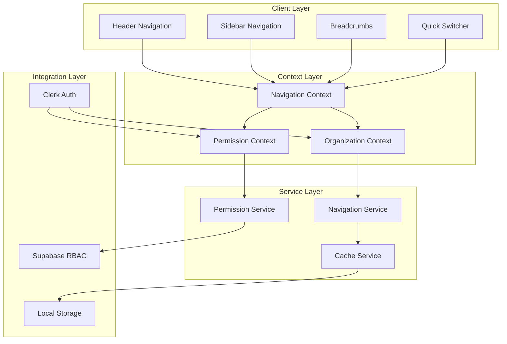
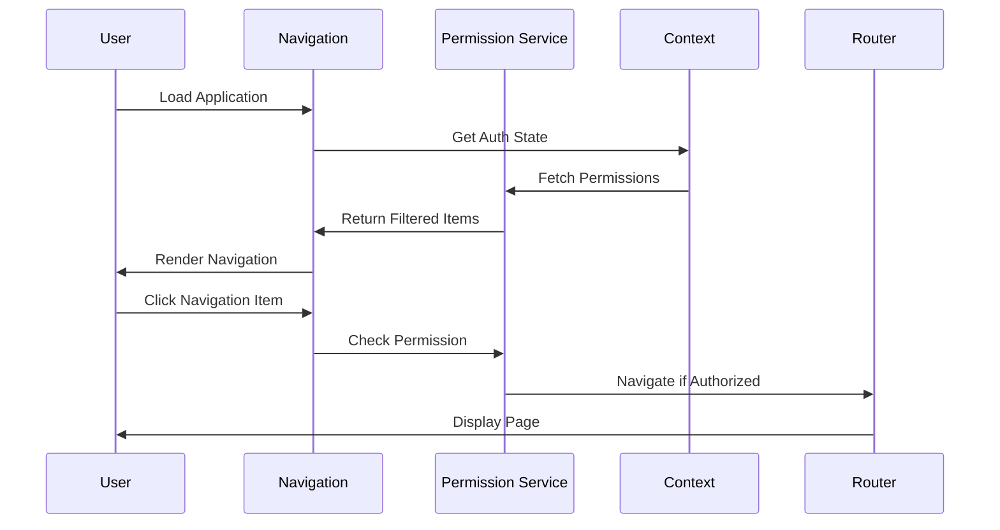

# Design Document

## Overview

The Authenticated Navigation System provides a comprehensive, context-aware navigation experience for Coordinated.Social that adapts to user permissions, organizational hierarchy, and device capabilities. The system consists of a persistent header navigation, collapsible sidebar, breadcrumb trail, and keyboard-accessible quick switcher. It integrates deeply with Clerk authentication, Supabase for permission management, and supports multiple interaction modes including mouse, keyboard, and touch.

The design emphasizes performance, accessibility, and seamless user experience across all devices while maintaining security through role-based access control and permission filtering.

## Architecture

### High-Level Architecture



### Navigation Flow Architecture



## Components and Interfaces

### Core Navigation Components

#### 1. Header Navigation Component

**HeaderNavigation (`components/navigation/header-navigation.tsx`)**
```typescript
interface HeaderNavigationProps {
  className?: string
  fixed?: boolean
}

interface HeaderNavigationState {
  isScrolled: boolean
  isMobileMenuOpen: boolean
  isOffline: boolean
}

export function HeaderNavigation({ className, fixed = true }: HeaderNavigationProps) {
  const { user, organization } = useAuth()
  const { workspace } = useWorkspace()
  const [state, setState] = useState<HeaderNavigationState>({
    isScrolled: false,
    isMobileMenuOpen: false,
    isOffline: false
  })
  
  // Scroll detection for styling
  // Offline detection
  // Mobile menu toggle
  // Render header with logo, org switcher, notifications, search, user menu
}
```

#### 2. Sidebar Navigation Component

**SidebarNavigation (`components/navigation/sidebar-navigation.tsx`)**
```typescript
interface SidebarNavigationProps {
  className?: string
  defaultCollapsed?: boolean
}

interface NavigationItem {
  id: string
  label: string
  icon: React.ComponentType
  href?: string
  children?: NavigationItem[]
  permission?: string
  badge?: string | number
  group?: string
}

export function SidebarNavigation({ className, defaultCollapsed }: SidebarNavigationProps) {
  const { permissions } = usePermissions()
  const { pathname } = usePathname()
  const [collapsed, setCollapsed] = useLocalStorage('sidebar-collapsed', defaultCollapsed)
  const [expandedItems, setExpandedItems] = useState<Set<string>>(new Set())
  
  // Filter items by permissions
  // Handle expand/collapse
  // Persist state to local storage
  // Render navigation tree
}
```

#### 3. Organization Switcher Component

**OrganizationSwitcher (`components/navigation/organization-switcher.tsx`)**
```typescript
interface OrganizationSwitcherProps {
  className?: string
}

interface OrganizationMembership {
  organization: {
    id: string
    name: string
    logoUrl?: string
  }
  role: string
}

export function OrganizationSwitcher({ className }: OrganizationSwitcherProps) {
  const { user } = useAuth()
  const { organizations, currentOrganization, switchOrganization } = useOrganizations()
  const [searchQuery, setSearchQuery] = useState('')
  const [isOpen, setIsOpen] = useState(false)
  
  // Filter organizations by search
  // Handle organization selection
  // Navigate to organization landing page
}
```

#### 4. Breadcrumb Component

**Breadcrumbs (`components/navigation/breadcrumbs.tsx`)**
```typescript
interface BreadcrumbsProps {
  className?: string
  maxItems?: number
}

interface BreadcrumbItem {
  label: string
  href: string
  icon?: React.ComponentType
}

export function Breadcrumbs({ className, maxItems = 5 }: BreadcrumbsProps) {
  const { organization, workspace } = useContext()
  const pathname = usePathname()
  const breadcrumbs = useMemo(() => generateBreadcrumbs(pathname, organization, workspace), [pathname, organization, workspace])
  
  // Generate breadcrumb trail from pathname
  // Handle truncation for long paths
  // Render clickable breadcrumb segments
}
```

#### 5. Quick Switcher Component

**QuickSwitcher (`components/navigation/quick-switcher.tsx`)**
```typescript
interface QuickSwitcherProps {
  shortcut?: string
}

interface QuickSwitcherItem {
  id: string
  type: 'page' | 'action' | 'organization'
  label: string
  description?: string
  icon?: React.ComponentType
  href?: string
  action?: () => void
  keywords?: string[]
}

export function QuickSwitcher({ shortcut = 'cmd+k' }: QuickSwitcherProps) {
  const [isOpen, setIsOpen] = useState(false)
  const [query, setQuery] = useState('')
  const [selectedIndex, setSelectedIndex] = useState(0)
  const items = useQuickSwitcherItems()
  
  // Register keyboard shortcut
  // Filter items by query
  // Handle keyboard navigation
  // Execute selected item
}
```

### Navigation Services

#### 1. Navigation Service

```typescript
interface NavigationService {
  /**
   * Gets navigation items filtered by user permissions
   */
  getNavigationItems(userId: string, organizationId: string): Promise<NavigationItem[]>
  
  /**
   * Generates breadcrumb trail for current path
   */
  generateBreadcrumbs(pathname: string, context: NavigationContext): BreadcrumbItem[]
  
  /**
   * Gets quick switcher items
   */
  getQuickSwitcherItems(userId: string, organizationId: string): Promise<QuickSwitcherItem[]>
  
  /**
   * Caches navigation data
   */
  cacheNavigationData(userId: string, data: NavigationData): Promise<void>
  
  /**
   * Gets cached navigation data
   */
  getCachedNavigationData(userId: string): Promise<NavigationData | null>
}

export class NavigationServiceImpl implements NavigationService {
  constructor(
    private permissionService: PermissionService,
    private cacheService: CacheService
  ) {}
  
  async getNavigationItems(userId: string, organizationId: string): Promise<NavigationItem[]> {
    // Check cache first
    const cached = await this.getCachedNavigationData(userId)
    if (cached && cached.organizationId === organizationId) {
      return cached.items
    }
    
    // Fetch user permissions
    const permissions = await this.permissionService.getUserPermissions(userId, organizationId)
    
    // Filter navigation items by permissions
    const allItems = this.getAllNavigationItems()
    const filteredItems = this.filterByPermissions(allItems, permissions)
    
    // Cache for future use
    await this.cacheNavigationData(userId, {
      organizationId,
      items: filteredItems,
      timestamp: Date.now()
    })
    
    return filteredItems
  }
  
  private filterByPermissions(items: NavigationItem[], permissions: Set<string>): NavigationItem[] {
    return items
      .filter(item => !item.permission || permissions.has(item.permission))
      .map(item => ({
        ...item,
        children: item.children ? this.filterByPermissions(item.children, permissions) : undefined
      }))
  }
}
```

#### 2. Permission Service

```typescript
interface PermissionService {
  /**
   * Gets user permissions for organization
   */
  getUserPermissions(userId: string, organizationId: string): Promise<Set<string>>
  
  /**
   * Checks if user has specific permission
   */
  hasPermission(userId: string, organizationId: string, permission: string): Promise<boolean>
  
  /**
   * Subscribes to permission changes
   */
  subscribeToPermissionChanges(userId: string, callback: (permissions: Set<string>) => void): () => void
}

export class PermissionServiceImpl implements PermissionService {
  constructor(private supabase: SupabaseClient) {}
  
  async getUserPermissions(userId: string, organizationId: string): Promise<Set<string>> {
    // Query user's role in organization
    const { data: membership } = await this.supabase
      .from('organization_memberships')
      .select('role_id')
      .eq('user_id', userId)
      .eq('organization_id', organizationId)
      .single()
    
    if (!membership) {
      return new Set()
    }
    
    // Query role permissions
    const { data: role } = await this.supabase
      .from('roles')
      .select('permissions')
      .eq('id', membership.role_id)
      .single()
    
    return new Set(role?.permissions || [])
  }
  
  subscribeToPermissionChanges(userId: string, callback: (permissions: Set<string>) => void): () => void {
    // Subscribe to real-time updates
    const subscription = this.supabase
      .channel(`permissions:${userId}`)
      .on('postgres_changes', {
        event: '*',
        schema: 'public',
        table: 'organization_memberships',
        filter: `user_id=eq.${userId}`
      }, async () => {
        // Refetch permissions when membership changes
        const { organization } = await this.getCurrentOrganization(userId)
        const permissions = await this.getUserPermissions(userId, organization.id)
        callback(permissions)
      })
      .subscribe()
    
    return () => {
      subscription.unsubscribe()
    }
  }
}
```

### Context Providers

#### 1. Navigation Context

```typescript
interface NavigationContextValue {
  items: NavigationItem[]
  isLoading: boolean
  error: Error | null
  refreshNavigation: () => Promise<void>
  sidebarCollapsed: boolean
  setSidebarCollapsed: (collapsed: boolean) => void
}

export function NavigationProvider({ children }: { children: React.ReactNode }) {
  const { user } = useAuth()
  const { organization } = useOrganization()
  const [items, setItems] = useState<NavigationItem[]>([])
  const [isLoading, setIsLoading] = useState(true)
  const [error, setError] = useState<Error | null>(null)
  const [sidebarCollapsed, setSidebarCollapsed] = useLocalStorage('sidebar-collapsed', false)
  
  const refreshNavigation = useCallback(async () => {
    if (!user || !organization) return
    
    setIsLoading(true)
    try {
      const navigationService = new NavigationServiceImpl(
        new PermissionServiceImpl(supabase),
        new CacheServiceImpl()
      )
      const filteredItems = await navigationService.getNavigationItems(user.id, organization.id)
      setItems(filteredItems)
      setError(null)
    } catch (err) {
      setError(err as Error)
    } finally {
      setIsLoading(false)
    }
  }, [user, organization])
  
  // Load navigation on mount and when organization changes
  useEffect(() => {
    refreshNavigation()
  }, [refreshNavigation])
  
  // Subscribe to permission changes
  useEffect(() => {
    if (!user || !organization) return
    
    const permissionService = new PermissionServiceImpl(supabase)
    const unsubscribe = permissionService.subscribeToPermissionChanges(user.id, () => {
      refreshNavigation()
    })
    
    return unsubscribe
  }, [user, organization, refreshNavigation])
  
  return (
    <NavigationContext.Provider value={{
      items,
      isLoading,
      error,
      refreshNavigation,
      sidebarCollapsed,
      setSidebarCollapsed
    }}>
      {children}
    </NavigationContext.Provider>
  )
}
```

## Data Models

### Navigation Data Structures

```typescript
interface NavigationItem {
  id: string
  label: string
  icon: React.ComponentType
  href?: string
  children?: NavigationItem[]
  permission?: string
  badge?: string | number
  group?: string
  order: number
  metadata?: Record<string, any>
}

interface NavigationGroup {
  id: string
  label: string
  order: number
  items: NavigationItem[]
}

interface NavigationData {
  organizationId: string
  items: NavigationItem[]
  timestamp: number
  version: string
}

interface NavigationCache {
  userId: string
  organizationId: string
  data: NavigationData
  expiresAt: Date
}
```

### Permission Data Structures

```typescript
interface Permission {
  id: string
  name: string
  description: string
  resource: string
  action: string
}

interface Role {
  id: string
  name: string
  description: string
  permissions: string[]
  organizationId: string
}

interface OrganizationMembership {
  id: string
  userId: string
  organizationId: string
  roleId: string
  createdAt: Date
  updatedAt: Date
}
```

### Breadcrumb Data Structures

```typescript
interface BreadcrumbItem {
  label: string
  href: string
  icon?: React.ComponentType
  isCurrentPage: boolean
}

interface BreadcrumbConfig {
  maxItems: number
  showHome: boolean
  separator: string
}
```

### Quick Switcher Data Structures

```typescript
interface QuickSwitcherItem {
  id: string
  type: 'page' | 'action' | 'organization' | 'workspace'
  label: string
  description?: string
  icon?: React.ComponentType
  href?: string
  action?: () => void
  keywords?: string[]
  score?: number
}

interface QuickSwitcherConfig {
  shortcut: string
  maxResults: number
  fuzzySearch: boolean
}
```


## Correctness Properties

*A property is a characteristic or behavior that should hold true across all valid executions of a system-essentially, a formal statement about what the system should do. Properties serve as the bridge between human-readable specifications and machine-verifiable correctness guarantees.*

### Header Navigation Properties

**Property 1: Header presence for authenticated users**
*For any* authenticated user, the header navigation should be rendered on all application pages
**Validates: Requirements 1.1**

**Property 2: Header content completeness**
*For any* organization and workspace context, the header should display organization logo, organization name, and workspace name
**Validates: Requirements 1.2**

**Property 3: Header interactive elements availability**
*For any* rendered header, it should contain accessible organization switcher, notifications, search, and user menu elements
**Validates: Requirements 1.3**

### Organization Switching Properties

**Property 4: Organization list completeness**
*For any* user with organization memberships, clicking the organization switcher should display all organizations where the user has membership
**Validates: Requirements 2.1**

**Property 5: Organization information completeness**
*For any* organization in the switcher list, it should display organization name, logo, and the user's role
**Validates: Requirements 2.2**

**Property 6: Organization context update**
*For any* organization selection, the application context should update to reflect the selected organization
**Validates: Requirements 2.3**

**Property 7: Organization landing page navigation**
*For any* organization context change, the user should be navigated to that organization's default landing page
**Validates: Requirements 2.4**

### Sidebar Navigation Properties

**Property 8: Sidebar presence**
*For any* authenticated user viewing the application, a collapsible sidebar navigation should be displayed on the left side
**Validates: Requirements 3.1**

**Property 9: Navigation item grouping**
*For any* set of navigation items, they should be organized into logical groups based on feature categories
**Validates: Requirements 3.2**

**Property 10: Expand/collapse indicator presence**
*For any* navigation item with sub-items, an expand/collapse indicator should be displayed
**Validates: Requirements 3.3**

**Property 11: Parent item toggle behavior**
*For any* parent navigation item, clicking it should toggle the visibility of its child items
**Validates: Requirements 3.4**

**Property 12: Active item highlighting**
*For any* current page, the corresponding navigation item should be highlighted with distinct visual styling
**Validates: Requirements 3.5**

### Permission-Based Filtering Properties

**Property 13: Permission-based item filtering**
*For any* user and organization context, navigation items should be filtered based on the user's role permissions in that organization
**Validates: Requirements 4.1**

**Property 14: Unauthorized item exclusion**
*For any* navigation item requiring a permission the user lacks, that item should not be displayed
**Validates: Requirements 4.2**

**Property 15: Permission change reactivity**
*For any* user permission change, the visible navigation items should update within 5 seconds
**Validates: Requirements 4.3**

**Property 16: Organization switch permission update**
*For any* organization switch, navigation items should immediately update to reflect permissions in the new organization
**Validates: Requirements 4.4**

**Property 17: RBAC configuration usage**
*For any* permission evaluation, the system should use the organization's role-based access control configuration
**Validates: Requirements 4.5**

### Sidebar Collapse Properties

**Property 18: Sidebar collapse behavior**
*For any* sidebar toggle button click, the sidebar should collapse to show only icons
**Validates: Requirements 5.1**

**Property 19: Collapsed state tooltip display**
*For any* navigation item in collapsed sidebar, hovering should display a tooltip showing the full label
**Validates: Requirements 5.2**

**Property 20: Sidebar expand behavior**
*For any* toggle button click while collapsed, the sidebar should expand to show full labels
**Validates: Requirements 5.3**

**Property 21: Sidebar state persistence**
*For any* sidebar state change, the user's preference should be persisted in local storage
**Validates: Requirements 5.4**

**Property 22: Sidebar state restoration**
*For any* application restart, the sidebar should be restored to the user's last preferred state
**Validates: Requirements 5.5**

### Keyboard Navigation Properties

**Property 23: Quick switcher keyboard activation**
*For any* designated keyboard shortcut press, the quick switcher command palette should open
**Validates: Requirements 6.1**

**Property 24: Quick switcher filtering**
*For any* text input in the quick switcher, navigation items should be filtered to match the input
**Validates: Requirements 6.2**

**Property 25: Quick switcher navigation**
*For any* item selection in the quick switcher, the system should navigate to the corresponding page
**Validates: Requirements 6.3**

**Property 26: Tab key focus movement**
*For any* Tab key press, focus should move through navigation items in logical order
**Validates: Requirements 6.4**

**Property 27: Enter key activation**
*For any* focused navigation item, pressing Enter should activate that item
**Validates: Requirements 6.5**

### Mobile Navigation Properties

**Property 28: Mobile sidebar slide-in**
*For any* hamburger menu tap on mobile, the sidebar navigation should slide in from the left
**Validates: Requirements 7.2**

**Property 29: Mobile overlay behavior**
*For any* open mobile sidebar, an overlay should be displayed that closes the sidebar when tapped
**Validates: Requirements 7.3**

**Property 30: Mobile navigation auto-close**
*For any* navigation item tap on mobile, the system should navigate to the page and automatically close the sidebar
**Validates: Requirements 7.4**

**Property 31: Touch target size compliance**
*For any* navigation item on mobile, touch targets should be at least 44x44 pixels
**Validates: Requirements 7.5**

### Breadcrumb Properties

**Property 32: Breadcrumb trail display**
*For any* page navigation, a breadcrumb trail should be displayed showing the hierarchical path
**Validates: Requirements 8.1**

**Property 33: Breadcrumb hierarchy completeness**
*For any* breadcrumb trail, it should display organization, workspace, and page hierarchy
**Validates: Requirements 8.2**

**Property 34: Breadcrumb navigation**
*For any* breadcrumb segment click, the system should navigate to the corresponding level in the hierarchy
**Validates: Requirements 8.3**

**Property 35: Breadcrumb truncation**
*For any* breadcrumb trail exceeding available width, middle segments should be truncated with an ellipsis
**Validates: Requirements 8.4**

**Property 36: Truncated breadcrumb tooltip**
*For any* truncated breadcrumb hover, a tooltip should display the full path
**Validates: Requirements 8.5**

### Visual Feedback Properties

**Property 37: Hover state display**
*For any* navigation item hover, distinct visual styling should be displayed
**Validates: Requirements 9.1**

**Property 38: Loading indicator timing**
*For any* navigation action taking longer than 200 milliseconds, a loading indicator should be displayed
**Validates: Requirements 9.2**

**Property 39: Active indicator update timing**
*For any* navigation completion, the active item indicator should update within 100 milliseconds
**Validates: Requirements 9.3**

**Property 40: Navigation error handling**
*For any* navigation error, an error message should be displayed and the current page should be maintained
**Validates: Requirements 9.4**

### Accessibility Properties

**Property 41: ARIA attributes presence**
*For any* navigation element, proper ARIA labels and roles should be included
**Validates: Requirements 10.1**

**Property 42: Screen reader page announcement**
*For any* page navigation, the current page and navigation context should be announced to screen readers
**Validates: Requirements 10.2**

**Property 43: Sidebar state announcement**
*For any* sidebar state change, the state change should be announced to screen readers
**Validates: Requirements 10.3**

**Property 44: Disabled state communication**
*For any* disabled navigation item, the disabled state should be communicated through ARIA attributes
**Validates: Requirements 10.4**

**Property 45: Focus visibility**
*For any* interactive element, keyboard focus should be visible with a 3:1 contrast ratio
**Validates: Requirements 10.5**

### Performance Properties

**Property 46: Header render timing**
*For any* application load, the header navigation should render within 500 milliseconds
**Validates: Requirements 11.1**

**Property 47: Skeleton loader display**
*For any* permission fetch operation, a skeleton loader should be displayed for navigation items
**Validates: Requirements 11.2**

**Property 48: Navigation data caching**
*For any* navigation data load, the data should be cached for subsequent page loads
**Validates: Requirements 11.3**

**Property 49: Organization switch timing**
*For any* organization switch, the new organization's navigation should load within 1 second
**Validates: Requirements 11.4**

**Property 50: Lazy loading implementation**
*For any* navigation render, non-critical navigation components should be lazy-loaded
**Validates: Requirements 11.5**

### Offline Support Properties

**Property 51: Offline indicator display**
*For any* offline status detection, an offline indicator should be displayed in the header
**Validates: Requirements 12.1**

**Property 52: Cached page navigation**
*For any* offline state, navigation to recently cached pages should be allowed
**Validates: Requirements 12.2**

**Property 53: Uncached page error message**
*For any* attempt to navigate to an uncached page while offline, a message should be displayed indicating the page is unavailable
**Validates: Requirements 12.3**

**Property 54: Reconnection sync**
*For any* connection restoration, navigation state should automatically sync and the offline indicator should be removed
**Validates: Requirements 12.4**

**Property 55: Cache size limit**
*For any* navigation data caching, the system should store the most recent 20 pages visited by the user
**Validates: Requirements 12.5**

## Error Handling

### Navigation Error Types

```typescript
export class NavigationError extends Error {
  constructor(
    message: string,
    public code: NavigationErrorCode,
    public cause?: Error
  ) {
    super(message)
    this.name = 'NavigationError'
  }
}

enum NavigationErrorCode {
  PERMISSION_DENIED = 'permission_denied',
  ITEM_NOT_FOUND = 'item_not_found',
  LOAD_FAILED = 'load_failed',
  CACHE_ERROR = 'cache_error',
  NETWORK_ERROR = 'network_error',
  INVALID_CONTEXT = 'invalid_context',
  ORGANIZATION_SWITCH_FAILED = 'organization_switch_failed'
}
```

### Error Handling Strategies

#### Permission Errors

```typescript
class PermissionDeniedError extends NavigationError {
  constructor(itemId: string, requiredPermission: string) {
    super(
      `Access denied to navigation item ${itemId}. Required permission: ${requiredPermission}`,
      NavigationErrorCode.PERMISSION_DENIED
    )
  }
}
```

**Handling Strategy:**
- Hide unauthorized navigation items
- Log permission denials for audit
- Display generic error if user attempts direct access
- Redirect to appropriate landing page

#### Load Errors

```typescript
class NavigationLoadError extends NavigationError {
  constructor(cause?: Error) {
    super('Failed to load navigation data', NavigationErrorCode.LOAD_FAILED, cause)
  }
}
```

**Handling Strategy:**
- Display skeleton loader during retry
- Use cached navigation data if available
- Retry with exponential backoff
- Fall back to minimal navigation if all retries fail
- Log errors for monitoring

#### Cache Errors

```typescript
class CacheError extends NavigationError {
  constructor(operation: 'read' | 'write', cause?: Error) {
    super(`Cache ${operation} operation failed`, NavigationErrorCode.CACHE_ERROR, cause)
  }
}
```

**Handling Strategy:**
- Continue without cache if read fails
- Log cache errors for monitoring
- Clear corrupted cache data
- Fall back to direct data fetching

#### Network Errors

```typescript
class NetworkError extends NavigationError {
  constructor(operation: string, cause?: Error) {
    super(`Network error during ${operation}`, NavigationErrorCode.NETWORK_ERROR, cause)
  }
}
```

**Handling Strategy:**
- Display offline indicator
- Use cached data when available
- Queue operations for retry when online
- Provide clear feedback to user
- Implement automatic reconnection

## Testing Strategy

### Testing Philosophy

**CRITICAL REQUIREMENTS**:
1. **100% Test Pass Rate**: All tests must pass for tasks to be considered complete
2. **Official Testing Utilities**: Use @clerk/testing for Clerk integration
3. **Real Service Integration**: Integration tests use real Supabase, never mocks
4. **Memory Management**: All test commands include proper NODE_OPTIONS
5. **Test Isolation**: Tests run independently without side effects

### Dual Testing Approach

The navigation system requires both unit testing and property-based testing to ensure comprehensive coverage and correctness.

#### Unit Testing

Unit tests verify specific examples, edge cases, and error conditions:

- **Component Tests**: Verify header, sidebar, breadcrumbs, and quick switcher render correctly
- **Service Tests**: Test navigation service, permission service, and cache service
- **Context Tests**: Verify navigation context provides correct state and methods
- **Hook Tests**: Test custom hooks for navigation state management
- **Error Handling Tests**: Verify error scenarios are handled gracefully

**Unit Test Requirements**:
- Use official @clerk/testing utilities for Clerk mocks
- Follow memory management standards with NODE_OPTIONS
- Maintain global mock stability
- Test accessibility attributes and keyboard navigation

#### Property-Based Testing

Property-based tests verify universal properties across all inputs using **fast-check** library:

- **Permission Filtering**: Test with random user permissions and navigation items
- **Organization Switching**: Test with random organization contexts
- **Sidebar State**: Test collapse/expand with random initial states
- **Breadcrumb Generation**: Test with random pathname structures
- **Cache Behavior**: Test with random cache states and data
- **Performance**: Verify timing requirements with various data sizes

### Integration Testing with Real Services

**MANDATORY**: Integration tests MUST use real Supabase connections and Clerk authentication.

```typescript
// __tests__/integration/navigation-permissions.integration.test.ts
import { describe, it, expect, beforeAll, afterAll } from 'vitest'
import { createClient } from '@supabase/supabase-js'
import { loadFromPhase } from '@c9d/config'

describe('Navigation Permissions Integration (Real Supabase)', () => {
  let supabase: any
  let testData: string[] = []

  beforeAll(async () => {
    const result = await loadFromPhase(true)
    
    if (!result.success || !result.variables.NEXT_PUBLIC_SUPABASE_URL) {
      console.warn('⚠️  No Supabase configuration. Skipping integration tests.')
      supabase = null
      return
    }

    supabase = createClient(
      result.variables.NEXT_PUBLIC_SUPABASE_URL,
      result.variables.SUPABASE_SERVICE_ROLE_KEY
    )
    
    console.log('🔗 Connected to real Supabase for integration testing')
  })

  afterAll(async () => {
    if (supabase && testData.length > 0) {
      console.log('🧹 Cleaning up test data...')
      // Clean up test users, organizations, roles, etc.
    }
  })

  it('should filter navigation items based on real user permissions', async () => {
    if (!supabase) return

    // Create test user with specific role
    // Create test organization
    // Assign role with specific permissions
    // Fetch navigation items
    // Verify only authorized items are returned
  })
})
```

### End-to-End Testing

**User Journey Tests**
```typescript
describe('Navigation E2E', () => {
  test('authenticated user navigation flow', async ({ page }) => {
    // Sign in with Clerk
    // Verify header navigation appears
    // Test sidebar navigation
    // Switch organizations
    // Verify navigation updates
    // Test breadcrumb navigation
    // Test quick switcher
  })
  
  test('permission-based navigation visibility', async ({ page }) => {
    // Sign in as user with limited permissions
    // Verify only authorized items visible
    // Switch to admin role
    // Verify additional items appear
  })
})
```

## Security Considerations

### Authentication and Authorization

1. **Permission Verification**
   - Verify permissions on every navigation item render
   - Re-check permissions on organization switch
   - Subscribe to real-time permission updates
   - Cache permissions with short TTL

2. **Route Protection**
   - Implement middleware for route-level protection
   - Verify permissions before navigation
   - Redirect unauthorized access attempts
   - Log security events for audit

3. **Data Access Control**
   - Use Supabase Row Level Security (RLS)
   - Filter navigation data by user context
   - Prevent unauthorized data exposure
   - Validate all user inputs

### Security Best Practices

1. **Input Validation**
   - Sanitize search queries in quick switcher
   - Validate organization IDs before switching
   - Escape user-generated content in labels
   - Prevent XSS in navigation items

2. **Session Management**
   - Sync navigation state with Clerk session
   - Clear cached data on sign out
   - Handle session expiration gracefully
   - Implement proper CSRF protection

## Performance Optimization

### Client-Side Performance

1. **Code Splitting**
   - Lazy load quick switcher component
   - Split navigation items by route
   - Implement progressive loading
   - Optimize bundle size

2. **Rendering Optimization**
   - Use React.memo for navigation items
   - Implement virtual scrolling for long lists
   - Debounce search input
   - Optimize re-renders with proper dependencies

3. **Caching Strategy**
   - Cache navigation data in memory
   - Use local storage for sidebar state
   - Implement service worker for offline support
   - Cache permission checks

### Server-Side Performance

1. **Database Optimization**
   - Index permission lookup queries
   - Optimize role-permission joins
   - Use connection pooling
   - Implement query result caching

2. **API Performance**
   - Cache navigation API responses
   - Implement rate limiting
   - Use CDN for static assets
   - Optimize payload size

## Deployment and Configuration

### Environment Configuration

```typescript
interface NavigationConfig {
  features: {
    quickSwitcher: boolean
    breadcrumbs: boolean
    offlineSupport: boolean
    realtimeSync: boolean
  }
  
  performance: {
    cacheTimeout: number
    maxCachedPages: number
    permissionRefreshInterval: number
  }
  
  ui: {
    defaultSidebarCollapsed: boolean
    maxBreadcrumbItems: number
    quickSwitcherShortcut: string
  }
}
```

### Feature Flags

```typescript
const navigationFeatureFlags = {
  enableQuickSwitcher: true,
  enableOfflineMode: true,
  enableRealtimePermissions: true,
  enableBreadcrumbs: true,
  enableMobileOptimizations: true
}
```

This comprehensive design provides a robust foundation for implementing the authenticated navigation system with proper security, performance, and accessibility considerations.
