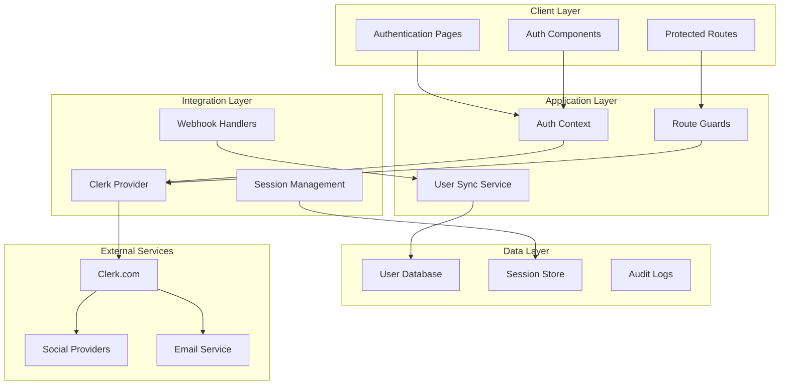
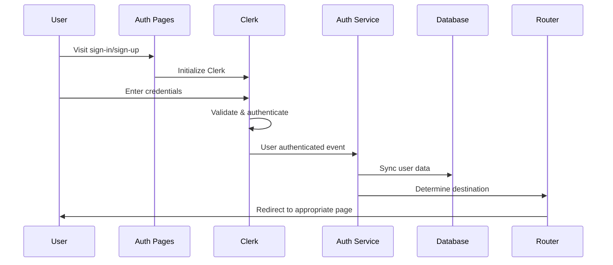

# Design Document

## Overview

The Authentication & User Management system provides a comprehensive, brand-aligned authentication experience using Clerk.com as the primary authentication provider. The design emphasizes seamless user onboarding, intelligent routing, and extensible configuration while maintaining security best practices and accessibility standards. The system integrates deeply with existing onboarding and account management features to provide contextual user experiences.

## Architecture

### High-Level Architecture



### Authentication Flow Architecture



## Components and Interfaces

### Core Authentication Components

#### 1. Authentication Pages

**Sign-In Page (`app/(auth)/sign-in/page.tsx`)**
```typescript
interface SignInPageProps {
  searchParams: {
    redirect_url?: string
    error?: string
  }
}

export default function SignInPage({ searchParams }: SignInPageProps) {
  return (
    <AuthLayout>
      <SignInForm 
        redirectUrl={searchParams.redirect_url}
        error={searchParams.error}
      />
    </AuthLayout>
  )
}
```

**Sign-Up Page (`app/(auth)/sign-up/page.tsx`)**
```typescript
interface SignUpPageProps {
  searchParams: {
    redirect_url?: string
    invitation_token?: string
  }
}

export default function SignUpPage({ searchParams }: SignUpPageProps) {
  return (
    <AuthLayout>
      <SignUpForm 
        redirectUrl={searchParams.redirect_url}
        invitationToken={searchParams.invitation_token}
      />
    </AuthLayout>
  )
}
```

#### 2. Authentication Components

**SignInForm Component**
```typescript
interface SignInFormProps {
  redirectUrl?: string
  error?: string
  className?: string
}

export function SignInForm({ redirectUrl, error, className }: SignInFormProps) {
  const { signIn, isLoaded } = useSignIn()
  const router = useRouter()
  
  // Form state and handlers
  // Social authentication options
  // Error handling and validation
  // Redirect logic after successful authentication
}
```

**SignUpForm Component**
```typescript
interface SignUpFormProps {
  redirectUrl?: string
  invitationToken?: string
  className?: string
}

export function SignUpForm({ redirectUrl, invitationToken, className }: SignUpFormProps) {
  const { signUp, isLoaded } = useSignUp()
  const router = useRouter()
  
  // Registration form with validation
  // Email verification flow
  // Social registration options
  // Invitation handling
  // Post-registration routing
}
```

#### 3. Authentication Layout

**AuthLayout Component**
```typescript
interface AuthLayoutProps {
  children: React.ReactNode
  title?: string
  subtitle?: string
}

export function AuthLayout({ children, title, subtitle }: AuthLayoutProps) {
  return (
    <div className="min-h-screen flex">
      {/* Brand section with logo and messaging */}
      <div className="flex-1 bg-gradient-to-br from-primary to-primary-dark">
        <BrandSection />
      </div>
      
      {/* Authentication form section */}
      <div className="flex-1 flex items-center justify-center p-8">
        <div className="w-full max-w-md">
          {title && <h1 className="text-2xl font-bold mb-2">{title}</h1>}
          {subtitle && <p className="text-gray-600 mb-8">{subtitle}</p>}
          {children}
        </div>
      </div>
    </div>
  )
}
```

### Authentication Services

#### 1. User Synchronization Service

```typescript
interface UserSyncService {
  /**
   * Synchronizes Clerk user with local database
   */
  syncUser(clerkUser: ClerkUser): Promise<User>
  
  /**
   * Updates user profile from Clerk data
   */
  updateUserProfile(userId: string, profileData: Partial<UserProfile>): Promise<User>
  
  /**
   * Handles user deletion/deactivation
   */
  deactivateUser(clerkUserId: string): Promise<void>
}

export class UserSyncServiceImpl implements UserSyncService {
  async syncUser(clerkUser: ClerkUser): Promise<User> {
    // Check if user exists in database
    // Create or update user record
    // Sync profile information
    // Handle organization memberships
    // Return synchronized user data
  }
}
```

#### 2. Authentication Router Service

```typescript
interface AuthRouterService {
  /**
   * Determines post-authentication destination
   */
  getPostAuthDestination(user: User, redirectUrl?: string): Promise<string>
  
  /**
   * Handles protected route access
   */
  handleProtectedRoute(pathname: string): string | null
  
  /**
   * Manages onboarding flow routing
   */
  getOnboardingDestination(user: User): Promise<string>
}

export class AuthRouterServiceImpl implements AuthRouterService {
  async getPostAuthDestination(user: User, redirectUrl?: string): Promise<string> {
    // Check if redirect URL is provided and valid
    if (redirectUrl && this.isValidRedirectUrl(redirectUrl)) {
      return redirectUrl
    }
    
    // Check onboarding status
    const onboardingStatus = await this.getOnboardingStatus(user)
    if (!onboardingStatus.completed) {
      return this.getOnboardingDestination(user)
    }
    
    // Default to dashboard or last visited page
    return user.lastVisitedPage || '/dashboard'
  }
}
```

### Route Protection and Middleware

#### 1. Authentication Middleware

```typescript
// middleware.ts
import { authMiddleware } from '@clerk/nextjs'

export default authMiddleware({
  // Public routes that don't require authentication
  publicRoutes: [
    '/',
    '/sign-in(.*)',
    '/sign-up(.*)',
    '/api/webhooks(.*)',
    '/api/health'
  ],
  
  // Routes that require authentication
  protectedRoutes: [
    '/dashboard(.*)',
    '/onboarding(.*)',
    '/account(.*)',
    '/organizations(.*)'
  ],
  
  // Custom redirect handling
  afterAuth(auth, req) {
    // Handle post-authentication routing
    if (auth.userId && req.nextUrl.pathname === '/') {
      return NextResponse.redirect(new URL('/dashboard', req.url))
    }
    
    // Handle unauthenticated access to protected routes
    if (!auth.userId && isProtectedRoute(req.nextUrl.pathname)) {
      const signInUrl = new URL('/sign-in', req.url)
      signInUrl.searchParams.set('redirect_url', req.nextUrl.pathname)
      return NextResponse.redirect(signInUrl)
    }
  }
})
```

#### 2. Route Guards

```typescript
interface RouteGuardProps {
  children: React.ReactNode
  requiredPermissions?: string[]
  fallback?: React.ReactNode
}

export function RouteGuard({ children, requiredPermissions, fallback }: RouteGuardProps) {
  const { user, isLoaded } = useAuth()
  const router = useRouter()
  
  useEffect(() => {
    if (isLoaded && !user) {
      router.push('/sign-in')
    }
  }, [isLoaded, user, router])
  
  if (!isLoaded) {
    return <LoadingSpinner />
  }
  
  if (!user) {
    return fallback || <AccessDenied />
  }
  
  if (requiredPermissions && !hasPermissions(user, requiredPermissions)) {
    return <InsufficientPermissions />
  }
  
  return <>{children}</>
}
```

## Data Models

### User Authentication Data

```typescript
interface User {
  id: string
  clerkUserId: string
  email: string
  firstName?: string
  lastName?: string
  avatarUrl?: string
  emailVerified: boolean
  lastSignInAt?: Date
  createdAt: Date
  updatedAt: Date
  
  // Onboarding and preferences
  onboardingCompleted: boolean
  onboardingStep?: string
  preferences: UserPreferences
  lastVisitedPage?: string
  
  // Organization context
  currentOrganizationId?: string
  organizationMemberships: OrganizationMembership[]
}

interface UserPreferences {
  theme: 'light' | 'dark' | 'system'
  language: string
  timezone: string
  emailNotifications: boolean
  marketingEmails: boolean
}

interface AuthSession {
  id: string
  userId: string
  clerkSessionId: string
  deviceInfo: DeviceInfo
  ipAddress: string
  userAgent: string
  createdAt: Date
  lastActiveAt: Date
  expiresAt: Date
}

interface DeviceInfo {
  type: 'desktop' | 'mobile' | 'tablet'
  os: string
  browser: string
  location?: string
}
```

### Authentication Events

```typescript
interface AuthEvent {
  id: string
  userId: string
  type: AuthEventType
  metadata: Record<string, any>
  ipAddress: string
  userAgent: string
  timestamp: Date
}

enum AuthEventType {
  SIGN_IN = 'sign_in',
  SIGN_OUT = 'sign_out',
  SIGN_UP = 'sign_up',
  PASSWORD_RESET = 'password_reset',
  EMAIL_VERIFICATION = 'email_verification',
  TWO_FACTOR_ENABLED = 'two_factor_enabled',
  ACCOUNT_LOCKED = 'account_locked',
  SUSPICIOUS_ACTIVITY = 'suspicious_activity'
}
```

## Error Handling

### Authentication Error Types

```typescript
export class AuthenticationError extends Error {
  constructor(
    message: string,
    public code: AuthErrorCode,
    public cause?: Error
  ) {
    super(message)
    this.name = 'AuthenticationError'
  }
}

enum AuthErrorCode {
  INVALID_CREDENTIALS = 'invalid_credentials',
  EMAIL_NOT_VERIFIED = 'email_not_verified',
  ACCOUNT_LOCKED = 'account_locked',
  TOO_MANY_ATTEMPTS = 'too_many_attempts',
  WEAK_PASSWORD = 'weak_password',
  EMAIL_ALREADY_EXISTS = 'email_already_exists',
  INVALID_TOKEN = 'invalid_token',
  SESSION_EXPIRED = 'session_expired',
  NETWORK_ERROR = 'network_error',
  SERVICE_UNAVAILABLE = 'service_unavailable'
}
```

### Error Handling Strategy

```typescript
interface ErrorHandlingService {
  handleAuthError(error: ClerkAPIError): AuthenticationError
  getErrorMessage(errorCode: AuthErrorCode): string
  getRecoveryActions(errorCode: AuthErrorCode): RecoveryAction[]
}

interface RecoveryAction {
  label: string
  action: () => void
  type: 'primary' | 'secondary'
}

export class ErrorHandlingServiceImpl implements ErrorHandlingService {
  handleAuthError(error: ClerkAPIError): AuthenticationError {
    // Map Clerk errors to application errors
    // Provide user-friendly messages
    // Include recovery actions
    // Log for debugging
  }
  
  getErrorMessage(errorCode: AuthErrorCode): string {
    const messages = {
      [AuthErrorCode.INVALID_CREDENTIALS]: 'Invalid email or password. Please check your credentials and try again.',
      [AuthErrorCode.EMAIL_NOT_VERIFIED]: 'Please verify your email address before signing in.',
      [AuthErrorCode.ACCOUNT_LOCKED]: 'Your account has been temporarily locked. Please contact support.',
      // ... other error messages
    }
    
    return messages[errorCode] || 'An unexpected error occurred. Please try again.'
  }
}
```

## Testing Strategy

### Unit Testing

**Authentication Component Tests**
```typescript
describe('SignInForm', () => {
  it('should handle successful sign-in', async () => {
    // Mock Clerk sign-in success
    // Verify form submission
    // Check redirect behavior
  })
  
  it('should display error for invalid credentials', async () => {
    // Mock Clerk authentication error
    // Verify error message display
    // Check form state handling
  })
  
  it('should support social authentication', async () => {
    // Mock social provider flow
    // Verify provider selection
    // Check OAuth redirect
  })
})
```

**Service Layer Tests**
```typescript
describe('UserSyncService', () => {
  it('should create new user from Clerk data', async () => {
    // Mock Clerk user object
    // Verify database insertion
    // Check data transformation
  })
  
  it('should update existing user profile', async () => {
    // Mock existing user
    // Verify profile updates
    // Check audit logging
  })
})
```

### Integration Testing

**Authentication Flow Tests**
```typescript
describe('Authentication Integration', () => {
  it('should complete full sign-up flow', async () => {
    // Test sign-up form submission
    // Verify email verification
    // Check user creation in database
    // Validate post-auth routing
  })
  
  it('should handle protected route access', async () => {
    // Test unauthenticated access
    // Verify redirect to sign-in
    // Check return to original route
  })
})
```

### End-to-End Testing

**User Journey Tests**
```typescript
describe('Authentication E2E', () => {
  test('new user registration and onboarding', async ({ page }) => {
    // Navigate to sign-up
    // Complete registration form
    // Verify email (mock)
    // Check onboarding redirect
    // Complete onboarding flow
  })
  
  test('returning user sign-in', async ({ page }) => {
    // Navigate to sign-in
    // Enter credentials
    // Verify dashboard access
    // Check session persistence
  })
})
```

## Security Considerations

### Authentication Security

1. **Password Security**
   - Enforce strong password requirements
   - Use Clerk's built-in password validation
   - Support password strength indicators
   - Implement secure password reset flows

2. **Session Management**
   - Use Clerk's secure session handling
   - Implement proper session timeout
   - Support session invalidation
   - Monitor for suspicious activity

3. **Multi-Factor Authentication**
   - Support TOTP and SMS-based 2FA
   - Enforce 2FA for admin accounts
   - Provide backup codes
   - Handle 2FA recovery flows

4. **Social Authentication**
   - Validate social provider responses
   - Handle account linking securely
   - Prevent social account takeover
   - Audit social authentication events

### Data Protection

1. **Personal Information**
   - Encrypt sensitive user data
   - Implement data minimization
   - Support GDPR compliance
   - Provide data export/deletion

2. **Audit Logging**
   - Log all authentication events
   - Monitor failed login attempts
   - Track privilege escalations
   - Maintain audit trail integrity

## Performance Optimization

### Client-Side Performance

1. **Code Splitting**
   - Lazy load authentication components
   - Split Clerk provider initialization
   - Optimize bundle size for auth pages
   - Implement progressive loading

2. **Caching Strategy**
   - Cache user profile data
   - Implement session storage
   - Use service worker for offline support
   - Optimize API response caching

### Server-Side Performance

1. **Database Optimization**
   - Index user lookup queries
   - Optimize session storage
   - Implement connection pooling
   - Use read replicas for user data

2. **API Performance**
   - Cache Clerk API responses
   - Implement rate limiting
   - Use CDN for static assets
   - Optimize webhook processing

## Deployment and Configuration

### Environment Configuration

```typescript
interface AuthConfig {
  clerk: {
    publishableKey: string
    secretKey: string
    webhookSecret: string
    frontendApi: string
  }
  
  features: {
    socialAuth: boolean
    twoFactorAuth: boolean
    emailVerification: boolean
    passwordReset: boolean
  }
  
  routing: {
    signInUrl: string
    signUpUrl: string
    afterSignInUrl: string
    afterSignUpUrl: string
  }
  
  branding: {
    logoUrl: string
    primaryColor: string
    backgroundImage?: string
  }
}
```

### Webhook Configuration

```typescript
// app/api/webhooks/clerk/route.ts
export async function POST(request: Request) {
  const payload = await request.text()
  const signature = request.headers.get('svix-signature')
  
  // Verify webhook signature
  const webhook = new Webhook(process.env.CLERK_WEBHOOK_SECRET!)
  const event = webhook.verify(payload, signature) as WebhookEvent
  
  // Handle different event types
  switch (event.type) {
    case 'user.created':
      await handleUserCreated(event.data)
      break
    case 'user.updated':
      await handleUserUpdated(event.data)
      break
    case 'user.deleted':
      await handleUserDeleted(event.data)
      break
    case 'session.created':
      await handleSessionCreated(event.data)
      break
  }
  
  return new Response('OK', { status: 200 })
}
```

This comprehensive design provides a robust foundation for implementing authentication and user management with Clerk.com while maintaining flexibility for future enhancements and ensuring seamless integration with existing platform features.