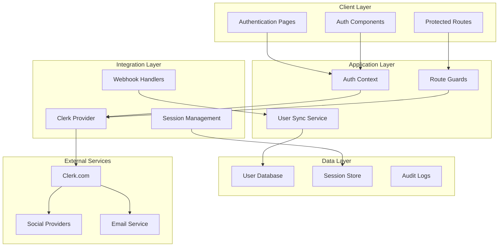
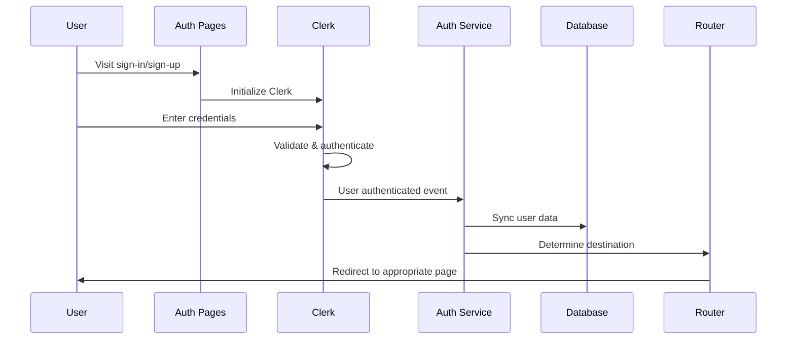

# Design Document

## Overview

The Authentication & User Management system provides a comprehensive, brand-aligned authentication experience using Clerk.com as the primary authentication provider. The design emphasizes seamless user onboarding, intelligent routing, and extensible configuration while maintaining security best practices and accessibility standards. The system integrates deeply with existing onboarding and account management features to provide contextual user experiences.

## Architecture

### High-Level Architecture


```mermaid
graph TB
    subgraph "Client Layer"
        A[Authentication Pages]
        B[Protected Routes]
        C[Auth Components]
    end
    
    subgraph "Application Layer"
        D[Auth Context]
        E[Route Guards]
        F[User Sync Service]
    end
    
    subgraph "Integration Layer"
        G[Clerk Provider]
        H[Webhook Handlers]
        I[Session Management]
    end
    
    subgraph "Data Layer"
        J[User Database]
        K[Session Store]
        L[Audit Logs]
    end
    
    subgraph "External Services"
        M[Clerk.com]
        N[Social Providers]
        O[Email Service]
    end
    
    A --> D
    B --> E
    C --> D
    D --> G
    E --> G
    F --> J
    G --> M
    H --> F
    I --> K
    M --> N
    M --> O
```

### Authentication Flow Architecture


```mermaid
sequenceDiagram
    participant U as User
    participant AP as Auth Pages
    participant C as Clerk
    participant AS as Auth Service
    participant DB as Database
    participant R as Router
    
    U->>AP: Visit sign-in/sign-up
    AP->>C: Initialize Clerk
    U->>C: Enter credentials
    C->>C: Validate & authenticate
    C->>AS: User authenticated event
    AS->>DB: Sync user data
    AS->>R: Determine destination
    R->>U: Redirect to appropriate page
```

## Components and Interfaces

### Core Authentication Components

#### 1. Authentication Pages

**Sign-In Page (`app/(auth)/sign-in/page.tsx`)**
```typescript
interface SignInPageProps {
  searchParams: {
    redirect_url?: string
    error?: string
  }
}

export default function SignInPage({ searchParams }: SignInPageProps) {
  return (
    <AuthLayout>
      <SignInForm 
        redirectUrl={searchParams.redirect_url}
        error={searchParams.error}
      />
    </AuthLayout>
  )
}
```

**Sign-Up Page (`app/(auth)/sign-up/page.tsx`)**
```typescript
interface SignUpPageProps {
  searchParams: {
    redirect_url?: string
    invitation_token?: string
  }
}

export default function SignUpPage({ searchParams }: SignUpPageProps) {
  return (
    <AuthLayout>
      <SignUpForm 
        redirectUrl={searchParams.redirect_url}
        invitationToken={searchParams.invitation_token}
      />
    </AuthLayout>
  )
}
```

#### 2. Authentication Components

**SignInForm Component**
```typescript
interface SignInFormProps {
  redirectUrl?: string
  error?: string
  className?: string
}

export function SignInForm({ redirectUrl, error, className }: SignInFormProps) {
  const { signIn, isLoaded } = useSignIn()
  const router = useRouter()
  
  // Form state and handlers
  // Social authentication options
  // Error handling and validation
  // Redirect logic after successful authentication
}
```

**SignUpForm Component**
```typescript
interface SignUpFormProps {
  redirectUrl?: string
  invitationToken?: string
  className?: string
}

export function SignUpForm({ redirectUrl, invitationToken, className }: SignUpFormProps) {
  const { signUp, isLoaded } = useSignUp()
  const router = useRouter()
  
  // Registration form with validation
  // Email verification flow
  // Social registration options
  // Invitation handling
  // Post-registration routing
}
```

#### 3. Authentication Layout

**AuthLayout Component**
```typescript
interface AuthLayoutProps {
  children: React.ReactNode
  title?: string
  subtitle?: string
}

export function AuthLayout({ children, title, subtitle }: AuthLayoutProps) {
  return (
    <div className="min-h-screen flex">
      {/* Brand section with logo and messaging */}
      <div className="flex-1 bg-gradient-to-br from-primary to-primary-dark">
        <BrandSection />
      </div>
      
      {/* Authentication form section */}
      <div className="flex-1 flex items-center justify-center p-8">
        <div className="w-full max-w-md">
          {title && <h1 className="text-2xl font-bold mb-2">{title}</h1>}
          {subtitle && <p className="text-gray-600 mb-8">{subtitle}</p>}
          {children}
        </div>
      </div>
    </div>
  )
}
```

### Authentication Services

#### 1. User Synchronization Service

```typescript
interface UserSyncService {
  /**
   * Synchronizes Clerk user with local database
   */
  syncUser(clerkUser: ClerkUser): Promise<User>
  
  /**
   * Updates user profile from Clerk data
   */
  updateUserProfile(userId: string, profileData: Partial<UserProfile>): Promise<User>
  
  /**
   * Handles user deletion/deactivation
   */
  deactivateUser(clerkUserId: string): Promise<void>
}

export class UserSyncServiceImpl implements UserSyncService {
  async syncUser(clerkUser: ClerkUser): Promise<User> {
    // Check if user exists in database
    // Create or update user record
    // Sync profile information
    // Handle organization memberships
    // Return synchronized user data
  }
}
```

#### 2. Authentication Router Service

```typescript
interface AuthRouterService {
  /**
   * Determines post-authentication destination
   */
  getPostAuthDestination(user: User, redirectUrl?: string): Promise<string>
  
  /**
   * Handles protected route access
   */
  handleProtectedRoute(pathname: string): string | null
  
  /**
   * Manages onboarding flow routing
   */
  getOnboardingDestination(user: User): Promise<string>
}

export class AuthRouterServiceImpl implements AuthRouterService {
  async getPostAuthDestination(user: User, redirectUrl?: string): Promise<string> {
    // Check if redirect URL is provided and valid
    if (redirectUrl && this.isValidRedirectUrl(redirectUrl)) {
      return redirectUrl
    }
    
    // Check onboarding status
    const onboardingStatus = await this.getOnboardingStatus(user)
    if (!onboardingStatus.completed) {
      return this.getOnboardingDestination(user)
    }
    
    // Default to dashboard or last visited page
    return user.lastVisitedPage || '/dashboard'
  }
}
```

### Route Protection and Middleware

#### 1. Authentication Middleware

```typescript
// middleware.ts
import { authMiddleware } from '@clerk/nextjs'

export default authMiddleware({
  // Public routes that don't require authentication
  publicRoutes: [
    '/',
    '/sign-in(.*)',
    '/sign-up(.*)',
    '/api/webhooks(.*)',
    '/api/health'
  ],
  
  // Routes that require authentication
  protectedRoutes: [
    '/dashboard(.*)',
    '/onboarding(.*)',
    '/account(.*)',
    '/organizations(.*)'
  ],
  
  // Custom redirect handling
  afterAuth(auth, req) {
    // Handle post-authentication routing
    if (auth.userId && req.nextUrl.pathname === '/') {
      return NextResponse.redirect(new URL('/dashboard', req.url))
    }
    
    // Handle unauthenticated access to protected routes
    if (!auth.userId && isProtectedRoute(req.nextUrl.pathname)) {
      const signInUrl = new URL('/sign-in', req.url)
      signInUrl.searchParams.set('redirect_url', req.nextUrl.pathname)
      return NextResponse.redirect(signInUrl)
    }
  }
})
```

#### 2. Route Guards

```typescript
interface RouteGuardProps {
  children: React.ReactNode
  requiredPermissions?: string[]
  fallback?: React.ReactNode
}

export function RouteGuard({ children, requiredPermissions, fallback }: RouteGuardProps) {
  const { user, isLoaded } = useAuth()
  const router = useRouter()
  
  useEffect(() => {
    if (isLoaded && !user) {
      router.push('/sign-in')
    }
  }, [isLoaded, user, router])
  
  if (!isLoaded) {
    return <LoadingSpinner />
  }
  
  if (!user) {
    return fallback || <AccessDenied />
  }
  
  if (requiredPermissions && !hasPermissions(user, requiredPermissions)) {
    return <InsufficientPermissions />
  }
  
  return <>{children}</>
}
```

## Data Models

### User Authentication Data

```typescript
interface User {
  id: string
  clerkUserId: string
  email: string
  firstName?: string
  lastName?: string
  avatarUrl?: string
  emailVerified: boolean
  lastSignInAt?: Date
  createdAt: Date
  updatedAt: Date
  
  // Onboarding and preferences
  onboardingCompleted: boolean
  onboardingStep?: string
  preferences: UserPreferences
  lastVisitedPage?: string
  
  // Organization context
  currentOrganizationId?: string
  organizationMemberships: OrganizationMembership[]
}

interface UserPreferences {
  theme: 'light' | 'dark' | 'system'
  language: string
  timezone: string
  emailNotifications: boolean
  marketingEmails: boolean
}

interface AuthSession {
  id: string
  userId: string
  clerkSessionId: string
  deviceInfo: DeviceInfo
  ipAddress: string
  userAgent: string
  createdAt: Date
  lastActiveAt: Date
  expiresAt: Date
}

interface DeviceInfo {
  type: 'desktop' | 'mobile' | 'tablet'
  os: string
  browser: string
  location?: string
}
```

### Authentication Events

```typescript
interface AuthEvent {
  id: string
  userId: string
  type: AuthEventType
  metadata: Record<string, any>
  ipAddress: string
  userAgent: string
  timestamp: Date
}

enum AuthEventType {
  SIGN_IN = 'sign_in',
  SIGN_OUT = 'sign_out',
  SIGN_UP = 'sign_up',
  PASSWORD_RESET = 'password_reset',
  EMAIL_VERIFICATION = 'email_verification',
  TWO_FACTOR_ENABLED = 'two_factor_enabled',
  ACCOUNT_LOCKED = 'account_locked',
  SUSPICIOUS_ACTIVITY = 'suspicious_activity'
}
```

## Correctness Properties

*A property is a characteristic or behavior that should hold true across all valid executions of a system—essentially, a formal statement about what the system should do. Properties serve as the bridge between human-readable specifications and machine-verifiable correctness guarantees.*

### Property 1: Authentication State Consistency
*For any* user authentication attempt, the system state (authenticated/unauthenticated) should be consistent across all components and services after the authentication operation completes.

**Validates: Requirements 2.2, 2.3, 7.1**

### Property 2: Session Persistence Invariant
*For any* authenticated session with "Remember Me" enabled, the session should remain valid across browser restarts until explicit sign-out or session expiration.

**Validates: Requirements 2.4, 7.1, 7.2**

### Property 3: Route Protection Completeness
*For any* protected route, an unauthenticated user should always be redirected to sign-in, and after successful authentication, should be redirected back to the originally requested route.

**Validates: Requirements 4.4**

### Property 4: Onboarding Routing Determinism
*For any* authenticated user, the post-authentication destination should be deterministic based on their onboarding status: incomplete onboarding → onboarding flow, complete onboarding → dashboard/last visited page.

**Validates: Requirements 4.1, 4.2, 4.3**

### Property 5: User Data Synchronization Consistency
*For any* Clerk user event (created, updated, deleted), the local database should reflect the same user state after webhook processing completes.

**Validates: Requirements 6.4, 8.2**

### Property 6: Error Message Actionability
*For any* authentication error, the system should provide an error message that includes specific resolution steps or recovery actions.

**Validates: Requirements 10.1, 10.4**

### Property 7: Password Validation Completeness
*For any* password input during sign-up or reset, the system should validate all security requirements (length, complexity, strength) and provide real-time feedback before submission.

**Validates: Requirements 1.2, 5.2**

### Property 8: Social Authentication Provider Parity
*For any* supported social provider (Google, GitHub, Microsoft), the authentication flow should provide equivalent functionality and user experience.

**Validates: Requirements 1.3, 2.1**

### Property 9: Accessibility Compliance Universality
*For any* authentication page or component, all interactive elements should be accessible via keyboard navigation and properly labeled for screen readers.

**Validates: Requirements 9.1, 9.2**

### Property 10: Session Expiration Graceful Handling
*For any* expired session, the system should detect the expiration, prompt for re-authentication, and preserve the user's intended action or destination.

**Validates: Requirements 7.3**

### Property 11: Branding Consistency Across Authentication
*For any* authentication page (sign-in, sign-up, password reset), the visual branding (logo, colors, typography) should be consistent with the platform's design system.

**Validates: Requirements 3.1, 3.5**

### Property 12: Email Verification Flow Completeness
*For any* user requiring email verification, the system should guide them through verification, provide resend options, and properly handle verification success/failure.

**Validates: Requirements 1.4**

### Property 13: Configuration Change Isolation
*For any* Clerk configuration update (environment variables, feature flags), the system should apply changes without requiring code modifications.

**Validates: Requirements 6.1, 6.2, 6.5**

### Property 14: Audit Trail Completeness
*For any* authentication event (sign-in, sign-out, password reset, security incident), the system should create a complete audit log entry with timestamp, user ID, event type, and relevant metadata.

**Validates: Requirements 8.3, 8.4, 10.5**

### Property 15: Network Error Recovery
*For any* network interruption during authentication, the system should detect the failure, provide clear feedback, and offer retry mechanisms without data loss.

**Validates: Requirements 10.2, 10.3**

## Error Handling

### Authentication Error Types

```typescript
export class AuthenticationError extends Error {
  constructor(
    message: string,
    public code: AuthErrorCode,
    public cause?: Error
  ) {
    super(message)
    this.name = 'AuthenticationError'
  }
}

enum AuthErrorCode {
  INVALID_CREDENTIALS = 'invalid_credentials',
  EMAIL_NOT_VERIFIED = 'email_not_verified',
  ACCOUNT_LOCKED = 'account_locked',
  TOO_MANY_ATTEMPTS = 'too_many_attempts',
  WEAK_PASSWORD = 'weak_password',
  EMAIL_ALREADY_EXISTS = 'email_already_exists',
  INVALID_TOKEN = 'invalid_token',
  SESSION_EXPIRED = 'session_expired',
  NETWORK_ERROR = 'network_error',
  SERVICE_UNAVAILABLE = 'service_unavailable'
}
```

### Error Handling Strategy

```typescript
interface ErrorHandlingService {
  handleAuthError(error: ClerkAPIError): AuthenticationError
  getErrorMessage(errorCode: AuthErrorCode): string
  getRecoveryActions(errorCode: AuthErrorCode): RecoveryAction[]
}

interface RecoveryAction {
  label: string
  action: () => void
  type: 'primary' | 'secondary'
}

export class ErrorHandlingServiceImpl implements ErrorHandlingService {
  handleAuthError(error: ClerkAPIError): AuthenticationError {
    // Map Clerk errors to application errors
    // Provide user-friendly messages
    // Include recovery actions
    // Log for debugging
  }
  
  getErrorMessage(errorCode: AuthErrorCode): string {
    const messages = {
      [AuthErrorCode.INVALID_CREDENTIALS]: 'Invalid email or password. Please check your credentials and try again.',
      [AuthErrorCode.EMAIL_NOT_VERIFIED]: 'Please verify your email address before signing in.',
      [AuthErrorCode.ACCOUNT_LOCKED]: 'Your account has been temporarily locked. Please contact support.',
      // ... other error messages
    }
    
    return messages[errorCode] || 'An unexpected error occurred. Please try again.'
  }
}
```

## Testing Strategy

### Testing Philosophy

The authentication system follows modern testing standards with official testing utilities and tiered coverage requirements:

- **Official Utilities**: Use @clerk/testing for all Clerk integration tests
- **Memory Management**: All test commands include proper NODE_OPTIONS configuration
- **Tiered Coverage**: 
  - Services (lib/services/**): 100% coverage required
  - Models (lib/models/**): 95% coverage required
  - API Routes (app/api/**): 90% coverage required
  - Global minimum: 85% coverage

### Unit Testing

**Authentication Component Tests**
```typescript
// Uses official @clerk/testing utilities
describe('SignInForm', () => {
  it('should render with Clerk integration', () => {
    // Global Clerk mocks automatically available
    render(<SignInForm />)
    expect(screen.getByTestId('sign-in-form')).toBeInTheDocument()
  })
  
  it('should handle successful sign-in', async () => {
    // Test with official Clerk mock responses
    const { signIn } = useSignIn()
    await signIn.create({ identifier: 'test@example.com', password: 'password' })
    // Verify form submission and redirect behavior
  })
  
  it('should display error for invalid credentials', async () => {
    // Test error scenarios with Clerk error patterns
    // Verify error message display
    // Check form state handling and recovery options
  })
  
  it('should support social authentication', async () => {
    // Test social provider flows
    // Verify provider selection (Google, GitHub, Microsoft)
    // Check OAuth redirect handling
  })
  
  it('should validate password strength in real-time', async () => {
    // Test password validation feedback
    // Verify strength indicators
    // Check requirement enforcement
  })
})
```

**Service Layer Tests**
```typescript
describe('UserSyncService', () => {
  it('should create new user from Clerk data', async () => {
    // Test user synchronization from Clerk webhook
    // Verify database insertion with proper data transformation
    // Check audit logging
  })
  
  it('should update existing user profile', async () => {
    // Test profile update synchronization
    // Verify partial updates
    // Check timestamp management
  })
  
  it('should handle user deletion', async () => {
    // Test user deactivation flow
    // Verify data cleanup
    // Check cascade operations
  })
})

describe('AuthRouterService', () => {
  it('should route new users to onboarding', async () => {
    // Test routing logic for new users
    // Verify onboarding flow initiation
  })
  
  it('should resume incomplete onboarding', async () => {
    // Test onboarding resume logic
    // Verify correct step detection
  })
  
  it('should route completed users to dashboard', async () => {
    // Test default routing for onboarded users
    // Verify last visited page handling
  })
})
```

### Integration Testing

**Authentication Flow Tests**
```typescript
describe('Authentication Integration', () => {
  it('should complete full sign-up flow with email verification', async () => {
    // Test complete registration process
    // Verify email verification flow
    // Check user creation in database
    // Validate post-auth routing to onboarding
  })
  
  it('should complete social authentication flow', async () => {
    // Test Google/GitHub/Microsoft authentication
    // Verify account creation or linking
    // Check proper user synchronization
  })
  
  it('should handle protected route access', async () => {
    // Test unauthenticated access to protected routes
    // Verify redirect to sign-in with return URL
    // Check successful return after authentication
  })
  
  it('should handle password reset flow', async () => {
    // Test forgot password request
    // Verify reset email sent
    // Check password update and re-authentication
  })
  
  it('should handle session expiration gracefully', async () => {
    // Test expired session detection
    // Verify re-authentication prompt
    // Check session refresh mechanism
  })
})

**Webhook Integration Tests**
```typescript
describe('Clerk Webhook Integration', () => {
  it('should process user.created webhook', async () => {
    // Test user creation webhook handling
    // Verify database synchronization
    // Check initial user setup
  })
  
  it('should process user.updated webhook', async () => {
    // Test user update webhook handling
    // Verify profile synchronization
  })
  
  it('should process session.created webhook', async () => {
    // Test session tracking
    // Verify audit logging
  })
})
```

### End-to-End Testing

**User Journey Tests**
```typescript
describe('Authentication E2E', () => {
  test('new user registration and onboarding', async ({ page }) => {
    // Navigate to sign-up page
    // Complete registration form with email/password
    // Verify email (mock verification in test environment)
    // Check automatic redirect to onboarding
    // Complete onboarding flow
    // Verify final redirect to dashboard
  })
  
  test('social authentication flow', async ({ page }) => {
    // Navigate to sign-in page
    // Click social provider button (Google/GitHub/Microsoft)
    // Complete OAuth flow (mocked)
    // Verify successful authentication
    // Check proper routing based on user status
  })
  
  test('returning user sign-in', async ({ page }) => {
    // Navigate to sign-in page
    // Enter credentials
    // Verify dashboard access
    // Check session persistence across page reloads
  })
  
  test('password reset flow', async ({ page }) => {
    // Navigate to sign-in page
    // Click "Forgot Password"
    // Enter email address
    // Verify reset email sent message
    // Complete password reset (mock email link)
    // Sign in with new password
  })
  
  test('protected route access and redirect', async ({ page }) => {
    // Attempt to access protected route while unauthenticated
    // Verify redirect to sign-in page
    // Complete authentication
    // Verify redirect back to original protected route
  })
  
  test('accessibility compliance', async ({ page }) => {
    // Test keyboard navigation through auth forms
    // Verify screen reader compatibility
    // Check focus management
    // Test high contrast mode
  })
})
```

### Performance Testing

**Load and Response Time Tests**
```typescript
describe('Authentication Performance', () => {
  it('should complete sign-in within acceptable time', async () => {
    const startTime = performance.now()
    await signInUser('test@example.com', 'password')
    const duration = performance.now() - startTime
    expect(duration).toBeLessThan(2000) // 2 second threshold
  })
  
  it('should handle concurrent authentication requests', async () => {
    // Test multiple simultaneous sign-in attempts
    // Verify system stability
    // Check response times under load
  })
})
```

### Security Testing

**Security Validation Tests**
```typescript
describe('Authentication Security', () => {
  it('should prevent SQL injection in authentication', async () => {
    // Test with malicious input patterns
    // Verify proper input sanitization
  })
  
  it('should enforce rate limiting on authentication attempts', async () => {
    // Test multiple failed login attempts
    // Verify rate limiting activation
    // Check lockout behavior
  })
  
  it('should validate CSRF tokens', async () => {
    // Test CSRF protection on auth endpoints
    // Verify token validation
  })
})
```

## Security Considerations

### Authentication Security

1. **Password Security**
   - Enforce strong password requirements (minimum 8 characters, mix of uppercase, lowercase, numbers, special characters)
   - Use Clerk's built-in password validation and strength checking
   - Implement real-time password strength indicators with visual feedback
   - Provide secure password reset flows with time-limited tokens
   - Never store or log passwords in plain text
   - Implement password history to prevent reuse

2. **Session Management**
   - Use Clerk's secure session handling with JWT tokens
   - Implement proper session timeout (configurable, default 30 days for "Remember Me")
   - Support immediate session invalidation on sign-out
   - Monitor for suspicious activity (unusual locations, devices, access patterns)
   - Implement automatic session refresh for active users
   - Support cross-device session management and revocation

3. **Multi-Factor Authentication**
   - Support TOTP (Time-based One-Time Password) authentication
   - Support SMS-based 2FA as alternative
   - Enforce 2FA for admin and privileged accounts
   - Provide backup codes for account recovery
   - Handle 2FA recovery flows securely
   - Allow users to manage trusted devices

4. **Social Authentication**
   - Validate social provider responses and tokens
   - Handle account linking securely with user confirmation
   - Prevent social account takeover through email verification
   - Audit all social authentication events
   - Support account unlinking with proper authorization
   - Validate OAuth state parameters to prevent CSRF

5. **Rate Limiting & Brute Force Protection**
   - Implement rate limiting on authentication endpoints
   - Use Clerk's built-in brute force protection
   - Implement progressive delays after failed attempts
   - Lock accounts after excessive failed attempts
   - Notify users of suspicious login attempts
   - Implement CAPTCHA for suspicious activity

### Data Protection

1. **Personal Information**
   - Encrypt sensitive user data at rest and in transit
   - Implement data minimization (collect only necessary information)
   - Support GDPR compliance (right to access, right to be forgotten)
   - Provide user data export functionality
   - Implement secure data deletion with audit trails
   - Use Clerk's compliance features for regulatory requirements

2. **Audit Logging**
   - Log all authentication events with timestamps
   - Monitor and alert on failed login attempts
   - Track privilege escalations and role changes
   - Maintain audit trail integrity with immutable logs
   - Include IP address, user agent, and device information
   - Implement log retention policies
   - Protect audit logs from unauthorized access

3. **Network Security**
   - Enforce HTTPS for all authentication endpoints
   - Implement proper CORS policies
   - Use secure cookie settings (HttpOnly, Secure, SameSite)
   - Validate and sanitize all user inputs
   - Implement Content Security Policy (CSP)
   - Protect against XSS, CSRF, and injection attacks

4. **Compliance & Privacy**
   - Maintain WCAG 2.1 AA accessibility compliance
   - Support GDPR, CCPA, and other privacy regulations
   - Implement privacy-by-design principles
   - Provide clear privacy policies and consent management
   - Support data portability and user rights
   - Regular security audits and penetration testing

## Performance Optimization

### Client-Side Performance

1. **Code Splitting**
   - Lazy load authentication components
   - Split Clerk provider initialization
   - Optimize bundle size for auth pages
   - Implement progressive loading

2. **Caching Strategy**
   - Cache user profile data
   - Implement session storage
   - Use service worker for offline support
   - Optimize API response caching

3. **Responsive Design & Mobile Optimization**
   - Implement mobile-first responsive layouts
   - Optimize touch targets for mobile devices (minimum 44x44px)
   - Use responsive images and adaptive loading
   - Implement smooth animations optimized for mobile performance
   - Support touch gestures and mobile-specific interactions
   - Optimize form inputs for mobile keyboards
   - Implement proper viewport configuration
   - Test across multiple device sizes and orientations

### Server-Side Performance

1. **Database Optimization**
   - Index user lookup queries
   - Optimize session storage
   - Implement connection pooling
   - Use read replicas for user data

2. **API Performance**
   - Cache Clerk API responses
   - Implement rate limiting
   - Use CDN for static assets
   - Optimize webhook processing

## Deployment and Configuration

### Environment Configuration

```typescript
interface AuthConfig {
  clerk: {
    publishableKey: string
    secretKey: string
    webhookSecret: string
    frontendApi: string
  }
  
  features: {
    socialAuth: boolean
    twoFactorAuth: boolean
    emailVerification: boolean
    passwordReset: boolean
  }
  
  routing: {
    signInUrl: string
    signUpUrl: string
    afterSignInUrl: string
    afterSignUpUrl: string
  }
  
  branding: {
    logoUrl: string
    primaryColor: string
    backgroundImage?: string
  }
}
```

### Webhook Configuration

```typescript
// app/api/webhooks/clerk/route.ts
export async function POST(request: Request) {
  const payload = await request.text()
  const signature = request.headers.get('svix-signature')
  
  // Verify webhook signature
  const webhook = new Webhook(process.env.CLERK_WEBHOOK_SECRET!)
  const event = webhook.verify(payload, signature) as WebhookEvent
  
  // Handle different event types
  switch (event.type) {
    case 'user.created':
      await handleUserCreated(event.data)
      break
    case 'user.updated':
      await handleUserUpdated(event.data)
      break
    case 'user.deleted':
      await handleUserDeleted(event.data)
      break
    case 'session.created':
      await handleSessionCreated(event.data)
      break
  }
  
  return new Response('OK', { status: 200 })
}
```

### Feature Flags & Gradual Rollout

```typescript
// lib/config/feature-flags.ts
interface FeatureFlags {
  socialAuth: {
    enabled: boolean
    providers: ('google' | 'github' | 'microsoft')[]
  }
  twoFactorAuth: {
    enabled: boolean
    required: boolean
    requiredForRoles: string[]
  }
  emailVerification: {
    enabled: boolean
    required: boolean
  }
  passwordReset: {
    enabled: boolean
  }
  newAuthFlow: {
    enabled: boolean
    rolloutPercentage: number
  }
}

export class FeatureFlagService {
  private static flags: FeatureFlags = {
    socialAuth: {
      enabled: process.env.FEATURE_SOCIAL_AUTH === 'true',
      providers: (process.env.SOCIAL_AUTH_PROVIDERS?.split(',') || []) as any[]
    },
    twoFactorAuth: {
      enabled: process.env.FEATURE_2FA === 'true',
      required: process.env.FEATURE_2FA_REQUIRED === 'true',
      requiredForRoles: process.env.FEATURE_2FA_REQUIRED_ROLES?.split(',') || []
    },
    emailVerification: {
      enabled: process.env.FEATURE_EMAIL_VERIFICATION === 'true',
      required: process.env.FEATURE_EMAIL_VERIFICATION_REQUIRED === 'true'
    },
    passwordReset: {
      enabled: process.env.FEATURE_PASSWORD_RESET === 'true'
    },
    newAuthFlow: {
      enabled: process.env.FEATURE_NEW_AUTH_FLOW === 'true',
      rolloutPercentage: parseInt(process.env.NEW_AUTH_FLOW_ROLLOUT || '0')
    }
  }
  
  static isEnabled(feature: keyof FeatureFlags): boolean {
    return this.flags[feature]?.enabled ?? false
  }
  
  static isInRollout(userId: string, feature: string): boolean {
    const rolloutPercentage = this.flags.newAuthFlow.rolloutPercentage
    if (rolloutPercentage === 100) return true
    if (rolloutPercentage === 0) return false
    
    // Deterministic rollout based on user ID hash
    const hash = this.hashUserId(userId)
    return hash % 100 < rolloutPercentage
  }
  
  private static hashUserId(userId: string): number {
    let hash = 0
    for (let i = 0; i < userId.length; i++) {
      hash = ((hash << 5) - hash) + userId.charCodeAt(i)
      hash = hash & hash
    }
    return Math.abs(hash)
  }
}
```

### A/B Testing Support

```typescript
// lib/services/ab-testing-service.ts
export class ABTestingService {
  /**
   * Determines which authentication flow variant to show
   */
  static getAuthFlowVariant(userId: string): 'control' | 'variant_a' | 'variant_b' {
    if (!FeatureFlagService.isEnabled('newAuthFlow')) {
      return 'control'
    }
    
    const hash = this.hashUserId(userId)
    const variant = hash % 3
    
    switch (variant) {
      case 0: return 'control'
      case 1: return 'variant_a'
      case 2: return 'variant_b'
      default: return 'control'
    }
  }
  
  /**
   * Tracks authentication flow metrics for A/B testing
   */
  static async trackAuthMetric(
    userId: string,
    variant: string,
    metric: string,
    value: number
  ): Promise<void> {
    // Track metrics for analysis
    await analytics.track({
      userId,
      event: 'auth_flow_metric',
      properties: {
        variant,
        metric,
        value,
        timestamp: new Date()
      }
    })
  }
}
```

## Monorepo Architecture & Application Scope

### Application Structure

This authentication system is implemented within the **apps/web** application in the C9D AI monorepo:

```
apps/
├── web/                          # Main Next.js application (THIS SPEC)
│   ├── app/
│   │   ├── (auth)/              # Authentication route group
│   │   │   ├── sign-in/         # Sign-in page
│   │   │   ├── sign-up/         # Sign-up page
│   │   │   └── verify-email/    # Email verification
│   │   ├── api/
│   │   │   ├── webhooks/
│   │   │   │   └── clerk/       # Clerk webhook handlers
│   │   │   └── auth/            # Auth-related API routes
│   │   ├── dashboard/           # Protected dashboard routes
│   │   └── onboarding/          # Onboarding flow routes
│   ├── components/
│   │   └── auth/                # Authentication components
│   ├── lib/
│   │   ├── services/
│   │   │   ├── user-sync-service.ts
│   │   │   └── auth-router-service.ts
│   │   ├── models/
│   │   │   └── user.ts          # User data models
│   │   └── utils/
│   │       └── auth.ts          # Auth utilities
│   └── __tests__/               # Test files
├── admin/                        # Admin application (FUTURE)
│   └── (uses shared auth from web)
└── docs/                         # Documentation site (PUBLIC)
    └── (no authentication required)

packages/
├── ui/                           # Shared UI components
│   └── components/
│       └── auth/                 # Reusable auth UI components
├── types/                        # Shared TypeScript types
│   └── auth.ts                   # Auth-related types
└── config/                       # Configuration utilities
    └── clerk.ts                  # Shared Clerk configuration
```

### Component & Service Boundaries

**apps/web Scope (This Spec):**
- All authentication pages and flows
- User-facing authentication components
- Clerk integration and configuration
- User synchronization services
- Authentication routing logic
- Webhook handlers for user lifecycle events
- Session management
- Protected route middleware

**Shared Packages:**
- `@c9d/ui`: Reusable authentication UI components (buttons, forms, layouts)
- `@c9d/types`: Shared authentication types and interfaces
- `@c9d/config`: Clerk configuration utilities

**Future Applications:**
- `apps/admin`: Will reuse authentication infrastructure from apps/web
- Additional apps will leverage shared packages for consistent auth UX

## Database Schema Alignment

### Existing Schema Integration

The authentication system integrates with the existing Supabase schema defined in `supabase/migrations/20240101000000_initial_schema.sql`:

```typescript
// Aligns with existing users table
interface User {
  id: string                      // UUID (gen_random_uuid())
  clerk_user_id: string           // TEXT UNIQUE NOT NULL
  email: string                   // TEXT NOT NULL
  first_name: string | null       // TEXT
  last_name: string | null        // TEXT
  avatar_url: string | null       // TEXT
  preferences: UserPreferences    // JSONB DEFAULT '{}'
  created_at: Date                // TIMESTAMP WITH TIME ZONE
  updated_at: Date                // TIMESTAMP WITH TIME ZONE
}

// Additional fields needed for authentication (to be added via migration)
interface UserAuthExtension {
  email_verified: boolean         // BOOLEAN DEFAULT FALSE
  last_sign_in_at: Date | null    // TIMESTAMP WITH TIME ZONE
  onboarding_completed: boolean   // BOOLEAN DEFAULT FALSE
  onboarding_step: string | null  // TEXT
  last_visited_page: string | null // TEXT
}
```

### Required Database Migration

```sql
-- Migration: Add authentication-specific fields to users table
-- File: supabase/migrations/YYYYMMDD_add_auth_fields.sql

ALTER TABLE users
  ADD COLUMN IF NOT EXISTS email_verified BOOLEAN DEFAULT FALSE,
  ADD COLUMN IF NOT EXISTS last_sign_in_at TIMESTAMP WITH TIME ZONE,
  ADD COLUMN IF NOT EXISTS onboarding_completed BOOLEAN DEFAULT FALSE,
  ADD COLUMN IF NOT EXISTS onboarding_step TEXT,
  ADD COLUMN IF NOT EXISTS last_visited_page TEXT;

-- Create index for onboarding queries
CREATE INDEX IF NOT EXISTS idx_users_onboarding_completed 
  ON users(onboarding_completed);

-- Create index for last sign-in queries
CREATE INDEX IF NOT EXISTS idx_users_last_sign_in_at 
  ON users(last_sign_in_at DESC);
```

### Authentication Events Table

```sql
-- Migration: Create authentication events table for audit logging
-- File: supabase/migrations/YYYYMMDD_create_auth_events.sql

CREATE TABLE auth_events (
  id UUID PRIMARY KEY DEFAULT gen_random_uuid(),
  user_id UUID REFERENCES users(id) ON DELETE CASCADE,
  event_type TEXT NOT NULL CHECK (event_type IN (
    'sign_in', 'sign_out', 'sign_up', 'password_reset',
    'email_verification', 'two_factor_enabled', 
    'account_locked', 'suspicious_activity'
  )),
  metadata JSONB DEFAULT '{}',
  ip_address INET,
  user_agent TEXT,
  created_at TIMESTAMP WITH TIME ZONE DEFAULT NOW()
);

-- Create indexes for auth events
CREATE INDEX idx_auth_events_user_id ON auth_events(user_id);
CREATE INDEX idx_auth_events_event_type ON auth_events(event_type);
CREATE INDEX idx_auth_events_created_at ON auth_events(created_at DESC);
```

### Session Tracking Table

```sql
-- Migration: Create sessions table for session management
-- File: supabase/migrations/YYYYMMDD_create_sessions.sql

CREATE TABLE auth_sessions (
  id UUID PRIMARY KEY DEFAULT gen_random_uuid(),
  user_id UUID REFERENCES users(id) ON DELETE CASCADE,
  clerk_session_id TEXT UNIQUE NOT NULL,
  device_type TEXT CHECK (device_type IN ('desktop', 'mobile', 'tablet')),
  device_os TEXT,
  device_browser TEXT,
  device_location TEXT,
  ip_address INET,
  user_agent TEXT,
  created_at TIMESTAMP WITH TIME ZONE DEFAULT NOW(),
  last_active_at TIMESTAMP WITH TIME ZONE DEFAULT NOW(),
  expires_at TIMESTAMP WITH TIME ZONE NOT NULL
);

-- Create indexes for session queries
CREATE INDEX idx_auth_sessions_user_id ON auth_sessions(user_id);
CREATE INDEX idx_auth_sessions_clerk_session_id ON auth_sessions(clerk_session_id);
CREATE INDEX idx_auth_sessions_expires_at ON auth_sessions(expires_at);
CREATE INDEX idx_auth_sessions_last_active_at ON auth_sessions(last_active_at DESC);
```

## Vercel Deployment Architecture

### Deployment Configuration

```json
// vercel.json - Authentication-specific configuration
{
  "buildCommand": "pnpm build --filter=web",
  "devCommand": "pnpm dev --filter=web",
  "installCommand": "pnpm install",
  "framework": "nextjs",
  
  "functions": {
    "app/api/webhooks/clerk/route.ts": {
      "maxDuration": 30,
      "memory": 1024
    },
    "app/api/auth/**/route.ts": {
      "maxDuration": 10,
      "memory": 512
    }
  },
  
  "headers": [
    {
      "source": "/api/webhooks/clerk",
      "headers": [
        {
          "key": "X-Content-Type-Options",
          "value": "nosniff"
        },
        {
          "key": "X-Frame-Options",
          "value": "DENY"
        }
      ]
    }
  ],
  
  "redirects": [
    {
      "source": "/login",
      "destination": "/sign-in",
      "permanent": true
    },
    {
      "source": "/register",
      "destination": "/sign-up",
      "permanent": true
    }
  ],
  
  "env": {
    "NEXT_PUBLIC_CLERK_PUBLISHABLE_KEY": "@clerk-publishable-key",
    "CLERK_SECRET_KEY": "@clerk-secret-key",
    "CLERK_WEBHOOK_SECRET": "@clerk-webhook-secret",
    "NEXT_PUBLIC_SUPABASE_URL": "@supabase-url",
    "NEXT_PUBLIC_SUPABASE_ANON_KEY": "@supabase-anon-key",
    "SUPABASE_SERVICE_ROLE_KEY": "@supabase-service-role-key"
  }
}
```

### Edge Function Deployment

```typescript
// middleware.ts - Deployed to Vercel Edge Network
export const config = {
  matcher: [
    '/((?!_next/static|_next/image|favicon.ico).*)',
  ],
}

// Runs on Vercel Edge for low-latency auth checks
export default authMiddleware({
  // Configuration as defined earlier
})
```

### Environment Variables (Phase.dev Integration)

```bash
# .phase-apps.json - Phase.dev context configuration
{
  "apps": {
    "AI.C9d.Web": {
      "environments": {
        "production": {
          "NEXT_PUBLIC_CLERK_PUBLISHABLE_KEY": "pk_live_...",
          "CLERK_SECRET_KEY": "sk_live_...",
          "CLERK_WEBHOOK_SECRET": "whsec_...",
          "NEXT_PUBLIC_SUPABASE_URL": "https://...",
          "NEXT_PUBLIC_SUPABASE_ANON_KEY": "eyJ...",
          "SUPABASE_SERVICE_ROLE_KEY": "eyJ..."
        },
        "staging": {
          "NEXT_PUBLIC_CLERK_PUBLISHABLE_KEY": "pk_test_...",
          "CLERK_SECRET_KEY": "sk_test_...",
          "CLERK_WEBHOOK_SECRET": "whsec_...",
          "NEXT_PUBLIC_SUPABASE_URL": "https://...",
          "NEXT_PUBLIC_SUPABASE_ANON_KEY": "eyJ...",
          "SUPABASE_SERVICE_ROLE_KEY": "eyJ..."
        },
        "development": {
          "NEXT_PUBLIC_CLERK_PUBLISHABLE_KEY": "pk_test_...",
          "CLERK_SECRET_KEY": "sk_test_...",
          "CLERK_WEBHOOK_SECRET": "whsec_...",
          "NEXT_PUBLIC_SUPABASE_URL": "http://localhost:54321",
          "NEXT_PUBLIC_SUPABASE_ANON_KEY": "eyJ...",
          "SUPABASE_SERVICE_ROLE_KEY": "eyJ..."
        }
      }
    }
  }
}
```

## Enhanced Testing Requirements

### Real Service Integration Testing

**CRITICAL**: All integration tests MUST use real services (Supabase, Clerk) with proper test data lifecycle management.

#### Test Data Lifecycle Management

```typescript
// __tests__/setup/test-data-manager.ts
export class TestDataManager {
  private createdUsers: string[] = []
  private createdOrganizations: string[] = []
  private createdSessions: string[] = []
  
  /**
   * Creates test user in Supabase with unique identifier
   * Tracks for cleanup after test completion
   */
  async createTestUser(overrides: Partial<User> = {}): Promise<User> {
    const testId = `test_${Date.now()}_${Math.random().toString(36).substr(2, 9)}`
    
    const user = await supabase
      .from('users')
      .insert({
        clerk_user_id: `test_clerk_${testId}`,
        email: `test_${testId}@example.com`,
        first_name: 'Test',
        last_name: 'User',
        email_verified: true,
        ...overrides
      })
      .select()
      .single()
    
    this.createdUsers.push(user.data.id)
    return user.data
  }
  
  /**
   * Cleans up all test data created during test execution
   * Ensures no data pollution between test runs
   */
  async cleanup(): Promise<void> {
    // Delete in reverse dependency order
    if (this.createdSessions.length > 0) {
      await supabase
        .from('auth_sessions')
        .delete()
        .in('id', this.createdSessions)
    }
    
    if (this.createdUsers.length > 0) {
      await supabase
        .from('users')
        .delete()
        .in('id', this.createdUsers)
    }
    
    if (this.createdOrganizations.length > 0) {
      await supabase
        .from('organizations')
        .delete()
        .in('id', this.createdOrganizations)
    }
    
    // Reset tracking arrays
    this.createdUsers = []
    this.createdOrganizations = []
    this.createdSessions = []
  }
}
```

#### Idempotent Test Execution

```typescript
// __tests__/integration/user-sync.integration.test.ts
describe('User Synchronization Integration', () => {
  let testDataManager: TestDataManager
  
  beforeEach(async () => {
    testDataManager = new TestDataManager()
  })
  
  afterEach(async () => {
    // CRITICAL: Always cleanup test data
    await testDataManager.cleanup()
  })
  
  it('should sync user from Clerk webhook', async () => {
    // Create unique test data
    const testUser = await testDataManager.createTestUser()
    
    // Test with real Supabase
    const clerkWebhookPayload = {
      type: 'user.created',
      data: {
        id: testUser.clerk_user_id,
        email_addresses: [{ email_address: testUser.email }],
        first_name: 'Updated',
        last_name: 'Name'
      }
    }
    
    // Process webhook with real service
    await handleUserCreated(clerkWebhookPayload.data)
    
    // Verify with real database query
    const { data: updatedUser } = await supabase
      .from('users')
      .select('*')
      .eq('id', testUser.id)
      .single()
    
    expect(updatedUser.first_name).toBe('Updated')
    expect(updatedUser.last_name).toBe('Name')
  })
})
```

#### Parallel Test Execution Support

```typescript
// vitest.config.ts - Parallel execution configuration
export default defineConfig({
  test: {
    // Enable parallel execution
    pool: 'forks',
    poolOptions: {
      forks: {
        singleFork: false, // Allow parallel forks
        isolate: true      // Isolate test environments
      }
    },
    
    // Each test file gets isolated environment
    isolate: true,
    
    // Prevent test pollution
    globals: false,
    
    // Test-specific setup/teardown
    setupFiles: ['./vitest.setup.ts'],
    
    // Ensure proper cleanup
    teardownTimeout: 30000
  }
})
```

### E2E Testing with Clerk Authentication

**CRITICAL**: All E2E tests MUST follow Clerk's official authentication methodology.

#### Clerk E2E Test Setup

```typescript
// __tests__/e2e/setup/clerk-e2e-setup.ts
import { clerkSetup } from '@clerk/testing/playwright'

export async function setupClerkE2E() {
  // Use Clerk's official E2E testing utilities
  await clerkSetup({
    // Use test environment keys
    publishableKey: process.env.NEXT_PUBLIC_CLERK_PUBLISHABLE_KEY_TEST!,
    secretKey: process.env.CLERK_SECRET_KEY_TEST!
  })
}
```

#### E2E Test with Managed Seed Data

```typescript
// __tests__/e2e/auth-flow.e2e.test.ts
import { test, expect } from '@playwright/test'
import { clerk } from '@clerk/testing/playwright'

test.describe('Authentication E2E Flow', () => {
  let testEmail: string
  let testPassword: string
  let testUserId: string
  
  test.beforeEach(async ({ page }) => {
    // Generate unique test credentials for this run
    const testId = `e2e_${Date.now()}_${Math.random().toString(36).substr(2, 9)}`
    testEmail = `${testId}@example.com`
    testPassword = `TestPass123!${testId}`
    
    // Create test user via Clerk API (not UI)
    const user = await clerk.users.createUser({
      emailAddress: [testEmail],
      password: testPassword
    })
    testUserId = user.id
  })
  
  test.afterEach(async () => {
    // CRITICAL: Cleanup test user
    if (testUserId) {
      await clerk.users.deleteUser(testUserId)
    }
    
    // Cleanup any database records
    await supabase
      .from('users')
      .delete()
      .eq('clerk_user_id', testUserId)
  })
  
  test('should complete full authentication flow', async ({ page }) => {
    // Navigate to sign-in
    await page.goto('/sign-in')
    
    // Use Clerk's test utilities for authentication
    await clerk.signIn({
      page,
      identifier: testEmail,
      password: testPassword
    })
    
    // Verify successful authentication
    await expect(page).toHaveURL('/dashboard')
    
    // Verify user session
    const session = await clerk.getSession(page)
    expect(session).toBeDefined()
    expect(session.userId).toBe(testUserId)
  })
  
  test('should handle sign-out correctly', async ({ page }) => {
    // Sign in first
    await page.goto('/sign-in')
    await clerk.signIn({
      page,
      identifier: testEmail,
      password: testPassword
    })
    
    // Sign out
    await clerk.signOut(page)
    
    // Verify redirect to home
    await expect(page).toHaveURL('/')
    
    // Verify session cleared
    const session = await clerk.getSession(page)
    expect(session).toBeNull()
  })
})
```

### Test Quality Gates

**MANDATORY**: All tests must pass 100% before tasks are considered complete.

```typescript
// package.json - Test execution with quality gates
{
  "scripts": {
    "test": "NODE_OPTIONS=\"--max-old-space-size=8192\" vitest run",
    "test:integration": "NODE_OPTIONS=\"--max-old-space-size=8192\" vitest run --config vitest.integration.config.ts",
    "test:e2e": "playwright test",
    "test:all": "pnpm test && pnpm test:integration && pnpm test:e2e",
    "test:coverage": "NODE_OPTIONS=\"--max-old-space-size=16384\" vitest run --coverage",
    
    // Quality gate validation
    "validate:tests": "pnpm test:all && pnpm test:coverage"
  }
}
```

## Design Rationale

### Key Design Decisions

1. **Clerk.com as Authentication Provider**
   - **Decision**: Use Clerk.com for all authentication and user management
   - **Rationale**: Clerk provides enterprise-grade security, comprehensive features, and excellent developer experience. It handles complex authentication flows, security best practices, and compliance requirements out of the box.
   - **Trade-offs**: Dependency on external service, but gains significant development velocity and security expertise.

2. **Intelligent Post-Authentication Routing**
   - **Decision**: Implement context-aware routing based on user onboarding status
   - **Rationale**: Provides seamless user experience by automatically directing users to the most relevant destination (onboarding, dashboard, or last visited page).
   - **Trade-offs**: Adds complexity to routing logic, but significantly improves user experience.

3. **Webhook-Based User Synchronization**
   - **Decision**: Use Clerk webhooks for real-time user data synchronization
   - **Rationale**: Ensures local database stays in sync with Clerk's user data without polling. Provides immediate updates for user profile changes.
   - **Trade-offs**: Requires webhook endpoint security and reliability, but provides real-time synchronization.

4. **Feature Flag Architecture**
   - **Decision**: Implement comprehensive feature flag system for authentication features
   - **Rationale**: Enables gradual rollout of new features, A/B testing, and quick rollback if issues arise. Supports experimentation without code changes.
   - **Trade-offs**: Adds configuration complexity, but provides operational flexibility.

5. **Tiered Testing Coverage**
   - **Decision**: Implement tiered coverage requirements (100% for services, 95% for models, 90% for APIs)
   - **Rationale**: Ensures critical business logic is fully tested while maintaining pragmatic coverage for less critical code.
   - **Trade-offs**: Requires discipline in test writing, but ensures high-quality, reliable code.

6. **Official Testing Utilities**
   - **Decision**: Use @clerk/testing for all Clerk integration tests
   - **Rationale**: Ensures authentic behavior simulation and reduces maintenance burden by following supported patterns.
   - **Trade-offs**: Dependency on Clerk's testing utilities, but gains reliability and compatibility.

7. **Real Service Integration Testing**
   - **Decision**: Use real Supabase and Clerk services in integration tests with managed test data
   - **Rationale**: Ensures tests validate actual system behavior, not mocked approximations. Catches integration issues early.
   - **Trade-offs**: Requires careful test data management and cleanup, but provides authentic validation.

8. **Monorepo-First Architecture**
   - **Decision**: Implement authentication in apps/web with shared packages for reusability
   - **Rationale**: Enables code sharing across future applications while maintaining clear boundaries and ownership.
   - **Trade-offs**: Requires careful package management, but provides scalability and consistency.

This comprehensive design provides a robust foundation for implementing authentication and user management with Clerk.com while maintaining flexibility for future enhancements and ensuring seamless integration with existing platform features.