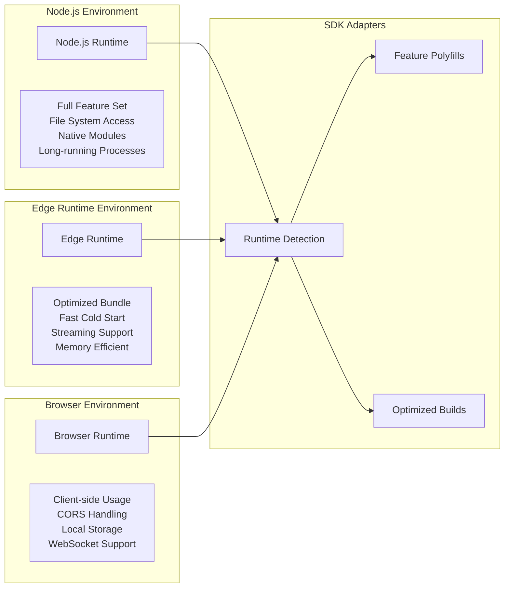
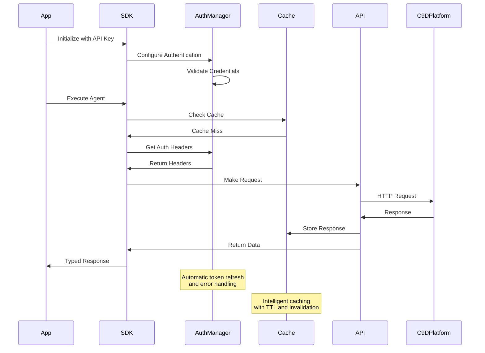

# Design Document

## Overview

The C9D SDK Client is a comprehensive JavaScript/TypeScript SDK designed to provide seamless integration with the C9d.ai platform across both Node.js and Edge runtime environments. The SDK emphasizes developer experience, type safety, and performance while abstracting the complexity of the underlying APIs. Built with modern JavaScript features and optimized for tree-shaking and minimal bundle size, the SDK supports the full spectrum of C9d.ai capabilities including agent management, execution monitoring, authentication, and real-time streaming.

The architecture follows a modular design pattern with pluggable components, allowing developers to use only the features they need while maintaining full functionality when required.

## Architecture

### High-Level SDK Architecture

```mermaid
graph TB
    subgraph "SDK Core"
        Client[C9D Client]
        Auth[Authentication Manager]
        Config[Configuration Manager]
        Cache[Cache Manager]
        Logger[Logger]
    end
    
    subgraph "API Modules"
        AgentAPI[Agent API]
        ExecutionAPI[Execution API]
        TokenAPI[Token API]
        SubscriptionAPI[Subscription API]
        AnalyticsAPI[Analytics API]
    end
    
    subgraph "Runtime Support"
        NodeAdapter[Node.js Adapter]
        EdgeAdapter[Edge Runtime Adapter]
        WebAdapter[Web Browser Adapter]
    end
    
    subgraph "Utilities"
        TypeDefinitions[TypeScript Definitions]
        ErrorHandling[Error Handling]
        Streaming[Streaming Support]
        Testing[Testing Utilities]
    end
    
    subgraph "Extensions"
        Plugins[Plugin System]
        Middleware[Middleware]
        Interceptors[Interceptors]
        Frameworks[Framework Integrations]
    end
    
    Client --> Auth
    Client --> Config
    Client --> Cache
    Client --> Logger
    
    Client --> AgentAPI
    Client --> ExecutionAPI
    Client --> TokenAPI
    Client --> SubscriptionAPI
    Client --> AnalyticsAPI
    
    AgentAPI --> NodeAdapter
    AgentAPI --> EdgeAdapter
    AgentAPI --> WebAdapter
    
    Client --> TypeDefinitions
    Client --> ErrorHandling
    Client --> Streaming
    Client --> Testing
    
    Client --> Plugins
    Client --> Middleware
    Client --> Interceptors
    Client --> Frameworks
```



### Runtime Environment Support



### Authentication and Request Flow



## Components and Interfaces

### Core SDK Client

```typescript
interface C9DClient {
  // Core configuration
  config: ClientConfig
  auth: AuthenticationManager
  
  // API modules
  agents: AgentAPI
  executions: ExecutionAPI
  tokens: TokenAPI
  subscriptions: SubscriptionAPI
  analytics: AnalyticsAPI
  
  // Utility methods
  health(): Promise<HealthStatus>
  version(): string
  destroy(): Promise<void>
}

interface ClientConfig {
  apiKey?: string
  baseURL?: string
  timeout?: number
  retries?: number
  cache?: CacheConfig
  logging?: LoggingConfig
  environment?: 'production' | 'staging' | 'development'
}

class C9D {
  constructor(config: ClientConfig)
  
  // Factory methods for different environments
  static forNode(config: NodeConfig): C9DClient
  static forEdge(config: EdgeConfig): C9DClient
  static forBrowser(config: BrowserConfig): C9DClient
}
```

### Agent API Module

```typescript
interface AgentAPI {
  // CRUD operations
  create(config: AgentConfig): Promise<Agent>
  get(id: string): Promise<Agent>
  update(id: string, updates: Partial<AgentConfig>): Promise<Agent>
  delete(id: string): Promise<void>
  list(options?: ListOptions): Promise<PaginatedResponse<Agent>>
  
  // Execution methods
  execute(id: string, input: any, options?: ExecutionOptions): Promise<ExecutionResult>
  executeStream(id: string, input: any, options?: ExecutionOptions): AsyncIterable<ExecutionUpdate>
  
  // Management methods
  duplicate(id: string, name: string): Promise<Agent>
  export(id: string): Promise<AgentExport>
  import(data: AgentExport): Promise<Agent>
  
  // Validation and testing
  validate(config: AgentConfig): Promise<ValidationResult>
  test(id: string, testCases: TestCase[]): Promise<TestResults>
}

interface ExecutionAPI {
  // Execution management
  get(id: string): Promise<Execution>
  list(options?: ExecutionListOptions): Promise<PaginatedResponse<Execution>>
  cancel(id: string): Promise<void>
  
  // Real-time monitoring
  stream(id: string): AsyncIterable<ExecutionUpdate>
  logs(id: string): AsyncIterable<LogEntry>
  
  // Execution analysis
  analyze(id: string): Promise<ExecutionAnalysis>
  compare(ids: string[]): Promise<ExecutionComparison>
}
```

### Authentication and Security

```typescript
interface AuthenticationManager {
  // Authentication methods
  setApiKey(key: string): void
  setOAuthToken(token: OAuthToken): void
  setServiceAccount(credentials: ServiceAccountCredentials): void
  
  // Token management
  refreshToken(): Promise<void>
  getAuthHeaders(): Promise<Record<string, string>>
  isAuthenticated(): boolean
  
  // Organization context
  setOrganization(orgId: string): void
  getOrganization(): string | null
  
  // Events
  on(event: 'token-refresh' | 'auth-error', handler: Function): void
}

interface TokenAPI {
  // Token management
  create(config: TokenConfig): Promise<ApiToken>
  list(options?: TokenListOptions): Promise<PaginatedResponse<ApiToken>>
  revoke(id: string): Promise<void>
  rotate(id: string): Promise<ApiToken>
  
  // Usage and analytics
  usage(id: string, period?: TimePeriod): Promise<TokenUsage>
  analytics(id: string): Promise<TokenAnalytics>
}
```

### Streaming and Real-time Support

```typescript
interface StreamingSupport {
  // Execution streaming
  streamExecution(executionId: string): AsyncIterable<ExecutionUpdate>
  streamLogs(executionId: string): AsyncIterable<LogEntry>
  
  // WebSocket connections
  connect(endpoint: string, options?: WebSocketOptions): Promise<WebSocketConnection>
  
  // Server-Sent Events
  subscribe(channel: string, handler: EventHandler): Subscription
  
  // Stream utilities
  buffer<T>(stream: AsyncIterable<T>, size: number): AsyncIterable<T[]>
  filter<T>(stream: AsyncIterable<T>, predicate: (item: T) => boolean): AsyncIterable<T>
  map<T, U>(stream: AsyncIterable<T>, transform: (item: T) => U): AsyncIterable<U>
}

interface WebSocketConnection {
  send(data: any): Promise<void>
  close(): Promise<void>
  on(event: 'message' | 'error' | 'close', handler: Function): void
  readyState: 'connecting' | 'open' | 'closing' | 'closed'
}
```

### Caching and Performance

```typescript
interface CacheManager {
  // Cache operations
  get<T>(key: string): Promise<T | null>
  set<T>(key: string, value: T, ttl?: number): Promise<void>
  delete(key: string): Promise<void>
  clear(): Promise<void>
  
  // Cache strategies
  setStrategy(strategy: CacheStrategy): void
  invalidatePattern(pattern: string): Promise<void>
  
  // Performance monitoring
  stats(): CacheStats
  hit(key: string): void
  miss(key: string): void
}

interface CacheStrategy {
  shouldCache(request: Request): boolean
  getTTL(request: Request, response: Response): number
  getKey(request: Request): string
  shouldInvalidate(request: Request): boolean
}

interface PerformanceOptimizer {
  // Request optimization
  batchRequests<T>(requests: Request[]): Promise<T[]>
  parallelExecute<T>(operations: (() => Promise<T>)[]): Promise<T[]>
  
  // Bundle optimization
  lazy<T>(loader: () => Promise<T>): LazyModule<T>
  preload(modules: string[]): Promise<void>
  
  // Memory management
  cleanup(): void
  memoryUsage(): MemoryStats
}
```

## Data Models and Types

### Core Types

```typescript
interface Agent {
  id: string
  name: string
  description?: string
  config: AgentConfig
  status: AgentStatus
  version: string
  createdAt: Date
  updatedAt: Date
  metadata: Record<string, any>
}

interface AgentConfig {
  persona?: string
  inputSchema?: JSONSchema
  outputSchema?: JSONSchema
  triggerMode: 'manual' | 'event' | 'scheduled'
  executionConfig: ExecutionConfig
  dependencies?: string[]
}

interface Execution {
  id: string
  agentId: string
  status: ExecutionStatus
  input: any
  output?: any
  startedAt: Date
  completedAt?: Date
  duration?: number
  error?: ExecutionError
  metrics: ExecutionMetrics
}

interface ExecutionUpdate {
  executionId: string
  status: ExecutionStatus
  progress?: number
  message?: string
  data?: any
  timestamp: Date
}
```

### Response Types

```typescript
interface PaginatedResponse<T> {
  data: T[]
  pagination: {
    page: number
    limit: number
    total: number
    hasNext: boolean
    hasPrev: boolean
  }
}

interface ApiResponse<T> {
  data: T
  success: boolean
  message?: string
  requestId: string
  timestamp: Date
}

interface ErrorResponse {
  error: {
    code: string
    message: string
    details?: any
    requestId: string
    timestamp: Date
  }
}
```

### Configuration Types

```typescript
interface NodeConfig extends ClientConfig {
  // Node.js specific options
  httpAgent?: any
  httpsAgent?: any
  filesystem?: boolean
}

interface EdgeConfig extends ClientConfig {
  // Edge runtime specific options
  maxMemory?: number
  timeout?: number
  streaming?: boolean
}

interface BrowserConfig extends ClientConfig {
  // Browser specific options
  cors?: boolean
  credentials?: 'include' | 'same-origin' | 'omit'
  localStorage?: boolean
}
```

## Error Handling and Resilience

### Error Types and Handling

```typescript
class C9DError extends Error {
  code: string
  statusCode?: number
  requestId?: string
  details?: any
  
  constructor(message: string, code: string, statusCode?: number)
}

class AuthenticationError extends C9DError {}
class ValidationError extends C9DError {}
class RateLimitError extends C9DError {}
class NetworkError extends C9DError {}
class ExecutionError extends C9DError {}

interface ErrorHandler {
  handle(error: Error): Promise<any>
  shouldRetry(error: Error): boolean
  getRetryDelay(attempt: number): number
}

interface RetryConfig {
  maxAttempts: number
  baseDelay: number
  maxDelay: number
  backoffFactor: number
  retryableErrors: string[]
}
```

### Circuit Breaker and Resilience

```typescript
interface CircuitBreaker {
  execute<T>(operation: () => Promise<T>): Promise<T>
  getState(): 'closed' | 'open' | 'half-open'
  reset(): void
  
  // Configuration
  failureThreshold: number
  recoveryTimeout: number
  monitoringPeriod: number
}

interface HealthChecker {
  check(): Promise<HealthStatus>
  isHealthy(): boolean
  getMetrics(): HealthMetrics
}

interface HealthStatus {
  status: 'healthy' | 'degraded' | 'unhealthy'
  checks: HealthCheck[]
  timestamp: Date
}
```

## Plugin and Extension System

### Plugin Architecture

```typescript
interface Plugin {
  name: string
  version: string
  install(client: C9DClient): void
  uninstall(client: C9DClient): void
}

interface PluginManager {
  register(plugin: Plugin): void
  unregister(name: string): void
  list(): Plugin[]
  get(name: string): Plugin | null
}

interface Middleware {
  name: string
  request?(config: RequestConfig): Promise<RequestConfig>
  response?(response: Response): Promise<Response>
  error?(error: Error): Promise<Error>
}

interface Interceptor {
  request: RequestInterceptor[]
  response: ResponseInterceptor[]
  error: ErrorInterceptor[]
}
```

### Framework Integrations

```typescript
// Next.js Integration
interface NextJSIntegration {
  withC9D(config: C9DConfig): (handler: NextApiHandler) => NextApiHandler
  useC9D(): C9DClient
  C9DProvider: React.ComponentType<{ children: React.ReactNode }>
}

// Express Integration
interface ExpressIntegration {
  c9dMiddleware(config: C9DConfig): express.RequestHandler
  attachC9D(app: express.Application, config: C9DConfig): void
}

// Fastify Integration
interface FastifyIntegration {
  register(fastify: FastifyInstance, options: C9DConfig): Promise<void>
}
```

## Testing and Development

### Testing Utilities

```typescript
interface MockClient extends C9DClient {
  // Mock configuration
  mockAgent(id: string, response: Agent): void
  mockExecution(id: string, response: Execution): void
  mockError(method: string, error: Error): void
  
  // Assertion helpers
  expectCalled(method: string, times?: number): void
  expectCalledWith(method: string, args: any[]): void
  
  // Reset and cleanup
  reset(): void
  restore(): void
}

interface TestUtilities {
  createMockClient(config?: Partial<ClientConfig>): MockClient
  createTestAgent(overrides?: Partial<AgentConfig>): Agent
  createTestExecution(overrides?: Partial<Execution>): Execution
  
  // Contract testing
  validateResponse<T>(response: T, schema: JSONSchema): boolean
  validateRequest(request: Request, schema: JSONSchema): boolean
}

interface ScenarioBuilder {
  agent(config: AgentConfig): ScenarioBuilder
  execution(result: ExecutionResult): ScenarioBuilder
  error(error: Error): ScenarioBuilder
  delay(ms: number): ScenarioBuilder
  build(): TestScenario
}
```

## Performance and Optimization

### Bundle Optimization

```typescript
interface BundleConfig {
  // Tree shaking support
  sideEffects: false
  
  // Module formats
  formats: ['esm', 'cjs', 'umd']
  
  // Environment-specific builds
  targets: {
    node: string
    edge: string
    browser: string
  }
  
  // Size optimization
  minify: boolean
  compress: boolean
  treeshake: boolean
}

interface PerformanceMetrics {
  bundleSize: {
    total: number
    gzipped: number
    modules: Record<string, number>
  }
  
  runtime: {
    initTime: number
    memoryUsage: number
    cpuUsage: number
  }
  
  network: {
    requestCount: number
    totalBytes: number
    averageLatency: number
  }
}
```

## Testing Strategy

### Unit Testing
- **Core Functionality**: Test all SDK methods and utilities with comprehensive coverage
- **Type Safety**: Validate TypeScript definitions and type inference
- **Error Handling**: Test error scenarios and recovery mechanisms
- **Caching**: Test cache strategies and invalidation logic

### Integration Testing
- **API Integration**: Test real API calls with proper authentication and error handling
- **Runtime Compatibility**: Test functionality across Node.js, Edge, and browser environments
- **Streaming**: Test real-time streaming and WebSocket connections
- **Plugin System**: Test plugin loading, configuration, and interaction

### Performance Testing
- **Bundle Size**: Monitor and optimize bundle size for different environments
- **Memory Usage**: Test memory efficiency and garbage collection
- **Network Performance**: Test request batching and caching effectiveness
- **Cold Start**: Test Edge runtime cold start performance

### Compatibility Testing
- **Runtime Versions**: Test across different Node.js and browser versions
- **Framework Integration**: Test integrations with popular frameworks
- **Environment Variables**: Test configuration in different deployment environments
- **Network Conditions**: Test behavior under various network conditions

### End-to-End Testing
- **Developer Workflows**: Test complete developer integration scenarios
- **Documentation Examples**: Validate all code examples in documentation
- **Migration Paths**: Test upgrade scenarios and backward compatibility
- **Error Recovery**: Test error handling and recovery in real-world scenarios