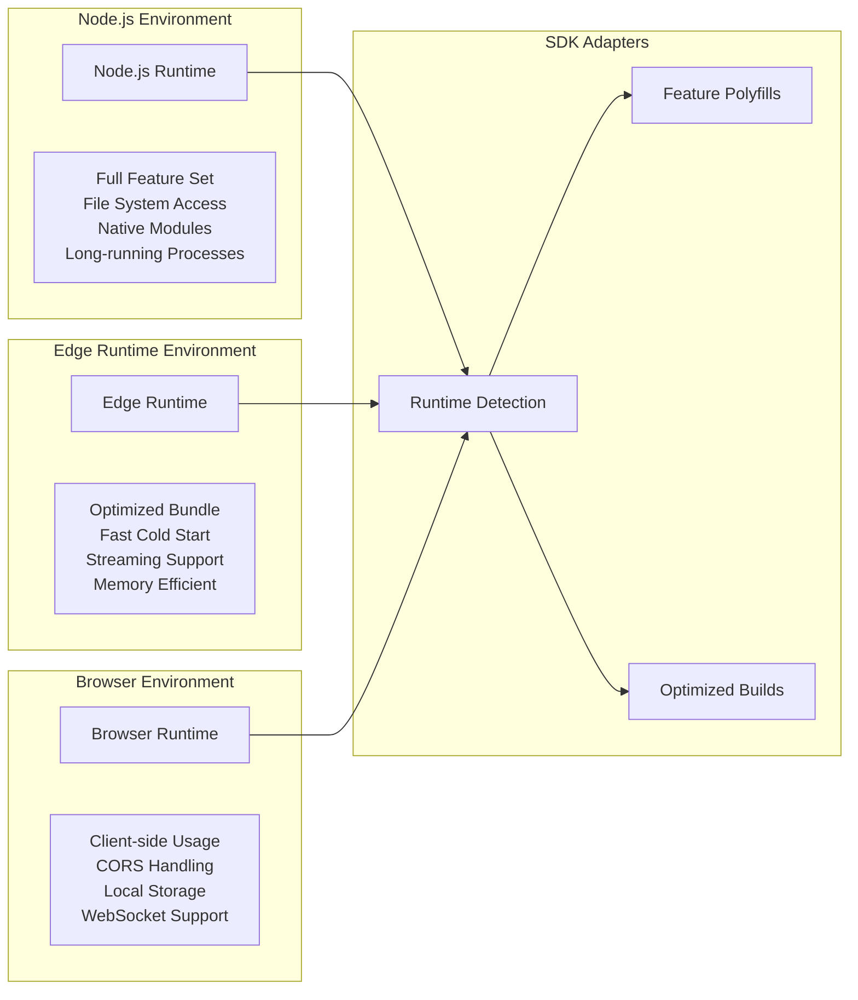
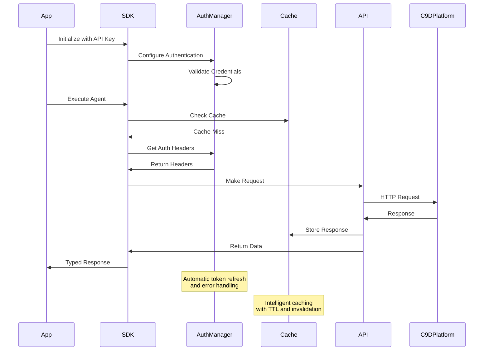

# Design Document

## Overview

The C9D SDK Client is a comprehensive JavaScript/TypeScript SDK designed to provide seamless integration with the C9d.ai platform across both Node.js and Edge runtime environments. The SDK emphasizes developer experience, type safety, and performance while abstracting the complexity of the underlying APIs. Built with modern JavaScript features and optimized for tree-shaking and minimal bundle size, the SDK supports the full spectrum of C9d.ai capabilities including agent management, execution monitoring, authentication, and real-time streaming.

The architecture follows a modular design pattern with pluggable components, allowing developers to use only the features they need while maintaining full functionality when required.

## Architecture

### High-Level SDK Architecture


```mermaid
graph TB
    subgraph "SDK Core"
        Client[C9D Client]
        Auth[Authentication Manager]
        Config[Configuration Manager]
        Cache[Cache Manager]
        Logger[Logger]
    end
    
    subgraph "API Modules"
        AgentAPI[Agent API]
        ExecutionAPI[Execution API]
        TokenAPI[Token API]
        SubscriptionAPI[Subscription API]
        AnalyticsAPI[Analytics API]
    end
    
    subgraph "Runtime Support"
        NodeAdapter[Node.js Adapter]
        EdgeAdapter[Edge Runtime Adapter]
        WebAdapter[Web Browser Adapter]
    end
    
    subgraph "Utilities"
        TypeDefinitions[TypeScript Definitions]
        ErrorHandling[Error Handling]
        Streaming[Streaming Support]
        Testing[Testing Utilities]
    end
    
    subgraph "Extensions"
        Plugins[Plugin System]
        Middleware[Middleware]
        Interceptors[Interceptors]
        Frameworks[Framework Integrations]
    end
    
    Client --> Auth
    Client --> Config
    Client --> Cache
    Client --> Logger
    
    Client --> AgentAPI
    Client --> ExecutionAPI
    Client --> TokenAPI
    Client --> SubscriptionAPI
    Client --> AnalyticsAPI
    
    AgentAPI --> NodeAdapter
    AgentAPI --> EdgeAdapter
    AgentAPI --> WebAdapter
    
    Client --> TypeDefinitions
    Client --> ErrorHandling
    Client --> Streaming
    Client --> Testing
    
    Client --> Plugins
    Client --> Middleware
    Client --> Interceptors
    Client --> Frameworks
```

### Runtime Environment Support


```mermaid
graph LR
    subgraph "Node.js Environment"
        NodeRuntime[Node.js Runtime]
        NodeFeatures[Full Feature Set<br/>File System Access<br/>Native Modules<br/>Long-running Processes]
    end
    
    subgraph "Edge Runtime Environment"
        EdgeRuntime[Edge Runtime]
        EdgeFeatures[Optimized Bundle<br/>Fast Cold Start<br/>Streaming Support<br/>Memory Efficient]
    end
    
    subgraph "Browser Environment"
        BrowserRuntime[Browser Runtime]
        BrowserFeatures[Client-side Usage<br/>CORS Handling<br/>Local Storage<br/>WebSocket Support]
    end
    
    subgraph "SDK Adapters"
        RuntimeDetection[Runtime Detection]
        FeaturePolyfills[Feature Polyfills]
        OptimizedBuilds[Optimized Builds]
    end
    
    NodeRuntime --> RuntimeDetection
    EdgeRuntime --> RuntimeDetection
    BrowserRuntime --> RuntimeDetection
    
    RuntimeDetection --> FeaturePolyfills
    RuntimeDetection --> OptimizedBuilds
```

### Authentication and Request Flow


```mermaid
sequenceDiagram
    participant App
    participant SDK
    participant AuthManager
    participant Cache
    participant API
    participant C9DPlatform
    
    App->>SDK: Initialize with API Key
    SDK->>AuthManager: Configure Authentication
    AuthManager->>AuthManager: Validate Credentials
    
    App->>SDK: Execute Agent
    SDK->>Cache: Check Cache
    Cache->>SDK: Cache Miss
    SDK->>AuthManager: Get Auth Headers
    AuthManager->>SDK: Return Headers
    SDK->>API: Make Request
    API->>C9DPlatform: HTTP Request
    C9DPlatform->>API: Response
    API->>Cache: Store Response
    API->>SDK: Return Data
    SDK->>App: Typed Response
    
    Note over AuthManager: Automatic token refresh<br/>and error handling
    Note over Cache: Intelligent caching<br/>with TTL and invalidation
```

## Components and Interfaces

### Core SDK Client

```typescript
interface C9DClient {
  // Core configuration
  config: ClientConfig
  auth: AuthenticationManager
  
  // API modules
  agents: AgentAPI
  executions: ExecutionAPI
  tokens: TokenAPI
  subscriptions: SubscriptionAPI
  analytics: AnalyticsAPI
  
  // Utility methods
  health(): Promise<HealthStatus>
  version(): string
  destroy(): Promise<void>
}

interface ClientConfig {
  apiKey?: string
  baseURL?: string
  timeout?: number
  retries?: number
  cache?: CacheConfig
  logging?: LoggingConfig
  environment?: 'production' | 'staging' | 'development'
}

class C9D {
  constructor(config: ClientConfig)
  
  // Factory methods for different environments
  static forNode(config: NodeConfig): C9DClient
  static forEdge(config: EdgeConfig): C9DClient
  static forBrowser(config: BrowserConfig): C9DClient
}
```

### Agent API Module

```typescript
interface AgentAPI {
  // CRUD operations
  create(config: AgentConfig): Promise<Agent>
  get(id: string): Promise<Agent>
  update(id: string, updates: Partial<AgentConfig>): Promise<Agent>
  delete(id: string): Promise<void>
  list(options?: ListOptions): Promise<PaginatedResponse<Agent>>
  
  // Execution methods
  execute(id: string, input: any, options?: ExecutionOptions): Promise<ExecutionResult>
  executeStream(id: string, input: any, options?: ExecutionOptions): AsyncIterable<ExecutionUpdate>
  
  // Management methods
  duplicate(id: string, name: string): Promise<Agent>
  export(id: string): Promise<AgentExport>
  import(data: AgentExport): Promise<Agent>
  
  // Validation and testing
  validate(config: AgentConfig): Promise<ValidationResult>
  test(id: string, testCases: TestCase[]): Promise<TestResults>
}

interface ExecutionAPI {
  // Execution management
  get(id: string): Promise<Execution>
  list(options?: ExecutionListOptions): Promise<PaginatedResponse<Execution>>
  cancel(id: string): Promise<void>
  
  // Real-time monitoring
  stream(id: string): AsyncIterable<ExecutionUpdate>
  logs(id: string): AsyncIterable<LogEntry>
  
  // Execution analysis
  analyze(id: string): Promise<ExecutionAnalysis>
  compare(ids: string[]): Promise<ExecutionComparison>
}
```

### Authentication and Security

```typescript
interface AuthenticationManager {
  // Authentication methods
  setApiKey(key: string): void
  setOAuthToken(token: OAuthToken): void
  setServiceAccount(credentials: ServiceAccountCredentials): void
  
  // Token management
  refreshToken(): Promise<void>
  getAuthHeaders(): Promise<Record<string, string>>
  isAuthenticated(): boolean
  
  // Organization context
  setOrganization(orgId: string): void
  getOrganization(): string | null
  
  // Events
  on(event: 'token-refresh' | 'auth-error', handler: Function): void
}

interface TokenAPI {
  // Token management
  create(config: TokenConfig): Promise<ApiToken>
  list(options?: TokenListOptions): Promise<PaginatedResponse<ApiToken>>
  revoke(id: string): Promise<void>
  rotate(id: string): Promise<ApiToken>
  
  // Usage and analytics
  usage(id: string, period?: TimePeriod): Promise<TokenUsage>
  analytics(id: string): Promise<TokenAnalytics>
}
```

### Streaming and Real-time Support

```typescript
interface StreamingSupport {
  // Execution streaming
  streamExecution(executionId: string): AsyncIterable<ExecutionUpdate>
  streamLogs(executionId: string): AsyncIterable<LogEntry>
  
  // WebSocket connections
  connect(endpoint: string, options?: WebSocketOptions): Promise<WebSocketConnection>
  
  // Server-Sent Events
  subscribe(channel: string, handler: EventHandler): Subscription
  
  // Stream utilities
  buffer<T>(stream: AsyncIterable<T>, size: number): AsyncIterable<T[]>
  filter<T>(stream: AsyncIterable<T>, predicate: (item: T) => boolean): AsyncIterable<T>
  map<T, U>(stream: AsyncIterable<T>, transform: (item: T) => U): AsyncIterable<U>
}

interface WebSocketConnection {
  send(data: any): Promise<void>
  close(): Promise<void>
  on(event: 'message' | 'error' | 'close', handler: Function): void
  readyState: 'connecting' | 'open' | 'closing' | 'closed'
}

interface StreamingFallbackStrategy {
  // Automatic fallback to polling
  enablePollingFallback(interval: number): void
  
  // Reconnection strategy
  reconnect(maxAttempts: number, backoff: BackoffConfig): Promise<void>
  
  // Connection health monitoring
  monitorConnection(healthCheck: () => Promise<boolean>): void
  
  // Graceful degradation
  degradeToPolling(): Promise<void>
}

interface ConnectionRecovery {
  // Automatic reconnection
  autoReconnect: boolean
  maxReconnectAttempts: number
  reconnectDelay: number
  
  // State preservation
  preserveState: boolean
  stateRecovery: () => Promise<void>
  
  // Event replay
  replayMissedEvents: boolean
  eventBuffer: number
}
```

### Caching and Performance

```typescript
interface CacheManager {
  // Cache operations
  get<T>(key: string): Promise<T | null>
  set<T>(key: string, value: T, ttl?: number): Promise<void>
  delete(key: string): Promise<void>
  clear(): Promise<void>
  
  // Cache strategies
  setStrategy(strategy: CacheStrategy): void
  invalidatePattern(pattern: string): Promise<void>
  
  // Performance monitoring
  stats(): CacheStats
  hit(key: string): void
  miss(key: string): void
}

interface CacheStrategy {
  shouldCache(request: Request): boolean
  getTTL(request: Request, response: Response): number
  getKey(request: Request): string
  shouldInvalidate(request: Request): boolean
}

interface PerformanceOptimizer {
  // Request optimization
  batchRequests<T>(requests: Request[]): Promise<T[]>
  parallelExecute<T>(operations: (() => Promise<T>)[]): Promise<T[]>
  
  // Bundle optimization
  lazy<T>(loader: () => Promise<T>): LazyModule<T>
  preload(modules: string[]): Promise<void>
  
  // Memory management
  cleanup(): void
  memoryUsage(): MemoryStats
}
```

## Data Models and Types

### Core Types

```typescript
interface Agent {
  id: string
  name: string
  description?: string
  config: AgentConfig
  status: AgentStatus
  version: string
  createdAt: Date
  updatedAt: Date
  metadata: Record<string, any>
}

interface AgentConfig {
  persona?: string
  inputSchema?: JSONSchema
  outputSchema?: JSONSchema
  triggerMode: 'manual' | 'event' | 'scheduled'
  executionConfig: ExecutionConfig
  dependencies?: string[]
}

interface Execution {
  id: string
  agentId: string
  status: ExecutionStatus
  input: any
  output?: any
  startedAt: Date
  completedAt?: Date
  duration?: number
  error?: ExecutionError
  metrics: ExecutionMetrics
}

interface ExecutionUpdate {
  executionId: string
  status: ExecutionStatus
  progress?: number
  message?: string
  data?: any
  timestamp: Date
}
```

### Response Types

```typescript
interface PaginatedResponse<T> {
  data: T[]
  pagination: {
    page: number
    limit: number
    total: number
    hasNext: boolean
    hasPrev: boolean
  }
}

interface ApiResponse<T> {
  data: T
  success: boolean
  message?: string
  requestId: string
  timestamp: Date
}

interface ErrorResponse {
  error: {
    code: string
    message: string
    details?: any
    requestId: string
    timestamp: Date
  }
}
```

### Configuration Types

```typescript
interface NodeConfig extends ClientConfig {
  // Node.js specific options
  httpAgent?: any
  httpsAgent?: any
  filesystem?: boolean
}

interface EdgeConfig extends ClientConfig {
  // Edge runtime specific options
  maxMemory?: number
  timeout?: number
  streaming?: boolean
}

interface BrowserConfig extends ClientConfig {
  // Browser specific options
  cors?: boolean
  credentials?: 'include' | 'same-origin' | 'omit'
  localStorage?: boolean
}
```

## Error Handling and Resilience

### Error Types and Handling

```typescript
class C9DError extends Error {
  code: string
  statusCode?: number
  requestId?: string
  details?: any
  
  constructor(message: string, code: string, statusCode?: number)
}

class AuthenticationError extends C9DError {}
class ValidationError extends C9DError {}
class RateLimitError extends C9DError {}
class NetworkError extends C9DError {}
class ExecutionError extends C9DError {}

interface ErrorHandler {
  handle(error: Error): Promise<any>
  shouldRetry(error: Error): boolean
  getRetryDelay(attempt: number): number
}

interface RetryConfig {
  maxAttempts: number
  baseDelay: number
  maxDelay: number
  backoffFactor: number
  retryableErrors: string[]
}
```

### Circuit Breaker and Resilience

```typescript
interface CircuitBreaker {
  execute<T>(operation: () => Promise<T>): Promise<T>
  getState(): 'closed' | 'open' | 'half-open'
  reset(): void
  
  // Configuration
  failureThreshold: number
  recoveryTimeout: number
  monitoringPeriod: number
}

interface HealthChecker {
  check(): Promise<HealthStatus>
  isHealthy(): boolean
  getMetrics(): HealthMetrics
}

interface HealthStatus {
  status: 'healthy' | 'degraded' | 'unhealthy'
  checks: HealthCheck[]
  timestamp: Date
}

interface DiagnosticTools {
  // Request tracing
  traceRequest(requestId: string): Promise<RequestTrace>
  
  // Performance profiling
  profileOperation<T>(operation: () => Promise<T>): Promise<OperationProfile<T>>
  
  // Network diagnostics
  testConnectivity(): Promise<ConnectivityReport>
  
  // Configuration validation
  validateConfig(config: ClientConfig): ValidationResult
}

interface FallbackStrategy {
  // Graceful degradation
  onServiceUnavailable<T>(operation: string, fallback: () => T): T
  
  // Cached response fallback
  useCachedResponse<T>(key: string): Promise<T | null>
  
  // Default value fallback
  useDefault<T>(defaultValue: T): T
}
```

## Plugin and Extension System

### Plugin Architecture

```typescript
interface Plugin {
  name: string
  version: string
  install(client: C9DClient): void
  uninstall(client: C9DClient): void
}

interface PluginManager {
  register(plugin: Plugin): void
  unregister(name: string): void
  list(): Plugin[]
  get(name: string): Plugin | null
}

interface Middleware {
  name: string
  request?(config: RequestConfig): Promise<RequestConfig>
  response?(response: Response): Promise<Response>
  error?(error: Error): Promise<Error>
}

interface Interceptor {
  request: RequestInterceptor[]
  response: ResponseInterceptor[]
  error: ErrorInterceptor[]
}
```

### Framework Integrations

```typescript
// Next.js Integration
interface NextJSIntegration {
  withC9D(config: C9DConfig): (handler: NextApiHandler) => NextApiHandler
  useC9D(): C9DClient
  C9DProvider: React.ComponentType<{ children: React.ReactNode }>
}

// Express Integration
interface ExpressIntegration {
  c9dMiddleware(config: C9DConfig): express.RequestHandler
  attachC9D(app: express.Application, config: C9DConfig): void
}

// Fastify Integration
interface FastifyIntegration {
  register(fastify: FastifyInstance, options: C9DConfig): Promise<void>
}
```

## Documentation and Developer Experience

### Documentation Architecture

```typescript
interface DocumentationSystem {
  // Interactive examples
  playground: InteractivePlayground
  
  // API reference
  apiReference: APIReference
  
  // Tutorials and guides
  guides: GuidesLibrary
  
  // Migration tools
  migrationAssistant: MigrationAssistant
}

interface InteractivePlayground {
  // Live code execution
  runExample(code: string): Promise<ExecutionResult>
  
  // Code snippets library
  getSnippets(category: string): CodeSnippet[]
  
  // API explorer
  exploreAPI(endpoint: string): APIExplorerView
}

interface MigrationAssistant {
  // Version compatibility check
  checkCompatibility(fromVersion: string, toVersion: string): CompatibilityReport
  
  // Automated code transformation
  transformCode(code: string, targetVersion: string): TransformResult
  
  // Breaking changes detection
  detectBreakingChanges(fromVersion: string, toVersion: string): BreakingChange[]
  
  // Migration guide generation
  generateMigrationGuide(fromVersion: string, toVersion: string): MigrationGuide
}
```

## Testing and Development

### Testing Utilities

```typescript
interface MockClient extends C9DClient {
  // Mock configuration
  mockAgent(id: string, response: Agent): void
  mockExecution(id: string, response: Execution): void
  mockError(method: string, error: Error): void
  
  // Assertion helpers
  expectCalled(method: string, times?: number): void
  expectCalledWith(method: string, args: any[]): void
  
  // Reset and cleanup
  reset(): void
  restore(): void
}

interface TestUtilities {
  createMockClient(config?: Partial<ClientConfig>): MockClient
  createTestAgent(overrides?: Partial<AgentConfig>): Agent
  createTestExecution(overrides?: Partial<Execution>): Execution
  
  // Contract testing
  validateResponse<T>(response: T, schema: JSONSchema): boolean
  validateRequest(request: Request, schema: JSONSchema): boolean
}

interface ScenarioBuilder {
  agent(config: AgentConfig): ScenarioBuilder
  execution(result: ExecutionResult): ScenarioBuilder
  error(error: Error): ScenarioBuilder
  delay(ms: number): ScenarioBuilder
  build(): TestScenario
}
```

## Versioning and Backward Compatibility

### Semantic Versioning Strategy

The SDK follows strict semantic versioning (semver) principles:

- **Major versions (X.0.0)**: Breaking changes that require code modifications
- **Minor versions (0.X.0)**: New features that are backward compatible
- **Patch versions (0.0.X)**: Bug fixes and performance improvements

### Backward Compatibility Guarantees

```typescript
interface CompatibilityLayer {
  // Deprecated API support
  supportDeprecatedAPI(version: string): boolean
  
  // API transformation
  transformLegacyRequest<T>(request: LegacyRequest): ModernRequest<T>
  
  // Deprecation warnings
  warnDeprecation(feature: string, alternative: string): void
  
  // Feature flags
  enableLegacyBehavior(feature: string): void
}

interface DeprecationPolicy {
  // Deprecation timeline
  deprecationPeriod: number // versions
  
  // Warning levels
  warningLevel: 'info' | 'warning' | 'error'
  
  // Migration path
  migrationGuide: string
  
  // Removal version
  removalVersion: string
}
```

### Breaking Change Management

When breaking changes are necessary:

1. **Deprecation Notice**: Feature marked as deprecated with clear warnings
2. **Migration Guide**: Detailed guide provided for transitioning to new API
3. **Compatibility Layer**: Temporary support for old API during transition period
4. **Automated Migration**: Tools provided to automatically update code where possible
5. **Version Bump**: Major version increment with comprehensive changelog

## Performance and Optimization

### Bundle Optimization

```typescript
interface BundleConfig {
  // Tree shaking support
  sideEffects: false
  
  // Module formats
  formats: ['esm', 'cjs', 'umd']
  
  // Environment-specific builds
  targets: {
    node: string
    edge: string
    browser: string
  }
  
  // Size optimization
  minify: boolean
  compress: boolean
  treeshake: boolean
}

interface PerformanceMetrics {
  bundleSize: {
    total: number
    gzipped: number
    modules: Record<string, number>
  }
  
  runtime: {
    initTime: number
    memoryUsage: number
    cpuUsage: number
  }
  
  network: {
    requestCount: number
    totalBytes: number
    averageLatency: number
  }
}
```

## Correctness Properties

*A property is a characteristic or behavior that should hold true across all valid executions of a system—essentially, a formal statement about what the system should do. Properties serve as the bridge between human-readable specifications and machine-verifiable correctness guarantees.*

### Property 1: Type Safety Preservation
*For any* SDK method call with valid TypeScript types, the return type should match the declared type signature and provide accurate IntelliSense support.
**Validates: Requirements 1.1, 1.3**

### Property 2: Authentication Token Lifecycle
*For any* authenticated request, if the token is expired, the system should automatically refresh the token before making the API call, ensuring no requests fail due to expired credentials.
**Validates: Requirements 3.2, 3.3**

### Property 3: Edge Runtime Compatibility
*For any* SDK operation, when executed in an Edge runtime environment, the operation should complete successfully without requiring Node.js-specific APIs or exceeding memory constraints.
**Validates: Requirements 2.1, 2.4**

### Property 4: Agent Execution Idempotency
*For any* agent execution with identical input parameters, executing the same agent multiple times should produce consistent results (or properly handle non-deterministic operations with appropriate flags).
**Validates: Requirements 4.1, 4.2**

### Property 5: Cache Invalidation Consistency
*For any* cached resource, when the underlying data changes, the cache should be invalidated and subsequent requests should return fresh data.
**Validates: Requirements 5.1**

### Property 6: Error Recovery Completeness
*For any* transient error (network timeout, rate limit), the SDK should automatically retry with exponential backoff and eventually either succeed or fail with a clear error message.
**Validates: Requirements 6.2, 6.3**

### Property 7: Stream Backpressure Handling
*For any* streaming operation, when the consumer cannot keep up with the producer, the system should apply backpressure without losing data or crashing.
**Validates: Requirements 7.3**

### Property 8: Plugin Isolation
*For any* two plugins registered in the SDK, one plugin's behavior should not interfere with another plugin's functionality unless explicitly designed to interact.
**Validates: Requirements 8.1, 8.5**

### Property 9: Mock Behavior Fidelity
*For any* SDK method, the mock implementation should accept the same parameters and return the same response structure as the real implementation.
**Validates: Requirements 9.1, 9.2**

### Property 10: Bundle Size Optimization
*For any* subset of SDK features imported, the final bundle should only include the code necessary for those features (tree-shaking effectiveness).
**Validates: Requirements 5.4**

### Property 11: Backward Compatibility
*For any* SDK version upgrade within the same major version, existing code should continue to work without modifications (semantic versioning compliance).
**Validates: Requirements 1.5**

### Property 12: Request Batching Efficiency
*For any* set of parallel requests to the same endpoint, the SDK should batch them into a single request when possible, reducing network overhead.
**Validates: Requirements 5.3**

## Testing Strategy

### Property-Based Testing Framework
The SDK will use **fast-check** as the property-based testing library for JavaScript/TypeScript. Each property-based test will:
- Run a minimum of 100 iterations with randomly generated inputs
- Be tagged with a comment referencing the specific correctness property from the design document
- Use the format: `// Feature: c9d-sdk-client, Property X: [property description]`

### Unit Testing
- **Core Functionality**: Test all SDK methods and utilities with comprehensive coverage
- **Type Safety**: Validate TypeScript definitions and type inference
- **Error Handling**: Test error scenarios and recovery mechanisms using property-based tests for error boundary conditions
- **Caching**: Test cache strategies and invalidation logic with property tests for cache consistency

### Integration Testing
- **API Integration**: Test real API calls with proper authentication and error handling
- **Runtime Compatibility**: Test functionality across Node.js, Edge, and browser environments
- **Streaming**: Test real-time streaming and WebSocket connections with property tests for backpressure
- **Plugin System**: Test plugin loading, configuration, and interaction with property tests for isolation

### Performance Testing
- **Bundle Size**: Monitor and optimize bundle size for different environments with property tests for tree-shaking
- **Memory Usage**: Test memory efficiency and garbage collection
- **Network Performance**: Test request batching and caching effectiveness with property tests
- **Cold Start**: Test Edge runtime cold start performance

### Compatibility Testing
- **Runtime Versions**: Test across different Node.js and browser versions
- **Framework Integration**: Test integrations with popular frameworks
- **Environment Variables**: Test configuration in different deployment environments
- **Network Conditions**: Test behavior under various network conditions

### End-to-End Testing
- **Developer Workflows**: Test complete developer integration scenarios
- **Documentation Examples**: Validate all code examples in documentation
- **Migration Paths**: Test upgrade scenarios and backward compatibility with property tests
- **Error Recovery**: Test error handling and recovery in real-world scenarios