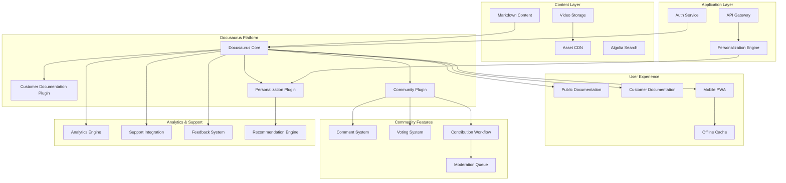
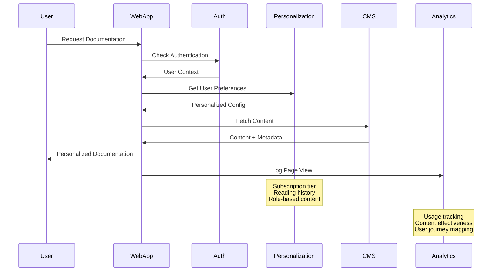
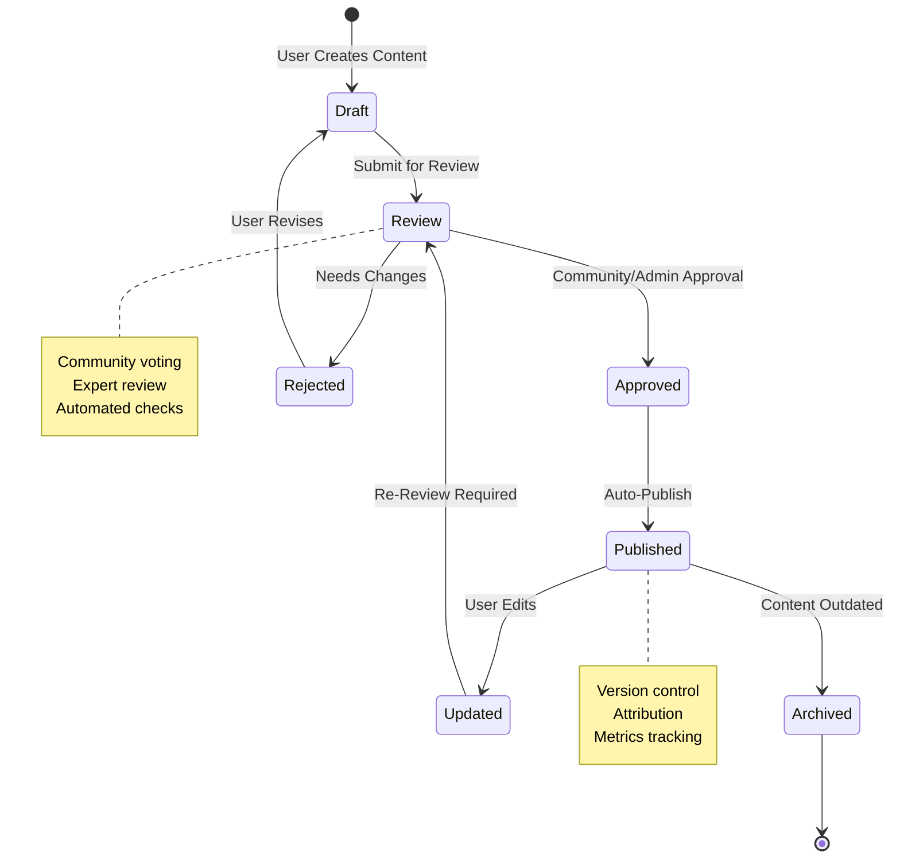

# Design Document

## Overview

The Customer-facing Documentation Platform extends the existing Docusaurus-based Developer Documentation Platform to provide user-centric knowledge base capabilities that prioritize accessibility, discoverability, and community engagement. Built as an integrated facet of the unified documentation system, the platform provides personalized experiences while maintaining public accessibility. The architecture supports multiple content types including written guides, video tutorials, interactive demos, and community-generated content with sophisticated analytics and feedback systems.

The design emphasizes progressive disclosure of information, allowing users to start with basic concepts and gradually access more advanced features based on their subscription tier and learning progress, all within the cohesive Docusaurus ecosystem.

## Architecture

### High-Level Architecture



### Content Delivery Flow



### Community Contribution Flow



## Components and Interfaces

### Core Services

#### ContentService
```typescript
interface ContentService {
  getContent(contentId: string, userContext: UserContext): Promise<Content>
  searchContent(query: string, filters: ContentFilters): Promise<SearchResults>
  getContentByCategory(category: string, userContext: UserContext): Promise<Content[]>
  getPersonalizedContent(userId: string): Promise<PersonalizedContent>
  trackContentUsage(contentId: string, userId: string, interaction: Interaction): Promise<void>
}
```

#### PersonalizationService
```typescript
interface PersonalizationService {
  getPersonalizedRecommendations(userId: string): Promise<ContentRecommendation[]>
  updateUserPreferences(userId: string, preferences: UserPreferences): Promise<void>
  trackLearningProgress(userId: string, contentId: string, progress: Progress): Promise<void>
  generateLearningPath(userId: string, goal: LearningGoal): Promise<LearningPath>
  getContentForSubscriptionTier(tier: SubscriptionTier): Promise<ContentAccess>
}
```

#### CommunityService
```typescript
interface CommunityService {
  submitContribution(userId: string, content: ContributionContent): Promise<Contribution>
  voteOnContent(userId: string, contentId: string, vote: Vote): Promise<VoteResult>
  addComment(userId: string, contentId: string, comment: Comment): Promise<Comment>
  moderateContent(moderatorId: string, contentId: string, action: ModerationAction): Promise<void>
  getContributorStats(userId: string): Promise<ContributorStats>
}
```

#### AnalyticsService
```typescript
interface AnalyticsService {
  trackPageView(contentId: string, userId: string, metadata: ViewMetadata): Promise<void>
  trackSearchQuery(query: string, userId: string, results: SearchResults): Promise<void>
  generateContentReport(contentId: string, period: TimePeriod): Promise<ContentReport>
  getPopularContent(category: string, period: TimePeriod): Promise<PopularContent[]>
  identifyContentGaps(searchQueries: string[]): Promise<ContentGap[]>
}
```

### User Interface Components

#### DocumentationViewer
Main component for displaying documentation content with personalization and interaction features.

```typescript
interface DocumentationViewerProps {
  content: Content
  userContext: UserContext
  onProgressUpdate: (progress: Progress) => void
  onFeedback: (feedback: Feedback) => void
  showSubscriptionPrompts: boolean
}
```

#### InteractiveTutorial
Component for step-by-step tutorials with progress tracking and interactive elements.

```typescript
interface InteractiveTutorialProps {
  tutorial: Tutorial
  currentStep: number
  onStepComplete: (stepId: string) => void
  onTutorialComplete: () => void
  allowSkipping: boolean
}
```

#### CommunityContribution
Interface for users to contribute content with rich editing and preview capabilities.

```typescript
interface CommunityContributionProps {
  contentType: ContentType
  category: string
  onSubmit: (contribution: ContributionContent) => void
  onSaveDraft: (draft: DraftContent) => void
  moderationGuidelines: ModerationGuidelines
}
```

#### PersonalizedDashboard
User dashboard showing personalized content recommendations and learning progress.

```typescript
interface PersonalizedDashboardProps {
  userId: string
  recommendations: ContentRecommendation[]
  learningPaths: LearningPath[]
  bookmarks: BookmarkedContent[]
  recentActivity: UserActivity[]
}
```

## Data Models

### Content Models

```typescript
interface Content {
  id: string
  title: string
  description: string
  body: string
  contentType: 'guide' | 'tutorial' | 'faq' | 'video' | 'interactive'
  category: string
  subcategory?: string
  difficulty: 'beginner' | 'intermediate' | 'advanced'
  estimatedReadTime: number
  subscriptionTier: SubscriptionTier[]
  tags: string[]
  author: Author
  contributors: Contributor[]
  lastUpdated: Date
  version: string
  metadata: ContentMetadata
}

interface ContentMetadata {
  seoTitle?: string
  seoDescription?: string
  canonicalUrl?: string
  relatedContent: string[]
  prerequisites: string[]
  learningObjectives: string[]
  videoUrl?: string
  interactiveDemo?: string
  downloadableResources: Resource[]
}

interface Tutorial {
  id: string
  title: string
  description: string
  steps: TutorialStep[]
  estimatedDuration: number
  difficulty: string
  category: string
  prerequisites: string[]
  learningObjectives: string[]
  completionCriteria: CompletionCriteria
}

interface TutorialStep {
  id: string
  title: string
  content: string
  stepType: 'instruction' | 'action' | 'verification' | 'checkpoint'
  estimatedTime: number
  resources: Resource[]
  expectedOutcome: string
  troubleshooting: TroubleshootingTip[]
}

interface FAQ {
  id: string
  question: string
  answer: string
  category: string
  tags: string[]
  votes: number
  views: number
  lastUpdated: Date
  relatedQuestions: string[]
  escalationPath?: EscalationPath
}
```

### User and Community Models

```typescript
interface UserContext {
  userId?: string
  subscriptionTier: SubscriptionTier
  role: UserRole
  preferences: UserPreferences
  learningHistory: LearningHistory
  bookmarks: string[]
  isAuthenticated: boolean
}

interface UserPreferences {
  contentTypes: ContentType[]
  difficultyLevel: string
  notificationSettings: NotificationSettings
  displaySettings: DisplaySettings
  learningGoals: LearningGoal[]
}

interface Contribution {
  id: string
  authorId: string
  contentType: ContentType
  title: string
  content: string
  category: string
  status: 'draft' | 'submitted' | 'under_review' | 'approved' | 'rejected' | 'published'
  submittedAt: Date
  reviewedAt?: Date
  reviewedBy?: string
  reviewComments?: string
  votes: number
  views: number
}

interface ContributorStats {
  userId: string
  totalContributions: number
  approvedContributions: number
  totalVotes: number
  reputation: number
  badges: Badge[]
  specializations: string[]
  joinDate: Date
}

interface Comment {
  id: string
  contentId: string
  authorId: string
  content: string
  parentCommentId?: string
  votes: number
  isModerated: boolean
  createdAt: Date
  updatedAt: Date
}
```

### Analytics and Personalization Models

```typescript
interface ContentReport {
  contentId: string
  period: TimePeriod
  metrics: ContentMetrics
  userEngagement: EngagementMetrics
  conversionMetrics: ConversionMetrics
  feedbackSummary: FeedbackSummary
}

interface ContentMetrics {
  views: number
  uniqueViews: number
  averageTimeOnPage: number
  bounceRate: number
  completionRate: number
  shareCount: number
  bookmarkCount: number
}

interface PersonalizedContent {
  recommendedContent: ContentRecommendation[]
  continueReading: Content[]
  bookmarkedContent: Content[]
  learningPaths: LearningPath[]
  achievements: Achievement[]
}

interface LearningPath {
  id: string
  title: string
  description: string
  estimatedDuration: number
  difficulty: string
  content: Content[]
  progress: number
  completedSteps: string[]
  nextRecommendation: string
}

interface ContentGap {
  searchQuery: string
  frequency: number
  category: string
  suggestedContentType: ContentType
  priority: 'high' | 'medium' | 'low'
  relatedExistingContent: string[]
}
```

## Error Handling

### Content Access Errors
- **ContentNotFound**: Requested content doesn't exist or has been removed
- **AccessDenied**: User lacks subscription tier or permissions for premium content
- **ContentUnavailable**: Content is temporarily unavailable due to maintenance or updates
- **SubscriptionRequired**: Content requires active subscription for access
- **RegionRestricted**: Content not available in user's geographic region

### Community Errors
- **ContributionRejected**: User contribution doesn't meet quality or guideline standards
- **ModerationRequired**: Content flagged for review before publication
- **DuplicateContent**: Similar content already exists in the system
- **InsufficientReputation**: User lacks reputation points for certain community actions
- **RateLimitExceeded**: User has exceeded contribution or voting limits

### Personalization Errors
- **PreferencesNotFound**: User preferences not initialized or corrupted
- **RecommendationFailed**: Unable to generate personalized recommendations
- **ProgressTrackingFailed**: Failed to save or retrieve learning progress
- **LearningPathUnavailable**: Requested learning path not available for user's tier
- **PersonalizationDisabled**: User has opted out of personalized features

### Error Response Format
```typescript
interface DocumentationErrorResponse {
  error: {
    code: string
    message: string
    details?: {
      contentId?: string
      subscriptionTier?: string
      requiredPermissions?: string[]
      alternativeContent?: string[]
      upgradeUrl?: string
    }
    timestamp: string
    requestId: string
  }
}
```

## Testing Strategy

### Unit Testing
- **Content Service**: Test content retrieval, filtering, and personalization logic
- **Community Features**: Test contribution workflows, voting systems, and moderation
- **Personalization Engine**: Test recommendation algorithms and learning path generation
- **Analytics Service**: Test usage tracking, report generation, and insight extraction

### Integration Testing
- **Authentication Integration**: Test seamless integration with C9d.ai authentication system
- **Subscription Integration**: Test tier-based content access and upgrade prompts
- **Search Functionality**: Test search across all content types with personalization
- **Mobile Experience**: Test responsive design and offline capabilities

### End-to-End Testing
- **User Journeys**: Test complete user flows from discovery to completion
- **Community Workflows**: Test contribution submission, review, and publication processes
- **Learning Paths**: Test structured learning experiences with progress tracking
- **Support Integration**: Test escalation from documentation to support systems

### Accessibility Testing
- **WCAG Compliance**: Test compliance with Web Content Accessibility Guidelines 2.1
- **Screen Reader Support**: Test compatibility with assistive technologies
- **Keyboard Navigation**: Test full keyboard accessibility for all interactive elements
- **Color Contrast**: Test color contrast ratios for visual accessibility

### Performance Testing
- **Page Load Times**: Test documentation page loading performance across devices
- **Search Performance**: Test search response times with large content volumes
- **Video Streaming**: Test video tutorial streaming performance and quality
- **Offline Functionality**: Test offline reading capabilities and sync performance

### User Experience Testing
- **Usability Testing**: Test user interface design and navigation patterns
- **Content Effectiveness**: Test tutorial completion rates and user satisfaction
- **Mobile Usability**: Test touch interface design and mobile-specific features
- **Personalization Accuracy**: Test recommendation relevance and learning path effectiveness

### Security Testing
- **Content Security**: Test protection against XSS and content injection attacks
- **User Data Protection**: Test privacy controls and data handling compliance
- **Community Moderation**: Test automated and manual content moderation systems
- **Access Controls**: Test subscription-based and role-based access restrictions