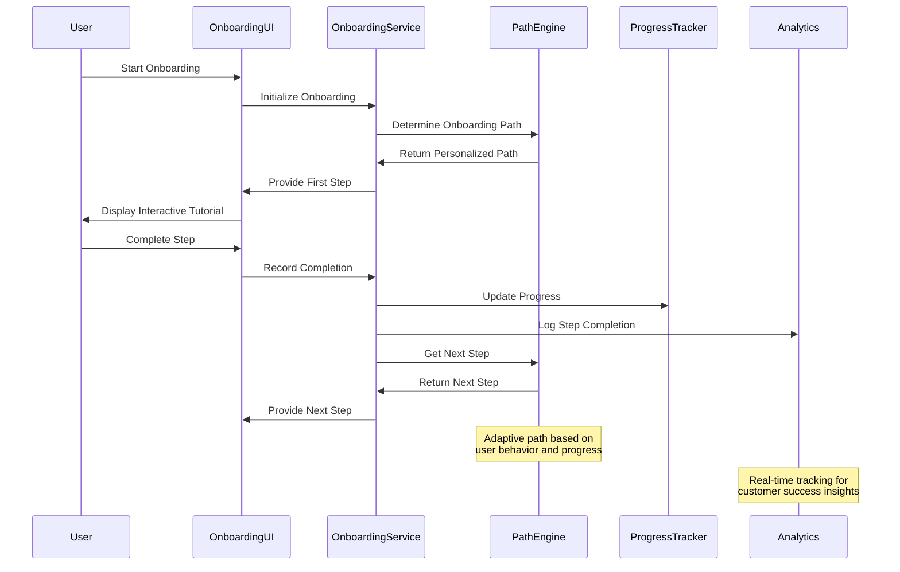
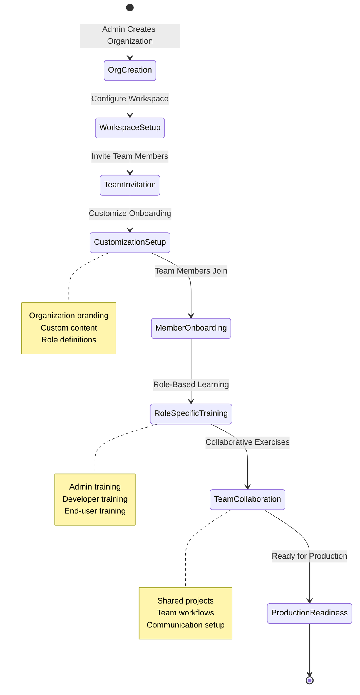

# Design Document

## Overview

The Customer & Team Onboarding system provides a comprehensive, adaptive onboarding experience that guides users through their initial platform journey. Built as an integrated component of the C9d.ai platform, the system leverages existing authentication, subscription management, and documentation systems to deliver personalized, role-based onboarding experiences. The architecture supports multiple onboarding paths, progress tracking, and organizational customization while maintaining seamless integration with all platform features.

The design emphasizes progressive disclosure and contextual learning, allowing users to learn platform capabilities through hands-on experience while building confidence and achieving early wins.

## Architecture

### High-Level Architecture

```mermaid
graph TB
    subgraph "Onboarding Engine"
        OnboardingService[Onboarding Service]
        ProgressTracker[Progress Tracker]
        PathEngine[Path Engine]
        ContentManager[Content Manager]
    end
    
    subgraph "User Experience"
        OnboardingUI[Onboarding UI]
        InteractiveTutorials[Interactive Tutorials]
        SandboxEnvironment[Sandbox Environment]
        ProgressDashboard[Progress Dashboard]
    end
    
    subgraph "Integration Layer"
        AuthService[Auth Service]
        SubscriptionService[Subscription Service]
        OrganizationService[Organization Service]
        DocumentationService[Documentation Service]
    end
    
    subgraph "Analytics & Support"
        AnalyticsEngine[Analytics Engine]
        CustomerSuccessAPI[Customer Success API]
        NotificationService[Notification Service]
        FeedbackCollector[Feedback Collector]
    end
    
    subgraph "Content & Templates"
        OnboardingContent[Onboarding Content]
        RoleTemplates[Role Templates]
        OrganizationTemplates[Organization Templates]
        CustomContent[Custom Content]
    end
    
    OnboardingService --> ProgressTracker
    OnboardingService --> PathEngine
    OnboardingService --> ContentManager
    
    OnboardingUI --> OnboardingService
    InteractiveTutorials --> OnboardingService
    SandboxEnvironment --> OnboardingService
    ProgressDashboard --> ProgressTracker
    
    OnboardingService --> AuthService
    OnboardingService --> SubscriptionService
    OnboardingService --> OrganizationService
    OnboardingService --> DocumentationService
    
    OnboardingService --> AnalyticsEngine
    OnboardingService --> CustomerSuccessAPI
    OnboardingService --> NotificationService
    OnboardingService --> FeedbackCollector
    
    ContentManager --> OnboardingContent
    ContentManager --> RoleTemplates
    ContentManager --> OrganizationTemplates
    ContentManager --> CustomContent
```



### Onboarding Flow Architecture



### Organizational Onboarding Flow



## Components and Interfaces

### Core Services

#### OnboardingService
```typescript
interface OnboardingService {
  initializeOnboarding(userId: string, context: OnboardingContext): Promise<OnboardingSession>
  getOnboardingPath(userId: string, preferences: UserPreferences): Promise<OnboardingPath>
  recordStepCompletion(sessionId: string, stepId: string, result: StepResult): Promise<void>
  updateOnboardingProgress(sessionId: string, progress: ProgressUpdate): Promise<OnboardingProgress>
  customizeOrganizationOnboarding(orgId: string, customization: OnboardingCustomization): Promise<void>
  getOnboardingAnalytics(orgId: string, period: TimePeriod): Promise<OnboardingAnalytics>
}
```

#### PathEngine
```typescript
interface PathEngine {
  generatePersonalizedPath(user: User, context: OnboardingContext): Promise<OnboardingPath>
  adaptPath(sessionId: string, userBehavior: UserBehavior): Promise<PathAdjustment>
  getNextStep(sessionId: string, currentProgress: Progress): Promise<OnboardingStep>
  validatePathCompletion(sessionId: string): Promise<CompletionValidation>
  suggestAlternativePaths(sessionId: string, issues: OnboardingIssue[]): Promise<AlternativePath[]>
}
```

#### ProgressTracker
```typescript
interface ProgressTracker {
  trackStepProgress(sessionId: string, stepId: string, progress: StepProgress): Promise<void>
  getOverallProgress(sessionId: string): Promise<OnboardingProgress>
  identifyBlockers(sessionId: string): Promise<OnboardingBlocker[]>
  generateProgressReport(userId: string): Promise<ProgressReport>
  awardMilestone(userId: string, milestone: Milestone): Promise<Achievement>
}
```

#### ContentManager
```typescript
interface ContentManager {
  getOnboardingContent(contentId: string, context: ContentContext): Promise<OnboardingContent>
  createCustomContent(orgId: string, content: CustomContentData): Promise<CustomContent>
  updateContentTemplate(templateId: string, updates: TemplateUpdate): Promise<ContentTemplate>
  getContentForRole(role: UserRole, orgId: string): Promise<RoleContent>
  validateContentEffectiveness(contentId: string): Promise<ContentEffectiveness>
}
```

### User Interface Components

#### OnboardingWizard
Main component that orchestrates the entire onboarding experience.

```typescript
interface OnboardingWizardProps {
  userId: string
  organizationId?: string
  onboardingType: 'individual' | 'team_admin' | 'team_member'
  onComplete: (result: OnboardingResult) => void
  onExit: (progress: OnboardingProgress) => void
}
```

#### InteractiveStepComponent
Component for individual onboarding steps with interactive elements.

```typescript
interface InteractiveStepComponentProps {
  step: OnboardingStep
  onStepComplete: (result: StepResult) => void
  onNeedHelp: () => void
  allowSkip: boolean
  sandboxMode: boolean
}
```

#### ProgressIndicator
Visual component showing onboarding progress and milestones.

```typescript
interface ProgressIndicatorProps {
  currentStep: number
  totalSteps: number
  completedMilestones: Milestone[]
  nextMilestone: Milestone
  estimatedTimeRemaining: number
}
```

#### OrganizationSetupWizard
Specialized component for organization administrators setting up team onboarding.

```typescript
interface OrganizationSetupWizardProps {
  organizationId: string
  onSetupComplete: (config: OrganizationOnboardingConfig) => void
  availableTemplates: OrganizationTemplate[]
  customizationOptions: CustomizationOption[]
}
```

## Data Models

### Onboarding Models

```typescript
interface OnboardingSession {
  id: string
  userId: string
  organizationId?: string
  sessionType: 'individual' | 'team_admin' | 'team_member'
  currentPath: OnboardingPath
  progress: OnboardingProgress
  startedAt: Date
  lastActiveAt: Date
  completedAt?: Date
  status: 'active' | 'paused' | 'completed' | 'abandoned'
  metadata: SessionMetadata
}

interface OnboardingPath {
  id: string
  name: string
  description: string
  targetRole: UserRole
  subscriptionTier: SubscriptionTier
  estimatedDuration: number
  steps: OnboardingStep[]
  prerequisites: string[]
  learningObjectives: string[]
  successCriteria: SuccessCriteria
}

interface OnboardingStep {
  id: string
  title: string
  description: string
  stepType: 'tutorial' | 'exercise' | 'setup' | 'validation' | 'milestone'
  content: StepContent
  interactiveElements: InteractiveElement[]
  estimatedTime: number
  isRequired: boolean
  dependencies: string[]
  successCriteria: StepSuccessCriteria
}

interface OnboardingProgress {
  sessionId: string
  currentStepIndex: number
  completedSteps: string[]
  skippedSteps: string[]
  milestones: CompletedMilestone[]
  overallProgress: number
  timeSpent: number
  lastUpdated: Date
}

interface StepResult {
  stepId: string
  status: 'completed' | 'skipped' | 'failed'
  timeSpent: number
  userActions: UserAction[]
  feedback?: UserFeedback
  errors?: StepError[]
  achievements?: Achievement[]
}
```

### Organization and Team Models

```typescript
interface OrganizationOnboardingConfig {
  organizationId: string
  branding: OnboardingBranding
  customContent: CustomContent[]
  roleConfigurations: RoleConfiguration[]
  mandatoryModules: string[]
  completionRequirements: CompletionRequirement[]
  notificationSettings: NotificationSettings
}

interface RoleConfiguration {
  role: UserRole
  onboardingPath: string
  customizations: RoleCustomization[]
  mentorAssignment?: MentorAssignment
  additionalResources: Resource[]
  completionCriteria: RoleCompletionCriteria
}

interface TeamInvitation {
  id: string
  organizationId: string
  invitedBy: string
  email: string
  role: UserRole
  customMessage?: string
  onboardingPathOverride?: string
  expiresAt: Date
  status: 'pending' | 'accepted' | 'expired' | 'revoked'
  createdAt: Date
}

interface OnboardingCustomization {
  organizationId: string
  welcomeMessage: string
  brandingAssets: BrandingAsset[]
  customSteps: CustomStep[]
  roleSpecificContent: Record<UserRole, CustomContent>
  integrationSettings: IntegrationSetting[]
}
```

### Analytics and Tracking Models

```typescript
interface OnboardingAnalytics {
  organizationId?: string
  period: TimePeriod
  metrics: OnboardingMetrics
  completionRates: CompletionRate[]
  dropOffPoints: DropOffPoint[]
  userSatisfaction: SatisfactionMetrics
  timeToValue: TimeToValueMetrics
}

interface OnboardingMetrics {
  totalSessions: number
  completedSessions: number
  averageCompletionTime: number
  averageStepsCompleted: number
  mostSkippedSteps: StepSkipData[]
  commonBlockers: BlockerData[]
  satisfactionScore: number
}

interface UserBehavior {
  sessionId: string
  stepInteractions: StepInteraction[]
  timeSpentPerStep: Record<string, number>
  helpRequestsCount: number
  skipPatterns: SkipPattern[]
  engagementLevel: 'high' | 'medium' | 'low'
}

interface OnboardingBlocker {
  stepId: string
  blockerType: 'technical' | 'content' | 'user_understanding' | 'system'
  description: string
  frequency: number
  suggestedResolution: string
  impact: 'high' | 'medium' | 'low'
}
```

## Error Handling

### Onboarding Flow Errors
- **OnboardingSessionNotFound**: Requested onboarding session doesn't exist or has expired
- **InvalidOnboardingPath**: Onboarding path is corrupted or incompatible with user context
- **StepValidationFailed**: User's completion of onboarding step doesn't meet success criteria
- **ProgressSyncFailed**: Failed to synchronize onboarding progress across sessions
- **CustomizationError**: Organization-specific customizations are invalid or conflicting

### Integration Errors
- **AuthenticationRequired**: User must be authenticated to access onboarding features
- **SubscriptionMismatch**: User's subscription tier doesn't match onboarding path requirements
- **OrganizationAccessDenied**: User lacks permissions for organization-specific onboarding
- **SandboxUnavailable**: Interactive sandbox environment is temporarily unavailable
- **ContentLoadingFailed**: Failed to load onboarding content or interactive elements

### User Experience Errors
- **OnboardingTimeout**: Onboarding session has exceeded maximum allowed duration
- **ConcurrentSessionLimit**: User has reached maximum number of concurrent onboarding sessions
- **InvalidUserInput**: User input doesn't meet validation requirements for onboarding step
- **MilestoneNotEarned**: User hasn't met requirements to unlock milestone or achievement
- **CustomContentError**: Organization's custom onboarding content contains errors

### Error Response Format
```typescript
interface OnboardingErrorResponse {
  error: {
    code: string
    message: string
    details?: {
      sessionId?: string
      stepId?: string
      suggestedActions?: string[]
      alternativePaths?: string[]
      supportContact?: string
    }
    timestamp: string
    requestId: string
  }
}
```

## Testing Strategy

### Unit Testing
- **Onboarding Service**: Test path generation, progress tracking, and step validation logic
- **Path Engine**: Test personalization algorithms and adaptive path adjustments
- **Progress Tracker**: Test milestone tracking, blocker identification, and progress calculations
- **Content Manager**: Test content delivery, customization, and effectiveness measurement

### Integration Testing
- **Authentication Integration**: Test seamless integration with existing auth system
- **Subscription Integration**: Test tier-based onboarding path selection and feature access
- **Organization Integration**: Test team setup, role assignment, and custom content delivery
- **Documentation Integration**: Test contextual help and tutorial content synchronization

### End-to-End Testing
- **Individual Onboarding**: Test complete individual user onboarding journey from signup to first success
- **Team Onboarding**: Test organization setup, team invitation, and collaborative onboarding experiences
- **Role-Specific Flows**: Test different onboarding paths for various user roles and responsibilities
- **Customization Workflows**: Test organization-specific branding and content customization

### User Experience Testing
- **Usability Testing**: Test onboarding flow usability with real users across different personas
- **Accessibility Testing**: Test onboarding components for WCAG 2.1 compliance and assistive technology support
- **Mobile Experience**: Test onboarding flows on mobile devices with touch interactions
- **Performance Testing**: Test onboarding load times and interactive element responsiveness

### Analytics and Optimization Testing
- **A/B Testing**: Test different onboarding approaches and measure effectiveness
- **Completion Rate Testing**: Test factors that influence onboarding completion and user satisfaction
- **Content Effectiveness**: Test which onboarding content and formats drive best learning outcomes
- **Customer Success Integration**: Test proactive support triggers and intervention effectiveness

### Load and Scalability Testing
- **Concurrent Users**: Test system behavior with multiple simultaneous onboarding sessions
- **Organization Scale**: Test onboarding performance with large organizations and many team members
- **Content Delivery**: Test content loading performance with rich media and interactive elements
- **Analytics Processing**: Test real-time analytics and progress tracking under load