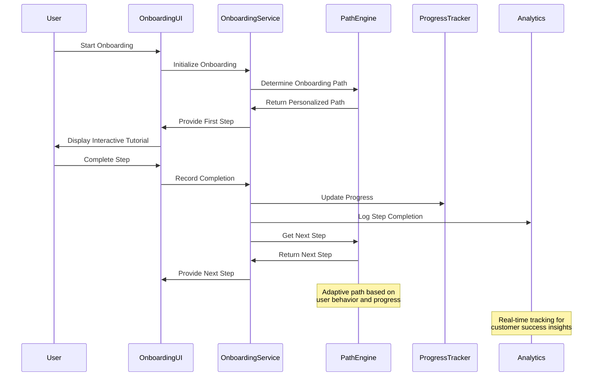
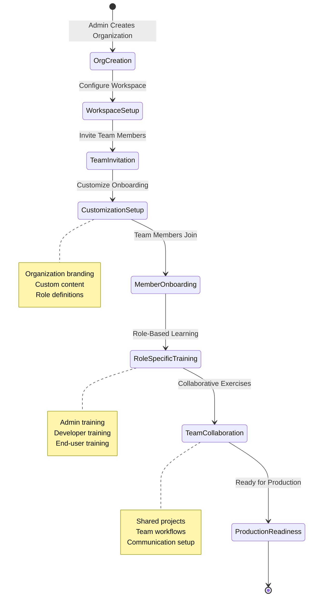

# Design Document

## Overview

The Customer & Team Onboarding system provides a comprehensive, adaptive onboarding experience that guides users through their initial platform journey. Built as an integrated component of the C9d.ai platform, the system leverages existing authentication (Clerk), database (Supabase), caching (Redis), and subscription management systems to deliver personalized, role-based onboarding experiences. The architecture supports multiple onboarding paths, progress tracking, and organizational customization while maintaining seamless integration with all platform features.

The design emphasizes progressive disclosure and contextual learning, allowing users to learn platform capabilities through hands-on experience while building confidence and achieving early wins.

### Deployment Architecture
The system is designed for deployment on Vercel with the following characteristics:
- **Edge Functions**: Lightweight onboarding state checks and progress updates
- **Serverless Functions**: Core onboarding logic, path generation, and analytics processing
- **Static Assets**: Onboarding content, tutorials, and media served via Vercel CDN
- **Database**: Supabase PostgreSQL with Row Level Security for multi-tenant isolation
- **Caching**: Redis for session state, progress tracking, and content delivery optimization
- **Authentication**: Clerk for user authentication and organization management

#### Redis Caching Strategy
Redis is used strategically to optimize performance and reduce database load:

**Session State Caching**:
```typescript
// Cache key pattern: onboarding:session:{sessionId}
// TTL: 24 hours (auto-refresh on activity)
interface CachedSessionState {
  sessionId: string
  userId: string
  currentStepIndex: number
  lastActiveAt: string
  cachedAt: string
}
```

**Progress Tracking Cache**:
```typescript
// Cache key pattern: onboarding:progress:{userId}
// TTL: 1 hour (write-through cache)
interface CachedProgress {
  completedSteps: string[]
  currentProgress: number
  milestones: string[]
  lastUpdated: string
}
```

**Content Delivery Cache**:
```typescript
// Cache key pattern: onboarding:content:{contentId}
// TTL: 6 hours (content rarely changes)
interface CachedContent {
  contentId: string
  content: Record<string, unknown>
  version: string
  cachedAt: string
}
```

**Cache Invalidation Strategy**:
- **Session Updates**: Invalidate on explicit pause/resume or completion
- **Progress Updates**: Write-through cache with immediate invalidation
- **Content Updates**: Invalidate on content modification by admins
- **Organization Changes**: Invalidate all org-related caches on customization updates

#### Vercel Deployment Considerations

**Function Timeout Management**:
- Edge functions: < 10s for state checks and simple updates
- Serverless functions: < 30s for path generation and analytics
- Long-running analytics: Use Vercel background functions or queue-based processing

**Cold Start Optimization**:
- Minimize dependencies in edge functions
- Use connection pooling for Supabase (via Supavisor)
- Implement Redis connection reuse across function invocations
- Pre-warm critical paths with scheduled functions

**Environment Variables**:
- Managed through Vercel environment variables
- Separate configurations for preview, staging, and production
- Secrets stored in Vercel's encrypted storage
- Phase.dev integration for environment synchronization

**Static Asset Optimization**:
- Tutorial videos and images served via Vercel CDN
- Automatic image optimization with next/image
- Content versioning for cache busting
- Lazy loading for interactive elements

## Architecture

### High-Level Architecture


```mermaid
graph TB
    subgraph "Onboarding Engine"
        OnboardingService[Onboarding Service]
        ProgressTracker[Progress Tracker]
        PathEngine[Path Engine]
        ContentManager[Content Manager]
    end
    
    subgraph "User Experience"
        OnboardingUI[Onboarding UI]
        InteractiveTutorials[Interactive Tutorials]
        SandboxEnvironment[Sandbox Environment]
        ProgressDashboard[Progress Dashboard]
    end
    
    subgraph "Integration Layer"
        AuthService[Auth Service]
        SubscriptionService[Subscription Service]
        OrganizationService[Organization Service]
        DocumentationService[Documentation Service]
    end
    
    subgraph "Analytics & Support"
        AnalyticsEngine[Analytics Engine]
        CustomerSuccessAPI[Customer Success API]
        NotificationService[Notification Service]
        FeedbackCollector[Feedback Collector]
    end
    
    subgraph "Content & Templates"
        OnboardingContent[Onboarding Content]
        RoleTemplates[Role Templates]
        OrganizationTemplates[Organization Templates]
        CustomContent[Custom Content]
    end
    
    OnboardingService --> ProgressTracker
    OnboardingService --> PathEngine
    OnboardingService --> ContentManager
    
    OnboardingUI --> OnboardingService
    InteractiveTutorials --> OnboardingService
    SandboxEnvironment --> OnboardingService
    ProgressDashboard --> ProgressTracker
    
    OnboardingService --> AuthService
    OnboardingService --> SubscriptionService
    OnboardingService --> OrganizationService
    OnboardingService --> DocumentationService
    
    OnboardingService --> AnalyticsEngine
    OnboardingService --> CustomerSuccessAPI
    OnboardingService --> NotificationService
    OnboardingService --> FeedbackCollector
    
    ContentManager --> OnboardingContent
    ContentManager --> RoleTemplates
    ContentManager --> OrganizationTemplates
    ContentManager --> CustomContent
```

### Onboarding Flow Architecture


```mermaid
sequenceDiagram
    participant User
    participant OnboardingUI
    participant OnboardingService
    participant PathEngine
    participant ProgressTracker
    participant Analytics
    
    User->>OnboardingUI: Start Onboarding
    OnboardingUI->>OnboardingService: Initialize Onboarding
    OnboardingService->>PathEngine: Determine Onboarding Path
    PathEngine->>OnboardingService: Return Personalized Path
    OnboardingService->>OnboardingUI: Provide First Step
    OnboardingUI->>User: Display Interactive Tutorial
    
    User->>OnboardingUI: Complete Step
    OnboardingUI->>OnboardingService: Record Completion
    OnboardingService->>ProgressTracker: Update Progress
    OnboardingService->>Analytics: Log Step Completion
    OnboardingService->>PathEngine: Get Next Step
    PathEngine->>OnboardingService: Return Next Step
    OnboardingService->>OnboardingUI: Provide Next Step
    
    Note over PathEngine: Adaptive path based on<br/>user behavior and progress
    Note over Analytics: Real-time tracking for<br/>customer success insights
```

### Organizational Onboarding Flow


```mermaid
stateDiagram-v2
    [*] --> OrgCreation : Admin Creates Organization
    OrgCreation --> WorkspaceSetup : Configure Workspace
    WorkspaceSetup --> TeamInvitation : Invite Team Members
    TeamInvitation --> CustomizationSetup : Customize Onboarding
    CustomizationSetup --> MemberOnboarding : Team Members Join
    MemberOnboarding --> RoleSpecificTraining : Role-Based Learning
    RoleSpecificTraining --> TeamCollaboration : Collaborative Exercises
    TeamCollaboration --> ProductionReadiness : Ready for Production
    ProductionReadiness --> [*]
    
    note right of CustomizationSetup : Organization branding<br/>Custom content<br/>Role definitions
    note right of RoleSpecificTraining : Admin training<br/>Developer training<br/>End-user training
    note right of TeamCollaboration : Shared projects<br/>Team workflows<br/>Communication setup
```

## Components and Interfaces

### Core Services

#### OnboardingService
```typescript
interface OnboardingService {
  initializeOnboarding(userId: string, context: OnboardingContext): Promise<OnboardingSession>
  getOnboardingPath(userId: string, preferences: UserPreferences): Promise<OnboardingPath>
  recordStepCompletion(sessionId: string, stepId: string, result: StepResult): Promise<void>
  updateOnboardingProgress(sessionId: string, progress: ProgressUpdate): Promise<OnboardingProgress>
  customizeOrganizationOnboarding(orgId: string, customization: OnboardingCustomization): Promise<void>
  getOnboardingAnalytics(orgId: string, period: TimePeriod): Promise<OnboardingAnalytics>
  pauseOnboarding(sessionId: string): Promise<void>
  resumeOnboarding(sessionId: string): Promise<OnboardingSession>
  skipStep(sessionId: string, stepId: string, reason?: string): Promise<void>
  convertPracticeToProduction(sessionId: string, practiceData: PracticeData): Promise<ProductionConfig>
}
```

#### PathEngine
```typescript
interface PathEngine {
  generatePersonalizedPath(user: User, context: OnboardingContext): Promise<OnboardingPath>
  adaptPath(sessionId: string, userBehavior: UserBehavior): Promise<PathAdjustment>
  getNextStep(sessionId: string, currentProgress: Progress): Promise<OnboardingStep>
  validatePathCompletion(sessionId: string): Promise<CompletionValidation>
  suggestAlternativePaths(sessionId: string, issues: OnboardingIssue[]): Promise<AlternativePath[]>
  generateCondensedPath(userId: string, timeConstraint: number): Promise<OnboardingPath>
  getSubscriptionTierPath(userId: string, tier: SubscriptionTier): Promise<OnboardingPath>
}
```

#### ProgressTracker
```typescript
interface ProgressTracker {
  trackStepProgress(sessionId: string, stepId: string, progress: StepProgress): Promise<void>
  getOverallProgress(sessionId: string): Promise<OnboardingProgress>
  identifyBlockers(sessionId: string): Promise<OnboardingBlocker[]>
  generateProgressReport(userId: string): Promise<ProgressReport>
  awardMilestone(userId: string, milestone: Milestone): Promise<Achievement>
}
```

#### ContentManager
```typescript
interface ContentManager {
  getOnboardingContent(contentId: string, context: ContentContext): Promise<OnboardingContent>
  createCustomContent(orgId: string, content: CustomContentData): Promise<CustomContent>
  updateContentTemplate(templateId: string, updates: TemplateUpdate): Promise<ContentTemplate>
  getContentForRole(role: UserRole, orgId: string): Promise<RoleContent>
  validateContentEffectiveness(contentId: string): Promise<ContentEffectiveness>
  getMultiFormatContent(contentId: string, format: 'video' | 'text' | 'interactive'): Promise<OnboardingContent>
  getJustInTimeContent(userId: string, feature: string): Promise<ContextualHelp>
}
```

#### SchedulingService
```typescript
interface SchedulingService {
  setUserPace(userId: string, preferences: PacePreferences): Promise<void>
  scheduleReminder(userId: string, reminderConfig: ReminderConfig): Promise<void>
  getRecommendedSchedule(userId: string, timeAvailable: number): Promise<Schedule>
  updateReminderPreferences(userId: string, preferences: NotificationPreferences): Promise<void>
  cancelReminders(userId: string): Promise<void>
}
```

#### NotificationService
```typescript
interface NotificationService {
  sendMilestoneNotification(userId: string, milestone: Milestone): Promise<void>
  sendAbandonmentFollowUp(userId: string, sessionId: string): Promise<void>
  sendTeamInvitation(invitation: TeamInvitation): Promise<void>
  sendCompletionReminder(userId: string, sessionId: string): Promise<void>
  sendCustomerSuccessAlert(csManagerId: string, alert: CustomerSuccessAlert): Promise<void>
  sendUpgradePrompt(userId: string, feature: string, tier: SubscriptionTier): Promise<void>
}
```

### User Interface Components

#### OnboardingWizard
Main component that orchestrates the entire onboarding experience.

```typescript
interface OnboardingWizardProps {
  userId: string
  organizationId?: string
  onboardingType: 'individual' | 'team_admin' | 'team_member'
  onComplete: (result: OnboardingResult) => void
  onExit: (progress: OnboardingProgress) => void
}
```

#### InteractiveStepComponent
Component for individual onboarding steps with interactive elements.

```typescript
interface InteractiveStepComponentProps {
  step: OnboardingStep
  onStepComplete: (result: StepResult) => void
  onNeedHelp: () => void
  allowSkip: boolean
  sandboxMode: boolean
}
```

#### ProgressIndicator
Visual component showing onboarding progress and milestones.

```typescript
interface ProgressIndicatorProps {
  currentStep: number
  totalSteps: number
  completedMilestones: Milestone[]
  nextMilestone: Milestone
  estimatedTimeRemaining: number
}
```

#### OrganizationSetupWizard
Specialized component for organization administrators setting up team onboarding.

```typescript
interface OrganizationSetupWizardProps {
  organizationId: string
  onSetupComplete: (config: OrganizationOnboardingConfig) => void
  availableTemplates: OrganizationTemplate[]
  customizationOptions: CustomizationOption[]
}
```

## Data Models

### Database Schema Alignment
All onboarding data models align with the existing Supabase schema and leverage established patterns:
- **Tenant Isolation**: Uses `organization_id` for multi-tenant data isolation via RLS policies
- **User References**: Uses `clerk_user_id` to reference users from Clerk authentication
- **Audit Trails**: Includes `created_at`, `updated_at`, `created_by` for all mutable entities
- **Soft Deletes**: Uses `deleted_at` for soft deletion where appropriate
- **JSONB Storage**: Uses JSONB columns for flexible metadata and configuration storage

#### Row Level Security (RLS) Policies
All onboarding tables implement RLS policies for multi-tenant security:

**onboarding_sessions table**:
```sql
-- Users can only access their own sessions
CREATE POLICY "Users can view own sessions"
  ON onboarding_sessions FOR SELECT
  USING (clerk_user_id = auth.uid());

-- Users can create their own sessions
CREATE POLICY "Users can create own sessions"
  ON onboarding_sessions FOR INSERT
  WITH CHECK (clerk_user_id = auth.uid());

-- Users can update their own sessions
CREATE POLICY "Users can update own sessions"
  ON onboarding_sessions FOR UPDATE
  USING (clerk_user_id = auth.uid());

-- Organization admins can view team member sessions
CREATE POLICY "Org admins can view team sessions"
  ON onboarding_sessions FOR SELECT
  USING (
    organization_id IN (
      SELECT organization_id FROM organization_members
      WHERE clerk_user_id = auth.uid()
      AND role IN ('admin', 'owner')
    )
  );
```

**onboarding_progress table**:
```sql
-- Users can access their own progress
CREATE POLICY "Users can manage own progress"
  ON onboarding_progress FOR ALL
  USING (clerk_user_id = auth.uid());

-- Organization admins can view team progress
CREATE POLICY "Org admins can view team progress"
  ON onboarding_progress FOR SELECT
  USING (
    organization_id IN (
      SELECT organization_id FROM organization_members
      WHERE clerk_user_id = auth.uid()
      AND role IN ('admin', 'owner')
    )
  );
```

**organization_onboarding_configs table**:
```sql
-- Organization members can view their org's config
CREATE POLICY "Org members can view config"
  ON organization_onboarding_configs FOR SELECT
  USING (
    organization_id IN (
      SELECT organization_id FROM organization_members
      WHERE clerk_user_id = auth.uid()
    )
  );

-- Only org admins can modify config
CREATE POLICY "Org admins can modify config"
  ON organization_onboarding_configs FOR ALL
  USING (
    organization_id IN (
      SELECT organization_id FROM organization_members
      WHERE clerk_user_id = auth.uid()
      AND role IN ('admin', 'owner')
    )
  );
```

### Onboarding Models

```typescript
// Database table: onboarding_sessions
interface OnboardingSession {
  id: string // UUID primary key
  clerk_user_id: string // References Clerk user
  organization_id?: string // For tenant isolation (RLS)
  session_type: 'individual' | 'team_admin' | 'team_member'
  current_path_id: string // References onboarding_paths
  current_step_index: number
  status: 'active' | 'paused' | 'completed' | 'abandoned'
  started_at: string // ISO timestamp
  last_active_at: string // ISO timestamp
  completed_at?: string // ISO timestamp
  metadata: Record<string, unknown> // JSONB
  created_at: string // ISO timestamp
  updated_at: string // ISO timestamp
}

// Database table: onboarding_paths
interface OnboardingPath {
  id: string // UUID primary key
  name: string
  description: string
  target_role: string // References role from RBAC system
  subscription_tier: string // References subscription tiers
  estimated_duration: number // minutes
  steps: OnboardingStep[] // JSONB array
  prerequisites: string[] // JSONB array
  learning_objectives: string[] // JSONB array
  success_criteria: Record<string, unknown> // JSONB
  is_active: boolean
  created_at: string
  updated_at: string
  created_by: string // clerk_user_id
}

// Database table: onboarding_steps (normalized for reusability)
interface OnboardingStep {
  id: string // UUID primary key
  title: string
  description: string
  step_type: 'tutorial' | 'exercise' | 'setup' | 'validation' | 'milestone'
  content: Record<string, unknown> // JSONB - flexible content structure
  interactive_elements: Record<string, unknown>[] // JSONB array
  estimated_time: number // minutes
  is_required: boolean
  dependencies: string[] // JSONB array of step IDs
  success_criteria: Record<string, unknown> // JSONB
  created_at: string
  updated_at: string
}

// Database table: onboarding_progress (cached in Redis for performance)
interface OnboardingProgress {
  id: string // UUID primary key
  session_id: string // References onboarding_sessions
  clerk_user_id: string // For quick user lookups
  organization_id?: string // For tenant isolation
  current_step_index: number
  completed_steps: string[] // JSONB array of step IDs
  skipped_steps: string[] // JSONB array of step IDs
  milestones: CompletedMilestone[] // JSONB array
  overall_progress: number // 0-100 percentage
  time_spent: number // total minutes
  last_updated: string // ISO timestamp
  created_at: string
  updated_at: string
}

interface StepResult {
  stepId: string
  status: 'completed' | 'skipped' | 'failed'
  timeSpent: number
  userActions: UserAction[]
  feedback?: UserFeedback
  errors?: StepError[]
  achievements?: Achievement[]
}
```

### Organization and Team Models

```typescript
interface OrganizationOnboardingConfig {
  organizationId: string
  branding: OnboardingBranding
  customContent: CustomContent[]
  roleConfigurations: RoleConfiguration[]
  mandatoryModules: string[]
  completionRequirements: CompletionRequirement[]
  notificationSettings: NotificationSettings
}

interface RoleConfiguration {
  role: UserRole
  onboardingPath: string
  customizations: RoleCustomization[]
  mentorAssignment?: MentorAssignment
  additionalResources: Resource[]
  completionCriteria: RoleCompletionCriteria
}

interface TeamInvitation {
  id: string
  organizationId: string
  invitedBy: string
  email: string
  role: UserRole
  customMessage?: string
  onboardingPathOverride?: string
  expiresAt: Date
  status: 'pending' | 'accepted' | 'expired' | 'revoked'
  createdAt: Date
}

interface OnboardingCustomization {
  organizationId: string
  welcomeMessage: string
  brandingAssets: BrandingAsset[]
  customSteps: CustomStep[]
  roleSpecificContent: Record<UserRole, CustomContent>
  integrationSettings: IntegrationSetting[]
}
```

### Analytics and Tracking Models

```typescript
interface OnboardingAnalytics {
  organizationId?: string
  period: TimePeriod
  metrics: OnboardingMetrics
  completionRates: CompletionRate[]
  dropOffPoints: DropOffPoint[]
  userSatisfaction: SatisfactionMetrics
  timeToValue: TimeToValueMetrics
}

interface OnboardingMetrics {
  totalSessions: number
  completedSessions: number
  averageCompletionTime: number
  averageStepsCompleted: number
  mostSkippedSteps: StepSkipData[]
  commonBlockers: BlockerData[]
  satisfactionScore: number
}

interface UserBehavior {
  sessionId: string
  stepInteractions: StepInteraction[]
  timeSpentPerStep: Record<string, number>
  helpRequestsCount: number
  skipPatterns: SkipPattern[]
  engagementLevel: 'high' | 'medium' | 'low'
}

interface OnboardingBlocker {
  stepId: string
  blockerType: 'technical' | 'content' | 'user_understanding' | 'system'
  description: string
  frequency: number
  suggestedResolution: string
  impact: 'high' | 'medium' | 'low'
}
```

### Scheduling and Pacing Models

```typescript
interface PacePreferences {
  userId: string
  preferredPace: 'fast' | 'moderate' | 'slow' | 'self_paced'
  dailyTimeCommitment: number // minutes per day
  preferredDays: DayOfWeek[]
  preferredTimeOfDay: 'morning' | 'afternoon' | 'evening' | 'flexible'
  reminderFrequency: 'daily' | 'every_other_day' | 'weekly' | 'none'
}

interface ReminderConfig {
  userId: string
  sessionId: string
  reminderType: 'progress' | 'milestone' | 'completion' | 'encouragement'
  scheduledTime: Date
  channel: 'email' | 'in_app' | 'push' | 'sms'
  message: string
  metadata: Record<string, unknown>
}

interface Schedule {
  userId: string
  sessionId: string
  recommendedSessions: ScheduledSession[]
  estimatedCompletionDate: Date
  flexibilityOptions: FlexibilityOption[]
}

interface ScheduledSession {
  date: Date
  duration: number
  steps: string[]
  milestone?: string
}
```

### Subscription and Feature Models

```typescript
interface SubscriptionTierFeatures {
  tier: SubscriptionTier
  availableFeatures: Feature[]
  onboardingModules: string[]
  advancedCapabilities: Capability[]
  upgradeIncentives: UpgradeIncentive[]
}

interface UpgradeIncentive {
  feature: string
  description: string
  tier: SubscriptionTier
  demoAvailable: boolean
  trialEligible: boolean
}

interface PracticeData {
  sessionId: string
  practiceConfigurations: Configuration[]
  practiceResults: Result[]
  userPreferences: Record<string, unknown>
}

interface ProductionConfig {
  configurations: Configuration[]
  validationStatus: 'valid' | 'needs_review' | 'invalid'
  migrationSteps: MigrationStep[]
  rollbackPlan: RollbackPlan
}
```

### Customer Success Models

```typescript
interface CustomerSuccessAlert {
  userId: string
  sessionId: string
  alertType: 'at_risk' | 'struggling' | 'stalled' | 'needs_intervention'
  severity: 'low' | 'medium' | 'high' | 'critical'
  context: AlertContext
  suggestedActions: SuggestedAction[]
  createdAt: Date
}

interface AlertContext {
  currentStep: string
  timeStuck: number
  helpRequestsCount: number
  errorCount: number
  lastActivity: Date
  engagementTrend: 'increasing' | 'stable' | 'declining'
}

interface SuggestedAction {
  action: string
  priority: number
  expectedImpact: 'high' | 'medium' | 'low'
  estimatedEffort: number
  resources: Resource[]
}
```

## Correctness Properties

*A property is a characteristic or behavior that should hold true across all valid executions of a system—essentially, a formal statement about what the system should do. Properties serve as the bridge between human-readable specifications and machine-verifiable correctness guarantees.*

### Core Onboarding Properties

**Property 1: Personalized path generation**
*For any* user with specified use cases and goals, the system should generate an onboarding path that includes content relevant to those use cases and goals.
**Validates: Requirements 1.1**

**Property 2: Progress tracking consistency**
*For any* onboarding step completion, the system should update progress indicators to reflect the completion and provide the next appropriate step.
**Validates: Requirements 1.2**

**Property 3: Contextual help availability**
*For any* onboarding step, contextual help resources, tutorials, and support escalation options should be available and accessible.
**Validates: Requirements 1.3**

**Property 4: Pause-resume state preservation**
*For any* onboarding session, pausing and then resuming should restore the exact state including current step, progress, and context.
**Validates: Requirements 6.4, 10.2**

**Property 5: Skip tracking completeness**
*For any* skipped onboarding step, the system should track the skip event and maintain access to the skipped content for later review.
**Validates: Requirements 10.3, 10.4**

### Role-Based Onboarding Properties

**Property 6: Role-specific content delivery**
*For any* user role and permission set, the onboarding content delivered should match the responsibilities and capabilities of that role.
**Validates: Requirements 2.4, 3.1**

**Property 7: Role-based invitation workflows**
*For any* user role, the team invitation system should provide appropriate invitation workflows with customization options.
**Validates: Requirements 2.2**

**Property 8: Contextual example relevance**
*For any* user's role and organization context, the examples and use cases shown should be relevant to that specific context.
**Validates: Requirements 3.2**

### Interactive Learning Properties

**Property 9: Interactive tutorial availability**
*For any* platform feature included in onboarding, interactive tutorials with real functionality should be available.
**Validates: Requirements 4.1**

**Property 10: Sandbox isolation**
*For any* action performed in the sandbox environment, production data should remain unaffected and unchanged.
**Validates: Requirements 4.2**

**Property 11: Immediate feedback provision**
*For any* completed exercise, the system should provide feedback and validation immediately upon completion.
**Validates: Requirements 4.3**

**Property 12: Error handling without penalty**
*For any* mistake made during exercises, the system should provide correction and guidance without negatively impacting progress or completion status.
**Validates: Requirements 4.4**

**Property 13: Multi-format content availability**
*For any* tutorial or learning module, multiple formats (video, text, interactive) should be available for user selection.
**Validates: Requirements 4.5**

### Subscription Tier Properties

**Property 14: Tier-specific feature highlighting**
*For any* subscription tier, the onboarding experience should highlight exactly the features and capabilities available in that tier.
**Validates: Requirements 5.1**

**Property 15: Premium feature indication**
*For any* premium feature explored during onboarding, the system should clearly indicate subscription requirements and provide upgrade paths.
**Validates: Requirements 5.2**

**Property 16: Tier-specific guidance provision**
*For any* tier-specific feature, detailed guidance and best practices should be provided during onboarding.
**Validates: Requirements 5.3**

**Property 17: Dynamic tier update**
*For any* subscription change during onboarding, the system should update the onboarding path to reflect new capabilities within the same session.
**Validates: Requirements 5.5**

### Progress and Milestone Properties

**Property 18: Progress indicator accuracy**
*For any* onboarding progress state, the displayed progress indicators and completion percentages should accurately reflect actual completion.
**Validates: Requirements 6.1**

**Property 19: Milestone recognition**
*For any* milestone reached during onboarding, the system should provide recognition through badges, certificates, or achievement notifications.
**Validates: Requirements 6.2**

**Property 20: Content unlocking progression**
*For any* completed section, the system should unlock new content and capabilities in a logical, dependency-respecting progression.
**Validates: Requirements 6.3**

### Organizational Customization Properties

**Property 21: Team completion tracking accuracy**
*For any* team member's onboarding progress, the organizational dashboard should accurately track and report completion rates.
**Validates: Requirements 7.3**

**Property 22: Mandatory module enforcement**
*For any* mandatory training module, the system should prevent skipping and accurately track completion for compliance purposes.
**Validates: Requirements 7.5**

### Practice-to-Production Properties

**Property 23: Exercise data contextualization**
*For any* onboarding exercise, the data and use cases should be contextually appropriate to the user's actual work scenarios.
**Validates: Requirements 8.1**

**Property 24: Configuration conversion validity**
*For any* practice configuration converted to production, the resulting configuration should be valid and production-ready.
**Validates: Requirements 8.2**

**Property 25: Post-onboarding contextual help**
*For any* platform feature encountered post-onboarding, just-in-time learning and contextual help should be available.
**Validates: Requirements 8.4**

### Customer Success Properties

**Property 26: Struggling user detection**
*For any* user exhibiting struggling patterns (repeated errors, extended time on steps, help requests), the system should generate alerts for customer success teams.
**Validates: Requirements 9.2**

### Pacing and Scheduling Properties

**Property 27: Pace preference accommodation**
*For any* user-specified pace preference and time commitment, the system should generate a schedule that respects those preferences.
**Validates: Requirements 10.1**

**Property 28: Completed content accessibility**
*For any* previously completed onboarding section, the content and reference materials should remain accessible for review.
**Validates: Requirements 10.4**

## Design Decisions and Rationales

### Adaptive Path Engine
**Decision**: Implement a dynamic path engine that adjusts onboarding based on user behavior and progress.

**Rationale**: Requirements 1.5, 6.5, and 10.3 emphasize the need for flexible, personalized experiences. An adaptive engine allows the system to:
- Detect when users are struggling and offer alternative approaches
- Skip redundant content for experienced users
- Adjust pacing based on engagement patterns
- Provide just-in-time interventions to prevent abandonment

**Trade-offs**: Increased complexity in path management, but significantly improved user experience and completion rates.

### Multi-Format Content Delivery
**Decision**: Support multiple content formats (video, text, interactive) for each onboarding module.

**Rationale**: Requirement 4.5 explicitly requires accommodating different learning styles. This design:
- Allows users to choose their preferred learning format
- Increases accessibility for users with different needs
- Improves engagement by matching content to user preferences
- Supports mobile and desktop experiences equally

**Trade-offs**: Higher content creation and maintenance costs, but better learning outcomes and user satisfaction.

### Sandbox Environment Integration
**Decision**: Provide isolated sandbox environments for hands-on practice without affecting production data.

**Rationale**: Requirements 4.2 and 8.1 emphasize learning by doing with real platform functionality. The sandbox approach:
- Enables risk-free experimentation
- Builds user confidence through practical experience
- Allows conversion of practice work to production (Requirement 8.2)
- Reduces fear of making mistakes during learning

**Trade-offs**: Additional infrastructure costs for sandbox provisioning, but dramatically improved learning effectiveness.

### Tiered Subscription Integration
**Decision**: Deeply integrate subscription tier information throughout the onboarding experience.

**Rationale**: Requirement 5 mandates tier-specific onboarding experiences. This design:
- Highlights available features for each tier
- Provides clear upgrade paths when users explore premium features
- Prevents confusion about feature availability
- Creates natural upsell opportunities without being pushy

**Trade-offs**: Requires tight coupling with subscription service, but ensures users understand their plan's value.

### Proactive Customer Success Integration
**Decision**: Build real-time analytics and alerting system for customer success teams.

**Rationale**: Requirement 9 emphasizes proactive support and early intervention. This design:
- Identifies at-risk users before they abandon onboarding
- Provides context-rich alerts to customer success teams
- Tracks correlation between onboarding and long-term adoption
- Enables data-driven optimization of onboarding content

**Trade-offs**: Privacy considerations and additional monitoring infrastructure, but significantly improved customer retention.

### Flexible Pacing and Scheduling
**Decision**: Allow users complete control over onboarding pace with intelligent scheduling recommendations.

**Rationale**: Requirement 10 emphasizes flexibility and user autonomy. This design:
- Respects user time constraints and preferences
- Provides helpful reminders without being intrusive
- Supports both condensed and extended onboarding paths
- Enables pause/resume functionality with full context preservation

**Trade-offs**: More complex state management, but dramatically improved completion rates for busy users.

### Organization-Level Customization
**Decision**: Provide comprehensive customization capabilities for organization administrators.

**Rationale**: Requirement 7 requires organization-specific workflows and branding. This design:
- Allows organizations to embed their processes into onboarding
- Supports compliance and mandatory training requirements
- Enables custom branding for consistent experience
- Provides analytics for organizational onboarding effectiveness

**Trade-offs**: Increased complexity in content management, but essential for enterprise adoption.

### Seamless Production Integration
**Decision**: Design onboarding to transition smoothly into regular platform usage with continued guidance.

**Rationale**: Requirement 8.3 and 8.4 emphasize seamless handoff and just-in-time learning. This design:
- Converts practice configurations to production-ready setups
- Provides contextual help for new features post-onboarding
- Maintains continuity between learning and working
- Reduces the "cliff" effect when onboarding ends

**Trade-offs**: Requires careful integration with all platform features, but ensures sustained user success.

## Error Handling

### Onboarding Flow Errors
- **OnboardingSessionNotFound**: Requested onboarding session doesn't exist or has expired
- **InvalidOnboardingPath**: Onboarding path is corrupted or incompatible with user context
- **StepValidationFailed**: User's completion of onboarding step doesn't meet success criteria
- **ProgressSyncFailed**: Failed to synchronize onboarding progress across sessions
- **CustomizationError**: Organization-specific customizations are invalid or conflicting

### Integration Errors
- **AuthenticationRequired**: User must be authenticated to access onboarding features
- **SubscriptionMismatch**: User's subscription tier doesn't match onboarding path requirements
- **OrganizationAccessDenied**: User lacks permissions for organization-specific onboarding
- **SandboxUnavailable**: Interactive sandbox environment is temporarily unavailable
- **ContentLoadingFailed**: Failed to load onboarding content or interactive elements

### User Experience Errors
- **OnboardingTimeout**: Onboarding session has exceeded maximum allowed duration
- **ConcurrentSessionLimit**: User has reached maximum number of concurrent onboarding sessions
- **InvalidUserInput**: User input doesn't meet validation requirements for onboarding step
- **MilestoneNotEarned**: User hasn't met requirements to unlock milestone or achievement
- **CustomContentError**: Organization's custom onboarding content contains errors

### Error Response Format
```typescript
interface OnboardingErrorResponse {
  error: {
    code: string
    message: string
    details?: {
      sessionId?: string
      stepId?: string
      suggestedActions?: string[]
      alternativePaths?: string[]
      supportContact?: string
    }
    timestamp: string
    requestId: string
  }
}
```

## Testing Strategy

### Testing Philosophy
All tests must achieve 100% success rate before tasks are considered complete. The testing strategy emphasizes:
- **Real Service Integration**: Integration tests use real Supabase, Redis, and Clerk services
- **Test Data Lifecycle Management**: Tests manage their own data from creation to cleanup
- **Idempotency**: All tests support parallel execution without conflicts
- **No Datastore Tainting**: Tests never leave residual data in shared datastores

### Unit Testing
- **Onboarding Service**: Test path generation, progress tracking, and step validation logic
  - Mock external dependencies (Supabase, Redis, Clerk)
  - Test business logic in isolation
  - Achieve 100% code coverage for service layer
- **Path Engine**: Test personalization algorithms and adaptive path adjustments
  - Test with various user contexts and preferences
  - Validate path generation logic without database dependencies
- **Progress Tracker**: Test milestone tracking, blocker identification, and progress calculations
  - Test progress calculation algorithms
  - Validate milestone award logic
- **Content Manager**: Test content delivery, customization, and effectiveness measurement
  - Test content retrieval and filtering logic
  - Validate customization application

### Integration Testing (Real Services)
**Critical Requirement**: All integration tests MUST use real services (Supabase, Redis, Clerk) to validate actual behavior.

#### Test Data Management Strategy
```typescript
// Example test data lifecycle pattern
describe('Onboarding Integration Tests', () => {
  let testContext: TestContext
  
  beforeEach(async () => {
    // Create isolated test data with unique identifiers
    testContext = await createTestContext({
      testRunId: generateUniqueId(),
      organizationPrefix: 'test-org-',
      userPrefix: 'test-user-'
    })
  })
  
  afterEach(async () => {
    // Clean up ALL test data created during this test
    await cleanupTestContext(testContext)
  })
  
  it('should create onboarding session with real Supabase', async () => {
    // Test uses real Supabase client
    // All data includes testRunId for isolation
    // Cleanup ensures no data remains
  })
})
```

#### Integration Test Categories
- **Supabase Integration**: 
  - Test RLS policies with real Clerk user contexts
  - Validate multi-tenant data isolation
  - Test JSONB queries and indexing performance
  - Verify cascade deletes and foreign key constraints
  - **Data Cleanup**: Use `DELETE FROM table WHERE id IN (test_ids)` in afterEach
  
- **Redis Integration**:
  - Test session state caching and expiration
  - Validate cache invalidation strategies
  - Test concurrent access patterns
  - **Data Cleanup**: Use `DEL` commands with test-specific key prefixes
  
- **Clerk Integration**:
  - Use Clerk's official testing utilities (@clerk/testing)
  - Test organization membership and role assignment
  - Validate authentication flows
  - **Data Cleanup**: Use Clerk test users that are automatically cleaned up

#### Idempotency and Parallel Execution
- **Unique Test Identifiers**: Every test run generates unique IDs for all created entities
- **Namespace Isolation**: Use prefixes like `test-{testRunId}-` for all test data
- **No Shared State**: Tests never depend on data from other tests
- **Parallel-Safe Cleanup**: Cleanup only affects data created by that specific test run

```typescript
// Example idempotent test pattern
it('should handle duplicate session creation idempotently', async () => {
  const userId = `test-user-${testContext.testRunId}`
  
  // First creation
  const session1 = await onboardingService.initializeOnboarding(userId, context)
  
  // Second creation with same user - should be idempotent
  const session2 = await onboardingService.initializeOnboarding(userId, context)
  
  // Verify idempotent behavior
  expect(session1.id).toBe(session2.id)
  
  // Cleanup removes both (or just one if truly idempotent)
  await cleanupTestContext(testContext)
})
```

### End-to-End Testing (Playwright with Clerk)
**Critical Requirement**: All E2E tests MUST follow Clerk's official authentication methodology and manage their own seed data.

#### Clerk Authentication in E2E Tests
```typescript
// Use Clerk's official testing approach
import { clerkSetup } from '@clerk/testing/playwright'
import { test, expect } from '@playwright/test'

test.describe('Onboarding E2E Tests', () => {
  test.beforeEach(async ({ page }) => {
    // Setup Clerk test user using official utilities
    await clerkSetup({
      frontendApiUrl: process.env.NEXT_PUBLIC_CLERK_FRONTEND_API,
      publishableKey: process.env.NEXT_PUBLIC_CLERK_PUBLISHABLE_KEY
    })
  })
  
  test('individual user onboarding flow', async ({ page }) => {
    // Clerk handles authentication automatically
    // Test proceeds with authenticated user
  })
})
```

#### E2E Test Data Management
- **Seed Data Creation**: Each test creates its own seed data before execution
- **Unique Identifiers**: Use test-run-specific IDs to prevent conflicts
- **Complete Lifecycle**: Tests create, use, and clean up their own data
- **Idempotent Execution**: Tests can run multiple times without side effects

```typescript
test('complete onboarding journey', async ({ page }) => {
  // 1. Create test-specific seed data
  const testData = await seedOnboardingTestData({
    testRunId: generateUniqueId(),
    organizationName: `Test Org ${Date.now()}`,
    paths: ['individual-developer-path']
  })
  
  try {
    // 2. Execute test with seeded data
    await page.goto('/onboarding')
    await expect(page.locator('[data-testid="onboarding-wizard"]')).toBeVisible()
    
    // Test interactions...
    
  } finally {
    // 3. Clean up test data regardless of test outcome
    await cleanupOnboardingTestData(testData.testRunId)
  }
})
```

#### E2E Test Categories
- **Individual Onboarding**: Test complete individual user onboarding journey from signup to first success
  - Seed: User profile, preferences, initial path selection
  - Cleanup: User progress, session data, achievements
  
- **Team Onboarding**: Test organization setup, team invitation, and collaborative onboarding experiences
  - Seed: Organization, admin user, team members, roles
  - Cleanup: Organization data, memberships, invitations
  
- **Role-Specific Flows**: Test different onboarding paths for various user roles and responsibilities
  - Seed: Role configurations, permissions, role-specific content
  - Cleanup: Role assignments, custom configurations
  
- **Customization Workflows**: Test organization-specific branding and content customization
  - Seed: Organization templates, custom content, branding assets
  - Cleanup: Custom configurations, uploaded assets

### User Experience Testing
- **Usability Testing**: Test onboarding flow usability with real users across different personas
- **Accessibility Testing**: Test onboarding components for WCAG 2.1 compliance and assistive technology support
- **Mobile Experience**: Test onboarding flows on mobile devices with touch interactions
- **Performance Testing**: Test onboarding load times and interactive element responsiveness

### Analytics and Optimization Testing
- **A/B Testing**: Test different onboarding approaches and measure effectiveness (Requirement 9.4)
- **Completion Rate Testing**: Test factors that influence onboarding completion and user satisfaction
- **Content Effectiveness**: Test which onboarding content and formats drive best learning outcomes
- **Customer Success Integration**: Test proactive support triggers and intervention effectiveness (Requirement 9.2, 9.5)
- **Abandonment Detection**: Test accuracy of at-risk user identification and follow-up effectiveness (Requirement 1.5)

### Load and Scalability Testing
- **Concurrent Users**: Test system behavior with multiple simultaneous onboarding sessions
- **Organization Scale**: Test onboarding performance with large organizations and many team members
- **Content Delivery**: Test content loading performance with rich media and interactive elements
- **Analytics Processing**: Test real-time analytics and progress tracking under load

### Subscription Tier Testing
- **Tier-Specific Paths**: Test that onboarding paths correctly reflect subscription tier capabilities (Requirement 5.1)
- **Feature Highlighting**: Test that tier-specific features are properly highlighted and explained (Requirement 5.3)
- **Upgrade Flows**: Test upgrade prompts and tier transition experiences (Requirement 5.4)
- **Dynamic Updates**: Test onboarding updates when subscription changes mid-session (Requirement 5.5)

### Scheduling and Pacing Testing
- **Pace Customization**: Test user ability to set and modify their onboarding pace (Requirement 10.1)
- **Pause/Resume**: Test progress preservation and context restoration after pausing (Requirement 10.2)
- **Skip Functionality**: Test step skipping with proper tracking and review access (Requirement 10.3, 10.4)
- **Condensed Paths**: Test effectiveness of time-constrained onboarding paths (Requirement 10.5)
- **Reminder System**: Test notification delivery and user preference management

### Practice-to-Production Testing
- **Configuration Conversion**: Test conversion of practice work to production configurations (Requirement 8.2)
- **Validation**: Test that converted configurations meet production requirements
- **Rollback**: Test ability to revert production changes if needed
- **Just-in-Time Learning**: Test contextual help delivery for post-onboarding features (Requirement 8.4)