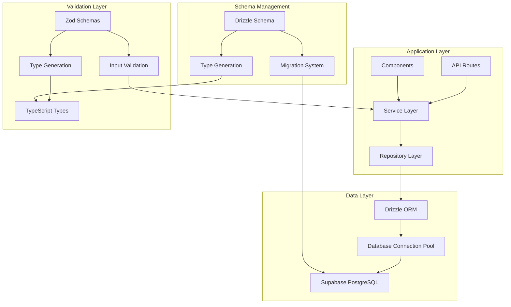
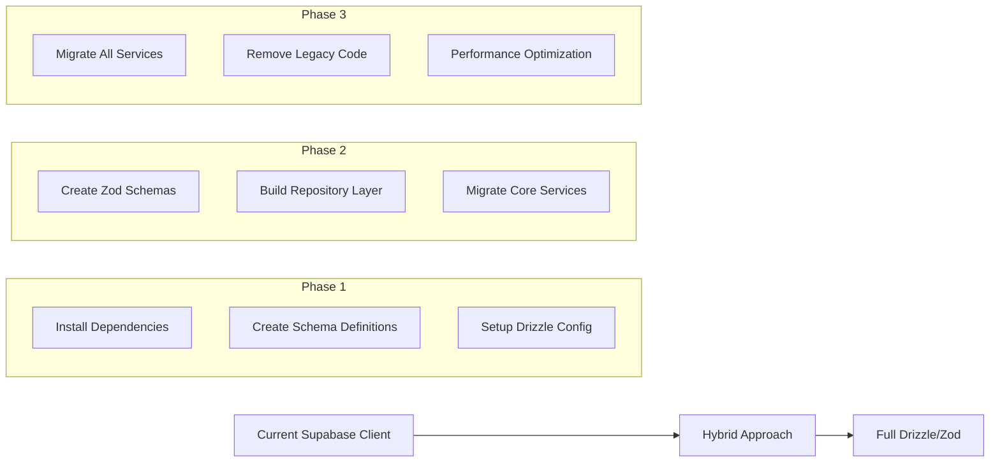

# Database Modernization Design Document

## Overview

This design outlines the modernization of the database layer by migrating from the current Supabase client-based approach to Drizzle ORM for type-safe database operations and Zod for comprehensive schema validation. The solution provides improved type safety, better developer experience, enhanced performance, and robust validation while maintaining backward compatibility during migration.

## Architecture

### High-Level Architecture



### Migration Strategy



## Components and Interfaces

### Drizzle Schema Definitions

**Database Schema Structure**
```typescript
// lib/db/schema/users.ts
import { pgTable, uuid, varchar, timestamp, jsonb, boolean } from 'drizzle-orm/pg-core'

export const users = pgTable('users', {
  id: uuid('id').primaryKey().defaultRandom(),
  clerkUserId: varchar('clerk_user_id', { length: 255 }).notNull().unique(),
  email: varchar('email', { length: 255 }).notNull(),
  firstName: varchar('first_name', { length: 100 }),
  lastName: varchar('last_name', { length: 100 }),
  avatarUrl: varchar('avatar_url', { length: 500 }),
  preferences: jsonb('preferences').default({}),
  createdAt: timestamp('created_at').defaultNow().notNull(),
  updatedAt: timestamp('updated_at').defaultNow().notNull()
})

export const organizations = pgTable('organizations', {
  id: uuid('id').primaryKey().defaultRandom(),
  name: varchar('name', { length: 255 }).notNull(),
  slug: varchar('slug', { length: 100 }).notNull().unique(),
  description: varchar('description', { length: 1000 }),
  avatarUrl: varchar('avatar_url', { length: 500 }),
  metadata: jsonb('metadata').default({}),
  settings: jsonb('settings').default({}),
  createdAt: timestamp('created_at').defaultNow().notNull(),
  updatedAt: timestamp('updated_at').defaultNow().notNull()
})

// Relations
export const usersRelations = relations(users, ({ many }) => ({
  memberships: many(organizationMemberships)
}))

export const organizationsRelations = relations(organizations, ({ many }) => ({
  memberships: many(organizationMemberships)
}))
```

### Zod Validation Schemas

**Validation Schema Structure**
```typescript
// lib/validation/schemas.ts
import { z } from 'zod'
import { createInsertSchema, createSelectSchema } from 'drizzle-zod'
import { users, organizations } from '@/lib/db/schema'

// Auto-generated base schemas from Drizzle
export const insertUserSchema = createInsertSchema(users)
export const selectUserSchema = createSelectSchema(users)

// Custom validation schemas with business rules
export const createUserSchema = insertUserSchema.omit({
  id: true,
  createdAt: true,
  updatedAt: true
}).extend({
  email: z.string().email('Invalid email format'),
  firstName: z.string().min(1, 'First name is required').max(100),
  lastName: z.string().min(1, 'Last name is required').max(100),
  preferences: z.record(z.unknown()).optional()
})

export const updateUserSchema = createUserSchema.partial().omit({
  clerkUserId: true
})

// API request/response schemas
export const userApiResponseSchema = selectUserSchema.extend({
  fullName: z.string(),
  membershipCount: z.number()
})

// Type exports
export type CreateUser = z.infer<typeof createUserSchema>
export type UpdateUser = z.infer<typeof updateUserSchema>
export type UserApiResponse = z.infer<typeof userApiResponseSchema>
```

### Repository Layer

**Repository Interface**
```typescript
// lib/repositories/base-repository.ts
export interface BaseRepository<TEntity, TInsert, TUpdate> {
  findById(id: string): Promise<TEntity | null>
  findMany(filters?: Record<string, unknown>): Promise<TEntity[]>
  create(data: TInsert): Promise<TEntity>
  update(id: string, data: TUpdate): Promise<TEntity>
  delete(id: string): Promise<void>
}

// lib/repositories/user-repository.ts
export class UserRepository implements BaseRepository<User, CreateUser, UpdateUser> {
  constructor(private db: DrizzleDatabase) {}

  async findById(id: string): Promise<User | null> {
    const result = await this.db
      .select()
      .from(users)
      .where(eq(users.id, id))
      .limit(1)

    return result[0] || null
  }

  async findByClerkId(clerkUserId: string): Promise<User | null> {
    const result = await this.db
      .select()
      .from(users)
      .where(eq(users.clerkUserId, clerkUserId))
      .limit(1)

    return result[0] || null
  }

  async create(data: CreateUser): Promise<User> {
    // Validate input data
    const validatedData = createUserSchema.parse(data)
    
    const result = await this.db
      .insert(users)
      .values(validatedData)
      .returning()

    return result[0]
  }

  async update(id: string, data: UpdateUser): Promise<User> {
    // Validate input data
    const validatedData = updateUserSchema.parse(data)
    
    const result = await this.db
      .update(users)
      .set({ ...validatedData, updatedAt: new Date() })
      .where(eq(users.id, id))
      .returning()

    if (result.length === 0) {
      throw new NotFoundError('User not found')
    }

    return result[0]
  }
}
```

### Service Layer Integration

**Service Layer with Validation**
```typescript
// lib/services/user-service.ts
export class UserService {
  constructor(
    private userRepository: UserRepository,
    private auditService: AuditService
  ) {}

  async createUser(data: unknown): Promise<UserApiResponse> {
    try {
      // Validate input with Zod
      const validatedData = createUserSchema.parse(data)
      
      // Check for existing user
      const existingUser = await this.userRepository.findByEmail(validatedData.email)
      if (existingUser) {
        throw new ValidationError('User with this email already exists')
      }

      // Create user
      const user = await this.userRepository.create(validatedData)
      
      // Log audit event
      await this.auditService.logEvent({
        action: 'user.created',
        userId: user.id,
        metadata: { email: user.email }
      })

      // Transform for API response
      return userApiResponseSchema.parse({
        ...user,
        fullName: `${user.firstName} ${user.lastName}`.trim(),
        membershipCount: 0
      })
    } catch (error) {
      if (error instanceof z.ZodError) {
        throw new ValidationError('Invalid user data', error.errors)
      }
      throw error
    }
  }

  async updateUser(id: string, data: unknown): Promise<UserApiResponse> {
    try {
      // Validate input
      const validatedData = updateUserSchema.parse(data)
      
      // Update user
      const user = await this.userRepository.update(id, validatedData)
      
      // Log audit event
      await this.auditService.logEvent({
        action: 'user.updated',
        userId: user.id,
        metadata: { updatedFields: Object.keys(validatedData) }
      })

      // Get membership count
      const membershipCount = await this.getMembershipCount(user.id)

      return userApiResponseSchema.parse({
        ...user,
        fullName: `${user.firstName} ${user.lastName}`.trim(),
        membershipCount
      })
    } catch (error) {
      if (error instanceof z.ZodError) {
        throw new ValidationError('Invalid update data', error.errors)
      }
      throw error
    }
  }
}
```

## Data Models

### Drizzle Schema Types

```typescript
// Generated types from Drizzle schemas
export type User = InferSelectModel<typeof users>
export type NewUser = InferInsertModel<typeof users>
export type Organization = InferSelectModel<typeof organizations>
export type NewOrganization = InferInsertModel<typeof organizations>

// Extended types with relations
export type UserWithMemberships = User & {
  memberships: (OrganizationMembership & {
    organization: Organization
    role: Role
  })[]
}

export type OrganizationWithMembers = Organization & {
  memberships: (OrganizationMembership & {
    user: User
    role: Role
  })[]
}
```

### Validation Schema Types

```typescript
// API contract types from Zod schemas
export type CreateUserRequest = z.infer<typeof createUserSchema>
export type UpdateUserRequest = z.infer<typeof updateUserSchema>
export type UserResponse = z.infer<typeof userApiResponseSchema>

// Error types
export interface ValidationErrorDetail {
  field: string
  message: string
  code: string
}

export class ValidationError extends Error {
  constructor(
    message: string,
    public details: ValidationErrorDetail[]
  ) {
    super(message)
    this.name = 'ValidationError'
  }
}
```

## Error Handling

### Structured Error System

```typescript
// lib/errors/database-errors.ts
export class DatabaseError extends Error {
  constructor(
    message: string,
    public code: string,
    public cause?: Error
  ) {
    super(message)
    this.name = 'DatabaseError'
  }
}

export class ValidationError extends Error {
  constructor(
    message: string,
    public details: z.ZodError['errors'] | ValidationErrorDetail[]
  ) {
    super(message)
    this.name = 'ValidationError'
  }

  toApiResponse() {
    return {
      error: 'Validation failed',
      details: this.details.map(detail => ({
        field: 'path' in detail ? detail.path.join('.') : detail.field,
        message: detail.message,
        code: 'code' in detail ? detail.code : 'VALIDATION_ERROR'
      }))
    }
  }
}

// lib/errors/error-handler.ts
export function handleDatabaseError(error: unknown): never {
  if (error instanceof z.ZodError) {
    throw new ValidationError('Validation failed', error.errors)
  }
  
  if (error instanceof DatabaseError) {
    throw error
  }
  
  if (error && typeof error === 'object' && 'code' in error) {
    const dbError = error as { code: string; message: string }
    switch (dbError.code) {
      case '23505': // Unique violation
        throw new ValidationError('Duplicate entry', [])
      case '23503': // Foreign key violation
        throw new ValidationError('Referenced record not found', [])
      default:
        throw new DatabaseError(dbError.message, dbError.code)
    }
  }
  
  throw new DatabaseError('Unknown database error', 'UNKNOWN')
}
```

## Testing Strategy

### Unit Testing with Drizzle and Zod

```typescript
// __tests__/repositories/user-repository.test.ts
describe('UserRepository', () => {
  let db: DrizzleDatabase
  let repository: UserRepository

  beforeEach(async () => {
    db = createTestDatabase()
    repository = new UserRepository(db)
  })

  describe('create', () => {
    it('should create user with valid data', async () => {
      const userData = {
        clerkUserId: 'clerk_123',
        email: 'test@example.com',
        firstName: 'John',
        lastName: 'Doe'
      }

      const user = await repository.create(userData)

      expect(user).toMatchObject(userData)
      expect(user.id).toBeDefined()
      expect(user.createdAt).toBeDefined()
    })

    it('should throw validation error for invalid data', async () => {
      const invalidData = {
        email: 'invalid-email',
        firstName: ''
      }

      await expect(repository.create(invalidData))
        .rejects.toThrow(ValidationError)
    })
  })
})

// __tests__/validation/schemas.test.ts
describe('User Schemas', () => {
  describe('createUserSchema', () => {
    it('should validate correct user data', () => {
      const validData = {
        clerkUserId: 'clerk_123',
        email: 'test@example.com',
        firstName: 'John',
        lastName: 'Doe'
      }

      const result = createUserSchema.safeParse(validData)
      expect(result.success).toBe(true)
    })

    it('should reject invalid email', () => {
      const invalidData = {
        clerkUserId: 'clerk_123',
        email: 'invalid-email',
        firstName: 'John',
        lastName: 'Doe'
      }

      const result = createUserSchema.safeParse(invalidData)
      expect(result.success).toBe(false)
      expect(result.error?.errors[0].path).toEqual(['email'])
    })
  })
})
```

### Integration Testing

```typescript
// __tests__/integration/user-service.integration.test.ts
describe('UserService Integration', () => {
  let service: UserService
  let testDb: DrizzleDatabase

  beforeAll(async () => {
    testDb = await createTestDatabase()
    const repository = new UserRepository(testDb)
    const auditService = new AuditService(testDb)
    service = new UserService(repository, auditService)
  })

  it('should create user with full validation and audit trail', async () => {
    const userData = {
      clerkUserId: 'clerk_integration_test',
      email: 'integration@example.com',
      firstName: 'Integration',
      lastName: 'Test'
    }

    const user = await service.createUser(userData)

    expect(user.fullName).toBe('Integration Test')
    expect(user.membershipCount).toBe(0)

    // Verify audit log was created
    const auditLogs = await testDb
      .select()
      .from(auditLogs)
      .where(eq(auditLogs.userId, user.id))

    expect(auditLogs).toHaveLength(1)
    expect(auditLogs[0].action).toBe('user.created')
  })
})
```

## Migration Strategy

### Phase 1: Foundation Setup

1. **Install Dependencies**
   - Add Drizzle ORM and related packages
   - Add Zod and drizzle-zod integration
   - Configure build tools and type generation

2. **Schema Definition**
   - Create Drizzle schema definitions for all tables
   - Set up migration system
   - Generate initial TypeScript types

3. **Basic Infrastructure**
   - Create database connection with Drizzle
   - Set up repository base classes
   - Create error handling system

### Phase 2: Core Migration

1. **Validation Layer**
   - Create Zod schemas for all models
   - Implement validation utilities
   - Create type-safe API contracts

2. **Repository Layer**
   - Implement repositories for core entities
   - Add query builders and utilities
   - Create testing infrastructure

3. **Service Migration**
   - Migrate user management services
   - Migrate organization services
   - Update API routes to use new validation

### Phase 3: Complete Migration

1. **Remaining Services**
   - Migrate all remaining services
   - Update all API endpoints
   - Remove legacy code

2. **Performance Optimization**
   - Implement query optimization
   - Add caching layers
   - Performance monitoring

3. **Documentation and Training**
   - Update development documentation
   - Create migration guides
   - Team training on new patterns

## Performance Considerations

### Query Optimization

- Use Drizzle's query builder for optimal SQL generation
- Implement proper indexing strategies
- Use prepared statements for repeated queries
- Leverage connection pooling

### Caching Strategy

- Implement query result caching
- Use Redis for distributed caching
- Cache validation results where appropriate
- Implement cache invalidation strategies

### Monitoring and Metrics

- Query performance logging
- Validation error tracking
- Database connection monitoring
- Error rate and response time metrics