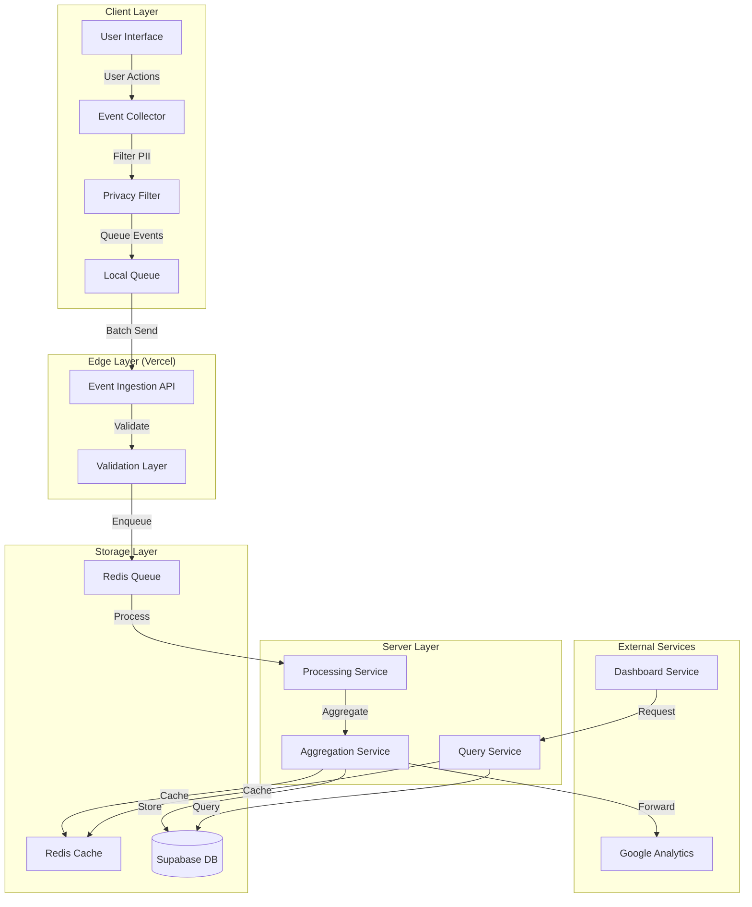

# Design Document

## Overview

The Deep Runtime Metrics system is a comprehensive analytics and monitoring solution designed for the C9D AI platform. The system follows a multi-layered architecture with client-side event collection, server-side aggregation, real-time processing, and multiple output channels. The design prioritizes privacy, performance, and scalability while providing actionable insights through Google Analytics integration and internal dashboards.

The system is built on Next.js 15+ with TypeScript, leveraging Supabase for data persistence, Redis for caching and queuing, and Vercel edge functions for distributed processing. The architecture ensures fault tolerance, data integrity, and compliance with privacy regulations.

## Architecture

### Integration with Existing C9D Platform

The Deep Runtime Metrics system integrates seamlessly with the existing C9D AI platform architecture:

**Existing Infrastructure Utilized**:
- **Monorepo**: Deployed within apps/web using existing Turborepo configuration
- **Environment Management**: Uses Phase.dev (AI.C9d.Web context) via existing env-wrapper
- **Authentication**: Integrates with existing Clerk setup (@clerk/nextjs)
- **Database**: Uses existing Supabase connection (NEXT_PUBLIC_SUPABASE_URL, SUPABASE_SERVICE_ROLE_KEY)
- **Caching**: Uses existing Upstash Redis (REDIS_URL, REDIS_TOKEN)
- **Deployment**: Follows existing Vercel configuration (vercel.json)
- **Testing**: Uses existing Vitest setup with memory management (NODE_OPTIONS)
- **Build System**: Integrates with existing Turborepo tasks (build, test, lint, typecheck)

**New Dependencies Required**:
- `bullmq`: Redis queue management (compatible with existing Upstash Redis)
- `fast-check`: Property-based testing library
- `@google-analytics/data`: Google Analytics 4 API client
- `tdigest`: Percentile calculation for performance metrics

**API Routes Structure**:
```
apps/web/app/api/metrics/
├── ingest/route.ts          # Edge function for event ingestion
├── query/route.ts           # Query aggregated metrics
├── events/route.ts          # Query raw events (admin)
├── performance/route.ts     # Query performance metrics
└── users/route.ts           # Query user-level metrics
```

**Service Layer Structure**:
```
apps/web/lib/services/metrics/
├── event-collector.ts       # Client-side event collection
├── privacy-filter.ts        # PII removal and anonymization
├── processing-service.ts    # Event processing and enrichment
├── aggregation-service.ts   # Metric aggregation
├── query-service.ts         # Query interface
└── ga-provider.ts          # Google Analytics integration
```

### High-Level Architecture



### Component Layers

1. **Client Layer**: Browser-based event collection with privacy filtering and local queuing
2. **Edge Layer**: Vercel edge functions for low-latency event ingestion and validation
3. **Server Layer**: Core processing, aggregation, and query services
4. **Storage Layer**: Redis for queuing/caching, Supabase for persistent storage
5. **External Services**: Google Analytics integration and dashboard visualization

## Components and Interfaces

### 1. Event Collector (Client-Side)

**Responsibility**: Capture user interactions and system events in the browser

**Interface**:
```typescript
interface EventCollector {
  track(event: MetricEvent): void
  trackPageView(page: PageViewEvent): void
  trackPerformance(metrics: PerformanceMetrics): void
  setUser(userId: string): void
  flush(): Promise<void>
}

interface MetricEvent {
  type: string
  action: string
  metadata?: Record<string, unknown>
  timestamp?: number
}

interface PageViewEvent {
  path: string
  referrer?: string
  title?: string
}

interface PerformanceMetrics {
  lcp?: number
  fid?: number
  cls?: number
  ttfb?: number
  customMetrics?: Record<string, number>
}
```

**Implementation Details**:
- Singleton pattern for global access
- Automatic batching with configurable batch size (default: 50 events)
- Automatic flush on page unload using `beforeunload` event
- Local storage fallback for offline support
- Maximum queue size: 1000 events
- Environment-aware behavior (development vs production modes)

**Simple Developer API** (Requirement 3.1):
```typescript
// Simple, intuitive API for developers
import { metrics } from '@/lib/metrics'

// Track custom events with metadata
metrics.track('button_clicked', {
  buttonId: 'checkout',
  page: '/cart',
  userId: user.id
})

// Track page views
metrics.trackPageView('/dashboard')

// Track performance metrics
metrics.trackPerformance({
  lcp: 2500,
  fid: 100,
  cls: 0.1
})

// Track custom business metrics
metrics.trackMetric('purchase_completed', {
  amount: 99.99,
  currency: 'USD',
  items: 3
})
```

**TypeScript Type Definitions** (Requirement 3.2):
```typescript
// Full TypeScript support for type safety
declare module '@/lib/metrics' {
  export interface MetricsClient {
    track(eventType: string, metadata?: Record<string, unknown>): void
    trackPageView(path: string, metadata?: Record<string, unknown>): void
    trackPerformance(metrics: PerformanceMetrics): void
    trackMetric(name: string, value: number | Record<string, unknown>): void
    setUser(userId: string): void
    flush(): Promise<void>
  }
  
  export const metrics: MetricsClient
}
```

**React Hooks Integration** (Requirement 3.4):
```typescript
// Custom React hooks for metrics tracking
export function useMetricsTracker() {
  const collector = useRef(EventCollector.getInstance())
  
  const track = useCallback((event: MetricEvent) => {
    collector.current.track(event)
  }, [])
  
  return { track, trackPageView, trackPerformance }
}

// Lifecycle tracking hook
export function useComponentMetrics(componentName: string) {
  useEffect(() => {
    const startTime = performance.now()
    EventCollector.getInstance().track({
      type: 'component_lifecycle',
      action: 'mount',
      metadata: { component: componentName }
    })
    
    return () => {
      const duration = performance.now() - startTime
      EventCollector.getInstance().track({
        type: 'component_lifecycle',
        action: 'unmount',
        metadata: { component: componentName, duration }
      })
    }
  }, [componentName])
}

// Feature usage tracking hook
export function useFeatureTracking(featureName: string) {
  const { track } = useMetricsTracker()
  
  useEffect(() => {
    track({
      type: 'feature_usage',
      action: 'accessed',
      metadata: { feature: featureName }
    })
  }, [featureName, track])
  
  return {
    trackAction: (action: string, metadata?: Record<string, unknown>) => {
      track({
        type: 'feature_usage',
        action,
        metadata: { feature: featureName, ...metadata }
      })
    }
  }
}
```

### 2. Privacy Filter (Client-Side)

**Responsibility**: Remove PII and apply privacy rules before event transmission

**Interface**:
```typescript
interface PrivacyFilter {
  filter(event: MetricEvent): FilteredEvent
  anonymizeUserId(userId: string): string
  shouldCollect(eventType: string): boolean
}

interface FilteredEvent extends MetricEvent {
  userId?: string // Anonymized
  sessionId: string
  // PII fields removed
}
```

**Implementation Details**:
- SHA-256 hashing for user ID anonymization
- Configurable PII field patterns (email, phone, SSN, etc.)
- Consent-based collection rules
- Automatic URL parameter sanitization

### 3. Event Ingestion API (Edge Function)

**Responsibility**: Receive and validate events from clients with low latency

**Endpoint**: `POST /api/metrics/ingest`

**Request Schema**:
```typescript
interface IngestRequest {
  events: FilteredEvent[]
  clientId: string
  timestamp: number
  signature?: string // Optional HMAC for verification
}
```

**Response Schema**:
```typescript
interface IngestResponse {
  success: boolean
  accepted: number
  rejected: number
  errors?: ValidationError[]
}
```

**Implementation Details**:
- Deployed as Vercel edge function (matches existing apps/web/app/api/**/*.ts pattern)
- Inherits existing Vercel configuration from vercel.json:
  - maxDuration: 30 seconds (existing setting)
  - memory: 1024MB (existing setting)
  - region: iad1 (existing deployment region)
- Rate limiting: 1000 requests per minute per client
- Request size limit: 1MB
- Zod schema validation (existing dependency)
- CORS configuration via existing Vercel headers in vercel.json
- Uses existing Vercel build command: `pnpm turbo build --filter=@c9d/web`

### 4. Processing Service (Server-Side)

**Responsibility**: Process events from Redis queue and prepare for aggregation

**Interface**:
```typescript
interface ProcessingService {
  processEvent(event: FilteredEvent): Promise<ProcessedEvent>
  enrichEvent(event: FilteredEvent): Promise<EnrichedEvent>
  validateEvent(event: FilteredEvent): ValidationResult
}

interface ProcessedEvent extends FilteredEvent {
  processedAt: number
  enrichedData?: Record<string, unknown>
  validationStatus: 'valid' | 'invalid'
}
```

**Implementation Details**:
- BullMQ queue consumer for Upstash Redis (existing REDIS_URL, REDIS_TOKEN)
- Concurrent processing with worker pool (4 workers)
- Event enrichment with geolocation, device info, etc.
- Dead letter queue for failed events
- Retry logic with exponential backoff (max 3 retries)
- Integrates with existing Redis connection pooling

### 5. Aggregation Service (Server-Side)

**Responsibility**: Aggregate processed events and compute metrics

**Interface**:
```typescript
interface AggregationService {
  aggregate(events: ProcessedEvent[]): Promise<AggregatedMetrics>
  computePercentiles(values: number[]): Percentiles
  updateTimeSeries(metric: string, value: number, timestamp: number): Promise<void>
}

interface AggregatedMetrics {
  eventCounts: Record<string, number>
  performanceMetrics: PerformanceAggregates
  userMetrics: UserAggregates
  timeSeriesData: TimeSeriesPoint[]
}

interface Percentiles {
  p50: number
  p75: number
  p95: number
  p99: number
}
```

**Implementation Details**:
- Time-window aggregation (1 minute, 5 minutes, 1 hour, 1 day)
- Sliding window calculations for real-time metrics
- Percentile calculation using t-digest algorithm
- Redis caching for frequently accessed aggregates
- Batch updates to Supabase (every 30 seconds)

### 6. Query Service (Server-Side)

**Responsibility**: Provide API for querying metrics data

**Endpoints**:
- `GET /api/metrics/query` - Query aggregated metrics
- `GET /api/metrics/events` - Query raw events (admin only)
- `GET /api/metrics/performance` - Query performance metrics
- `GET /api/metrics/users` - Query user-level metrics

**Query Interface**:
```typescript
interface MetricsQuery {
  startDate: string
  endDate: string
  eventTypes?: string[]
  aggregation?: 'sum' | 'avg' | 'count' | 'percentile'
  groupBy?: string[]
  filters?: QueryFilter[]
  limit?: number
  offset?: number
}

interface QueryFilter {
  field: string
  operator: 'eq' | 'ne' | 'gt' | 'lt' | 'in' | 'contains'
  value: unknown
}
```

**Implementation Details**:
- Clerk authentication required (existing @clerk/nextjs integration)
- Uses existing auth() from @clerk/nextjs/server
- Role-based access control (RBAC) via Clerk organizations
- Query result caching in Upstash Redis (TTL: 5 minutes)
- Query timeout: 30 seconds (matches Vercel function maxDuration)
- Pagination support (max 1000 results per page)

**Example API Implementation**:
```typescript
// app/api/metrics/query/route.ts
import { NextRequest, NextResponse } from 'next/server'
import { auth } from '@clerk/nextjs/server'
import { QueryService } from '@/lib/services/metrics'
import { handleApiError } from '@/lib/errors'
import { MetricsQuerySchema } from '@/lib/validation/metrics'

export async function GET(request: NextRequest) {
  try {
    // Clerk authentication (Requirement 5.5)
    const { userId, orgId } = auth()
    if (!userId) {
      return NextResponse.json({ error: 'Unauthorized' }, { status: 401 })
    }
    
    // Parse and validate query parameters
    const searchParams = request.nextUrl.searchParams
    const query = MetricsQuerySchema.parse({
      startDate: searchParams.get('startDate'),
      endDate: searchParams.get('endDate'),
      eventTypes: searchParams.get('eventTypes')?.split(','),
      aggregation: searchParams.get('aggregation'),
      limit: parseInt(searchParams.get('limit') || '100')
    })
    
    // Query with caching and RBAC
    const results = await QueryService.query(query, { userId, orgId })
    
    return NextResponse.json({ data: results })
  } catch (error) {
    return handleApiError(error)
  }
}
```

### 7. Google Analytics Integration

**Responsibility**: Forward events to Google Analytics 4

**Interface**:
```typescript
interface GoogleAnalyticsProvider {
  sendEvent(event: GAEvent): Promise<void>
  sendPageView(page: PageViewEvent): Promise<void>
  setUserProperties(properties: Record<string, unknown>): Promise<void>
}

interface GAEvent {
  name: string
  params: Record<string, unknown>
}
```

**Implementation Details**:
- GA4 Measurement Protocol API
- Event mapping from internal format to GA4 format
- Batch sending (max 25 events per request)
- Rate limiting compliance (60 requests per minute)
- Retry queue for failed transmissions

**Custom Dimensions and Metrics** (Requirement 7.4):
```typescript
interface GACustomDimensions {
  user_segment?: string
  organization_id?: string
  subscription_tier?: string
  feature_flags?: string
  user_role?: string
}

interface GACustomMetrics {
  session_duration?: number
  page_load_time?: number
  api_response_time?: number
  error_count?: number
  feature_usage_count?: number
}

// Map internal events to GA4 with custom dimensions/metrics
export class GoogleAnalyticsProvider {
  private mapToGA4Event(event: ProcessedEvent): GAEvent {
    return {
      name: this.normalizeEventName(event.eventType),
      params: {
        // Standard GA4 parameters
        event_category: event.eventType,
        event_label: event.action,
        
        // Custom dimensions
        user_segment: event.metadata?.userSegment,
        organization_id: event.metadata?.orgId,
        subscription_tier: event.metadata?.tier,
        
        // Custom metrics
        session_duration: event.metadata?.duration,
        page_load_time: event.metadata?.loadTime,
        
        // Additional metadata
        ...event.metadata
      }
    }
  }
}
```

### 8. Dashboard Service

**Responsibility**: Provide real-time visualization of metrics

**Components**:
- Real-time event stream display
- Performance metrics charts (LCP, FID, CLS)
- User behavior funnels
- Custom dashboard builder
- Alert configuration UI

**Implementation Details**:
- Server-Sent Events (SSE) for real-time updates
- React components with Recharts for visualization
- WebSocket fallback for SSE
- Dashboard state persistence in Supabase
- Export functionality (CSV, JSON)

**Custom Dashboard Builder** (Requirement 6.4):
```typescript
interface DashboardLayout {
  id: string
  userId: string
  name: string
  widgets: DashboardWidget[]
  layout: GridLayout
  isDefault: boolean
}

interface DashboardWidget {
  id: string
  type: 'chart' | 'table' | 'metric' | 'funnel'
  title: string
  config: WidgetConfig
  position: { x: number; y: number; w: number; h: number }
}

interface WidgetConfig {
  metricName: string
  aggregationType: 'sum' | 'avg' | 'count' | 'percentile'
  timeRange: string
  filters?: QueryFilter[]
  visualization?: 'line' | 'bar' | 'pie' | 'area'
}

// Dashboard customization service
export class DashboardService {
  static async saveLayout(layout: DashboardLayout): Promise<void>
  static async loadLayout(userId: string): Promise<DashboardLayout>
  static async createWidget(widget: DashboardWidget): Promise<DashboardWidget>
  static async updateWidget(widgetId: string, config: Partial<WidgetConfig>): Promise<void>
  static async deleteWidget(widgetId: string): Promise<void>
}
```

**Visualization Types**:
- Line charts for time-series data
- Bar charts for categorical comparisons
- Pie charts for distribution analysis
- Area charts for cumulative metrics
- Tables for detailed data views
- Funnel visualizations for conversion analysis

## Data Models

**Schema Alignment**: All schemas follow existing C9D platform patterns to ensure consistency across the platform:
- **Primary Keys**: UUID with `gen_random_uuid()` (matches existing user, organization tables)
- **Timestamps**: TIMESTAMPTZ for all date/time fields (matches existing schema)
- **Flexible Data**: JSONB for metadata and dynamic fields (matches existing patterns)
- **Naming Convention**: snake_case for column names (matches existing schema)
- **Audit Fields**: created_at, updated_at on all tables (matches existing patterns)
- **Indexes**: Proper indexing on frequently queried fields (follows existing optimization patterns)

**Datastore Usage Alignment**:
- **Supabase**: Uses existing connection pool and RLS patterns
- **Redis**: Uses existing Upstash Redis instance with separate key namespaces (`metrics:*`)
- **Clerk**: Uses existing authentication flow and user ID mapping

### Event Schema (Supabase)

**Migration File**: `apps/web/lib/db/migrations/XXXX_metrics_schema.sql`

```sql
-- Metric events table - stores all captured events
CREATE TABLE IF NOT EXISTS metric_events (
  id UUID PRIMARY KEY DEFAULT gen_random_uuid(),
  event_type VARCHAR(100) NOT NULL,
  action VARCHAR(100) NOT NULL,
  user_id_hash VARCHAR(64), -- Anonymized via SHA-256
  session_id VARCHAR(64) NOT NULL,
  metadata JSONB,
  timestamp TIMESTAMPTZ NOT NULL,
  processed_at TIMESTAMPTZ,
  created_at TIMESTAMPTZ DEFAULT NOW(),
  updated_at TIMESTAMPTZ DEFAULT NOW()
);

-- Indexes for query performance
CREATE INDEX IF NOT EXISTS idx_metric_events_event_type ON metric_events(event_type);
CREATE INDEX IF NOT EXISTS idx_metric_events_timestamp ON metric_events(timestamp);
CREATE INDEX IF NOT EXISTS idx_metric_events_session ON metric_events(session_id);
CREATE INDEX IF NOT EXISTS idx_metric_events_user_hash ON metric_events(user_id_hash);
CREATE INDEX IF NOT EXISTS idx_metric_events_created_at ON metric_events(created_at);

-- Composite index for common queries
CREATE INDEX IF NOT EXISTS idx_metric_events_type_timestamp ON metric_events(event_type, timestamp DESC);
```

### Aggregated Metrics Schema

```sql
-- Aggregated metrics table - stores pre-computed aggregations
CREATE TABLE IF NOT EXISTS aggregated_metrics (
  id UUID PRIMARY KEY DEFAULT gen_random_uuid(),
  metric_name VARCHAR(100) NOT NULL,
  metric_value NUMERIC NOT NULL,
  aggregation_type VARCHAR(20) NOT NULL, -- sum, avg, count, p50, p95, p99
  time_window VARCHAR(20) NOT NULL, -- 1m, 5m, 1h, 1d
  window_start TIMESTAMPTZ NOT NULL,
  window_end TIMESTAMPTZ NOT NULL,
  dimensions JSONB, -- Grouping dimensions (e.g., {page: '/dashboard', user_segment: 'premium'})
  created_at TIMESTAMPTZ DEFAULT NOW(),
  updated_at TIMESTAMPTZ DEFAULT NOW()
);

-- Indexes for query performance
CREATE INDEX IF NOT EXISTS idx_aggregated_metrics_name ON aggregated_metrics(metric_name);
CREATE INDEX IF NOT EXISTS idx_aggregated_metrics_window ON aggregated_metrics(window_start, window_end);
CREATE INDEX IF NOT EXISTS idx_aggregated_metrics_type ON aggregated_metrics(aggregation_type);

-- Unique constraint to prevent duplicate aggregations
CREATE UNIQUE INDEX IF NOT EXISTS idx_aggregated_metrics_unique 
  ON aggregated_metrics(metric_name, aggregation_type, time_window, window_start, (dimensions::text));
```

### Performance Metrics Schema

```sql
-- Performance metrics table - stores Core Web Vitals and custom performance data
CREATE TABLE IF NOT EXISTS performance_metrics (
  id UUID PRIMARY KEY DEFAULT gen_random_uuid(),
  session_id VARCHAR(64) NOT NULL,
  page_path VARCHAR(500) NOT NULL,
  lcp NUMERIC, -- Largest Contentful Paint (ms)
  fid NUMERIC, -- First Input Delay (ms)
  cls NUMERIC, -- Cumulative Layout Shift (score)
  ttfb NUMERIC, -- Time to First Byte (ms)
  fcp NUMERIC, -- First Contentful Paint (ms)
  custom_metrics JSONB, -- Additional custom performance metrics
  timestamp TIMESTAMPTZ NOT NULL,
  created_at TIMESTAMPTZ DEFAULT NOW(),
  updated_at TIMESTAMPTZ DEFAULT NOW()
);

-- Indexes for query performance
CREATE INDEX IF NOT EXISTS idx_performance_metrics_page_path ON performance_metrics(page_path);
CREATE INDEX IF NOT EXISTS idx_performance_metrics_timestamp ON performance_metrics(timestamp);
CREATE INDEX IF NOT EXISTS idx_performance_metrics_session ON performance_metrics(session_id);

-- Composite index for page performance queries
CREATE INDEX IF NOT EXISTS idx_performance_metrics_page_timestamp 
  ON performance_metrics(page_path, timestamp DESC);
```

### User Sessions Schema

```sql
-- User sessions table - tracks user session metadata
CREATE TABLE IF NOT EXISTS user_sessions (
  id UUID PRIMARY KEY DEFAULT gen_random_uuid(),
  session_id VARCHAR(64) UNIQUE NOT NULL,
  user_id_hash VARCHAR(64), -- Anonymized user identifier
  started_at TIMESTAMPTZ NOT NULL,
  ended_at TIMESTAMPTZ,
  page_views INTEGER DEFAULT 0,
  events_count INTEGER DEFAULT 0,
  device_type VARCHAR(50), -- mobile, tablet, desktop
  browser VARCHAR(50), -- chrome, firefox, safari, etc.
  os VARCHAR(50), -- windows, macos, linux, ios, android
  country VARCHAR(2), -- ISO 3166-1 alpha-2 country code
  referrer VARCHAR(500),
  landing_page VARCHAR(500),
  exit_page VARCHAR(500),
  metadata JSONB, -- Additional session metadata
  created_at TIMESTAMPTZ DEFAULT NOW(),
  updated_at TIMESTAMPTZ DEFAULT NOW()
);

-- Indexes for query performance
CREATE INDEX IF NOT EXISTS idx_user_sessions_session_id ON user_sessions(session_id);
CREATE INDEX IF NOT EXISTS idx_user_sessions_started_at ON user_sessions(started_at);
CREATE INDEX IF NOT EXISTS idx_user_sessions_user_hash ON user_sessions(user_id_hash);
CREATE INDEX IF NOT EXISTS idx_user_sessions_device_type ON user_sessions(device_type);

-- Composite index for user session queries
CREATE INDEX IF NOT EXISTS idx_user_sessions_user_started 
  ON user_sessions(user_id_hash, started_at DESC);
```

### Drizzle ORM Schema

**File**: `apps/web/lib/db/schema/metrics.ts`

```typescript
import { pgTable, uuid, varchar, timestamp, integer, numeric, jsonb, index, uniqueIndex } from 'drizzle-orm/pg-core'

export const metricEvents = pgTable('metric_events', {
  id: uuid('id').primaryKey().defaultRandom(),
  eventType: varchar('event_type', { length: 100 }).notNull(),
  action: varchar('action', { length: 100 }).notNull(),
  userIdHash: varchar('user_id_hash', { length: 64 }),
  sessionId: varchar('session_id', { length: 64 }).notNull(),
  metadata: jsonb('metadata'),
  timestamp: timestamp('timestamp', { withTimezone: true }).notNull(),
  processedAt: timestamp('processed_at', { withTimezone: true }),
  createdAt: timestamp('created_at', { withTimezone: true }).defaultNow(),
  updatedAt: timestamp('updated_at', { withTimezone: true }).defaultNow()
}, (table) => ({
  eventTypeIdx: index('idx_metric_events_event_type').on(table.eventType),
  timestampIdx: index('idx_metric_events_timestamp').on(table.timestamp),
  sessionIdx: index('idx_metric_events_session').on(table.sessionId),
  userHashIdx: index('idx_metric_events_user_hash').on(table.userIdHash)
}))

export const aggregatedMetrics = pgTable('aggregated_metrics', {
  id: uuid('id').primaryKey().defaultRandom(),
  metricName: varchar('metric_name', { length: 100 }).notNull(),
  metricValue: numeric('metric_value').notNull(),
  aggregationType: varchar('aggregation_type', { length: 20 }).notNull(),
  timeWindow: varchar('time_window', { length: 20 }).notNull(),
  windowStart: timestamp('window_start', { withTimezone: true }).notNull(),
  windowEnd: timestamp('window_end', { withTimezone: true }).notNull(),
  dimensions: jsonb('dimensions'),
  createdAt: timestamp('created_at', { withTimezone: true }).defaultNow(),
  updatedAt: timestamp('updated_at', { withTimezone: true }).defaultNow()
}, (table) => ({
  metricNameIdx: index('idx_aggregated_metrics_name').on(table.metricName),
  windowIdx: index('idx_aggregated_metrics_window').on(table.windowStart, table.windowEnd)
}))

export const performanceMetrics = pgTable('performance_metrics', {
  id: uuid('id').primaryKey().defaultRandom(),
  sessionId: varchar('session_id', { length: 64 }).notNull(),
  pagePath: varchar('page_path', { length: 500 }).notNull(),
  lcp: numeric('lcp'),
  fid: numeric('fid'),
  cls: numeric('cls'),
  ttfb: numeric('ttfb'),
  fcp: numeric('fcp'),
  customMetrics: jsonb('custom_metrics'),
  timestamp: timestamp('timestamp', { withTimezone: true }).notNull(),
  createdAt: timestamp('created_at', { withTimezone: true }).defaultNow(),
  updatedAt: timestamp('updated_at', { withTimezone: true }).defaultNow()
}, (table) => ({
  pagePathIdx: index('idx_performance_metrics_page_path').on(table.pagePath),
  timestampIdx: index('idx_performance_metrics_timestamp').on(table.timestamp),
  sessionIdx: index('idx_performance_metrics_session').on(table.sessionId)
}))

export const userSessions = pgTable('user_sessions', {
  id: uuid('id').primaryKey().defaultRandom(),
  sessionId: varchar('session_id', { length: 64 }).notNull().unique(),
  userIdHash: varchar('user_id_hash', { length: 64 }),
  startedAt: timestamp('started_at', { withTimezone: true }).notNull(),
  endedAt: timestamp('ended_at', { withTimezone: true }),
  pageViews: integer('page_views').default(0),
  eventsCount: integer('events_count').default(0),
  deviceType: varchar('device_type', { length: 50 }),
  browser: varchar('browser', { length: 50 }),
  os: varchar('os', { length: 50 }),
  country: varchar('country', { length: 2 }),
  referrer: varchar('referrer', { length: 500 }),
  landingPage: varchar('landing_page', { length: 500 }),
  exitPage: varchar('exit_page', { length: 500 }),
  metadata: jsonb('metadata'),
  createdAt: timestamp('created_at', { withTimezone: true }).defaultNow(),
  updatedAt: timestamp('updated_at', { withTimezone: true }).defaultNow()
}, (table) => ({
  sessionIdIdx: index('idx_user_sessions_session_id').on(table.sessionId),
  startedAtIdx: index('idx_user_sessions_started_at').on(table.startedAt),
  userHashIdx: index('idx_user_sessions_user_hash').on(table.userIdHash)
}))
```

## Correctness Properties

*A property is a characteristic or behavior that should hold true across all valid executions of a system—essentially, a formal statement about what the system should do. Properties serve as the bridge between human-readable specifications and machine-verifiable correctness guarantees.*


### Property Reflection

After reviewing all testable properties from the prework analysis, I've identified opportunities to consolidate and eliminate redundancy:

**Consolidations:**
- Properties 1.1 and 1.2 can be combined: both test that events are captured with required fields
- Properties 2.1 and 2.3 can be combined: both test privacy filtering (PII removal and anonymization)
- Properties 7.1 and 7.2 can be combined: both test GA event forwarding and mapping
- Properties 8.1 and 8.2 can be combined: both test offline queuing behavior

**Unique Properties Retained:**
- Each remaining property provides distinct validation value
- Performance properties (query time, latency) test different SLAs
- Error handling properties test different failure scenarios
- Security properties test different aspects of data protection

### Correctness Properties

Property 1: Event capture completeness
*For any* trackable user action, when captured by the Event Collector, the resulting event should contain timestamp, user identifier, action type, and contextual metadata fields.
**Validates: Requirements 1.1, 1.2**

Property 2: Non-blocking event queuing
*For any* sequence of rapidly occurring events, queuing those events should not block the user interface or cause measurable UI lag.
**Validates: Requirements 1.3**

Property 3: Event validation before queuing
*For any* event submitted to the Event Collector, validation should occur before the event is added to the queue, and invalid events should be rejected.
**Validates: Requirements 1.5**

Property 4: Privacy filter completeness
*For any* event containing personally identifiable information, after passing through the Privacy Filter, the event should have all PII removed and user identifiers anonymized via one-way hashing.
**Validates: Requirements 2.1, 2.3**

Property 5: Consent-based collection
*For any* event type marked as optional, when user consent is not granted, the Metrics System should not collect or store that event.
**Validates: Requirements 2.2**

Property 6: Data retention enforcement
*For any* stored metric event, when the retention period expires, the event should be automatically removed from storage.
**Validates: Requirements 2.4**

Property 7: Error handling resilience
*For any* error occurring during event tracking, the error should be logged without throwing exceptions or disrupting application functionality.
**Validates: Requirements 3.3**

Property 8: Custom metadata preservation
*For any* event with custom metadata key-value pairs, the metadata should be preserved exactly as provided through the entire pipeline.
**Validates: Requirements 3.5**

Property 9: Performance threshold alerting
*For any* performance metric that exceeds its defined threshold, an alert should be triggered to the monitoring service.
**Validates: Requirements 4.2**

Property 10: Percentile calculation accuracy
*For any* set of performance metric values, the calculated percentiles (p50, p95, p99) should match the mathematical definition of percentiles within acceptable precision.
**Validates: Requirements 4.5**

Property 11: Query filtering correctness
*For any* metrics query with filters (date range, event type, user segment), the returned results should contain only events matching all specified filters.
**Validates: Requirements 5.2**

Property 12: Query performance SLA
*For any* standard metrics query, the response time should be less than 2 seconds from request to response.
**Validates: Requirements 5.3**

Property 13: Authentication enforcement
*For any* API request to the Aggregation Service, authentication should be required and permissions should be validated before processing the request.
**Validates: Requirements 5.5**

Property 14: Dashboard latency SLA
*For any* event occurrence, the event should appear in the Dashboard Service within 5 seconds of being captured.
**Validates: Requirements 6.1**

Property 15: Automatic dashboard refresh
*For any* metrics data update, all active dashboard visualizations should refresh automatically without manual intervention.
**Validates: Requirements 6.3**

Property 16: Google Analytics event forwarding
*For any* processed event marked as relevant for GA, the event should be forwarded to Google Analytics with correct mapping to GA4 event format.
**Validates: Requirements 7.1, 7.2**

Property 17: Google Analytics fault tolerance
*For any* event when Google Analytics is unavailable, the event should be queued for retry and eventually delivered without data loss.
**Validates: Requirements 7.3**

Property 18: Google Analytics rate limiting
*For any* batch of events sent to Google Analytics, the system should respect GA rate limits and batch requests appropriately (max 25 events per request, 60 requests per minute).
**Validates: Requirements 7.5**

Property 19: Offline event persistence
*For any* event captured when the Aggregation Service or network is unavailable, the event should be persisted locally and transmitted when connectivity is restored.
**Validates: Requirements 8.1, 8.2**

Property 20: Exponential backoff retry
*For any* failed processing attempt, retry attempts should follow exponential backoff timing (e.g., 1s, 2s, 4s, 8s).
**Validates: Requirements 8.3**

Property 21: Event ordering preservation
*For any* sequence of events queued for retry, the events should be processed in the same order they were originally captured.
**Validates: Requirements 8.4**

Property 22: Log sanitization
*For any* error log entry, sensitive data (PII, tokens, passwords) should be sanitized before the log is written.
**Validates: Requirements 10.5**

## Error Handling

### Error Categories

1. **Validation Errors**: Invalid event structure, missing required fields
2. **Network Errors**: Connection failures, timeouts, DNS resolution failures
3. **Service Errors**: External service unavailability (GA, Supabase, Redis)
4. **Storage Errors**: Local storage quota exceeded, database write failures
5. **Authentication Errors**: Invalid tokens, expired sessions, insufficient permissions
6. **Rate Limiting Errors**: Too many requests, quota exceeded

### Error Handling Strategy

**Client-Side Errors** (Requirement 3.3):
- Log errors to console in development mode
- Queue events for retry on network/service errors
- Discard events on validation errors after logging
- **Never throw exceptions that could crash the application**
- Provide user feedback only for critical errors
- All tracking methods wrapped in try-catch blocks
- Silent failure mode for non-critical errors

**Error Handling Implementation**:
```typescript
export class EventCollector {
  track(event: MetricEvent): void {
    try {
      // Validate event
      const validatedEvent = this.validateEvent(event)
      
      // Filter PII
      const filteredEvent = this.privacyFilter.filter(validatedEvent)
      
      // Queue event
      this.queue.enqueue(filteredEvent)
      
    } catch (error) {
      // Log error without disrupting application
      if (process.env.NODE_ENV === 'development') {
        console.error('[Metrics] Failed to track event:', error)
      }
      
      // Report to error tracking service (non-blocking)
      this.reportError(error).catch(() => {
        // Silently fail if error reporting fails
      })
      
      // Never throw - application continues normally
    }
  }
}
```

**Server-Side Errors**:
- Return appropriate HTTP status codes (400, 401, 429, 500, 503)
- Log errors with structured data for debugging
- Implement circuit breaker pattern for external services
- Use dead letter queue for persistently failing events
- Alert on error rate thresholds

**Error Response Format**:
```typescript
interface ErrorResponse {
  error: {
    code: string
    message: string
    details?: Record<string, unknown>
    timestamp: number
  }
}
```

### Retry Logic

**Exponential Backoff Configuration**:
- Initial delay: 1 second
- Maximum delay: 60 seconds
- Backoff multiplier: 2
- Maximum retries: 5
- Jitter: ±20% to prevent thundering herd

**Retry Conditions**:
- Network errors: Always retry
- 5xx server errors: Always retry
- 429 rate limiting: Retry with backoff
- 4xx client errors: Do not retry (except 408, 429)
- Validation errors: Do not retry

## Testing Strategy

### Unit Testing

**Client-Side Components**:
- Event Collector: Test event capture, batching, and flushing
- Privacy Filter: Test PII removal and anonymization
- Local Queue: Test queue operations, capacity limits, and persistence

**Server-Side Services**:
- Processing Service: Test event enrichment and validation
- Aggregation Service: Test metric calculations and time-window aggregation
- Query Service: Test query parsing, filtering, and result formatting

**Test Coverage Requirements**:
- Services (`lib/services/**`): 100% coverage
- Models (`lib/models/**`): 95% coverage
- API Routes (`app/api/**`): 90% coverage
- Global minimum: 85% coverage

**CRITICAL REQUIREMENT - 100% Test Success Rate**:
- ALL tests MUST pass with 100% success rate for tasks to be considered complete
- Zero tolerance for failing tests
- Zero tolerance for skipped tests (unless explicitly marked as optional)
- Tests must be reliable and deterministic
- Flaky tests must be fixed before task completion
- CI/CD pipeline must show green (all tests passing)

### Property-Based Testing

**Property Testing Library**: fast-check (for TypeScript/JavaScript)

**Configuration**: Each property test should run a minimum of 100 iterations

**Property Test Implementation**:
- Each correctness property must be implemented as a single property-based test
- Tests must be tagged with: `**Feature: deep-runtime-metrics, Property {number}: {property_text}**`
- Use generators for random event data, user IDs, timestamps, and metadata
- Test edge cases through generator configuration (empty strings, large numbers, special characters)

**Example Property Test Structure**:
```typescript
import fc from 'fast-check'

/**
 * Feature: deep-runtime-metrics, Property 1: Event capture completeness
 * Validates: Requirements 1.1, 1.2
 */
test('captured events contain all required fields', () => {
  fc.assert(
    fc.property(
      fc.record({
        type: fc.string(),
        action: fc.string(),
        metadata: fc.dictionary(fc.string(), fc.anything())
      }),
      (userAction) => {
        const event = eventCollector.track(userAction)
        
        expect(event).toHaveProperty('timestamp')
        expect(event).toHaveProperty('userId')
        expect(event).toHaveProperty('type')
        expect(event).toHaveProperty('action')
        expect(event).toHaveProperty('metadata')
      }
    ),
    { numRuns: 100 }
  )
})
```

### Integration Testing

**CRITICAL REQUIREMENT**: All integration tests MUST use real services (Supabase, Redis, Clerk) - NO MOCKING.

**Test Data Lifecycle Management**:
- Each test creates its own test data with unique identifiers (timestamps, UUIDs)
- Test data is tracked in arrays (e.g., `createdTestData: string[]`)
- Cleanup occurs in `afterAll()` hooks in reverse dependency order
- Tests are idempotent - can run multiple times without conflicts
- Tests support parallel execution through unique identifiers

**API Integration Tests**:
- Test event ingestion endpoint with real Upstash Redis queue
- Test query API with real Supabase database
- Test Google Analytics integration with test GA property (via Phase.dev)
- Test authentication flow with real Clerk (using test users)
- All tests load configuration from Phase.dev (AI.C9d.Web context)
- Fallback to local environment variables if Phase.dev unavailable

**Database Integration Tests** (following existing patterns):
```typescript
describe('Metrics Database Integration', () => {
  let supabase: any
  let createdTestData: string[] = []
  
  beforeAll(async () => {
    // Load from Phase.dev
    const result = await loadFromPhase(true)
    const TEST_DATABASE_URL = result.variables.NEXT_PUBLIC_SUPABASE_URL
    const TEST_SERVICE_ROLE_KEY = result.variables.SUPABASE_SERVICE_ROLE_KEY
    
    supabase = createClient(TEST_DATABASE_URL, TEST_SERVICE_ROLE_KEY)
  })
  
  afterAll(async () => {
    // Cleanup in reverse dependency order
    for (const id of createdTestData.reverse()) {
      // Delete test data
    }
  })
  
  it('should create metric event with unique identifier', async () => {
    const testEvent = {
      event_type: `test_event_${Date.now()}`,
      session_id: `test_session_${Date.now()}`,
      // ... unique test data
    }
    
    const { data } = await supabase.from('metric_events').insert(testEvent).select().single()
    createdTestData.push(`event-${data.id}`)
    
    expect(data).toBeDefined()
  })
})
```

**Redis Integration Tests**:
- Test BullMQ queue operations with real Upstash Redis
- Test event queuing and processing
- Test retry logic and dead letter queue
- Use unique queue names per test run for isolation

**Clerk Integration Tests** (following existing patterns):
```typescript
describe('Metrics Clerk Integration', () => {
  let clerkClient: any
  let createdTestUsers: string[] = []
  
  beforeAll(async () => {
    // Load from Phase.dev
    const result = await loadFromPhase(true)
    const TEST_CLERK_SECRET_KEY = result.variables.CLERK_SECRET_KEY
    
    const { clerkClient: clerk } = await import('@clerk/nextjs/server')
    clerkClient = clerk
  })
  
  afterAll(async () => {
    // Cleanup test users
    for (const userId of createdTestUsers) {
      await clerkClient.users.deleteUser(userId)
    }
  })
  
  it('should authenticate metrics API request', async () => {
    const testUser = await clerkClient.users.createUser({
      emailAddress: [`test_${Date.now()}@example.com`],
      password: 'TestPassword123!'
    })
    createdTestUsers.push(testUser.id)
    
    // Test API with real Clerk auth
  })
})
```

**Idempotency Requirements**:
- Use timestamps in test data identifiers: `test_event_${Date.now()}`
- Use UUIDs for unique identifiers where appropriate
- Tests can run in parallel without conflicts
- Tests can run multiple times without leaving orphaned data
- Cleanup is comprehensive and handles partial failures

### End-to-End Testing

**CRITICAL REQUIREMENT**: All E2E tests MUST follow Clerk authentication guidelines and manage their own seed data.

**E2E Authentication** (following Clerk guidelines):
```typescript
import { test, expect } from '@playwright/test'
import { clerkSetup, clerk } from '@clerk/testing/playwright'

test.describe('Metrics Dashboard E2E', () => {
  test.beforeEach(async ({ page }) => {
    await clerkSetup()
    
    // Create test user for this test run
    const testUser = await clerk.users.createUser({
      emailAddress: [`e2e_test_${Date.now()}@example.com`],
      password: 'TestPassword123!'
    })
    
    // Sign in with test user
    await clerk.signIn({
      identifier: testUser.emailAddresses[0].emailAddress,
      password: 'TestPassword123!'
    })
  })
  
  test.afterEach(async () => {
    // Cleanup test user and associated data
  })
})
```

**Seed Data Management**:
- Each E2E test creates its own seed data with unique identifiers
- Seed data includes: test users, test events, test sessions
- All seed data is tracked and cleaned up after test completion
- Tests are idempotent - can run multiple times without conflicts
- Tests support parallel execution through unique identifiers

**User Journey Tests** (Playwright):
1. **Event Capture Journey**:
   - Create test user with unique email
   - User performs actions → Events captured → Events appear in dashboard
   - Verify events in database with unique session_id
   - Cleanup test user and events

2. **Performance Metrics Journey**:
   - Create test user and seed performance data
   - User views performance metrics → Metrics displayed correctly
   - Verify metrics calculations
   - Cleanup test data

3. **Admin Query Journey**:
   - Create admin test user with appropriate role
   - Seed test metrics data with unique identifiers
   - Admin queries metrics → Results returned with correct filters
   - Cleanup admin user and test data

4. **Offline Handling Journey**:
   - Create test user and simulate offline state
   - System handles offline → Events queued → Events sent when online
   - Verify event persistence and transmission
   - Cleanup test data

**Performance Tests**:
- Load testing: 10,000 events per second (with unique test identifiers)
- Latency testing: End-to-end event latency < 5 seconds
- Query performance: Standard queries < 2 seconds
- Dashboard refresh: Real-time updates within 5 seconds
- All performance tests use isolated test data
- Cleanup after performance test completion

**E2E Test Data Cleanup Pattern**:
```typescript
test.describe('Metrics E2E Tests', () => {
  let testUserId: string
  let testSessionId: string
  let createdEventIds: string[] = []
  
  test.beforeEach(async ({ page }) => {
    // Create unique test user
    testUserId = `e2e_user_${Date.now()}`
    testSessionId = `e2e_session_${Date.now()}`
    
    // Seed test data with unique identifiers
  })
  
  test.afterEach(async () => {
    // Cleanup in reverse dependency order
    for (const eventId of createdEventIds.reverse()) {
      await deleteEvent(eventId)
    }
    await deleteSession(testSessionId)
    await deleteUser(testUserId)
  })
  
  test('should track events end-to-end', async ({ page }) => {
    // Test with unique identifiers
    // Track created data for cleanup
  })
})
```

### Testing Environment Configuration

**Development Environment**:
- Use Phase.dev test context (AI.C9d.Web with PHASE_ENV=test)
- Use existing Vitest configuration with memory management
- Use separate Supabase project for testing (via Phase.dev)
- Use Redis instance with separate database number (via Phase.dev)
- Use Google Analytics test property (via Phase.dev)
- Enable debug logging and console output
- Run with: NODE_OPTIONS="--max-old-space-size=8192" env-wrapper vitest

**CI/CD Environment**:
- Phase.dev provides environment variables via PHASE_SERVICE_TOKEN
- Use existing Turborepo test task configuration
- Mock external services (Google Analytics) using existing test patterns
- Run tests with proper memory allocation (existing NODE_OPTIONS configuration)
- Use existing Vitest pool configuration (forks with singleFork: true)
- Collect coverage reports with existing @vitest/coverage-v8
- Enforce existing coverage thresholds (85% global, 100% services, 95% models, 90% API)

## Development & Testing Modes

### Environment-Specific Behavior (Requirement 9)

**Development Mode** (NODE_ENV=development):
- Events routed to development endpoint: `/api/metrics/ingest?env=dev`
- Debug logging enabled in browser console
- Detailed error messages with stack traces
- Event validation with verbose error reporting
- Mock Analytics Providers available for testing
- No rate limiting applied
- Shorter batch intervals (1 second vs 5 seconds)

**Test Mode** (NODE_ENV=test):
- All external API calls disabled (Google Analytics, etc.)
- Events stored in memory for test assertions
- Synchronous event processing (no batching delays)
- Mock implementations for all external services
- Deterministic behavior for reliable testing

**Production Mode** (NODE_ENV=production):
- Events routed to production endpoint: `/api/metrics/ingest`
- Minimal logging (errors only)
- Full rate limiting and security measures
- Optimized batching and compression
- Real external service integrations

**Debug Mode Configuration**:
```typescript
interface MetricsConfig {
  environment: 'development' | 'test' | 'production'
  debug: boolean
  endpoint?: string
  batchSize?: number
  flushInterval?: number
  enableConsoleLogging?: boolean
}

// Enable debug mode
EventCollector.configure({
  environment: 'development',
  debug: true,
  enableConsoleLogging: true
})
```

**Mock Analytics Providers** (Requirement 9.3):
```typescript
// Test-friendly mock for Google Analytics
export class MockGoogleAnalyticsProvider implements GoogleAnalyticsProvider {
  private events: GAEvent[] = []
  
  async sendEvent(event: GAEvent): Promise<void> {
    this.events.push(event)
  }
  
  getEvents(): GAEvent[] {
    return this.events
  }
  
  clear(): void {
    this.events = []
  }
}

// Use in tests
const mockGA = new MockGoogleAnalyticsProvider()
MetricsSystem.configure({ analyticsProvider: mockGA })
```

## Performance Considerations

### Client-Side Optimization

- **Event Batching**: Batch events to reduce network requests (default: 50 events or 5 seconds)
- **Compression**: Use gzip compression for event payloads
- **Lazy Loading**: Load metrics SDK asynchronously to not block page load
- **Web Workers**: Process events in background thread for heavy computations
- **Local Storage**: Use IndexedDB for offline queue (more capacity than localStorage)

### Server-Side Optimization

- **Connection Pooling**: Maintain connection pools for Supabase and Redis
- **Query Optimization**: Use database indexes and query optimization
- **Caching Strategy**: Cache aggregated metrics in Redis (TTL: 5 minutes)
- **Batch Processing**: Process events in batches of 100
- **Horizontal Scaling**: Deploy multiple processing workers

### Database Optimization

- **Partitioning**: Partition events table by timestamp (monthly partitions)
- **Indexes**: Create indexes on frequently queried fields
- **Archival**: Move old data to cold storage after retention period
- **Materialized Views**: Use for complex aggregations
- **Read Replicas**: Use read replicas for query-heavy operations

## Security Considerations

### Data Protection

- **Encryption in Transit**: TLS 1.3 for all network communications
- **Encryption at Rest**: Supabase encryption for stored data
- **Token Security**: Rotate API tokens regularly, store in environment variables
- **PII Protection**: Never store raw PII, always anonymize
- **Access Control**: Implement RBAC for API access

### Authentication & Authorization

- **Clerk Integration**: Use Clerk for user authentication
- **API Keys**: Require API keys for programmatic access
- **Rate Limiting**: Implement per-client rate limiting
- **CORS**: Configure CORS for allowed origins only
- **Input Validation**: Validate all inputs with Zod schemas

### Compliance

- **GDPR**: Support data deletion requests, data export
- **CCPA**: Provide opt-out mechanisms for tracking
- **Data Retention**: Implement configurable retention policies
- **Audit Logging**: Log all data access and modifications
- **Privacy Policy**: Document data collection and usage

**User Data Deletion** (Requirement 2.5):
```typescript
export class DataDeletionService {
  /**
   * Delete all metrics data associated with a user
   * Completes within specified timeframe (24-48 hours)
   */
  static async deleteUserData(userIdHash: string): Promise<DeletionResult> {
    const deletionId = uuidv4()
    
    // Create deletion request record
    await this.createDeletionRequest(deletionId, userIdHash)
    
    // Queue deletion job (processed asynchronously)
    await this.queueDeletionJob({
      deletionId,
      userIdHash,
      requestedAt: new Date(),
      status: 'pending'
    })
    
    return {
      deletionId,
      status: 'pending',
      estimatedCompletion: new Date(Date.now() + 48 * 60 * 60 * 1000)
    }
  }
  
  /**
   * Process deletion job - removes data from all tables
   */
  private static async processDeletionJob(job: DeletionJob): Promise<void> {
    const { userIdHash } = job
    
    // Delete in reverse dependency order
    await this.deletePerformanceMetrics(userIdHash)
    await this.deleteMetricEvents(userIdHash)
    await this.deleteUserSessions(userIdHash)
    await this.deleteAggregatedMetrics(userIdHash)
    
    // Update deletion request status
    await this.updateDeletionStatus(job.deletionId, 'completed')
    
    // Audit log
    await this.logDeletion(userIdHash, 'completed')
  }
}
```

## Deployment Strategy

### Infrastructure

- **Hosting**: Vercel (existing configuration in vercel.json)
- **Database**: Supabase (existing NEXT_PUBLIC_SUPABASE_URL, SUPABASE_SERVICE_ROLE_KEY)
- **Cache/Queue**: Upstash Redis (existing REDIS_URL, REDIS_TOKEN)
- **CDN**: Vercel Edge Network (iad1 region)
- **Authentication**: Clerk (existing NEXT_PUBLIC_CLERK_PUBLISHABLE_KEY, CLERK_SECRET_KEY)
- **Environment Management**: Phase.dev (existing PHASE_SERVICE_TOKEN, env-wrapper)
- **Monitoring**: Vercel Analytics, existing error tracking

### Environment Configuration

**Development**:
- Phase.dev context: AI.C9d.Web (development)
- Supabase development project (via Phase.dev)
- Google Analytics test property (via Phase.dev)
- Debug logging enabled
- Local testing with env-wrapper

**Staging**:
- Phase.dev context: AI.C9d.Web (staging)
- Supabase staging project (via Phase.dev)
- Google Analytics staging property (via Phase.dev)
- Reduced data retention (7 days)

**Production**:
- Phase.dev context: AI.C9d.Web (production)
- Supabase production project (via Phase.dev)
- Google Analytics production property (via Phase.dev)
- Full data retention (90 days)
- Vercel production deployment

### Deployment Pipeline

1. **Environment Setup**: Phase.dev loads environment variables via vercel-phase-prebuild
2. **Install**: pnpm install --frozen-lockfile (existing Vercel configuration)
3. **Build**: pnpm turbo build --filter=@c9d/web (existing Turborepo task)
4. **Test**: NODE_OPTIONS="--max-old-space-size=8192" pnpm test (existing test configuration)
5. **Lint**: pnpm lint (existing Turborepo task)
6. **Typecheck**: pnpm typecheck (existing Turborepo task)
7. **Deploy**: Deploy to Vercel with Phase.dev environment configuration
8. **Smoke Test**: Run basic health checks post-deployment
9. **Monitor**: Watch error rates and performance metrics

### Rollback Strategy

- **Instant Rollback**: Vercel instant rollback to previous deployment
- **Feature Flags**: Use feature flags for gradual rollout
- **Database Migrations**: Use reversible migrations
- **Data Backup**: Automated daily backups of Supabase

## Monitoring & Observability

### Metrics to Monitor

**System Health**:
- Event ingestion rate (events/second)
- Processing latency (p50, p95, p99)
- Queue depth and processing lag
- Error rate by error type
- API response times

**Business Metrics**:
- Active users and sessions
- Page views and user journeys
- Feature usage statistics
- Performance metrics (Core Web Vitals)
- Conversion funnels

### Alerting

**Critical Alerts** (PagerDuty):
- Event ingestion failure > 5 minutes
- Database connection failure
- Redis unavailability
- Error rate > 5%

**Warning Alerts** (Slack):
- Queue depth > 10,000 events
- Processing lag > 1 minute
- Query latency > 5 seconds
- Storage capacity > 80%

### Logging

**Structured Logging Format**:
```typescript
{
  timestamp: string
  level: 'debug' | 'info' | 'warn' | 'error'
  service: string
  message: string
  context: Record<string, unknown>
  traceId?: string
}
```

**Log Levels**:
- **Debug**: Detailed diagnostic information (development only)
- **Info**: General informational messages
- **Warn**: Warning messages for potential issues
- **Error**: Error messages for failures

## Future Enhancements

### Phase 2 Features

- **Machine Learning**: Anomaly detection for unusual patterns
- **Predictive Analytics**: Forecast future trends
- **A/B Testing Integration**: Track experiment metrics
- **Custom Alerts**: User-defined alert rules
- **Data Export**: Scheduled exports to data warehouse

### Phase 3 Features

- **Real-time Collaboration**: Shared dashboard viewing
- **Advanced Visualizations**: Heatmaps, cohort analysis
- **Mobile SDK**: Native iOS and Android SDKs
- **Webhook Integration**: Send events to external systems
- **GraphQL API**: Alternative query interface

## Quality Gates

### Definition of Done

A task is considered complete ONLY when ALL of the following criteria are met:

1. **100% Test Success Rate** (MANDATORY):
   - All unit tests pass
   - All integration tests pass (with real services)
   - All property-based tests pass (100+ iterations each)
   - All E2E tests pass
   - Zero failing tests
   - Zero skipped tests (unless explicitly optional)

2. **Code Quality** (MANDATORY):
   - `pnpm typecheck` passes with zero errors
   - `pnpm lint` passes with zero errors/warnings
   - `pnpm build` completes successfully
   - All imports resolve correctly

3. **Coverage Thresholds** (MANDATORY):
   - Services: 100% coverage achieved
   - Models: 95% coverage achieved
   - API Routes: 90% coverage achieved
   - Global: 85% minimum coverage achieved

4. **Integration Validation** (MANDATORY):
   - Real Supabase integration tested and passing
   - Real Redis integration tested and passing
   - Real Clerk integration tested and passing
   - Phase.dev configuration working correctly

5. **Documentation** (MANDATORY):
   - Code documented with JSDoc comments
   - API endpoints documented
   - Test data cleanup verified
   - No orphaned test data in datastores

**Failure to meet ANY of these criteria means the task is NOT complete.**

## Conclusion

The Deep Runtime Metrics system provides a comprehensive, privacy-first analytics solution for the C9D AI platform. The architecture ensures scalability, reliability, and performance while maintaining strict privacy standards. The multi-layered design with client-side collection, edge processing, and server-side aggregation provides flexibility and fault tolerance. Integration with Google Analytics and internal dashboards provides multiple channels for data analysis and visualization.

The design fully integrates with existing C9D platform infrastructure (Vercel, Turborepo, Phase.dev, Clerk, Supabase, Upstash Redis) and follows established patterns for testing, deployment, and quality assurance. All tests use real services with proper data lifecycle management to ensure production-ready quality.
