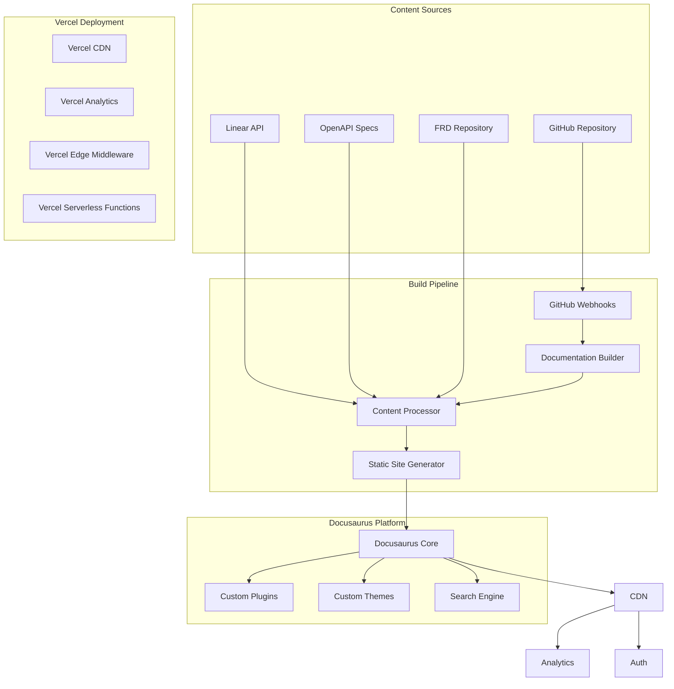
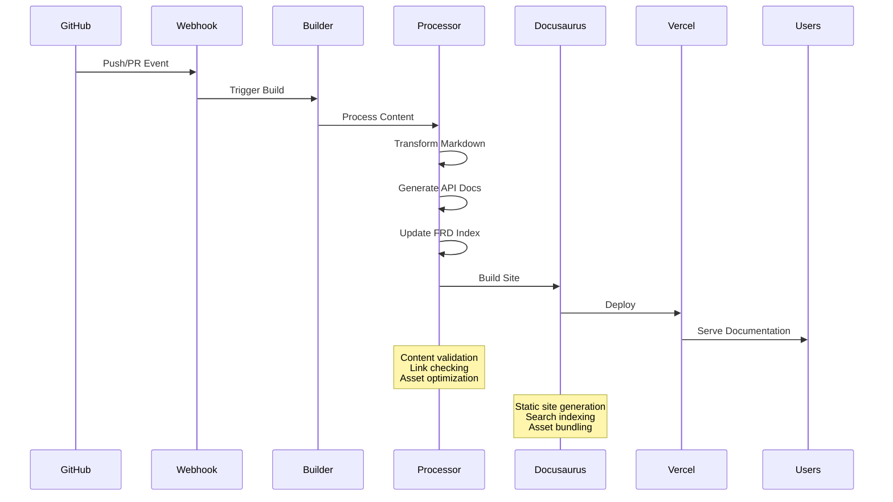
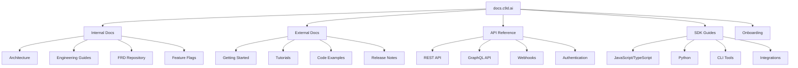

# Design Document

## Overview

The Developer Documentation Platform is built on Docusaurus v3 and provides a comprehensive documentation ecosystem that serves multiple audiences with role-based access controls. The platform integrates with GitHub for content management and automated deployment, Linear for requirements tracking, and the existing C9d.ai authentication system for access control. The architecture supports multiple documentation types with automated publishing workflows and advanced search capabilities.

The system follows a content-first approach where documentation is treated as code, enabling version control, automated testing, and continuous deployment of documentation updates.

## Architecture

### High-Level Architecture



### Content Processing Flow



### Documentation Structure



## Components and Interfaces

### Core Services

#### DocumentationService
```typescript
interface DocumentationService {
  buildDocumentation(source: ContentSource): Promise<BuildResult>
  publishDocumentation(buildId: string): Promise<DeploymentResult>
  validateContent(content: DocumentContent): Promise<ValidationResult>
  generateSearchIndex(documents: Document[]): Promise<SearchIndex>
  getDocumentationMetrics(): Promise<DocumentationMetrics>
}
```

#### ContentProcessor
```typescript
interface ContentProcessor {
  processMarkdown(content: string, metadata: DocumentMetadata): Promise<ProcessedContent>
  generateAPIDocumentation(openApiSpec: OpenAPISpec): Promise<APIDocumentation>
  extractFRDContent(frdPath: string): Promise<FRDDocument>
  validateLinks(document: Document): Promise<LinkValidationResult>
  optimizeAssets(assets: Asset[]): Promise<OptimizedAsset[]>
}
```

#### IntegrationService
```typescript
interface IntegrationService {
  syncWithGitHub(repository: string, branch: string): Promise<SyncResult>
  createLinearTickets(frdDocuments: FRDDocument[]): Promise<LinearTicket[]>
  updateLinearStatus(ticketId: string, status: string): Promise<void>
  fetchOpenAPISpecs(endpoints: string[]): Promise<OpenAPISpec[]>
  notifyStakeholders(changes: DocumentChange[]): Promise<NotificationResult>
}
```

#### SearchService
```typescript
interface SearchService {
  indexDocuments(documents: Document[]): Promise<void>
  search(query: string, filters: SearchFilters): Promise<SearchResult[]>
  suggestContent(query: string): Promise<ContentSuggestion[]>
  getSearchAnalytics(): Promise<SearchAnalytics>
  updateSearchIndex(documentId: string, content: string): Promise<void>
}
```

### Docusaurus Plugins

#### FRDPlugin
Custom plugin for processing and displaying Feature Requirements Documents.

```typescript
interface FRDPluginOptions {
  frdPath: string
  linearIntegration: boolean
  autoGenerateTickets: boolean
  notificationWebhook?: string
}
```

#### APIDocPlugin
Plugin for generating interactive API documentation from OpenAPI specifications.

```typescript
interface APIDocPluginOptions {
  openApiSpecs: OpenAPISpec[]
  interactiveExamples: boolean
  authenticationRequired: boolean
  rateLimitInfo: boolean
}
```

#### OnboardingPlugin
Plugin for creating structured onboarding experiences with progress tracking.

```typescript
interface OnboardingPluginOptions {
  onboardingPaths: OnboardingPath[]
  progressTracking: boolean
  certificateGeneration: boolean
  roleBasedContent: boolean
}
```

## Data Models

### Content Models

```typescript
interface Document {
  id: string
  title: string
  content: string
  metadata: DocumentMetadata
  version: string
  lastModified: Date
  author: string
  category: DocumentCategory
  accessLevel: AccessLevel
  tags: string[]
}

interface DocumentMetadata {
  frontMatter: Record<string, any>
  wordCount: number
  readingTime: number
  lastReviewed?: Date
  reviewers: string[]
  relatedDocuments: string[]
  linearTickets?: string[]
}

interface FRDDocument extends Document {
  requirements: Requirement[]
  status: 'draft' | 'review' | 'approved' | 'implemented'
  assignee?: string
  dueDate?: Date
  linearTicketId?: string
  implementationProgress: number
}

interface APIDocumentation {
  id: string
  title: string
  version: string
  openApiSpec: OpenAPISpec
  endpoints: APIEndpoint[]
  examples: CodeExample[]
  changelog: APIChange[]
  deprecationNotices: DeprecationNotice[]
}

interface OnboardingPath {
  id: string
  name: string
  description: string
  role: string
  steps: OnboardingStep[]
  estimatedDuration: number
  prerequisites: string[]
  completionCriteria: string[]
}

interface OnboardingStep {
  id: string
  title: string
  description: string
  content: string
  type: 'reading' | 'task' | 'quiz' | 'setup'
  estimatedTime: number
  required: boolean
  resources: Resource[]
}
```

### Build and Deployment Models

```typescript
interface BuildResult {
  buildId: string
  status: 'success' | 'failed' | 'warning'
  duration: number
  warnings: BuildWarning[]
  errors: BuildError[]
  generatedFiles: string[]
  metrics: BuildMetrics
}

interface DeploymentResult {
  deploymentId: string
  url: string
  status: 'deployed' | 'failed' | 'rollback'
  timestamp: Date
  version: string
  previousVersion?: string
  rollbackUrl?: string
}

interface ContentSource {
  type: 'github' | 'linear' | 'openapi' | 'manual'
  repository?: string
  branch?: string
  path?: string
  apiEndpoint?: string
  credentials?: Credentials
}
```

### Search Models

```typescript
interface SearchResult {
  id: string
  title: string
  content: string
  url: string
  category: string
  relevanceScore: number
  highlights: string[]
  metadata: SearchMetadata
}

interface SearchFilters {
  categories?: string[]
  accessLevels?: AccessLevel[]
  dateRange?: DateRange
  authors?: string[]
  tags?: string[]
  versions?: string[]
}

interface SearchAnalytics {
  totalSearches: number
  topQueries: QueryAnalytics[]
  noResultQueries: string[]
  clickThroughRates: Record<string, number>
  userSatisfactionScore: number
}
```

## Error Handling

### Build and Deployment Errors
- **BuildFailed**: Documentation build process encountered errors
- **ContentValidationFailed**: Content validation found errors or broken links
- **DeploymentFailed**: Failed to deploy documentation to hosting platform
- **AssetOptimizationFailed**: Asset processing or optimization failed
- **SearchIndexingFailed**: Failed to update search index

### Integration Errors
- **GitHubSyncFailed**: Failed to synchronize with GitHub repository
- **LinearIntegrationFailed**: Failed to create or update Linear tickets
- **OpenAPIFetchFailed**: Failed to fetch or process OpenAPI specifications
- **WebhookDeliveryFailed**: Failed to deliver webhook notifications
- **AuthenticationFailed**: Failed to authenticate with external services

### Content Errors
- **InvalidMarkdown**: Markdown content contains syntax errors
- **BrokenLinks**: Document contains broken internal or external links
- **MissingMetadata**: Required document metadata is missing or invalid
- **AccessViolation**: User lacks permission to access requested content
- **VersionConflict**: Document version conflicts detected

### Error Response Format
```typescript
interface DocumentationErrorResponse {
  error: {
    code: string
    message: string
    details?: {
      buildId?: string
      documentId?: string
      validationErrors?: ValidationError[]
      brokenLinks?: string[]
      suggestions?: string[]
    }
    timestamp: string
    requestId: string
  }
}
```

## Testing Strategy

### Unit Testing
- **Content Processing**: Test Markdown processing, link validation, and asset optimization
- **Plugin Functionality**: Test custom Docusaurus plugins and their configurations
- **Search Service**: Test search indexing, query processing, and result ranking
- **Integration Services**: Test GitHub, Linear, and OpenAPI integrations

### Integration Testing
- **Build Pipeline**: Test complete documentation build and deployment process
- **Webhook Processing**: Test GitHub webhook handling and automated builds
- **Authentication**: Test role-based access controls and permission enforcement
- **Search Integration**: Test search functionality across different content types

### End-to-End Testing
- **Documentation Workflow**: Test complete content creation, review, and publishing workflow
- **User Journeys**: Test different user paths through documentation (onboarding, API reference, etc.)
- **Cross-Platform**: Test documentation rendering across different devices and browsers
- **Performance**: Test page load times, search response times, and build performance

### Content Testing
- **Link Validation**: Automated testing of all internal and external links
- **Content Quality**: Test for spelling, grammar, and style consistency
- **Accessibility**: Test documentation accessibility compliance (WCAG 2.1)
- **SEO**: Test search engine optimization and metadata completeness

### Performance Testing
- **Build Performance**: Test build times with large documentation sets
- **Search Performance**: Test search response times with large content volumes
- **CDN Performance**: Test content delivery performance across geographic regions
- **Mobile Performance**: Test documentation performance on mobile devices

### Security Testing
- **Access Controls**: Test role-based access to internal documentation
- **Authentication**: Test integration with C9d.ai authentication system
- **Content Security**: Test for potential XSS vulnerabilities in user-generated content
- **API Security**: Test security of documentation API endpoints and webhooks