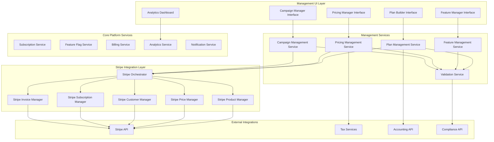
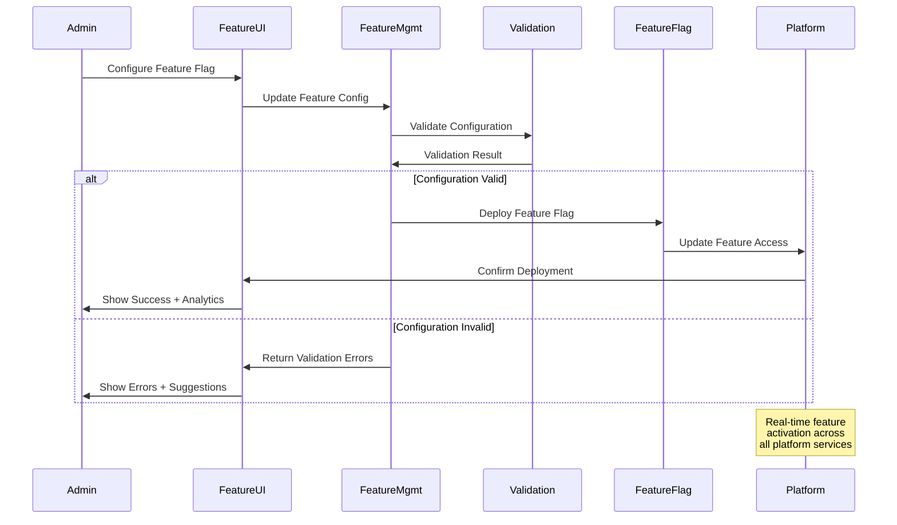
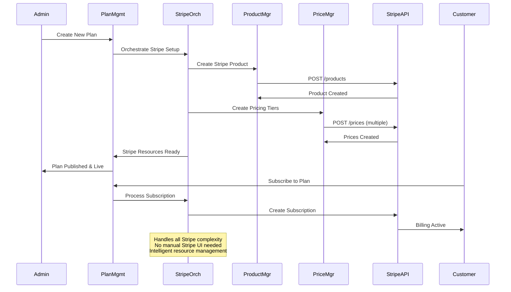
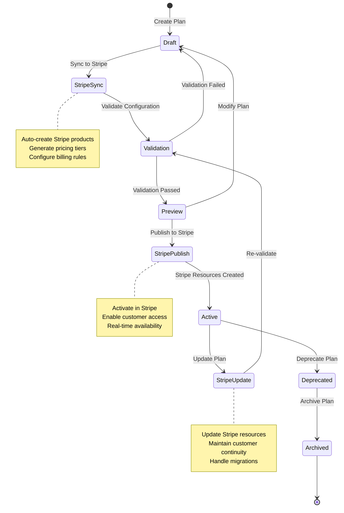

# Design Document

## Overview

The Feature Management & Subscription Management UI provides a comprehensive administrative interface for dynamically managing all aspects of the C9d.ai subscription system. Built as an extension of the existing System Administration Platform, this system enables real-time configuration of subscription plans, feature flags, pricing rules, and promotional campaigns without requiring code deployments. The architecture emphasizes user experience, validation, and immediate effect implementation while maintaining data integrity and system stability.

The design follows a component-based approach with specialized interfaces for different management domains, providing role-based access and comprehensive audit trails for all configuration changes.

## Architecture

### High-Level Architecture



### Feature Flag Management Flow



### Dynamic Stripe Integration Flow



### Subscription Plan Management Flow



## Components and Interfaces

### Core Management Services

#### PlanManagementService
```typescript
interface PlanManagementService {
  createPlan(planData: PlanConfiguration): Promise<SubscriptionPlan>
  updatePlan(planId: string, updates: PlanUpdates): Promise<SubscriptionPlan>
  validatePlan(planConfig: PlanConfiguration): Promise<ValidationResult>
  publishPlan(planId: string): Promise<PublishResult>
  deprecatePlan(planId: string, migrationPlan: MigrationPlan): Promise<void>
  getPlanAnalytics(planId: string, period: TimePeriod): Promise<PlanAnalytics>
  clonePlan(planId: string, modifications: PlanModifications): Promise<SubscriptionPlan>
}
```

#### FeatureManagementService
```typescript
interface FeatureManagementService {
  createFeatureFlag(flagConfig: FeatureFlagConfig): Promise<FeatureFlag>
  updateFeatureFlag(flagId: string, updates: FlagUpdates): Promise<FeatureFlag>
  toggleFeatureFlag(flagId: string, enabled: boolean): Promise<void>
  setRolloutPercentage(flagId: string, percentage: number): Promise<void>
  addTargetAudience(flagId: string, audience: TargetAudience): Promise<void>
  getFeatureAnalytics(flagId: string, period: TimePeriod): Promise<FeatureAnalytics>
  validateFeatureDependencies(flagId: string): Promise<DependencyValidation>
}
```

#### PricingManagementService
```typescript
interface PricingManagementService {
  createPricingRule(ruleConfig: PricingRuleConfig): Promise<PricingRule>
  updatePricingRule(ruleId: string, updates: RuleUpdates): Promise<PricingRule>
  createPromotion(promoConfig: PromotionConfig): Promise<Promotion>
  validatePricing(pricingConfig: PricingConfiguration): Promise<PricingValidation>
  calculatePrice(planId: string, usage: UsageData, context: PricingContext): Promise<PriceCalculation>
  getTaxConfiguration(region: string): Promise<TaxConfiguration>
  generatePricingPreview(config: PricingConfiguration): Promise<PricingPreview>
  createCustomerSpecificPricing(customerId: string, pricingConfig: CustomPricingConfig): Promise<CustomerPricing>
  createAlaCarteFeature(featureConfig: AlaCarteFeatureConfig): Promise<AlaCarteFeature>
}

#### StripeOrchestrationService
```typescript
interface StripeOrchestrationService {
  createPlanInStripe(planConfig: PlanConfiguration): Promise<StripeIntegrationResult>
  updatePlanInStripe(planId: string, updates: PlanUpdates): Promise<StripeIntegrationResult>
  createCustomerSpecificPlan(customerId: string, planConfig: CustomPlanConfig): Promise<StripeCustomPlan>
  createAlaCarteProduct(featureConfig: AlaCarteConfig): Promise<StripeProduct>
  syncPricingToStripe(pricingConfig: PricingConfiguration): Promise<StripePriceSync>
  createPromotionalCoupon(promoConfig: PromotionConfig): Promise<StripeCoupon>
  handleSubscriptionChange(subscriptionId: string, changes: SubscriptionChanges): Promise<StripeSubscriptionResult>
  processCustomerSpecificDiscount(customerId: string, discountConfig: DiscountConfig): Promise<StripeDiscount>
  createUsageBasedPricing(usageConfig: UsageBasedConfig): Promise<StripeUsagePricing>
  intelligentPriceOptimization(planId: string, optimizationGoals: OptimizationGoals): Promise<PriceOptimizationResult>
}
```

#### CampaignManagementService
```typescript
interface CampaignManagementService {
  createCampaign(campaignConfig: CampaignConfiguration): Promise<Campaign>
  updateCampaign(campaignId: string, updates: CampaignUpdates): Promise<Campaign>
  activateCampaign(campaignId: string): Promise<ActivationResult>
  pauseCampaign(campaignId: string): Promise<void>
  getCampaignPerformance(campaignId: string): Promise<CampaignMetrics>
  getTargetAudience(criteria: AudienceCriteria): Promise<AudienceSegment>
  validateCampaignRules(campaignConfig: CampaignConfiguration): Promise<ValidationResult>
}
```

### User Interface Components

#### PlanBuilder
Visual interface for creating and configuring subscription plans.

```typescript
interface PlanBuilderProps {
  existingPlan?: SubscriptionPlan
  onSave: (plan: PlanConfiguration) => void
  onPreview: (plan: PlanConfiguration) => void
  availableFeatures: Feature[]
  pricingTemplates: PricingTemplate[]
}

interface PlanBuilderState {
  planConfig: PlanConfiguration
  selectedFeatures: string[]
  pricingRules: PricingRule[]
  validationErrors: ValidationError[]
  previewMode: boolean
}
```

#### FeatureManagerInterface
Comprehensive interface for managing feature flags and access controls.

```typescript
interface FeatureManagerProps {
  onFeatureUpdate: (flagId: string, config: FeatureFlagConfig) => void
  onRolloutChange: (flagId: string, percentage: number) => void
  permissions: FeatureManagementPermission[]
}

interface FeatureManagerState {
  features: FeatureFlag[]
  selectedFeature?: string
  rolloutStatus: RolloutStatus[]
  analytics: FeatureAnalytics[]
  dependencyGraph: FeatureDependency[]
}
```

#### PricingConfigurationPanel
Interface for configuring complex pricing rules and promotional campaigns.

```typescript
interface PricingConfigurationProps {
  planId: string
  currentPricing: PricingConfiguration
  onPricingUpdate: (pricing: PricingConfiguration) => void
  supportedCurrencies: Currency[]
  taxRegions: TaxRegion[]
}

interface PricingRule {
  id: string
  type: 'flat' | 'usage' | 'tiered' | 'volume'
  parameters: PricingParameters
  conditions: PricingCondition[]
  discounts: Discount[]
  validFrom: Date
  validTo?: Date
}
```

#### CampaignBuilder
Interface for creating and managing marketing campaigns and promotions.

```typescript
interface CampaignBuilderProps {
  onCampaignCreate: (campaign: CampaignConfiguration) => void
  onAudienceSelect: (criteria: AudienceCriteria) => void
  availableOffers: OfferTemplate[]
  segmentationOptions: SegmentationOption[]
}

interface CampaignConfiguration {
  name: string
  description: string
  offerType: 'discount' | 'trial' | 'upgrade' | 'custom'
  targetAudience: AudienceCriteria
  schedule: CampaignSchedule
  budget: CampaignBudget
  goals: CampaignGoal[]
}
```

## Data Models

### Plan and Feature Models

```typescript
interface PlanConfiguration {
  name: string
  description: string
  tier: 'individual' | 'team' | 'enterprise'
  features: PlanFeature[]
  pricing: PricingConfiguration
  limits: UsageLimits
  billing: BillingConfiguration
  availability: AvailabilityRules
  metadata: PlanMetadata
  stripeIntegration: StripeIntegrationConfig
}

interface StripeIntegrationConfig {
  autoCreateProduct: boolean
  productMetadata: Record<string, string>
  pricingStrategy: 'standard' | 'usage_based' | 'tiered' | 'volume'
  billingInterval: 'month' | 'year' | 'week' | 'day'
  trialPeriodDays?: number
  taxBehavior: 'inclusive' | 'exclusive' | 'unspecified'
  currencyOptions: CurrencyOption[]
}

interface CustomPlanConfig {
  baseplanId: string
  customerId: string
  modifications: PlanModification[]
  pricingOverrides: PricingOverride[]
  featureOverrides: FeatureOverride[]
  billingOverrides: BillingOverride[]
  expirationDate?: Date
  approvalRequired: boolean
}

interface AlaCarteFeatureConfig {
  featureId: string
  name: string
  description: string
  pricing: AlaCartePricing
  availability: FeatureAvailability
  dependencies: string[]
  stripeProductConfig: StripeProductConfig
}

interface AlaCartePricing {
  type: 'one_time' | 'recurring' | 'usage_based'
  amount: number
  currency: string
  billingInterval?: 'month' | 'year'
  usageType?: 'metered' | 'licensed'
  tiers?: PricingTier[]
}

interface PlanFeature {
  featureId: string
  enabled: boolean
  configuration: FeatureConfiguration
  limits: FeatureLimits
  dependencies: string[]
  restrictions: FeatureRestriction[]
}

interface FeatureFlagConfig {
  name: string
  description: string
  type: 'boolean' | 'string' | 'number' | 'json'
  defaultValue: any
  rolloutStrategy: RolloutStrategy
  targetAudience: TargetAudience
  dependencies: FeatureDependency[]
  killSwitch: boolean
}

interface RolloutStrategy {
  type: 'percentage' | 'user_list' | 'attribute_based' | 'gradual'
  percentage?: number
  userList?: string[]
  attributes?: AttributeRule[]
  schedule?: RolloutSchedule
}
```

### Pricing and Campaign Models

```typescript
interface PricingConfiguration {
  basePrice: number
  currency: string
  billingCycle: 'monthly' | 'yearly' | 'usage'
  pricingRules: PricingRule[]
  discounts: Discount[]
  taxes: TaxConfiguration
  regionalPricing: RegionalPricing[]
}

interface Promotion {
  id: string
  name: string
  type: 'percentage' | 'fixed_amount' | 'free_trial' | 'upgrade'
  value: number
  conditions: PromotionCondition[]
  validFrom: Date
  validTo: Date
  usageLimit: number
  currentUsage: number
  targetPlans: string[]
}

interface Campaign {
  id: string
  name: string
  status: 'draft' | 'active' | 'paused' | 'completed' | 'cancelled'
  promotion: Promotion
  targetAudience: AudienceSegment
  schedule: CampaignSchedule
  budget: CampaignBudget
  performance: CampaignMetrics
  createdAt: Date
  updatedAt: Date
}

interface AudienceSegment {
  id: string
  name: string
  criteria: AudienceCriteria
  size: number
  characteristics: AudienceCharacteristics
  lastUpdated: Date
}
```

### Stripe Integration Models

```typescript
interface StripeIntegrationResult {
  success: boolean
  stripeProductId?: string
  stripePriceIds: string[]
  stripeCouponId?: string
  errors?: StripeError[]
  warnings?: StripeWarning[]
  rollbackPlan?: StripeRollbackPlan
}

interface StripeCustomPlan {
  stripeSubscriptionId: string
  customerId: string
  planConfiguration: CustomPlanConfig
  stripePriceOverrides: StripePriceOverride[]
  billingDetails: StripeBillingDetails
  activationDate: Date
  expirationDate?: Date
}

interface StripePriceSync {
  planId: string
  syncedPrices: SyncedPrice[]
  failedPrices: FailedPrice[]
  totalSynced: number
  totalFailed: number
  syncTimestamp: Date
}

interface CustomerPricing {
  customerId: string
  pricingRules: CustomPricingRule[]
  discounts: CustomerDiscount[]
  stripeCustomerData: StripeCustomerData
  effectiveDate: Date
  expirationDate?: Date
  approvedBy: string
}

interface AlaCarteFeature {
  id: string
  stripeProductId: string
  stripePriceId: string
  featureConfig: AlaCarteFeatureConfig
  availability: FeatureAvailability
  purchaseCount: number
  revenue: number
  createdAt: Date
}

interface PriceOptimizationResult {
  originalPricing: PricingConfiguration
  optimizedPricing: PricingConfiguration
  expectedImpact: OptimizationImpact
  confidence: number
  testingRecommendation: TestingRecommendation
  implementationPlan: ImplementationPlan
}

### Analytics and Validation Models

```typescript
interface PlanAnalytics {
  planId: string
  period: TimePeriod
  subscriptions: SubscriptionMetrics
  revenue: RevenueMetrics
  usage: UsageMetrics
  churn: ChurnMetrics
  conversion: ConversionMetrics
  satisfaction: SatisfactionMetrics
  stripeMetrics: StripeAnalytics
}

interface StripeAnalytics {
  totalRevenue: number
  subscriptionCount: number
  averageRevenuePerUser: number
  churnRate: number
  lifetimeValue: number
  paymentFailureRate: number
  refundRate: number
  couponUsage: CouponUsageMetrics
}

interface FeatureAnalytics {
  featureId: string
  period: TimePeriod
  adoption: AdoptionMetrics
  usage: FeatureUsageMetrics
  performance: PerformanceMetrics
  feedback: FeatureFeedback
  rolloutProgress: RolloutMetrics
}

interface ValidationResult {
  isValid: boolean
  errors: ValidationError[]
  warnings: ValidationWarning[]
  suggestions: ValidationSuggestion[]
  impact: ImpactAnalysis
}

interface ValidationError {
  field: string
  code: string
  message: string
  severity: 'error' | 'warning' | 'info'
  suggestedFix?: string
}

interface ImpactAnalysis {
  affectedCustomers: number
  revenueImpact: number
  systemLoad: LoadImpact
  migrationRequired: boolean
  rollbackComplexity: 'low' | 'medium' | 'high'
}
```

### A/B Testing Models

```typescript
interface ABTest {
  id: string
  name: string
  description: string
  status: 'draft' | 'running' | 'completed' | 'cancelled'
  variants: TestVariant[]
  trafficSplit: TrafficSplit
  metrics: TestMetric[]
  startDate: Date
  endDate?: Date
  results?: TestResults
}

interface TestVariant {
  id: string
  name: string
  configuration: PlanConfiguration | FeatureFlagConfig | PricingConfiguration
  trafficPercentage: number
  performance: VariantPerformance
}

interface TestResults {
  winner?: string
  confidence: number
  statisticalSignificance: boolean
  metrics: MetricComparison[]
  recommendations: TestRecommendation[]
  conclusionDate: Date
}
```

## Error Handling

### Configuration Errors
- **InvalidPlanConfiguration**: Plan configuration contains invalid or conflicting settings
- **FeatureDependencyViolation**: Feature flag configuration violates dependency requirements
- **PricingValidationFailed**: Pricing configuration fails validation rules or compliance requirements
- **CampaignConflict**: Campaign configuration conflicts with existing active campaigns
- **ComplianceViolation**: Configuration violates regulatory or compliance requirements

### Deployment Errors
- **FeatureRolloutFailed**: Feature flag deployment failed due to system issues
- **PlanActivationError**: Subscription plan activation encountered errors
- **PricingUpdateFailed**: Pricing rule update failed to deploy across billing systems
- **CampaignLaunchError**: Marketing campaign failed to launch due to configuration or system issues
- **ValidationServiceUnavailable**: Configuration validation service is temporarily unavailable

### Business Logic Errors
- **InsufficientPermissions**: User lacks required permissions for configuration changes
- **ConcurrentModification**: Multiple users attempting to modify the same configuration
- **CustomerImpactTooHigh**: Proposed changes would negatively impact too many existing customers
- **BudgetExceeded**: Campaign or pricing changes would exceed allocated budget limits
- **RegionalRestriction**: Configuration not allowed in specific geographic regions

### Error Response Format
```typescript
interface ConfigurationErrorResponse {
  error: {
    code: string
    message: string
    details?: {
      configurationId?: string
      affectedCustomers?: number
      suggestedActions?: string[]
      rollbackOptions?: string[]
      approvalRequired?: boolean
    }
    timestamp: string
    requestId: string
    severity: 'low' | 'medium' | 'high' | 'critical'
  }
}
```

## Testing Strategy

### Unit Testing
- **Management Services**: Test all configuration management operations and validation logic
- **UI Components**: Test plan builder, feature manager, and pricing configuration interfaces
- **Validation Logic**: Test configuration validation rules and compliance checking
- **Analytics Processing**: Test metrics calculation and reporting functionality

### Integration Testing
- **External Services**: Test integration with Stripe, tax services, and accounting systems
- **Feature Flag Deployment**: Test real-time feature flag activation and rollback
- **Billing Integration**: Test pricing rule deployment and billing system synchronization
- **Campaign Execution**: Test campaign activation and audience targeting

### End-to-End Testing
- **Plan Lifecycle**: Test complete subscription plan creation, activation, and retirement
- **Feature Rollout**: Test feature flag creation, gradual rollout, and full deployment
- **Campaign Management**: Test campaign creation, launch, monitoring, and completion
- **A/B Testing**: Test experiment setup, execution, and result analysis

### Business Logic Testing
- **Pricing Calculations**: Test complex pricing rules and promotional calculations
- **Feature Dependencies**: Test feature dependency validation and conflict resolution
- **Compliance Validation**: Test regulatory compliance checking and reporting
- **Impact Analysis**: Test customer impact analysis and migration planning

### Performance Testing
- **Configuration Deployment**: Test performance of real-time configuration changes
- **Analytics Processing**: Test analytics calculation performance with large datasets
- **UI Responsiveness**: Test interface performance with complex configurations
- **Concurrent Users**: Test system behavior with multiple simultaneous configuration changes

### User Experience Testing
- **Usability Testing**: Test interface usability for different administrative roles
- **Workflow Testing**: Test complete configuration workflows from creation to deployment
- **Error Handling**: Test error presentation and recovery workflows
- **Mobile Responsiveness**: Test administrative interfaces on mobile devices