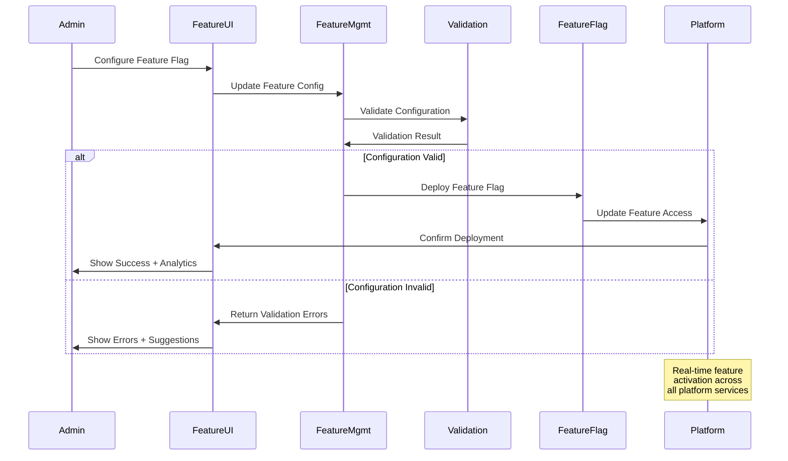
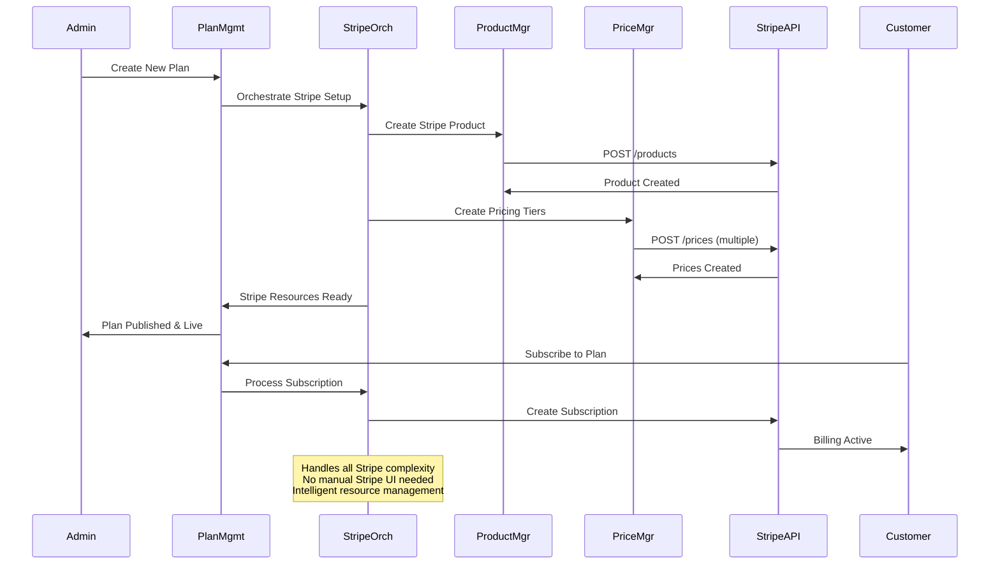
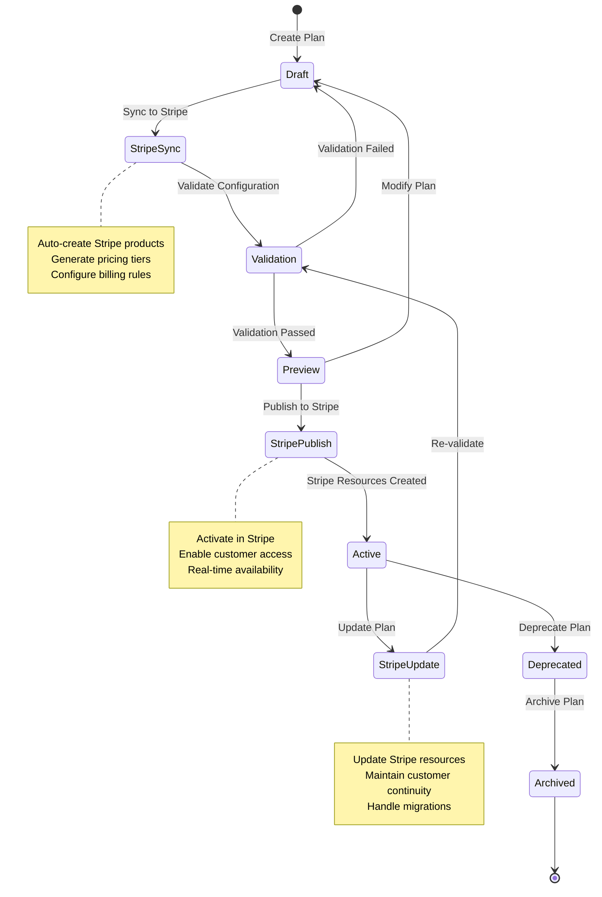
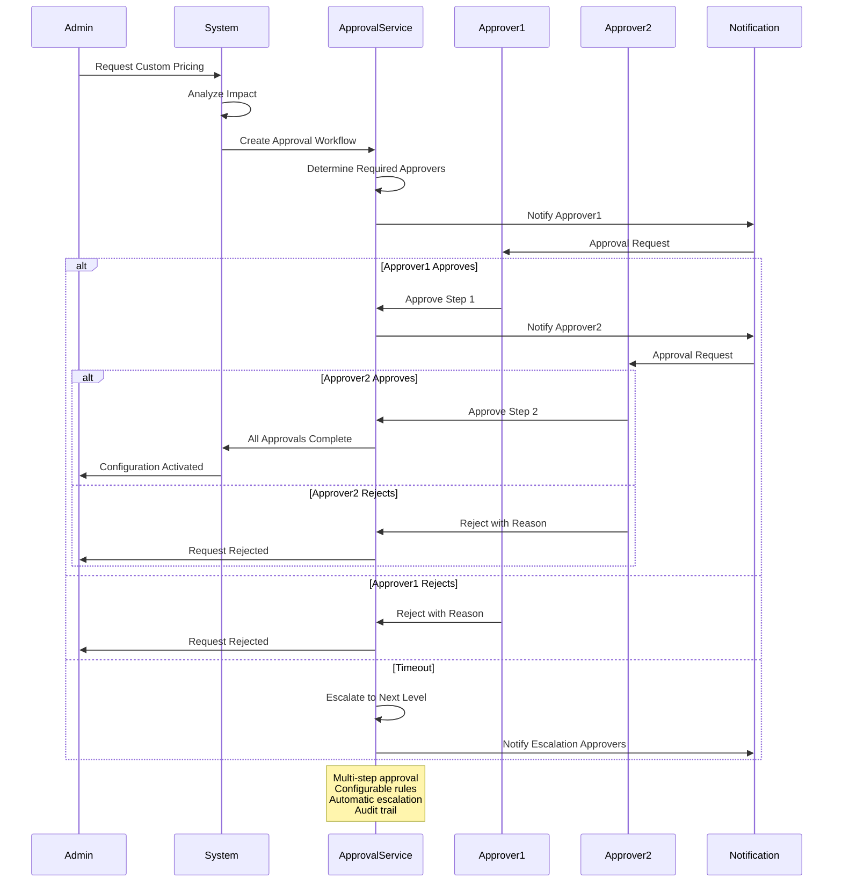
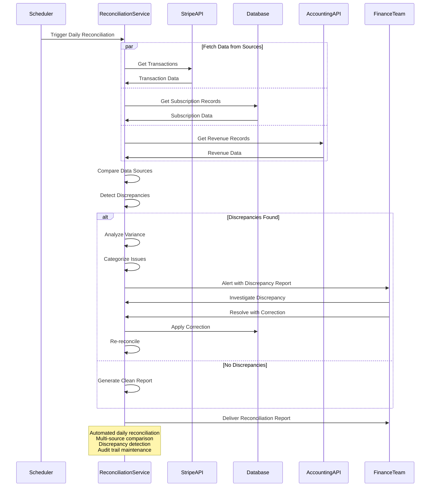

# Design Document

## Overview

The Feature Management & Subscription Management UI provides a comprehensive administrative interface for dynamically managing all aspects of the C9d.ai subscription system. Built as an extension of the existing System Administration Platform, this system enables real-time configuration of subscription plans, feature flags, pricing rules, and promotional campaigns without requiring code deployments. The architecture emphasizes user experience, validation, and immediate effect implementation while maintaining data integrity and system stability.

The design follows a component-based approach with specialized interfaces for different management domains, providing role-based access and comprehensive audit trails for all configuration changes.

## Architectural Alignment

### Vercel Deployment Architecture
This system is designed for optimal Vercel deployment following existing platform patterns:

**Next.js App Router (Mandatory)**:
- All routes use Next.js 15+ App Router with server components by default
- Client components marked explicitly with `'use client'` directive
- Proper data fetching patterns with async/await in server components
- Suspense boundaries for loading states

**API Routes (Vercel Serverless Functions)**:
- Implemented as Next.js API routes (`app/api/**`) leveraging Vercel serverless functions
- 30-second timeout limit for complex operations (Stripe integration, analytics)
- Proper error handling with `handleApiError` utility
- Authentication checks using Clerk's `auth()` from `@clerk/nextjs/server`

**Edge Runtime Optimization**:
- Configuration validation and lightweight operations use Vercel Edge Runtime
- Geographically distributed for low-latency responses
- Minimal dependencies for fast cold starts

**Environment Management**:
- All configuration managed through Phase.dev integration (existing pattern)
- No `.env` files committed to repository
- Context-specific configuration: `AI.C9d.Web` for web app
- All scripts wrapped with `phase run --context AI.C9d.Web`

**Build Optimization**:
- Turbo-optimized builds with proper caching strategies (existing turbo.json)
- pnpm workspace integration for monorepo management
- Proper dependency management with workspace protocol

**Preview Deployments**:
- Sandbox environments leverage Vercel preview deployments
- Separate Phase.dev contexts for staging/preview environments
- Automated deployment on pull requests

### Existing Infrastructure Integration

**Database Layer (Supabase) - Extends Existing Schema**:
- **Schema Extension**: New tables extend existing Supabase schema without modifying core tables
- **Foreign Key Relationships**: Links to existing `users(id)`, `organizations(id)`, `organization_members(id)`
- **RLS Policy Consistency**: Follows existing RLS patterns using `auth.uid()` and organization membership checks
- **Connection Pooling**: Uses existing `createSupabaseClient()` utility from `@/lib/database`
- **Query Patterns**: Follows existing service layer patterns with proper error handling
- **Migration Strategy**: Uses Supabase migration files in `supabase/migrations/` directory

**Existing Tables Referenced**:
```typescript
// Existing schema that subscription management integrates with
users {
  id: uuid (primary key)
  clerk_user_id: text (unique)
  email: text
  created_at: timestamptz
  updated_at: timestamptz
}

organizations {
  id: uuid (primary key)
  name: text
  created_at: timestamptz
  updated_at: timestamptz
}

organization_members {
  id: uuid (primary key)
  organization_id: uuid (foreign key)
  user_id: uuid (foreign key)
  role: text
  created_at: timestamptz
}
```

**Authentication (Clerk) - Existing Integration**:
- Uses existing Clerk integration from `@clerk/nextjs` and `@clerk/nextjs/server`
- Server-side: `auth()` function for API routes and server components
- Client-side: `useAuth()`, `useUser()`, `useOrganization()` hooks
- Organization membership and role management through existing patterns
- Extends existing RBAC system with subscription management permissions
- All user references use `clerk_user_id` for consistency

**Caching (Redis) - Existing Infrastructure**:
- Uses existing Redis client from `@/lib/cache/redis-client`
- Follows existing cache key naming conventions: `{service}:{entity}:{id}`
- Implements cache invalidation patterns consistent with existing services
- TTL management follows existing patterns (default 3600s)
- Cache warming strategies for frequently accessed configurations

**Monitoring & Observability - Existing Patterns**:
- Error tracking through existing Sentry integration
- Logging using existing structured logging patterns
- Performance monitoring extends existing metrics collection
- Alert and notification patterns follow existing infrastructure
- Audit logging integrates with existing audit trail system

## Architecture

### High-Level Architecture


```mermaid
graph TB
    subgraph "Management UI Layer"
        PlanBuilder[Plan Builder Interface]
        FeatureManager[Feature Manager Interface]
        PricingManager[Pricing Manager Interface]
        CampaignManager[Campaign Manager Interface]
        AnalyticsDashboard[Analytics Dashboard]
    end
    
    subgraph "Management Services"
        PlanMgmtService[Plan Management Service]
        FeatureMgmtService[Feature Management Service]
        PricingMgmtService[Pricing Management Service]
        CampaignMgmtService[Campaign Management Service]
        ValidationService[Validation Service]
        ApprovalService[Approval Workflow Service]
        CommunicationService[Communication Service]
        ReconciliationService[Financial Reconciliation Service]
    end
    
    subgraph "Core Platform Services"
        SubscriptionService[Subscription Service]
        FeatureFlagService[Feature Flag Service]
        BillingService[Billing Service]
        AnalyticsService[Analytics Service]
        NotificationService[Notification Service]
    end
    
    subgraph "Stripe Integration Layer"
        StripeOrchestrator[Stripe Orchestrator]
        ProductManager[Stripe Product Manager]
        PriceManager[Stripe Price Manager]
        CustomerManager[Stripe Customer Manager]
        SubscriptionManager[Stripe Subscription Manager]
        InvoiceManager[Stripe Invoice Manager]
    end
    
    subgraph "External Integrations"
        StripeAPI[Stripe API]
        TaxServices[Tax Services]
        AccountingAPI[Accounting API]
        ComplianceAPI[Compliance API]
    end
    
    PlanBuilder --> PlanMgmtService
    FeatureManager --> FeatureMgmtService
    PricingManager --> PricingMgmtService
    CampaignManager --> CampaignMgmtService
    AnalyticsDashboard --> AnalyticsService
    
    PlanMgmtService --> ValidationService
    FeatureMgmtService --> ValidationService
    PricingMgmtService --> ValidationService
    CampaignMgmtService --> ValidationService
    
    PlanMgmtService --> ApprovalService
    PricingMgmtService --> ApprovalService
    PlanMgmtService --> CommunicationService
    CampaignMgmtService --> CommunicationService
    
    StripeOrchestrator --> ReconciliationService
    BillingService --> ReconciliationService
    
    PlanMgmtService --> StripeOrchestrator
    PricingMgmtService --> StripeOrchestrator
    CampaignMgmtService --> StripeOrchestrator
    
    StripeOrchestrator --> ProductManager
    StripeOrchestrator --> PriceManager
    StripeOrchestrator --> CustomerManager
    StripeOrchestrator --> SubscriptionManager
    StripeOrchestrator --> InvoiceManager
    
    ProductManager --> StripeAPI
    PriceManager --> StripeAPI
    CustomerManager --> StripeAPI
    SubscriptionManager --> StripeAPI
    InvoiceManager --> StripeAPI
    
    PricingMgmtService --> TaxServices
    PlanMgmtService --> AccountingAPI
    ValidationService --> ComplianceAPI
```

### Feature Flag Management Flow


```mermaid
sequenceDiagram
    participant Admin
    participant FeatureUI
    participant FeatureMgmt
    participant Validation
    participant FeatureFlag
    participant Platform
    
    Admin->>FeatureUI: Configure Feature Flag
    FeatureUI->>FeatureMgmt: Update Feature Config
    FeatureMgmt->>Validation: Validate Configuration
    Validation->>FeatureMgmt: Validation Result
    
    alt Configuration Valid
        FeatureMgmt->>FeatureFlag: Deploy Feature Flag
        FeatureFlag->>Platform: Update Feature Access
        Platform->>FeatureUI: Confirm Deployment
        FeatureUI->>Admin: Show Success + Analytics
    else Configuration Invalid
        FeatureMgmt->>FeatureUI: Return Validation Errors
        FeatureUI->>Admin: Show Errors + Suggestions
    end
    
    Note over Platform: Real-time feature<br/>activation across<br/>all platform services
```

### Dynamic Stripe Integration Flow


```mermaid
sequenceDiagram
    participant Admin
    participant PlanMgmt
    participant StripeOrch
    participant ProductMgr
    participant PriceMgr
    participant StripeAPI
    participant Customer
    
    Admin->>PlanMgmt: Create New Plan
    PlanMgmt->>StripeOrch: Orchestrate Stripe Setup
    StripeOrch->>ProductMgr: Create Stripe Product
    ProductMgr->>StripeAPI: POST /products
    StripeAPI->>ProductMgr: Product Created
    
    StripeOrch->>PriceMgr: Create Pricing Tiers
    PriceMgr->>StripeAPI: POST /prices (multiple)
    StripeAPI->>PriceMgr: Prices Created
    
    StripeOrch->>PlanMgmt: Stripe Resources Ready
    PlanMgmt->>Admin: Plan Published & Live
    
    Customer->>PlanMgmt: Subscribe to Plan
    PlanMgmt->>StripeOrch: Process Subscription
    StripeOrch->>StripeAPI: Create Subscription
    StripeAPI->>Customer: Billing Active
    
    Note over StripeOrch: Handles all Stripe complexity<br/>No manual Stripe UI needed<br/>Intelligent resource management
```

### Subscription Plan Management Flow


```mermaid
stateDiagram-v2
    [*] --> Draft : Create Plan
    Draft --> StripeSync : Sync to Stripe
    StripeSync --> Validation : Validate Configuration
    Validation --> Draft : Validation Failed
    Validation --> Preview : Validation Passed
    Preview --> Draft : Modify Plan
    Preview --> StripePublish : Publish to Stripe
    StripePublish --> Active : Stripe Resources Created
    Active --> Deprecated : Deprecate Plan
    Active --> StripeUpdate : Update Plan
    StripeUpdate --> Validation : Re-validate
    Deprecated --> Archived : Archive Plan
    Archived --> [*]
    
    note right of StripeSync : Auto-create Stripe products<br/>Generate pricing tiers<br/>Configure billing rules
    note right of StripePublish : Activate in Stripe<br/>Enable customer access<br/>Real-time availability
    note right of StripeUpdate : Update Stripe resources<br/>Maintain customer continuity<br/>Handle migrations
```

### Approval Workflow Flow


```mermaid
sequenceDiagram
    participant Admin
    participant System
    participant ApprovalService
    participant Approver1
    participant Approver2
    participant Notification
    
    Admin->>System: Request Custom Pricing
    System->>System: Analyze Impact
    System->>ApprovalService: Create Approval Workflow
    ApprovalService->>ApprovalService: Determine Required Approvers
    
    ApprovalService->>Notification: Notify Approver1
    Notification->>Approver1: Approval Request
    
    alt Approver1 Approves
        Approver1->>ApprovalService: Approve Step 1
        ApprovalService->>Notification: Notify Approver2
        Notification->>Approver2: Approval Request
        
        alt Approver2 Approves
            Approver2->>ApprovalService: Approve Step 2
            ApprovalService->>System: All Approvals Complete
            System->>Admin: Configuration Activated
        else Approver2 Rejects
            Approver2->>ApprovalService: Reject with Reason
            ApprovalService->>Admin: Request Rejected
        end
    else Approver1 Rejects
        Approver1->>ApprovalService: Reject with Reason
        ApprovalService->>Admin: Request Rejected
    else Timeout
        ApprovalService->>ApprovalService: Escalate to Next Level
        ApprovalService->>Notification: Notify Escalation Approvers
    end
    
    note over ApprovalService: Multi-step approval<br/>Configurable rules<br/>Automatic escalation<br/>Audit trail
```

### Financial Reconciliation Flow


```mermaid
sequenceDiagram
    participant Scheduler
    participant ReconciliationService
    participant StripeAPI
    participant Database
    participant AccountingAPI
    participant FinanceTeam
    
    Scheduler->>ReconciliationService: Trigger Daily Reconciliation
    
    par Fetch Data from Sources
        ReconciliationService->>StripeAPI: Get Transactions
        StripeAPI->>ReconciliationService: Transaction Data
    and
        ReconciliationService->>Database: Get Subscription Records
        Database->>ReconciliationService: Subscription Data
    and
        ReconciliationService->>AccountingAPI: Get Revenue Records
        AccountingAPI->>ReconciliationService: Revenue Data
    end
    
    ReconciliationService->>ReconciliationService: Compare Data Sources
    ReconciliationService->>ReconciliationService: Detect Discrepancies
    
    alt Discrepancies Found
        ReconciliationService->>ReconciliationService: Analyze Variance
        ReconciliationService->>ReconciliationService: Categorize Issues
        ReconciliationService->>FinanceTeam: Alert with Discrepancy Report
        
        FinanceTeam->>ReconciliationService: Investigate Discrepancy
        FinanceTeam->>ReconciliationService: Resolve with Correction
        ReconciliationService->>Database: Apply Correction
        ReconciliationService->>ReconciliationService: Re-reconcile
    else No Discrepancies
        ReconciliationService->>ReconciliationService: Generate Clean Report
    end
    
    ReconciliationService->>FinanceTeam: Deliver Reconciliation Report
    
    note over ReconciliationService: Automated daily reconciliation<br/>Multi-source comparison<br/>Discrepancy detection<br/>Audit trail maintenance
```

## Components and Interfaces

### Core Management Services

#### PlanManagementService
```typescript
interface PlanManagementService {
  createPlan(planData: PlanConfiguration): Promise<SubscriptionPlan>
  updatePlan(planId: string, updates: PlanUpdates): Promise<SubscriptionPlan>
  validatePlan(planConfig: PlanConfiguration): Promise<ValidationResult>
  publishPlan(planId: string): Promise<PublishResult>
  deprecatePlan(planId: string, migrationPlan: MigrationPlan): Promise<void>
  getPlanAnalytics(planId: string, period: TimePeriod): Promise<PlanAnalytics>
  clonePlan(planId: string, modifications: PlanModifications): Promise<SubscriptionPlan>
}
```

#### FeatureManagementService
```typescript
interface FeatureManagementService {
  createFeatureFlag(flagConfig: FeatureFlagConfig): Promise<FeatureFlag>
  updateFeatureFlag(flagId: string, updates: FlagUpdates): Promise<FeatureFlag>
  toggleFeatureFlag(flagId: string, enabled: boolean): Promise<void>
  setRolloutPercentage(flagId: string, percentage: number): Promise<void>
  addTargetAudience(flagId: string, audience: TargetAudience): Promise<void>
  getFeatureAnalytics(flagId: string, period: TimePeriod): Promise<FeatureAnalytics>
  validateFeatureDependencies(flagId: string): Promise<DependencyValidation>
}
```

#### PricingManagementService
```typescript
interface PricingManagementService {
  createPricingRule(ruleConfig: PricingRuleConfig): Promise<PricingRule>
  updatePricingRule(ruleId: string, updates: RuleUpdates): Promise<PricingRule>
  createPromotion(promoConfig: PromotionConfig): Promise<Promotion>
  validatePricing(pricingConfig: PricingConfiguration): Promise<PricingValidation>
  calculatePrice(planId: string, usage: UsageData, context: PricingContext): Promise<PriceCalculation>
  getTaxConfiguration(region: string): Promise<TaxConfiguration>
  generatePricingPreview(config: PricingConfiguration): Promise<PricingPreview>
  createCustomerSpecificPricing(customerId: string, pricingConfig: CustomPricingConfig): Promise<CustomerPricing>
  createAlaCarteFeature(featureConfig: AlaCarteFeatureConfig): Promise<AlaCarteFeature>
}

#### StripeOrchestrationService
```typescript
interface StripeOrchestrationService {
  createPlanInStripe(planConfig: PlanConfiguration): Promise<StripeIntegrationResult>
  updatePlanInStripe(planId: string, updates: PlanUpdates): Promise<StripeIntegrationResult>
  createCustomerSpecificPlan(customerId: string, planConfig: CustomPlanConfig): Promise<StripeCustomPlan>
  createAlaCarteProduct(featureConfig: AlaCarteConfig): Promise<StripeProduct>
  syncPricingToStripe(pricingConfig: PricingConfiguration): Promise<StripePriceSync>
  createPromotionalCoupon(promoConfig: PromotionConfig): Promise<StripeCoupon>
  handleSubscriptionChange(subscriptionId: string, changes: SubscriptionChanges): Promise<StripeSubscriptionResult>
  processCustomerSpecificDiscount(customerId: string, discountConfig: DiscountConfig): Promise<StripeDiscount>
  createUsageBasedPricing(usageConfig: UsageBasedConfig): Promise<StripeUsagePricing>
  intelligentPriceOptimization(planId: string, optimizationGoals: OptimizationGoals): Promise<PriceOptimizationResult>
}
```

#### CampaignManagementService
```typescript
interface CampaignManagementService {
  createCampaign(campaignConfig: CampaignConfiguration): Promise<Campaign>
  updateCampaign(campaignId: string, updates: CampaignUpdates): Promise<Campaign>
  activateCampaign(campaignId: string): Promise<ActivationResult>
  pauseCampaign(campaignId: string): Promise<void>
  getCampaignPerformance(campaignId: string): Promise<CampaignMetrics>
  getTargetAudience(criteria: AudienceCriteria): Promise<AudienceSegment>
  validateCampaignRules(campaignConfig: CampaignConfiguration): Promise<ValidationResult>
}
```

#### FinancialReconciliationService
```typescript
interface FinancialReconciliationService {
  reconcileSubscriptionRevenue(period: TimePeriod): Promise<ReconciliationReport>
  detectDiscrepancies(sources: DataSource[]): Promise<DiscrepancyReport[]>
  resolveDiscrepancy(discrepancyId: string, resolution: DiscrepancyResolution): Promise<void>
  generateReconciliationReport(period: TimePeriod, format: ReportFormat): Promise<ReconciliationReport>
  scheduleAutomatedReconciliation(schedule: ReconciliationSchedule): Promise<void>
  getReconciliationHistory(filters: ReconciliationFilter): Promise<ReconciliationHistoryEntry[]>
  validateFinancialData(dataSource: string, period: TimePeriod): Promise<ValidationResult>
  exportReconciliationData(format: 'csv' | 'json' | 'excel', filters: ReconciliationFilter): Promise<ExportResult>
}
```

**Design Rationale**: Financial reconciliation is critical for maintaining accurate revenue recognition and detecting billing discrepancies (Requirement 8.5). The system automatically compares subscription data across multiple sources (Stripe, Supabase, accounting systems) to identify mismatches. Automated error detection flags discrepancies for review, and the reconciliation workflow provides tools for investigation and resolution. Regular reconciliation reports ensure financial data integrity and audit compliance.

#### SandboxManagementService
```typescript
interface SandboxManagementService {
  createSandbox(sandboxConfig: SandboxConfiguration): Promise<SandboxEnvironment>
  cloneProductionToSandbox(sandboxId: string, filters?: ConfigurationFilter[]): Promise<void>
  testConfiguration(sandboxId: string, configId: string, scenarios: TestScenario[]): Promise<SandboxTestResult[]>
  validateForPromotion(sandboxId: string, configIds: string[]): Promise<PromotionValidation>
  promoteToProduction(promotionRequest: PromotionRequest): Promise<PromotionResult>
  compareSandboxToProduction(sandboxId: string): Promise<ConfigurationDiff>
  rollbackPromotion(promotionId: string): Promise<RollbackResult>
  archiveSandbox(sandboxId: string): Promise<void>
}
```

#### AnalyticsService
```typescript
interface AnalyticsService {
  getPlanAnalytics(planId: string, period: TimePeriod): Promise<PlanAnalytics>
  getFeatureAnalytics(featureId: string, period: TimePeriod): Promise<FeatureAnalytics>
  getCampaignAnalytics(campaignId: string): Promise<CampaignMetrics>
  detectTrends(metricType: string, period: TimePeriod): Promise<AutomatedInsight[]>
  generateRecommendations(context: AnalyticsContext): Promise<OptimizationRecommendation[]>
  createCustomReport(reportConfig: ReportConfiguration): Promise<CustomReport>
  scheduleReport(reportId: string, schedule: ReportSchedule): Promise<void>
  exportAnalytics(format: 'csv' | 'json' | 'pdf', filters: AnalyticsFilter[]): Promise<ExportResult>
  getAnomalyDetection(metricType: string, period: TimePeriod): Promise<AnomalyReport[]>
  getPredictiveInsights(planId: string, forecastPeriod: TimePeriod): Promise<PredictiveAnalytics>
  getChurnRiskAnalysis(segmentCriteria?: SegmentCriteria): Promise<ChurnRiskReport>
}
```

**Design Rationale**: Automated insights and recommendations are critical for data-driven decision making (Requirement 4.5). The analytics service uses machine learning algorithms to detect trends, identify anomalies, and generate actionable recommendations. The system provides predictive analytics for revenue forecasting, churn prediction, and conversion optimization. Insights are presented with confidence levels and expected impact analysis to guide decision-making.

#### ApprovalWorkflowService
```typescript
interface ApprovalWorkflowService {
  createApprovalRequest(requestConfig: ApprovalRequestConfig): Promise<ApprovalWorkflow>
  submitForApproval(workflowId: string): Promise<void>
  approveStep(workflowId: string, stepNumber: number, userId: string, comments?: string): Promise<ApprovalWorkflow>
  rejectStep(workflowId: string, stepNumber: number, userId: string, reason: string): Promise<ApprovalWorkflow>
  escalateApproval(workflowId: string, reason: string): Promise<ApprovalWorkflow>
  cancelApproval(workflowId: string, reason: string): Promise<void>
  getApprovalStatus(workflowId: string): Promise<ApprovalWorkflow>
  getPendingApprovals(userId: string): Promise<ApprovalWorkflow[]>
  getApprovalHistory(filters: ApprovalHistoryFilter): Promise<ApprovalHistoryEntry[]>
  configureApprovalRules(rules: ApprovalRuleConfiguration): Promise<void>
  getApprovalRequirements(requestType: string, impactLevel: string): Promise<ApprovalRequirement[]>
}
```

**Design Rationale**: The approval workflow system is critical for managing exceptions and custom configurations (Requirement 5.5). Multi-step approval processes ensure proper oversight for high-impact changes like custom pricing, feature exceptions, and billing adjustments. The system supports configurable approval rules based on request type and impact level, allowing organizations to define their own governance policies.

#### CommunicationService
```typescript
interface CommunicationService {
  createTemplate(template: CommunicationTemplate): Promise<CommunicationTemplate>
  updateTemplate(templateId: string, updates: Partial<CommunicationTemplate>): Promise<CommunicationTemplate>
  getTemplate(templateId: string, locale?: string): Promise<CommunicationTemplate>
  sendCommunication(request: CommunicationRequest): Promise<CommunicationResult>
  scheduleCommunication(request: CommunicationRequest): Promise<ScheduledCommunication>
  previewTemplate(templateId: string, variables: Record<string, any>): Promise<RenderedTemplate>
  trackCommunication(communicationId: string): Promise<CommunicationTracking>
  getCommunicationHistory(customerId: string): Promise<CommunicationHistoryEntry[]>
  generateChangeImpactCommunication(changeType: string, affectedCustomers: string[]): Promise<CommunicationTemplate>
  bulkSendCommunications(requests: CommunicationRequest[]): Promise<BulkCommunicationResult>
}
```

**Design Rationale**: Customer communication is essential for managing subscription changes and maintaining customer satisfaction (Requirement 5.4). The system provides template management with localization support, multi-channel delivery (email, in-app, SMS), and automated communication generation for common scenarios like subscription changes, billing updates, and feature announcements. Change impact analysis automatically generates appropriate customer communications.

### User Interface Components

#### PlanBuilder
Visual interface for creating and configuring subscription plans.

```typescript
interface PlanBuilderProps {
  existingPlan?: SubscriptionPlan
  onSave: (plan: PlanConfiguration) => void
  onPreview: (plan: PlanConfiguration) => void
  availableFeatures: Feature[]
  pricingTemplates: PricingTemplate[]
}

interface PlanBuilderState {
  planConfig: PlanConfiguration
  selectedFeatures: string[]
  pricingRules: PricingRule[]
  validationErrors: ValidationError[]
  previewMode: boolean
}
```

#### FeatureManagerInterface
Comprehensive interface for managing feature flags and access controls.

```typescript
interface FeatureManagerProps {
  onFeatureUpdate: (flagId: string, config: FeatureFlagConfig) => void
  onRolloutChange: (flagId: string, percentage: number) => void
  permissions: FeatureManagementPermission[]
}

interface FeatureManagerState {
  features: FeatureFlag[]
  selectedFeature?: string
  rolloutStatus: RolloutStatus[]
  analytics: FeatureAnalytics[]
  dependencyGraph: FeatureDependency[]
}
```

#### PricingConfigurationPanel
Interface for configuring complex pricing rules and promotional campaigns.

```typescript
interface PricingConfigurationProps {
  planId: string
  currentPricing: PricingConfiguration
  onPricingUpdate: (pricing: PricingConfiguration) => void
  supportedCurrencies: Currency[]
  taxRegions: TaxRegion[]
}

interface PricingRule {
  id: string
  type: 'flat' | 'usage' | 'tiered' | 'volume'
  parameters: PricingParameters
  conditions: PricingCondition[]
  discounts: Discount[]
  validFrom: Date
  validTo?: Date
}
```

#### CampaignBuilder
Interface for creating and managing marketing campaigns and promotions.

```typescript
interface CampaignBuilderProps {
  onCampaignCreate: (campaign: CampaignConfiguration) => void
  onAudienceSelect: (criteria: AudienceCriteria) => void
  availableOffers: OfferTemplate[]
  segmentationOptions: SegmentationOption[]
}

interface CampaignConfiguration {
  name: string
  description: string
  offerType: 'discount' | 'trial' | 'upgrade' | 'custom'
  targetAudience: AudienceCriteria
  schedule: CampaignSchedule
  budget: CampaignBudget
  goals: CampaignGoal[]
}
```

## Data Models

### Database Schema Integration

**Extends Existing Supabase Schema:**

The subscription management system extends the existing database schema with new tables while maintaining referential integrity with existing tables:

**Existing Tables Referenced:**
- `users` - Links to existing user records via `clerk_user_id`
- `organizations` - Links subscription plans to organizations
- `organization_members` - Uses existing role and permission structure

**New Tables Added:**
```sql
-- Subscription plans
CREATE TABLE subscription_plans (
  id UUID PRIMARY KEY DEFAULT gen_random_uuid(),
  name TEXT NOT NULL,
  description TEXT,
  tier TEXT NOT NULL CHECK (tier IN ('individual', 'team', 'enterprise')),
  stripe_product_id TEXT,
  configuration JSONB NOT NULL,
  status TEXT NOT NULL DEFAULT 'draft',
  created_by UUID REFERENCES users(id),
  created_at TIMESTAMPTZ DEFAULT NOW(),
  updated_at TIMESTAMPTZ DEFAULT NOW()
);

-- Feature flags
CREATE TABLE feature_flags (
  id UUID PRIMARY KEY DEFAULT gen_random_uuid(),
  name TEXT NOT NULL UNIQUE,
  description TEXT,
  type TEXT NOT NULL,
  default_value JSONB,
  rollout_config JSONB,
  status TEXT NOT NULL DEFAULT 'inactive',
  created_at TIMESTAMPTZ DEFAULT NOW(),
  updated_at TIMESTAMPTZ DEFAULT NOW()
);

-- Pricing rules
CREATE TABLE pricing_rules (
  id UUID PRIMARY KEY DEFAULT gen_random_uuid(),
  plan_id UUID REFERENCES subscription_plans(id) ON DELETE CASCADE,
  rule_type TEXT NOT NULL,
  configuration JSONB NOT NULL,
  priority INTEGER DEFAULT 0,
  valid_from TIMESTAMPTZ NOT NULL,
  valid_to TIMESTAMPTZ,
  created_at TIMESTAMPTZ DEFAULT NOW()
);

-- Promotional campaigns
CREATE TABLE campaigns (
  id UUID PRIMARY KEY DEFAULT gen_random_uuid(),
  name TEXT NOT NULL,
  campaign_type TEXT NOT NULL,
  configuration JSONB NOT NULL,
  status TEXT NOT NULL DEFAULT 'draft',
  stripe_coupon_id TEXT,
  created_by UUID REFERENCES users(id),
  created_at TIMESTAMPTZ DEFAULT NOW(),
  updated_at TIMESTAMPTZ DEFAULT NOW()
);

-- Audit log for all configuration changes
CREATE TABLE configuration_audit_log (
  id UUID PRIMARY KEY DEFAULT gen_random_uuid(),
  entity_type TEXT NOT NULL,
  entity_id UUID NOT NULL,
  action TEXT NOT NULL,
  changes JSONB NOT NULL,
  performed_by UUID REFERENCES users(id),
  performed_at TIMESTAMPTZ DEFAULT NOW(),
  ip_address INET,
  user_agent TEXT
);
```

**Row Level Security (RLS) Policies:**
All new tables implement RLS policies consistent with existing patterns:
- Users can only view/modify resources they have permission to access
- Organization-scoped resources use existing organization membership checks
- Admin-only operations require `admin` role in `organization_members`
- Audit logs are read-only for non-admin users

### Plan and Feature Models

```typescript
interface PlanConfiguration {
  name: string
  description: string
  tier: 'individual' | 'team' | 'enterprise'
  features: PlanFeature[]
  pricing: PricingConfiguration
  limits: UsageLimits
  billing: BillingConfiguration
  availability: AvailabilityRules
  metadata: PlanMetadata
  stripeIntegration: StripeIntegrationConfig
}

interface StripeIntegrationConfig {
  autoCreateProduct: boolean
  productMetadata: Record<string, string>
  pricingStrategy: 'standard' | 'usage_based' | 'tiered' | 'volume'
  billingInterval: 'month' | 'year' | 'week' | 'day'
  trialPeriodDays?: number
  taxBehavior: 'inclusive' | 'exclusive' | 'unspecified'
  currencyOptions: CurrencyOption[]
}

interface CustomPlanConfig {
  baseplanId: string
  customerId: string
  modifications: PlanModification[]
  pricingOverrides: PricingOverride[]
  featureOverrides: FeatureOverride[]
  billingOverrides: BillingOverride[]
  expirationDate?: Date
  approvalRequired: boolean
}

interface AlaCarteFeatureConfig {
  featureId: string
  name: string
  description: string
  pricing: AlaCartePricing
  availability: FeatureAvailability
  dependencies: string[]
  stripeProductConfig: StripeProductConfig
}

interface AlaCartePricing {
  type: 'one_time' | 'recurring' | 'usage_based'
  amount: number
  currency: string
  billingInterval?: 'month' | 'year'
  usageType?: 'metered' | 'licensed'
  tiers?: PricingTier[]
}

interface PlanFeature {
  featureId: string
  enabled: boolean
  configuration: FeatureConfiguration
  limits: FeatureLimits
  dependencies: string[]
  restrictions: FeatureRestriction[]
}

interface FeatureFlagConfig {
  name: string
  description: string
  type: 'boolean' | 'string' | 'number' | 'json'
  defaultValue: any
  rolloutStrategy: RolloutStrategy
  targetAudience: TargetAudience
  dependencies: FeatureDependency[]
  killSwitch: boolean
}

interface RolloutStrategy {
  type: 'percentage' | 'user_list' | 'attribute_based' | 'gradual'
  percentage?: number
  userList?: string[]
  attributes?: AttributeRule[]
  schedule?: RolloutSchedule
}
```

### Pricing and Campaign Models

```typescript
interface PricingConfiguration {
  basePrice: number
  currency: string
  billingCycle: 'monthly' | 'yearly' | 'usage'
  pricingRules: PricingRule[]
  discounts: Discount[]
  taxes: TaxConfiguration
  regionalPricing: RegionalPricing[]
}

interface Promotion {
  id: string
  name: string
  type: 'percentage' | 'fixed_amount' | 'free_trial' | 'upgrade'
  value: number
  conditions: PromotionCondition[]
  validFrom: Date
  validTo: Date
  usageLimit: number
  currentUsage: number
  targetPlans: string[]
}

interface Campaign {
  id: string
  name: string
  status: 'draft' | 'active' | 'paused' | 'completed' | 'cancelled'
  promotion: Promotion
  targetAudience: AudienceSegment
  schedule: CampaignSchedule
  budget: CampaignBudget
  performance: CampaignMetrics
  createdAt: Date
  updatedAt: Date
}

interface AudienceSegment {
  id: string
  name: string
  criteria: AudienceCriteria
  size: number
  characteristics: AudienceCharacteristics
  lastUpdated: Date
}
```

### Stripe Integration Models

```typescript
interface StripeIntegrationResult {
  success: boolean
  stripeProductId?: string
  stripePriceIds: string[]
  stripeCouponId?: string
  errors?: StripeError[]
  warnings?: StripeWarning[]
  rollbackPlan?: StripeRollbackPlan
}

interface StripeCustomPlan {
  stripeSubscriptionId: string
  customerId: string
  planConfiguration: CustomPlanConfig
  stripePriceOverrides: StripePriceOverride[]
  billingDetails: StripeBillingDetails
  activationDate: Date
  expirationDate?: Date
}

interface StripePriceSync {
  planId: string
  syncedPrices: SyncedPrice[]
  failedPrices: FailedPrice[]
  totalSynced: number
  totalFailed: number
  syncTimestamp: Date
}

interface CustomerPricing {
  customerId: string
  pricingRules: CustomPricingRule[]
  discounts: CustomerDiscount[]
  stripeCustomerData: StripeCustomerData
  effectiveDate: Date
  expirationDate?: Date
  approvedBy: string
  approvalWorkflow?: ApprovalWorkflow
}

interface ApprovalWorkflow {
  id: string
  requestType: 'custom_pricing' | 'feature_exception' | 'billing_adjustment' | 'plan_modification'
  requestedBy: string
  requestedAt: Date
  status: 'pending' | 'approved' | 'rejected' | 'cancelled'
  approvers: ApprovalStep[]
  currentStep: number
  justification: string
  impactAnalysis: ImpactAnalysis
  approvalHistory: ApprovalHistoryEntry[]
}

interface ApprovalStep {
  stepNumber: number
  approverRole: string
  approverIds: string[]
  requiredApprovals: number
  status: 'pending' | 'approved' | 'rejected'
  approvedBy?: string[]
  approvedAt?: Date
  comments?: string
}

interface ApprovalHistoryEntry {
  timestamp: Date
  action: 'submitted' | 'approved' | 'rejected' | 'escalated' | 'cancelled'
  userId: string
  stepNumber: number
  comments?: string
  metadata?: Record<string, unknown>
}

interface ImpactAnalysis {
  affectedCustomers: number
  revenueImpact: number
  riskLevel: 'low' | 'medium' | 'high' | 'critical'
  complianceImpact: string[]
  systemImpact: string[]
  estimatedEffort: string
}

interface CommunicationTemplate {
  id: string
  name: string
  type: 'email' | 'in_app' | 'sms' | 'webhook'
  category: 'subscription_change' | 'billing_update' | 'feature_announcement' | 'promotion' | 'support'
  subject: string
  body: string
  variables: TemplateVariable[]
  localization: Record<string, LocalizedContent>
  metadata: TemplateMetadata
}

interface TemplateVariable {
  name: string
  type: 'string' | 'number' | 'date' | 'currency' | 'boolean'
  required: boolean
  defaultValue?: any
  description: string
}

interface LocalizedContent {
  subject: string
  body: string
  locale: string
}

interface TemplateMetadata {
  createdBy: string
  createdAt: Date
  lastModified: Date
  version: number
  tags: string[]
  approvalRequired: boolean
}

interface CommunicationRequest {
  templateId: string
  recipients: CommunicationRecipient[]
  variables: Record<string, any>
  scheduledAt?: Date
  priority: 'low' | 'normal' | 'high' | 'urgent'
  trackingEnabled: boolean
}

interface CommunicationRecipient {
  customerId: string
  email?: string
  phone?: string
  preferredChannel: 'email' | 'sms' | 'in_app'
  locale: string
}

interface AlaCarteFeature {
  id: string
  stripeProductId: string
  stripePriceId: string
  featureConfig: AlaCarteFeatureConfig
  availability: FeatureAvailability
  purchaseCount: number
  revenue: number
  createdAt: Date
}

interface PriceOptimizationResult {
  originalPricing: PricingConfiguration
  optimizedPricing: PricingConfiguration
  expectedImpact: OptimizationImpact
  confidence: number
  testingRecommendation: TestingRecommendation
  implementationPlan: ImplementationPlan
}

interface ReconciliationReport {
  id: string
  period: TimePeriod
  status: 'in_progress' | 'completed' | 'failed'
  totalTransactions: number
  matchedTransactions: number
  discrepancies: DiscrepancyReport[]
  totalRevenueStripe: number
  totalRevenueDatabase: number
  totalRevenueAccounting: number
  variance: number
  variancePercentage: number
  generatedAt: Date
  generatedBy: string
}

interface DiscrepancyReport {
  id: string
  type: 'missing_transaction' | 'amount_mismatch' | 'duplicate_transaction' | 'timing_difference'
  severity: 'low' | 'medium' | 'high' | 'critical'
  affectedTransaction: TransactionReference
  expectedValue: number
  actualValue: number
  difference: number
  sources: DataSourceComparison[]
  detectedAt: Date
  status: 'open' | 'investigating' | 'resolved' | 'false_positive'
  resolution?: DiscrepancyResolution
}

interface DiscrepancyResolution {
  resolvedBy: string
  resolvedAt: Date
  resolutionType: 'data_correction' | 'manual_adjustment' | 'system_error' | 'timing_issue'
  notes: string
  correctiveActions: string[]
  preventiveMeasures: string[]
}

interface BulkCommunicationResult {
  totalSent: number
  successful: number
  failed: number
  failedRecipients: FailedCommunication[]
  deliveryRate: number
  estimatedDeliveryTime: Date
}

interface FailedCommunication {
  recipientId: string
  email?: string
  reason: string
  retryable: boolean
  retryAt?: Date
}

interface ApprovalRequirement {
  requiredApprovers: number
  approverRoles: string[]
  escalationPath: EscalationStep[]
  timeoutDuration: number
  autoApprovalConditions?: AutoApprovalCondition[]
}

interface EscalationStep {
  level: number
  triggerCondition: 'timeout' | 'rejection' | 'manual'
  escalateTo: string[]
  notificationTemplate: string
}

interface AutoApprovalCondition {
  condition: string
  threshold: number
  operator: 'less_than' | 'greater_than' | 'equals'
}

interface AnomalyReport {
  id: string
  metricType: string
  detectedAt: Date
  anomalyType: 'spike' | 'drop' | 'trend_change' | 'pattern_break'
  severity: 'low' | 'medium' | 'high' | 'critical'
  affectedPeriod: TimePeriod
  expectedValue: number
  actualValue: number
  deviation: number
  possibleCauses: string[]
  recommendedActions: string[]
  confidence: number
}

interface PredictiveAnalytics {
  planId: string
  forecastPeriod: TimePeriod
  predictedRevenue: number
  predictedSubscriptions: number
  predictedChurn: number
  confidenceInterval: { lower: number; upper: number }
  trendIndicators: TrendIndicator[]
  riskFactors: RiskFactor[]
  opportunities: OpportunityIndicator[]
}

interface ChurnRiskReport {
  totalCustomers: number
  atRiskCustomers: number
  churnRiskDistribution: { low: number; medium: number; high: number; critical: number }
  topRiskFactors: RiskFactor[]
  retentionRecommendations: RetentionRecommendation[]
  estimatedRevenueAtRisk: number
  generatedAt: Date
}

interface RetentionRecommendation {
  customerId: string
  riskLevel: 'low' | 'medium' | 'high' | 'critical'
  recommendedActions: string[]
  estimatedImpact: number
  priority: number
  timeframe: string
}

### Analytics and Validation Models

```typescript
interface PlanAnalytics {
  planId: string
  period: TimePeriod
  subscriptions: SubscriptionMetrics
  revenue: RevenueMetrics
  usage: UsageMetrics
  churn: ChurnMetrics
  conversion: ConversionMetrics
  satisfaction: SatisfactionMetrics
  stripeMetrics: StripeAnalytics
  insights: AutomatedInsight[]
  recommendations: OptimizationRecommendation[]
}

interface StripeAnalytics {
  totalRevenue: number
  subscriptionCount: number
  averageRevenuePerUser: number
  churnRate: number
  lifetimeValue: number
  paymentFailureRate: number
  refundRate: number
  couponUsage: CouponUsageMetrics
}

interface AutomatedInsight {
  id: string
  type: 'trend' | 'anomaly' | 'opportunity' | 'risk'
  severity: 'low' | 'medium' | 'high' | 'critical'
  title: string
  description: string
  detectedAt: Date
  affectedMetrics: string[]
  dataPoints: InsightDataPoint[]
  confidence: number
}

interface OptimizationRecommendation {
  id: string
  category: 'pricing' | 'features' | 'marketing' | 'retention'
  title: string
  description: string
  expectedImpact: ExpectedImpact
  implementationComplexity: 'low' | 'medium' | 'high'
  priority: number
  actionItems: ActionItem[]
  basedOnInsights: string[]
}

interface ExpectedImpact {
  revenueChange: number
  conversionChange: number
  churnChange: number
  customerSatisfactionChange: number
  confidence: number
}

interface ActionItem {
  description: string
  type: 'configuration' | 'campaign' | 'pricing' | 'feature'
  estimatedEffort: string
  dependencies: string[]
}

interface FeatureAnalytics {
  featureId: string
  period: TimePeriod
  adoption: AdoptionMetrics
  usage: FeatureUsageMetrics
  performance: PerformanceMetrics
  feedback: FeatureFeedback
  rolloutProgress: RolloutMetrics
}

interface ValidationResult {
  isValid: boolean
  errors: ValidationError[]
  warnings: ValidationWarning[]
  suggestions: ValidationSuggestion[]
  impact: ImpactAnalysis
}

interface ValidationError {
  field: string
  code: string
  message: string
  severity: 'error' | 'warning' | 'info'
  suggestedFix?: string
}

interface ImpactAnalysis {
  affectedCustomers: number
  revenueImpact: number
  systemLoad: LoadImpact
  migrationRequired: boolean
  rollbackComplexity: 'low' | 'medium' | 'high'
}
```

### A/B Testing Models

```typescript
interface ABTest {
  id: string
  name: string
  description: string
  status: 'draft' | 'running' | 'completed' | 'cancelled'
  variants: TestVariant[]
  trafficSplit: TrafficSplit
  metrics: TestMetric[]
  startDate: Date
  endDate?: Date
  results?: TestResults
}

interface TestVariant {
  id: string
  name: string
  configuration: PlanConfiguration | FeatureFlagConfig | PricingConfiguration
  trafficPercentage: number
  performance: VariantPerformance
}

interface TestResults {
  winner?: string
  confidence: number
  statisticalSignificance: boolean
  metrics: MetricComparison[]
  recommendations: TestRecommendation[]
  conclusionDate: Date
}
```

### Sandbox Environment Models

```typescript
interface SandboxEnvironment {
  id: string
  name: string
  description: string
  createdBy: string
  createdAt: Date
  expiresAt?: Date
  status: 'active' | 'expired' | 'archived'
  configurations: SandboxConfiguration[]
  testResults: SandboxTestResult[]
}

interface SandboxConfiguration {
  id: string
  type: 'plan' | 'feature' | 'pricing' | 'campaign'
  configurationData: PlanConfiguration | FeatureFlagConfig | PricingConfiguration | CampaignConfiguration
  testScenarios: TestScenario[]
  validationResults: ValidationResult[]
}

interface TestScenario {
  id: string
  name: string
  description: string
  steps: TestStep[]
  expectedOutcome: string
  actualOutcome?: string
  status: 'pending' | 'running' | 'passed' | 'failed'
}

interface SandboxTestResult {
  scenarioId: string
  executedAt: Date
  duration: number
  status: 'passed' | 'failed' | 'error'
  errors?: TestError[]
  metrics: TestMetrics
}

interface PromotionRequest {
  sandboxId: string
  configurationIds: string[]
  targetEnvironment: 'staging' | 'production'
  scheduledDate?: Date
  approvalRequired: boolean
  approvers?: string[]
  rollbackPlan: RollbackPlan
}
```

## Error Handling

### Configuration Errors
- **InvalidPlanConfiguration**: Plan configuration contains invalid or conflicting settings
- **FeatureDependencyViolation**: Feature flag configuration violates dependency requirements
- **PricingValidationFailed**: Pricing configuration fails validation rules or compliance requirements
- **CampaignConflict**: Campaign configuration conflicts with existing active campaigns
- **ComplianceViolation**: Configuration violates regulatory or compliance requirements

### Deployment Errors
- **FeatureRolloutFailed**: Feature flag deployment failed due to system issues
- **PlanActivationError**: Subscription plan activation encountered errors
- **PricingUpdateFailed**: Pricing rule update failed to deploy across billing systems
- **CampaignLaunchError**: Marketing campaign failed to launch due to configuration or system issues
- **ValidationServiceUnavailable**: Configuration validation service is temporarily unavailable

### Business Logic Errors
- **InsufficientPermissions**: User lacks required permissions for configuration changes
- **ConcurrentModification**: Multiple users attempting to modify the same configuration
- **CustomerImpactTooHigh**: Proposed changes would negatively impact too many existing customers
- **BudgetExceeded**: Campaign or pricing changes would exceed allocated budget limits
- **RegionalRestriction**: Configuration not allowed in specific geographic regions

### Error Response Format
```typescript
interface ConfigurationErrorResponse {
  error: {
    code: string
    message: string
    details?: {
      configurationId?: string
      affectedCustomers?: number
      suggestedActions?: string[]
      rollbackOptions?: string[]
      approvalRequired?: boolean
    }
    timestamp: string
    requestId: string
    severity: 'low' | 'medium' | 'high' | 'critical'
  }
}
```

## Correctness Properties

*A property is a characteristic or behavior that should hold true across all valid executions of a system—essentially, a formal statement about what the system should do. Properties serve as the bridge between human-readable specifications and machine-verifiable correctness guarantees.*

### Property 1: Plan Configuration Validation Completeness
*For any* subscription plan configuration, validation must check all required fields (name, description, tier, features, pricing, limits, billing, availability) and return errors for any missing or invalid data before allowing publication.
**Validates: Requirements 1.4, 1.5**

### Property 2: Feature Dependency Consistency
*For any* feature configuration with dependencies, enabling a feature must ensure all dependent features are also enabled, and disabling a feature must prevent or warn about dependent features that would break.
**Validates: Requirements 9.1, 9.5**

### Property 3: Pricing Rule Conflict Prevention
*For any* set of pricing rules applied to a plan, the system must detect and prevent overlapping or conflicting rules (e.g., two discounts on the same item) before activation.
**Validates: Requirements 3.5**

### Property 4: Real-time Feature Activation Propagation
*For any* feature flag update, the change must propagate to all platform services within the defined timeout period (e.g., 5 seconds), ensuring immediate effect across the system.
**Validates: Requirements 2.3**

### Property 5: Rollback Safety Mechanism
*For any* feature rollout that triggers error thresholds or performance degradation, the automated rollback must restore the previous configuration state without data loss or service interruption.
**Validates: Requirements 2.5**

### Property 6: Customer Impact Analysis Accuracy
*For any* configuration change affecting existing subscriptions, the impact analysis must accurately count affected customers and calculate revenue impact before allowing the change.
**Validates: Requirements 5.4, 9.2**

### Property 7: Compliance Validation Coverage
*For any* subscription or pricing configuration, compliance validation must check all applicable regional regulations (GDPR, tax laws, consumer protection) and block configurations that violate any rule.
**Validates: Requirements 7.1, 7.2, 7.5**

### Property 8: Multi-currency Pricing Consistency
*For any* plan with multi-currency pricing, currency conversions must maintain consistent relative pricing across all supported currencies within acceptable variance thresholds.
**Validates: Requirements 3.4**

### Property 9: Campaign Limit Enforcement
*For any* promotional campaign with usage limits, the system must prevent additional redemptions once the limit is reached and automatically expire the campaign.
**Validates: Requirements 6.5**

### Property 10: A/B Test Traffic Distribution
*For any* A/B test configuration, traffic must be split according to specified percentages with statistical accuracy (within 2% variance) across all test variants.
**Validates: Requirements 10.2**

### Property 11: Audit Trail Completeness
*For any* configuration change, the system must record a complete audit entry including user, timestamp, before/after states, and reason before committing the change.
**Validates: Requirements 7.4**

### Property 12: Stripe Resource Synchronization
*For any* plan published to Stripe, all required Stripe resources (products, prices, coupons) must be created successfully and their IDs stored before marking the plan as active.
**Validates: Requirements 1.1, 3.1**

### Property 13: Financial Reporting Accuracy
*For any* subscription transaction, revenue recognition and financial reporting data must match billing records with zero discrepancy.
**Validates: Requirements 8.1, 8.4, 8.5**

### Property 14: Sandbox Environment Isolation
*For any* configuration tested in sandbox, changes must not affect production data or customer subscriptions until explicitly promoted.
**Validates: Requirements 9.4**

### Property 15: Analytics Metric Consistency
*For any* time period, subscription metrics (conversion, churn, revenue) must be calculated consistently across all reports and dashboards using the same data source.
**Validates: Requirements 4.1, 4.2, 4.3**

### Property 16: Financial Reconciliation Completeness
*For any* reconciliation period, the system must compare all subscription transactions across Stripe, database, and accounting systems, and flag any discrepancies with detailed variance analysis.
**Validates: Requirements 8.5**

### Property 17: Approval Workflow Enforcement
*For any* configuration change requiring approval (custom pricing, feature exceptions), the system must prevent activation until all required approvals are obtained in the correct sequence.
**Validates: Requirements 5.5**

### Property 18: Communication Template Variable Validation
*For any* customer communication template, all required variables must be validated before sending, and missing variables must prevent message delivery with clear error messages.
**Validates: Requirements 5.4**

## Testing Strategy

### Unit Testing
- **Management Services**: Test all configuration management operations and validation logic
- **UI Components**: Test plan builder, feature manager, and pricing configuration interfaces
- **Validation Logic**: Test configuration validation rules and compliance checking
- **Analytics Processing**: Test metrics calculation and reporting functionality
- **Stripe Orchestration**: Test Stripe resource creation, synchronization, and error handling

### Property-Based Testing
The system will use **fast-check** (JavaScript/TypeScript property-based testing library) to validate correctness properties:

- **Property Tests**: Each correctness property will be implemented as a property-based test
- **Test Configuration**: Minimum 100 iterations per property test to ensure statistical validity
- **Generator Strategy**: Smart generators that constrain inputs to valid business scenarios
- **Property Tagging**: Each test tagged with format: `**Feature: feature-subscription-management-ui, Property {number}: {property_text}**`

**Property-Based Testing Requirements:**
- Use fast-check library for all property-based tests
- Configure each test to run minimum 100 iterations
- Tag each test with explicit reference to design document property
- Each correctness property implemented by a SINGLE property-based test
- Place property tests close to implementation for early error detection
- **100% test pass rate required** - no skipped or failing tests allowed

### Integration Testing with Real Services
**CRITICAL**: All integration tests MUST use real services, never mocks.

**Supabase Integration Testing:**
- Use real Supabase client with test database
- Implement test data lifecycle management (setup → test → cleanup)
- Use database transactions for test isolation where possible
- Create dedicated test schemas or use row-level isolation
- Never taint production or shared development databases
- Implement idempotent test data creation (upsert patterns)
- Support parallel test execution with unique test identifiers

**Test Data Management Pattern:**
```typescript
describe('Subscription Service Integration', () => {
  let testContext: TestContext
  
  beforeEach(async () => {
    // Create isolated test data with unique identifiers
    testContext = await createTestContext({
      testId: `test_${Date.now()}_${Math.random()}`,
      cleanup: true
    })
  })
  
  afterEach(async () => {
    // Always cleanup test data, even on failure
    await cleanupTestContext(testContext)
  })
  
  it('should create subscription plan', async () => {
    // Test uses real Supabase, isolated data
    const plan = await PlanService.create(testContext.planData)
    expect(plan.id).toBeDefined()
  })
})
```

**Stripe Integration Testing:**
- Use Stripe test mode with real API calls
- Create and cleanup test resources (products, prices, customers)
- Use unique identifiers for parallel test execution
- Implement proper cleanup in afterEach/afterAll hooks
- Handle Stripe rate limits gracefully
- Test error scenarios with real Stripe error responses

**Redis Integration Testing:**
- Use dedicated test Redis database (different DB number)
- Implement key prefixing for test isolation
- Cleanup all test keys after each test
- Support parallel execution with unique key prefixes

**Test Isolation Requirements:**
- Each test must be completely independent
- Tests must not depend on execution order
- Tests must cleanup all created resources
- Tests must support parallel execution
- Tests must be idempotent (can run multiple times safely)

**Parallel Execution Support:**
```typescript
// vitest.config.ts
export default defineConfig({
  test: {
    pool: 'forks',
    poolOptions: {
      forks: {
        singleFork: false, // Enable parallel execution
        isolate: true
      }
    },
    // Each test gets unique context
    setupFiles: ['./vitest.setup.ts']
  }
})
```

### End-to-End Testing with Clerk Authentication
**CRITICAL**: All E2E tests MUST follow official Clerk testing guidelines.

**Clerk E2E Authentication Pattern:**
```typescript
// __tests__/e2e/setup/clerk-e2e-setup.ts
import { clerkSetup } from '@clerk/testing/playwright'

export async function setupClerkE2E() {
  await clerkSetup({
    // Use Clerk test mode
    frontendApi: process.env.CLERK_FRONTEND_API_TEST,
    secretKey: process.env.CLERK_SECRET_KEY_TEST
  })
}

// E2E test with Clerk authentication
test.describe('Subscription Management E2E', () => {
  test.beforeEach(async ({ page }) => {
    // Create test user with Clerk
    const testUser = await createClerkTestUser({
      email: `test_${Date.now()}@example.com`,
      password: 'TestPassword123!',
      organizationRole: 'admin'
    })
    
    // Sign in using Clerk's official method
    await page.goto('/sign-in')
    await page.fill('[data-clerk-element="emailAddress"]', testUser.email)
    await page.fill('[data-clerk-element="password"]', testUser.password)
    await page.click('[data-clerk-element="signInButton"]')
    
    // Wait for authentication to complete
    await page.waitForURL('/dashboard')
  })
  
  test.afterEach(async () => {
    // Cleanup test user and all associated data
    await cleanupClerkTestUser(testUser.id)
  })
})
```

**E2E Test Data Management:**
- Each E2E test creates its own seed data
- Test data includes unique identifiers for isolation
- All test data is cleaned up after test completion
- Tests are idempotent and can run multiple times
- Tests support parallel execution with isolated data

**E2E Test Scenarios:**
- **Plan Lifecycle**: Test complete subscription plan creation, activation, and retirement with real Clerk user
- **Feature Rollout**: Test feature flag creation, gradual rollout, and full deployment with authenticated admin
- **Campaign Management**: Test campaign creation, launch, monitoring, and completion with proper permissions
- **A/B Testing**: Test experiment setup, execution, and result analysis with real user interactions
- **Customer Journey**: Test complete customer subscription workflows from selection to billing with Clerk authentication

**E2E Test Requirements:**
- Use Playwright with official Clerk testing utilities
- Create isolated test users for each test run
- Manage complete test data lifecycle (create → use → cleanup)
- Implement proper cleanup even on test failure
- Support parallel test execution with unique test users
- Follow Clerk's recommended authentication patterns
- **100% test pass rate required** - no flaky or failing tests

### Business Logic Testing
- **Pricing Calculations**: Test complex pricing rules and promotional calculations
- **Feature Dependencies**: Test feature dependency validation and conflict resolution
- **Compliance Validation**: Test regulatory compliance checking and reporting
- **Impact Analysis**: Test customer impact analysis and migration planning

### Performance Testing
- **Configuration Deployment**: Test performance of real-time configuration changes
- **Analytics Processing**: Test analytics calculation performance with large datasets
- **UI Responsiveness**: Test interface performance with complex configurations
- **Concurrent Users**: Test system behavior with multiple simultaneous configuration changes
- **Stripe API Performance**: Test Stripe integration performance under load

### User Experience Testing
- **Usability Testing**: Test interface usability for different administrative roles
- **Workflow Testing**: Test complete configuration workflows from creation to deployment
- **Error Handling**: Test error presentation and recovery workflows
- **Mobile Responsiveness**: Test administrative interfaces on mobile devices

## Test Completion Criteria

**MANDATORY REQUIREMENTS FOR TASK COMPLETION:**

### 100% Test Success Rate (NON-NEGOTIABLE)
- **Zero Failures**: All tests must pass without any failures - NO EXCEPTIONS
- **Zero Skips**: No tests can be skipped or marked as pending - NO EXCEPTIONS
- **No Flaky Tests**: Tests must be deterministic and reliable across all runs
- **Consistent Results**: Tests must pass consistently across multiple runs and environments
- **Parallel Execution**: Tests must pass when run in parallel with proper isolation

**Task Completion Blocked Until**: All tests pass with 100% success rate

### Test Execution Standards
```bash
# All tests must pass with these commands
NODE_OPTIONS="--max-old-space-size=8192" pnpm test                    # Unit and integration tests
NODE_OPTIONS="--max-old-space-size=8192" pnpm test:e2e               # End-to-end tests
NODE_OPTIONS="--max-old-space-size=16384" pnpm test:coverage         # Coverage validation

# Expected output for task completion:
# ✓ All tests passed (0 failed, 0 skipped)
# ✓ Coverage thresholds met (Services: 100%, Models: 95%, API: 90%, Global: 85%)
# ✓ No errors or warnings
# ✓ All test data cleaned up
```

### Quality Gates (All Must Pass)
Before any task is considered complete:
1. ✅ **TypeScript Compilation**: `pnpm typecheck` passes with zero errors
2. ✅ **Build Success**: `pnpm build` completes successfully
3. ✅ **Linting**: `pnpm lint` passes with zero errors/warnings
4. ✅ **Unit Tests**: 100% pass rate with tiered coverage requirements
5. ✅ **Integration Tests**: 100% pass rate using REAL services (Supabase, Stripe, Redis)
6. ✅ **E2E Tests**: 100% pass rate with official Clerk authentication patterns
7. ✅ **Test Cleanup**: All test data properly cleaned up (verified)
8. ✅ **Parallel Execution**: Tests pass when run in parallel (verified)
9. ✅ **Idempotency**: Tests can run multiple times without side effects (verified)

### Real Service Integration Requirements (MANDATORY)

**Supabase Integration Testing**:
- ✅ Use real Supabase client with test database
- ✅ NO mocking of Supabase client or database operations
- ✅ Test data lifecycle: create → use → cleanup (all in test)
- ✅ Unique test identifiers for parallel execution
- ✅ Database transactions for isolation where possible
- ✅ Idempotent test data creation (upsert patterns)
- ✅ Verify cleanup: no test data remains after test completion

**Stripe Integration Testing**:
- ✅ Use Stripe test mode with REAL API calls
- ✅ NO mocking of Stripe API or client
- ✅ Create and cleanup test resources (products, prices, customers)
- ✅ Unique identifiers for parallel test execution
- ✅ Proper cleanup in afterEach/afterAll hooks
- ✅ Handle Stripe rate limits gracefully
- ✅ Test error scenarios with real Stripe error responses

**Redis Integration Testing**:
- ✅ Use dedicated test Redis database (different DB number)
- ✅ NO mocking of Redis client
- ✅ Key prefixing for test isolation: `test_{testId}:{key}`
- ✅ Cleanup all test keys after each test
- ✅ Support parallel execution with unique key prefixes

**Clerk E2E Authentication**:
- ✅ Use official @clerk/testing utilities
- ✅ Follow Clerk's recommended authentication patterns
- ✅ Create test users with unique identifiers
- ✅ Cleanup test users after test completion
- ✅ NO custom Clerk mocking in E2E tests

### Test Data Integrity (VERIFIED)
- ✅ No test data remains in Supabase after test completion
- ✅ All Stripe test resources cleaned up (products, prices, customers)
- ✅ All Redis test keys removed (verified with KEYS command)
- ✅ All Clerk test users deleted (verified with Clerk API)
- ✅ Test execution leaves no side effects (verified)
- ✅ Database state unchanged after test suite completion

### Test Isolation Requirements
```typescript
// Example: Proper test isolation pattern
describe('Subscription Service Integration', () => {
  let testContext: TestContext
  
  beforeEach(async () => {
    // Create isolated test data with unique identifiers
    testContext = await createTestContext({
      testId: `test_${Date.now()}_${Math.random()}`,
      cleanup: true
    })
  })
  
  afterEach(async () => {
    // ALWAYS cleanup test data, even on failure
    await cleanupTestContext(testContext)
    
    // Verify cleanup completed
    const remainingData = await verifyNoTestData(testContext.testId)
    expect(remainingData).toHaveLength(0)
  })
  
  it('should create subscription plan', async () => {
    // Test uses real Supabase, isolated data
    const plan = await PlanService.create(testContext.planData)
    expect(plan.id).toBeDefined()
  })
})
```

### Documentation Requirements
- All public functions have JSDoc comments with examples
- Complex business logic has inline documentation
- API endpoints documented with request/response examples
- Test utilities documented for reuse
- Integration test patterns documented for consistency