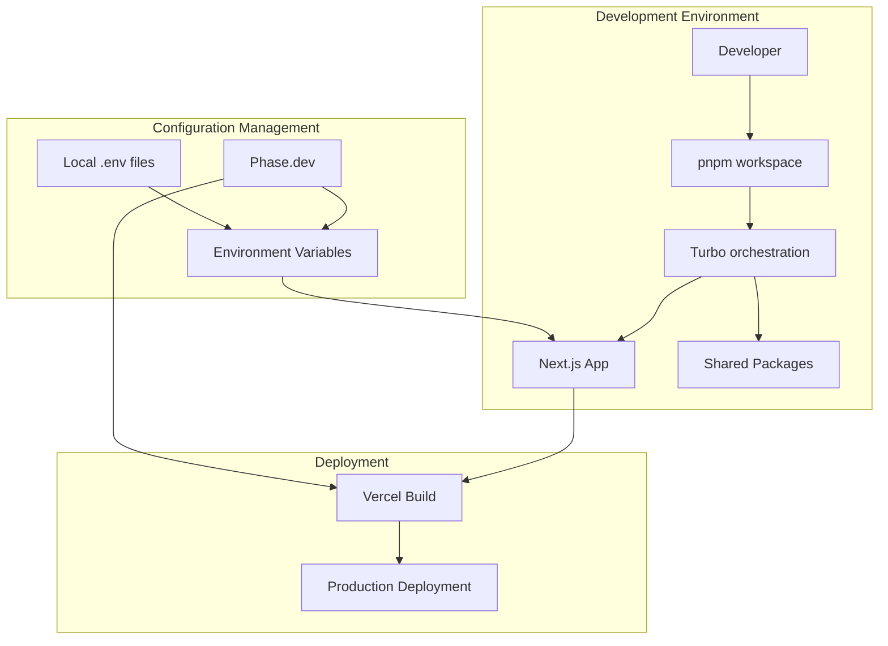

# Infrastructure Modernization Design Document

## Overview

This design outlines the modernization of the project infrastructure by integrating Phase.dev for environment variable management, preparing for Vercel deployments, implementing a Turbo-based monorepo structure, and migrating to pnpm. The solution ensures secure configuration management, optimized deployments, and improved development workflows.

## Architecture

### High-Level Architecture



### Monorepo Structure

```
c9d-ai/
├── apps/
│   └── web/                 # Current Next.js application
├── packages/
│   ├── ui/                  # Shared UI components
│   ├── config/              # Shared configuration
│   └── types/               # Shared TypeScript types
├── turbo.json               # Turbo configuration
├── package.json             # Root package.json
├── pnpm-workspace.yaml      # pnpm workspace configuration
└── .env.example             # Environment variable template
```

## Components and Interfaces

### Phase.dev Integration

**Environment Variable Loader**
- **Purpose**: Securely fetch and manage environment variables from Phase.dev
- **Interface**: 
  ```typescript
  interface PhaseConfig {
    serviceToken: string;
    appName: string;
    environment?: string;
  }
  
  interface EnvironmentLoader {
    loadEnvironment(config: PhaseConfig): Promise<Record<string, string>>;
    getCachedEnvironment(): Record<string, string>;
  }
  ```

**Configuration Manager**
- **Purpose**: Manage fallback to local environment variables and caching
- **Interface**:
  ```typescript
  interface ConfigManager {
    initialize(): Promise<void>;
    get(key: string): string | undefined;
    getAll(): Record<string, string>;
  }
  ```

### Turbo Configuration

**Build Orchestration**
- **Purpose**: Coordinate builds across monorepo packages
- **Configuration**: Define task dependencies, caching strategies, and pipeline execution

**Package Dependencies**
- **Purpose**: Manage inter-package dependencies and build order
- **Interface**: Turbo pipeline configuration with proper dependency mapping

### pnpm Workspace Management

**Dependency Resolution**
- **Purpose**: Efficient dependency management across monorepo
- **Configuration**: Workspace-aware package resolution and linking

**Package Linking**
- **Purpose**: Enable local package development and testing
- **Interface**: Automatic linking of workspace packages

### Vercel Deployment Configuration

**Build Configuration**
- **Purpose**: Optimize Next.js builds for Vercel platform
- **Interface**: Vercel-specific build settings and environment handling

**Environment Integration**
- **Purpose**: Seamless Phase.dev integration in Vercel environment
- **Configuration**: Build-time and runtime environment variable handling

## Data Models

### Environment Configuration

```typescript
interface EnvironmentConfig {
  phase: {
    serviceToken: string;
    appName: string;
    environment: 'development' | 'staging' | 'production';
    fallbackToLocal: boolean;
  };
  cache: {
    enabled: boolean;
    ttl: number;
  };
}
```

### Monorepo Package Configuration

```typescript
interface PackageConfig {
  name: string;
  version: string;
  dependencies: string[];
  buildCommand?: string;
  testCommand?: string;
  devCommand?: string;
}
```

### Deployment Configuration

```typescript
interface DeploymentConfig {
  platform: 'vercel';
  buildCommand: string;
  outputDirectory: string;
  environmentVariables: {
    build: string[];
    runtime: string[];
  };
}
```

## Error Handling

### Phase.dev Integration Errors

1. **Authentication Failures**
   - Log authentication errors with sanitized details
   - Fallback to local environment variables
   - Provide clear error messages for debugging

2. **Network Connectivity Issues**
   - Implement retry logic with exponential backoff
   - Cache last successful configuration
   - Graceful degradation to local configuration

3. **Configuration Validation Errors**
   - Validate required environment variables
   - Provide clear error messages for missing configuration
   - Support for environment-specific validation rules

### Build and Deployment Errors

1. **Turbo Build Failures**
   - Clear error reporting for failed packages
   - Dependency resolution error handling
   - Build cache invalidation strategies

2. **Vercel Deployment Issues**
   - Environment variable validation
   - Build timeout handling
   - Deployment rollback strategies

3. **pnpm Workspace Errors**
   - Dependency resolution conflicts
   - Package linking failures
   - Version mismatch handling

## Testing Strategy

### Unit Testing

1. **Environment Loading**
   - Test Phase.dev API integration
   - Test fallback mechanisms
   - Test caching behavior

2. **Configuration Management**
   - Test environment variable resolution
   - Test validation logic
   - Test error handling paths

### Integration Testing

1. **Monorepo Build Process**
   - Test Turbo pipeline execution
   - Test package dependency resolution
   - Test cross-package imports

2. **Deployment Pipeline**
   - Test Vercel build process
   - Test environment variable injection
   - Test production deployment flow

### End-to-End Testing

1. **Development Workflow**
   - Test local development setup
   - Test hot reloading across packages
   - Test debugging capabilities

2. **Production Deployment**
   - Test complete deployment pipeline
   - Test environment variable availability
   - Test application functionality in production

## Implementation Phases

### Phase 1: pnpm Migration
- Convert existing project to use pnpm
- Set up workspace configuration
- Update CI/CD scripts

### Phase 2: Monorepo Structure
- Restructure project into monorepo layout
- Configure Turbo for build orchestration
- Set up package dependencies

### Phase 3: Phase.dev Integration
- Implement environment variable loading
- Add fallback mechanisms
- Configure caching strategies

### Phase 4: Vercel Optimization
- Configure Vercel deployment settings
- Integrate Phase.dev with Vercel
- Optimize build performance

### Phase 5: Testing and Validation
- Implement comprehensive testing
- Validate all integration points
- Performance optimization and monitoring