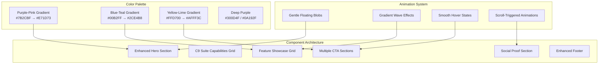
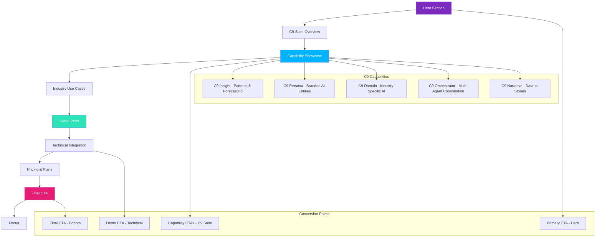
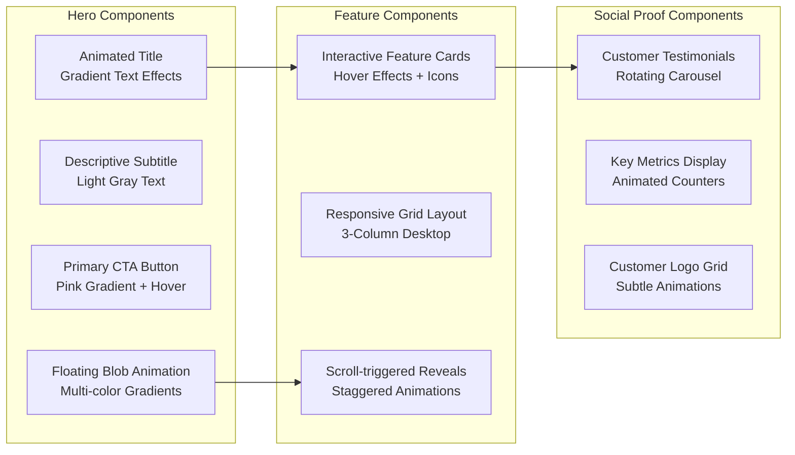

# Design Document

## Overview

The Landing Page design builds upon the existing vibrant visual language of C9d.ai, featuring the established purple-pink gradients, electric blue accents, teal highlights, and bright yellow-lime elements. The design emphasizes the gentle floating animations and sophisticated color palette to create a novel, approachable experience that communicates the coordinated AI capabilities of the C9 Suite. Built with Next.js and optimized for Vercel deployment, the page balances visual impact with performance, accessibility, and conversion optimization while showcasing the five modular capabilities: Insight, Persona, Domain, Orchestrator, and Narrative.

The architecture follows a component-based approach that leverages existing design components while introducing new sections specifically crafted for showcasing each C9 capability, conversion optimization, and industry-specific engagement.

## Architecture

### Visual Design System



### Page Structure and Flow



### Component Design System



## Components and Interfaces

### Enhanced Hero Section

```typescript
interface EnhancedHeroSectionProps {
  title: string
  subtitle: string
  primaryCTA: CTAConfig
  secondaryCTA?: CTAConfig
  backgroundAnimation: AnimationConfig
  metrics?: HeroMetric[]
}

interface CTAConfig {
  text: string
  href: string
  variant: 'primary' | 'secondary' | 'outline'
  icon?: React.ComponentType
  tracking: TrackingConfig
}

interface AnimationConfig {
  enableFloatingBlobs: boolean
  blobCount: number
  animationSpeed: 'slow' | 'medium' | 'fast'
  colorScheme: 'purple-pink' | 'blue-teal' | 'yellow-lime' | 'mixed'
}
```

### C9 Suite Capabilities Showcase

```typescript
interface C9SuiteShowcaseProps {
  capabilities: C9Capability[]
  layout: 'grid' | 'carousel' | 'tabs'
  animationTrigger: 'scroll' | 'hover' | 'auto'
  industryFilter?: string[]
}

interface C9Capability {
  id: 'insight' | 'persona' | 'domain' | 'orchestrator' | 'narrative'
  name: string
  tagline: string
  description: string
  icon: React.ComponentType
  gradient: GradientConfig
  keyFeatures: string[]
  useCases: IndustryUseCase[]
  apis: APIEndpoint[]
  ctaText: string
  ctaHref: string
}

interface IndustryUseCase {
  industry: 'education' | 'telecom' | 'retail' | 'enterprise' | 'healthcare' | 'marketing'
  scenario: string
  benefit: string
  example: string
}

interface APIEndpoint {
  name: string
  description: string
  method: 'GET' | 'POST' | 'PUT' | 'DELETE'
  endpoint: string
}
```

### Feature Showcase Grid

```typescript
interface FeatureShowcaseProps {
  features: Feature[]
  layout: 'grid' | 'carousel' | 'masonry'
  animationTrigger: 'scroll' | 'hover' | 'auto'
  colorScheme: ColorScheme
}

interface Feature {
  id: string
  title: string
  description: string
  icon: React.ComponentType
  gradient: GradientConfig
  benefits: string[]
  ctaText?: string
  ctaHref?: string
}

interface GradientConfig {
  from: string
  to: string
  direction: 'to-r' | 'to-br' | 'to-b' | 'to-bl'
  opacity: number
}
```

### Social Proof Section

```typescript
interface SocialProofSectionProps {
  testimonials: Testimonial[]
  metrics: Metric[]
  customerLogos: CustomerLogo[]
  layout: 'carousel' | 'grid' | 'mixed'
  autoRotate: boolean
}

interface Testimonial {
  id: string
  quote: string
  author: string
  title: string
  company: string
  avatar?: string
  rating?: number
  useCase?: string
}

interface Metric {
  id: string
  value: string | number
  label: string
  description?: string
  icon?: React.ComponentType
  animateCounter: boolean
}
```

### Interactive CTA Components

```typescript
interface InteractiveCTAProps {
  variant: 'hero' | 'section' | 'floating' | 'sticky'
  size: 'sm' | 'md' | 'lg' | 'xl'
  colorScheme: 'primary' | 'secondary' | 'accent'
  animation: 'pulse' | 'glow' | 'float' | 'none'
  tracking: TrackingConfig
  children: React.ReactNode
}

interface FloatingCTAProps {
  position: 'bottom-right' | 'bottom-left' | 'side'
  showAfterScroll: number
  hideOnSections?: string[]
  ctaConfig: CTAConfig
}
```

## C9 Suite Capability Specifications

### C9 Capability Data Structure

```typescript
const C9_CAPABILITIES: C9Capability[] = [
  {
    id: 'insight',
    name: 'C9 Insight',
    tagline: 'Coordinating patterns across time, space, and data',
    description: 'Turn raw data into foresight with APIs for correlation, forecasting, and anomaly detection',
    gradient: { from: '#7B2CBF', to: '#E71D73', direction: 'to-br', opacity: 0.9 },
    keyFeatures: [
      'Entity & temporal correlation APIs',
      'Contextual forecasting & predictive models',
      'Time-series anomaly detection',
      'Cross-location & multi-factor trend analysis'
    ],
    useCases: [
      {
        industry: 'education',
        scenario: 'Forecast class attendance and resource needs',
        benefit: 'Optimize resource allocation and improve student engagement',
        example: 'Predict which students need additional support before they fall behind'
      },
      {
        industry: 'telecom',
        scenario: 'Predict network demand and delivery bottlenecks',
        benefit: 'Proactive infrastructure scaling and maintenance',
        example: 'Anticipate network congestion during major events'
      }
    ],
    apis: [
      { name: 'Correlation API', description: 'Find patterns across datasets', method: 'POST', endpoint: '/api/insight/correlate' },
      { name: 'Forecast API', description: 'Generate predictive models', method: 'POST', endpoint: '/api/insight/forecast' }
    ]
  },
  {
    id: 'persona',
    name: 'C9 Persona',
    tagline: 'AI that represents your brand, your way',
    description: 'Create branded AI entities that embody your organization with configurable tone and knowledge',
    gradient: { from: '#00B2FF', to: '#2CE4B8', direction: 'to-br', opacity: 0.9 },
    keyFeatures: [
      'Personified AI models for individuals or organizations',
      'Brand-configurable tone, style, and knowledge base',
      'Context-aware avatars that adapt to role and audience',
      'APIs for integration with chat, voice, and workflow systems'
    ],
    useCases: [
      {
        industry: 'enterprise',
        scenario: 'Executive surrogates for stakeholder communication',
        benefit: 'Consistent messaging and 24/7 availability',
        example: 'CEO avatar that handles routine investor questions'
      }
    ]
  },
  // Additional capabilities...
]
```

### Industry-Specific Color Mapping

```typescript
interface IndustryColorScheme {
  education: { primary: '#7B2CBF', secondary: '#E71D73' }
  telecom: { primary: '#00B2FF', secondary: '#2CE4B8' }
  retail: { primary: '#FFD700', secondary: '#AFFF3C' }
  enterprise: { primary: '#7B2CBF', secondary: '#00B2FF' }
  healthcare: { primary: '#2CE4B8', secondary: '#00B2FF' }
  marketing: { primary: '#E71D73', secondary: '#FFD700' }
}
```

## Design Specifications

### Color Usage Guidelines

```typescript
interface ColorPalette {
  // Primary Gradients
  heroPrimary: 'bg-purple-pink-gradient' // #7B2CBF → #E71D73
  heroSecondary: 'bg-blue-teal-gradient' // #00B2FF → #2CE4B8
  accent: 'bg-yellow-lime-gradient' // #FFD700 → #AFFF3C
  
  // Background Colors
  darkBackground: 'bg-c9n-blue-dark' // #0A192F
  sectionBackground: 'bg-windsurf-purple-deep' // #300D4F
  lightBackground: 'bg-windsurf-off-white' // #F7F9FA
  
  // Text Colors
  primaryText: 'text-white'
  secondaryText: 'text-windsurf-gray-light' // #E0E6ED
  accentText: 'text-c9n-teal' // #2CE4B8
  
  // Interactive Elements
  buttonPrimary: 'bg-windsurf-pink-hot hover:bg-opacity-90' // #E71D73
  buttonSecondary: 'bg-windsurf-blue-electric hover:bg-opacity-90' // #00B2FF
  linkHover: 'text-windsurf-yellow-bright' // #FFD700
}
```

### Animation Specifications

```typescript
interface AnimationConfig {
  // Floating Blob Animations
  gentleFloat1: 'animate-gentle-float-1' // 25s ease-in-out infinite
  gentleFloat2: 'animate-gentle-float-2' // 30s ease-in-out infinite reverse
  gentleFloat3: 'animate-gentle-float-3' // 22s ease-in-out infinite
  
  // Gradient Wave Effects
  gradientWave: 'animate-gradient-wave' // 15s ease infinite
  
  // Hover Transitions
  scaleHover: 'transform hover:scale-105 transition-all duration-300'
  glowHover: 'hover:shadow-xl hover:shadow-windsurf-pink-hot/25'
  
  // Scroll Animations
  fadeInUp: 'opacity-0 translate-y-8 transition-all duration-700'
  staggerDelay: 'delay-100 delay-200 delay-300' // For staggered reveals
}
```

### Responsive Design Breakpoints

```typescript
interface ResponsiveConfig {
  mobile: {
    heroTitle: 'text-4xl sm:text-5xl'
    heroSubtitle: 'text-lg'
    featureGrid: 'grid-cols-1'
    padding: 'px-4 py-12'
  }
  tablet: {
    heroTitle: 'md:text-6xl'
    heroSubtitle: 'text-xl'
    featureGrid: 'md:grid-cols-2'
    padding: 'md:px-6 md:py-16'
  }
  desktop: {
    heroTitle: 'lg:text-7xl'
    heroSubtitle: 'text-xl'
    featureGrid: 'lg:grid-cols-3'
    padding: 'lg:px-8 lg:py-20'
  }
}
```

## Performance Optimization

### Image and Asset Strategy

```typescript
interface AssetOptimization {
  // Hero Background Blobs
  blobRendering: 'CSS-only animations, no images'
  gradientImplementation: 'Tailwind CSS gradients'
  
  // Feature Icons
  iconStrategy: 'Lucide React icons (tree-shakeable)'
  iconLoading: 'Lazy loading for below-fold icons'
  
  // Customer Logos
  logoFormat: 'WebP with PNG fallback'
  logoSizing: 'Responsive with srcSet'
  logoLoading: 'Lazy loading with intersection observer'
  
  // Background Images
  backgroundStrategy: 'CSS gradients preferred over images'
  fallbackImages: 'Optimized WebP/AVIF with lazy loading'
}
```

### Animation Performance

```typescript
interface AnimationPerformance {
  // Hardware Acceleration
  transforms: 'transform3d() for GPU acceleration'
  willChange: 'will-change: transform for animated elements'
  
  // Reduced Motion Support
  reducedMotion: '@media (prefers-reduced-motion: reduce)'
  fallbackBehavior: 'Static gradients, no floating animations'
  
  // Performance Monitoring
  fpsTarget: '60fps for all animations'
  budgetConstraints: 'Max 16ms per frame'
  
  // Optimization Techniques
  animationOptimization: 'CSS animations over JavaScript'
  layerPromotion: 'Separate layers for animated elements'
}
```

## Accessibility Implementation

### WCAG 2.1 Compliance

```typescript
interface AccessibilityConfig {
  // Color Contrast
  contrastRatios: {
    normalText: '4.5:1 minimum'
    largeText: '3:1 minimum'
    uiElements: '3:1 minimum'
  }
  
  // Keyboard Navigation
  focusManagement: 'Visible focus indicators on all interactive elements'
  tabOrder: 'Logical tab sequence through page sections'
  skipLinks: 'Skip to main content link for screen readers'
  
  // Screen Reader Support
  semanticMarkup: 'Proper heading hierarchy (h1-h6)'
  altText: 'Descriptive alt text for all images'
  ariaLabels: 'ARIA labels for complex interactive elements'
  
  // Motion Accessibility
  reducedMotion: 'Respect prefers-reduced-motion setting'
  alternativeContent: 'Static alternatives for animated content'
}
```

## Conversion Optimization

### A/B Testing Framework

```typescript
interface ABTestingConfig {
  // Testable Elements
  heroHeadlines: string[]
  ctaButtonText: string[]
  colorSchemes: ColorScheme[]
  sectionOrder: SectionConfig[]
  
  // Tracking Implementation
  analyticsProvider: 'Vercel Analytics + Google Analytics'
  conversionEvents: ConversionEvent[]
  heatmapTracking: 'Hotjar or similar for user behavior'
  
  // Test Configuration
  trafficSplit: '50/50 or 33/33/33 for multi-variant'
  statisticalSignificance: '95% confidence level'
  minimumSampleSize: 'Calculated based on baseline conversion rate'
}

interface ConversionEvent {
  name: string
  trigger: 'click' | 'scroll' | 'time' | 'form_submit'
  value?: number
  category: 'engagement' | 'conversion' | 'micro_conversion'
}
```

## Error Handling

### Graceful Degradation

```typescript
interface ErrorHandling {
  // Animation Failures
  animationFallback: 'Static gradients and layouts'
  performanceDegradation: 'Reduce animation complexity on slow devices'
  
  // Content Loading
  contentFallback: 'Skeleton screens during loading'
  imageFailure: 'Graceful fallback to background colors'
  
  // JavaScript Errors
  progressiveEnhancement: 'Core functionality works without JavaScript'
  errorBoundaries: 'React error boundaries for component failures'
  
  // Network Issues
  offlineSupport: 'Service worker for basic offline functionality'
  slowConnection: 'Optimized loading for slow networks'
}
```

## Testing Strategy

### Visual Regression Testing
- **Component Testing**: Test individual components with different props and states
- **Cross-browser Testing**: Ensure consistent appearance across Chrome, Firefox, Safari, and Edge
- **Device Testing**: Test responsive design on various screen sizes and orientations
- **Animation Testing**: Verify smooth animations and performance across devices

### Performance Testing
- **Core Web Vitals**: Monitor LCP, FID, and CLS scores
- **Load Testing**: Test page performance under various network conditions
- **Animation Performance**: Monitor frame rates and animation smoothness
- **Bundle Analysis**: Track JavaScript bundle size and loading performance

### Accessibility Testing
- **Screen Reader Testing**: Test with NVDA, JAWS, and VoiceOver
- **Keyboard Navigation**: Verify full keyboard accessibility
- **Color Contrast**: Automated and manual contrast testing
- **Motion Sensitivity**: Test reduced motion preferences

### Conversion Testing
- **A/B Testing**: Test different headlines, CTAs, and layouts
- **Funnel Analysis**: Track user journey through conversion points
- **Heat Mapping**: Analyze user interaction patterns
- **Form Analytics**: Monitor form completion and abandonment rates