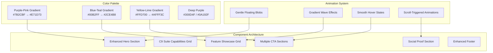
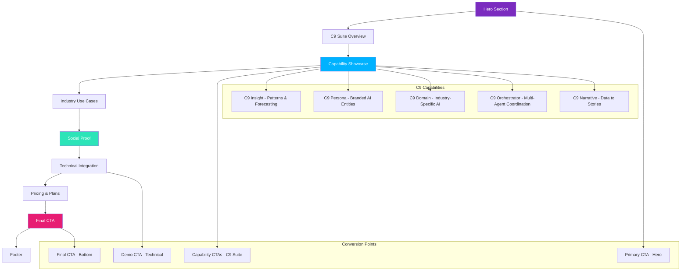
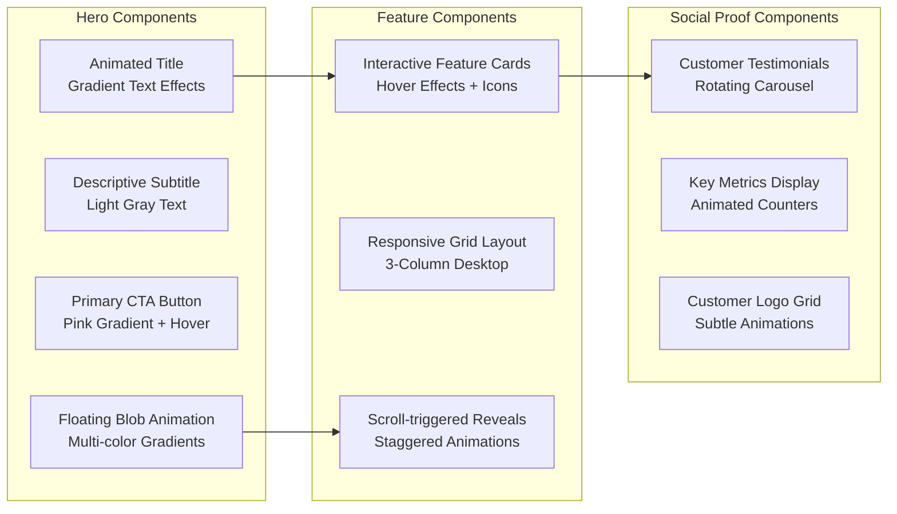
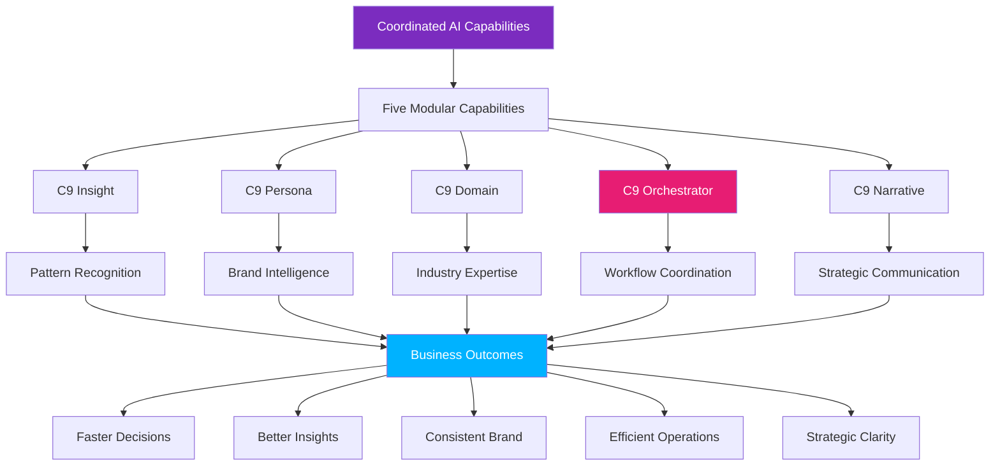
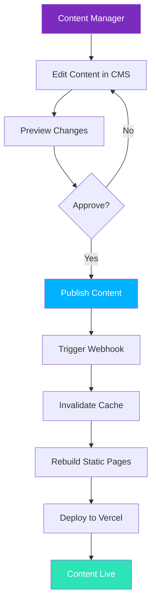
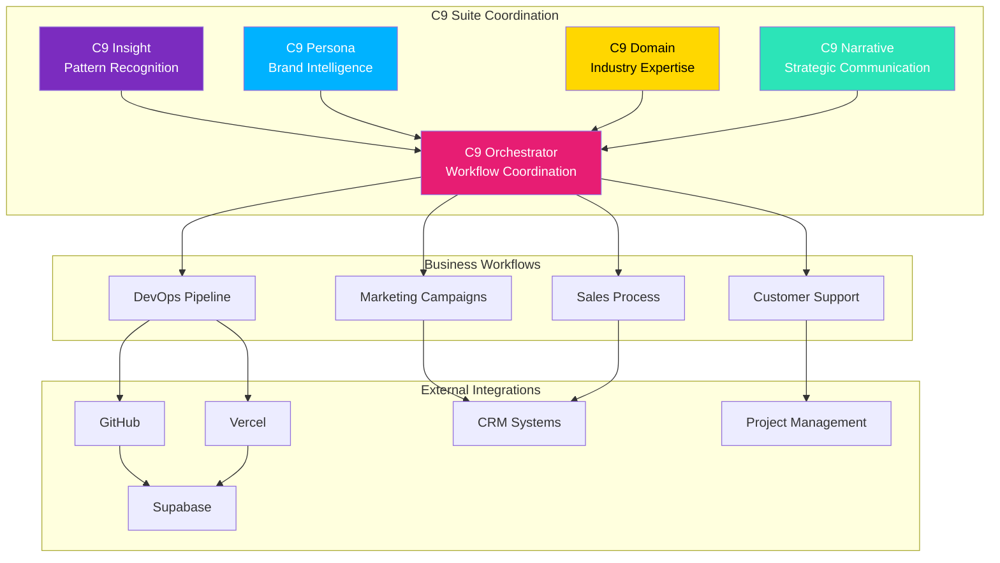

# Design Document

## Overview

The Landing Page design builds upon the existing vibrant visual language of C9d.ai, featuring the established purple-pink gradients, electric blue accents, teal highlights, and bright yellow-lime elements. The design emphasizes the gentle floating animations and sophisticated color palette to create a novel, approachable experience that communicates the coordinated AI capabilities of the C9 Suite. Built with Next.js and optimized for Vercel deployment, the page balances visual impact with performance, accessibility, and conversion optimization while showcasing the five modular capabilities: Insight, Persona, Domain, Orchestrator, and Narrative.

The architecture follows a component-based approach that leverages existing design components while introducing new sections specifically crafted for showcasing each C9 capability, conversion optimization, and industry-specific engagement.

## Architecture

### Visual Design System


```mermaid
graph TB
    subgraph "Color Palette"
        Primary[Purple-Pink Gradient<br/>#7B2CBF → #E71D73]
        Secondary[Blue-Teal Gradient<br/>#00B2FF → #2CE4B8]
        Accent[Yellow-Lime Gradient<br/>#FFD700 → #AFFF3C]
        Background[Deep Purple<br/>#300D4F / #0A192F]
    end
    
    subgraph "Animation System"
        FloatingBlobs[Gentle Floating Blobs]
        GradientWaves[Gradient Wave Effects]
        HoverTransitions[Smooth Hover States]
        ScrollAnimations[Scroll-Triggered Animations]
    end
    
    subgraph "Component Architecture"
        HeroSection[Enhanced Hero Section]
        C9Showcase[C9 Suite Capabilities Grid]
        FeatureShowcase[Feature Showcase Grid]
        SocialProof[Social Proof Section]
        CTASections[Multiple CTA Sections]
        Footer[Enhanced Footer]
    end
    
    Primary --> HeroSection
    Secondary --> FeatureShowcase
    Accent --> CTASections
    
    FloatingBlobs --> HeroSection
    GradientWaves --> FeatureShowcase
    HoverTransitions --> CTASections
    ScrollAnimations --> SocialProof
```

### Page Structure and Flow


```mermaid
graph TD
    A[Hero Section] --> B[C9 Suite Overview]
    B --> C[Capability Showcase]
    C --> D[Industry Use Cases]
    D --> E[Social Proof]
    E --> F[Technical Integration]
    F --> G[Pricing & Plans]
    G --> H[Final CTA]
    H --> I[Footer]
    
    subgraph "C9 Capabilities"
        C1[C9 Insight - Patterns & Forecasting]
        C2[C9 Persona - Branded AI Entities]
        C3[C9 Domain - Industry-Specific AI]
        C4[C9 Orchestrator - Multi-Agent Coordination]
        C5[C9 Narrative - Data to Stories]
    end
    
    subgraph "Conversion Points"
        CTA1[Primary CTA - Hero]
        CTA2[Capability CTAs - C9 Suite]
        CTA3[Demo CTA - Technical]
        CTA4[Final CTA - Bottom]
    end
    
    A --> CTA1
    C --> CTA2
    F --> CTA3
    H --> CTA4
    
    C --> C1
    C --> C2
    C --> C3
    C --> C4
    C --> C5
    
    style A fill:#7B2CBF,color:#fff
    style C fill:#00B2FF,color:#fff
    style E fill:#2CE4B8,color:#fff
    style H fill:#E71D73,color:#fff
```

### Component Design System


```mermaid
graph LR
    subgraph "Hero Components"
        HeroTitle[Animated Title<br/>Gradient Text Effects]
        HeroSubtitle[Descriptive Subtitle<br/>Light Gray Text]
        HeroCTA[Primary CTA Button<br/>Pink Gradient + Hover]
        HeroBackground[Floating Blob Animation<br/>Multi-color Gradients]
    end
    
    subgraph "Feature Components"
        FeatureCard[Interactive Feature Cards<br/>Hover Effects + Icons]
        FeatureGrid[Responsive Grid Layout<br/>3-Column Desktop]
        FeatureAnimation[Scroll-triggered Reveals<br/>Staggered Animations]
    end
    
    subgraph "Social Proof Components"
        TestimonialCard[Customer Testimonials<br/>Rotating Carousel]
        StatsDisplay[Key Metrics Display<br/>Animated Counters]
        LogoGrid[Customer Logo Grid<br/>Subtle Animations]
    end
    
    HeroTitle --> FeatureCard
    FeatureCard --> TestimonialCard
    HeroBackground --> FeatureAnimation
```

## Components and Interfaces

### Enhanced Hero Section

```typescript
interface EnhancedHeroSectionProps {
  title: string
  subtitle: string
  valueProposition: ValuePropositionConfig
  primaryCTA: CTAConfig
  secondaryCTA?: CTAConfig
  backgroundAnimation: AnimationConfig
  metrics?: HeroMetric[]
  capabilityPreview: CapabilityPreviewConfig
}

interface ValuePropositionConfig {
  headline: string // "Coordinated AI Capabilities"
  subheadline: string // Brief explanation of coordinated intelligence
  keyDifferentiators: string[] // 3-5 key points
  visualIndicator: 'capability-icons' | 'coordination-diagram' | 'animated-flow'
  loadTime: number // Target: < 5 seconds
}

interface CapabilityPreviewConfig {
  showInHero: boolean
  displayStyle: 'icons' | 'cards' | 'carousel'
  capabilities: {
    id: string
    name: string
    icon: React.ComponentType
    tagline: string
    color: string
  }[]
  interactionType: 'hover' | 'click' | 'auto-rotate'
}

interface CTAConfig {
  text: string
  href: string
  variant: 'primary' | 'secondary' | 'outline'
  icon?: React.ComponentType
  tracking: TrackingConfig
  capabilityContext?: string // Which capability this CTA relates to
}

interface AnimationConfig {
  enableFloatingBlobs: boolean
  blobCount: number
  animationSpeed: 'slow' | 'medium' | 'fast'
  colorScheme: 'purple-pink' | 'blue-teal' | 'yellow-lime' | 'mixed'
}

// 5-Second Value Proposition Clarity
const HERO_VALUE_PROPOSITION: ValuePropositionConfig = {
  headline: 'Coordinated AI Capabilities',
  subheadline: 'Five modular AI capabilities that work together to transform your organization',
  keyDifferentiators: [
    'Coordinated intelligence across all capabilities',
    'Industry-specific AI tuning',
    'Consume as service, API, or integration',
    'Branded AI that represents your organization',
    'Strategic insights from data to narrative'
  ],
  visualIndicator: 'coordination-diagram',
  loadTime: 3000 // 3 seconds target
}
```

### C9 Suite Capabilities Showcase

```typescript
interface C9SuiteShowcaseProps {
  capabilities: C9Capability[]
  layout: 'grid' | 'carousel' | 'tabs'
  animationTrigger: 'scroll' | 'hover' | 'auto'
  industryFilter?: string[]
}

interface C9Capability {
  id: 'insight' | 'persona' | 'domain' | 'orchestrator' | 'narrative'
  name: string
  tagline: string
  description: string
  icon: React.ComponentType
  gradient: GradientConfig
  keyFeatures: string[]
  useCases: IndustryUseCase[]
  apis: APIEndpoint[]
  ctaText: string
  ctaHref: string
}

interface IndustryUseCase {
  industry: 'education' | 'telecom' | 'retail' | 'enterprise' | 'healthcare' | 'marketing'
  scenario: string
  benefit: string
  example: string
}

interface APIEndpoint {
  name: string
  description: string
  method: 'GET' | 'POST' | 'PUT' | 'DELETE'
  endpoint: string
}
```

### Feature Showcase Grid

```typescript
interface FeatureShowcaseProps {
  features: Feature[]
  layout: 'grid' | 'carousel' | 'masonry'
  animationTrigger: 'scroll' | 'hover' | 'auto'
  colorScheme: ColorScheme
}

interface Feature {
  id: string
  title: string
  description: string
  icon: React.ComponentType
  gradient: GradientConfig
  benefits: string[]
  ctaText?: string
  ctaHref?: string
}

interface GradientConfig {
  from: string
  to: string
  direction: 'to-r' | 'to-br' | 'to-b' | 'to-bl'
  opacity: number
}
```

### Social Proof Section

```typescript
interface SocialProofSectionProps {
  testimonials: Testimonial[]
  metrics: Metric[]
  customerLogos: CustomerLogo[]
  layout: 'carousel' | 'grid' | 'mixed'
  autoRotate: boolean
}

interface Testimonial {
  id: string
  quote: string
  author: string
  title: string
  company: string
  avatar?: string
  rating?: number
  useCase?: string
}

interface Metric {
  id: string
  value: string | number
  label: string
  description?: string
  icon?: React.ComponentType
  animateCounter: boolean
}
```

### Interactive CTA Components

```typescript
interface InteractiveCTAProps {
  variant: 'hero' | 'section' | 'floating' | 'sticky'
  size: 'sm' | 'md' | 'lg' | 'xl'
  colorScheme: 'primary' | 'secondary' | 'accent'
  animation: 'pulse' | 'glow' | 'float' | 'none'
  tracking: TrackingConfig
  children: React.ReactNode
}

interface FloatingCTAProps {
  position: 'bottom-right' | 'bottom-left' | 'side'
  showAfterScroll: number
  hideOnSections?: string[]
  ctaConfig: CTAConfig
}
```

### Low-Commitment Engagement Options

```typescript
interface LowCommitmentCTA {
  type: 'newsletter' | 'resource-download' | 'scenario-explorer' | 'capability-quiz'
  title: string
  description: string
  ctaText: string
  benefits: string[]
  requiredFields: FormField[]
  followUpAction: string
}

const LOW_COMMITMENT_OPTIONS: LowCommitmentCTA[] = [
  {
    type: 'newsletter',
    title: 'Stay Updated on Coordinated AI',
    description: 'Get insights on AI coordination, industry use cases, and C9 Suite updates',
    ctaText: 'Subscribe to Newsletter',
    benefits: [
      'Weekly AI coordination insights',
      'Industry-specific use cases',
      'Early access to new capabilities',
      'Exclusive webinar invitations'
    ],
    requiredFields: [
      { name: 'email', type: 'email', label: 'Email Address', required: true },
      { name: 'industry', type: 'select', label: 'Industry', required: false }
    ],
    followUpAction: 'Send welcome email with capability overview'
  },
  {
    type: 'resource-download',
    title: 'Download Capability Guides',
    description: 'Get detailed guides for each C9 capability with implementation examples',
    ctaText: 'Download Resources',
    benefits: [
      'Capability-specific implementation guides',
      'Industry use case examples',
      'API documentation samples',
      'Integration best practices'
    ],
    requiredFields: [
      { name: 'email', type: 'email', label: 'Email Address', required: true },
      { name: 'capability', type: 'multi-select', label: 'Capabilities of Interest', required: true },
      { name: 'role', type: 'select', label: 'Your Role', required: false }
    ],
    followUpAction: 'Send capability guides and schedule follow-up'
  },
  {
    type: 'scenario-explorer',
    title: 'Explore "What-If" Scenarios',
    description: 'See how C9 Narrative can help you explore strategic scenarios for your organization',
    ctaText: 'Try Scenario Explorer',
    benefits: [
      'Interactive scenario simulation',
      'No commitment required',
      'See C9 Narrative in action',
      'Export scenarios for your team'
    ],
    requiredFields: [
      { name: 'email', type: 'email', label: 'Email Address', required: true },
      { name: 'scenario-type', type: 'select', label: 'Scenario Type', required: true }
    ],
    followUpAction: 'Provide interactive scenario explorer access'
  },
  {
    type: 'capability-quiz',
    title: 'Which C9 Capabilities Do You Need?',
    description: 'Take a 2-minute quiz to discover which capabilities best fit your needs',
    ctaText: 'Take the Quiz',
    benefits: [
      'Personalized capability recommendations',
      'Industry-specific suggestions',
      'Custom implementation roadmap',
      'No email required to start'
    ],
    requiredFields: [
      { name: 'industry', type: 'select', label: 'Industry', required: true },
      { name: 'use-case', type: 'select', label: 'Primary Use Case', required: true }
    ],
    followUpAction: 'Show personalized capability recommendations'
  }
]

interface FormField {
  name: string
  type: 'text' | 'email' | 'select' | 'multi-select' | 'textarea'
  label: string
  required: boolean
  options?: string[]
  placeholder?: string
  validation?: ValidationRule[]
}
```

### Capability-Specific Engagement Paths

```typescript
interface CapabilityEngagementPath {
  capabilityId: 'insight' | 'persona' | 'domain' | 'orchestrator' | 'narrative'
  primaryCTA: CTAConfig
  secondaryCTA: CTAConfig
  lowCommitmentOptions: LowCommitmentCTA[]
  demoScenarios: DemoScenario[]
}

interface DemoScenario {
  title: string
  description: string
  industry: string
  interactiveDemo: boolean
  estimatedTime: string
  outcomes: string[]
}

const CAPABILITY_ENGAGEMENT_PATHS: CapabilityEngagementPath[] = [
  {
    capabilityId: 'insight',
    primaryCTA: {
      text: 'Request Insight Demo',
      href: '/demo/insight',
      variant: 'primary',
      tracking: { event: 'demo_request', capability: 'insight' }
    },
    secondaryCTA: {
      text: 'Explore Insight APIs',
      href: '/docs/insight',
      variant: 'secondary',
      tracking: { event: 'docs_view', capability: 'insight' }
    },
    lowCommitmentOptions: [
      {
        type: 'resource-download',
        title: 'Download Insight API Guide',
        description: 'Learn how to use correlation and forecasting APIs',
        ctaText: 'Get API Guide',
        benefits: ['API examples', 'Use case templates', 'Integration patterns'],
        requiredFields: [{ name: 'email', type: 'email', label: 'Email', required: true }],
        followUpAction: 'Send Insight API documentation'
      }
    ],
    demoScenarios: [
      {
        title: 'Forecast Student Attendance',
        description: 'See how C9 Insight predicts attendance patterns',
        industry: 'education',
        interactiveDemo: true,
        estimatedTime: '5 minutes',
        outcomes: ['Attendance predictions', 'Risk identification', 'Resource optimization']
      }
    ]
  },
  {
    capabilityId: 'narrative',
    primaryCTA: {
      text: 'Try Scenario Explorer',
      href: '/demo/narrative',
      variant: 'primary',
      tracking: { event: 'demo_request', capability: 'narrative' }
    },
    secondaryCTA: {
      text: 'See Example Scenarios',
      href: '/examples/narrative',
      variant: 'secondary',
      tracking: { event: 'examples_view', capability: 'narrative' }
    },
    lowCommitmentOptions: [
      {
        type: 'scenario-explorer',
        title: 'Explore Your Own Scenarios',
        description: 'Try C9 Narrative with your own strategic questions',
        ctaText: 'Start Exploring',
        benefits: ['Interactive simulation', 'No commitment', 'Export results'],
        requiredFields: [{ name: 'email', type: 'email', label: 'Email', required: true }],
        followUpAction: 'Provide scenario explorer access'
      }
    ],
    demoScenarios: [
      {
        title: 'Strategic Planning Simulation',
        description: 'Explore different strategic scenarios for your organization',
        industry: 'enterprise',
        interactiveDemo: true,
        estimatedTime: '10 minutes',
        outcomes: ['Multiple scenarios', 'Impact analysis', 'Strategic narratives']
      }
    ]
  }
]
```

## C9 Suite Capability Specifications

### C9 Capability Data Structure

```typescript
const C9_CAPABILITIES: C9Capability[] = [
  {
    id: 'insight',
    name: 'C9 Insight',
    tagline: 'Coordinating patterns across time, space, and data',
    description: 'Turn raw data into foresight with APIs for correlation, forecasting, and anomaly detection',
    gradient: { from: '#7B2CBF', to: '#E71D73', direction: 'to-br', opacity: 0.9 },
    keyFeatures: [
      'Entity & temporal correlation APIs',
      'Contextual forecasting & predictive models',
      'Time-series anomaly detection',
      'Cross-location & multi-factor trend analysis'
    ],
    useCases: [
      {
        industry: 'education',
        scenario: 'Forecast class attendance and resource needs',
        benefit: 'Optimize resource allocation and improve student engagement',
        example: 'Predict which students need additional support before they fall behind'
      },
      {
        industry: 'telecom',
        scenario: 'Predict network demand and delivery bottlenecks',
        benefit: 'Proactive infrastructure scaling and maintenance',
        example: 'Anticipate network congestion during major events'
      },
      {
        industry: 'retail',
        scenario: 'Correlate sales patterns across locations and seasons',
        benefit: 'Optimize inventory and staffing decisions',
        example: 'Predict product demand spikes before they occur'
      }
    ],
    apis: [
      { name: 'Correlation API', description: 'Find patterns across datasets', method: 'POST', endpoint: '/api/insight/correlate' },
      { name: 'Forecast API', description: 'Generate predictive models', method: 'POST', endpoint: '/api/insight/forecast' },
      { name: 'Anomaly Detection API', description: 'Identify unusual patterns', method: 'POST', endpoint: '/api/insight/anomaly' }
    ],
    ctaText: 'Explore Insight APIs',
    ctaHref: '/capabilities/insight'
  },
  {
    id: 'persona',
    name: 'C9 Persona',
    tagline: 'AI that represents your brand, your way',
    description: 'Create branded AI entities that embody your organization with configurable tone and knowledge',
    gradient: { from: '#00B2FF', to: '#2CE4B8', direction: 'to-br', opacity: 0.9 },
    keyFeatures: [
      'Personified AI models for individuals or organizations',
      'Brand-configurable tone, style, and knowledge base',
      'Context-aware avatars that adapt to role and audience',
      'APIs for integration with chat, voice, and workflow systems'
    ],
    useCases: [
      {
        industry: 'enterprise',
        scenario: 'Executive surrogates for stakeholder communication',
        benefit: 'Consistent messaging and 24/7 availability',
        example: 'CEO avatar that handles routine investor questions'
      },
      {
        industry: 'education',
        scenario: 'Virtual teaching assistants with instructor personality',
        benefit: 'Scalable personalized support for students',
        example: 'Professor avatar that answers student questions in their teaching style'
      },
      {
        industry: 'retail',
        scenario: 'Customer-facing brand ambassadors',
        benefit: 'Consistent brand voice across all touchpoints',
        example: 'Brand persona that guides customers through product selection'
      }
    ],
    apis: [
      { name: 'Persona Creation API', description: 'Create branded AI entities', method: 'POST', endpoint: '/api/persona/create' },
      { name: 'Persona Interaction API', description: 'Interact with AI personas', method: 'POST', endpoint: '/api/persona/interact' },
      { name: 'Persona Configuration API', description: 'Configure tone and knowledge', method: 'PUT', endpoint: '/api/persona/configure' }
    ],
    ctaText: 'Build Your Persona',
    ctaHref: '/capabilities/persona'
  },
  {
    id: 'domain',
    name: 'C9 Domain',
    tagline: 'Smarter AI, built for your industry',
    description: 'Industry-specific AI models with compliance-aware reasoning and vertical-tuned intelligence',
    gradient: { from: '#FFD700', to: '#AFFF3C', direction: 'to-br', opacity: 0.9 },
    keyFeatures: [
      'Industry-specific AI models (telecom, education, healthcare, marketing)',
      'Compliance-aware reasoning for regulated industries',
      'Vertical-tuned intelligence with domain expertise',
      'Pre-trained on industry-specific datasets and terminology'
    ],
    useCases: [
      {
        industry: 'telecom',
        scenario: 'Network optimization with telecom-specific intelligence',
        benefit: 'Faster problem resolution with industry context',
        example: 'AI that understands 5G infrastructure and regulatory requirements'
      },
      {
        industry: 'healthcare',
        scenario: 'HIPAA-compliant patient data analysis',
        benefit: 'Secure, compliant AI for sensitive healthcare data',
        example: 'AI that analyzes patient outcomes while maintaining privacy'
      },
      {
        industry: 'marketing',
        scenario: 'Campaign optimization with marketing domain knowledge',
        benefit: 'AI that understands marketing metrics and strategies',
        example: 'AI that recommends campaign adjustments based on industry benchmarks'
      }
    ],
    apis: [
      { name: 'Domain Model API', description: 'Access industry-specific models', method: 'POST', endpoint: '/api/domain/model' },
      { name: 'Compliance Check API', description: 'Validate compliance requirements', method: 'POST', endpoint: '/api/domain/compliance' },
      { name: 'Domain Query API', description: 'Query with industry context', method: 'POST', endpoint: '/api/domain/query' }
    ],
    ctaText: 'Explore Domain Models',
    ctaHref: '/capabilities/domain'
  },
  {
    id: 'orchestrator',
    name: 'C9 Orchestrator',
    tagline: 'Coordinate people, processes, and AI',
    description: 'Multi-agent collaboration and workflow automation that coordinates human and AI intelligence',
    gradient: { from: '#E71D73', to: '#7B2CBF', direction: 'to-br', opacity: 0.9 },
    keyFeatures: [
      'Multi-agent collaboration and coordination',
      'Workflow automation with human-in-the-loop',
      'Task delegation between AI agents and humans',
      'Real-time coordination across distributed teams'
    ],
    useCases: [
      {
        industry: 'enterprise',
        scenario: 'DevOps workflow automation with AI assistance',
        benefit: 'Faster deployment cycles with intelligent coordination',
        example: 'AI agents that coordinate code reviews, testing, and deployment'
      },
      {
        industry: 'marketing',
        scenario: 'Campaign execution across multiple channels',
        benefit: 'Coordinated multi-channel campaigns with AI optimization',
        example: 'AI orchestrates content creation, scheduling, and performance tracking'
      },
      {
        industry: 'retail',
        scenario: 'Supply chain coordination with predictive intelligence',
        benefit: 'Optimized inventory and logistics with AI coordination',
        example: 'AI coordinates suppliers, warehouses, and delivery schedules'
      }
    ],
    apis: [
      { name: 'Agent Coordination API', description: 'Coordinate multiple AI agents', method: 'POST', endpoint: '/api/orchestrator/coordinate' },
      { name: 'Workflow Automation API', description: 'Automate complex workflows', method: 'POST', endpoint: '/api/orchestrator/workflow' },
      { name: 'Task Delegation API', description: 'Delegate tasks to agents', method: 'POST', endpoint: '/api/orchestrator/delegate' }
    ],
    ctaText: 'Orchestrate Your Workflow',
    ctaHref: '/capabilities/orchestrator'
  },
  {
    id: 'narrative',
    name: 'C9 Narrative',
    tagline: 'Turn your data into stories and strategy',
    description: 'Scenario simulation and data-to-story conversion for strategic planning and communication',
    gradient: { from: '#2CE4B8', to: '#00B2FF', direction: 'to-br', opacity: 0.9 },
    keyFeatures: [
      'Scenario simulation and what-if analysis',
      'Data-to-story conversion for stakeholder communication',
      'Strategic planning with narrative intelligence',
      'Multi-perspective scenario generation'
    ],
    useCases: [
      {
        industry: 'enterprise',
        scenario: 'Strategic planning with scenario simulation',
        benefit: 'Better decisions through narrative-driven analysis',
        example: 'AI generates strategic scenarios for board presentations'
      },
      {
        industry: 'education',
        scenario: 'Policy impact analysis with narrative explanations',
        benefit: 'Clear communication of complex policy decisions',
        example: 'AI explains how curriculum changes affect student outcomes'
      },
      {
        industry: 'media',
        scenario: 'Data journalism with automated story generation',
        benefit: 'Faster story creation from complex datasets',
        example: 'AI converts election data into compelling narratives'
      }
    ],
    apis: [
      { name: 'Scenario Simulation API', description: 'Generate what-if scenarios', method: 'POST', endpoint: '/api/narrative/simulate' },
      { name: 'Story Generation API', description: 'Convert data to narratives', method: 'POST', endpoint: '/api/narrative/story' },
      { name: 'Strategic Analysis API', description: 'Analyze strategic options', method: 'POST', endpoint: '/api/narrative/analyze' }
    ],
    ctaText: 'Create Your Narrative',
    ctaHref: '/capabilities/narrative'
  }
]
```

### Industry-Specific Color Mapping

```typescript
interface IndustryColorScheme {
  education: { primary: '#7B2CBF', secondary: '#E71D73' }
  telecom: { primary: '#00B2FF', secondary: '#2CE4B8' }
  retail: { primary: '#FFD700', secondary: '#AFFF3C' }
  enterprise: { primary: '#7B2CBF', secondary: '#00B2FF' }
  healthcare: { primary: '#2CE4B8', secondary: '#00B2FF' }
  marketing: { primary: '#E71D73', secondary: '#FFD700' }
}
```

## Competitive Differentiation Strategy

### Coordinated Intelligence vs Generic AI

```typescript
interface DifferentiationMessaging {
  genericAI: {
    limitation: string
    consequence: string
  }
  c9dSolution: {
    capability: string
    benefit: string
    example: string
  }
}

const DIFFERENTIATION_POINTS: DifferentiationMessaging[] = [
  {
    genericAI: {
      limitation: 'Isolated AI tools that work independently',
      consequence: 'Fragmented insights, duplicated effort, inconsistent results'
    },
    c9dSolution: {
      capability: 'Coordinated AI capabilities that work together',
      benefit: 'Unified intelligence across your entire organization',
      example: 'C9 Insight detects patterns → C9 Orchestrator coordinates response → C9 Narrative communicates strategy'
    }
  },
  {
    genericAI: {
      limitation: 'One-size-fits-all AI models',
      consequence: 'Generic responses that miss industry-specific context'
    },
    c9dSolution: {
      capability: 'Industry-tuned AI with C9 Domain',
      benefit: 'AI that understands your industry\'s unique requirements',
      example: 'Healthcare AI that knows HIPAA, telecom AI that understands 5G infrastructure'
    }
  },
  {
    genericAI: {
      limitation: 'AI as a black box service',
      consequence: 'Limited control over AI behavior and brand representation'
    },
    c9dSolution: {
      capability: 'Branded AI entities with C9 Persona',
      benefit: 'AI that represents your brand, your way',
      example: 'Create AI avatars that embody your organization\'s voice and values'
    }
  },
  {
    genericAI: {
      limitation: 'Consume AI only as a service',
      consequence: 'Vendor lock-in and limited integration flexibility'
    },
    c9dSolution: {
      capability: 'Modular consumption: service, API, or integration',
      benefit: 'Use C9 capabilities however works best for you',
      example: 'Call APIs directly, integrate with existing tools, or use as a managed service'
    }
  }
]
```

### Value Proposition Hierarchy


```mermaid
graph TD
    A[Coordinated AI Capabilities] --> B[Five Modular Capabilities]
    B --> C1[C9 Insight]
    B --> C2[C9 Persona]
    B --> C3[C9 Domain]
    B --> C4[C9 Orchestrator]
    B --> C5[C9 Narrative]
    
    C1 --> D1[Pattern Recognition]
    C2 --> D2[Brand Intelligence]
    C3 --> D3[Industry Expertise]
    C4 --> D4[Workflow Coordination]
    C5 --> D5[Strategic Communication]
    
    D1 --> E[Business Outcomes]
    D2 --> E
    D3 --> E
    D4 --> E
    D5 --> E
    
    E --> F1[Faster Decisions]
    E --> F2[Better Insights]
    E --> F3[Consistent Brand]
    E --> F4[Efficient Operations]
    E --> F5[Strategic Clarity]
    
    style A fill:#7B2CBF,color:#fff
    style C4 fill:#E71D73,color:#fff
    style E fill:#00B2FF,color:#fff
```

### Consumption Model Flexibility

```typescript
interface ConsumptionModel {
  type: 'service' | 'api' | 'integration'
  description: string
  useCases: string[]
  benefits: string[]
  technicalRequirements: string[]
}

const CONSUMPTION_MODELS: ConsumptionModel[] = [
  {
    type: 'service',
    description: 'Fully managed C9 capabilities as a service',
    useCases: [
      'Organizations wanting turnkey AI solutions',
      'Teams without dedicated AI infrastructure',
      'Rapid deployment scenarios'
    ],
    benefits: [
      'No infrastructure management',
      'Automatic updates and improvements',
      'Enterprise support included'
    ],
    technicalRequirements: [
      'Web browser access',
      'API key for authentication',
      'Minimal technical setup'
    ]
  },
  {
    type: 'api',
    description: 'Direct API access to C9 capabilities',
    useCases: [
      'Developers building custom applications',
      'Integration with existing systems',
      'Programmatic access to AI capabilities'
    ],
    benefits: [
      'Full programmatic control',
      'Flexible integration options',
      'Pay-per-use pricing'
    ],
    technicalRequirements: [
      'API key and authentication',
      'HTTP client or SDK',
      'Development environment'
    ]
  },
  {
    type: 'integration',
    description: 'Native integrations with popular tools',
    useCases: [
      'Teams using existing workflow tools',
      'Organizations with established tech stacks',
      'No-code/low-code scenarios'
    ],
    benefits: [
      'Works within existing tools',
      'Minimal learning curve',
      'Seamless workflow integration'
    ],
    technicalRequirements: [
      'Supported platform account',
      'Integration authorization',
      'Basic configuration'
    ]
  }
]
```

## Navigation and Progressive Disclosure

### Navigation Architecture

```typescript
interface NavigationConfig {
  primary: PrimaryNavItem[]
  secondary: SecondaryNavItem[]
  mobile: MobileNavConfig
  sticky: StickyNavConfig
}

interface PrimaryNavItem {
  label: string
  href: string
  type: 'link' | 'dropdown' | 'mega-menu'
  children?: NavItem[]
  highlightCondition?: string
}

const PRIMARY_NAVIGATION: PrimaryNavItem[] = [
  {
    label: 'Capabilities',
    href: '#capabilities',
    type: 'mega-menu',
    children: [
      {
        label: 'C9 Insight',
        href: '#insight',
        icon: 'TrendingUp',
        description: 'Coordinating patterns across time, space, and data',
        color: '#7B2CBF'
      },
      {
        label: 'C9 Persona',
        href: '#persona',
        icon: 'Users',
        description: 'AI that represents your brand, your way',
        color: '#00B2FF'
      },
      {
        label: 'C9 Domain',
        href: '#domain',
        icon: 'Building',
        description: 'Smarter AI, built for your industry',
        color: '#FFD700'
      },
      {
        label: 'C9 Orchestrator',
        href: '#orchestrator',
        icon: 'Network',
        description: 'Coordinate people, processes, and AI',
        color: '#E71D73'
      },
      {
        label: 'C9 Narrative',
        href: '#narrative',
        icon: 'BookOpen',
        description: 'Turn your data into stories and strategy',
        color: '#2CE4B8'
      }
    ]
  },
  {
    label: 'Use Cases',
    href: '#use-cases',
    type: 'dropdown',
    children: [
      { label: 'Education', href: '#education' },
      { label: 'Telecom', href: '#telecom' },
      { label: 'Retail', href: '#retail' },
      { label: 'Enterprise', href: '#enterprise' },
      { label: 'Healthcare', href: '#healthcare' },
      { label: 'Marketing', href: '#marketing' }
    ]
  },
  {
    label: 'Integrations',
    href: '#integrations',
    type: 'link'
  },
  {
    label: 'Pricing',
    href: '#pricing',
    type: 'link'
  },
  {
    label: 'Docs',
    href: '/docs',
    type: 'link'
  }
]
```

### Progressive Disclosure Strategy

```typescript
interface ProgressiveDisclosureConfig {
  initialView: 'overview' | 'detailed'
  expansionTrigger: 'click' | 'hover' | 'scroll'
  contentLayers: ContentLayer[]
  transitionDuration: number
}

interface ContentLayer {
  level: 1 | 2 | 3
  content: string
  visibilityCondition: string
  animationStyle: 'fade' | 'slide' | 'expand'
}

// Progressive disclosure for capability details
const CAPABILITY_DISCLOSURE: ProgressiveDisclosureConfig = {
  initialView: 'overview',
  expansionTrigger: 'click',
  contentLayers: [
    {
      level: 1,
      content: 'Capability name and tagline',
      visibilityCondition: 'always',
      animationStyle: 'fade'
    },
    {
      level: 2,
      content: 'Key features and primary use case',
      visibilityCondition: 'on-hover',
      animationStyle: 'expand'
    },
    {
      level: 3,
      content: 'All use cases, API details, and integration options',
      visibilityCondition: 'on-click',
      animationStyle: 'slide'
    }
  ],
  transitionDuration: 300
}
```

### Scroll-Based Content Revelation

```typescript
interface ScrollRevealConfig {
  sections: ScrollRevealSection[]
  animationStyle: 'fade-up' | 'slide-in' | 'scale-in'
  staggerDelay: number
  threshold: number // Intersection observer threshold
}

interface ScrollRevealSection {
  id: string
  triggerPoint: number // Percentage of viewport
  elements: RevealElement[]
  onReveal?: () => void
}

interface RevealElement {
  selector: string
  delay: number
  animation: string
  duration: number
}

const SCROLL_REVEAL_CONFIG: ScrollRevealConfig = {
  sections: [
    {
      id: 'capabilities',
      triggerPoint: 0.2,
      elements: [
        { selector: '.capability-card', delay: 0, animation: 'fade-up', duration: 600 },
        { selector: '.capability-card:nth-child(2)', delay: 100, animation: 'fade-up', duration: 600 },
        { selector: '.capability-card:nth-child(3)', delay: 200, animation: 'fade-up', duration: 600 },
        { selector: '.capability-card:nth-child(4)', delay: 300, animation: 'fade-up', duration: 600 },
        { selector: '.capability-card:nth-child(5)', delay: 400, animation: 'fade-up', duration: 600 }
      ]
    },
    {
      id: 'use-cases',
      triggerPoint: 0.3,
      elements: [
        { selector: '.use-case-grid', delay: 0, animation: 'fade-in', duration: 800 }
      ]
    },
    {
      id: 'integrations',
      triggerPoint: 0.25,
      elements: [
        { selector: '.integration-showcase', delay: 0, animation: 'slide-in', duration: 700 }
      ]
    }
  ],
  animationStyle: 'fade-up',
  staggerDelay: 100,
  threshold: 0.2
}
```

### Deep Linking and Section Navigation

```typescript
interface DeepLinkingConfig {
  enableHashNavigation: boolean
  smoothScroll: boolean
  scrollOffset: number // Offset for sticky header
  updateBrowserHistory: boolean
  trackSectionViews: boolean
}

const DEEP_LINKING_CONFIG: DeepLinkingConfig = {
  enableHashNavigation: true,
  smoothScroll: true,
  scrollOffset: 80, // Height of sticky header
  updateBrowserHistory: true,
  trackSectionViews: true
}

// Section anchors for deep linking
const SECTION_ANCHORS = {
  hero: '#home',
  capabilities: '#capabilities',
  insight: '#insight',
  persona: '#persona',
  domain: '#domain',
  orchestrator: '#orchestrator',
  narrative: '#narrative',
  useCases: '#use-cases',
  integrations: '#integrations',
  socialProof: '#testimonials',
  pricing: '#pricing',
  cta: '#get-started'
}
```

## Design Specifications

### Color Usage Guidelines

```typescript
interface ColorPalette {
  // Primary Gradients
  heroPrimary: 'bg-purple-pink-gradient' // #7B2CBF → #E71D73
  heroSecondary: 'bg-blue-teal-gradient' // #00B2FF → #2CE4B8
  accent: 'bg-yellow-lime-gradient' // #FFD700 → #AFFF3C
  
  // Background Colors
  darkBackground: 'bg-c9n-blue-dark' // #0A192F
  sectionBackground: 'bg-windsurf-purple-deep' // #300D4F
  lightBackground: 'bg-windsurf-off-white' // #F7F9FA
  
  // Text Colors
  primaryText: 'text-white'
  secondaryText: 'text-windsurf-gray-light' // #E0E6ED
  accentText: 'text-c9n-teal' // #2CE4B8
  
  // Interactive Elements
  buttonPrimary: 'bg-windsurf-pink-hot hover:bg-opacity-90' // #E71D73
  buttonSecondary: 'bg-windsurf-blue-electric hover:bg-opacity-90' // #00B2FF
  linkHover: 'text-windsurf-yellow-bright' // #FFD700
}
```

### Animation Specifications

```typescript
interface AnimationConfig {
  // Floating Blob Animations
  gentleFloat1: 'animate-gentle-float-1' // 25s ease-in-out infinite
  gentleFloat2: 'animate-gentle-float-2' // 30s ease-in-out infinite reverse
  gentleFloat3: 'animate-gentle-float-3' // 22s ease-in-out infinite
  
  // Gradient Wave Effects
  gradientWave: 'animate-gradient-wave' // 15s ease infinite
  
  // Hover Transitions
  scaleHover: 'transform hover:scale-105 transition-all duration-300'
  glowHover: 'hover:shadow-xl hover:shadow-windsurf-pink-hot/25'
  
  // Scroll Animations
  fadeInUp: 'opacity-0 translate-y-8 transition-all duration-700'
  staggerDelay: 'delay-100 delay-200 delay-300' // For staggered reveals
}
```

### Responsive Design Breakpoints

```typescript
interface ResponsiveConfig {
  mobile: {
    heroTitle: 'text-4xl sm:text-5xl'
    heroSubtitle: 'text-lg'
    featureGrid: 'grid-cols-1'
    padding: 'px-4 py-12'
  }
  tablet: {
    heroTitle: 'md:text-6xl'
    heroSubtitle: 'text-xl'
    featureGrid: 'md:grid-cols-2'
    padding: 'md:px-6 md:py-16'
  }
  desktop: {
    heroTitle: 'lg:text-7xl'
    heroSubtitle: 'text-xl'
    featureGrid: 'lg:grid-cols-3'
    padding: 'lg:px-8 lg:py-20'
  }
}
```

## Vercel Deployment Architecture

### Next.js App Router Integration

```typescript
// app/page.tsx - Landing page using App Router
import { Suspense } from 'react'
import { HeroSection } from '@/components/landing/hero-section'
import { C9SuiteShowcase } from '@/components/landing/c9-suite-showcase'
import { FeatureShowcase } from '@/components/landing/feature-showcase'
import { SocialProofSection } from '@/components/landing/social-proof-section'
import { IntegrationShowcase } from '@/components/landing/integration-showcase'
import { FinalCTASection } from '@/components/landing/final-cta-section'

export const metadata = {
  title: 'C9d.ai - Coordinated AI Capabilities',
  description: 'Five modular AI capabilities that work together to transform your organization',
  openGraph: {
    title: 'C9d.ai - Coordinated AI Capabilities',
    description: 'Insight, Persona, Domain, Orchestrator, and Narrative working in coordination',
    images: ['/og-image.png']
  }
}

export default function LandingPage() {
  return (
    <main className="landing-page">
      <HeroSection />
      <Suspense fallback={<LoadingSkeleton />}>
        <C9SuiteShowcase />
      </Suspense>
      <FeatureShowcase />
      <SocialProofSection />
      <IntegrationShowcase />
      <FinalCTASection />
    </main>
  )
}
```

### Vercel Edge Functions for Analytics

```typescript
// app/api/analytics/track/route.ts
import { NextRequest, NextResponse } from 'next/server'
import { track } from '@vercel/analytics/server'

export const runtime = 'edge'

export async function POST(request: NextRequest) {
  try {
    const { event, properties } = await request.json()
    
    // Track event with Vercel Analytics
    await track(event, properties)
    
    return NextResponse.json({ success: true })
  } catch (error) {
    return NextResponse.json({ error: 'Failed to track event' }, { status: 500 })
  }
}
```

### Supabase Integration for Content Storage

```typescript
// lib/services/landing-content-service.ts
import { createSupabaseClient } from '@/lib/database'

interface LandingContent {
  id: string
  section: 'hero' | 'capability' | 'testimonial' | 'feature'
  content: Record<string, unknown>
  published: boolean
  version: number
  created_at: string
  updated_at: string
}

export class LandingContentService {
  private static supabase = createSupabaseClient()
  
  static async getPublishedContent(section: string): Promise<LandingContent[]> {
    const { data, error } = await this.supabase
      .from('landing_content')
      .select('*')
      .eq('section', section)
      .eq('published', true)
      .order('version', { ascending: false })
    
    if (error) throw new Error(`Failed to fetch landing content: ${error.message}`)
    return data || []
  }
  
  static async updateContent(
    id: string,
    content: Record<string, unknown>
  ): Promise<LandingContent> {
    const { data, error } = await this.supabase
      .from('landing_content')
      .update({ content, updated_at: new Date().toISOString() })
      .eq('id', id)
      .select()
      .single()
    
    if (error) throw new Error(`Failed to update content: ${error.message}`)
    return data
  }
}
```

### Database Schema for Landing Page Content

```sql
-- Supabase schema for landing page content management
CREATE TABLE landing_content (
  id UUID PRIMARY KEY DEFAULT gen_random_uuid(),
  section TEXT NOT NULL CHECK (section IN ('hero', 'capability', 'testimonial', 'feature', 'cta')),
  content JSONB NOT NULL,
  published BOOLEAN DEFAULT false,
  version INTEGER DEFAULT 1,
  created_by UUID REFERENCES auth.users(id),
  created_at TIMESTAMPTZ DEFAULT NOW(),
  updated_at TIMESTAMPTZ DEFAULT NOW()
);

-- Index for fast content retrieval
CREATE INDEX idx_landing_content_section_published 
ON landing_content(section, published) 
WHERE published = true;

-- Row Level Security
ALTER TABLE landing_content ENABLE ROW LEVEL SECURITY;

-- Public can read published content
CREATE POLICY "Public can read published content"
ON landing_content FOR SELECT
USING (published = true);

-- Authenticated users with admin role can manage content
CREATE POLICY "Admins can manage content"
ON landing_content FOR ALL
USING (
  auth.jwt() ->> 'role' = 'admin'
);

-- Content versioning table
CREATE TABLE landing_content_versions (
  id UUID PRIMARY KEY DEFAULT gen_random_uuid(),
  content_id UUID REFERENCES landing_content(id) ON DELETE CASCADE,
  version INTEGER NOT NULL,
  content JSONB NOT NULL,
  published_by UUID REFERENCES auth.users(id),
  published_at TIMESTAMPTZ DEFAULT NOW()
);

-- Index for version history
CREATE INDEX idx_landing_content_versions_content_id 
ON landing_content_versions(content_id, version DESC);
```

### Redis Caching Strategy

```typescript
// lib/cache/landing-cache-service.ts
import { CacheService } from '@/lib/cache/redis-client'

export class LandingCacheService {
  private static CACHE_TTL = {
    hero: 3600, // 1 hour
    capabilities: 7200, // 2 hours
    testimonials: 1800, // 30 minutes
    features: 3600 // 1 hour
  }
  
  static async getCachedContent<T>(
    section: string,
    fetchFn: () => Promise<T>
  ): Promise<T> {
    const cacheKey = `landing:${section}`
    
    // Try to get from cache
    const cached = await CacheService.get<T>(cacheKey)
    if (cached) return cached
    
    // Fetch fresh data
    const data = await fetchFn()
    
    // Cache with appropriate TTL
    const ttl = this.CACHE_TTL[section as keyof typeof this.CACHE_TTL] || 3600
    await CacheService.set(cacheKey, data, ttl)
    
    return data
  }
  
  static async invalidateSection(section: string): Promise<void> {
    await CacheService.invalidate(`landing:${section}`)
  }
  
  static async invalidateAll(): Promise<void> {
    await CacheService.invalidate('landing:*')
  }
}
```

## Performance Optimization

### Image and Asset Strategy

```typescript
interface AssetOptimization {
  // Hero Background Blobs
  blobRendering: 'CSS-only animations, no images'
  gradientImplementation: 'Tailwind CSS gradients'
  
  // Feature Icons
  iconStrategy: 'Lucide React icons (tree-shakeable)'
  iconLoading: 'Lazy loading for below-fold icons'
  
  // Customer Logos
  logoFormat: 'WebP with PNG fallback'
  logoSizing: 'Responsive with srcSet'
  logoLoading: 'Lazy loading with intersection observer'
  
  // Background Images
  backgroundStrategy: 'CSS gradients preferred over images'
  fallbackImages: 'Optimized WebP/AVIF with lazy loading'
}
```

### Animation Performance

```typescript
interface AnimationPerformance {
  // Hardware Acceleration
  transforms: 'transform3d() for GPU acceleration'
  willChange: 'will-change: transform for animated elements'
  
  // Reduced Motion Support
  reducedMotion: '@media (prefers-reduced-motion: reduce)'
  fallbackBehavior: 'Static gradients, no floating animations'
  
  // Performance Monitoring
  fpsTarget: '60fps for all animations'
  budgetConstraints: 'Max 16ms per frame'
  
  // Optimization Techniques
  animationOptimization: 'CSS animations over JavaScript'
  layerPromotion: 'Separate layers for animated elements'
}
```

## Accessibility Implementation

### WCAG 2.1 Compliance

```typescript
interface AccessibilityConfig {
  // Color Contrast
  contrastRatios: {
    normalText: '4.5:1 minimum'
    largeText: '3:1 minimum'
    uiElements: '3:1 minimum'
  }
  
  // Keyboard Navigation
  focusManagement: 'Visible focus indicators on all interactive elements'
  tabOrder: 'Logical tab sequence through page sections'
  skipLinks: 'Skip to main content link for screen readers'
  
  // Screen Reader Support
  semanticMarkup: 'Proper heading hierarchy (h1-h6)'
  altText: 'Descriptive alt text for all images'
  ariaLabels: 'ARIA labels for complex interactive elements'
  
  // Motion Accessibility
  reducedMotion: 'Respect prefers-reduced-motion setting'
  alternativeContent: 'Static alternatives for animated content'
}
```

## Conversion Optimization

### A/B Testing Framework

```typescript
interface ABTestingConfig {
  // Testable Elements
  heroHeadlines: string[]
  ctaButtonText: string[]
  colorSchemes: ColorScheme[]
  sectionOrder: SectionConfig[]
  
  // Tracking Implementation
  analyticsProvider: 'Vercel Analytics + Google Analytics'
  conversionEvents: ConversionEvent[]
  heatmapTracking: 'Hotjar or similar for user behavior'
  
  // Test Configuration
  trafficSplit: '50/50 or 33/33/33 for multi-variant'
  statisticalSignificance: '95% confidence level'
  minimumSampleSize: 'Calculated based on baseline conversion rate'
}

interface ConversionEvent {
  name: string
  trigger: 'click' | 'scroll' | 'time' | 'form_submit'
  value?: number
  category: 'engagement' | 'conversion' | 'micro_conversion'
}
```

## Error Handling

### Graceful Degradation

```typescript
interface ErrorHandling {
  // Animation Failures
  animationFallback: 'Static gradients and layouts'
  performanceDegradation: 'Reduce animation complexity on slow devices'
  
  // Content Loading
  contentFallback: 'Skeleton screens during loading'
  imageFailure: 'Graceful fallback to background colors'
  
  // JavaScript Errors
  progressiveEnhancement: 'Core functionality works without JavaScript'
  errorBoundaries: 'React error boundaries for component failures'
  
  // Network Issues
  offlineSupport: 'Service worker for basic offline functionality'
  slowConnection: 'Optimized loading for slow networks'
}
```

## Content Management System Integration

### CMS Architecture

```typescript
interface ContentManagementConfig {
  provider: 'contentful' | 'sanity' | 'strapi' | 'custom'
  caching: CachingStrategy
  preview: PreviewConfig
  workflow: WorkflowConfig
}

interface ContentModel {
  heroContent: HeroContentModel
  capabilities: C9CapabilityModel[]
  testimonials: TestimonialModel[]
  features: FeatureModel[]
  ctaSections: CTASectionModel[]
}

interface HeroContentModel {
  id: string
  title: string
  subtitle: string
  primaryCTA: CTAModel
  secondaryCTA?: CTAModel
  backgroundAnimation: AnimationConfigModel
  publishedAt: string
  version: number
}

interface C9CapabilityModel {
  id: string
  name: string
  tagline: string
  description: string
  keyFeatures: string[]
  useCases: UseCaseModel[]
  apis: APIEndpointModel[]
  ctaText: string
  ctaHref: string
  gradient: GradientModel
  publishedAt: string
}
```

### Content Update Workflow


```mermaid
graph TD
    A[Content Manager] --> B[Edit Content in CMS]
    B --> C[Preview Changes]
    C --> D{Approve?}
    D -->|No| B
    D -->|Yes| E[Publish Content]
    E --> F[Trigger Webhook]
    F --> G[Invalidate Cache]
    G --> H[Rebuild Static Pages]
    H --> I[Deploy to Vercel]
    I --> J[Content Live]
    
    style A fill:#7B2CBF,color:#fff
    style E fill:#00B2FF,color:#fff
    style J fill:#2CE4B8,color:#fff
```

### Content Versioning and Rollback

```typescript
interface ContentVersion {
  id: string
  contentType: 'hero' | 'capability' | 'testimonial' | 'feature'
  contentId: string
  version: number
  data: Record<string, unknown>
  publishedBy: string
  publishedAt: string
  status: 'draft' | 'published' | 'archived'
}

class ContentVersioningService {
  static async publishVersion(contentId: string, version: number): Promise<void> {
    // Publish specific version
    await this.setActiveVersion(contentId, version)
    await this.invalidateCache(contentId)
    await this.triggerRebuild()
  }
  
  static async rollback(contentId: string, targetVersion: number): Promise<void> {
    // Rollback to previous version
    await this.publishVersion(contentId, targetVersion)
  }
  
  static async previewVersion(contentId: string, version: number): Promise<string> {
    // Generate preview URL for specific version
    return `/preview/${contentId}?version=${version}`
  }
}
```

### Dynamic Content Updates

```typescript
// Content update without code changes
interface DynamicContentUpdate {
  // Hero section updates
  updateHeroHeadline: (newHeadline: string) => Promise<void>
  updateHeroSubtitle: (newSubtitle: string) => Promise<void>
  updateHeroCTA: (ctaConfig: CTAConfig) => Promise<void>
  
  // Capability updates
  updateCapabilityTagline: (capabilityId: string, tagline: string) => Promise<void>
  updateCapabilityUseCase: (capabilityId: string, useCase: IndustryUseCase) => Promise<void>
  
  // Testimonial updates
  addTestimonial: (testimonial: Testimonial) => Promise<void>
  updateTestimonial: (id: string, testimonial: Partial<Testimonial>) => Promise<void>
  removeTestimonial: (id: string) => Promise<void>
  
  // Campaign updates
  updatePromotionalBanner: (banner: PromotionalBanner) => Promise<void>
  updateSpecialOffer: (offer: SpecialOffer) => Promise<void>
}
```

## Integration Showcase

### DevOps and Development Tools

```typescript
interface IntegrationShowcase {
  category: 'devops' | 'crm' | 'project-management' | 'analytics'
  tools: IntegrationTool[]
}

interface IntegrationTool {
  name: string
  logo: string
  description: string
  integrationTypes: ('api' | 'webhook' | 'native')[]
  capabilities: string[]
  documentationUrl: string
}

const INTEGRATION_SHOWCASE: IntegrationShowcase[] = [
  {
    category: 'devops',
    tools: [
      {
        name: 'GitHub',
        logo: '/integrations/github.svg',
        description: 'Seamless integration with GitHub repositories and workflows',
        integrationTypes: ['api', 'webhook'],
        capabilities: ['Code analysis', 'PR automation', 'CI/CD coordination'],
        documentationUrl: '/docs/integrations/github'
      },
      {
        name: 'Vercel',
        logo: '/integrations/vercel.svg',
        description: 'Native deployment and edge function integration',
        integrationTypes: ['native', 'api'],
        capabilities: ['Automated deployment', 'Edge functions', 'Analytics'],
        documentationUrl: '/docs/integrations/vercel'
      },
      {
        name: 'Supabase',
        logo: '/integrations/supabase.svg',
        description: 'Database and authentication integration',
        integrationTypes: ['api', 'native'],
        capabilities: ['Data storage', 'Real-time sync', 'Authentication'],
        documentationUrl: '/docs/integrations/supabase'
      }
    ]
  },
  {
    category: 'crm',
    tools: [
      {
        name: 'Salesforce',
        logo: '/integrations/salesforce.svg',
        description: 'CRM integration for customer intelligence',
        integrationTypes: ['api'],
        capabilities: ['Customer data sync', 'Lead scoring', 'Sales automation'],
        documentationUrl: '/docs/integrations/salesforce'
      },
      {
        name: 'HubSpot',
        logo: '/integrations/hubspot.svg',
        description: 'Marketing and sales automation integration',
        integrationTypes: ['api', 'webhook'],
        capabilities: ['Contact management', 'Campaign tracking', 'Analytics'],
        documentationUrl: '/docs/integrations/hubspot'
      }
    ]
  },
  {
    category: 'project-management',
    tools: [
      {
        name: 'Jira',
        logo: '/integrations/jira.svg',
        description: 'Project tracking and workflow automation',
        integrationTypes: ['api', 'webhook'],
        capabilities: ['Task automation', 'Sprint planning', 'Issue tracking'],
        documentationUrl: '/docs/integrations/jira'
      },
      {
        name: 'Asana',
        logo: '/integrations/asana.svg',
        description: 'Team collaboration and task management',
        integrationTypes: ['api'],
        capabilities: ['Task coordination', 'Team sync', 'Progress tracking'],
        documentationUrl: '/docs/integrations/asana'
      }
    ]
  }
]
```

### Coordinated Intelligence Architecture


```mermaid
graph TB
    subgraph "C9 Suite Coordination"
        Insight[C9 Insight<br/>Pattern Recognition]
        Persona[C9 Persona<br/>Brand Intelligence]
        Domain[C9 Domain<br/>Industry Expertise]
        Orchestrator[C9 Orchestrator<br/>Workflow Coordination]
        Narrative[C9 Narrative<br/>Strategic Communication]
    end
    
    subgraph "External Integrations"
        GitHub[GitHub]
        Vercel[Vercel]
        Supabase[Supabase]
        CRM[CRM Systems]
        PM[Project Management]
    end
    
    subgraph "Business Workflows"
        DevOps[DevOps Pipeline]
        Marketing[Marketing Campaigns]
        Sales[Sales Process]
        Support[Customer Support]
    end
    
    Insight --> Orchestrator
    Persona --> Orchestrator
    Domain --> Orchestrator
    Narrative --> Orchestrator
    
    Orchestrator --> DevOps
    Orchestrator --> Marketing
    Orchestrator --> Sales
    Orchestrator --> Support
    
    DevOps --> GitHub
    DevOps --> Vercel
    Marketing --> CRM
    Sales --> CRM
    Support --> PM
    
    GitHub --> Supabase
    Vercel --> Supabase
    
    style Orchestrator fill:#E71D73,color:#fff
    style Insight fill:#7B2CBF,color:#fff
    style Persona fill:#00B2FF,color:#fff
    style Domain fill:#FFD700,color:#000
    style Narrative fill:#2CE4B8,color:#fff
```

## Testing Strategy

### Unit Testing Requirements (MANDATORY)

```typescript
// __tests__/unit/landing-content-service.test.ts
import { describe, it, expect, vi, beforeEach } from 'vitest'
import { LandingContentService } from '@/lib/services/landing-content-service'
import { createMockSupabaseClient } from '../setup/common-mocks'

vi.mock('@/lib/database', () => ({
  createSupabaseClient: () => createMockSupabaseClient()
}))

describe('LandingContentService', () => {
  beforeEach(() => {
    vi.clearAllMocks()
  })
  
  describe('getPublishedContent', () => {
    it('should return published content for section', async () => {
      const mockContent = [
        { id: '1', section: 'hero', content: {}, published: true }
      ]
      const mockSupabase = createMockSupabaseClient()
      
      mockSupabase._mocks.single.mockResolvedValue({
        data: mockContent,
        error: null
      })
      
      const result = await LandingContentService.getPublishedContent('hero')
      expect(result).toEqual(mockContent)
    })
    
    it('should throw error when fetch fails', async () => {
      const mockSupabase = createMockSupabaseClient()
      mockSupabase._mocks.single.mockResolvedValue({
        data: null,
        error: { message: 'Database error' }
      })
      
      await expect(
        LandingContentService.getPublishedContent('hero')
      ).rejects.toThrow('Failed to fetch landing content')
    })
  })
})
```

### Integration Testing with Real Services (MANDATORY)

**CRITICAL**: All integration tests MUST use real Supabase connections, not mocks.

```typescript
// __tests__/integration/landing-content.integration.test.ts
import { describe, it, expect, beforeAll, afterAll } from 'vitest'
import { LandingContentService } from '@/lib/services/landing-content-service'
import { createTestSupabaseClient } from '../setup/test-supabase'

describe('Landing Content Integration', () => {
  let testContentId: string
  
  beforeAll(async () => {
    // Create test data with unique identifiers
    const testData = {
      section: 'hero',
      content: {
        title: `Test Hero ${Date.now()}`,
        subtitle: 'Test subtitle'
      },
      published: true,
      version: 1
    }
    
    const supabase = createTestSupabaseClient()
    const { data, error } = await supabase
      .from('landing_content')
      .insert(testData)
      .select()
      .single()
    
    if (error) throw error
    testContentId = data.id
  })
  
  afterAll(async () => {
    // Clean up test data
    const supabase = createTestSupabaseClient()
    await supabase
      .from('landing_content')
      .delete()
      .eq('id', testContentId)
  })
  
  it('should fetch published content from real database', async () => {
    const content = await LandingContentService.getPublishedContent('hero')
    
    expect(content).toBeDefined()
    expect(Array.isArray(content)).toBe(true)
    expect(content.some(c => c.id === testContentId)).toBe(true)
  })
  
  it('should update content in real database', async () => {
    const updatedContent = {
      title: `Updated Hero ${Date.now()}`,
      subtitle: 'Updated subtitle'
    }
    
    const result = await LandingContentService.updateContent(
      testContentId,
      updatedContent
    )
    
    expect(result.content).toEqual(updatedContent)
  })
})
```

### E2E Testing with Clerk Authentication (MANDATORY)

**CRITICAL**: All E2E tests MUST follow Clerk authentication guidelines and manage their own seed data.

```typescript
// __tests__/e2e/landing-page-flow.e2e.test.ts
import { test, expect } from '@playwright/test'
import { setupClerkTestingToken } from '@clerk/testing/playwright'

test.describe('Landing Page User Journey', () => {
  test.beforeEach(async ({ page }) => {
    // Setup Clerk test authentication
    await setupClerkTestingToken({ page })
    
    // Seed test data for this specific test
    await page.evaluate(async () => {
      const testData = {
        section: 'testimonial',
        content: {
          quote: `E2E Test Testimonial ${Date.now()}`,
          author: 'Test User',
          company: 'Test Company'
        },
        published: true
      }
      
      await fetch('/api/test/seed-landing-content', {
        method: 'POST',
        headers: { 'Content-Type': 'application/json' },
        body: JSON.stringify(testData)
      })
    })
  })
  
  test.afterEach(async ({ page }) => {
    // Clean up test data
    await page.evaluate(async () => {
      await fetch('/api/test/cleanup-landing-content', {
        method: 'DELETE'
      })
    })
  })
  
  test('should display all five C9 capabilities', async ({ page }) => {
    await page.goto('/')
    
    // Wait for capabilities section to load
    await page.waitForSelector('[data-testid="c9-suite-showcase"]')
    
    // Verify all five capabilities are present
    const capabilities = ['insight', 'persona', 'domain', 'orchestrator', 'narrative']
    
    for (const capability of capabilities) {
      const card = page.locator(`[data-testid="capability-${capability}"]`)
      await expect(card).toBeVisible()
    }
  })
  
  test('should track CTA clicks with analytics', async ({ page }) => {
    // Setup analytics tracking spy
    let analyticsEvents: any[] = []
    await page.route('/api/analytics/track', async (route) => {
      const request = route.request()
      const postData = request.postDataJSON()
      analyticsEvents.push(postData)
      await route.fulfill({ status: 200, body: JSON.stringify({ success: true }) })
    })
    
    await page.goto('/')
    
    // Click primary CTA
    await page.click('[data-testid="hero-primary-cta"]')
    
    // Verify analytics event was tracked
    expect(analyticsEvents).toContainEqual(
      expect.objectContaining({
        event: 'cta_click',
        properties: expect.objectContaining({
          location: 'hero',
          variant: 'primary'
        })
      })
    )
  })
  
  test('should support capability-specific engagement', async ({ page }) => {
    await page.goto('/')
    
    // Navigate to Insight capability
    await page.click('[data-testid="capability-insight"]')
    
    // Verify capability-specific CTA is present
    await expect(page.locator('[data-testid="insight-demo-cta"]')).toBeVisible()
    
    // Click capability-specific CTA
    await page.click('[data-testid="insight-demo-cta"]')
    
    // Verify navigation to capability-specific page
    await expect(page).toHaveURL(/\/capabilities\/insight/)
  })
})
```

### Test Data Management (MANDATORY)

```typescript
// __tests__/setup/test-data-manager.ts
export class TestDataManager {
  private static createdIds: Map<string, string[]> = new Map()
  
  static async seedLandingContent(
    section: string,
    content: Record<string, unknown>
  ): Promise<string> {
    const supabase = createTestSupabaseClient()
    
    const testData = {
      section,
      content: {
        ...content,
        _test_id: `test_${Date.now()}_${Math.random()}`
      },
      published: true,
      version: 1
    }
    
    const { data, error } = await supabase
      .from('landing_content')
      .insert(testData)
      .select()
      .single()
    
    if (error) throw error
    
    // Track created ID for cleanup
    if (!this.createdIds.has(section)) {
      this.createdIds.set(section, [])
    }
    this.createdIds.get(section)!.push(data.id)
    
    return data.id
  }
  
  static async cleanupAll(): Promise<void> {
    const supabase = createTestSupabaseClient()
    
    for (const [section, ids] of this.createdIds.entries()) {
      await supabase
        .from('landing_content')
        .delete()
        .in('id', ids)
    }
    
    this.createdIds.clear()
  }
  
  static async cleanupSection(section: string): Promise<void> {
    const ids = this.createdIds.get(section)
    if (!ids || ids.length === 0) return
    
    const supabase = createTestSupabaseClient()
    await supabase
      .from('landing_content')
      .delete()
      .in('id', ids)
    
    this.createdIds.delete(section)
  }
}
```

### Idempotent and Parallel Test Execution (MANDATORY)

```typescript
// vitest.config.ts - Parallel test configuration
export default defineConfig({
  test: {
    // Enable parallel execution
    pool: 'forks',
    poolOptions: {
      forks: {
        singleFork: false, // Allow parallel execution
        isolate: true
      }
    },
    
    // Ensure test isolation
    globals: true,
    environment: 'jsdom',
    
    // Test timeout for integration tests
    testTimeout: 30000,
    hookTimeout: 30000,
    
    // Memory management
    maxConcurrency: 5,
    
    // Coverage requirements
    coverage: {
      provider: 'v8',
      thresholds: {
        global: {
          branches: 85,
          functions: 85,
          lines: 85,
          statements: 85
        },
        'lib/services/landing-content-service.ts': {
          branches: 100,
          functions: 100,
          lines: 100,
          statements: 100
        }
      }
    }
  }
})
```

### Test Success Criteria (MANDATORY)

**All tests MUST pass at 100% success rate for tasks to be considered complete.**

```typescript
// Test execution validation
interface TestSuccessCriteria {
  unitTests: {
    passRate: 100 // Must be 100%
    coverage: {
      services: 100 // Critical business logic
      components: 85 // UI components
      utilities: 90 // Helper functions
    }
  }
  integrationTests: {
    passRate: 100 // Must be 100%
    realServices: true // Must use real Supabase
    dataCleanup: true // Must clean up test data
    idempotent: true // Must support parallel execution
  }
  e2eTests: {
    passRate: 100 // Must be 100%
    clerkAuth: true // Must use Clerk authentication
    seedData: true // Must manage own seed data
    cleanup: true // Must clean up after execution
  }
}
```

### Visual Regression Testing
- **Component Testing**: Test individual components with different props and states
- **Cross-browser Testing**: Ensure consistent appearance across Chrome, Firefox, Safari, and Edge
- **Device Testing**: Test responsive design on various screen sizes and orientations
- **Animation Testing**: Verify smooth animations and performance across devices
- **C9 Capability Cards**: Test all five capability cards with different content lengths and industry filters

### Performance Testing
- **Core Web Vitals**: Monitor LCP, FID, and CLS scores
- **Load Testing**: Test page performance under various network conditions
- **Animation Performance**: Monitor frame rates and animation smoothness
- **Bundle Analysis**: Track JavaScript bundle size and loading performance
- **Capability Showcase Performance**: Test performance with all five capabilities loaded

### Accessibility Testing
- **Screen Reader Testing**: Test with NVDA, JAWS, and VoiceOver
- **Keyboard Navigation**: Verify full keyboard accessibility through all capability sections
- **Color Contrast**: Automated and manual contrast testing for all capability gradients
- **Motion Sensitivity**: Test reduced motion preferences with floating animations
- **Focus Management**: Ensure proper focus indicators on all interactive elements

### Conversion Testing
- **A/B Testing**: Test different headlines, CTAs, and capability presentations
- **Funnel Analysis**: Track user journey through conversion points for each capability
- **Heat Mapping**: Analyze user interaction patterns with capability cards
- **Form Analytics**: Monitor form completion and abandonment rates
- **Capability-Specific Tracking**: Track which capabilities generate most engagement