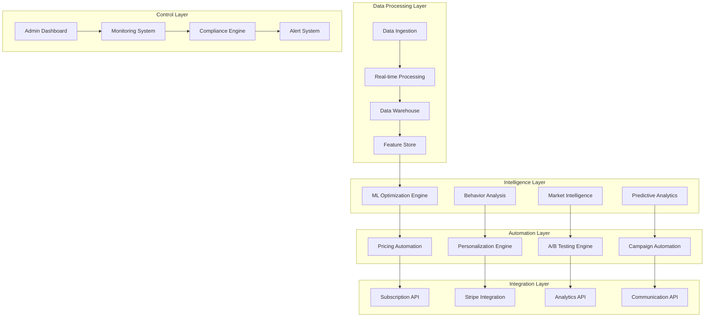
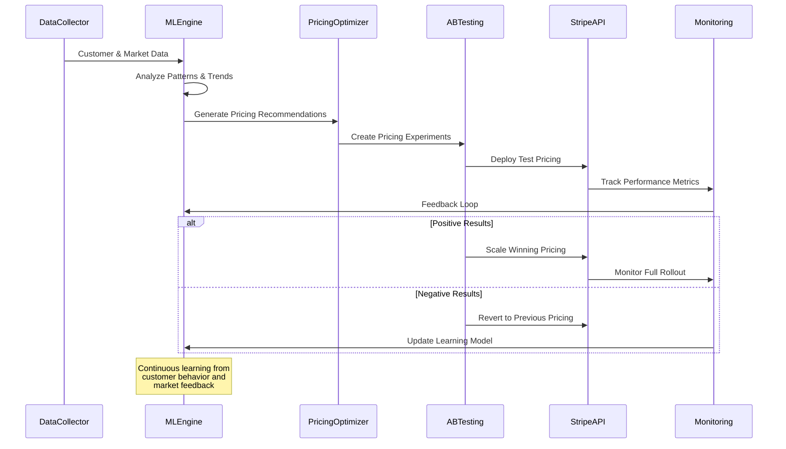
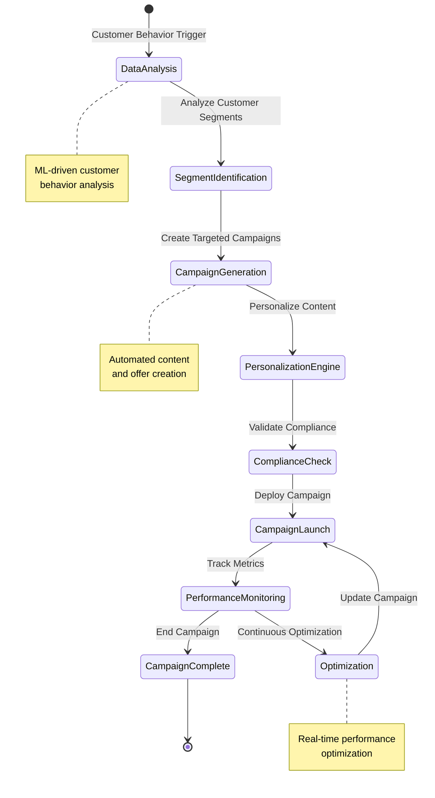

# Design Document

## Overview

The Managed Dynamic Pricing and Subscription Marketing system provides an intelligent, automated platform for revenue optimization through machine learning-driven pricing strategies and marketing campaign management. Built as an extension of the existing subscription and feature management systems, this platform leverages advanced analytics, predictive modeling, and real-time optimization to maximize revenue while maintaining customer satisfaction and market competitiveness.

The architecture emphasizes automation, intelligence, and continuous learning, with minimal manual intervention required for day-to-day operations while providing comprehensive oversight and control capabilities for strategic decision-making.

## Architecture

### High-Level Architecture



### ML-Driven Pricing Optimization Flow



### Campaign Automation Workflow



## Components and Interfaces

### Core Intelligence Services

#### MLOptimizationEngine
```typescript
interface MLOptimizationEngine {
  analyzePricingSensitivity(customerSegment: CustomerSegment): Promise<PricingSensitivityAnalysis>
  generatePricingRecommendations(marketData: MarketData, customerData: CustomerData): Promise<PricingRecommendation[]>
  predictChurnRisk(customerId: string): Promise<ChurnRiskScore>
  identifyExpansionOpportunities(customerId: string): Promise<ExpansionOpportunity[]>
  optimizeCampaignTiming(campaignConfig: CampaignConfig): Promise<OptimalTiming>
  calculateLifetimeValue(customerProfile: CustomerProfile): Promise<LTVPrediction>
}
```

#### PredictiveAnalyticsService
```typescript
interface PredictiveAnalyticsService {
  forecastRevenue(timeHorizon: TimeHorizon, scenarios: Scenario[]): Promise<RevenueForecast>
  predictMarketTrends(industry: string, region: string): Promise<MarketTrendAnalysis>
  analyzeCompetitorPricing(competitors: string[]): Promise<CompetitivePricingAnalysis>
  identifySeasonalPatterns(metricType: string): Promise<SeasonalityAnalysis>
  calculatePriceElasticity(productId: string, priceRange: PriceRange): Promise<ElasticityAnalysis>
  generateScenarioModeling(baselineMetrics: BaselineMetrics, variables: Variable[]): Promise<ScenarioResults>
}
```

#### CampaignAutomationService
```typescript
interface CampaignAutomationService {
  createAutomatedCampaign(trigger: BehaviorTrigger, segment: CustomerSegment): Promise<AutomatedCampaign>
  optimizeCampaignContent(campaignId: string, performanceData: PerformanceData): Promise<OptimizedContent>
  manageCampaignLifecycle(campaignId: string): Promise<CampaignStatus>
  personalizeOffers(customerId: string, campaignType: CampaignType): Promise<PersonalizedOffer>
  trackCampaignAttribution(campaignId: string): Promise<AttributionAnalysis>
  generateCampaignInsights(campaignId: string): Promise<CampaignInsights>
}
```

#### PersonalizationEngine
```typescript
interface PersonalizationEngine {
  generatePersonalizedPricing(customerId: string, context: PricingContext): Promise<PersonalizedPricing>
  createCustomizedOffers(customerProfile: CustomerProfile, intent: PurchaseIntent): Promise<CustomOffer>
  optimizeMessageTiming(customerId: string, messageType: MessageType): Promise<OptimalDeliveryTime>
  personalizeUserExperience(customerId: string, touchpoint: Touchpoint): Promise<PersonalizedExperience>
  calculateOfferRelevance(customerId: string, offers: Offer[]): Promise<RelevanceScore[]>
}
```

### Automation and Optimization Components

#### DynamicPricingController
```typescript
interface DynamicPricingControllerProps {
  pricingStrategy: PricingStrategy
  constraints: PricingConstraints
  onPriceChange: (change: PriceChange) => void
  onExperimentComplete: (results: ExperimentResults) => void
}

interface PricingStrategy {
  type: 'value_based' | 'competitive' | 'penetration' | 'premium' | 'dynamic'
  parameters: PricingParameters
  constraints: PricingConstraints
  objectives: PricingObjective[]
}

interface PricingConstraints {
  minPrice: number
  maxPrice: number
  maxChangePercentage: number
  grandfatheringRules: GrandfatheringRule[]
  competitiveThresholds: CompetitiveThreshold[]
}
```

#### CampaignOrchestrator
```typescript
interface CampaignOrchestratorProps {
  automationRules: AutomationRule[]
  segmentationCriteria: SegmentationCriteria
  onCampaignLaunch: (campaign: Campaign) => void
  onPerformanceAlert: (alert: PerformanceAlert) => void
}

interface AutomationRule {
  trigger: BehaviorTrigger
  conditions: TriggerCondition[]
  actions: CampaignAction[]
  cooldownPeriod: number
  maxFrequency: FrequencyLimit
}

interface CampaignAction {
  type: 'email' | 'in_app' | 'push' | 'sms' | 'direct_mail'
  template: MessageTemplate
  personalization: PersonalizationConfig
  timing: DeliveryTiming
  tracking: TrackingConfig
}
```

#### ExperimentationFramework
```typescript
interface ExperimentationFrameworkProps {
  experimentType: 'pricing' | 'campaign' | 'feature' | 'experience'
  testConfiguration: TestConfiguration
  onResultsAvailable: (results: ExperimentResults) => void
  onStatisticalSignificance: (significance: StatisticalSignificance) => void
}

interface TestConfiguration {
  hypothesis: string
  variants: TestVariant[]
  trafficAllocation: TrafficAllocation
  successMetrics: SuccessMetric[]
  minimumSampleSize: number
  maxDuration: number
  earlyStoppingRules: EarlyStoppingRule[]
}
```

## Data Models

### Customer and Behavioral Models

```typescript
interface CustomerProfile {
  customerId: string
  demographicData: DemographicData
  behavioralData: BehavioralData
  transactionHistory: TransactionHistory
  engagementMetrics: EngagementMetrics
  priceSensitivity: PriceSensitivityProfile
  lifetimeValue: LTVMetrics
  churnRisk: ChurnRiskProfile
  expansionPotential: ExpansionProfile
}

interface BehavioralData {
  usagePatterns: UsagePattern[]
  featureAdoption: FeatureAdoptionMetrics
  supportInteractions: SupportInteraction[]
  paymentBehavior: PaymentBehaviorMetrics
  engagementTrends: EngagementTrend[]
  sessionData: SessionAnalytics
}

interface PricingSensitivityProfile {
  elasticity: number
  priceThresholds: PriceThreshold[]
  competitiveSensitivity: number
  valuePerception: ValuePerceptionMetrics
  historicalPriceResponse: PriceResponseHistory[]
}
```

### Pricing and Campaign Models

```typescript
interface DynamicPricingModel {
  modelId: string
  pricingStrategy: PricingStrategy
  targetSegments: CustomerSegment[]
  pricingRules: PricingRule[]
  constraints: PricingConstraints
  performance: PricingPerformance
  lastOptimization: Date
  nextOptimization: Date
}

interface PricingRule {
  ruleId: string
  condition: PricingCondition
  action: PricingAction
  priority: number
  isActive: boolean
  effectiveDate: Date
  expirationDate?: Date
}

interface AutomatedCampaign {
  campaignId: string
  type: CampaignType
  trigger: BehaviorTrigger
  targetSegment: CustomerSegment
  content: CampaignContent
  personalization: PersonalizationConfig
  performance: CampaignPerformance
  status: CampaignStatus
  lifecycle: CampaignLifecycle
}

interface CampaignContent {
  subject: string
  body: string
  callToAction: CallToAction
  offers: Offer[]
  personalizationTokens: PersonalizationToken[]
  variants: ContentVariant[]
}
```

### Analytics and Prediction Models

```typescript
interface RevenueForecast {
  forecastId: string
  timeHorizon: TimeHorizon
  baselineRevenue: number
  forecastedRevenue: number
  confidenceInterval: ConfidenceInterval
  scenarios: ScenarioForecast[]
  assumptions: ForecastAssumption[]
  accuracy: ForecastAccuracy
  lastUpdated: Date
}

interface ChurnRiskScore {
  customerId: string
  riskScore: number
  riskLevel: 'low' | 'medium' | 'high' | 'critical'
  contributingFactors: RiskFactor[]
  recommendedActions: RetentionAction[]
  timeToChurn: number
  confidence: number
  lastCalculated: Date
}

interface ExpansionOpportunity {
  customerId: string
  opportunityType: 'upgrade' | 'add_on' | 'usage_increase' | 'cross_sell'
  potentialRevenue: number
  probability: number
  recommendedApproach: ExpansionStrategy
  timeline: ExpansionTimeline
  requiredActions: ExpansionAction[]
}

interface MarketIntelligence {
  competitorAnalysis: CompetitorAnalysis[]
  marketTrends: MarketTrend[]
  pricingBenchmarks: PricingBenchmark[]
  industryInsights: IndustryInsight[]
  economicIndicators: EconomicIndicator[]
  lastUpdated: Date
}
```

### Experimentation and Optimization Models

```typescript
interface ExperimentResults {
  experimentId: string
  hypothesis: string
  variants: VariantResults[]
  winner: string
  statisticalSignificance: number
  confidenceLevel: number
  effectSize: number
  businessImpact: BusinessImpact
  recommendations: ExperimentRecommendation[]
  conclusionDate: Date
}

interface OptimizationRecommendation {
  recommendationId: string
  type: 'pricing' | 'campaign' | 'segmentation' | 'personalization'
  description: string
  expectedImpact: ExpectedImpact
  implementationComplexity: 'low' | 'medium' | 'high'
  requiredResources: Resource[]
  timeline: ImplementationTimeline
  riskAssessment: RiskAssessment
}

interface PerformanceMetrics {
  conversionRate: number
  revenuePerCustomer: number
  customerLifetimeValue: number
  churnRate: number
  expansionRate: number
  campaignROI: number
  pricingEffectiveness: number
  customerSatisfaction: number
}
```

## Error Handling

### ML and Automation Errors
- **ModelDegradationDetected**: ML model performance has degraded below acceptable thresholds
- **PricingOptimizationFailed**: Automated pricing optimization encountered errors or constraints
- **CampaignAutomationError**: Automated campaign creation or management failed
- **DataQualityIssue**: Input data quality is insufficient for reliable predictions
- **ExperimentationError**: A/B testing framework encountered statistical or technical issues

### Business Logic Errors
- **PricingConstraintViolation**: Proposed pricing changes violate business rules or constraints
- **ComplianceViolation**: Automated actions violate regulatory or legal requirements
- **CustomerImpactTooHigh**: Proposed changes would negatively impact too many customers
- **RevenueTargetConflict**: Optimization recommendations conflict with financial targets
- **MarketPositionRisk**: Pricing changes would negatively impact competitive position

### Integration Errors
- **StripeIntegrationFailure**: Failed to implement pricing changes in Stripe
- **CommunicationDeliveryFailed**: Marketing campaign delivery failed
- **AnalyticsDataUnavailable**: Required analytics data is not available for optimization
- **ExternalAPITimeout**: External market intelligence or competitor data unavailable
- **CustomerDataIncomplete**: Insufficient customer data for personalization or optimization

### Error Response Format
```typescript
interface OptimizationErrorResponse {
  error: {
    code: string
    message: string
    details?: {
      affectedCustomers?: number
      revenueImpact?: number
      rollbackPlan?: string
      alternativeStrategies?: string[]
      dataQualityIssues?: string[]
    }
    timestamp: string
    requestId: string
    severity: 'low' | 'medium' | 'high' | 'critical'
  }
}
```

## Testing Strategy

### ML Model Testing
- **Model Validation**: Test ML models with historical data and cross-validation
- **Prediction Accuracy**: Validate prediction accuracy against actual outcomes
- **Bias Detection**: Test for algorithmic bias in pricing and campaign recommendations
- **Performance Testing**: Test model performance under various data loads and conditions

### Automation Testing
- **Pricing Automation**: Test automated pricing changes with various market scenarios
- **Campaign Automation**: Test campaign creation and optimization workflows
- **Experimentation Framework**: Test A/B testing statistical accuracy and early stopping
- **Personalization Engine**: Test personalization accuracy and relevance

### Integration Testing
- **Stripe Integration**: Test pricing synchronization and billing updates
- **Communication Systems**: Test campaign delivery across multiple channels
- **Analytics Integration**: Test data flow and metric calculation accuracy
- **Compliance Systems**: Test regulatory compliance validation and reporting

### Business Logic Testing
- **Revenue Optimization**: Test optimization algorithms with various business scenarios
- **Customer Impact**: Test customer experience and satisfaction impact of automated changes
- **Competitive Analysis**: Test market intelligence integration and competitive positioning
- **Financial Modeling**: Test revenue forecasting and scenario modeling accuracy

### Performance Testing
- **Real-time Processing**: Test system performance with high-volume data processing
- **ML Inference**: Test machine learning model inference speed and accuracy
- **Campaign Delivery**: Test marketing campaign delivery performance and scalability
- **Dashboard Responsiveness**: Test admin dashboard performance with large datasets

### Security and Compliance Testing
- **Data Privacy**: Test customer data handling and privacy compliance
- **Regulatory Compliance**: Test pricing and marketing compliance across jurisdictions
- **Access Controls**: Test role-based access to optimization and campaign management
- **Audit Trails**: Test comprehensive logging and audit trail functionality