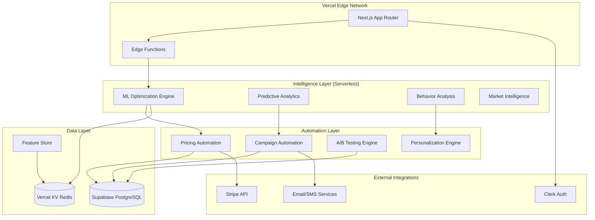
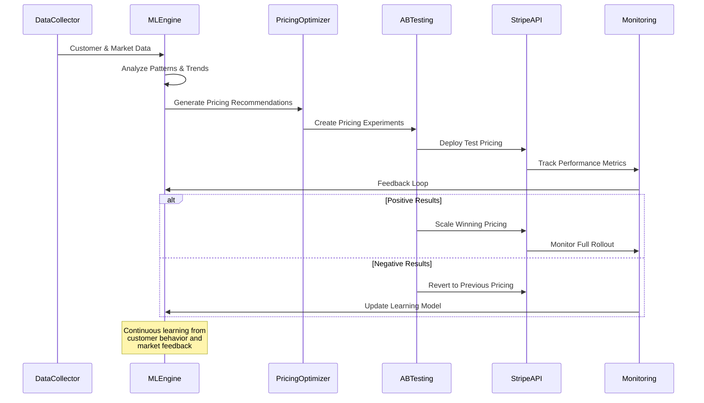
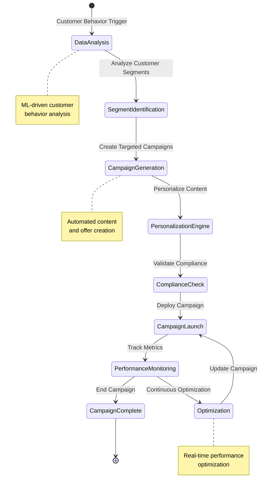

# Design Document

## Glossary

- **ML Engine**: Machine Learning Optimization Engine that analyzes data and generates recommendations
- **Dynamic Pricing**: Automated pricing adjustments based on market conditions and customer behavior
- **A/B Testing**: Experimental methodology comparing two variants to determine which performs better
- **Churn Risk**: Probability that a customer will cancel their subscription
- **LTV (Lifetime Value)**: Total revenue expected from a customer over their entire relationship
- **Grandfathering**: Maintaining existing customers on their current pricing when prices change
- **Multi-Armed Bandit**: Algorithm that balances exploration and exploitation in optimization
- **Price Elasticity**: Measure of how demand changes in response to price changes
- **Customer Segmentation**: Grouping customers based on shared characteristics or behaviors
- **Behavioral Trigger**: Specific customer action or pattern that initiates automated response
- **Campaign Attribution**: Tracking which marketing campaigns led to specific customer actions
- **Confidence Interval**: Range of values that likely contains the true value with specified probability
- **Statistical Significance**: Likelihood that a result is not due to random chance
- **Compliance Engine**: System component that validates regulatory and legal compliance
- **Feature Store**: Centralized repository for ML model features and training data
- **Personalization Engine**: System that customizes experiences for individual customers
- **Revenue Forecast**: Prediction of future revenue based on historical data and trends
- **ROI (Return on Investment)**: Ratio of profit to cost for marketing campaigns
- **RLS (Row Level Security)**: Database security that restricts data access at row level

## Overview

The Managed Dynamic Pricing and Subscription Marketing system provides an intelligent, automated platform for revenue optimization through machine learning-driven pricing strategies and marketing campaign management. Built as an extension of the existing subscription and feature management systems, this platform leverages advanced analytics, predictive modeling, and real-time optimization to maximize revenue while maintaining customer satisfaction and market competitiveness.

The architecture emphasizes automation, intelligence, and continuous learning, with minimal manual intervention required for day-to-day operations while providing comprehensive oversight and control capabilities for strategic decision-making.

## Architecture

### Deployment Architecture

**Platform**: Vercel with Next.js 15+ App Router
**Database**: Supabase (PostgreSQL) with Row Level Security
**Authentication**: Clerk for user management
**Caching**: Redis (Vercel KV) for session and ML inference caching
**ML Infrastructure**: Vercel Serverless Functions with Python/TensorFlow runtime
**Monitoring**: Vercel Analytics + Custom monitoring dashboard

### Integration with Existing Systems

This system extends the existing C9D AI platform architecture:
- **Subscription Management**: Integrates with existing subscription tables and Stripe integration
- **Feature Flags**: Leverages existing feature flag system for gradual rollout
- **User Management**: Uses existing Clerk authentication and organization structure
- **Database Schema**: Extends existing Supabase schema with new tables for pricing, campaigns, and analytics
- **API Routes**: Follows existing Next.js App Router patterns in `app/api/`

### High-Level Architecture


```mermaid
graph TB
    subgraph "Vercel Edge Network"
        EdgeFunctions[Edge Functions]
        NextJSApp[Next.js App Router]
    end
    
    subgraph "Intelligence Layer (Serverless)"
        MLEngine[ML Optimization Engine]
        PredictiveAnalytics[Predictive Analytics]
        BehaviorAnalysis[Behavior Analysis]
        MarketIntelligence[Market Intelligence]
    end
    
    subgraph "Automation Layer"
        PricingAutomation[Pricing Automation]
        CampaignAutomation[Campaign Automation]
        ExperimentationEngine[A/B Testing Engine]
        PersonalizationEngine[Personalization Engine]
    end
    
    subgraph "Data Layer"
        Supabase[(Supabase PostgreSQL)]
        RedisCache[(Vercel KV Redis)]
        FeatureStore[Feature Store]
    end
    
    subgraph "External Integrations"
        Stripe[Stripe API]
        ClerkAuth[Clerk Auth]
        Communications[Email/SMS Services]
    end
    
    NextJSApp --> EdgeFunctions
    EdgeFunctions --> MLEngine
    MLEngine --> PricingAutomation
    PredictiveAnalytics --> CampaignAutomation
    BehaviorAnalysis --> PersonalizationEngine
    
    PricingAutomation --> Supabase
    CampaignAutomation --> Supabase
    ExperimentationEngine --> Supabase
    
    MLEngine --> RedisCache
    FeatureStore --> RedisCache
    
    PricingAutomation --> Stripe
    NextJSApp --> ClerkAuth
    CampaignAutomation --> Communications
```

### ML-Driven Pricing Optimization Flow


```mermaid
sequenceDiagram
    participant DataCollector
    participant MLEngine
    participant PricingOptimizer
    participant ABTesting
    participant StripeAPI
    participant Monitoring
    
    DataCollector->>MLEngine: Customer & Market Data
    MLEngine->>MLEngine: Analyze Patterns & Trends
    MLEngine->>PricingOptimizer: Generate Pricing Recommendations
    PricingOptimizer->>ABTesting: Create Pricing Experiments
    ABTesting->>StripeAPI: Deploy Test Pricing
    StripeAPI->>Monitoring: Track Performance Metrics
    Monitoring->>MLEngine: Feedback Loop
    
    alt Positive Results
        ABTesting->>StripeAPI: Scale Winning Pricing
        StripeAPI->>Monitoring: Monitor Full Rollout
    else Negative Results
        ABTesting->>StripeAPI: Revert to Previous Pricing
        Monitoring->>MLEngine: Update Learning Model
    end
    
    Note over MLEngine: Continuous learning from<br/>customer behavior and<br/>market feedback
```

### Campaign Automation Workflow


```mermaid
stateDiagram-v2
    [*] --> DataAnalysis : Customer Behavior Trigger
    DataAnalysis --> SegmentIdentification : Analyze Customer Segments
    SegmentIdentification --> CampaignGeneration : Create Targeted Campaigns
    CampaignGeneration --> PersonalizationEngine : Personalize Content
    PersonalizationEngine --> ComplianceCheck : Validate Compliance
    ComplianceCheck --> CampaignLaunch : Deploy Campaign
    CampaignLaunch --> PerformanceMonitoring : Track Metrics
    PerformanceMonitoring --> Optimization : Continuous Optimization
    Optimization --> CampaignLaunch : Update Campaign
    PerformanceMonitoring --> CampaignComplete : End Campaign
    CampaignComplete --> [*]
    
    note right of DataAnalysis : ML-driven customer<br/>behavior analysis
    note right of CampaignGeneration : Automated content<br/>and offer creation
    note right of Optimization : Real-time performance<br/>optimization
```

## Components and Interfaces

### Core Intelligence Services

#### MLOptimizationEngine
```typescript
interface MLOptimizationEngine {
  analyzePricingSensitivity(customerSegment: CustomerSegment): Promise<PricingSensitivityAnalysis>
  generatePricingRecommendations(marketData: MarketData, customerData: CustomerData): Promise<PricingRecommendation[]>
  predictChurnRisk(customerId: string): Promise<ChurnRiskScore>
  identifyExpansionOpportunities(customerId: string): Promise<ExpansionOpportunity[]>
  optimizeCampaignTiming(campaignConfig: CampaignConfig): Promise<OptimalTiming>
  calculateLifetimeValue(customerProfile: CustomerProfile): Promise<LTVPrediction>
}
```

#### PredictiveAnalyticsService
```typescript
interface PredictiveAnalyticsService {
  forecastRevenue(timeHorizon: TimeHorizon, scenarios: Scenario[]): Promise<RevenueForecast>
  predictMarketTrends(industry: string, region: string): Promise<MarketTrendAnalysis>
  analyzeCompetitorPricing(competitors: string[]): Promise<CompetitivePricingAnalysis>
  identifySeasonalPatterns(metricType: string): Promise<SeasonalityAnalysis>
  calculatePriceElasticity(productId: string, priceRange: PriceRange): Promise<ElasticityAnalysis>
  generateScenarioModeling(baselineMetrics: BaselineMetrics, variables: Variable[]): Promise<ScenarioResults>
}
```

#### CampaignAutomationService
```typescript
interface CampaignAutomationService {
  createAutomatedCampaign(trigger: BehaviorTrigger, segment: CustomerSegment): Promise<AutomatedCampaign>
  optimizeCampaignContent(campaignId: string, performanceData: PerformanceData): Promise<OptimizedContent>
  manageCampaignLifecycle(campaignId: string): Promise<CampaignStatus>
  personalizeOffers(customerId: string, campaignType: CampaignType): Promise<PersonalizedOffer>
  trackCampaignAttribution(campaignId: string): Promise<AttributionAnalysis>
  generateCampaignInsights(campaignId: string): Promise<CampaignInsights>
}
```

#### PersonalizationEngine
```typescript
interface PersonalizationEngine {
  generatePersonalizedPricing(customerId: string, context: PricingContext): Promise<PersonalizedPricing>
  createCustomizedOffers(customerProfile: CustomerProfile, intent: PurchaseIntent): Promise<CustomOffer>
  optimizeMessageTiming(customerId: string, messageType: MessageType): Promise<OptimalDeliveryTime>
  personalizeUserExperience(customerId: string, touchpoint: Touchpoint): Promise<PersonalizedExperience>
  calculateOfferRelevance(customerId: string, offers: Offer[]): Promise<RelevanceScore[]>
  trackSatisfactionCorrelation(customerId: string, personalizationActions: PersonalizationAction[]): Promise<SatisfactionCorrelation>
}
```

#### ComplianceMonitoringService
```typescript
interface ComplianceMonitoringService {
  validatePricingCompliance(pricingChange: PricingChange, region: string): Promise<ComplianceValidation>
  validateCampaignCompliance(campaign: Campaign, regulations: Regulation[]): Promise<ComplianceValidation>
  validateDataProcessing(operation: DataOperation, consents: CustomerConsent[]): Promise<ComplianceValidation>
  generateAuditTrail(activity: AutomatedActivity): Promise<AuditTrailEntry>
  detectViolations(activities: Activity[]): Promise<ComplianceViolation[]>
  haltNonCompliantActivity(activityId: string, violation: ComplianceViolation): Promise<HaltResult>
  generateComplianceReport(timeRange: TimeRange): Promise<ComplianceReport>
}
```

#### RealtimeMonitoringService
```typescript
interface RealtimeMonitoringService {
  getDashboardMetrics(userId: string, filters: MetricFilters): Promise<DashboardMetrics>
  generateAlert(event: SignificantEvent, context: AlertContext): Promise<Alert>
  trackMetricThresholds(metrics: Metric[], thresholds: Threshold[]): Promise<ThresholdStatus[]>
  createVisualization(data: AnalyticsData, visualizationType: VisualizationType): Promise<Visualization>
  generateAutomatedReport(reportConfig: ReportConfig): Promise<Report>
  escalateAlert(alert: Alert, escalationLevel: EscalationLevel): Promise<EscalationResult>
}
```

#### FinancialOptimizationService
```typescript
interface FinancialOptimizationService {
  alignPricingWithTargets(financialTargets: FinancialTargets, marketConstraints: MarketConstraints): Promise<PricingStrategy>
  balanceShortLongTermValue(scenario: OptimizationScenario): Promise<BalancedStrategy>
  calculateProfitability(pricingModel: PricingModel, costs: CostStructure): Promise<ProfitabilityAnalysis>
  generateRevenueAttribution(activities: RevenueActivity[]): Promise<AttributionReport>
  recommendStrategicAdjustments(currentPerformance: Performance, targets: FinancialTargets): Promise<StrategyRecommendation[]>
  performScenarioAnalysis(baselineScenario: Scenario, variables: Variable[]): Promise<ScenarioAnalysisResults>
}
```

### Automation and Optimization Components

#### DynamicPricingController
```typescript
interface DynamicPricingControllerProps {
  pricingStrategy: PricingStrategy
  constraints: PricingConstraints
  onPriceChange: (change: PriceChange) => void
  onExperimentComplete: (results: ExperimentResults) => void
}

interface PricingStrategy {
  type: 'value_based' | 'competitive' | 'penetration' | 'premium' | 'dynamic'
  parameters: PricingParameters
  constraints: PricingConstraints
  objectives: PricingObjective[]
}

interface PricingConstraints {
  minPrice: number
  maxPrice: number
  maxChangePercentage: number
  grandfatheringRules: GrandfatheringRule[]
  competitiveThresholds: CompetitiveThreshold[]
}
```

#### CampaignOrchestrator
```typescript
interface CampaignOrchestratorProps {
  automationRules: AutomationRule[]
  segmentationCriteria: SegmentationCriteria
  onCampaignLaunch: (campaign: Campaign) => void
  onPerformanceAlert: (alert: PerformanceAlert) => void
}

interface AutomationRule {
  trigger: BehaviorTrigger
  conditions: TriggerCondition[]
  actions: CampaignAction[]
  cooldownPeriod: number
  maxFrequency: FrequencyLimit
}

interface CampaignAction {
  type: 'email' | 'in_app' | 'push' | 'sms' | 'direct_mail'
  template: MessageTemplate
  personalization: PersonalizationConfig
  timing: DeliveryTiming
  tracking: TrackingConfig
}
```

#### ExperimentationFramework
```typescript
interface ExperimentationFrameworkProps {
  experimentType: 'pricing' | 'campaign' | 'feature' | 'experience'
  testConfiguration: TestConfiguration
  onResultsAvailable: (results: ExperimentResults) => void
  onStatisticalSignificance: (significance: StatisticalSignificance) => void
}

interface TestConfiguration {
  hypothesis: string
  variants: TestVariant[]
  trafficAllocation: TrafficAllocation
  successMetrics: SuccessMetric[]
  minimumSampleSize: number
  maxDuration: number
  earlyStoppingRules: EarlyStoppingRule[]
}
```

## Data Models

### Database Schema Integration

This system extends the existing Supabase schema with new tables while maintaining compatibility with existing structures:

**Existing Tables Used**:
- `users` - Customer profile data (extends with behavioral analytics)
- `organizations` - Organization context for pricing and campaigns
- `subscriptions` - Current subscription data (integrates with pricing models)
- `feature_flags` - Gradual rollout of pricing experiments

**New Tables Required**:
```sql
-- Pricing models and history
CREATE TABLE pricing_models (
  id UUID PRIMARY KEY DEFAULT gen_random_uuid(),
  organization_id UUID REFERENCES organizations(id) ON DELETE CASCADE,
  name TEXT NOT NULL,
  strategy JSONB NOT NULL, -- PricingStrategy object
  constraints JSONB NOT NULL, -- PricingConstraints object
  is_active BOOLEAN DEFAULT true,
  created_at TIMESTAMPTZ DEFAULT NOW(),
  updated_at TIMESTAMPTZ DEFAULT NOW()
);

-- Campaign definitions and performance
CREATE TABLE marketing_campaigns (
  id UUID PRIMARY KEY DEFAULT gen_random_uuid(),
  organization_id UUID REFERENCES organizations(id) ON DELETE CASCADE,
  name TEXT NOT NULL,
  type TEXT NOT NULL, -- 'retention', 'expansion', 'win_back', etc.
  trigger JSONB NOT NULL, -- BehaviorTrigger object
  target_segment JSONB NOT NULL, -- CustomerSegment object
  content JSONB NOT NULL, -- CampaignContent object
  performance JSONB, -- CampaignPerformance object
  status TEXT NOT NULL, -- 'draft', 'active', 'paused', 'completed'
  created_at TIMESTAMPTZ DEFAULT NOW(),
  updated_at TIMESTAMPTZ DEFAULT NOW()
);

-- ML model metadata and performance
CREATE TABLE ml_models (
  id UUID PRIMARY KEY DEFAULT gen_random_uuid(),
  model_type TEXT NOT NULL, -- 'pricing', 'churn', 'ltv', etc.
  version TEXT NOT NULL,
  parameters JSONB NOT NULL,
  performance_metrics JSONB NOT NULL,
  is_active BOOLEAN DEFAULT false,
  trained_at TIMESTAMPTZ NOT NULL,
  created_at TIMESTAMPTZ DEFAULT NOW()
);

-- Experiment tracking
CREATE TABLE experiments (
  id UUID PRIMARY KEY DEFAULT gen_random_uuid(),
  organization_id UUID REFERENCES organizations(id) ON DELETE CASCADE,
  experiment_type TEXT NOT NULL, -- 'pricing', 'campaign', 'feature'
  hypothesis TEXT NOT NULL,
  configuration JSONB NOT NULL, -- TestConfiguration object
  results JSONB, -- ExperimentResults object
  status TEXT NOT NULL, -- 'running', 'completed', 'failed'
  started_at TIMESTAMPTZ DEFAULT NOW(),
  completed_at TIMESTAMPTZ
);

-- Compliance audit trail
CREATE TABLE compliance_audit_log (
  id UUID PRIMARY KEY DEFAULT gen_random_uuid(),
  activity_type TEXT NOT NULL,
  activity_id UUID NOT NULL,
  user_id UUID REFERENCES users(id),
  action TEXT NOT NULL,
  input_data JSONB,
  output_data JSONB,
  compliance_checks JSONB NOT NULL,
  timestamp TIMESTAMPTZ DEFAULT NOW()
);

-- Customer behavioral analytics
CREATE TABLE customer_behavior_analytics (
  id UUID PRIMARY KEY DEFAULT gen_random_uuid(),
  user_id UUID REFERENCES users(id) ON DELETE CASCADE,
  organization_id UUID REFERENCES organizations(id) ON DELETE CASCADE,
  behavioral_data JSONB NOT NULL, -- BehavioralData object
  price_sensitivity JSONB NOT NULL, -- PriceSensitivityProfile object
  churn_risk JSONB NOT NULL, -- ChurnRiskProfile object
  ltv_metrics JSONB NOT NULL, -- LTVMetrics object
  last_updated TIMESTAMPTZ DEFAULT NOW()
);
```

**Row Level Security (RLS) Policies**:
All new tables will implement RLS policies consistent with existing patterns:
- Users can only access data for their organization
- Admin users have full access within their organization
- Service role bypasses RLS for system operations

### Customer and Behavioral Models

```typescript
interface CustomerProfile {
  customerId: string
  demographicData: DemographicData
  behavioralData: BehavioralData
  transactionHistory: TransactionHistory
  engagementMetrics: EngagementMetrics
  priceSensitivity: PriceSensitivityProfile
  lifetimeValue: LTVMetrics
  churnRisk: ChurnRiskProfile
  expansionPotential: ExpansionProfile
}

interface BehavioralData {
  usagePatterns: UsagePattern[]
  featureAdoption: FeatureAdoptionMetrics
  supportInteractions: SupportInteraction[]
  paymentBehavior: PaymentBehaviorMetrics
  engagementTrends: EngagementTrend[]
  sessionData: SessionAnalytics
}

interface PricingSensitivityProfile {
  elasticity: number
  priceThresholds: PriceThreshold[]
  competitiveSensitivity: number
  valuePerception: ValuePerceptionMetrics
  historicalPriceResponse: PriceResponseHistory[]
}
```

### Pricing and Campaign Models

```typescript
interface DynamicPricingModel {
  modelId: string
  pricingStrategy: PricingStrategy
  targetSegments: CustomerSegment[]
  pricingRules: PricingRule[]
  constraints: PricingConstraints
  performance: PricingPerformance
  lastOptimization: Date
  nextOptimization: Date
}

interface PricingRule {
  ruleId: string
  condition: PricingCondition
  action: PricingAction
  priority: number
  isActive: boolean
  effectiveDate: Date
  expirationDate?: Date
}

interface AutomatedCampaign {
  campaignId: string
  type: CampaignType
  trigger: BehaviorTrigger
  targetSegment: CustomerSegment
  content: CampaignContent
  personalization: PersonalizationConfig
  performance: CampaignPerformance
  status: CampaignStatus
  lifecycle: CampaignLifecycle
}

interface CampaignContent {
  subject: string
  body: string
  callToAction: CallToAction
  offers: Offer[]
  personalizationTokens: PersonalizationToken[]
  variants: ContentVariant[]
}
```

### Analytics and Prediction Models

```typescript
interface RevenueForecast {
  forecastId: string
  timeHorizon: TimeHorizon
  baselineRevenue: number
  forecastedRevenue: number
  confidenceInterval: ConfidenceInterval
  scenarios: ScenarioForecast[]
  assumptions: ForecastAssumption[]
  accuracy: ForecastAccuracy
  lastUpdated: Date
}

interface ChurnRiskScore {
  customerId: string
  riskScore: number
  riskLevel: 'low' | 'medium' | 'high' | 'critical'
  contributingFactors: RiskFactor[]
  recommendedActions: RetentionAction[]
  timeToChurn: number
  confidence: number
  lastCalculated: Date
}

interface ExpansionOpportunity {
  customerId: string
  opportunityType: 'upgrade' | 'add_on' | 'usage_increase' | 'cross_sell'
  potentialRevenue: number
  probability: number
  recommendedApproach: ExpansionStrategy
  timeline: ExpansionTimeline
  requiredActions: ExpansionAction[]
}

interface MarketIntelligence {
  competitorAnalysis: CompetitorAnalysis[]
  marketTrends: MarketTrend[]
  pricingBenchmarks: PricingBenchmark[]
  industryInsights: IndustryInsight[]
  economicIndicators: EconomicIndicator[]
  lastUpdated: Date
}
```

### Experimentation and Optimization Models

```typescript
interface ExperimentResults {
  experimentId: string
  hypothesis: string
  variants: VariantResults[]
  winner: string
  statisticalSignificance: number
  confidenceLevel: number
  effectSize: number
  businessImpact: BusinessImpact
  recommendations: ExperimentRecommendation[]
  conclusionDate: Date
  failureAnalysis?: FailureAnalysis
}

interface OptimizationRecommendation {
  recommendationId: string
  type: 'pricing' | 'campaign' | 'segmentation' | 'personalization'
  description: string
  expectedImpact: ExpectedImpact
  implementationComplexity: 'low' | 'medium' | 'high'
  requiredResources: Resource[]
  timeline: ImplementationTimeline
  riskAssessment: RiskAssessment
}

interface PerformanceMetrics {
  conversionRate: number
  revenuePerCustomer: number
  customerLifetimeValue: number
  churnRate: number
  expansionRate: number
  campaignROI: number
  pricingEffectiveness: number
  customerSatisfaction: number
}
```

### Compliance and Regulatory Models

```typescript
interface ComplianceValidation {
  isCompliant: boolean
  validatedRegulations: Regulation[]
  violations: ComplianceViolation[]
  warnings: ComplianceWarning[]
  validationTimestamp: Date
  validatedBy: string
}

interface ComplianceViolation {
  violationId: string
  type: 'pricing' | 'marketing' | 'data_privacy' | 'consumer_protection'
  severity: 'low' | 'medium' | 'high' | 'critical'
  regulation: Regulation
  description: string
  affectedCustomers: number
  detectedAt: Date
  requiredActions: RemediationAction[]
}

interface AuditTrailEntry {
  entryId: string
  activityType: string
  activityId: string
  timestamp: Date
  userId: string
  action: string
  inputData: Record<string, unknown>
  outputData: Record<string, unknown>
  complianceChecks: ComplianceCheck[]
  approvals: Approval[]
}

interface CustomerConsent {
  customerId: string
  consentType: 'marketing' | 'data_processing' | 'personalization' | 'analytics'
  granted: boolean
  grantedAt: Date
  expiresAt?: Date
  scope: string[]
  region: string
}
```

### Monitoring and Alerting Models

```typescript
interface DashboardMetrics {
  realTimeMetrics: RealtimeMetric[]
  trendData: TrendDataPoint[]
  alerts: Alert[]
  performanceSummary: PerformanceSummary
  lastUpdated: Date
}

interface Alert {
  alertId: string
  type: 'performance' | 'compliance' | 'system' | 'business'
  severity: 'info' | 'warning' | 'error' | 'critical'
  title: string
  description: string
  context: AlertContext
  impactAnalysis: ImpactAnalysis
  recommendedActions: RecommendedAction[]
  createdAt: Date
  acknowledgedAt?: Date
  resolvedAt?: Date
}

interface AlertContext {
  affectedMetrics: string[]
  currentValues: Record<string, number>
  thresholdValues: Record<string, number>
  historicalComparison: HistoricalComparison
  relatedActivities: Activity[]
}

interface Threshold {
  metricName: string
  operator: 'greater_than' | 'less_than' | 'equals' | 'not_equals'
  value: number
  duration: number
  severity: 'warning' | 'critical'
  escalationRules: EscalationRule[]
}
```

### Financial Optimization Models

```typescript
interface FinancialTargets {
  targetRevenue: number
  targetMargin: number
  targetGrowthRate: number
  timeHorizon: TimeHorizon
  constraints: FinancialConstraint[]
  priorities: TargetPriority[]
}

interface CostStructure {
  customerAcquisitionCost: number
  supportCostPerCustomer: number
  infrastructureCostPerCustomer: number
  marketingCostPerCampaign: number
  operationalOverhead: number
  variableCosts: VariableCost[]
}

interface ProfitabilityAnalysis {
  grossMargin: number
  netMargin: number
  contributionMargin: number
  breakEvenPoint: number
  paybackPeriod: number
  customerLevelProfitability: CustomerProfitability[]
  segmentProfitability: SegmentProfitability[]
}

interface AttributionReport {
  totalRevenue: number
  attributedRevenue: number
  unattributedRevenue: number
  channelAttribution: ChannelAttribution[]
  campaignAttribution: CampaignAttribution[]
  touchpointAttribution: TouchpointAttribution[]
  attributionModel: 'first_touch' | 'last_touch' | 'linear' | 'time_decay' | 'position_based'
}

interface StrategyRecommendation {
  recommendationId: string
  strategyType: 'pricing' | 'marketing' | 'product' | 'market_expansion'
  description: string
  expectedImpact: FinancialImpact
  implementationPlan: ImplementationPlan
  riskFactors: RiskFactor[]
  alternativeStrategies: AlternativeStrategy[]
  scenarioAnalysis: ScenarioAnalysisResults
}
```

## Error Handling

### ML and Automation Errors
- **ModelDegradationDetected**: ML model performance has degraded below acceptable thresholds
- **PricingOptimizationFailed**: Automated pricing optimization encountered errors or constraints
- **CampaignAutomationError**: Automated campaign creation or management failed
- **DataQualityIssue**: Input data quality is insufficient for reliable predictions
- **ExperimentationError**: A/B testing framework encountered statistical or technical issues

### Business Logic Errors
- **PricingConstraintViolation**: Proposed pricing changes violate business rules or constraints
- **ComplianceViolation**: Automated actions violate regulatory or legal requirements
- **CustomerImpactTooHigh**: Proposed changes would negatively impact too many customers
- **RevenueTargetConflict**: Optimization recommendations conflict with financial targets
- **MarketPositionRisk**: Pricing changes would negatively impact competitive position

### Integration Errors
- **StripeIntegrationFailure**: Failed to implement pricing changes in Stripe
- **CommunicationDeliveryFailed**: Marketing campaign delivery failed
- **AnalyticsDataUnavailable**: Required analytics data is not available for optimization
- **ExternalAPITimeout**: External market intelligence or competitor data unavailable
- **CustomerDataIncomplete**: Insufficient customer data for personalization or optimization

### Error Response Format
```typescript
interface OptimizationErrorResponse {
  error: {
    code: string
    message: string
    details?: {
      affectedCustomers?: number
      revenueImpact?: number
      rollbackPlan?: string
      alternativeStrategies?: string[]
      dataQualityIssues?: string[]
    }
    timestamp: string
    requestId: string
    severity: 'low' | 'medium' | 'high' | 'critical'
  }
}
```

## Correctness Properties

*A property is a characteristic or behavior that should hold true across all valid executions of a system—essentially, a formal statement about what the system should do. Properties serve as the bridge between human-readable specifications and machine-verifiable correctness guarantees.*

### Property 1: Pricing Constraint Preservation
*For any* pricing optimization operation, all pricing changes must remain within predefined minimum and maximum price boundaries and respect grandfathering rules for existing customers.
**Validates: Requirements 1.1, 1.4**

### Property 2: A/B Test Statistical Validity
*For any* pricing or campaign experiment, the system must achieve statistical significance before declaring a winner and rolling out changes.
**Validates: Requirements 1.3, 10.1**

### Property 3: Automatic Reversion on Negative Impact
*For any* pricing change that causes key metrics (conversion rate, churn rate, revenue) to decline beyond threshold, the system must automatically revert to previous pricing within the defined rollback window.
**Validates: Requirements 1.5**

### Property 4: Campaign Segmentation Accuracy
*For any* customer segment, all generated marketing campaigns must target only customers matching the segment criteria with personalized messaging appropriate to that segment.
**Validates: Requirements 2.1, 8.1**

### Property 5: Behavioral Trigger Responsiveness
*For any* detected behavioral trigger (churn risk, expansion opportunity), the system must launch the appropriate campaign type within the defined response time window.
**Validates: Requirements 2.2, 4.1, 4.2**

### Property 6: Campaign Performance Threshold Enforcement
*For any* active campaign with performance below defined thresholds, the system must pause the campaign and generate optimization recommendations.
**Validates: Requirements 2.5**

### Property 7: Revenue Forecast Confidence Bounds
*For any* revenue forecast, the system must provide confidence intervals that accurately reflect prediction uncertainty based on historical forecast accuracy.
**Validates: Requirements 3.1, 3.5**

### Property 8: Churn Detection Early Warning
*For any* customer exhibiting churn risk indicators, the system must detect the risk and trigger intervention campaigns before the predicted churn date.
**Validates: Requirements 4.1**

### Property 9: Financial Target Alignment
*For any* pricing strategy, the recommended pricing must mathematically align with stated financial targets while respecting market constraints and customer lifetime value considerations.
**Validates: Requirements 5.1, 5.2**

### Property 10: Cost-Inclusive Profitability Analysis
*For any* profitability calculation, the system must include all relevant costs (customer acquisition, support, infrastructure) in margin analysis.
**Validates: Requirements 5.3**

### Property 11: Statistical Significance Validation
*For any* ML-generated insight or recommendation, the system must provide statistical significance testing results and confidence intervals.
**Validates: Requirements 6.3**

### Property 12: Model Performance Degradation Detection
*For any* ML model, when prediction accuracy falls below acceptable thresholds, the system must trigger model recalibration and alert administrators.
**Validates: Requirements 6.4, 3.5**

### Property 13: Compliance Validation Before Execution
*For any* pricing change or marketing campaign, the system must validate compliance with all applicable regulations before execution.
**Validates: Requirements 7.1, 7.2**

### Property 14: Privacy Regulation Adherence
*For any* customer data processing operation, the system must maintain GDPR, CCPA, and applicable privacy regulation compliance with proper consent verification.
**Validates: Requirements 7.3**

### Property 15: Compliance Violation Immediate Halt
*For any* detected compliance violation, the system must immediately halt the problematic activity and generate detailed violation reports.
**Validates: Requirements 7.5**

### Property 16: Personalization Relevance Scoring
*For any* personalized offer, the system must calculate and validate relevance scores based on customer usage patterns, engagement levels, and value realization.
**Validates: Requirements 8.1**

### Property 17: Communication Timing Optimization
*For any* customer communication, the delivery time must be optimized based on customer preferences, time zones, and historical engagement patterns.
**Validates: Requirements 8.2**

### Property 18: Customer Satisfaction Correlation
*For any* personalization strategy, the system must track correlation between personalization actions and customer satisfaction metrics.
**Validates: Requirements 8.4, 8.5**

### Property 19: Real-time Metric Accuracy
*For any* dashboard metric, the displayed value must accurately reflect the current state within the defined latency threshold.
**Validates: Requirements 9.1**

### Property 20: Alert Context Completeness
*For any* generated alert, the system must include context, impact analysis, and recommended actions.
**Validates: Requirements 9.2**

### Property 21: Experiment Design Validity
*For any* A/B test, the experiment design must include proper control groups, traffic allocation, success metrics, and statistical power calculations.
**Validates: Requirements 10.1**

### Property 22: Multi-Armed Bandit Convergence
*For any* continuous optimization using multi-armed bandit algorithms, the system must converge toward optimal strategies while maintaining exploration.
**Validates: Requirements 10.2**

### Property 23: Gradual Rollout Safety
*For any* winning experiment strategy, the rollout must be gradual with continuous monitoring for negative impacts at each stage.
**Validates: Requirements 10.3**

### Property 24: Cohort Performance Tracking
*For any* optimization activity, the system must track cohort-level performance and lifetime value changes over time.
**Validates: Requirements 10.4**

### Property 25: Experiment Failure Analysis
*For any* failed experiment, the system must provide detailed failure analysis including contributing factors and learning recommendations.
**Validates: Requirements 10.5**

## Testing Strategy

### Testing Framework and Standards

**Testing Framework**: Vitest with @testing-library/react
**Property Testing**: fast-check for property-based tests
**E2E Testing**: Playwright with Clerk testing utilities
**Coverage Requirements**: 
- Services: 100% coverage
- Models: 95% coverage
- API Routes: 90% coverage
- Global: 85% minimum

**Critical Requirements**:
- All tests must pass 100% successfully for task completion
- Tests must be idempotent and support parallel execution
- Test data must be managed through entire lifecycle without tainting datastores
- Memory management: `NODE_OPTIONS="--max-old-space-size=8192"` for all test commands

### Unit Testing
Unit tests will verify specific functionality of individual components:
- ML model prediction functions with known inputs
- Pricing constraint validation logic
- Campaign segmentation algorithms
- Compliance validation rules
- Statistical significance calculations

**Test Isolation**: Each unit test must be independent and not rely on external state.

### Property-Based Testing
Property-based tests will verify universal properties across all inputs using **fast-check**:

**Property Testing Library**: fast-check
**Minimum Iterations**: 100 runs per property test
**Tagging Format**: `// Feature: managed-dynamic-pricing-subscription-marketing, Property {number}: {property_text}`

Each correctness property listed above must be implemented as a property-based test that:
- Generates random valid inputs (customer data, pricing scenarios, campaign configurations)
- Verifies the property holds across all generated inputs
- Runs minimum 100 iterations to ensure statistical confidence
- Tags the test with explicit reference to the design document property

Example property test structure:
```typescript
// Feature: managed-dynamic-pricing-subscription-marketing, Property 1: Pricing Constraint Preservation
test('pricing changes respect constraints', () => {
  fc.assert(
    fc.property(
      fc.record({
        currentPrice: fc.float({ min: 0, max: 1000 }),
        minPrice: fc.float({ min: 0, max: 500 }),
        maxPrice: fc.float({ min: 500, max: 2000 }),
        optimizationFactor: fc.float({ min: 0.5, max: 1.5 })
      }),
      (scenario) => {
        const newPrice = optimizePricing(scenario)
        return newPrice >= scenario.minPrice && newPrice <= scenario.maxPrice
      }
    ),
    { numRuns: 100 }
  )
})
```

### Integration Testing with Real Services

**Critical Requirement**: All integration tests MUST use real services (Supabase, Stripe, Redis) as priority.

#### Supabase Integration Testing
```typescript
// Integration tests use real Supabase client with test database
describe('Pricing Service Integration', () => {
  let testClient: SupabaseClient
  let testData: TestDataManager
  
  beforeAll(async () => {
    testClient = createSupabaseClient() // Real client
    testData = new TestDataManager(testClient)
    await testData.seedTestData() // Isolated test data
  })
  
  afterAll(async () => {
    await testData.cleanup() // Complete lifecycle management
  })
  
  it('should update pricing in real database', async () => {
    const pricing = await PricingService.update(testData.pricingId, {
      price: 99.99
    })
    
    // Verify in real database
    const { data } = await testClient
      .from('pricing_models')
      .select('*')
      .eq('id', testData.pricingId)
      .single()
    
    expect(data.price).toBe(99.99)
  })
})
```

#### Test Data Management
```typescript
class TestDataManager {
  private createdIds: Map<string, string[]> = new Map()
  
  async seedTestData(): Promise<TestDataSet> {
    // Create isolated test data with unique identifiers
    const testOrg = await this.createTestOrganization()
    const testUser = await this.createTestUser(testOrg.id)
    const testPricing = await this.createTestPricing(testOrg.id)
    
    // Track all created IDs for cleanup
    this.createdIds.set('organizations', [testOrg.id])
    this.createdIds.set('users', [testUser.id])
    this.createdIds.set('pricing', [testPricing.id])
    
    return { testOrg, testUser, testPricing }
  }
  
  async cleanup(): Promise<void> {
    // Delete in reverse dependency order
    for (const [table, ids] of this.createdIds.entries()) {
      await this.client.from(table).delete().in('id', ids)
    }
    this.createdIds.clear()
  }
}
```

#### Idempotency and Parallel Execution
```typescript
// Use unique identifiers for parallel test execution
const testRunId = `test_${Date.now()}_${Math.random().toString(36)}`

describe('Campaign Automation Integration', () => {
  it('should handle parallel test execution', async () => {
    const campaignName = `test_campaign_${testRunId}`
    
    // Each test run uses unique identifiers
    const campaign = await CampaignService.create({
      name: campaignName,
      organizationId: testData.orgId
    })
    
    expect(campaign.name).toBe(campaignName)
  })
})
```

### E2E Testing with Clerk Authentication

**Critical Requirement**: All E2E tests must follow Clerk testing guidelines and manage their own seed data.

```typescript
// __tests__/e2e/pricing-management.e2e.test.ts
import { test, expect } from '@playwright/test'
import { setupClerkTestingToken } from '@clerk/testing/playwright'

test.describe('Pricing Management E2E', () => {
  let testData: E2ETestData
  
  test.beforeAll(async () => {
    // Setup Clerk test user
    await setupClerkTestingToken()
    
    // Seed test data for this E2E suite
    testData = await seedE2ETestData()
  })
  
  test.afterAll(async () => {
    // Cleanup all test data
    await cleanupE2ETestData(testData)
  })
  
  test('should update pricing through UI', async ({ page }) => {
    // Authenticate with Clerk
    await page.goto('/sign-in')
    await page.fill('[data-testid="email"]', testData.user.email)
    await page.fill('[data-testid="password"]', testData.user.password)
    await page.click('[data-testid="sign-in-button"]')
    
    // Navigate to pricing management
    await page.goto('/admin/pricing')
    
    // Update pricing
    await page.click(`[data-testid="edit-pricing-${testData.pricingId}"]`)
    await page.fill('[data-testid="price-input"]', '149.99')
    await page.click('[data-testid="save-pricing"]')
    
    // Verify update
    await expect(page.locator('[data-testid="success-message"]'))
      .toContainText('Pricing updated successfully')
  })
})
```

### Business Logic Testing
- **Revenue Optimization**: Test optimization algorithms with various business scenarios
- **Customer Impact**: Test customer experience and satisfaction impact of automated changes
- **Competitive Analysis**: Test market intelligence integration and competitive positioning
- **Financial Modeling**: Test revenue forecasting and scenario modeling accuracy

### Performance Testing
- **Real-time Processing**: Test system performance with high-volume data processing
- **ML Inference**: Test machine learning model inference speed and accuracy
- **Campaign Delivery**: Test marketing campaign delivery performance and scalability
- **Dashboard Responsiveness**: Test admin dashboard performance with large datasets

### Security and Compliance Testing
- **Data Privacy**: Test customer data handling and privacy compliance
- **Regulatory Compliance**: Test pricing and marketing compliance across jurisdictions
- **Access Controls**: Test role-based access to optimization and campaign management
- **Audit Trails**: Test comprehensive logging and audit trail functionality