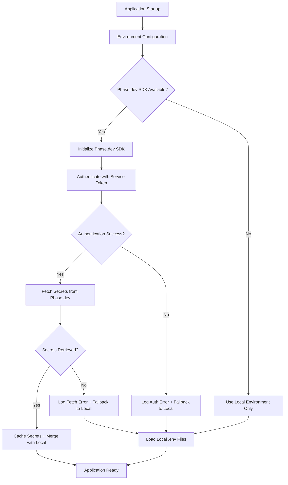

# Design Document

## Overview

This design outlines the migration from a custom Phase.dev API integration to the official Phase.dev Node.js SDK. The migration will replace custom fetch-based API calls with the supported SDK methods while maintaining backward compatibility and improving error handling.

## Architecture

### Current Architecture Issues

The current implementation in `packages/config/src/phase.ts` has several problems:
1. **Incorrect API Endpoint**: Uses `https://console.phase.dev/service/v2/secrets` which returns 404
2. **Custom API Integration**: Implements custom fetch logic instead of using the official SDK
3. **Improper Authentication**: Uses custom headers instead of SDK authentication patterns
4. **Limited Error Handling**: Basic error handling without SDK-specific error types

### Target Architecture



## Components and Interfaces

### 1. Phase.dev Service Token Loader

```typescript
// packages/config/src/phase-token-loader.ts
import { readFileSync, existsSync } from 'fs'
import { join } from 'path'

interface TokenSource {
  source: 'process.env' | 'local.env.local' | 'local.env' | 'root.env.local' | 'root.env'
  token: string
  path?: string
}

class PhaseTokenLoader {
  static loadServiceToken(rootPath?: string): TokenSource | null {
    // 1. Check process.env first
    if (process.env.PHASE_SERVICE_TOKEN) {
      return {
        source: 'process.env',
        token: process.env.PHASE_SERVICE_TOKEN
      }
    }
    
    const currentDir = process.cwd()
    const workspaceRoot = rootPath || this.findWorkspaceRoot(currentDir)
    
    // 2. Check local .env.local
    const localEnvLocal = this.loadTokenFromFile(join(currentDir, '.env.local'))
    if (localEnvLocal) {
      return {
        source: 'local.env.local',
        token: localEnvLocal,
        path: join(currentDir, '.env.local')
      }
    }
    
    // 3. Check local .env
    const localEnv = this.loadTokenFromFile(join(currentDir, '.env'))
    if (localEnv) {
      return {
        source: 'local.env',
        token: localEnv,
        path: join(currentDir, '.env')
      }
    }
    
    // 4. Check root .env.local
    const rootEnvLocal = this.loadTokenFromFile(join(workspaceRoot, '.env.local'))
    if (rootEnvLocal) {
      return {
        source: 'root.env.local',
        token: rootEnvLocal,
        path: join(workspaceRoot, '.env.local')
      }
    }
    
    // 5. Check root .env
    const rootEnv = this.loadTokenFromFile(join(workspaceRoot, '.env'))
    if (rootEnv) {
      return {
        source: 'root.env',
        token: rootEnv,
        path: join(workspaceRoot, '.env')
      }
    }
    
    return null
  }
  
  private static loadTokenFromFile(filePath: string): string | null
  private static findWorkspaceRoot(startPath: string): string
}
```

### 2. Phase.dev SDK Integration Layer

```typescript
// packages/config/src/phase-sdk.ts
import { Phase } from '@phase-dev/node'

interface PhaseSDKConfig {
  serviceToken: string
  appName: string
  environment: string
}

interface PhaseSDKResult {
  success: boolean
  secrets: Record<string, string>
  error?: string
  source: 'phase-sdk' | 'fallback'
  tokenSource?: TokenSource
}

class PhaseSDKClient {
  private client: Phase | null = null
  private config: PhaseSDKConfig | null = null
  private tokenSource: TokenSource | null = null
  
  async initialize(appName: string, environment: string, rootPath?: string): Promise<boolean>
  async getSecrets(): Promise<PhaseSDKResult>
  async testConnection(): Promise<boolean>
  clearCache(): void
  getTokenSource(): TokenSource | null
}
```

### 2. Updated Environment Configuration Interface

```typescript
// packages/config/src/env.ts
interface EnvironmentConfig {
  // Existing interface remains the same for backward compatibility
  nodeEnv: string
  isDevelopment: boolean
  isProduction: boolean
  phaseAvailable: boolean
  phaseConfigLoaded: boolean
  phaseVariableCount: number
  loadedFiles: string[]
  totalVariables: number
  phaseStatus: {
    available: boolean
    success: boolean
    variableCount: number
    error?: string
    source: 'phase-sdk' | 'phase.dev' | 'fallback' // Updated to include SDK source
  }
}
```

### 3. Migration Adapter

```typescript
// packages/config/src/phase-migration.ts
interface LegacyPhaseResult {
  variables: Record<string, string>
  success: boolean
  error?: string
  source: 'phase.dev' | 'fallback'
}

class PhaseMigrationAdapter {
  // Provides backward compatibility for existing loadFromPhase function
  static async loadFromPhase(
    forceReload?: boolean,
    config?: Partial<PhaseConfig>,
    rootPath?: string
  ): Promise<LegacyPhaseResult>
}
```

## Data Models

### Phase.dev SDK Configuration

```typescript
interface PhaseSDKOptions {
  // Service token for authentication
  serviceToken: string
  
  // Application name in Phase.dev
  appName: string
  
  // Environment name (development, staging, production)
  environment: string
  
  // Optional SDK configuration
  timeout?: number
  retryAttempts?: number
  cacheTimeout?: number
}
```

### Secret Response Model

```typescript
interface PhaseSecret {
  key: string
  value: string
  environment: string
  createdAt?: string
  updatedAt?: string
}

interface PhaseSecretsResponse {
  secrets: PhaseSecret[]
  metadata: {
    appName: string
    environment: string
    totalCount: number
    fetchedAt: string
  }
}
```

### Error Model

```typescript
interface PhaseSDKError {
  code: string
  message: string
  details?: Record<string, unknown>
  isRetryable: boolean
}

// Common error codes from Phase.dev SDK
enum PhaseErrorCode {
  AUTHENTICATION_FAILED = 'AUTHENTICATION_FAILED',
  APP_NOT_FOUND = 'APP_NOT_FOUND',
  ENVIRONMENT_NOT_FOUND = 'ENVIRONMENT_NOT_FOUND',
  NETWORK_ERROR = 'NETWORK_ERROR',
  RATE_LIMIT_EXCEEDED = 'RATE_LIMIT_EXCEEDED',
  INVALID_TOKEN = 'INVALID_TOKEN'
}
```

## Error Handling

### Error Handling Strategy

```typescript
class PhaseErrorHandler {
  static handleSDKError(error: PhaseSDKError, tokenSource?: TokenSource): {
    shouldFallback: boolean
    userMessage: string
    logMessage: string
    retryable: boolean
  } {
    switch (error.code) {
      case PhaseErrorCode.AUTHENTICATION_FAILED:
        const tokenGuidance = tokenSource 
          ? `Current token loaded from: ${tokenSource.source}${tokenSource.path ? ` (${tokenSource.path})` : ''}`
          : 'No PHASE_SERVICE_TOKEN found in any location'
        
        return {
          shouldFallback: true,
          userMessage: `Phase.dev authentication failed. ${tokenGuidance}. Check your PHASE_SERVICE_TOKEN is valid.`,
          logMessage: `Phase.dev auth failed: ${error.message}`,
          retryable: false
        }
      
      case PhaseErrorCode.TOKEN_NOT_FOUND:
        return {
          shouldFallback: true,
          userMessage: `PHASE_SERVICE_TOKEN not found. Add it to process.env, .env.local, or .env file.`,
          logMessage: `Phase.dev token not found in any source`,
          retryable: false
        }
      
      case PhaseErrorCode.APP_NOT_FOUND:
        return {
          shouldFallback: true,
          userMessage: `Phase.dev app not found. Create app in Phase.dev console.`,
          logMessage: `Phase.dev app not found: ${error.message}`,
          retryable: false
        }
      
      case PhaseErrorCode.NETWORK_ERROR:
        return {
          shouldFallback: true,
          userMessage: 'Phase.dev service unavailable. Using local environment variables.',
          logMessage: `Phase.dev network error: ${error.message}`,
          retryable: true
        }
      
      default:
        return {
          shouldFallback: true,
          userMessage: 'Phase.dev error occurred. Using local environment variables.',
          logMessage: `Phase.dev error: ${error.message}`,
          retryable: false
        }
    }
  }
}
```

### Fallback Mechanism

```typescript
class EnvironmentFallbackManager {
  static async loadWithFallback(
    appName: string,
    environment: string,
    rootPath?: string
  ): Promise<EnvironmentConfig> {
    const sdkClient = new PhaseSDKClient()
    
    try {
      // 1. Try to initialize Phase.dev SDK with token from multiple sources
      const initialized = await sdkClient.initialize(appName, environment, rootPath)
      
      if (initialized) {
        const phaseResult = await sdkClient.getSecrets()
        if (phaseResult.success) {
          console.log(`[Phase.dev] Loaded ${Object.keys(phaseResult.secrets).length} secrets from Phase.dev SDK`)
          console.log(`[Phase.dev] Token source: ${phaseResult.tokenSource?.source}`)
          return this.mergeWithLocalEnv(phaseResult.secrets, 'phase-sdk', phaseResult.tokenSource)
        }
      }
    } catch (error) {
      const tokenSource = sdkClient.getTokenSource()
      console.warn('[Phase.dev] SDK failed, falling back to local env:', error)
      console.warn(`[Phase.dev] Token source was: ${tokenSource?.source || 'none'}`)
    }
    
    // 2. Fallback to local environment files
    console.log('[Phase.dev] Using local environment variables only')
    return this.loadLocalEnvironment()
  }
  
  private static mergeWithLocalEnv(
    phaseSecrets: Record<string, string>,
    source: string,
    tokenSource?: TokenSource
  ): EnvironmentConfig {
    // Merge Phase.dev secrets with local .env files
    // Local .env takes precedence for development overrides
  }
  
  private static loadLocalEnvironment(): EnvironmentConfig {
    // Load only from local .env files
  }
}
```

## Testing Strategy

### Unit Tests

```typescript
// __tests__/unit/phase-sdk-client.test.ts
describe('PhaseSDKClient', () => {
  describe('initialization', () => {
    it('should initialize with valid service token', async () => {
      const client = new PhaseSDKClient()
      const config = {
        serviceToken: 'valid-token',
        appName: 'AI.C9d.Web',
        environment: 'development'
      }
      
      const result = await client.initialize(config)
      expect(result).toBe(true)
    })
    
    it('should fail initialization with invalid token', async () => {
      const client = new PhaseSDKClient()
      const config = {
        serviceToken: 'invalid-token',
        appName: 'AI.C9d.Web',
        environment: 'development'
      }
      
      const result = await client.initialize(config)
      expect(result).toBe(false)
    })
  })
  
  describe('secret retrieval', () => {
    it('should fetch secrets successfully', async () => {
      // Test with real Phase.dev SDK calls (no mocking)
      const client = new PhaseSDKClient()
      await client.initialize(validConfig)
      
      const result = await client.getSecrets()
      expect(result.success).toBe(true)
      expect(result.secrets).toBeDefined()
    })
  })
})
```

### Integration Tests

```typescript
// __tests__/integration/phase-dev-integration.test.ts
describe('Phase.dev SDK Integration', () => {
  beforeAll(() => {
    if (!process.env.PHASE_SERVICE_TOKEN) {
      throw new Error('PHASE_SERVICE_TOKEN required for Phase.dev integration tests')
    }
  })
  
  it('should load environment variables from Phase.dev SDK', async () => {
    const result = await EnvironmentFallbackManager.loadWithFallback({
      serviceToken: process.env.PHASE_SERVICE_TOKEN!,
      appName: 'AI.C9d.Web',
      environment: 'development'
    })
    
    expect(result.phaseStatus.success).toBe(true)
    expect(result.phaseStatus.source).toBe('phase-sdk')
  })
  
  it('should fallback to local env when Phase.dev fails', async () => {
    const result = await EnvironmentFallbackManager.loadWithFallback({
      serviceToken: 'invalid-token',
      appName: 'AI.C9d.Web',
      environment: 'development'
    })
    
    expect(result.phaseStatus.success).toBe(false)
    expect(result.phaseStatus.source).toBe('fallback')
  })
})
```

## Implementation Plan

### Phase 1: SDK Integration Setup

1. **Install Phase.dev Node.js SDK**
   ```bash
   pnpm add @phase-dev/node
   pnpm add -D @types/node
   ```

2. **Create SDK Client Wrapper**
   - Implement `PhaseSDKClient` class
   - Add proper TypeScript types
   - Implement authentication and secret retrieval

3. **Update Configuration Interface**
   - Extend existing interfaces to support SDK

### Phase 2: Migration Implementation

1. **Create Migration Adapter**
   - Update `loadFromPhase` function to use SDK internally
   - Maintain existing function signatures

2. **Update Error Handling**
   - Implement `PhaseErrorHandler` with SDK-specific error types
   - Add comprehensive error messages and fallback logic

3. **Implement Fallback Manager**
   - Create `EnvironmentFallbackManager` for graceful degradation
   - Ensure local environment loading continues to work

### Phase 3: Testing and Validation

1. **Unit Tests**
   - Test SDK client initialization and secret retrieval
   - Test error handling for various failure scenarios

2. **Integration Tests**
   - Test real Phase.dev SDK integration (no mocking)
   - Test fallback mechanisms with invalid configurations
   - Test environment variable merging logic

3. **End-to-End Testing**
   - Test application startup with Phase.dev SDK
   - Test development workflow with SDK integration
   - Validate error messages and user experience

### Phase 4: Deployment and Monitoring

1. **Gradual Rollout**
   - Deploy to development environment first
   - Monitor error rates and performance
   - Validate all environment variables load correctly

2. **Documentation Updates**
   - Update development setup documentation
   - Add troubleshooting guide for Phase.dev SDK
   - Document migration from custom API to SDK

3. **Cleanup**
   - Remove old custom API integration code
   - Update dependencies and remove unused packages

## Performance Considerations

### Caching Strategy

```typescript
class PhaseSDKCache {
  private static cache: Map<string, {
    secrets: Record<string, string>
    timestamp: number
    ttl: number
  }> = new Map()
  
  static get(key: string): Record<string, string> | null {
    const entry = this.cache.get(key)
    if (!entry) return null
    
    if (Date.now() - entry.timestamp > entry.ttl) {
      this.cache.delete(key)
      return null
    }
    
    return entry.secrets
  }
  
  static set(key: string, secrets: Record<string, string>, ttl: number = 300000): void {
    this.cache.set(key, {
      secrets,
      timestamp: Date.now(),
      ttl
    })
  }
}
```

### Connection Pooling and Retry Logic

```typescript
class PhaseSDKConnectionManager {
  private static retryConfig = {
    maxAttempts: 3,
    baseDelay: 1000,
    maxDelay: 5000
  }
  
  static async withRetry<T>(
    operation: () => Promise<T>,
    isRetryable: (error: any) => boolean = () => true
  ): Promise<T> {
    let lastError: any
    
    for (let attempt = 1; attempt <= this.retryConfig.maxAttempts; attempt++) {
      try {
        return await operation()
      } catch (error) {
        lastError = error
        
        if (!isRetryable(error) || attempt === this.retryConfig.maxAttempts) {
          throw error
        }
        
        const delay = Math.min(
          this.retryConfig.baseDelay * Math.pow(2, attempt - 1),
          this.retryConfig.maxDelay
        )
        
        await new Promise(resolve => setTimeout(resolve, delay))
      }
    }
    
    throw lastError
  }
}
```

## Security Considerations

### Service Token Management

1. **Token Validation**
   - Validate service token format before SDK initialization
   - Implement token rotation support
   - Log authentication failures without exposing token values

2. **Secret Handling**
   - Never log secret values in plain text
   - Implement secure memory handling for secrets
   - Clear secrets from memory when no longer needed

3. **Network Security**
   - Use HTTPS for all Phase.dev API communications
   - Implement certificate validation
   - Add request timeout and rate limiting

### Environment Isolation

```typescript
class SecureEnvironmentManager {
  static sanitizeForLogging(secrets: Record<string, string>): Record<string, string> {
    const sanitized: Record<string, string> = {}
    
    for (const [key, value] of Object.entries(secrets)) {
      if (this.isSensitiveKey(key)) {
        sanitized[key] = '[REDACTED]'
      } else {
        sanitized[key] = value.substring(0, 10) + '...'
      }
    }
    
    return sanitized
  }
  
  private static isSensitiveKey(key: string): boolean {
    const sensitivePatterns = [
      /password/i,
      /secret/i,
      /token/i,
      /key/i,
      /auth/i
    ]
    
    return sensitivePatterns.some(pattern => pattern.test(key))
  }
}
```

## Monitoring and Observability

### Metrics Collection

```typescript
interface PhaseSDKMetrics {
  initializationTime: number
  secretFetchTime: number
  cacheHitRate: number
  errorRate: number
  fallbackRate: number
}

class PhaseSDKMonitoring {
  static trackInitialization(duration: number): void {
    console.log(`[Phase.dev] SDK initialization took ${duration}ms`)
  }
  
  static trackSecretFetch(duration: number, secretCount: number): void {
    console.log(`[Phase.dev] Fetched ${secretCount} secrets in ${duration}ms`)
  }
  
  static trackError(error: PhaseSDKError): void {
    console.error(`[Phase.dev] Error: ${error.code} - ${error.message}`)
  }
  
  static trackFallback(reason: string): void {
    console.warn(`[Phase.dev] Fallback triggered: ${reason}`)
  }
}
```

This design provides a comprehensive removal of the custom Phase.dev API integration to the official SDK while maintaining backward compatibility and improving error handling, performance, and security.