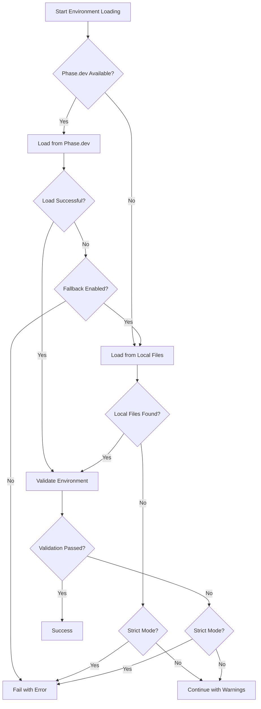

# Phase Environment Modernization Design

## Overview

This design document outlines the architecture for modernizing our Phase.dev environment variable management by replacing the current custom `run-with-env.js` script with the proven `@coordinated/env-tools` and `@coordinated/phase-client` packages. The solution provides sophisticated environment management with proper TypeScript support, CLI tools, validation, and seamless integration with our pnpm/turbo monorepo architecture.

## Architecture

### High-Level Architecture

```mermaid
graph TB
    subgraph "Monorepo Root"
        A[pnpm-workspace.yaml] --> B[Root package.json]
        B --> C[turbo.json]
        C --> D[.phase-apps.json]
    end
    
    subgraph "Environment Packages"
        E[@coordinated/env-tools] --> F[CLI Tools]
        G[@coordinated/phase-client] --> H[Phase.dev SDK]
        F --> I[env-wrapper]
        F --> J[validate-env]
        F --> K[vercel-phase-prebuild]
    end
    
    subgraph "Apps & Packages"
        L[apps/web] --> M[package.json]
        N[apps/docs] --> O[package.json]
        P[packages/ui] --> Q[package.json]
        M --> R[phase.appName]
        O --> S[phase.appName]
        Q --> T[phase.appName]
    end
    
    subgraph "Phase.dev Integration"
        U[Phase.dev API] --> V[Environment Resolution]
        V --> W[Secret Caching]
        W --> X[Validation]
    end
    
    E --> L
    E --> N
    E --> P
    G --> U
    D --> V
    R --> V
    S --> V
    T --> V
```

### Component Architecture

#### 1. Environment Tools Package (@coordinated/env-tools)

**Purpose**: Provides CLI tools and environment management utilities for the monorepo.

**Key Components**:
- **CLI Tools**: `env-wrapper`, `validate-env`, `vercel-phase-prebuild`
- **Environment Manager**: Orchestrates environment loading with fallback strategies
- **Config Loader**: Loads app-specific environment configurations
- **Validator**: Validates environment variables against schemas
- **Vercel Adapter**: Handles Vercel deployment integration

**Responsibilities**:
- Wrap command execution with proper environment loading
- Validate environment configurations
- Handle Vercel prebuild integration
- Provide fallback mechanisms when Phase.dev is unavailable

#### 2. Phase Client Package (@coordinated/phase-client)

**Purpose**: Provides TypeScript-first Phase.dev integration with caching and validation.

**Key Components**:
- **PhaseClient**: Main client for interacting with Phase.dev
- **Environment Resolver**: Determines which Phase environment to use
- **Secret Cache**: In-memory caching for performance
- **Validator**: Validates secrets against schemas
- **Config Reader**: Reads Phase.dev configuration from various sources

**Responsibilities**:
- Fetch secrets from Phase.dev API
- Cache secrets for performance
- Resolve environment contexts automatically
- Validate secret schemas
- Handle authentication and error scenarios

## Components and Interfaces

### 1. Configuration System

#### App Configuration Schema
```typescript
interface AppEnvConfig {
  appName: string                    // Phase.dev app name
  displayName: string               // Human-readable name
  defaults?: {
    envFile?: string                // Default .env file
    fallbackFiles?: string[]        // Fallback .env files
  }
  envVars: {
    required: EnvVariable[]         // Required environment variables
    optional: EnvVariable[]         // Optional environment variables
  }
  validation?: {
    strict?: boolean                // Strict validation mode
  }
  customValidation?: (env: NodeJS.ProcessEnv) => ValidationResult
  beforeValidation?: () => Promise<void>
  afterValidation?: (valid: boolean) => Promise<void>
}
```

#### Root Configuration (.phase-apps.json)
```json
{
  "apps": {
    "web": {
      "phaseAppName": "AI.C9d.Web",
      "environment": "development",
      "fallbackEnvFiles": [".env.local", ".env"]
    },
    "docs": {
      "phaseAppName": "AI.C9d.Docs", 
      "environment": "development"
    },
    "api": {
      "phaseAppName": "AI.C9d.API",
      "environment": "development"
    }
  },
  "packages": {
    "ui": {
      "phaseAppName": "AI.C9d.Shared",
      "environment": "development"
    },
    "types": {
      "phaseAppName": "AI.C9d.Shared",
      "environment": "development"
    }
  }
}
```

#### Package.json Integration
```json
{
  "name": "@c9d/web",
  "phase": {
    "appName": "AI.C9d.Web"
  },
  "envConfig": {
    "appName": "AI.C9d.Web",
    "displayName": "C9D Web Application",
    "envVars": {
      "required": [
        {
          "name": "DATABASE_URL",
          "description": "PostgreSQL connection string",
          "required": true
        }
      ]
    }
  }
}
```

### 2. CLI Integration

#### Binary Mapping in Root package.json
```json
{
  "scripts": {
    "env-wrapper": "env-wrapper",
    "validate-env": "validate-env", 
    "vercel-phase-prebuild": "vercel-phase-prebuild"
  },
  "dependencies": {
    "@coordinated/env-tools": "workspace:*",
    "@coordinated/phase-client": "workspace:*"
  }
}
```

#### App Script Migration
```json
{
  "scripts": {
    "dev": "env-wrapper next dev -p 3007",
    "build": "env-wrapper next build",
    "test": "NODE_OPTIONS=\"--max-old-space-size=8192\" env-wrapper vitest run",
    "typecheck": "env-wrapper tsc --noEmit"
  }
}
```

### 3. Environment Resolution

#### Resolution Priority
1. **App-specific override**: `PHASE_ENV__WEB=staging`
2. **Environment map**: `PHASE_ENV_MAP="WEB=feature-123,API=staging"`
3. **Global Phase environment**: `PHASE_ENV=development`
4. **Auto-detection**: Based on deployment context (Vercel, GitHub Actions, etc.)
5. **Default**: `development`

#### Context Detection Logic
```typescript
function detectEnvironment(): string {
  // Vercel environment detection
  if (process.env.VERCEL_ENV) {
    switch (process.env.VERCEL_ENV) {
      case 'production': return 'production'
      case 'preview': return 'staging'
      case 'development': return 'development'
    }
  }
  
  // GitHub Actions detection
  if (process.env.GITHUB_ACTIONS) {
    if (process.env.GITHUB_REF === 'refs/heads/main') return 'production'
    if (process.env.GITHUB_REF === 'refs/heads/develop') return 'staging'
    return 'development'
  }
  
  // Node environment fallback
  return process.env.NODE_ENV === 'production' ? 'production' : 'development'
}
```

### 4. Turbo Integration

#### Updated turbo.json
```json
{
  "tasks": {
    "build": {
      "dependsOn": ["^build"],
      "inputs": [
        "$TURBO_DEFAULT$",
        ".phase-apps.json",
        "**/env.config.json"
      ],
      "env": [
        "PHASE_SERVICE_TOKEN",
        "PHASE_ENV",
        "PHASE_ENV_MAP"
      ]
    },
    "dev": {
      "cache": false,
      "persistent": true,
      "env": ["PHASE_SERVICE_TOKEN", "PHASE_ENV"]
    }
  }
}
```

## Data Models

### 1. Environment Loading Result
```typescript
interface EnvironmentLoadResult {
  success: boolean
  sources: string[]                 // ['phase.dev', 'local:.env.local']
  appConfig: AppEnvConfig | null
  validation: ValidationResult | null
  phaseEnabled: boolean
  duration: number                  // Load time in milliseconds
  errors: string[]
}
```

### 2. Phase Configuration
```typescript
interface PhaseConfig {
  appNamespace?: string             // App namespace (WEB, API, etc.)
  token: string                     // Phase.dev service token
  phaseEnv?: string                 // Environment override
  strict?: boolean                  // Fail on validation errors
  stripPrefix?: boolean             // Remove namespace prefixes
  cache?: CacheConfig               // Caching configuration
  timeout?: number                  // API timeout
  debug?: boolean                   // Debug logging
}
```

### 3. Validation Schema
```typescript
interface ValidationResult {
  valid: boolean
  errors: ValidationError[]
  warnings: ValidationWarning[]
}

interface ValidationError {
  key: string
  message: string
  required: boolean
  suggestion?: string
}
```

## Error Handling

### 1. Error Hierarchy
```typescript
abstract class EnvironmentError extends Error {
  abstract readonly code: string
  abstract readonly recoverable: boolean
}

class PhaseConnectionError extends EnvironmentError {
  readonly code = 'PHASE_CONNECTION_ERROR'
  readonly recoverable = true
}

class ValidationError extends EnvironmentError {
  readonly code = 'VALIDATION_ERROR'
  readonly recoverable = false
}

class ConfigurationError extends EnvironmentError {
  readonly code = 'CONFIGURATION_ERROR'
  readonly recoverable = false
}
```

### 2. Fallback Strategy


### 3. Error Recovery
- **Connection Errors**: Retry with exponential backoff, fallback to cache or local files
- **Authentication Errors**: Clear cache, prompt for token refresh
- **Validation Errors**: Provide specific guidance on missing/invalid variables
- **Configuration Errors**: Suggest configuration fixes with examples

## Testing Strategy

### 1. Unit Testing
- **Environment Resolution**: Test all resolution scenarios
- **Configuration Loading**: Test various configuration sources
- **Validation Logic**: Test validation rules and error scenarios
- **Cache Behavior**: Test cache hits, misses, and expiration
- **Error Handling**: Test all error scenarios and recovery

### 2. Integration Testing
- **Phase.dev API**: Test real API interactions with service tokens
- **CLI Tools**: Test command execution with various configurations
- **Turbo Integration**: Test task execution with environment loading
- **Vercel Integration**: Test deployment scenarios

### 3. End-to-End Testing
- **Development Workflow**: Test complete development setup
- **Build Process**: Test production builds with environment loading
- **Deployment**: Test deployment to various environments
- **Error Scenarios**: Test behavior when Phase.dev is unavailable

### 4. Performance Testing
- **Load Times**: Measure environment loading performance
- **Cache Efficiency**: Test cache hit rates and memory usage
- **Concurrent Access**: Test multiple processes loading environments
- **Memory Usage**: Monitor memory consumption during operation

## Security Considerations

### 1. Token Management
- **Service Tokens**: Store in secure environment variables only
- **Token Rotation**: Support for token rotation without downtime
- **Scope Limitation**: Use minimal required permissions
- **Audit Logging**: Log token usage for security monitoring

### 2. Secret Handling
- **Memory-Only Caching**: No disk storage of secrets
- **Process Isolation**: Secrets isolated per process
- **Logging Safety**: Never log secret values
- **Cleanup**: Clear secrets from memory on process exit

### 3. Network Security
- **TLS Encryption**: All API communication over HTTPS
- **Certificate Validation**: Validate Phase.dev certificates
- **Timeout Handling**: Prevent hanging connections
- **Rate Limiting**: Respect API rate limits

## Performance Optimization

### 1. Caching Strategy
- **In-Memory Cache**: Fast access to frequently used secrets
- **TTL Management**: Configurable time-to-live for cache entries
- **Memory Limits**: Prevent excessive memory usage
- **Cache Warming**: Pre-load frequently accessed secrets

### 2. Lazy Loading
- **On-Demand Loading**: Load secrets only when needed
- **Batch Operations**: Fetch multiple secrets in single API call
- **Background Refresh**: Refresh cache in background
- **Stale-While-Revalidate**: Serve stale cache while refreshing

### 3. Network Optimization
- **Connection Pooling**: Reuse HTTP connections
- **Compression**: Enable response compression
- **Parallel Requests**: Fetch from multiple environments concurrently
- **Circuit Breaker**: Prevent cascading failures

## Deployment Integration

### 1. Vercel Integration
```typescript
// vercel-prebuild.js
export async function vercelPrebuild() {
  const envManager = new EnvironmentManager({
    enablePhase: true,
    enableValidation: true,
    strict: true
  })
  
  const result = await envManager.loadEnvironment()
  
  if (!result.success) {
    throw new Error(`Environment loading failed: ${result.errors.join(', ')}`)
  }
  
  // Inject into process.env for Vercel build
  Object.entries(result.secrets).forEach(([key, value]) => {
    process.env[key] = value
  })
}
```

### 2. CI/CD Integration
```yaml
# GitHub Actions
- name: Load Environment
  run: |
    pnpm validate-env
    pnpm env-wrapper pnpm build
  env:
    PHASE_SERVICE_TOKEN: ${{ secrets.PHASE_SERVICE_TOKEN }}
    PHASE_ENV: ${{ github.ref == 'refs/heads/main' && 'production' || 'staging' }}
```

### 3. Docker Integration
```dockerfile
# Dockerfile
FROM node:18-alpine

# Install Phase CLI if needed
RUN npm install -g @coordinated/env-tools

# Copy application
COPY . .

# Install dependencies
RUN pnpm install

# Build with environment loading
RUN pnpm env-wrapper pnpm build

CMD ["pnpm", "env-wrapper", "pnpm", "start"]
```

## Migration Plan

### Phase 1: Package Setup
1. Ensure packages are built and available in workspace
2. Update root package.json with CLI tool binaries
3. Create root configuration file (.phase-apps.json)
4. Update turbo.json with new environment variables

### Phase 2: App Migration
1. Update app package.json files with phase configuration
2. Replace run-with-env.js usage with env-wrapper
3. Add environment validation configurations
4. Test development workflows

### Phase 3: CI/CD Integration
1. Update GitHub Actions workflows
2. Configure Vercel prebuild integration
3. Test deployment scenarios
4. Monitor performance and reliability

### Phase 4: Cleanup
1. Remove old run-with-env.js script
2. Remove old phase-api-client.js script
3. Update documentation
4. Train team on new workflows

## Monitoring and Observability

### 1. Metrics Collection
- **Load Times**: Environment loading duration
- **Cache Hit Rate**: Percentage of cache hits vs misses
- **Error Rate**: Frequency of loading failures
- **API Response Times**: Phase.dev API performance

### 2. Logging Strategy
- **Structured Logging**: JSON format for machine parsing
- **Debug Levels**: Configurable verbosity
- **Security**: Never log sensitive values
- **Performance**: Log timing information

### 3. Health Checks
- **Environment Status**: Check if environments are loadable
- **Phase.dev Connectivity**: Verify API accessibility
- **Cache Health**: Monitor cache memory usage
- **Validation Status**: Track validation success rates

This design provides a robust, scalable, and secure foundation for environment variable management across our monorepo, with proper fallback mechanisms, comprehensive testing, and excellent developer experience.