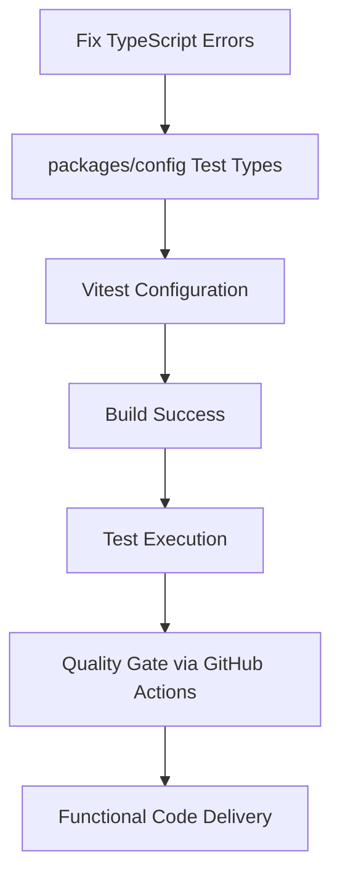
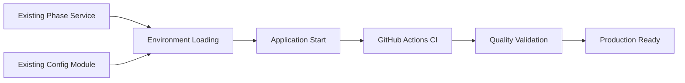

# Production Delivery Readiness Design Document

## Overview

This design document focuses on the immediate engineering needs to enable production delivery of the C9D AI platform. The primary goal is to fix build failures, ensure tests pass, and deliver functional code. We'll leverage existing Phase Service and Config Module while establishing quality gates through GitHub Actions CI pipeline.

## Architecture

### Immediate Build Fix Architecture



### Existing Infrastructure Utilization



## Components and Interfaces

### 1. Immediate Fix Components

#### TypeScript Error Resolution
```typescript
// Fix missing vitest types in packages/config
interface TestSetup {
  globals: boolean
  environment: 'jsdom' | 'node'
  setupFiles: string[]
}

// Ensure proper type imports
interface TypeImports {
  vitest: ['describe', 'it', 'expect', 'beforeAll', 'afterAll', 'vi']
  testingLibrary: ['render', 'screen', 'fireEvent', 'waitFor']
}
```

#### Build Validation (Minimal)
```typescript
interface BuildStatus {
  typecheck: boolean
  packages: Record<string, boolean>
  errors: string[]
}

interface QuickValidator {
  checkTypeScript(): Promise<boolean>
  checkPackageBuilds(): Promise<boolean>
  reportErrors(): string[]
}
```

### 2. Existing Infrastructure (Utilize, Don't Rebuild)

#### Phase Service Integration (Already Exists)
- Use existing Phase Service for environment loading
- Leverage existing Config Module for configuration management
- Maintain existing phase.dev integration patterns

#### Test Infrastructure (Fix, Don't Replace)
- Fix vitest configuration in packages/config
- Ensure test types are properly imported
- Maintain existing test patterns and structure

## Data Models

### Build Error Model (Simplified)
```typescript
interface BuildError {
  package: string
  file: string
  line?: number
  message: string
  suggestion?: string
}

interface BuildResult {
  success: boolean
  errors: BuildError[]
  warnings: string[]
}
```

## Error Handling

### Immediate Error Resolution Strategy

1. **TypeScript Compilation Errors**
   - Add missing vitest type definitions to packages/config
   - Configure proper vitest.config.ts with globals
   - Ensure test setup files are properly configured

2. **Build Pipeline Errors**
   - Fix dependency resolution issues
   - Ensure proper turbo cache configuration
   - Validate environment variable loading

3. **Test Execution Errors**
   - Fix missing test type imports
   - Ensure proper test environment setup
   - Validate test configuration files

### Error Recovery Process
```typescript
interface ErrorRecovery {
  identifyError(error: BuildError): string
  suggestFix(error: BuildError): string
  applyFix(error: BuildError): Promise<boolean>
}
```

## Testing Strategy

### Immediate Testing Fixes

1. **Fix packages/config TypeScript Errors**
   - Add vitest types to package.json devDependencies
   - Configure vitest.config.ts with proper globals
   - Add vitest.setup.ts for test environment setup

2. **Validate Test Execution**
   - Ensure `pnpm test` runs without errors
   - Verify test coverage generation works
   - Confirm all test suites pass

3. **Integration Test Validation**
   - Verify Phase.dev integration tests work with real credentials
   - Ensure database integration tests pass
   - Validate API route testing

### Test Configuration Requirements
```typescript
// vitest.config.ts (packages/config)
export default defineConfig({
  test: {
    globals: true,
    environment: 'node',
    setupFiles: ['./vitest.setup.ts']
  }
})

// vitest.setup.ts (packages/config)
import { vi } from 'vitest'
// Global test setup
```

## Implementation Strategy

### Phase 1: Fix Immediate Build Failures (Critical)

1. **Fix TypeScript Errors in packages/config**
   - Add missing vitest type definitions
   - Configure proper test setup files
   - Ensure all imports are properly typed

2. **Validate Build Pipeline**
   - Test `pnpm typecheck` passes
   - Test `pnpm build` completes successfully
   - Test `pnpm dev` starts without errors

3. **Fix Test Execution**
   - Ensure `pnpm test` runs and exits properly
   - Verify test coverage generation
   - Confirm all existing tests pass

### Phase 2: Validate Production Readiness (Important)

1. **Environment Configuration**
   - Verify Phase.dev integration works
   - Ensure fallback to local .env files
   - Validate all required environment variables

2. **Application Functionality**
   - Test development server starts correctly
   - Verify production build generates properly
   - Ensure all routes and API endpoints work

3. **Quality Gates**
   - Establish GitHub Actions CI pipeline
   - Configure automated testing on PR/merge
   - Set up deployment validation

### Phase 3: Delivery Preparation (Nice to Have)

1. **Documentation Updates**
   - Update README with current setup instructions
   - Document any new environment variables
   - Provide troubleshooting guides

2. **Performance Validation**
   - Ensure build times are reasonable
   - Verify application startup performance
   - Check bundle sizes are optimized

## Success Criteria

### Immediate Success (Must Have)
- [ ] `pnpm typecheck` passes with zero errors
- [ ] `pnpm build` completes successfully
- [ ] `pnpm dev` starts development server
- [ ] `pnpm test` runs all tests and exits
- [ ] All existing functionality works

### Production Readiness (Should Have)
- [ ] Environment variables load correctly
- [ ] Phase.dev integration works
- [ ] All test suites pass
- [ ] Application builds for production
- [ ] GitHub Actions CI pipeline works

### Quality Assurance (Nice to Have)
- [ ] Test coverage meets requirements
- [ ] Performance benchmarks met
- [ ] Security validations pass
- [ ] Documentation is up to date
- [ ] Developer experience is smooth

## Risk Mitigation

### Build Failure Risks
- **Risk**: TypeScript errors block all development
- **Mitigation**: Fix type definitions immediately
- **Fallback**: Temporarily disable strict type checking if needed

### Test Failure Risks
- **Risk**: Test configuration prevents CI/CD
- **Mitigation**: Fix vitest configuration and setup
- **Fallback**: Skip problematic tests temporarily with clear TODO items

### Environment Risks
- **Risk**: Missing environment variables break application
- **Mitigation**: Provide clear error messages and fallbacks
- **Fallback**: Use local .env files with documented required variables

This focused design addresses the immediate engineering needs while leveraging existing infrastructure and establishing a path to production delivery.