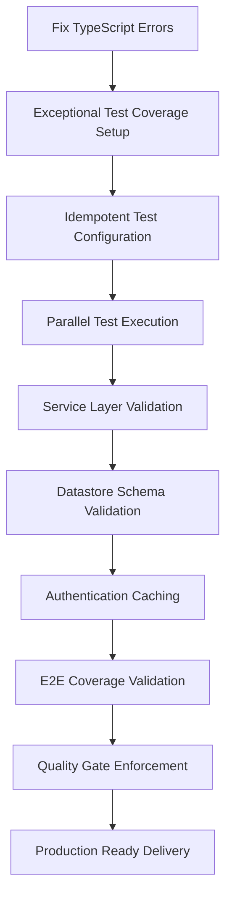
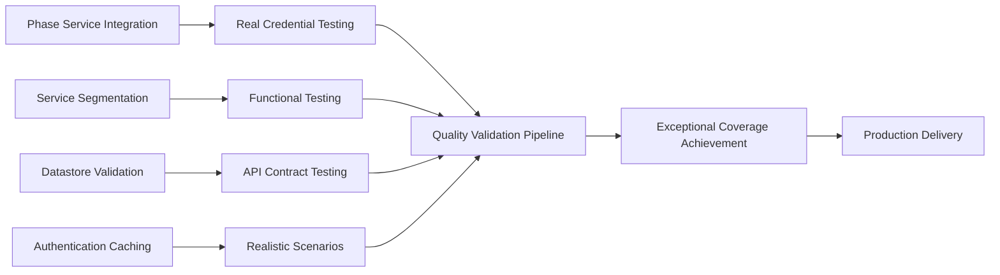
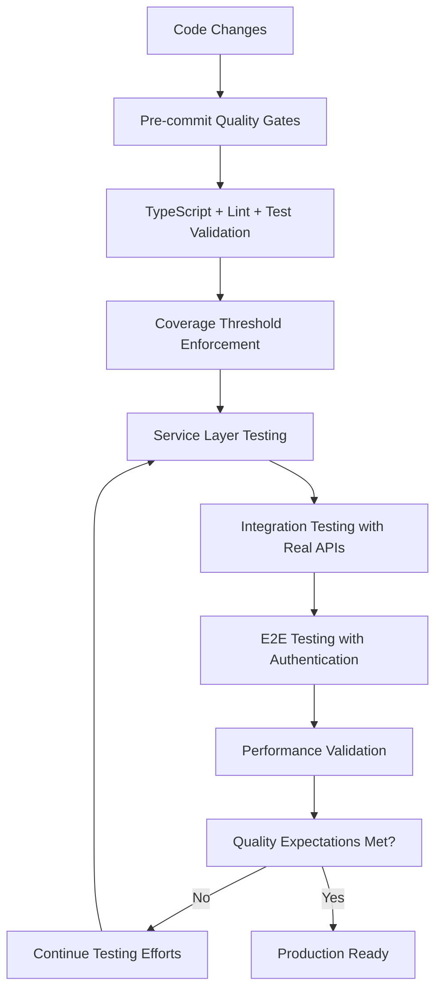

# Production Delivery Readiness Design Document

## Overview

This design document defines a comprehensive approach to enable production delivery of the C9D AI platform with exceptional quality standards. The primary goals are to fix build failures, achieve exceptional test coverage with robust methodology, and deliver production-ready code that meets the highest quality expectations. We'll leverage existing Phase Service and Config Module while establishing rigorous quality gates and continuous validation processes.

## Architecture

### Comprehensive Quality Assurance Architecture



### Robust Testing Methodology Architecture



### Continuous Quality Validation Flow



## Components and Interfaces

### 1. Immediate Fix Components

#### TypeScript Error Resolution
```typescript
// Fix missing vitest types in packages/config
interface TestSetup {
  globals: boolean
  environment: 'jsdom' | 'node'
  setupFiles: string[]
}

// Ensure proper type imports
interface TypeImports {
  vitest: ['describe', 'it', 'expect', 'beforeAll', 'afterAll', 'vi']
  testingLibrary: ['render', 'screen', 'fireEvent', 'waitFor']
}
```

#### Build Validation (Minimal)
```typescript
interface BuildStatus {
  typecheck: boolean
  packages: Record<string, boolean>
  errors: string[]
}

interface QuickValidator {
  checkTypeScript(): Promise<boolean>
  checkPackageBuilds(): Promise<boolean>
  reportErrors(): string[]
}
```

### 2. Existing Infrastructure (Utilize, Don't Rebuild)

#### Phase Service Integration (Already Exists)
- Use existing Phase Service for environment loading
- Leverage existing Config Module for configuration management
- Maintain existing phase.dev integration patterns

#### Test Infrastructure (Fix, Don't Replace)
- Fix vitest configuration in packages/config
- Ensure test types are properly imported
- Maintain existing test patterns and structure

## Data Models

### Build Error Model (Simplified)
```typescript
interface BuildError {
  package: string
  file: string
  line?: number
  message: string
  suggestion?: string
}

interface BuildResult {
  success: boolean
  errors: BuildError[]
  warnings: string[]
}
```

## Error Handling

### Immediate Error Resolution Strategy

1. **TypeScript Compilation Errors**
   - Add missing vitest type definitions to packages/config
   - Configure proper vitest.config.ts with globals
   - Ensure test setup files are properly configured

2. **Build Pipeline Errors**
   - Fix dependency resolution issues
   - Ensure proper turbo cache configuration
   - Validate environment variable loading

3. **Test Execution Errors**
   - Fix missing test type imports
   - Ensure proper test environment setup
   - Validate test configuration files

### Error Recovery Process
```typescript
interface ErrorRecovery {
  identifyError(error: BuildError): string
  suggestFix(error: BuildError): string
  applyFix(error: BuildError): Promise<boolean>
}
```

## Testing Strategy

### Exceptional Coverage and Robust Methodology

1. **Idempotent and Parallel Test Architecture**
   - Configure vitest for parallel execution with thread pools
   - Implement idempotent test cases that produce consistent results
   - Ensure test isolation with proper setup/teardown
   - Use realistic test data and scenarios

2. **Service Layer Segmentation and Validation**
   - Properly segment services with clear boundaries
   - Validate datastore schema integrity with real database connections
   - Test API contracts with actual endpoints and credentials
   - Implement comprehensive business logic validation

3. **Authentication and Caching Excellence**
   - Leverage authentication caching effectively in tests
   - Test all authentication flows with realistic scenarios
   - Validate session management and security patterns
   - Ensure proper credential handling and rotation

4. **Comprehensive E2E Coverage**
   - Cover all critical user journeys with Playwright
   - Test authentication flows, onboarding, and core features
   - Validate UI interactions, data persistence, and navigation
   - Include error handling and edge case scenarios

### Advanced Test Configuration
```typescript
// vitest.config.ts (Enhanced Configuration)
export default defineConfig({
  test: {
    globals: true,
    environment: 'node',
    setupFiles: ['./vitest.setup.ts'],
    // Parallel execution configuration
    pool: 'threads',
    poolOptions: {
      threads: {
        singleThread: false,
        maxThreads: 4,
        minThreads: 1
      }
    },
    // Coverage thresholds for exceptional standards
    coverage: {
      provider: 'v8',
      thresholds: {
        global: {
          branches: 85,
          functions: 85,
          lines: 85,
          statements: 85
        },
        // Exceptional standards by path
        'lib/services/**': {
          branches: 100,
          functions: 100,
          lines: 100,
          statements: 100
        },
        'lib/models/**': {
          branches: 95,
          functions: 95,
          lines: 95,
          statements: 95
        },
        'app/api/**': {
          branches: 90,
          functions: 90,
          lines: 90,
          statements: 90
        }
      }
    }
  }
})

// vitest.setup.ts (Enhanced Setup)
import { vi } from 'vitest'
import { setupTestDatabase } from './test-database'
import { setupAuthenticationCache } from './auth-cache'

// Global test setup with proper isolation
beforeEach(async () => {
  await setupTestDatabase()
  await setupAuthenticationCache()
})

afterEach(async () => {
  await cleanupTestDatabase()
  vi.clearAllMocks()
})
```

### Functional Testing Patterns
```typescript
// Service Layer Testing with Real Dependencies
interface ServiceTestConfig {
  useRealDatabase: boolean
  useRealAuthentication: boolean
  enableCaching: boolean
  validateSchema: boolean
}

// API Integration Testing with Real Endpoints
interface APITestConfig {
  testEndpoints: string[]
  credentials: AuthCredentials
  validateContracts: boolean
  testErrorScenarios: boolean
}

// E2E Testing with Comprehensive Coverage
interface E2ETestConfig {
  authenticationFlows: string[]
  onboardingJourneys: string[]
  coreFeatures: string[]
  errorHandling: string[]
}
```

## Implementation Strategy

### Phase 1: Foundation and Build Stability (Critical)

1. **TypeScript and Build Infrastructure**
   - Fix TypeScript compilation errors with zero tolerance
   - Configure idempotent, parallel-executable test infrastructure
   - Establish proper type definitions and imports
   - Validate build pipeline with comprehensive error handling

2. **Test Execution Excellence**
   - Implement robust test execution with `pnpm test` (run-once, no watch)
   - Configure parallel test execution with proper isolation
   - Establish exceptional coverage thresholds and validation
   - Ensure all tests are idempotent and produce consistent results

3. **Service Layer Segmentation**
   - Properly segment services with clear boundaries and responsibilities
   - Validate datastore schema integrity with real database connections
   - Implement comprehensive API contract testing with real endpoints
   - Establish authentication caching and credential management

### Phase 2: Exceptional Coverage Achievement (Critical)

1. **Unit Testing Excellence**
   - Achieve 100% coverage for all service layer components
   - Implement functional testing focused on behavior validation
   - Create realistic test scenarios with proper mocking strategies
   - Validate edge cases, error conditions, and performance requirements

2. **Integration Testing with Real Dependencies**
   - Test Phase.dev integration with real credentials and endpoints
   - Validate database operations with actual schema and constraints
   - Test API routes with comprehensive request/response validation
   - Implement proper authentication flow testing with caching

3. **End-to-End Coverage Validation**
   - Cover all critical user journeys with Playwright E2E tests
   - Test authentication flows, onboarding, and core platform features
   - Validate UI interactions, data persistence, and cross-page navigation
   - Include comprehensive error handling and edge case scenarios

### Phase 3: Quality Gate Enforcement and Continuous Validation (Critical)

1. **Automated Quality Gates**
   - Implement pre-commit hooks with TypeScript, linting, and testing
   - Configure GitHub Actions CI with exceptional coverage enforcement
   - Establish deployment blocking for any quality gate failures
   - Create detailed failure reporting and remediation guidance

2. **Continuous Quality Validation**
   - Monitor test execution for idempotent behavior and parallel compatibility
   - Validate service segmentation and datastore schema integrity
   - Ensure authentication caching effectiveness and security compliance
   - Continue testing efforts until all quality expectations are achieved

3. **Production Readiness Validation**
   - Validate complete application functionality with production builds
   - Test environment configuration with Phase.dev and fallback scenarios
   - Ensure performance benchmarks and security requirements are met
   - Confirm documentation and developer experience standards

## Success Criteria

### Foundation Excellence (Must Have - Zero Tolerance)
- [ ] `pnpm typecheck` passes with zero TypeScript errors
- [ ] `pnpm build` completes successfully with all optimizations
- [ ] `pnpm dev` starts development server without errors
- [ ] `pnpm test` runs once and exits (no watch mode) with 100% pass rate
- [ ] All existing functionality works with enhanced reliability

### Exceptional Coverage Standards (Must Have - Zero Tolerance)
- [ ] 100% test coverage for all service layer components (`lib/services/**`)
- [ ] 95% test coverage for all model components (`lib/models/**`)
- [ ] 90% test coverage for all API routes (`app/api/**`)
- [ ] 85% minimum coverage for all other code with zero critical path gaps
- [ ] All tests are idempotent and parallel-executable

### Service Layer and Integration Excellence (Must Have)
- [ ] Proper service segmentation with validated boundaries
- [ ] Datastore schema validation with real database connections
- [ ] API contract testing with real endpoints and credentials
- [ ] Authentication caching effectiveness with realistic scenarios
- [ ] Phase.dev integration works with proper credential handling

### End-to-End Coverage Excellence (Must Have)
- [ ] Comprehensive Playwright E2E tests for all authentication flows
- [ ] Complete onboarding journey coverage with interactive tutorials
- [ ] Core platform feature validation with UI interaction testing
- [ ] Error handling and edge case scenario coverage
- [ ] Cross-page navigation and data persistence validation

### Quality Gate Enforcement (Must Have - Zero Tolerance)
- [ ] Pre-commit hooks block commits with any quality violations
- [ ] GitHub Actions CI enforces exceptional coverage thresholds
- [ ] Pull request merging blocked for any failing quality gates
- [ ] Deployment validation prevents production deployment of subpar code
- [ ] Continuous quality monitoring with automated remediation guidance

### Production Readiness Excellence (Must Have)
- [ ] Production builds generate with all optimizations and validations
- [ ] Environment configuration works with Phase.dev and fallback scenarios
- [ ] Performance benchmarks met with acceptable load times and resource usage
- [ ] Security validations pass with comprehensive vulnerability scanning
- [ ] Documentation is comprehensive with troubleshooting and setup guides

## Quality Enforcement Architecture

### Automated Quality Gates
```typescript
interface QualityGate {
  name: string
  threshold: number
  blocking: boolean
  remediation: string[]
}

const qualityGates: QualityGate[] = [
  {
    name: 'TypeScript Compilation',
    threshold: 100, // 100% success rate
    blocking: true,
    remediation: ['Fix type errors', 'Update type definitions', 'Resolve import issues']
  },
  {
    name: 'Service Layer Coverage',
    threshold: 100, // 100% coverage required
    blocking: true,
    remediation: ['Add missing unit tests', 'Cover edge cases', 'Test error scenarios']
  },
  {
    name: 'API Route Coverage',
    threshold: 90, // 90% coverage required
    blocking: true,
    remediation: ['Add integration tests', 'Test authentication', 'Validate error handling']
  },
  {
    name: 'E2E Coverage',
    threshold: 100, // 100% critical path coverage
    blocking: true,
    remediation: ['Add missing user flows', 'Test error scenarios', 'Validate UI interactions']
  }
]
```

### Continuous Validation Pipeline
```typescript
interface ValidationPipeline {
  stage: string
  validations: Validation[]
  continueOnFailure: boolean
}

interface Validation {
  name: string
  command: string
  successCriteria: string
  failureAction: string
}

const validationPipeline: ValidationPipeline[] = [
  {
    stage: 'Pre-commit',
    validations: [
      {
        name: 'TypeScript Check',
        command: 'pnpm typecheck',
        successCriteria: 'Zero errors',
        failureAction: 'Block commit, provide error details'
      },
      {
        name: 'Test Execution',
        command: 'pnpm test',
        successCriteria: '100% pass rate, idempotent execution',
        failureAction: 'Block commit, provide test failure details'
      }
    ],
    continueOnFailure: false
  },
  {
    stage: 'CI Pipeline',
    validations: [
      {
        name: 'Coverage Validation',
        command: 'pnpm test:coverage',
        successCriteria: 'Meet exceptional coverage thresholds',
        failureAction: 'Block merge, provide coverage gaps'
      },
      {
        name: 'E2E Validation',
        command: 'pnpm test:e2e',
        successCriteria: 'All critical paths covered',
        failureAction: 'Block deployment, provide E2E failures'
      }
    ],
    continueOnFailure: false
  }
]
```

## Risk Mitigation and Quality Assurance

### Zero Tolerance Quality Risks
- **Risk**: Any quality gate failure blocks progress
- **Mitigation**: Comprehensive testing and validation before commits
- **Enforcement**: Automated blocking with detailed remediation guidance
- **Escalation**: Continuous improvement until quality expectations are met

### Coverage Threshold Risks
- **Risk**: Insufficient test coverage compromises quality
- **Mitigation**: Exceptional coverage standards with automated enforcement
- **Monitoring**: Real-time coverage tracking with gap identification
- **Resolution**: Mandatory coverage improvement before progression

### Service Integration Risks
- **Risk**: Service segmentation issues affect reliability
- **Mitigation**: Proper service boundaries with comprehensive validation
- **Testing**: Real API endpoints and database connections
- **Validation**: Authentication caching and credential management

### Continuous Quality Validation
- **Philosophy**: Continue testing efforts until quality expectations are achieved
- **Methodology**: Idempotent, parallel-executable, functional testing
- **Standards**: 100% passing results with exceptional coverage
- **Commitment**: Zero tolerance for quality compromises

## Implementation Excellence Framework

This comprehensive design establishes a framework for achieving exceptional quality standards through:

1. **Robust Testing Methodology**: Idempotent, parallel-executable tests with realistic scenarios
2. **Service Layer Excellence**: Proper segmentation with datastore and API validation
3. **Authentication Integration**: Effective caching with comprehensive flow testing
4. **Quality Gate Enforcement**: Zero tolerance automated validation with blocking mechanisms
5. **Continuous Improvement**: Ongoing testing efforts until all expectations are met

The design ensures production delivery readiness through exceptional coverage, robust methodology, and unwavering commitment to quality excellence.