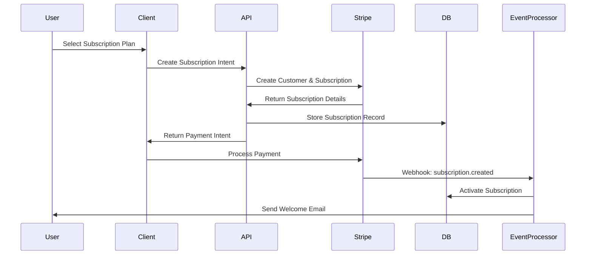
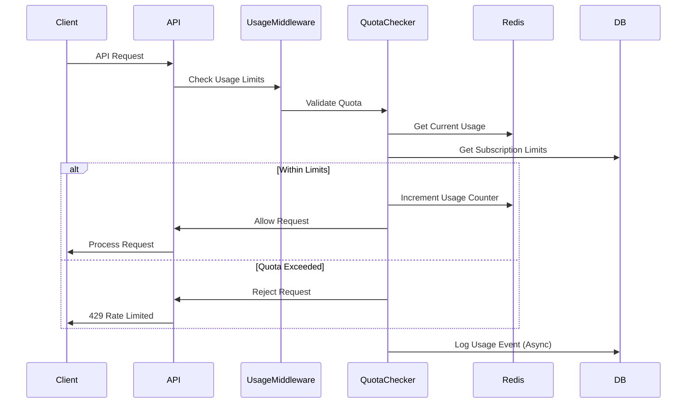

# Design Document

## Overview

The Subscription & Licensing System implements a comprehensive billing and usage management platform that integrates with Stripe for payment processing and provides real-time quota enforcement. The system supports a three-tier subscription model with configurable feature gates, usage tracking, and automated billing workflows. It leverages the existing organizational modeling system to provide both individual and team-based subscriptions with centralized management capabilities.

The architecture follows an event-driven approach where usage events trigger quota checks, billing calculations, and notification workflows, ensuring real-time enforcement of subscription limits while maintaining high performance.

## Architecture

### High-Level Architecture

```mermaid
graph TB
    Client[Client Application] --> API[Next.js API Routes]
    Client --> Stripe[Stripe Elements]
    
    API --> SubService[Subscription Service]
    API --> UsageService[Usage Tracking Service]
    API --> BillingService[Billing Service]
    
    SubService --> DB[(Supabase Database)]
    UsageService --> DB
    UsageService --> Redis[(Redis Cache)]
    
    BillingService --> StripeAPI[Stripe API]
    StripeAPI --> Webhooks[Stripe Webhooks]
    
    Webhooks --> EventProcessor[Event Processor]
    EventProcessor --> NotificationService[Notification Service]
    
    subgraph "Usage Enforcement"
        Middleware[Usage Middleware] --> QuotaChecker[Quota Checker]
        QuotaChecker --> Redis
        QuotaChecker --> DB
    end
    
    API --> Middleware
    
    subgraph "Analytics"
        Analytics[Analytics Service] --> DB
        Analytics --> Dashboard[Usage Dashboard]
    end
```

### Subscription Lifecycle Flow



### Usage Tracking Flow



## Components and Interfaces

### Core Services

#### SubscriptionService
```typescript
interface SubscriptionService {
  createSubscription(userId: string, planId: string, paymentMethodId: string): Promise<Subscription>
  updateSubscription(subscriptionId: string, planId: string): Promise<Subscription>
  cancelSubscription(subscriptionId: string, cancelAtPeriodEnd: boolean): Promise<Subscription>
  getSubscription(subscriptionId: string): Promise<Subscription | null>
  getUserSubscriptions(userId: string): Promise<Subscription[]>
  getOrganizationSubscription(orgId: string): Promise<Subscription | null>
}
```

#### UsageTrackingService
```typescript
interface UsageTrackingService {
  recordUsage(userId: string, orgId: string, metric: string, amount: number): Promise<void>
  getCurrentUsage(userId: string, orgId: string, period: 'current' | 'billing'): Promise<UsageMetrics>
  checkQuota(userId: string, orgId: string, metric: string, amount: number): Promise<QuotaCheckResult>
  getUsageHistory(userId: string, orgId: string, startDate: Date, endDate: Date): Promise<UsageRecord[]>
  resetUsage(subscriptionId: string, billingPeriodStart: Date): Promise<void>
}
```

#### BillingService
```typescript
interface BillingService {
  createCustomer(user: User): Promise<StripeCustomer>
  createPaymentIntent(amount: number, customerId: string): Promise<PaymentIntent>
  processInvoice(subscriptionId: string): Promise<Invoice>
  handleWebhook(event: StripeEvent): Promise<void>
  generateUsageReport(subscriptionId: string, period: BillingPeriod): Promise<UsageReport>
}
```

#### PlanService
```typescript
interface PlanService {
  getPlans(): Promise<Plan[]>
  getPlan(planId: string): Promise<Plan | null>
  createPlan(planData: CreatePlanData): Promise<Plan>
  updatePlan(planId: string, planData: UpdatePlanData): Promise<Plan>
  getFeatureFlags(planId: string): Promise<FeatureFlags>
  validatePlanLimits(planId: string, usage: UsageMetrics): Promise<ValidationResult>
}
```

### Middleware Components

#### UsageMiddleware
Intercepts API requests to track usage and enforce quotas in real-time.

```typescript
interface UsageMiddleware {
  trackRequest(req: Request, res: Response, next: NextFunction): Promise<void>
  enforceQuota(userId: string, orgId: string, endpoint: string): Promise<boolean>
  logUsageEvent(event: UsageEvent): Promise<void>
}
```

#### SubscriptionMiddleware
Validates subscription status and feature access for protected routes.

```typescript
interface SubscriptionMiddleware {
  requireActiveSubscription(req: Request, res: Response, next: NextFunction): Promise<void>
  requireFeature(feature: string): (req: Request, res: Response, next: NextFunction) => Promise<void>
  checkPlanAccess(planTier: PlanTier): (req: Request, res: Response, next: NextFunction) => Promise<void>
}
```

## Data Models

### Database Schema

```sql
-- Subscription plans
CREATE TABLE subscription_plans (
  id UUID PRIMARY KEY DEFAULT gen_random_uuid(),
  name TEXT NOT NULL,
  description TEXT,
  stripe_price_id TEXT UNIQUE NOT NULL,
  tier TEXT NOT NULL CHECK (tier IN ('individual', 'team', 'enterprise')),
  price_monthly INTEGER NOT NULL, -- in cents
  price_yearly INTEGER, -- in cents
  features JSONB DEFAULT '{}',
  limits JSONB DEFAULT '{}',
  is_active BOOLEAN DEFAULT TRUE,
  created_at TIMESTAMP WITH TIME ZONE DEFAULT NOW(),
  updated_at TIMESTAMP WITH TIME ZONE DEFAULT NOW()
);

-- Subscriptions
CREATE TABLE subscriptions (
  id UUID PRIMARY KEY DEFAULT gen_random_uuid(),
  stripe_subscription_id TEXT UNIQUE NOT NULL,
  stripe_customer_id TEXT NOT NULL,
  user_id UUID REFERENCES users(id) ON DELETE CASCADE,
  organization_id UUID REFERENCES organizations(id) ON DELETE CASCADE,
  plan_id UUID REFERENCES subscription_plans(id),
  status TEXT NOT NULL CHECK (status IN ('active', 'canceled', 'past_due', 'unpaid', 'trialing')),
  current_period_start TIMESTAMP WITH TIME ZONE NOT NULL,
  current_period_end TIMESTAMP WITH TIME ZONE NOT NULL,
  cancel_at_period_end BOOLEAN DEFAULT FALSE,
  canceled_at TIMESTAMP WITH TIME ZONE,
  trial_start TIMESTAMP WITH TIME ZONE,
  trial_end TIMESTAMP WITH TIME ZONE,
  metadata JSONB DEFAULT '{}',
  created_at TIMESTAMP WITH TIME ZONE DEFAULT NOW(),
  updated_at TIMESTAMP WITH TIME ZONE DEFAULT NOW()
);

-- Usage tracking
CREATE TABLE usage_records (
  id UUID PRIMARY KEY DEFAULT gen_random_uuid(),
  subscription_id UUID REFERENCES subscriptions(id) ON DELETE CASCADE,
  user_id UUID REFERENCES users(id) ON DELETE CASCADE,
  organization_id UUID REFERENCES organizations(id) ON DELETE CASCADE,
  metric_name TEXT NOT NULL,
  metric_value INTEGER NOT NULL DEFAULT 1,
  endpoint TEXT,
  metadata JSONB DEFAULT '{}',
  recorded_at TIMESTAMP WITH TIME ZONE DEFAULT NOW(),
  billing_period_start TIMESTAMP WITH TIME ZONE NOT NULL,
  billing_period_end TIMESTAMP WITH TIME ZONE NOT NULL
);

-- Usage quotas (current period aggregates)
CREATE TABLE usage_quotas (
  id UUID PRIMARY KEY DEFAULT gen_random_uuid(),
  subscription_id UUID REFERENCES subscriptions(id) ON DELETE CASCADE,
  metric_name TEXT NOT NULL,
  current_usage INTEGER DEFAULT 0,
  quota_limit INTEGER NOT NULL,
  billing_period_start TIMESTAMP WITH TIME ZONE NOT NULL,
  billing_period_end TIMESTAMP WITH TIME ZONE NOT NULL,
  last_updated TIMESTAMP WITH TIME ZONE DEFAULT NOW(),
  UNIQUE(subscription_id, metric_name, billing_period_start)
);

-- Billing events
CREATE TABLE billing_events (
  id UUID PRIMARY KEY DEFAULT gen_random_uuid(),
  subscription_id UUID REFERENCES subscriptions(id) ON DELETE CASCADE,
  stripe_event_id TEXT UNIQUE NOT NULL,
  event_type TEXT NOT NULL,
  event_data JSONB NOT NULL,
  processed_at TIMESTAMP WITH TIME ZONE DEFAULT NOW(),
  created_at TIMESTAMP WITH TIME ZONE DEFAULT NOW()
);

-- Feature flags
CREATE TABLE feature_flags (
  id UUID PRIMARY KEY DEFAULT gen_random_uuid(),
  subscription_id UUID REFERENCES subscriptions(id) ON DELETE CASCADE,
  feature_name TEXT NOT NULL,
  is_enabled BOOLEAN DEFAULT TRUE,
  configuration JSONB DEFAULT '{}',
  created_at TIMESTAMP WITH TIME ZONE DEFAULT NOW(),
  updated_at TIMESTAMP WITH TIME ZONE DEFAULT NOW(),
  UNIQUE(subscription_id, feature_name)
);

-- Invoices
CREATE TABLE invoices (
  id UUID PRIMARY KEY DEFAULT gen_random_uuid(),
  stripe_invoice_id TEXT UNIQUE NOT NULL,
  subscription_id UUID REFERENCES subscriptions(id) ON DELETE CASCADE,
  amount_due INTEGER NOT NULL,
  amount_paid INTEGER DEFAULT 0,
  currency TEXT DEFAULT 'usd',
  status TEXT NOT NULL,
  invoice_pdf TEXT,
  due_date TIMESTAMP WITH TIME ZONE,
  paid_at TIMESTAMP WITH TIME ZONE,
  created_at TIMESTAMP WITH TIME ZONE DEFAULT NOW()
);
```

### TypeScript Interfaces

```typescript
interface Plan {
  id: string
  name: string
  description?: string
  stripePriceId: string
  tier: 'individual' | 'team' | 'enterprise'
  priceMonthly: number
  priceYearly?: number
  features: PlanFeatures
  limits: PlanLimits
  isActive: boolean
  createdAt: Date
  updatedAt: Date
}

interface PlanFeatures {
  agentExecution: boolean
  apiAccess: boolean
  priorityQueue: boolean
  customModels: boolean
  whiteGloveOnboarding: boolean
  dedicatedOrchestration: boolean
  multiUserOrchestration: boolean
}

interface PlanLimits {
  agentExecutionsPerMonth: number
  apiCallsPerMonth: number
  concurrentJobs: number
  storageGB: number
  teamMembers?: number
}

interface Subscription {
  id: string
  stripeSubscriptionId: string
  stripeCustomerId: string
  userId: string
  organizationId?: string
  planId: string
  status: 'active' | 'canceled' | 'past_due' | 'unpaid' | 'trialing'
  currentPeriodStart: Date
  currentPeriodEnd: Date
  cancelAtPeriodEnd: boolean
  canceledAt?: Date
  trialStart?: Date
  trialEnd?: Date
  metadata: Record<string, any>
  createdAt: Date
  updatedAt: Date
  plan?: Plan
}

interface UsageRecord {
  id: string
  subscriptionId: string
  userId: string
  organizationId?: string
  metricName: string
  metricValue: number
  endpoint?: string
  metadata: Record<string, any>
  recordedAt: Date
  billingPeriodStart: Date
  billingPeriodEnd: Date
}

interface UsageQuota {
  id: string
  subscriptionId: string
  metricName: string
  currentUsage: number
  quotaLimit: number
  billingPeriodStart: Date
  billingPeriodEnd: Date
  lastUpdated: Date
}

interface QuotaCheckResult {
  allowed: boolean
  currentUsage: number
  quotaLimit: number
  remainingQuota: number
  resetDate: Date
}
```

## Error Handling

### Subscription Errors
- **SubscriptionNotFound**: Requested subscription doesn't exist
- **InactiveSubscription**: Subscription is canceled or past due
- **PlanNotAvailable**: Requested plan is not active or doesn't exist
- **PaymentFailed**: Stripe payment processing failed
- **SubscriptionLimitExceeded**: Organization has reached subscription limits

### Usage Errors
- **QuotaExceeded**: Usage limit reached for current billing period
- **InvalidMetric**: Requested usage metric is not supported
- **UsageTrackingFailed**: Failed to record usage event
- **RateLimitExceeded**: Too many requests within time window

### Billing Errors
- **InvoiceGenerationFailed**: Unable to generate invoice
- **WebhookProcessingFailed**: Stripe webhook processing error
- **CustomerCreationFailed**: Failed to create Stripe customer
- **PaymentMethodRequired**: Valid payment method required for subscription

### Error Response Format
```typescript
interface SubscriptionErrorResponse {
  error: {
    code: string
    message: string
    details?: {
      currentUsage?: number
      quotaLimit?: number
      resetDate?: string
      subscriptionStatus?: string
    }
    timestamp: string
    requestId: string
  }
}
```

## Testing Strategy

### Unit Testing
- **Service Layer**: Test subscription CRUD operations, usage tracking, and billing logic
- **Quota Enforcement**: Test quota checking algorithms and limit calculations
- **Plan Management**: Test feature flag resolution and plan validation
- **Usage Aggregation**: Test usage metric calculations and period rollover

### Integration Testing
- **Stripe Integration**: Test payment processing, webhook handling, and customer management
- **Database Operations**: Test subscription lifecycle with proper data consistency
- **Usage Tracking**: Test real-time usage recording and quota enforcement
- **Billing Workflows**: Test invoice generation and payment processing flows

### End-to-End Testing
- **Subscription Flow**: Complete subscription creation, payment, and activation
- **Plan Changes**: Test upgrades, downgrades, and cancellations
- **Usage Enforcement**: Test quota limits and service restrictions
- **Billing Cycle**: Test monthly billing, usage aggregation, and invoice generation

### Performance Testing
- **Usage Tracking**: Test high-volume usage recording and quota checks
- **Concurrent Subscriptions**: Test system behavior under multiple subscription operations
- **Database Queries**: Optimize usage aggregation and subscription lookup queries
- **Cache Performance**: Test Redis caching for quota checks and usage data

### Security Testing
- **Payment Security**: Verify PCI compliance and secure payment handling
- **Subscription Access**: Test tenant isolation for subscription data
- **Usage Data**: Verify usage tracking data privacy and access controls
- **Webhook Security**: Test Stripe webhook signature verification and replay protection