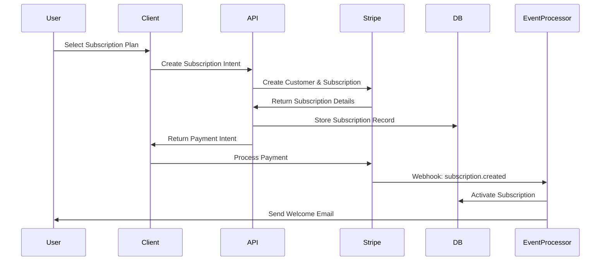
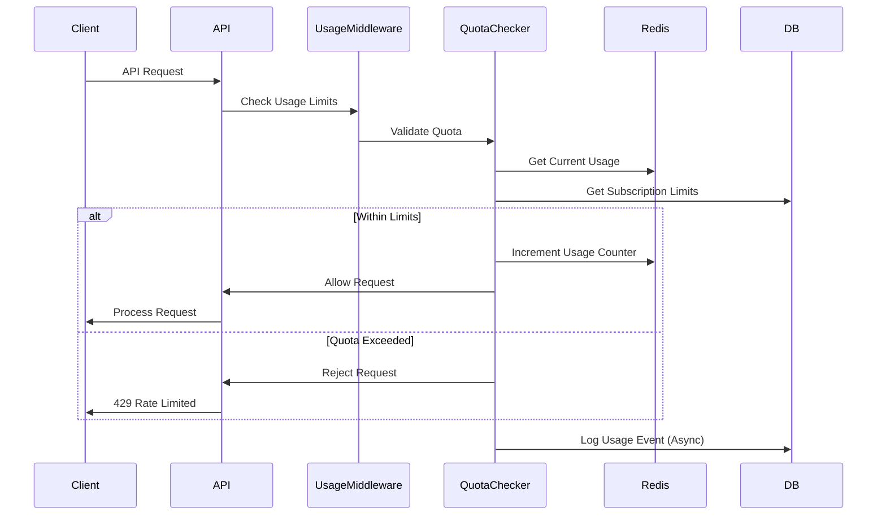

# Design Document

## Overview

The Subscription & Licensing System implements a comprehensive billing and usage management platform that integrates with Stripe for payment processing and provides real-time quota enforcement. The system supports a three-tier subscription model (Individual, Team, Enterprise) with configurable feature gates, usage tracking, and automated billing workflows. It leverages the existing organizational modeling system to provide both individual and team-based subscriptions with centralized management capabilities.

**Key Design Decisions:**
- **No Free Tier**: Premium-only model ensures sustainable revenue and resource allocation
- **Event-Driven Architecture**: Usage events trigger quota checks, billing calculations, and notification workflows in real-time
- **Tiered Feature Gates**: Each plan tier unlocks specific features (agent execution, API access, priority queues, custom models)
- **Proactive Usage Monitoring**: Warning thresholds at 75%, 90%, and 95% prevent service interruptions
- **Flexible Plan Management**: Support for upgrades (immediate), downgrades (next cycle), and cancellations (end of period)

The architecture follows an event-driven approach ensuring real-time enforcement of subscription limits while maintaining high performance and providing transparent billing records.

## Deployment and Infrastructure

### Vercel Deployment Architecture
The subscription system is deployed on Vercel with the following configuration:

**Build Configuration:**
- Build command: `vercel-phase-prebuild && pnpm turbo build --filter=@c9d/web`
- Output directory: `apps/web/.next`
- Framework: Next.js with App Router
- Region: `iad1` (US East)

**Function Configuration:**
- API routes: `/app/api/**/*.ts`
- Max duration: 30 seconds
- Memory: 1024 MB
- Suitable for subscription operations, usage tracking, and webhook processing

**Environment Variables (via Phase.dev):**
- `PHASE_SERVICE_TOKEN`: Phase.dev authentication
- `STRIPE_SECRET_KEY`: Stripe API key (managed via Phase.dev)
- `STRIPE_WEBHOOK_SECRET`: Stripe webhook signature verification
- `REDIS_URL` & `REDIS_TOKEN`: Redis connection for caching
- `NEXT_PUBLIC_SUPABASE_URL` & `SUPABASE_SERVICE_ROLE_KEY`: Database access
- All secrets managed through Phase.dev for security and consistency

**Design Rationale**: Vercel's edge network provides low-latency API responses globally, while Phase.dev ensures secure environment variable management across all environments.

### Database Schema Integration
The subscription system extends the existing Supabase schema:

**Existing Tables (from initial_schema.sql):**
- `users`: Extended from Clerk authentication
- `organizations`: Organization management
- `organization_memberships`: User-organization relationships
- `roles`: Organization-specific roles
- `permissions`: System-wide permissions
- `audit_logs`: Activity tracking

**New Subscription Tables:**
All new tables follow existing patterns:
- UUID primary keys with `gen_random_uuid()`
- `created_at` and `updated_at` timestamps with triggers
- Foreign key relationships to existing `users` and `organizations` tables
- JSONB columns for flexible metadata storage
- Proper indexing for performance

**Design Rationale**: Extending existing schema ensures consistency with current data models and leverages established patterns for timestamps, UUIDs, and relationships.

### Caching Strategy (Redis)
Redis is used for high-performance quota checking and usage tracking:

**Cache Keys:**
- `quota:{subscriptionId}:{metric}`: Current usage counters
- `subscription:{subscriptionId}`: Cached subscription details
- `plan:{planId}`: Cached plan configuration
- `usage_warning:{subscriptionId}:{threshold}`: Warning notification tracking

**TTL Strategy:**
- Quota counters: Reset at billing period boundary
- Subscription cache: 5 minutes (frequently updated)
- Plan cache: 1 hour (rarely changes)
- Warning tracking: 24 hours (prevent duplicate notifications)

**Design Rationale**: Redis provides sub-millisecond quota checks, essential for real-time usage enforcement without database load.

## Architecture

### High-Level Architecture

```mermaid
graph TB
    Client[Client Application] --> API[Next.js API Routes]
    Client --> Stripe[Stripe Elements]
    
    API --> SubService[Subscription Service]
    API --> UsageService[Usage Tracking Service]
    API --> BillingService[Billing Service]
    
    SubService --> DB[(Supabase Database)]
    UsageService --> DB
    UsageService --> Redis[(Redis Cache)]
    
    BillingService --> StripeAPI[Stripe API]
    StripeAPI --> Webhooks[Stripe Webhooks]
    
    Webhooks --> EventProcessor[Event Processor]
    EventProcessor --> NotificationService[Notification Service]
    
    subgraph "Usage Enforcement"
        Middleware[Usage Middleware] --> QuotaChecker[Quota Checker]
        QuotaChecker --> Redis
        QuotaChecker --> DB
    end
    
    API --> Middleware
    
    subgraph "Analytics"
        Analytics[Analytics Service] --> DB
        Analytics --> Dashboard[Usage Dashboard]
    end
```

### Subscription Lifecycle Flow


```mermaid
sequenceDiagram
    participant User
    participant Client
    participant API
    participant Stripe
    participant DB
    participant EventProcessor
    
    User->>Client: Select Subscription Plan
    Client->>API: Create Subscription Intent
    API->>Stripe: Create Customer & Subscription
    Stripe->>API: Return Subscription Details
    API->>DB: Store Subscription Record
    API->>Client: Return Payment Intent
    Client->>Stripe: Process Payment
    Stripe->>EventProcessor: Webhook: subscription.created
    EventProcessor->>DB: Activate Subscription
    EventProcessor->>User: Send Welcome Email
```

### Usage Tracking Flow


```mermaid
sequenceDiagram
    participant Client
    participant API
    participant UsageMiddleware
    participant QuotaChecker
    participant Redis
    participant DB
    
    Client->>API: API Request
    API->>UsageMiddleware: Check Usage Limits
    UsageMiddleware->>QuotaChecker: Validate Quota
    QuotaChecker->>Redis: Get Current Usage
    QuotaChecker->>DB: Get Subscription Limits
    
    alt Within Limits
        QuotaChecker->>Redis: Increment Usage Counter
        QuotaChecker->>API: Allow Request
        API->>Client: Process Request
    else Quota Exceeded
        QuotaChecker->>API: Reject Request
        API->>Client: 429 Rate Limited
    end
    
    QuotaChecker->>DB: Log Usage Event (Async)
```

## Team Subscription Management (Requirement 6)

### Seat Allocation and Management

#### Seat Allocation Logic
Team subscriptions include configurable seat limits:

1. **Initial Allocation**: Define seat count during subscription creation
2. **Dynamic Adjustment**: Add or remove seats based on team growth
3. **Seat Validation**: Prevent member additions when seat limit reached
4. **Upgrade Prompts**: Suggest plan upgrades when approaching seat limits

```typescript
interface SeatManagement {
  totalSeats: number
  usedSeats: number
  availableSeats: number
  seatPrice: number
  canAddMember: boolean
}
```

**Design Rationale**: Flexible seat management allows teams to scale efficiently while maintaining cost control and preventing over-provisioning.

#### Member Assignment
Assign team members to organization subscriptions:

1. **Member Invitation**: Send invitation with role assignment
2. **Seat Consumption**: Allocate seat upon invitation acceptance
3. **Role-Based Access**: Apply permissions based on member role
4. **Usage Attribution**: Track per-member usage for accountability

**Design Rationale**: Clear member assignment and usage attribution enables cost allocation and usage accountability within teams.

### Team Usage Tracking (Requirement 6.3)

#### Per-Member Usage
Track individual member consumption:

```typescript
interface MemberUsage {
  userId: string
  userName: string
  agentExecutions: number
  apiCalls: number
  storageUsed: number
  lastActive: Date
}
```

#### Aggregate Team Usage
Consolidated team-level metrics:

```typescript
interface TeamUsageAggregate {
  organizationId: string
  totalAgentExecutions: number
  totalApiCalls: number
  totalStorage: number
  memberCount: number
  averageUsagePerMember: UsageMetrics
}
```

**Design Rationale**: Both individual and aggregate views enable team administrators to identify high-usage members and optimize resource allocation.

### Centralized Billing (Requirement 6.4)

#### Organization-Level Billing
Consolidate all charges under organization account:

1. **Single Invoice**: All team member usage on one invoice
2. **Seat Charges**: Base subscription plus per-seat charges
3. **Usage Overages**: Consolidated overage charges if applicable
4. **Cost Breakdown**: Detailed breakdown by member and usage type

**Design Rationale**: Centralized billing simplifies accounting and provides clear visibility into total team costs.

## Plan Change Management

### Upgrade Logic (Requirement 4.1)
When a customer upgrades their subscription:

1. **Immediate Feature Activation**: New plan features and limits applied instantly
2. **Prorated Billing**: Calculate prorated charge for remaining billing period
3. **Quota Adjustment**: Update usage quotas to new plan limits
4. **Notification**: Send confirmation with new features and adjusted billing
5. **Stripe Synchronization**: Update Stripe subscription with proration

**Design Rationale**: Immediate upgrades provide instant value and encourage customers to scale up when needed. Prorated billing ensures fair pricing.

### Downgrade Logic (Requirement 4.2)
When a customer downgrades their subscription:

1. **Schedule Change**: Downgrade scheduled for next billing cycle start
2. **Usage Validation**: Check if current usage exceeds new plan limits
3. **Warning System**: Alert user if usage must be reduced before downgrade
4. **Grace Period**: Maintain current features until billing cycle ends
5. **Automatic Transition**: Apply new plan limits at cycle boundary

**Design Rationale**: Scheduling downgrades for next cycle prevents mid-cycle service disruption and gives users time to adjust usage patterns.

### Cancellation Logic (Requirement 4.3)
When a customer cancels their subscription:

1. **Access Maintenance**: Continue service until current billing period ends
2. **Cancel at Period End**: Set flag to prevent renewal
3. **Data Retention**: Maintain user data per retention policy
4. **Reactivation Option**: Allow reactivation before period end
5. **Exit Survey**: Optional feedback collection for churn analysis

**Design Rationale**: Maintaining access through the paid period provides value for money and reduces friction, while exit surveys provide insights for improvement.

### Reactivation Logic (Requirement 4.4)
When a customer reactivates a canceled subscription:

1. **Restore Previous Plan**: Reactivate with same plan tier and features
2. **Billing Schedule**: Resume billing from reactivation date
3. **Usage Reset**: Reset usage quotas for new billing period
4. **Feature Restoration**: Immediately restore all plan features
5. **Notification**: Confirm reactivation and next billing date

**Design Rationale**: Easy reactivation reduces churn and encourages customers to return after temporary cancellations.

## Components and Interfaces

### Core Services

#### SubscriptionService
```typescript
interface SubscriptionService {
  createSubscription(userId: string, planId: string, paymentMethodId: string, orgId?: string): Promise<Subscription>
  updateSubscription(subscriptionId: string, planId: string): Promise<Subscription>
  upgradeSubscription(subscriptionId: string, newPlanId: string): Promise<Subscription>
  downgradeSubscription(subscriptionId: string, newPlanId: string): Promise<Subscription>
  cancelSubscription(subscriptionId: string, cancelAtPeriodEnd: boolean): Promise<Subscription>
  reactivateSubscription(subscriptionId: string): Promise<Subscription>
  getSubscription(subscriptionId: string): Promise<Subscription | null>
  getUserSubscriptions(userId: string): Promise<Subscription[]>
  getOrganizationSubscription(orgId: string): Promise<Subscription | null>
  notifyQuotaAdjustment(subscriptionId: string, oldLimits: PlanLimits, newLimits: PlanLimits): Promise<void>
}
```

#### UsageTrackingService
```typescript
interface UsageTrackingService {
  recordUsage(userId: string, orgId: string, metric: string, amount: number): Promise<void>
  getCurrentUsage(userId: string, orgId: string, period: 'current' | 'billing'): Promise<UsageMetrics>
  checkQuota(userId: string, orgId: string, metric: string, amount: number): Promise<QuotaCheckResult>
  getUsageHistory(userId: string, orgId: string, startDate: Date, endDate: Date): Promise<UsageRecord[]>
  getTeamUsage(orgId: string, includePerMember: boolean): Promise<TeamUsageMetrics>
  resetUsage(subscriptionId: string, billingPeriodStart: Date): Promise<void>
  sendUsageWarning(subscriptionId: string, metric: string, threshold: number): Promise<void>
  analyzeUsagePatterns(subscriptionId: string): Promise<UsageAnalysis>
  recommendPlanUpgrade(subscriptionId: string): Promise<PlanRecommendation | null>
}
```

#### BillingService
```typescript
interface BillingService {
  createCustomer(user: User): Promise<StripeCustomer>
  createPaymentIntent(amount: number, customerId: string): Promise<PaymentIntent>
  processInvoice(subscriptionId: string): Promise<Invoice>
  handleWebhook(event: StripeEvent): Promise<void>
  handlePaymentFailure(subscriptionId: string, invoiceId: string): Promise<void>
  retryFailedPayment(invoiceId: string): Promise<PaymentResult>
  generateUsageReport(subscriptionId: string, period: BillingPeriod): Promise<UsageReport>
  getBillingHistory(customerId: string): Promise<BillingHistory>
  calculateProration(subscriptionId: string, newPlanId: string): Promise<ProrationAmount>
}
```

#### PlanService
```typescript
interface PlanService {
  getPlans(): Promise<Plan[]>
  getPlan(planId: string): Promise<Plan | null>
  createPlan(planData: CreatePlanData): Promise<Plan>
  updatePlan(planId: string, planData: UpdatePlanData): Promise<Plan>
  applyPlanChangesToExistingSubscriptions(planId: string, changes: PlanUpdate): Promise<void>
  getFeatureFlags(planId: string): Promise<FeatureFlags>
  validatePlanLimits(planId: string, usage: UsageMetrics): Promise<ValidationResult>
  comparePlans(planIds: string[]): Promise<PlanComparison>
  calculatePricing(planId: string, teamSize?: number, usageEstimate?: UsageEstimate): Promise<PricingCalculation>
}
```

#### AnalyticsService
```typescript
interface AnalyticsService {
  generateSubscriptionReport(startDate: Date, endDate: Date): Promise<SubscriptionReport>
  getRevenueMetrics(period: 'daily' | 'weekly' | 'monthly'): Promise<RevenueMetrics>
  getChurnMetrics(period: 'monthly' | 'quarterly'): Promise<ChurnMetrics>
  getGrowthMetrics(): Promise<GrowthMetrics>
  analyzeUsagePatterns(planTier?: string): Promise<UsagePatternAnalysis>
  trackCustomerLifecycle(customerId: string): Promise<CustomerLifecycle>
  detectAnomalies(threshold: number): Promise<Anomaly[]>
  exportAnalytics(format: 'csv' | 'json', filters: AnalyticsFilters): Promise<ExportResult>
}
```

#### TeamManagementService
```typescript
interface TeamManagementService {
  allocateSeats(orgId: string, seatCount: number): Promise<void>
  assignMember(orgId: string, userId: string): Promise<void>
  removeMember(orgId: string, userId: string): Promise<void>
  validateSeatLimit(orgId: string, additionalSeats: number): Promise<boolean>
  getTeamMembers(orgId: string): Promise<TeamMember[]>
  getTeamUsageBreakdown(orgId: string): Promise<TeamUsageBreakdown>
}
```

#### NotificationService
```typescript
interface NotificationService {
  sendPaymentFailureNotification(subscriptionId: string): Promise<void>
  sendUsageWarningNotification(subscriptionId: string, threshold: number, metric: string): Promise<void>
  sendPlanChangeNotification(subscriptionId: string, changeType: 'upgrade' | 'downgrade' | 'cancel'): Promise<void>
  sendQuotaAdjustmentNotification(subscriptionId: string, adjustments: QuotaAdjustment[]): Promise<void>
  sendAnomalyAlert(adminId: string, anomaly: Anomaly): Promise<void>
  configureNotificationPreferences(userId: string, preferences: NotificationPreferences): Promise<void>
}
```

### Middleware Components

#### UsageMiddleware
Intercepts API requests to track usage and enforce quotas in real-time.

```typescript
interface UsageMiddleware {
  trackRequest(req: Request, res: Response, next: NextFunction): Promise<void>
  enforceQuota(userId: string, orgId: string, endpoint: string): Promise<boolean>
  logUsageEvent(event: UsageEvent): Promise<void>
}
```

#### SubscriptionMiddleware
Validates subscription status and feature access for protected routes.

```typescript
interface SubscriptionMiddleware {
  requireActiveSubscription(req: Request, res: Response, next: NextFunction): Promise<void>
  requireFeature(feature: string): (req: Request, res: Response, next: NextFunction) => Promise<void>
  checkPlanAccess(planTier: PlanTier): (req: Request, res: Response, next: NextFunction) => Promise<void>
}
```

## Data Models

### Database Schema

**Schema Design Principles:**
- Follows existing patterns from `supabase/migrations/20240101000000_initial_schema.sql`
- Uses `gen_random_uuid()` for UUID generation (consistent with existing tables)
- Includes `created_at` and `updated_at` with automatic triggers
- Foreign keys reference existing `users` and `organizations` tables
- JSONB for flexible metadata storage (consistent with existing schema)
- Proper indexing for query performance

```sql
-- Subscription plans
CREATE TABLE subscription_plans (
  id UUID PRIMARY KEY DEFAULT gen_random_uuid(),
  name TEXT NOT NULL,
  description TEXT,
  stripe_price_id TEXT UNIQUE NOT NULL,
  tier TEXT NOT NULL CHECK (tier IN ('individual', 'team', 'enterprise')),
  price_monthly INTEGER NOT NULL, -- in cents
  price_yearly INTEGER, -- in cents
  features JSONB DEFAULT '{}',
  limits JSONB DEFAULT '{}',
  is_active BOOLEAN DEFAULT TRUE,
  created_at TIMESTAMP WITH TIME ZONE DEFAULT NOW(),
  updated_at TIMESTAMP WITH TIME ZONE DEFAULT NOW()
);

-- Subscriptions (links to existing users and organizations)
CREATE TABLE subscriptions (
  id UUID PRIMARY KEY DEFAULT gen_random_uuid(),
  stripe_subscription_id TEXT UNIQUE NOT NULL,
  stripe_customer_id TEXT NOT NULL,
  user_id UUID REFERENCES users(id) ON DELETE CASCADE,
  organization_id UUID REFERENCES organizations(id) ON DELETE CASCADE,
  plan_id UUID REFERENCES subscription_plans(id),
  status TEXT NOT NULL CHECK (status IN ('active', 'canceled', 'past_due', 'unpaid', 'trialing')),
  current_period_start TIMESTAMP WITH TIME ZONE NOT NULL,
  current_period_end TIMESTAMP WITH TIME ZONE NOT NULL,
  cancel_at_period_end BOOLEAN DEFAULT FALSE,
  canceled_at TIMESTAMP WITH TIME ZONE,
  trial_start TIMESTAMP WITH TIME ZONE,
  trial_end TIMESTAMP WITH TIME ZONE,
  metadata JSONB DEFAULT '{}',
  created_at TIMESTAMP WITH TIME ZONE DEFAULT NOW(),
  updated_at TIMESTAMP WITH TIME ZONE DEFAULT NOW()
);

-- Usage tracking (links to existing users and organizations)
CREATE TABLE usage_records (
  id UUID PRIMARY KEY DEFAULT gen_random_uuid(),
  subscription_id UUID REFERENCES subscriptions(id) ON DELETE CASCADE,
  user_id UUID REFERENCES users(id) ON DELETE CASCADE,
  organization_id UUID REFERENCES organizations(id) ON DELETE CASCADE,
  metric_name TEXT NOT NULL,
  metric_value INTEGER NOT NULL DEFAULT 1,
  endpoint TEXT,
  metadata JSONB DEFAULT '{}',
  recorded_at TIMESTAMP WITH TIME ZONE DEFAULT NOW(),
  billing_period_start TIMESTAMP WITH TIME ZONE NOT NULL,
  billing_period_end TIMESTAMP WITH TIME ZONE NOT NULL
);

-- Usage quotas (current period aggregates)
CREATE TABLE usage_quotas (
  id UUID PRIMARY KEY DEFAULT gen_random_uuid(),
  subscription_id UUID REFERENCES subscriptions(id) ON DELETE CASCADE,
  metric_name TEXT NOT NULL,
  current_usage INTEGER DEFAULT 0,
  quota_limit INTEGER NOT NULL,
  billing_period_start TIMESTAMP WITH TIME ZONE NOT NULL,
  billing_period_end TIMESTAMP WITH TIME ZONE NOT NULL,
  last_updated TIMESTAMP WITH TIME ZONE DEFAULT NOW(),
  UNIQUE(subscription_id, metric_name, billing_period_start)
);

-- Billing events
CREATE TABLE billing_events (
  id UUID PRIMARY KEY DEFAULT gen_random_uuid(),
  subscription_id UUID REFERENCES subscriptions(id) ON DELETE CASCADE,
  stripe_event_id TEXT UNIQUE NOT NULL,
  event_type TEXT NOT NULL,
  event_data JSONB NOT NULL,
  processed_at TIMESTAMP WITH TIME ZONE DEFAULT NOW(),
  created_at TIMESTAMP WITH TIME ZONE DEFAULT NOW()
);

-- Feature flags
CREATE TABLE feature_flags (
  id UUID PRIMARY KEY DEFAULT gen_random_uuid(),
  subscription_id UUID REFERENCES subscriptions(id) ON DELETE CASCADE,
  feature_name TEXT NOT NULL,
  is_enabled BOOLEAN DEFAULT TRUE,
  configuration JSONB DEFAULT '{}',
  created_at TIMESTAMP WITH TIME ZONE DEFAULT NOW(),
  updated_at TIMESTAMP WITH TIME ZONE DEFAULT NOW(),
  UNIQUE(subscription_id, feature_name)
);

-- Invoices
CREATE TABLE invoices (
  id UUID PRIMARY KEY DEFAULT gen_random_uuid(),
  stripe_invoice_id TEXT UNIQUE NOT NULL,
  subscription_id UUID REFERENCES subscriptions(id) ON DELETE CASCADE,
  amount_due INTEGER NOT NULL,
  amount_paid INTEGER DEFAULT 0,
  currency TEXT DEFAULT 'usd',
  status TEXT NOT NULL,
  invoice_pdf TEXT,
  due_date TIMESTAMP WITH TIME ZONE,
  paid_at TIMESTAMP WITH TIME ZONE,
  created_at TIMESTAMP WITH TIME ZONE DEFAULT NOW()
);

-- Indexes for performance (following existing patterns)
CREATE INDEX idx_subscriptions_user_id ON subscriptions(user_id);
CREATE INDEX idx_subscriptions_organization_id ON subscriptions(organization_id);
CREATE INDEX idx_subscriptions_stripe_subscription_id ON subscriptions(stripe_subscription_id);
CREATE INDEX idx_subscriptions_status ON subscriptions(status);
CREATE INDEX idx_usage_records_subscription_id ON usage_records(subscription_id);
CREATE INDEX idx_usage_records_user_id ON usage_records(user_id);
CREATE INDEX idx_usage_records_organization_id ON usage_records(organization_id);
CREATE INDEX idx_usage_records_recorded_at ON usage_records(recorded_at);
CREATE INDEX idx_usage_quotas_subscription_id ON usage_quotas(subscription_id);
CREATE INDEX idx_billing_events_subscription_id ON billing_events(subscription_id);
CREATE INDEX idx_billing_events_stripe_event_id ON billing_events(stripe_event_id);
CREATE INDEX idx_feature_flags_subscription_id ON feature_flags(subscription_id);
CREATE INDEX idx_invoices_subscription_id ON invoices(subscription_id);
CREATE INDEX idx_invoices_stripe_invoice_id ON invoices(stripe_invoice_id);

-- Updated_at triggers (following existing pattern from initial_schema.sql)
CREATE TRIGGER update_subscription_plans_updated_at 
  BEFORE UPDATE ON subscription_plans 
  FOR EACH ROW EXECUTE FUNCTION update_updated_at_column();

CREATE TRIGGER update_subscriptions_updated_at 
  BEFORE UPDATE ON subscriptions 
  FOR EACH ROW EXECUTE FUNCTION update_updated_at_column();

CREATE TRIGGER update_feature_flags_updated_at 
  BEFORE UPDATE ON feature_flags 
  FOR EACH ROW EXECUTE FUNCTION update_updated_at_column();
```

### Database Client Integration

**Using Existing TypedSupabaseClient:**
The subscription system will extend the existing `TypedSupabaseClient` from `lib/models/database.ts`:

```typescript
// Extend existing TypedSupabaseClient with subscription methods
export class SubscriptionDatabase extends TypedSupabaseClient {
  // Subscription operations
  async getSubscription(id: string): Promise<Subscription | null> {
    const { data, error } = await this.getClient()
      .from('subscriptions')
      .select('*, subscription_plans(*)')
      .eq('id', id)
      .single()
    
    if (error) {
      if (error.code === 'PGRST116') return null
      throw new DatabaseError(error.message, error.code)
    }
    
    return transformSubscriptionRow(data)
  }
  
  // Additional subscription methods...
}
```

**Design Rationale**: Extending existing database client ensures consistency with current patterns, reuses tenant isolation logic, and leverages established error handling.

### TypeScript Interfaces

**Row Types (Database Layer):**
Following existing pattern from `lib/models/types.ts`:

```typescript
// Database row types (snake_case matching PostgreSQL)
export interface SubscriptionPlanRow {
  id: string
  name: string
  description: string | null
  stripe_price_id: string
  tier: 'individual' | 'team' | 'enterprise'
  price_monthly: number
  price_yearly: number | null
  features: Record<string, any>
  limits: Record<string, any>
  is_active: boolean
  created_at: string
  updated_at: string
}

export interface SubscriptionRow {
  id: string
  stripe_subscription_id: string
  stripe_customer_id: string
  user_id: string
  organization_id: string | null
  plan_id: string
  status: 'active' | 'canceled' | 'past_due' | 'unpaid' | 'trialing'
  current_period_start: string
  current_period_end: string
  cancel_at_period_end: boolean
  canceled_at: string | null
  trial_start: string | null
  trial_end: string | null
  metadata: Record<string, any>
  created_at: string
  updated_at: string
}
```

**Application Types (camelCase):**
Following existing transformation pattern from `lib/models/transformers.ts`:

```typescript
interface Plan {
  id: string
  name: string
  description?: string
  stripePriceId: string
  tier: 'individual' | 'team' | 'enterprise'
  priceMonthly: number
  priceYearly?: number
  features: PlanFeatures
  limits: PlanLimits
  isActive: boolean
  createdAt: Date
  updatedAt: Date
}

interface PlanFeatures {
  agentExecution: boolean
  apiAccess: boolean
  priorityQueue: boolean
  customModels: boolean
  whiteGloveOnboarding: boolean
  dedicatedOrchestration: boolean
  multiUserOrchestration: boolean
}

interface PlanLimits {
  agentExecutionsPerMonth: number
  apiCallsPerMonth: number
  concurrentJobs: number
  storageGB: number
  teamMembers?: number
}

interface Subscription {
  id: string
  stripeSubscriptionId: string
  stripeCustomerId: string
  userId: string
  organizationId?: string
  planId: string
  status: 'active' | 'canceled' | 'past_due' | 'unpaid' | 'trialing'
  currentPeriodStart: Date
  currentPeriodEnd: Date
  cancelAtPeriodEnd: boolean
  canceledAt?: Date
  trialStart?: Date
  trialEnd?: Date
  metadata: Record<string, any>
  createdAt: Date
  updatedAt: Date
  plan?: Plan
}

interface UsageRecord {
  id: string
  subscriptionId: string
  userId: string
  organizationId?: string
  metricName: string
  metricValue: number
  endpoint?: string
  metadata: Record<string, any>
  recordedAt: Date
  billingPeriodStart: Date
  billingPeriodEnd: Date
}

interface UsageQuota {
  id: string
  subscriptionId: string
  metricName: string
  currentUsage: number
  quotaLimit: number
  billingPeriodStart: Date
  billingPeriodEnd: Date
  lastUpdated: Date
}

interface QuotaCheckResult {
  allowed: boolean
  currentUsage: number
  quotaLimit: number
  remainingQuota: number
  resetDate: Date
  warningThreshold?: number
}

interface TeamUsageMetrics {
  organizationId: string
  totalUsage: UsageMetrics
  perMemberUsage: Array<{
    userId: string
    userName: string
    usage: UsageMetrics
  }>
  aggregatedAt: Date
}

interface UsageAnalysis {
  subscriptionId: string
  trends: Array<{
    metric: string
    trend: 'increasing' | 'decreasing' | 'stable'
    percentageChange: number
  }>
  projectedUsage: UsageMetrics
  recommendUpgrade: boolean
}

interface PlanRecommendation {
  currentPlanId: string
  recommendedPlanId: string
  reason: string
  estimatedSavings?: number
  estimatedCostIncrease?: number
}

interface PlanComparison {
  plans: Plan[]
  featureMatrix: Record<string, Record<string, boolean | string | number>>
  pricingComparison: Array<{
    planId: string
    monthlyPrice: number
    yearlyPrice?: number
    pricePerUser?: number
  }>
}

interface PricingCalculation {
  planId: string
  basePrice: number
  additionalSeats?: number
  seatPrice?: number
  estimatedUsageCost?: number
  totalMonthly: number
  totalYearly?: number
  breakdown: Array<{
    item: string
    cost: number
  }>
}

interface UsageEstimate {
  agentExecutions?: number
  apiCalls?: number
  storageGB?: number
}

interface BillingHistory {
  customerId: string
  invoices: Invoice[]
  payments: Array<{
    id: string
    amount: number
    status: string
    date: Date
  }>
  subscriptionChanges: Array<{
    date: Date
    changeType: string
    fromPlan?: string
    toPlan?: string
  }>
}

interface ProrationAmount {
  amount: number
  currency: string
  description: string
  effectiveDate: Date
}

interface TeamMember {
  userId: string
  userName: string
  email: string
  role: string
  joinedAt: Date
  usage: UsageMetrics
}

interface TeamUsageBreakdown {
  organizationId: string
  totalSeats: number
  usedSeats: number
  members: TeamMember[]
  aggregateUsage: UsageMetrics
}

interface SubscriptionReport {
  period: { start: Date; end: Date }
  totalSubscriptions: number
  activeSubscriptions: number
  canceledSubscriptions: number
  byTier: Record<string, number>
  revenue: RevenueMetrics
  churn: ChurnMetrics
}

interface RevenueMetrics {
  totalRevenue: number
  recurringRevenue: number
  newRevenue: number
  expansionRevenue: number
  contractionRevenue: number
  byPlan: Record<string, number>
}

interface ChurnMetrics {
  churnRate: number
  churnedSubscriptions: number
  churnedRevenue: number
  retentionRate: number
}

interface GrowthMetrics {
  newSubscriptions: number
  upgrades: number
  downgrades: number
  netGrowth: number
  growthRate: number
}

interface UsagePatternAnalysis {
  planTier?: string
  averageUsage: UsageMetrics
  peakUsage: UsageMetrics
  trends: Array<{
    metric: string
    direction: 'up' | 'down' | 'stable'
    magnitude: number
  }>
}

interface CustomerLifecycle {
  customerId: string
  subscriptionHistory: Array<{
    planId: string
    startDate: Date
    endDate?: Date
    status: string
  }>
  lifetimeValue: number
  totalSpent: number
  averageMonthlySpend: number
}

interface Anomaly {
  type: 'usage' | 'billing' | 'subscription'
  severity: 'low' | 'medium' | 'high'
  description: string
  affectedEntity: string
  detectedAt: Date
  metrics: Record<string, number>
}

interface AnalyticsFilters {
  startDate?: Date
  endDate?: Date
  planTier?: string
  status?: string
}

interface ExportResult {
  format: 'csv' | 'json'
  data: string | object
  fileName: string
  generatedAt: Date
}

interface QuotaAdjustment {
  metric: string
  oldLimit: number
  newLimit: number
  effectiveDate: Date
}

interface NotificationPreferences {
  email: boolean
  inApp: boolean
  usageWarnings: boolean
  billingAlerts: boolean
  planChanges: boolean
}
```

## UI Components and User Experience

### Pricing and Comparison Tools

#### PricingPage Component
Displays transparent pricing with feature comparison across all plan tiers:
- **Feature Matrix**: Side-by-side comparison of Individual, Team, and Enterprise features
- **Pricing Calculator**: Interactive tool for estimating costs based on team size and usage
- **Usage Estimator**: Calculators for API calls, agent executions, and storage needs
- **Enterprise Contact**: Quote request form for custom pricing needs

**Design Rationale**: Transparency in pricing builds trust and helps customers make informed decisions. Interactive calculators reduce uncertainty about costs.

#### PlanComparisonWidget
Highlights key differences and upgrade benefits:
- **Feature Highlights**: Visual indicators for included/excluded features
- **Upgrade Benefits**: Clear value proposition for higher tiers
- **Usage Scenarios**: Example use cases for each plan tier
- **ROI Calculator**: Shows potential value based on usage patterns

#### SubscriptionDashboard Component
Central hub for subscription management:
- **Current Plan Overview**: Active plan details, features, and limits
- **Usage Visualization**: Real-time consumption against quotas
- **Billing Information**: Payment method, billing history, invoices
- **Plan Management**: Upgrade, downgrade, and cancellation options

### Usage Monitoring Interface

#### UsageDashboard Component
Real-time usage tracking and visualization:
- **Consumption Meters**: Visual progress bars for each quota metric
- **Warning Indicators**: Color-coded alerts at 75%, 90%, 95% thresholds
- **Historical Trends**: Charts showing usage patterns over time
- **Recommendations**: AI-driven suggestions for plan optimization

**Design Rationale**: Proactive monitoring prevents service interruptions and helps users optimize their subscription choices.

#### TeamUsageView Component
Organization-level usage management:
- **Aggregate Metrics**: Total team consumption across all members
- **Per-Member Breakdown**: Individual usage attribution
- **Seat Management**: Visual representation of allocated vs. used seats
- **Cost Allocation**: Usage-based cost breakdown by team member

### Notification System

#### NotificationCenter Component
Centralized notification management:
- **Usage Warnings**: Alerts at 75%, 90%, 95% thresholds
- **Billing Alerts**: Payment failures, upcoming renewals
- **Plan Changes**: Confirmation of upgrades, downgrades, cancellations
- **Quota Adjustments**: Notifications when limits change

#### NotificationPreferences Component
User-configurable notification settings:
- **Channel Selection**: Email, in-app, webhook options
- **Alert Types**: Granular control over notification categories
- **Threshold Customization**: Adjust warning levels per metric

## Correctness Properties

*A property is a characteristic or behavior that should hold true across all valid executions of a system-essentially, a formal statement about what the system should do. Properties serve as the bridge between human-readable specifications and machine-verifiable correctness guarantees.*

### Plan Management Properties

**Property 1: Plan creation completeness**
*For any* subscription plan creation request with valid data, the created plan should contain all required fields: feature gates, usage quotas, and pricing tiers.
**Validates: Requirements 1.1**

**Property 2: Plan feature configuration**
*For any* plan configuration, the plan should include agent execution limits, API access caps, and priority queue settings as configurable features.
**Validates: Requirements 1.2**

**Property 3: Plan update propagation**
*For any* plan update, all existing subscriptions using that plan should reflect the updated configuration according to plan rules.
**Validates: Requirements 1.3**

**Property 4: Plan detail completeness**
*For any* plan retrieval request, the returned plan data should include all features, limits, and pricing information.
**Validates: Requirements 1.4**

**Property 5: Quota enforcement**
*For any* usage request that exceeds plan limits, the system should enforce usage restrictions according to the plan tier.
**Validates: Requirements 1.5**

### Subscription Lifecycle Properties

**Property 6: Feature activation on subscription**
*For any* successful subscription creation, plan features should be immediately available to the subscriber.
**Validates: Requirements 2.5**

**Property 7: Stripe record creation**
*For any* subscription creation, corresponding Stripe customer and subscription records should be created.
**Validates: Requirements 3.1**

**Property 8: Payment failure handling**
*For any* payment failure, the system should initiate retry logic and send notification to the customer.
**Validates: Requirements 3.3**

**Property 9: Billing history completeness**
*For any* billing history request, the response should include all invoices, payments, and subscription changes for that customer.
**Validates: Requirements 3.4**

**Property 10: Subscription expiration enforcement**
*For any* expired subscription, the system should downgrade access according to plan enforcement rules.
**Validates: Requirements 3.5**

### Plan Change Properties

**Property 11: Immediate upgrade activation**
*For any* subscription upgrade, new features and limits should be applied immediately and prorated billing should be calculated.
**Validates: Requirements 4.1**

**Property 12: Downgrade scheduling**
*For any* subscription downgrade, the change should be scheduled for the next billing cycle and current usage should be validated against new limits.
**Validates: Requirements 4.2**

**Property 13: Cancellation access maintenance**
*For any* subscription cancellation, access should be maintained until the current billing period ends.
**Validates: Requirements 4.3**

**Property 14: Reactivation restoration**
*For any* subscription reactivation, the previous plan features and billing schedule should be restored.
**Validates: Requirements 4.4**

**Property 15: Quota adjustment notification**
*For any* plan change that affects usage limits, a notification should be sent to the user detailing the quota adjustments.
**Validates: Requirements 4.5**

### Usage Tracking Properties

**Property 16: Usage event recording**
*For any* platform feature usage (agent execution, API call, resource consumption), a corresponding usage event should be recorded.
**Validates: Requirements 5.1**

**Property 17: Warning threshold triggers**
*For any* usage metric approaching limits, warnings should be sent at exactly 75%, 90%, and 95% thresholds.
**Validates: Requirements 5.2**

**Property 18: Usage dashboard accuracy**
*For any* usage dashboard request, the displayed consumption should accurately reflect current usage against plan limits.
**Validates: Requirements 5.3**

**Property 19: Quota enforcement with availability**
*For any* usage that exceeds limits, restrictions should be enforced while maintaining service availability for within-quota operations.
**Validates: Requirements 5.4**

**Property 20: Usage-based recommendations**
*For any* significant change in usage patterns, the system should provide appropriate plan upgrade recommendations.
**Validates: Requirements 5.5**

### Team Management Properties

**Property 21: Seat allocation and assignment**
*For any* team subscription, seat allocation and member assignment operations should succeed within seat limits.
**Validates: Requirements 6.1**

**Property 22: Seat limit validation**
*For any* attempt to add team members, the operation should be validated against subscription seat limits and rejected if limits are exceeded.
**Validates: Requirements 6.2**

**Property 23: Team usage visibility**
*For any* team usage request, the response should include both per-member consumption and aggregate totals.
**Validates: Requirements 6.3**

**Property 24: Billing consolidation**
*For any* team subscription billing, all charges should be consolidated under the organization account.
**Validates: Requirements 6.4**

**Property 25: Team limit enforcement**
*For any* team at seat capacity, new member additions should be prevented until the subscription is upgraded.
**Validates: Requirements 6.5**

### Analytics and Reporting Properties

**Property 26: Report metric completeness**
*For any* subscription report generation, the report should include revenue, churn, and growth metrics.
**Validates: Requirements 7.1**

**Property 27: Trend identification**
*For any* usage pattern analysis, trends should be identified across plan tiers and customer segments.
**Validates: Requirements 7.2**

**Property 28: Lifecycle tracking completeness**
*For any* customer lifecycle tracking request, all subscription changes, upgrades, and cancellations should be included.
**Validates: Requirements 7.3**

**Property 29: Export format support**
*For any* analytics export request, the system should support CSV, JSON, and dashboard integration formats.
**Validates: Requirements 7.4**

**Property 30: Anomaly alerting**
*For any* detected anomaly in usage or billing patterns, an alert should be sent to administrators.
**Validates: Requirements 7.5**

### Pricing and Comparison Properties

**Property 31: Cost calculation accuracy**
*For any* pricing calculation with given usage scenarios and team sizes, the calculated cost should accurately reflect plan pricing and usage charges.
**Validates: Requirements 8.2**

**Property 32: Plan comparison completeness**
*For any* plan comparison request, the response should highlight all key differences and upgrade benefits between plans.
**Validates: Requirements 8.3**

**Property 33: Usage estimation accuracy**
*For any* usage estimation input (API calls, agent executions, storage), the calculator should provide accurate cost estimates.
**Validates: Requirements 8.4**

### API and Webhook Properties

**Property 34: Subscription API completeness**
*For any* subscription API request, the response should include current plan details and feature flags.
**Validates: Requirements 9.1**

**Property 35: Usage API authentication**
*For any* usage data query, the request should require proper authentication and return consumption metrics only for authorized users.
**Validates: Requirements 9.2**

**Property 36: Quota API real-time accuracy**
*For any* quota check request, the response should provide real-time, accurate limit information.
**Validates: Requirements 9.3**

**Property 37: Webhook delivery**
*For any* subscription change event, webhook notifications should be sent to all configured endpoints.
**Validates: Requirements 9.4**

**Property 38: API permission enforcement**
*For any* API request, access should be enforced based on the subscription tier's API permissions.
**Validates: Requirements 9.5**

## Error Handling

### Subscription Errors
- **SubscriptionNotFound**: Requested subscription doesn't exist
- **InactiveSubscription**: Subscription is canceled or past due
- **PlanNotAvailable**: Requested plan is not active or doesn't exist
- **PaymentFailed**: Stripe payment processing failed
- **SubscriptionLimitExceeded**: Organization has reached subscription limits

### Usage Errors
- **QuotaExceeded**: Usage limit reached for current billing period
- **InvalidMetric**: Requested usage metric is not supported
- **UsageTrackingFailed**: Failed to record usage event
- **RateLimitExceeded**: Too many requests within time window

### Billing Errors
- **InvoiceGenerationFailed**: Unable to generate invoice
- **WebhookProcessingFailed**: Stripe webhook processing error
- **CustomerCreationFailed**: Failed to create Stripe customer
- **PaymentMethodRequired**: Valid payment method required for subscription

### Error Response Format
```typescript
interface SubscriptionErrorResponse {
  error: {
    code: string
    message: string
    details?: {
      currentUsage?: number
      quotaLimit?: number
      resetDate?: string
      subscriptionStatus?: string
    }
    timestamp: string
    requestId: string
  }
}
```

## API and Webhook Integration

### Programmatic Access (Requirement 9)

#### Subscription API Endpoints
RESTful API for subscription and usage data access:

```typescript
// GET /api/v1/subscriptions/current
// Returns current subscription details and feature flags
interface SubscriptionAPIResponse {
  subscription: Subscription
  plan: Plan
  featureFlags: FeatureFlags
  usage: UsageMetrics
  quotas: QuotaCheckResult[]
}

// GET /api/v1/usage/current
// Returns current usage metrics with authentication
interface UsageAPIResponse {
  period: { start: Date; end: Date }
  metrics: UsageMetrics
  quotas: Record<string, QuotaCheckResult>
  warnings: Array<{ metric: string; threshold: number }>
}

// GET /api/v1/quotas/check
// Real-time quota information for rate limiting
interface QuotaAPIResponse {
  metric: string
  allowed: boolean
  currentUsage: number
  limit: number
  remaining: number
  resetAt: Date
}
```

#### Webhook System
Event-driven notifications for subscription changes:

```typescript
interface WebhookEvent {
  id: string
  type: 'subscription.created' | 'subscription.updated' | 'subscription.canceled' | 
        'usage.warning' | 'payment.failed' | 'payment.succeeded'
  timestamp: Date
  data: {
    subscriptionId: string
    customerId: string
    [key: string]: any
  }
  signature: string // HMAC signature for verification
}

// Webhook endpoints configured per customer
interface WebhookConfiguration {
  url: string
  events: string[]
  secret: string
  active: boolean
  retryPolicy: {
    maxAttempts: number
    backoffMultiplier: number
  }
}
```

**Design Rationale**: Webhooks enable real-time integration with customer systems, allowing automated workflows and custom dashboards. HMAC signatures ensure webhook authenticity.

#### API Authentication and Authorization
Subscription-based API access control:

```typescript
interface APIPermissions {
  subscriptionId: string
  allowedEndpoints: string[]
  rateLimit: {
    requestsPerMinute: number
    requestsPerHour: number
    requestsPerDay: number
  }
  features: {
    webhooks: boolean
    analytics: boolean
    bulkOperations: boolean
  }
}
```

**Design Rationale**: API permissions tied to subscription tier ensure fair resource allocation and prevent abuse while enabling power users with higher-tier plans.

## Testing Strategy

### Property-Based Testing
The system will use **fast-check** (JavaScript/TypeScript property-based testing library) to verify correctness properties across all valid inputs.

**Property-Based Testing Requirements:**
- Each correctness property MUST be implemented as a property-based test
- Each test MUST run a minimum of 100 iterations
- Each test MUST be tagged with: `**Feature: subscription-licensing-system, Property {number}: {property_text}**`
- Tests MUST use generators that produce realistic subscription, usage, and billing data
- Tests MUST cover edge cases through random input generation
- Tests MUST achieve 100% pass rate before tasks are considered complete

**Example Property Test Structure:**
```typescript
import fc from 'fast-check'

// **Feature: subscription-licensing-system, Property 1: Plan creation completeness**
test('Plan creation includes all required fields', () => {
  fc.assert(
    fc.property(
      planDataGenerator(),
      async (planData) => {
        const plan = await PlanService.create(planData)
        expect(plan).toHaveProperty('featureGates')
        expect(plan).toHaveProperty('usageQuotas')
        expect(plan).toHaveProperty('pricingTiers')
      }
    ),
    { numRuns: 100 }
  )
})
```

### Unit Testing
**Requirements:**
- 100% test pass rate required for task completion
- Tests MUST use official testing utilities (@clerk/testing for Clerk)
- Tests MUST follow existing patterns in `__tests__/setup/`
- Memory management: `NODE_OPTIONS="--max-old-space-size=8192"` for all test commands

**Coverage:**
- **Service Layer**: Test subscription CRUD operations, usage tracking, and billing logic
- **Quota Enforcement**: Test quota checking algorithms and limit calculations
- **Plan Management**: Test feature flag resolution and plan validation
- **Usage Aggregation**: Test usage metric calculations and period rollover
- **Notification Logic**: Test warning thresholds and notification delivery
- **Team Management**: Test seat allocation and member assignment logic

### Integration Testing
**Requirements:**
- MUST leverage real services (Supabase, Stripe, Redis) as priority
- Test data MUST be managed through entire lifecycle within the test
- Tests MUST NOT taint production or shared datastores
- Tests MUST be idempotent and support parallel execution
- Each test MUST create and clean up its own test data

**Test Data Management Pattern:**
```typescript
describe('Subscription Integration Tests', () => {
  let testSubscriptionId: string
  let testUserId: string
  
  beforeEach(async () => {
    // Create isolated test data with unique identifiers
    testUserId = `test_user_${Date.now()}_${Math.random()}`
    testSubscriptionId = await createTestSubscription(testUserId)
  })
  
  afterEach(async () => {
    // Clean up test data completely
    await deleteTestSubscription(testSubscriptionId)
    await deleteTestUser(testUserId)
  })
  
  it('should process subscription with real Stripe', async () => {
    // Test uses real Stripe API with test mode keys
    // Test data is isolated and cleaned up
  })
})
```

**Coverage:**
- **Stripe Integration**: Test payment processing, webhook handling, and customer management with real Stripe test mode
- **Database Operations**: Test subscription lifecycle with real Supabase client and proper data consistency
- **Usage Tracking**: Test real-time usage recording and quota enforcement with Redis
- **Billing Workflows**: Test invoice generation and payment processing flows
- **Webhook Delivery**: Test webhook sending and retry logic
- **API Authentication**: Test subscription-based API access control

### End-to-End Testing
**Requirements:**
- MUST follow Clerk authentication methodology from guidelines
- MUST manage own seed data with complete lifecycle management
- MUST ensure idempotency across multiple runs
- MUST use unique identifiers to prevent test data conflicts
- MUST clean up all created resources after test completion

**Clerk Authentication Pattern:**
```typescript
import { setupClerkTesting, createTestClerkUser } from '@/__tests__/setup/clerk-testing-setup'

describe('E2E: Subscription Management', () => {
  beforeAll(() => {
    setupClerkTesting()
  })
  
  it('should complete subscription flow with authentication', async () => {
    // Uses official Clerk testing utilities
    // Authentication is mocked consistently
    const user = createTestClerkUser()
    // Test implementation
  })
})
```

**Coverage:**
- **Subscription Flow**: Complete subscription creation, payment, and activation
- **Plan Changes**: Test upgrades, downgrades, and cancellations
- **Usage Enforcement**: Test quota limits and service restrictions
- **Billing Cycle**: Test monthly billing, usage aggregation, and invoice generation
- **Team Workflows**: Test team creation, member management, and usage tracking
- **Analytics Generation**: Test report generation and export functionality

### Performance Testing
- **Usage Tracking**: Test high-volume usage recording and quota checks
- **Concurrent Subscriptions**: Test system behavior under multiple subscription operations
- **Database Queries**: Optimize usage aggregation and subscription lookup queries
- **Cache Performance**: Test Redis caching for quota checks and usage data
- **Analytics Queries**: Test performance of complex reporting queries with large datasets
- **Webhook Delivery**: Test webhook delivery performance under high event volume

### Security Testing
- **Payment Security**: Verify PCI compliance and secure payment handling
- **Subscription Access**: Test tenant isolation for subscription data
- **Usage Data**: Verify usage tracking data privacy and access controls
- **Webhook Security**: Test Stripe webhook signature verification and replay protection
- **API Authentication**: Verify subscription-based API access control
- **HMAC Verification**: Test webhook signature validation

## Analytics and Reporting Architecture

### Data Collection Strategy (Requirement 7)

#### Metrics Collection
Real-time and batch collection of subscription and usage metrics:

```typescript
interface MetricsCollector {
  // Real-time metrics
  recordSubscriptionEvent(event: SubscriptionEvent): Promise<void>
  recordUsageEvent(event: UsageEvent): Promise<void>
  recordRevenueEvent(event: RevenueEvent): Promise<void>
  
  // Batch aggregation
  aggregateDailyMetrics(): Promise<void>
  aggregateMonthlyMetrics(): Promise<void>
  calculateChurnRate(period: 'monthly' | 'quarterly'): Promise<number>
}
```

**Design Rationale**: Combining real-time event tracking with batch aggregation provides both immediate insights and efficient historical analysis.

### Anomaly Detection (Requirement 7.5)

#### Detection Algorithms
Automated anomaly detection for unusual patterns:

1. **Usage Anomalies**: Detect sudden spikes or drops in usage metrics
2. **Billing Anomalies**: Identify unusual payment patterns or failures
3. **Subscription Anomalies**: Flag unusual subscription changes or cancellations
4. **Threshold-Based Alerts**: Configurable thresholds for different anomaly types

```typescript
interface AnomalyDetector {
  detectUsageAnomaly(subscriptionId: string, metric: string): Promise<Anomaly | null>
  detectBillingAnomaly(customerId: string): Promise<Anomaly | null>
  detectSubscriptionAnomaly(subscriptionId: string): Promise<Anomaly | null>
  configureThresholds(type: string, thresholds: AnomalyThresholds): Promise<void>
}
```

**Design Rationale**: Proactive anomaly detection prevents fraud, identifies system issues early, and enables rapid response to unusual patterns.

### Export and Integration (Requirement 7.4)

#### Data Export Formats
Support for multiple export formats:

- **CSV**: Spreadsheet-compatible format for manual analysis
- **JSON**: Machine-readable format for programmatic integration
- **Dashboard Integration**: Real-time data feeds for BI tools

```typescript
interface DataExporter {
  exportToCSV(query: AnalyticsQuery): Promise<string>
  exportToJSON(query: AnalyticsQuery): Promise<object>
  createDashboardFeed(config: DashboardConfig): Promise<DataFeed>
}
```

**Design Rationale**: Multiple export formats enable integration with existing business intelligence tools and custom analytics workflows.

## Q
uality and Compliance Requirements

### Build and Type Safety
**Mandatory Quality Gates:**
- `pnpm typecheck` MUST pass with zero errors
- `pnpm build` MUST complete successfully
- All imports MUST resolve correctly
- All type annotations MUST be correct and complete

### Test Coverage Requirements
**Tiered Coverage Thresholds (from vitest.config.ts):**
- **Services (`lib/services/**`)**: 100% coverage (critical business logic)
- **Models (`lib/models/**`)**: 95% coverage (data layer)
- **API Routes (`app/api/**`)**: 90% coverage (external interfaces)
- **Global Minimum**: 85% coverage (all other code)

**Test Execution Requirements:**
- 100% test pass rate required for task completion
- Memory management: `NODE_OPTIONS="--max-old-space-size=8192"` for standard tests
- Memory management: `NODE_OPTIONS="--max-old-space-size=16384"` for coverage tests
- Tests MUST execute without memory crashes
- Tests MUST be idempotent and support parallel execution

### Integration Test Requirements
**Real Service Integration:**
- MUST use real Supabase client (not mocks) for database operations
- MUST use real Stripe test mode for payment processing
- MUST use real Redis for caching operations
- Test data MUST be isolated with unique identifiers
- Test data MUST be cleaned up completely after each test

**Test Data Lifecycle Pattern:**
```typescript
describe('Integration Test', () => {
  const testId = `test_${Date.now()}_${Math.random()}`
  
  beforeEach(async () => {
    // Create isolated test data
    await createTestData(testId)
  })
  
  afterEach(async () => {
    // Clean up completely
    await cleanupTestData(testId)
  })
})
```

### E2E Test Requirements
**Authentication:**
- MUST use official Clerk testing utilities from `@clerk/testing`
- MUST follow patterns in `__tests__/setup/clerk-testing-setup.ts`
- NEVER create custom Clerk mocks

**Data Management:**
- MUST create own seed data with unique identifiers
- MUST ensure idempotency across multiple runs
- MUST clean up all created resources
- MUST NOT taint shared datastores

### Code Quality Standards
**Linting and Formatting:**
- `pnpm lint` MUST pass without errors or warnings
- `pnpm format` MUST be applied consistently
- No security vulnerabilities detected
- No performance regressions introduced

### Documentation Requirements
**Code Documentation:**
- JSDoc comments for all public functions and classes
- API endpoints documented with request/response types
- Complex business logic explained with inline comments
- README updates for new features

### Deployment Compliance
**Vercel Configuration:**
- API routes MUST complete within 30-second timeout
- Memory usage MUST stay within 1024 MB limit
- Environment variables MUST be managed via Phase.dev
- Build process MUST use Phase.dev for secret injection

**Security Requirements:**
- All Stripe operations MUST use test mode in development
- Webhook signatures MUST be verified
- API authentication MUST be enforced
- PCI compliance for payment handling

## Conclusion

This design document provides comprehensive architectural guidance for implementing the Subscription & Licensing System. It aligns with existing C9D AI platform infrastructure, follows established patterns from `lib/models/database.ts` and `supabase/migrations/`, and ensures quality through rigorous testing requirements. All implementation must adhere to these standards to maintain system reliability, security, and maintainability.

**Key Alignment Points:**
- Extends existing `TypedSupabaseClient` for database operations
- Follows established schema patterns with UUID, timestamps, and JSONB
- Integrates with existing `users` and `organizations` tables
- Uses official Clerk testing utilities for authentication
- Deploys on Vercel with Phase.dev environment management
- Achieves 100% test pass rate with proper coverage thresholds
