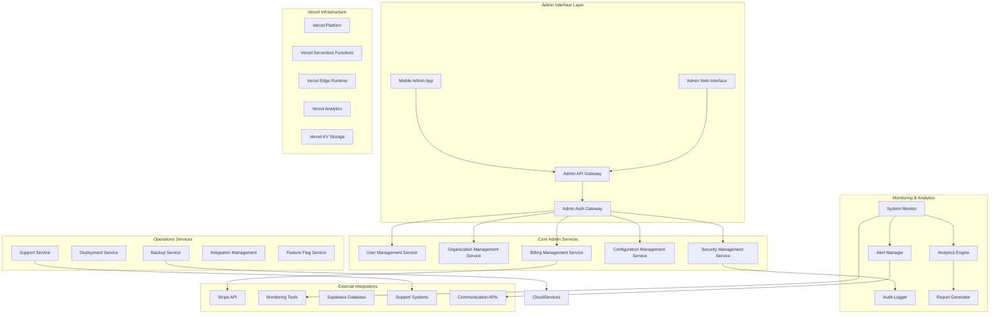
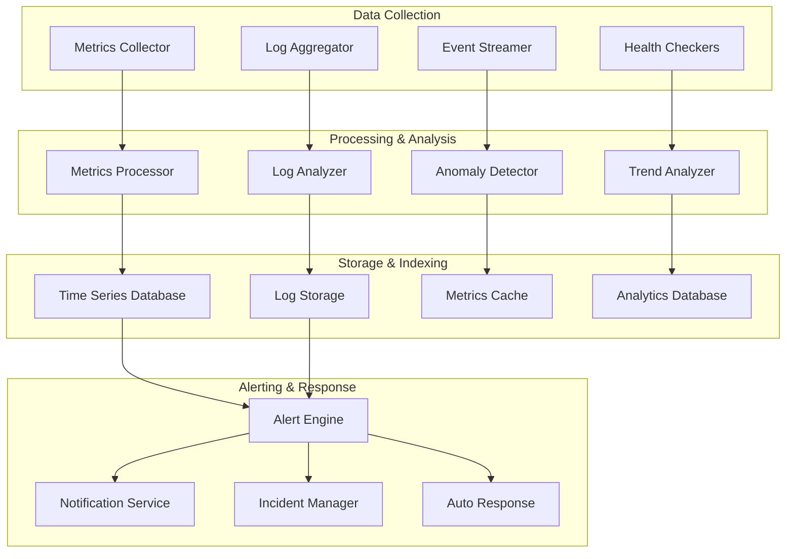
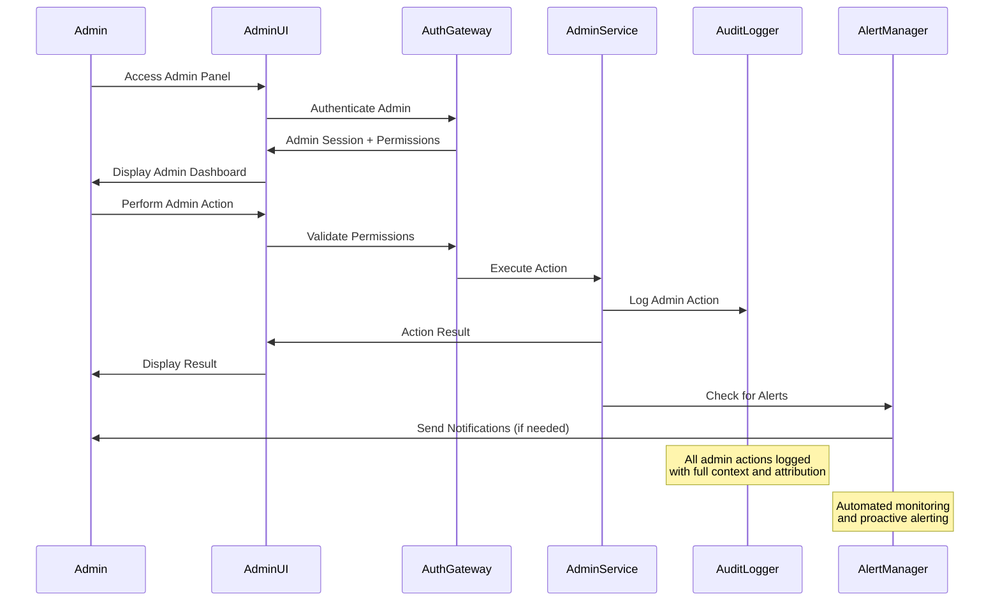

# Design Document

## Overview

The System Administration and Configuration Platform serves as the central command center for managing the entire C9d.ai ecosystem. Built as a secure, role-based administrative interface, the platform provides comprehensive visibility and control over all system components, user management, billing operations, and platform configurations. The architecture emphasizes security, auditability, and operational efficiency while providing real-time monitoring and automated response capabilities.

The design follows a microservices approach with dedicated services for different administrative domains, ensuring scalability and maintainability while providing unified access through a centralized administrative interface.

## Architecture

### High-Level Architecture



### System Monitoring Architecture



### Administrative Workflow



## Components and Interfaces

### Core Administrative Services

#### UserManagementService
```typescript
interface UserManagementService {
  getAllUsers(filters: UserFilters, pagination: Pagination): Promise<PaginatedUsers>
  getUserDetails(userId: string): Promise<UserDetails>
  createUser(userData: CreateUserData): Promise<User>
  updateUser(userId: string, updates: UserUpdates): Promise<User>
  suspendUser(userId: string, reason: string): Promise<void>
  deleteUser(userId: string, options: DeleteOptions): Promise<void>
  resetUserPassword(userId: string): Promise<PasswordResetResult>
  getUserActivity(userId: string, period: TimePeriod): Promise<UserActivity>
}
```

#### OrganizationManagementService
```typescript
interface OrganizationManagementService {
  getAllOrganizations(filters: OrgFilters): Promise<Organization[]>
  getOrganizationDetails(orgId: string): Promise<OrganizationDetails>
  createOrganization(orgData: CreateOrgData): Promise<Organization>
  updateOrganization(orgId: string, updates: OrgUpdates): Promise<Organization>
  suspendOrganization(orgId: string, reason: string): Promise<void>
  getOrganizationUsage(orgId: string, period: TimePeriod): Promise<UsageMetrics>
  manageOrganizationMembers(orgId: string, memberActions: MemberAction[]): Promise<void>
}
```

#### BillingManagementService
```typescript
interface BillingManagementService {
  getAllSubscriptions(filters: SubscriptionFilters): Promise<Subscription[]>
  getSubscriptionDetails(subscriptionId: string): Promise<SubscriptionDetails>
  createSubscriptionPlan(planData: PlanData): Promise<SubscriptionPlan>
  updateSubscriptionPlan(planId: string, updates: PlanUpdates): Promise<SubscriptionPlan>
  processRefund(subscriptionId: string, amount: number, reason: string): Promise<RefundResult>
  generateRevenueReport(period: TimePeriod): Promise<RevenueReport>
  managePaymentIssues(customerId: string, actions: PaymentAction[]): Promise<void>
}
```

#### SystemMonitorService
```typescript
interface SystemMonitorService {
  getSystemHealth(): Promise<SystemHealthStatus>
  getServiceMetrics(serviceId: string, period: TimePeriod): Promise<ServiceMetrics>
  getAlerts(filters: AlertFilters): Promise<Alert[]>
  acknowledgeAlert(alertId: string, adminId: string): Promise<void>
  createCustomAlert(alertConfig: AlertConfig): Promise<Alert>
  getPerformanceTrends(metrics: string[], period: TimePeriod): Promise<TrendData>
  triggerHealthCheck(serviceId: string): Promise<HealthCheckResult>
}
```

### Administrative Interface Components

#### AdminDashboard
Main administrative dashboard with system overview and quick actions.

```typescript
interface AdminDashboardProps {
  adminUser: AdminUser
  permissions: AdminPermission[]
  onNavigate: (section: AdminSection) => void
}

interface AdminDashboardState {
  systemHealth: SystemHealthStatus
  recentAlerts: Alert[]
  keyMetrics: KeyMetric[]
  recentActivity: AdminActivity[]
  pendingTasks: AdminTask[]
}
```

#### UserManagementPanel
Comprehensive user management interface with search, filtering, and bulk operations.

```typescript
interface UserManagementPanelProps {
  onUserSelect: (user: User) => void
  onBulkAction: (action: BulkUserAction, userIds: string[]) => void
  permissions: UserManagementPermission[]
}

interface UserManagementState {
  users: User[]
  selectedUsers: string[]
  filters: UserFilters
  sortConfig: SortConfig
  bulkActionMode: boolean
}
```

#### SystemMonitoringDashboard
Real-time system monitoring with metrics visualization and alert management.

```typescript
interface SystemMonitoringDashboardProps {
  timeRange: TimeRange
  onAlertAction: (alertId: string, action: AlertAction) => void
  onMetricDrilldown: (metric: string) => void
}

interface MonitoringMetrics {
  systemHealth: HealthMetric[]
  performanceMetrics: PerformanceMetric[]
  errorRates: ErrorMetric[]
  resourceUtilization: ResourceMetric[]
}
```

#### ConfigurationManager
Interface for managing platform configurations and feature flags.

```typescript
interface ConfigurationManagerProps {
  environment: Environment
  onConfigUpdate: (config: ConfigUpdate) => void
  onFeatureFlagToggle: (flagId: string, enabled: boolean) => void
}

interface ConfigurationState {
  configurations: PlatformConfig[]
  featureFlags: FeatureFlag[]
  pendingChanges: ConfigChange[]
  deploymentStatus: DeploymentStatus
}
```

## Data Models

### Administrative Models

```typescript
interface AdminUser {
  id: string
  email: string
  name: string
  role: AdminRole
  permissions: AdminPermission[]
  lastLogin: Date
  mfaEnabled: boolean
  sessionExpiry: Date
  createdAt: Date
}

interface SystemHealthStatus {
  overall: 'healthy' | 'degraded' | 'critical'
  services: ServiceHealth[]
  infrastructure: InfrastructureHealth
  alerts: ActiveAlert[]
  lastUpdated: Date
}

interface ServiceHealth {
  serviceId: string
  name: string
  status: 'healthy' | 'degraded' | 'down'
  responseTime: number
  errorRate: number
  uptime: number
  lastCheck: Date
}

interface UserDetails {
  user: User
  organizations: Organization[]
  subscriptions: Subscription[]
  usage: UsageMetrics
  activity: RecentActivity[]
  supportTickets: SupportTicket[]
  securityEvents: SecurityEvent[]
}

interface OrganizationDetails {
  organization: Organization
  members: OrganizationMember[]
  subscription: Subscription
  usage: OrganizationUsage
  billing: BillingDetails
  agents: Agent[]
  activity: OrganizationActivity[]
}
```

### Configuration and Feature Flag Models

```typescript
interface PlatformConfig {
  id: string
  name: string
  category: string
  value: any
  type: 'string' | 'number' | 'boolean' | 'object' | 'array'
  environment: Environment
  description: string
  lastModified: Date
  modifiedBy: string
  validation: ConfigValidation
}

interface FeatureFlag {
  id: string
  name: string
  description: string
  enabled: boolean
  rolloutPercentage: number
  targetUsers: string[]
  targetOrganizations: string[]
  conditions: FlagCondition[]
  createdAt: Date
  lastModified: Date
  modifiedBy: string
}

interface ConfigChange {
  id: string
  configId: string
  oldValue: any
  newValue: any
  status: 'pending' | 'approved' | 'deployed' | 'failed' | 'rolled_back'
  requestedBy: string
  approvedBy?: string
  deployedAt?: Date
  rollbackReason?: string
}
```

### Monitoring and Analytics Models

```typescript
interface Alert {
  id: string
  type: 'system' | 'security' | 'billing' | 'user' | 'performance'
  severity: 'low' | 'medium' | 'high' | 'critical'
  title: string
  description: string
  source: string
  status: 'active' | 'acknowledged' | 'resolved' | 'suppressed'
  createdAt: Date
  acknowledgedAt?: Date
  acknowledgedBy?: string
  resolvedAt?: Date
  metadata: AlertMetadata
}

interface UsageMetrics {
  period: TimePeriod
  apiCalls: number
  agentExecutions: number
  storageUsed: number
  bandwidthUsed: number
  activeUsers: number
  costs: CostBreakdown
  trends: UsageTrend[]
}

interface AuditLogEntry {
  id: string
  timestamp: Date
  adminId: string
  action: string
  resource: string
  resourceId: string
  oldValue?: any
  newValue?: any
  ipAddress: string
  userAgent: string
  success: boolean
  errorMessage?: string
  metadata: AuditMetadata
}

interface RevenueReport {
  period: TimePeriod
  totalRevenue: number
  recurringRevenue: number
  newCustomerRevenue: number
  churnedRevenue: number
  revenueByPlan: PlanRevenue[]
  revenueByRegion: RegionRevenue[]
  trends: RevenueTrend[]
  forecasts: RevenueForecast[]
}
```

### Support and Operations Models

```typescript
interface SupportTicket {
  id: string
  customerId: string
  organizationId?: string
  subject: string
  description: string
  priority: 'low' | 'medium' | 'high' | 'urgent'
  status: 'open' | 'in_progress' | 'waiting_customer' | 'resolved' | 'closed'
  assignedTo?: string
  createdAt: Date
  updatedAt: Date
  resolvedAt?: Date
  tags: string[]
  attachments: Attachment[]
}

interface DeploymentStatus {
  id: string
  version: string
  environment: Environment
  status: 'pending' | 'in_progress' | 'completed' | 'failed' | 'rolled_back'
  startedAt: Date
  completedAt?: Date
  deployedBy: string
  changes: DeploymentChange[]
  healthChecks: HealthCheckResult[]
  rollbackPlan?: RollbackPlan
}

interface BackupStatus {
  id: string
  type: 'full' | 'incremental' | 'differential'
  status: 'scheduled' | 'running' | 'completed' | 'failed'
  startedAt: Date
  completedAt?: Date
  size: number
  location: string
  retention: RetentionPolicy
  verification: BackupVerification
}
```

## Error Handling

### Administrative Errors
- **InsufficientAdminPermissions**: Admin lacks required permissions for operation
- **AdminSessionExpired**: Admin session has expired and requires re-authentication
- **ConcurrentAdminAction**: Multiple admins attempting conflicting operations
- **ConfigurationValidationFailed**: Platform configuration changes failed validation
- **SystemMaintenanceMode**: System is in maintenance mode and operations are restricted

### System Monitoring Errors
- **MonitoringServiceUnavailable**: Monitoring service is temporarily unavailable
- **MetricsCollectionFailed**: Failed to collect system metrics from services
- **AlertDeliveryFailed**: Failed to deliver critical alerts to administrators
- **HealthCheckTimeout**: System health check exceeded timeout threshold
- **AnomalyDetectionError**: Anomaly detection system encountered processing error

### Integration Errors
- **StripeIntegrationError**: Billing integration with Stripe failed
- **ExternalServiceTimeout**: Third-party service integration timed out
- **CredentialRotationFailed**: Automated credential rotation failed
- **WebhookDeliveryFailed**: Webhook delivery to external service failed
- **ServiceDegradationDetected**: External service performance degradation detected

### Error Response Format
```typescript
interface AdminErrorResponse {
  error: {
    code: string
    message: string
    details?: {
      adminId?: string
      resource?: string
      permissions?: string[]
      suggestedActions?: string[]
      escalationPath?: string
    }
    timestamp: string
    requestId: string
    severity: 'low' | 'medium' | 'high' | 'critical'
  }
}
```

## Testing Strategy

### Unit Testing
- **Admin Services**: Test all administrative service operations and business logic
- **Permission System**: Test role-based access controls and permission validation
- **Configuration Management**: Test configuration validation and deployment workflows
- **Monitoring Components**: Test alert generation, metric collection, and analysis

### Integration Testing
- **External Services**: Test integration with Stripe, monitoring tools, and cloud services
- **Database Operations**: Test administrative data operations and audit logging
- **Authentication**: Test admin authentication and session management
- **API Endpoints**: Test all administrative API endpoints with proper authorization

### End-to-End Testing
- **Admin Workflows**: Test complete administrative workflows from login to task completion
- **Emergency Procedures**: Test incident response and emergency administrative actions
- **Deployment Processes**: Test deployment workflows and rollback procedures
- **Backup and Recovery**: Test backup creation, verification, and restoration processes

### Security Testing
- **Access Controls**: Test administrative access controls and privilege escalation prevention
- **Audit Logging**: Test comprehensive audit logging and tamper-proof storage
- **Session Security**: Test admin session security and timeout handling
- **Data Protection**: Test sensitive data handling and encryption in administrative interfaces

### Performance Testing
- **Dashboard Loading**: Test administrative dashboard performance with large datasets
- **Bulk Operations**: Test performance of bulk administrative operations
- **Real-time Monitoring**: Test real-time monitoring performance under high load
- **Report Generation**: Test performance of analytics and report generation

### Disaster Recovery Testing
- **System Recovery**: Test disaster recovery procedures and system restoration
- **Data Recovery**: Test backup restoration and data integrity verification
- **Communication**: Test emergency communication and stakeholder notification
- **Failover Procedures**: Test automated failover and manual intervention procedures