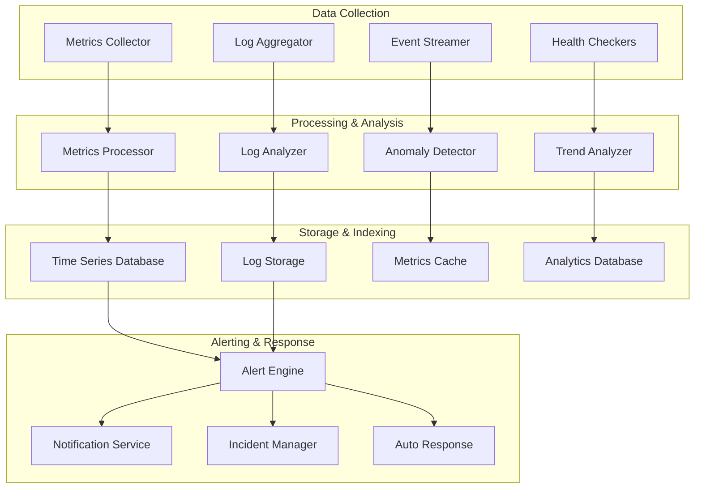
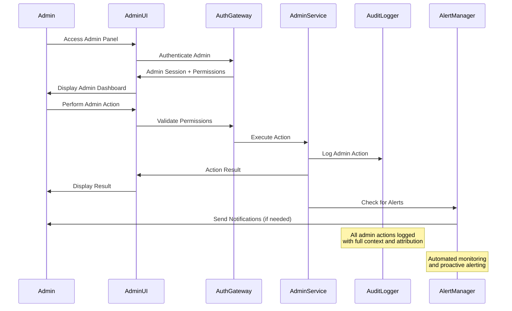

# Design Document

## Overview

The System Administration and Configuration Platform serves as the central command center for managing the entire C9d.ai ecosystem. Built as a secure, role-based administrative interface within the **apps/web** Next.js application, the platform provides comprehensive visibility and control over all system components, user management, billing operations, and platform configurations deployed on Vercel's infrastructure.

The architecture emphasizes security, auditability, and operational efficiency while providing real-time monitoring and automated response capabilities. The design follows a service-oriented approach with dedicated services for different administrative domains, ensuring scalability and maintainability while providing unified access through a centralized administrative interface.

**Deployment Context**: This system is implemented within the C9D AI monorepo's `apps/web` application, leveraging Vercel's Edge Network for low-latency administrative operations, Supabase for data persistence, and Phase.dev for secure environment variable management.

## Architecture

### Monorepo Application Structure

This administrative platform is implemented within the **apps/web** application in the C9D AI monorepo:

```
apps/
├── web/                                    # Main Next.js application (THIS SPEC)
│   ├── app/
│   │   ├── (admin)/                       # Admin route group (protected)
│   │   │   ├── dashboard/                 # Admin dashboard
│   │   │   ├── users/                     # User management
│   │   │   ├── organizations/             # Organization management
│   │   │   ├── billing/                   # Billing & subscriptions
│   │   │   ├── monitoring/                # System monitoring
│   │   │   ├── security/                  # Security management
│   │   │   ├── integrations/              # Third-party integrations
│   │   │   ├── analytics/                 # Analytics & reporting
│   │   │   ├── support/                   # Support operations
│   │   │   └── deployments/               # Deployment management
│   │   ├── api/
│   │   │   └── admin/                     # Admin API routes
│   │   │       ├── users/                 # User management APIs
│   │   │       ├── organizations/         # Organization APIs
│   │   │       ├── billing/               # Billing APIs
│   │   │       ├── monitoring/            # Monitoring APIs
│   │   │       ├── security/              # Security APIs
│   │   │       ├── analytics/             # Analytics APIs
│   │   │       └── webhooks/              # Admin webhooks
│   │   └── dashboard/                     # User-facing dashboard (separate)
│   ├── components/
│   │   └── admin/                         # Admin-specific components
│   │       ├── monitoring/                # Monitoring dashboards
│   │       ├── user-management/           # User management UI
│   │       ├── billing/                   # Billing UI
│   │       └── analytics/                 # Analytics UI
│   ├── lib/
│   │   ├── services/
│   │   │   ├── admin/                     # Admin services
│   │   │   │   ├── user-management-service.ts
│   │   │   │   ├── organization-management-service.ts
│   │   │   │   ├── billing-management-service.ts
│   │   │   │   ├── system-monitor-service.ts
│   │   │   │   ├── security-management-service.ts
│   │   │   │   ├── integration-management-service.ts
│   │   │   │   ├── analytics-engine-service.ts
│   │   │   │   ├── backup-service.ts
│   │   │   │   ├── support-operations-service.ts
│   │   │   │   └── deployment-management-service.ts
│   │   │   └── shared/                    # Shared services
│   │   ├── models/
│   │   │   └── admin/                     # Admin data models
│   │   └── utils/
│   │       └── admin/                     # Admin utilities
│   └── __tests__/
│       ├── unit/admin/                    # Admin unit tests
│       ├── integration/admin/             # Admin integration tests
│       └── e2e/admin/                     # Admin E2E tests

packages/
├── ui/                                     # Shared UI components
│   └── components/
│       └── admin/                          # Reusable admin UI components
├── types/                                  # Shared TypeScript types
│   └── admin.ts                            # Admin-related types
└── config/                                 # Configuration utilities
    └── admin.ts                            # Admin configuration
```

### High-Level Architecture


```mermaid
graph TB
    subgraph "Vercel Edge Network"
        EdgeMiddleware[Admin Auth Middleware]
        EdgeFunctions[Edge Functions]
    end
    
    subgraph "Next.js App Router - apps/web"
        AdminUI[Admin UI Pages]
        AdminAPI[Admin API Routes]
        AdminComponents[Admin Components]
    end
    
    subgraph "Service Layer - lib/services/admin"
        UserMgmtService[User Management Service]
        OrgMgmtService[Organization Management Service]
        BillingMgmtService[Billing Management Service]
        ConfigMgmtService[Configuration Management Service]
        SecurityMgmtService[Security Management Service]
        SystemMonitorService[System Monitor Service]
        AnalyticsEngineService[Analytics Engine Service]
        BackupService[Backup Service]
        SupportService[Support Operations Service]
        DeploymentService[Deployment Management Service]
    end
    
    subgraph "Data Layer - Supabase"
        UsersTable[(users)]
        OrgsTable[(organizations)]
        AuditLogsTable[(audit_logs)]
        AnalyticsTable[(analytics)]
        ConfigTable[(configurations)]
        BackupsTable[(backups)]
    end
    
    subgraph "External Services"
        Clerk[Clerk Auth]
        Stripe[Stripe API]
        VercelAPI[Vercel API]
        PhaseAPI[Phase.dev API]
    end
    
    EdgeMiddleware --> AdminUI
    EdgeMiddleware --> AdminAPI
    AdminUI --> AdminComponents
    AdminAPI --> UserMgmtService
    AdminAPI --> OrgMgmtService
    AdminAPI --> BillingMgmtService
    AdminAPI --> ConfigMgmtService
    AdminAPI --> SecurityMgmtService
    AdminAPI --> SystemMonitorService
    AdminAPI --> AnalyticsEngineService
    AdminAPI --> BackupService
    AdminAPI --> SupportService
    AdminAPI --> DeploymentService
    
    UserMgmtService --> UsersTable
    UserMgmtService --> Clerk
    OrgMgmtService --> OrgsTable
    BillingMgmtService --> Stripe
    SecurityMgmtService --> AuditLogsTable
    AnalyticsEngineService --> AnalyticsTable
    ConfigMgmtService --> ConfigTable
    ConfigMgmtService --> PhaseAPI
    BackupService --> BackupsTable
    DeploymentService --> VercelAPI
```

### System Monitoring Architecture


```mermaid
graph TB
    subgraph "Data Collection"
        MetricsCollector[Metrics Collector]
        LogAggregator[Log Aggregator]
        EventStreamer[Event Streamer]
        HealthCheckers[Health Checkers]
    end
    
    subgraph "Processing & Analysis"
        MetricsProcessor[Metrics Processor]
        LogAnalyzer[Log Analyzer]
        AnomalyDetector[Anomaly Detector]
        TrendAnalyzer[Trend Analyzer]
    end
    
    subgraph "Storage & Indexing"
        TimeSeriesDB[Time Series Database]
        LogStorage[Log Storage]
        MetricsCache[Metrics Cache]
        AnalyticsDB[Analytics Database]
    end
    
    subgraph "Alerting & Response"
        AlertEngine[Alert Engine]
        NotificationService[Notification Service]
        IncidentManager[Incident Manager]
        AutoResponse[Auto Response]
    end
    
    MetricsCollector --> MetricsProcessor
    LogAggregator --> LogAnalyzer
    EventStreamer --> AnomalyDetector
    HealthCheckers --> TrendAnalyzer
    
    MetricsProcessor --> TimeSeriesDB
    LogAnalyzer --> LogStorage
    AnomalyDetector --> MetricsCache
    TrendAnalyzer --> AnalyticsDB
    
    TimeSeriesDB --> AlertEngine
    LogStorage --> AlertEngine
    AlertEngine --> NotificationService
    AlertEngine --> IncidentManager
    AlertEngine --> AutoResponse
```

### Administrative Workflow


```mermaid
sequenceDiagram
    participant Admin
    participant AdminUI
    participant AuthGateway
    participant AdminService
    participant AuditLogger
    participant AlertManager
    
    Admin->>AdminUI: Access Admin Panel
    AdminUI->>AuthGateway: Authenticate Admin
    AuthGateway->>AdminUI: Admin Session + Permissions
    AdminUI->>Admin: Display Admin Dashboard
    
    Admin->>AdminUI: Perform Admin Action
    AdminUI->>AuthGateway: Validate Permissions
    AuthGateway->>AdminService: Execute Action
    AdminService->>AuditLogger: Log Admin Action
    AdminService->>AdminUI: Action Result
    AdminUI->>Admin: Display Result
    
    AdminService->>AlertManager: Check for Alerts
    AlertManager->>Admin: Send Notifications (if needed)
    
    Note over AuditLogger: All admin actions logged<br/>with full context and attribution
    Note over AlertManager: Automated monitoring<br/>and proactive alerting
```

## Components and Interfaces

### Core Administrative Services

#### UserManagementService
```typescript
interface UserManagementService {
  getAllUsers(filters: UserFilters, pagination: Pagination): Promise<PaginatedUsers>
  getUserDetails(userId: string): Promise<UserDetails>
  createUser(userData: CreateUserData): Promise<User>
  updateUser(userId: string, updates: UserUpdates): Promise<User>
  suspendUser(userId: string, reason: string): Promise<void>
  deleteUser(userId: string, options: DeleteOptions): Promise<void>
  resetUserPassword(userId: string): Promise<PasswordResetResult>
  getUserActivity(userId: string, period: TimePeriod): Promise<UserActivity>
}
```

#### OrganizationManagementService
```typescript
interface OrganizationManagementService {
  getAllOrganizations(filters: OrgFilters): Promise<Organization[]>
  getOrganizationDetails(orgId: string): Promise<OrganizationDetails>
  createOrganization(orgData: CreateOrgData): Promise<Organization>
  updateOrganization(orgId: string, updates: OrgUpdates): Promise<Organization>
  suspendOrganization(orgId: string, reason: string): Promise<void>
  getOrganizationUsage(orgId: string, period: TimePeriod): Promise<UsageMetrics>
  manageOrganizationMembers(orgId: string, memberActions: MemberAction[]): Promise<void>
}
```

#### BillingManagementService
```typescript
interface BillingManagementService {
  getAllSubscriptions(filters: SubscriptionFilters): Promise<Subscription[]>
  getSubscriptionDetails(subscriptionId: string): Promise<SubscriptionDetails>
  createSubscriptionPlan(planData: PlanData): Promise<SubscriptionPlan>
  updateSubscriptionPlan(planId: string, updates: PlanUpdates): Promise<SubscriptionPlan>
  processRefund(subscriptionId: string, amount: number, reason: string): Promise<RefundResult>
  generateRevenueReport(period: TimePeriod): Promise<RevenueReport>
  managePaymentIssues(customerId: string, actions: PaymentAction[]): Promise<void>
}
```

#### SystemMonitorService
```typescript
interface SystemMonitorService {
  getSystemHealth(): Promise<SystemHealthStatus>
  getServiceMetrics(serviceId: string, period: TimePeriod): Promise<ServiceMetrics>
  getAlerts(filters: AlertFilters): Promise<Alert[]>
  acknowledgeAlert(alertId: string, adminId: string): Promise<void>
  createCustomAlert(alertConfig: AlertConfig): Promise<Alert>
  getPerformanceTrends(metrics: string[], period: TimePeriod): Promise<TrendData>
  triggerHealthCheck(serviceId: string): Promise<HealthCheckResult>
}
```

### Administrative Interface Components

#### AdminDashboard
Main administrative dashboard with system overview and quick actions.

```typescript
interface AdminDashboardProps {
  adminUser: AdminUser
  permissions: AdminPermission[]
  onNavigate: (section: AdminSection) => void
}

interface AdminDashboardState {
  systemHealth: SystemHealthStatus
  recentAlerts: Alert[]
  keyMetrics: KeyMetric[]
  recentActivity: AdminActivity[]
  pendingTasks: AdminTask[]
}
```

#### UserManagementPanel
Comprehensive user management interface with search, filtering, and bulk operations.

```typescript
interface UserManagementPanelProps {
  onUserSelect: (user: User) => void
  onBulkAction: (action: BulkUserAction, userIds: string[]) => void
  permissions: UserManagementPermission[]
}

interface UserManagementState {
  users: User[]
  selectedUsers: string[]
  filters: UserFilters
  sortConfig: SortConfig
  bulkActionMode: boolean
}
```

#### SystemMonitoringDashboard
Real-time system monitoring with metrics visualization and alert management.

```typescript
interface SystemMonitoringDashboardProps {
  timeRange: TimeRange
  onAlertAction: (alertId: string, action: AlertAction) => void
  onMetricDrilldown: (metric: string) => void
}

interface MonitoringMetrics {
  systemHealth: HealthMetric[]
  performanceMetrics: PerformanceMetric[]
  errorRates: ErrorMetric[]
  resourceUtilization: ResourceMetric[]
}
```

#### ConfigurationManager
Interface for managing platform configurations and feature flags.

```typescript
interface ConfigurationManagerProps {
  environment: Environment
  onConfigUpdate: (config: ConfigUpdate) => void
  onFeatureFlagToggle: (flagId: string, enabled: boolean) => void
}

interface ConfigurationState {
  configurations: PlatformConfig[]
  featureFlags: FeatureFlag[]
  pendingChanges: ConfigChange[]
  deploymentStatus: DeploymentStatus
}
```

## Database Schema Alignment

### Existing Schema Integration

The administrative platform integrates with the existing Supabase schema defined in `supabase/migrations/`:

#### Users Table (Existing)
```sql
-- From: supabase/migrations/20240101000000_initial_schema.sql
CREATE TABLE users (
  id UUID PRIMARY KEY DEFAULT gen_random_uuid(),
  clerk_user_id TEXT UNIQUE NOT NULL,
  email TEXT NOT NULL,
  first_name TEXT,
  last_name TEXT,
  avatar_url TEXT,
  preferences JSONB DEFAULT '{}',
  created_at TIMESTAMP WITH TIME ZONE DEFAULT NOW(),
  updated_at TIMESTAMP WITH TIME ZONE DEFAULT NOW()
);
```

#### Organizations Table (Existing)
```sql
-- From: supabase/migrations/20240101000000_initial_schema.sql
CREATE TABLE organizations (
  id UUID PRIMARY KEY DEFAULT gen_random_uuid(),
  name TEXT NOT NULL,
  slug TEXT UNIQUE NOT NULL,
  description TEXT,
  settings JSONB DEFAULT '{}',
  created_at TIMESTAMP WITH TIME ZONE DEFAULT NOW(),
  updated_at TIMESTAMP WITH TIME ZONE DEFAULT NOW()
);
```

#### Audit Logs Table (Existing)
```sql
-- From: supabase/migrations/20240101000000_initial_schema.sql
CREATE TABLE audit_logs (
  id UUID PRIMARY KEY DEFAULT gen_random_uuid(),
  user_id UUID REFERENCES users(id),
  organization_id UUID REFERENCES organizations(id),
  action TEXT NOT NULL,
  resource_type TEXT NOT NULL,
  resource_id TEXT,
  metadata JSONB DEFAULT '{}',
  ip_address INET,
  user_agent TEXT,
  created_at TIMESTAMP WITH TIME ZONE DEFAULT NOW()
);
```

### Required New Tables

#### System Monitoring Tables
```sql
-- Migration: Create system monitoring tables
-- File: supabase/migrations/YYYYMMDD_create_admin_monitoring.sql

CREATE TABLE system_health_metrics (
  id UUID PRIMARY KEY DEFAULT gen_random_uuid(),
  service_name TEXT NOT NULL,
  metric_type TEXT NOT NULL CHECK (metric_type IN ('response_time', 'error_rate', 'resource_utilization', 'uptime')),
  value NUMERIC NOT NULL,
  unit TEXT NOT NULL,
  metadata JSONB DEFAULT '{}',
  recorded_at TIMESTAMP WITH TIME ZONE DEFAULT NOW()
);

CREATE INDEX idx_system_health_metrics_service ON system_health_metrics(service_name);
CREATE INDEX idx_system_health_metrics_recorded_at ON system_health_metrics(recorded_at DESC);

CREATE TABLE system_alerts (
  id UUID PRIMARY KEY DEFAULT gen_random_uuid(),
  alert_type TEXT NOT NULL CHECK (alert_type IN ('system', 'security', 'billing', 'user', 'performance')),
  severity TEXT NOT NULL CHECK (severity IN ('low', 'medium', 'high', 'critical')),
  title TEXT NOT NULL,
  description TEXT NOT NULL,
  source TEXT NOT NULL,
  status TEXT NOT NULL CHECK (status IN ('active', 'acknowledged', 'resolved', 'suppressed')),
  acknowledged_by UUID REFERENCES users(id),
  acknowledged_at TIMESTAMP WITH TIME ZONE,
  resolved_at TIMESTAMP WITH TIME ZONE,
  metadata JSONB DEFAULT '{}',
  created_at TIMESTAMP WITH TIME ZONE DEFAULT NOW()
);

CREATE INDEX idx_system_alerts_status ON system_alerts(status);
CREATE INDEX idx_system_alerts_severity ON system_alerts(severity);
CREATE INDEX idx_system_alerts_created_at ON system_alerts(created_at DESC);
```

#### Configuration Management Tables
```sql
-- Migration: Create configuration management tables
-- File: supabase/migrations/YYYYMMDD_create_admin_config.sql

CREATE TABLE platform_configurations (
  id UUID PRIMARY KEY DEFAULT gen_random_uuid(),
  name TEXT UNIQUE NOT NULL,
  category TEXT NOT NULL,
  value JSONB NOT NULL,
  value_type TEXT NOT NULL CHECK (value_type IN ('string', 'number', 'boolean', 'object', 'array')),
  environment TEXT NOT NULL CHECK (environment IN ('development', 'staging', 'production')),
  description TEXT,
  validation_schema JSONB,
  last_modified_by UUID REFERENCES users(id),
  created_at TIMESTAMP WITH TIME ZONE DEFAULT NOW(),
  updated_at TIMESTAMP WITH TIME ZONE DEFAULT NOW()
);

CREATE INDEX idx_platform_configurations_category ON platform_configurations(category);
CREATE INDEX idx_platform_configurations_environment ON platform_configurations(environment);

CREATE TABLE feature_flags (
  id UUID PRIMARY KEY DEFAULT gen_random_uuid(),
  name TEXT UNIQUE NOT NULL,
  description TEXT,
  enabled BOOLEAN DEFAULT FALSE,
  rollout_percentage INTEGER DEFAULT 0 CHECK (rollout_percentage >= 0 AND rollout_percentage <= 100),
  target_users TEXT[] DEFAULT '{}',
  target_organizations UUID[] DEFAULT '{}',
  conditions JSONB DEFAULT '{}',
  created_by UUID REFERENCES users(id),
  last_modified_by UUID REFERENCES users(id),
  created_at TIMESTAMP WITH TIME ZONE DEFAULT NOW(),
  updated_at TIMESTAMP WITH TIME ZONE DEFAULT NOW()
);

CREATE INDEX idx_feature_flags_enabled ON feature_flags(enabled);

CREATE TABLE configuration_changes (
  id UUID PRIMARY KEY DEFAULT gen_random_uuid(),
  config_id UUID REFERENCES platform_configurations(id) ON DELETE CASCADE,
  old_value JSONB,
  new_value JSONB,
  status TEXT NOT NULL CHECK (status IN ('pending', 'approved', 'deployed', 'failed', 'rolled_back')),
  requested_by UUID REFERENCES users(id),
  approved_by UUID REFERENCES users(id),
  deployed_at TIMESTAMP WITH TIME ZONE,
  rollback_reason TEXT,
  created_at TIMESTAMP WITH TIME ZONE DEFAULT NOW()
);

CREATE INDEX idx_configuration_changes_config_id ON configuration_changes(config_id);
CREATE INDEX idx_configuration_changes_status ON configuration_changes(status);
```

#### Analytics and Reporting Tables
```sql
-- Migration: Create analytics tables
-- File: supabase/migrations/YYYYMMDD_create_admin_analytics.sql

CREATE TABLE usage_metrics (
  id UUID PRIMARY KEY DEFAULT gen_random_uuid(),
  organization_id UUID REFERENCES organizations(id) ON DELETE CASCADE,
  user_id UUID REFERENCES users(id) ON DELETE CASCADE,
  metric_type TEXT NOT NULL,
  metric_value NUMERIC NOT NULL,
  period_start TIMESTAMP WITH TIME ZONE NOT NULL,
  period_end TIMESTAMP WITH TIME ZONE NOT NULL,
  metadata JSONB DEFAULT '{}',
  recorded_at TIMESTAMP WITH TIME ZONE DEFAULT NOW()
);

CREATE INDEX idx_usage_metrics_organization ON usage_metrics(organization_id);
CREATE INDEX idx_usage_metrics_user ON usage_metrics(user_id);
CREATE INDEX idx_usage_metrics_period ON usage_metrics(period_start, period_end);

CREATE TABLE revenue_reports (
  id UUID PRIMARY KEY DEFAULT gen_random_uuid(),
  period_start TIMESTAMP WITH TIME ZONE NOT NULL,
  period_end TIMESTAMP WITH TIME ZONE NOT NULL,
  total_revenue NUMERIC NOT NULL,
  recurring_revenue NUMERIC NOT NULL,
  new_customer_revenue NUMERIC NOT NULL,
  churned_revenue NUMERIC NOT NULL,
  revenue_by_plan JSONB DEFAULT '{}',
  revenue_by_region JSONB DEFAULT '{}',
  trends JSONB DEFAULT '{}',
  forecasts JSONB DEFAULT '{}',
  generated_at TIMESTAMP WITH TIME ZONE DEFAULT NOW()
);

CREATE INDEX idx_revenue_reports_period ON revenue_reports(period_start, period_end);
```

#### Support Operations Tables
```sql
-- Migration: Create support operations tables
-- File: supabase/migrations/YYYYMMDD_create_admin_support.sql

CREATE TABLE support_tickets (
  id UUID PRIMARY KEY DEFAULT gen_random_uuid(),
  customer_id UUID REFERENCES users(id) ON DELETE CASCADE,
  organization_id UUID REFERENCES organizations(id) ON DELETE CASCADE,
  subject TEXT NOT NULL,
  description TEXT NOT NULL,
  priority TEXT NOT NULL CHECK (priority IN ('low', 'medium', 'high', 'urgent')),
  status TEXT NOT NULL CHECK (status IN ('open', 'in_progress', 'waiting_customer', 'resolved', 'closed')),
  assigned_to UUID REFERENCES users(id),
  tags TEXT[] DEFAULT '{}',
  created_at TIMESTAMP WITH TIME ZONE DEFAULT NOW(),
  updated_at TIMESTAMP WITH TIME ZONE DEFAULT NOW(),
  resolved_at TIMESTAMP WITH TIME ZONE
);

CREATE INDEX idx_support_tickets_customer ON support_tickets(customer_id);
CREATE INDEX idx_support_tickets_status ON support_tickets(status);
CREATE INDEX idx_support_tickets_priority ON support_tickets(priority);
```

#### Backup and Deployment Tables
```sql
-- Migration: Create backup and deployment tables
-- File: supabase/migrations/YYYYMMDD_create_admin_operations.sql

CREATE TABLE backup_status (
  id UUID PRIMARY KEY DEFAULT gen_random_uuid(),
  backup_type TEXT NOT NULL CHECK (backup_type IN ('full', 'incremental', 'differential')),
  status TEXT NOT NULL CHECK (status IN ('scheduled', 'running', 'completed', 'failed')),
  started_at TIMESTAMP WITH TIME ZONE NOT NULL,
  completed_at TIMESTAMP WITH TIME ZONE,
  size_bytes BIGINT,
  location TEXT,
  retention_policy JSONB DEFAULT '{}',
  verification_status JSONB DEFAULT '{}',
  created_at TIMESTAMP WITH TIME ZONE DEFAULT NOW()
);

CREATE INDEX idx_backup_status_status ON backup_status(status);
CREATE INDEX idx_backup_status_started_at ON backup_status(started_at DESC);

CREATE TABLE deployment_status (
  id UUID PRIMARY KEY DEFAULT gen_random_uuid(),
  version TEXT NOT NULL,
  environment TEXT NOT NULL CHECK (environment IN ('development', 'staging', 'production')),
  status TEXT NOT NULL CHECK (status IN ('pending', 'in_progress', 'completed', 'failed', 'rolled_back')),
  started_at TIMESTAMP WITH TIME ZONE NOT NULL,
  completed_at TIMESTAMP WITH TIME ZONE,
  deployed_by UUID REFERENCES users(id),
  changes JSONB DEFAULT '{}',
  health_checks JSONB DEFAULT '{}',
  rollback_plan JSONB DEFAULT '{}',
  created_at TIMESTAMP WITH TIME ZONE DEFAULT NOW()
);

CREATE INDEX idx_deployment_status_environment ON deployment_status(environment);
CREATE INDEX idx_deployment_status_status ON deployment_status(status);
```

## Data Models

### Administrative Models

```typescript
interface AdminUser {
  id: string
  email: string
  name: string
  role: AdminRole
  permissions: AdminPermission[]
  lastLogin: Date
  mfaEnabled: boolean
  sessionExpiry: Date
  createdAt: Date
}

interface SystemHealthStatus {
  overall: 'healthy' | 'degraded' | 'critical'
  services: ServiceHealth[]
  infrastructure: InfrastructureHealth
  alerts: ActiveAlert[]
  lastUpdated: Date
}

interface ServiceHealth {
  serviceId: string
  name: string
  status: 'healthy' | 'degraded' | 'down'
  responseTime: number
  errorRate: number
  uptime: number
  lastCheck: Date
}

interface UserDetails {
  user: User
  organizations: Organization[]
  subscriptions: Subscription[]
  usage: UsageMetrics
  activity: RecentActivity[]
  supportTickets: SupportTicket[]
  securityEvents: SecurityEvent[]
}

interface OrganizationDetails {
  organization: Organization
  members: OrganizationMember[]
  subscription: Subscription
  usage: OrganizationUsage
  billing: BillingDetails
  agents: Agent[]
  activity: OrganizationActivity[]
}
```

### Configuration and Feature Flag Models

```typescript
interface PlatformConfig {
  id: string
  name: string
  category: string
  value: any
  type: 'string' | 'number' | 'boolean' | 'object' | 'array'
  environment: Environment
  description: string
  lastModified: Date
  modifiedBy: string
  validation: ConfigValidation
}

interface FeatureFlag {
  id: string
  name: string
  description: string
  enabled: boolean
  rolloutPercentage: number
  targetUsers: string[]
  targetOrganizations: string[]
  conditions: FlagCondition[]
  createdAt: Date
  lastModified: Date
  modifiedBy: string
}

interface ConfigChange {
  id: string
  configId: string
  oldValue: any
  newValue: any
  status: 'pending' | 'approved' | 'deployed' | 'failed' | 'rolled_back'
  requestedBy: string
  approvedBy?: string
  deployedAt?: Date
  rollbackReason?: string
}
```

### Monitoring and Analytics Models

```typescript
interface Alert {
  id: string
  type: 'system' | 'security' | 'billing' | 'user' | 'performance'
  severity: 'low' | 'medium' | 'high' | 'critical'
  title: string
  description: string
  source: string
  status: 'active' | 'acknowledged' | 'resolved' | 'suppressed'
  createdAt: Date
  acknowledgedAt?: Date
  acknowledgedBy?: string
  resolvedAt?: Date
  metadata: AlertMetadata
}

interface UsageMetrics {
  period: TimePeriod
  apiCalls: number
  agentExecutions: number
  storageUsed: number
  bandwidthUsed: number
  activeUsers: number
  costs: CostBreakdown
  trends: UsageTrend[]
}

interface AuditLogEntry {
  id: string
  timestamp: Date
  adminId: string
  action: string
  resource: string
  resourceId: string
  oldValue?: any
  newValue?: any
  ipAddress: string
  userAgent: string
  success: boolean
  errorMessage?: string
  metadata: AuditMetadata
}

interface RevenueReport {
  period: TimePeriod
  totalRevenue: number
  recurringRevenue: number
  newCustomerRevenue: number
  churnedRevenue: number
  revenueByPlan: PlanRevenue[]
  revenueByRegion: RegionRevenue[]
  trends: RevenueTrend[]
  forecasts: RevenueForecast[]
}
```

### Support and Operations Models

```typescript
interface SupportTicket {
  id: string
  customerId: string
  organizationId?: string
  subject: string
  description: string
  priority: 'low' | 'medium' | 'high' | 'urgent'
  status: 'open' | 'in_progress' | 'waiting_customer' | 'resolved' | 'closed'
  assignedTo?: string
  createdAt: Date
  updatedAt: Date
  resolvedAt?: Date
  tags: string[]
  attachments: Attachment[]
}

interface DeploymentStatus {
  id: string
  version: string
  environment: Environment
  status: 'pending' | 'in_progress' | 'completed' | 'failed' | 'rolled_back'
  startedAt: Date
  completedAt?: Date
  deployedBy: string
  changes: DeploymentChange[]
  healthChecks: HealthCheckResult[]
  rollbackPlan?: RollbackPlan
}

interface BackupStatus {
  id: string
  type: 'full' | 'incremental' | 'differential'
  status: 'scheduled' | 'running' | 'completed' | 'failed'
  startedAt: Date
  completedAt?: Date
  size: number
  location: string
  retention: RetentionPolicy
  verification: BackupVerification
}
```

## Error Handling

### Administrative Errors
- **InsufficientAdminPermissions**: Admin lacks required permissions for operation
- **AdminSessionExpired**: Admin session has expired and requires re-authentication
- **ConcurrentAdminAction**: Multiple admins attempting conflicting operations
- **ConfigurationValidationFailed**: Platform configuration changes failed validation
- **SystemMaintenanceMode**: System is in maintenance mode and operations are restricted

### System Monitoring Errors
- **MonitoringServiceUnavailable**: Monitoring service is temporarily unavailable
- **MetricsCollectionFailed**: Failed to collect system metrics from services
- **AlertDeliveryFailed**: Failed to deliver critical alerts to administrators
- **HealthCheckTimeout**: System health check exceeded timeout threshold
- **AnomalyDetectionError**: Anomaly detection system encountered processing error

### Integration Errors
- **StripeIntegrationError**: Billing integration with Stripe failed
- **ExternalServiceTimeout**: Third-party service integration timed out
- **CredentialRotationFailed**: Automated credential rotation failed
- **WebhookDeliveryFailed**: Webhook delivery to external service failed
- **ServiceDegradationDetected**: External service performance degradation detected

### Error Response Format
```typescript
interface AdminErrorResponse {
  error: {
    code: string
    message: string
    details?: {
      adminId?: string
      resource?: string
      permissions?: string[]
      suggestedActions?: string[]
      escalationPath?: string
    }
    timestamp: string
    requestId: string
    severity: 'low' | 'medium' | 'high' | 'critical'
  }
}
```

## Correctness Properties

*A property is a characteristic or behavior that should hold true across all valid executions of a system—essentially, a formal statement about what the system should do. Properties serve as the bridge between human-readable specifications and machine-verifiable correctness guarantees.*

### Property 1: Real-time Metrics Accuracy
*For any* platform service, when system health is queried, the returned metrics (API response times, error rates, resource utilization) should reflect data collected within the last 60 seconds and match the actual service state.
**Validates: Requirements 1.1**

### Property 2: Alert Delivery Completeness
*For any* detected issue with severity level, all configured notification channels for that severity should receive alerts within the defined SLA timeframe (critical: 1 minute, high: 5 minutes, medium: 15 minutes).
**Validates: Requirements 1.3**

### Property 3: User Management Audit Trail Completeness
*For any* administrative action on user accounts (creation, modification, suspension, deletion), an audit log entry should be created with complete attribution (admin ID, timestamp, action type, old/new values) before the action completes.
**Validates: Requirements 2.4**

### Property 4: Permission Check Consistency
*For any* user and permission combination, checking the same permission multiple times within a session should return consistent results unless an explicit permission change occurs.
**Validates: Requirements 2.3**

### Property 5: Subscription Plan Feature Gate Enforcement
*For any* subscription plan and feature combination, if a feature is not included in the plan's feature gates, attempts to access that feature should be denied with appropriate error messaging.
**Validates: Requirements 3.1**

### Property 6: Usage Quota Enforcement Accuracy
*For any* resource with defined quotas, when usage reaches the quota limit, further resource consumption should be blocked and the user should receive quota exceeded notifications.
**Validates: Requirements 3.3, 3.4**

### Property 7: Configuration Rollback Idempotency
*For any* configuration change, rolling back to a previous state and then rolling back again should result in the same system state as a single rollback operation.
**Validates: Requirements 4.2, 4.5**

### Property 8: Feature Flag Rollout Percentage Accuracy
*For any* feature flag with percentage-based rollout, the actual percentage of users receiving the feature should be within ±2% of the configured percentage over a statistically significant sample size.
**Validates: Requirements 4.1**

### Property 9: Audit Log Tamper-Proof Verification
*For any* audit log entry, once written, the entry should be immutable and any attempt to modify it should be detectable through cryptographic verification or append-only storage validation.
**Validates: Requirements 5.4**

### Property 10: Security Incident Response Timeliness
*For any* detected security threat with critical severity, automated response capabilities should be triggered within 30 seconds and all relevant administrators should be notified within 2 minutes.
**Validates: Requirements 5.5**

### Property 11: Integration Health Monitoring Accuracy
*For any* third-party service integration, health check results should accurately reflect the service's actual availability and performance within the last health check interval.
**Validates: Requirements 6.2**

### Property 12: Credential Rotation Atomicity
*For any* credential rotation operation, either all components using the credential should be updated successfully, or the operation should fail completely with no partial updates.
**Validates: Requirements 6.3**

### Property 13: Analytics Data Consistency
*For any* time period and metric combination, querying the same analytics data multiple times should return consistent results unless new data has been ingested for that period.
**Validates: Requirements 7.1**

### Property 14: Report Generation Determinism
*For any* report configuration and data snapshot, generating the report multiple times should produce identical results given the same input data.
**Validates: Requirements 7.2**

### Property 15: Backup Verification Completeness
*For any* completed backup, verification should confirm that all critical data is present and restorable before marking the backup as successful.
**Validates: Requirements 8.1**

### Property 16: Disaster Recovery RTO Compliance
*For any* disaster recovery procedure, the actual recovery time should not exceed the documented Recovery Time Objective (RTO) for that procedure's priority level.
**Validates: Requirements 8.2**

### Property 17: Support Ticket Escalation Timeliness
*For any* support ticket, if response time exceeds the SLA threshold for its priority level, automatic escalation should occur within 5 minutes of the threshold breach.
**Validates: Requirements 9.2**

### Property 18: Deployment Rollback Completeness
*For any* failed deployment, rollback should restore the system to the exact previous state including all configurations, code versions, and data migrations.
**Validates: Requirements 10.2, 10.5**

### Property 19: Maintenance Window Notification Delivery
*For any* scheduled maintenance window, all affected customers should receive notifications at least 24 hours in advance through all configured communication channels.
**Validates: Requirements 10.1**

### Property 20: Blue-Green Deployment Zero-Downtime
*For any* blue-green deployment, the transition from old to new version should complete without any request failures or service interruptions exceeding 100ms.
**Validates: Requirements 10.2**

## Vercel Deployment Architecture

### Deployment Configuration

```json
// vercel.json - Admin platform configuration
{
  "buildCommand": "pnpm build --filter=web",
  "devCommand": "pnpm dev --filter=web",
  "installCommand": "pnpm install",
  "framework": "nextjs",
  
  "functions": {
    "app/api/admin/**/route.ts": {
      "maxDuration": 30,
      "memory": 2048
    },
    "app/api/admin/monitoring/**/route.ts": {
      "maxDuration": 60,
      "memory": 3008
    },
    "app/api/admin/analytics/**/route.ts": {
      "maxDuration": 60,
      "memory": 3008
    }
  },
  
  "headers": [
    {
      "source": "/api/admin/(.*)",
      "headers": [
        {
          "key": "X-Content-Type-Options",
          "value": "nosniff"
        },
        {
          "key": "X-Frame-Options",
          "value": "DENY"
        },
        {
          "key": "X-XSS-Protection",
          "value": "1; mode=block"
        },
        {
          "key": "Strict-Transport-Security",
          "value": "max-age=31536000; includeSubDomains"
        }
      ]
    }
  ],
  
  "redirects": [
    {
      "source": "/admin",
      "destination": "/admin/dashboard",
      "permanent": false
    }
  ]
}
```

### Edge Middleware for Admin Routes

```typescript
// middleware.ts - Admin route protection
import { authMiddleware } from '@clerk/nextjs'
import { NextResponse } from 'next/server'

export default authMiddleware({
  publicRoutes: [
    '/',
    '/sign-in(.*)',
    '/sign-up(.*)',
    '/api/webhooks(.*)',
    '/api/health'
  ],
  
  // Admin routes require special permissions
  afterAuth(auth, req) {
    // Check if accessing admin routes
    if (req.nextUrl.pathname.startsWith('/admin') || 
        req.nextUrl.pathname.startsWith('/api/admin')) {
      
      // Require authentication
      if (!auth.userId) {
        const signInUrl = new URL('/sign-in', req.url)
        signInUrl.searchParams.set('redirect_url', req.nextUrl.pathname)
        return NextResponse.redirect(signInUrl)
      }
      
      // Check admin permissions
      const hasAdminAccess = await checkAdminPermissions(auth.userId)
      if (!hasAdminAccess) {
        return NextResponse.redirect(new URL('/dashboard', req.url))
      }
    }
    
    return NextResponse.next()
  }
})

export const config = {
  matcher: ['/((?!_next/static|_next/image|favicon.ico).*)']
}
```

### Environment Variables (Phase.dev Integration)

```bash
# .phase-apps.json - Phase.dev context configuration for admin
{
  "apps": {
    "AI.C9d.Web": {
      "environments": {
        "production": {
          "NEXT_PUBLIC_CLERK_PUBLISHABLE_KEY": "pk_live_...",
          "CLERK_SECRET_KEY": "sk_live_...",
          "NEXT_PUBLIC_SUPABASE_URL": "https://...",
          "NEXT_PUBLIC_SUPABASE_ANON_KEY": "eyJ...",
          "SUPABASE_SERVICE_ROLE_KEY": "eyJ...",
          "STRIPE_SECRET_KEY": "sk_live_...",
          "STRIPE_WEBHOOK_SECRET": "whsec_...",
          "VERCEL_API_TOKEN": "...",
          "ADMIN_ALERT_WEBHOOK_URL": "https://...",
          "MONITORING_API_KEY": "..."
        },
        "staging": {
          "NEXT_PUBLIC_CLERK_PUBLISHABLE_KEY": "pk_test_...",
          "CLERK_SECRET_KEY": "sk_test_...",
          "NEXT_PUBLIC_SUPABASE_URL": "https://...",
          "NEXT_PUBLIC_SUPABASE_ANON_KEY": "eyJ...",
          "SUPABASE_SERVICE_ROLE_KEY": "eyJ...",
          "STRIPE_SECRET_KEY": "sk_test_...",
          "STRIPE_WEBHOOK_SECRET": "whsec_...",
          "VERCEL_API_TOKEN": "...",
          "ADMIN_ALERT_WEBHOOK_URL": "https://...",
          "MONITORING_API_KEY": "..."
        },
        "development": {
          "NEXT_PUBLIC_CLERK_PUBLISHABLE_KEY": "pk_test_...",
          "CLERK_SECRET_KEY": "sk_test_...",
          "NEXT_PUBLIC_SUPABASE_URL": "http://localhost:54321",
          "NEXT_PUBLIC_SUPABASE_ANON_KEY": "eyJ...",
          "SUPABASE_SERVICE_ROLE_KEY": "eyJ...",
          "STRIPE_SECRET_KEY": "sk_test_...",
          "STRIPE_WEBHOOK_SECRET": "whsec_...",
          "VERCEL_API_TOKEN": "...",
          "ADMIN_ALERT_WEBHOOK_URL": "http://localhost:3000/api/webhooks/alerts",
          "MONITORING_API_KEY": "test_key"
        }
      }
    }
  }
}
```

## Testing Strategy

### Testing Philosophy

The administrative platform follows modern testing standards with official testing utilities, real service integration, and tiered coverage requirements:

- **Official Utilities**: Use @clerk/testing for Clerk integration, real Supabase for database tests
- **Real Services**: All integration tests use real Supabase and Stripe (test mode) with managed test data
- **Memory Management**: All test commands include proper NODE_OPTIONS configuration
- **Test Data Lifecycle**: Complete test data management from creation through cleanup
- **Idempotent Execution**: Tests support parallel execution without data pollution
- **Tiered Coverage**: 
  - Services (lib/services/admin/**): 100% coverage required
  - Models (lib/models/admin/**): 95% coverage required
  - API Routes (app/api/admin/**): 90% coverage required
  - Global minimum: 85% coverage

### Test Data Management

**CRITICAL**: All tests MUST manage their own test data lifecycle and ensure idempotency.

```typescript
// __tests__/setup/admin-test-data-manager.ts
export class AdminTestDataManager {
  private createdUsers: string[] = []
  private createdOrganizations: string[] = []
  private createdAlerts: string[] = []
  private createdConfigs: string[] = []
  
  /**
   * Creates test admin user with unique identifier
   * Tracks for cleanup after test completion
   */
  async createTestAdmin(overrides: Partial<User> = {}): Promise<User> {
    const testId = `admin_test_${Date.now()}_${Math.random().toString(36).substr(2, 9)}`
    
    const user = await supabase
      .from('users')
      .insert({
        clerk_user_id: `test_admin_${testId}`,
        email: `admin_${testId}@example.com`,
        first_name: 'Admin',
        last_name: 'Test',
        email_verified: true,
        ...overrides
      })
      .select()
      .single()
    
    // Grant admin permissions
    await supabase
      .from('organization_memberships')
      .insert({
        user_id: user.data.id,
        organization_id: 'system_admin_org',
        role_id: 'admin_role'
      })
    
    this.createdUsers.push(user.data.id)
    return user.data
  }
  
  /**
   * Creates test system alert
   */
  async createTestAlert(overrides: Partial<SystemAlert> = {}): Promise<SystemAlert> {
    const alert = await supabase
      .from('system_alerts')
      .insert({
        alert_type: 'system',
        severity: 'medium',
        title: 'Test Alert',
        description: 'Test alert description',
        source: 'test',
        status: 'active',
        ...overrides
      })
      .select()
      .single()
    
    this.createdAlerts.push(alert.data.id)
    return alert.data
  }
  
  /**
   * Cleans up all test data created during test execution
   * Ensures no data pollution between test runs
   */
  async cleanup(): Promise<void> {
    // Delete in reverse dependency order
    if (this.createdAlerts.length > 0) {
      await supabase
        .from('system_alerts')
        .delete()
        .in('id', this.createdAlerts)
    }
    
    if (this.createdConfigs.length > 0) {
      await supabase
        .from('platform_configurations')
        .delete()
        .in('id', this.createdConfigs)
    }
    
    if (this.createdUsers.length > 0) {
      await supabase
        .from('users')
        .delete()
        .in('id', this.createdUsers)
    }
    
    if (this.createdOrganizations.length > 0) {
      await supabase
        .from('organizations')
        .delete()
        .in('id', this.createdOrganizations)
    }
    
    // Reset tracking arrays
    this.createdUsers = []
    this.createdOrganizations = []
    this.createdAlerts = []
    this.createdConfigs = []
  }
}
```

### Unit Testing
- **Admin Services**: Test all administrative service operations and business logic
- **Permission System**: Test role-based access controls and permission validation
- **Configuration Management**: Test configuration validation and deployment workflows
- **Monitoring Components**: Test alert generation, metric collection, and analysis
- **Coverage Target**: 100% for services layer (lib/services/**)

### Property-Based Testing
- **Testing Framework**: Use fast-check for JavaScript/TypeScript property-based testing
- **Test Configuration**: Minimum 100 iterations per property test
- **Property Test Tagging**: Each property-based test must include a comment with format: `// Feature: system-administration-configuration-platform, Property X: [property description]`
- **Property Coverage**: Each correctness property must be implemented as a property-based test
- **Generator Strategy**: Create smart generators that constrain to valid input spaces
- **Properties to Test**:
  - Real-time metrics accuracy and freshness (Property 1)
  - Alert delivery completeness across severity levels (Property 2)
  - Audit trail completeness for all admin actions (Property 3)
  - Permission check consistency within sessions (Property 4)
  - Feature gate enforcement across subscription plans (Property 5)
  - Usage quota enforcement accuracy (Property 6)
  - Configuration rollback idempotency (Property 7)
  - Feature flag rollout percentage accuracy (Property 8)
  - Audit log tamper-proof verification (Property 9)
  - Security incident response timeliness (Property 10)
  - Integration health monitoring accuracy (Property 11)
  - Credential rotation atomicity (Property 12)
  - Analytics data consistency (Property 13)
  - Report generation determinism (Property 14)
  - Backup verification completeness (Property 15)
  - Disaster recovery RTO compliance (Property 16)
  - Support ticket escalation timeliness (Property 17)
  - Deployment rollback completeness (Property 18)
  - Maintenance notification delivery (Property 19)
  - Blue-green deployment zero-downtime (Property 20)

### Integration Testing

**CRITICAL**: All integration tests MUST use real services with proper test data lifecycle management.

```typescript
// __tests__/integration/admin/user-management.integration.test.ts
describe('User Management Integration', () => {
  let testDataManager: AdminTestDataManager
  let testAdmin: User
  
  beforeEach(async () => {
    testDataManager = new AdminTestDataManager()
    testAdmin = await testDataManager.createTestAdmin()
  })
  
  afterEach(async () => {
    // CRITICAL: Always cleanup test data
    await testDataManager.cleanup()
  })
  
  it('should suspend user with real Supabase', async () => {
    // Create test user
    const testUser = await testDataManager.createTestUser()
    
    // Test with real service
    const result = await UserManagementService.suspendUser(
      testUser.id,
      'Test suspension',
      testAdmin.id
    )
    
    // Verify with real database query
    const { data: suspendedUser } = await supabase
      .from('users')
      .select('*')
      .eq('id', testUser.id)
      .single()
    
    expect(suspendedUser.status).toBe('suspended')
    
    // Verify audit log created
    const { data: auditLog } = await supabase
      .from('audit_logs')
      .select('*')
      .eq('resource_id', testUser.id)
      .eq('action', 'user_suspended')
      .single()
    
    expect(auditLog).toBeDefined()
    expect(auditLog.user_id).toBe(testAdmin.id)
  })
  
  it('should integrate with Stripe for billing operations', async () => {
    // Use Stripe test mode
    const testOrg = await testDataManager.createTestOrganization()
    
    // Test real Stripe integration
    const subscription = await BillingManagementService.createSubscription({
      organizationId: testOrg.id,
      planId: 'test_plan',
      paymentMethodId: 'pm_card_visa' // Stripe test token
    })
    
    expect(subscription.stripeSubscriptionId).toBeDefined()
    
    // Verify in database
    const { data: dbSubscription } = await supabase
      .from('subscriptions')
      .select('*')
      .eq('organization_id', testOrg.id)
      .single()
    
    expect(dbSubscription.stripe_subscription_id).toBe(subscription.stripeSubscriptionId)
  })
})
```

**Integration Test Requirements**:
- **Real Supabase**: All database operations use real Supabase instance
- **Real Stripe**: Billing tests use Stripe test mode with real API calls
- **Real Clerk**: Authentication tests use Clerk test environment
- **Test Data Cleanup**: All tests clean up created data in afterEach
- **Parallel Execution**: Tests support parallel execution without conflicts
- **Coverage Target**: 90% for API routes (app/api/admin/**)

### End-to-End Testing

**CRITICAL**: All E2E tests MUST follow Clerk authentication methodology and manage their own seed data.

```typescript
// __tests__/e2e/admin/admin-workflows.e2e.test.ts
import { test, expect } from '@playwright/test'
import { clerk } from '@clerk/testing/playwright'

test.describe('Admin Workflows E2E', () => {
  let testAdminEmail: string
  let testAdminPassword: string
  let testAdminUserId: string
  let testDataManager: AdminTestDataManager
  
  test.beforeEach(async ({ page }) => {
    testDataManager = new AdminTestDataManager()
    
    // Generate unique test credentials
    const testId = `admin_e2e_${Date.now()}_${Math.random().toString(36).substr(2, 9)}`
    testAdminEmail = `admin_${testId}@example.com`
    testAdminPassword = `AdminPass123!${testId}`
    
    // Create test admin via Clerk API
    const user = await clerk.users.createUser({
      emailAddress: [testAdminEmail],
      password: testAdminPassword
    })
    testAdminUserId = user.id
    
    // Create admin user in database with permissions
    await testDataManager.createTestAdmin({
      clerk_user_id: testAdminUserId,
      email: testAdminEmail
    })
  })
  
  test.afterEach(async () => {
    // CRITICAL: Cleanup test data
    if (testAdminUserId) {
      await clerk.users.deleteUser(testAdminUserId)
    }
    await testDataManager.cleanup()
  })
  
  test('should complete user suspension workflow', async ({ page }) => {
    // Sign in as admin using Clerk
    await page.goto('/sign-in')
    await clerk.signIn({
      page,
      identifier: testAdminEmail,
      password: testAdminPassword
    })
    
    // Navigate to admin dashboard
    await expect(page).toHaveURL('/admin/dashboard')
    
    // Create test user to suspend
    const testUser = await testDataManager.createTestUser()
    
    // Navigate to user management
    await page.goto('/admin/users')
    
    // Search for test user
    await page.fill('[data-testid="user-search"]', testUser.email)
    await page.click('[data-testid="search-button"]')
    
    // Click suspend button
    await page.click(`[data-testid="suspend-user-${testUser.id}"]`)
    
    // Fill suspension reason
    await page.fill('[data-testid="suspension-reason"]', 'E2E test suspension')
    await page.click('[data-testid="confirm-suspension"]')
    
    // Verify success message
    await expect(page.locator('[data-testid="success-message"]'))
      .toContainText('User suspended successfully')
    
    // Verify in database
    const { data: suspendedUser } = await supabase
      .from('users')
      .select('*')
      .eq('id', testUser.id)
      .single()
    
    expect(suspendedUser.status).toBe('suspended')
  })
  
  test('should handle system alert acknowledgment', async ({ page }) => {
    // Sign in as admin
    await page.goto('/sign-in')
    await clerk.signIn({
      page,
      identifier: testAdminEmail,
      password: testAdminPassword
    })
    
    // Create test alert
    const testAlert = await testDataManager.createTestAlert({
      severity: 'high',
      title: 'E2E Test Alert'
    })
    
    // Navigate to monitoring dashboard
    await page.goto('/admin/monitoring')
    
    // Find and acknowledge alert
    await page.click(`[data-testid="alert-${testAlert.id}"]`)
    await page.click('[data-testid="acknowledge-alert"]')
    
    // Verify alert acknowledged
    await expect(page.locator(`[data-testid="alert-${testAlert.id}-status"]`))
      .toContainText('Acknowledged')
    
    // Verify in database
    const { data: acknowledgedAlert } = await supabase
      .from('system_alerts')
      .select('*')
      .eq('id', testAlert.id)
      .single()
    
    expect(acknowledgedAlert.status).toBe('acknowledged')
    expect(acknowledgedAlert.acknowledged_by).toBe(testAdminUserId)
  })
})
```

**E2E Test Requirements**:
- **Clerk Authentication**: Use @clerk/testing/playwright for authentication
- **Seed Data Management**: Each test creates and cleans up its own data
- **Idempotent Execution**: Tests can run multiple times without conflicts
- **Real User Flows**: Test complete workflows from authentication to completion
- **Database Verification**: Verify state changes in real database
- **Parallel Execution**: Tests support parallel execution with isolated data

### Security Testing
- **Access Controls**: Test administrative access controls and privilege escalation prevention
- **Audit Logging**: Test comprehensive audit logging and tamper-proof storage
- **Session Security**: Test admin session security and timeout handling
- **Data Protection**: Test sensitive data handling and encryption in administrative interfaces

### Performance Testing
- **Dashboard Loading**: Test administrative dashboard performance with large datasets
- **Bulk Operations**: Test performance of bulk administrative operations
- **Real-time Monitoring**: Test real-time monitoring performance under high load
- **Report Generation**: Test performance of analytics and report generation

### Disaster Recovery Testing
- **System Recovery**: Test disaster recovery procedures and system restoration
- **Data Recovery**: Test backup restoration and data integrity verification
- **Communication**: Test emergency communication and stakeholder notification
- **Failover Procedures**: Test automated failover and manual intervention procedures

### Test Quality Gates

**MANDATORY**: All tests must pass 100% before tasks are considered complete.

```typescript
// package.json - Test execution with quality gates
{
  "scripts": {
    "test": "NODE_OPTIONS=\"--max-old-space-size=8192\" vitest run",
    "test:unit": "NODE_OPTIONS=\"--max-old-space-size=8192\" vitest run --config vitest.unit.config.ts",
    "test:integration": "NODE_OPTIONS=\"--max-old-space-size=8192\" vitest run --config vitest.integration.config.ts",
    "test:e2e": "playwright test",
    "test:all": "pnpm test:unit && pnpm test:integration && pnpm test:e2e",
    "test:coverage": "NODE_OPTIONS=\"--max-old-space-size=16384\" vitest run --coverage",
    
    // Quality gate validation
    "validate:tests": "pnpm test:all && pnpm test:coverage",
    "validate:admin": "pnpm test:all --filter='**/__tests__/*/admin/**' && pnpm test:coverage"
  }
}
```

**Quality Gate Requirements**:
1. **100% Test Pass Rate**: All tests must pass without skips or failures
2. **Coverage Thresholds**: Must meet tiered coverage requirements
3. **No Test Data Pollution**: All tests must clean up their data
4. **Parallel Execution**: Tests must support parallel execution
5. **Real Service Integration**: Integration tests must use real services
6. **Idempotent Execution**: Tests must be repeatable without side effects

### Test Configuration

```typescript
// vitest.config.ts - Admin test configuration
export default defineConfig({
  test: {
    environment: 'jsdom',
    globals: true,
    setupFiles: ['./vitest.setup.ts'],
    
    // Memory optimization for large test suites
    pool: 'forks',
    poolOptions: {
      forks: {
        singleFork: false, // Allow parallel execution
        isolate: true      // Isolate test environments
      }
    },
    
    // Extended timeouts for real service integration
    testTimeout: 60000,
    hookTimeout: 30000,
    
    // Coverage configuration with tiered thresholds
    coverage: {
      provider: 'v8',
      reporter: ['text', 'json', 'html'],
      thresholds: {
        global: {
          branches: 85,
          functions: 85,
          lines: 85,
          statements: 85
        },
        'lib/services/admin/**': {
          branches: 100,
          functions: 100,
          lines: 100,
          statements: 100
        },
        'lib/models/admin/**': {
          branches: 95,
          functions: 95,
          lines: 95,
          statements: 95
        },
        'app/api/admin/**': {
          branches: 90,
          functions: 90,
          lines: 90,
          statements: 90
        }
      },
      exclude: [
        '**/__tests__/**',
        '**/__mocks__/**',
        '**/node_modules/**',
        '**/*.config.*',
        '**/coverage/**',
        '**/*.d.ts',
        '**/dist/**',
        '**/.next/**'
      ]
    }
  }
})
```

```typescript
// playwright.config.ts - E2E test configuration
export default defineConfig({
  testDir: './__tests__/e2e/admin',
  fullyParallel: true,
  forbidOnly: !!process.env.CI,
  retries: process.env.CI ? 2 : 0,
  workers: process.env.CI ? 1 : undefined,
  
  use: {
    baseURL: process.env.BASE_URL || 'http://localhost:3000',
    trace: 'on-first-retry',
    screenshot: 'only-on-failure',
  },
  
  projects: [
    {
      name: 'chromium',
      use: { ...devices['Desktop Chrome'] },
    },
    {
      name: 'firefox',
      use: { ...devices['Desktop Firefox'] },
    },
    {
      name: 'webkit',
      use: { ...devices['Desktop Safari'] },
    },
  ],
  
  webServer: {
    command: 'pnpm dev --filter=web',
    url: 'http://localhost:3000',
    reuseExistingServer: !process.env.CI,
  },
})
```