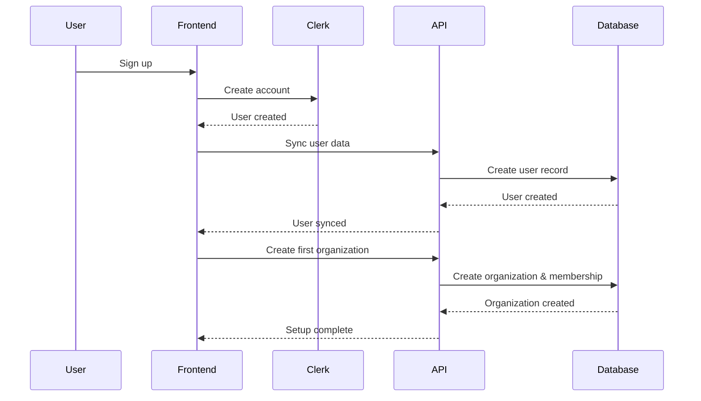

# API Documentation

Welcome to the Account Management & Organizational Modeling API documentation. This API provides comprehensive functionality for user account management, organizational modeling, and role-based access control.

## Quick Start

### Authentication

All API requests require authentication using Clerk session tokens. Include the token in the Authorization header:

```bash
curl -H "Authorization: Bearer <your_session_token>" \
     https://api.example.com/v1/users/me
```

### Base URL

- **Production**: `https://api.example.com/v1`
- **Staging**: `https://staging-api.example.com/v1`
- **Development**: `http://localhost:3000/api`

### Content Type

All requests and responses use JSON:

```bash
curl -H "Content-Type: application/json" \
     -H "Authorization: Bearer <token>" \
     -d '{"name": "My Organization"}' \
     https://api.example.com/v1/organizations
```

## API Reference

### OpenAPI Specification

The complete API specification is available in OpenAPI 3.0 format:

- [OpenAPI YAML](./openapi.yaml)
- [Interactive Documentation](https://api.example.com/docs) (Swagger UI)
- [Redoc Documentation](https://api.example.com/redoc)

## Core Concepts

### Users

Users represent individual accounts in the system. Each user has:

- Unique identifier and Clerk integration
- Profile information (name, email, avatar)
- Preferences and settings
- Membership in one or more organizations

### Organizations

Organizations are the primary grouping mechanism for users and resources:

- Unique name and URL slug
- Settings and configuration
- Member management
- Role-based permissions

### Memberships

Memberships link users to organizations with specific roles:

- User-organization relationship
- Role assignment (owner, admin, member, etc.)
- Status tracking (active, inactive, pending)
- Join date and activity tracking

### Roles and Permissions

The system uses role-based access control (RBAC):

- **Roles**: Named collections of permissions
- **Permissions**: Specific actions users can perform
- **Inheritance**: Hierarchical permission structure
- **Custom Roles**: Organization-specific role definitions

## Common Workflows

### User Registration Flow



### Organization Creation

```javascript
// Create a new organization
const response = await fetch('/api/organizations', {
  method: 'POST',
  headers: {
    'Authorization': `Bearer ${sessionToken}`,
    'Content-Type': 'application/json'
  },
  body: JSON.stringify({
    name: 'My Company',
    description: 'A great place to work',
    settings: {
      allowPublicSignup: false,
      requireApproval: true
    }
  })
});

const organization = await response.json();
console.log('Created organization:', organization.data);
```

### Member Invitation

```javascript
// Invite a new member
const response = await fetch(`/api/organizations/${orgId}/invitations`, {
  method: 'POST',
  headers: {
    'Authorization': `Bearer ${sessionToken}`,
    'Content-Type': 'application/json'
  },
  body: JSON.stringify({
    email: 'newmember@example.com',
    roleId: 'role-admin',
    message: 'Welcome to our team!'
  })
});

const invitation = await response.json();
console.log('Invitation sent:', invitation.data);
```

### Permission Checking

```javascript
// Check multiple permissions
const response = await fetch(`/api/organizations/${orgId}/permissions/check`, {
  method: 'POST',
  headers: {
    'Authorization': `Bearer ${sessionToken}`,
    'Content-Type': 'application/json'
  },
  body: JSON.stringify({
    permissions: [
      'organization.write',
      'members.manage',
      'settings.read'
    ]
  })
});

const result = await response.json();
console.log('Permission results:', result.data.results);
// Output: { "organization.write": true, "members.manage": false, "settings.read": true }
```

## Error Handling

### Error Response Format

All errors follow a consistent format:

```json
{
  "code": "VALIDATION_ERROR",
  "message": "Invalid input provided",
  "details": {
    "field": "email",
    "issue": "Email address is required"
  },
  "requestId": "req_1234567890",
  "timestamp": "2023-12-07T10:30:00Z"
}
```

### Common Error Codes

| Code | HTTP Status | Description |
|------|-------------|-------------|
| `VALIDATION_ERROR` | 400 | Invalid input data |
| `UNAUTHORIZED` | 401 | Authentication required |
| `FORBIDDEN` | 403 | Insufficient permissions |
| `NOT_FOUND` | 404 | Resource not found |
| `CONFLICT` | 409 | Resource already exists |
| `RATE_LIMITED` | 429 | Too many requests |
| `INTERNAL_ERROR` | 500 | Server error |

### Error Handling Best Practices

```javascript
async function handleApiCall() {
  try {
    const response = await fetch('/api/organizations', {
      method: 'POST',
      headers: {
        'Authorization': `Bearer ${token}`,
        'Content-Type': 'application/json'
      },
      body: JSON.stringify(data)
    });

    if (!response.ok) {
      const error = await response.json();
      
      switch (error.code) {
        case 'VALIDATION_ERROR':
          // Handle validation errors
          showValidationErrors(error.details);
          break;
        case 'UNAUTHORIZED':
          // Redirect to login
          redirectToLogin();
          break;
        case 'FORBIDDEN':
          // Show permission error
          showPermissionError();
          break;
        default:
          // Generic error handling
          showGenericError(error.message);
      }
      return;
    }

    const result = await response.json();
    return result.data;
  } catch (error) {
    // Handle network errors
    console.error('Network error:', error);
    showNetworkError();
  }
}
```

## Rate Limiting

### Limits

- **Authenticated users**: 100 requests per minute
- **Unauthenticated requests**: 10 requests per minute
- **Bulk operations**: 10 requests per minute

### Headers

Rate limit information is included in response headers:

```
X-RateLimit-Limit: 100
X-RateLimit-Remaining: 95
X-RateLimit-Reset: 1701936600
```

### Handling Rate Limits

```javascript
async function makeApiCall(url, options) {
  const response = await fetch(url, options);
  
  if (response.status === 429) {
    const resetTime = response.headers.get('X-RateLimit-Reset');
    const waitTime = (resetTime * 1000) - Date.now();
    
    console.log(`Rate limited. Waiting ${waitTime}ms`);
    await new Promise(resolve => setTimeout(resolve, waitTime));
    
    // Retry the request
    return makeApiCall(url, options);
  }
  
  return response;
}
```

## Pagination

### Request Parameters

```
GET /api/organizations?page=2&limit=20
```

### Response Format

```json
{
  "data": [...],
  "meta": {
    "page": 2,
    "limit": 20,
    "total": 150,
    "totalPages": 8,
    "hasNext": true,
    "hasPrev": true
  }
}
```

### Pagination Helper

```javascript
class ApiPaginator {
  constructor(baseUrl, options = {}) {
    this.baseUrl = baseUrl;
    this.options = options;
    this.currentPage = 1;
    this.limit = options.limit || 20;
  }

  async getPage(page = 1) {
    const url = new URL(this.baseUrl);
    url.searchParams.set('page', page);
    url.searchParams.set('limit', this.limit);
    
    Object.entries(this.options.filters || {}).forEach(([key, value]) => {
      url.searchParams.set(key, value);
    });

    const response = await fetch(url, {
      headers: {
        'Authorization': `Bearer ${this.options.token}`,
        'Content-Type': 'application/json'
      }
    });

    const result = await response.json();
    this.currentPage = page;
    return result;
  }

  async nextPage() {
    return this.getPage(this.currentPage + 1);
  }

  async prevPage() {
    return this.getPage(Math.max(1, this.currentPage - 1));
  }
}

// Usage
const paginator = new ApiPaginator('/api/organizations', {
  token: sessionToken,
  limit: 25,
  filters: { search: 'tech' }
});

const firstPage = await paginator.getPage(1);
const nextPage = await paginator.nextPage();
```

## Webhooks

### Webhook Events

The API can send webhooks for important events:

- `user.created` - New user registration
- `user.updated` - User profile changes
- `organization.created` - New organization
- `organization.updated` - Organization changes
- `member.invited` - Member invitation sent
- `member.joined` - Member accepted invitation
- `member.role_changed` - Member role updated
- `member.removed` - Member removed from organization

### Webhook Payload

```json
{
  "id": "evt_1234567890",
  "type": "member.invited",
  "created": 1701936600,
  "data": {
    "object": {
      "id": "inv_1234567890",
      "organization_id": "org_1234567890",
      "email": "newmember@example.com",
      "role": "admin",
      "invited_by": "user_1234567890"
    }
  }
}
```

### Webhook Verification

```javascript
const crypto = require('crypto');

function verifyWebhook(payload, signature, secret) {
  const expectedSignature = crypto
    .createHmac('sha256', secret)
    .update(payload)
    .digest('hex');
  
  return crypto.timingSafeEqual(
    Buffer.from(signature),
    Buffer.from(expectedSignature)
  );
}

// Express.js webhook handler
app.post('/webhooks', express.raw({ type: 'application/json' }), (req, res) => {
  const signature = req.headers['x-webhook-signature'];
  const payload = req.body;
  
  if (!verifyWebhook(payload, signature, process.env.WEBHOOK_SECRET)) {
    return res.status(401).send('Invalid signature');
  }
  
  const event = JSON.parse(payload);
  
  switch (event.type) {
    case 'member.invited':
      handleMemberInvited(event.data.object);
      break;
    case 'member.joined':
      handleMemberJoined(event.data.object);
      break;
    // Handle other events...
  }
  
  res.status(200).send('OK');
});
```

## SDK and Libraries

### JavaScript/TypeScript SDK

```bash
npm install @example/api-client
```

```javascript
import { ApiClient } from '@example/api-client';

const client = new ApiClient({
  baseUrl: 'https://api.example.com/v1',
  token: sessionToken
});

// Get current user
const user = await client.users.me();

// Create organization
const org = await client.organizations.create({
  name: 'My Company',
  description: 'A great place to work'
});

// Invite member
const invitation = await client.organizations.inviteUser(org.id, {
  email: 'member@example.com',
  roleId: 'role-admin'
});
```

### Python SDK

```bash
pip install example-api-client
```

```python
from example_api import ApiClient

client = ApiClient(
    base_url='https://api.example.com/v1',
    token=session_token
)

# Get current user
user = client.users.me()

# Create organization
org = client.organizations.create({
    'name': 'My Company',
    'description': 'A great place to work'
})

# Invite member
invitation = client.organizations.invite_user(org['id'], {
    'email': 'member@example.com',
    'role_id': 'role-admin'
})
```

## Testing

### Test Environment

Use the staging environment for testing:

```
Base URL: https://staging-api.example.com/v1
```

### Test Data

The staging environment includes test data:

- Test organizations with various configurations
- Sample users with different roles
- Mock audit logs and activity data

### API Testing Tools

#### Postman Collection

Import our Postman collection for easy API testing:

```bash
curl -o api-collection.json https://api.example.com/postman-collection.json
```

#### Insomnia Workspace

Download the Insomnia workspace:

```bash
curl -o api-workspace.json https://api.example.com/insomnia-workspace.json
```

### Integration Testing

```javascript
// Example integration test
describe('Organization API', () => {
  let client;
  let testUser;
  let testOrg;

  beforeAll(async () => {
    client = new ApiClient({
      baseUrl: 'https://staging-api.example.com/v1',
      token: process.env.TEST_TOKEN
    });
    
    testUser = await client.users.me();
  });

  test('should create organization', async () => {
    testOrg = await client.organizations.create({
      name: `Test Org ${Date.now()}`,
      description: 'Test organization'
    });

    expect(testOrg.name).toContain('Test Org');
    expect(testOrg.id).toBeDefined();
  });

  test('should invite member', async () => {
    const invitation = await client.organizations.inviteUser(testOrg.id, {
      email: 'test@example.com',
      roleId: 'role-member'
    });

    expect(invitation.email).toBe('test@example.com');
    expect(invitation.status).toBe('pending');
  });

  afterAll(async () => {
    if (testOrg) {
      await client.organizations.delete(testOrg.id);
    }
  });
});
```

## Support

### Documentation

- [User Guide](../user-guide/account-management.md)
- [OpenAPI Specification](./openapi.yaml)
- [Integration Examples](../examples/)

### Community

- [Developer Forum](https://forum.example.com)
- [GitHub Discussions](https://github.com/example/api/discussions)
- [Stack Overflow](https://stackoverflow.com/questions/tagged/example-api)

### Contact

- **API Support**: api-support@example.com
- **Documentation Issues**: docs@example.com
- **Feature Requests**: features@example.com

### Status Page

Monitor API status and incidents:
- [Status Page](https://status.example.com)
- [RSS Feed](https://status.example.com/rss)
- [Slack Integration](https://status.example.com/slack)

---

## Changelog

### v1.0.0 (2023-12-07)

- Initial API release
- User management endpoints
- Organization CRUD operations
- Member invitation system
- Role-based permissions
- Audit logging
- Webhook support

For detailed changelog, see [CHANGELOG.md](./CHANGELOG.md).