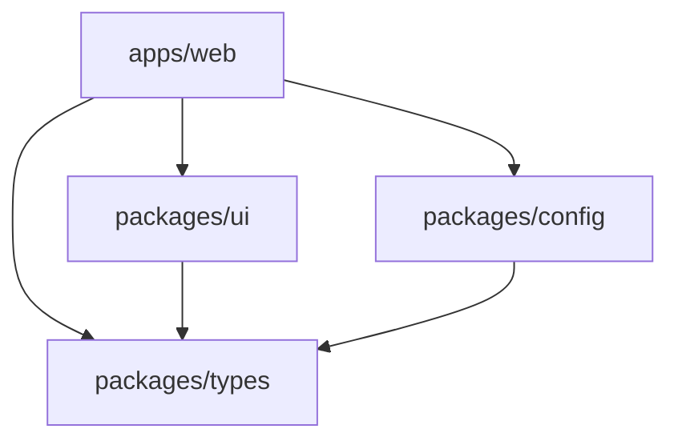

# Development Setup Guide

This guide covers setting up the C9D AI application for local development using pnpm, Turbo, and the monorepo structure.

## Table of Contents

- [Prerequisites](#prerequisites)
- [Quick Start](#quick-start)
- [Project Structure](#project-structure)
- [Package Manager (pnpm)](#package-manager-pnpm)
- [Build Orchestration (Turbo)](#build-orchestration-turbo)
- [Development Workflow](#development-workflow)
- [Testing](#testing)
- [Troubleshooting](#troubleshooting)
- [Advanced Configuration](#advanced-configuration)

## Prerequisites

### Required Software

1. **Node.js**: Version 18.17.0 or higher
   ```bash
   # Check your Node.js version
   node --version
   
   # Install via nvm (recommended)
   nvm install 18
   nvm use 18
   ```

2. **pnpm**: Version 8.0.0 or higher
   ```bash
   # Install pnpm globally
   npm install -g pnpm@latest
   
   # Or via corepack (Node.js 16.10+)
   corepack enable
   corepack prepare pnpm@latest --activate
   
   # Verify installation
   pnpm --version
   ```

3. **Git**: For version control
   ```bash
   git --version
   ```

### Optional Tools

- **VS Code**: Recommended IDE with workspace configuration
- **Docker**: For running local services (PostgreSQL, etc.)
- **Vercel CLI**: For deployment testing

## Quick Start

### 1. Clone and Setup

```bash
# Clone the repository
git clone <repository-url>
cd c9d-ai

# Install all dependencies
pnpm install

# Copy environment template
cp .env.local.example .env.local

# Edit environment variables (see Environment Setup Guide)
# Configure database, authentication, etc.
```

### 2. Start Development

```bash
# Start all development servers
pnpm dev

# Or start specific packages
pnpm dev --filter=@c9d/web
pnpm dev --filter=@c9d/ui
```

### 3. Verify Setup

```bash
# Run tests to verify everything is working
pnpm test:run

# Test Phase.dev integration (if configured)
pnpm test:phase

# Open the application
open http://localhost:3000
```

## Project Structure

### Monorepo Layout

```
c9d-ai/
├── apps/                          # Applications
│   └── web/                       # Next.js web application
│       ├── app/                   # Next.js app directory
│       ├── components/            # React components
│       ├── lib/                   # Utility libraries
│       ├── public/                # Static assets
│       └── package.json           # App dependencies
├── packages/                      # Shared packages
│   ├── ui/                        # Shared UI components
│   ├── config/                    # Shared configuration
│   └── types/                     # Shared TypeScript types
├── docs/                          # Documentation
├── scripts/                       # Build and utility scripts
├── supabase/                      # Database migrations
├── .env.local.example             # Environment template
├── package.json                   # Root package.json
├── pnpm-workspace.yaml            # pnpm workspace configuration
├── turbo.json                     # Turbo configuration
└── tsconfig.json                  # TypeScript configuration
```

### Package Dependencies



## Package Manager (pnpm)

### Why pnpm?

- **Faster installs**: Up to 2x faster than npm/yarn
- **Disk space efficient**: Shared dependency storage
- **Strict dependency resolution**: Prevents phantom dependencies
- **Monorepo support**: Built-in workspace management

### pnpm Commands

#### Installation

```bash
# Install all dependencies
pnpm install

# Install for specific workspace
pnpm install --filter=@c9d/web

# Add dependency to specific package
pnpm add react --filter=@c9d/web
pnpm add -D typescript --filter=@c9d/ui

# Add dependency to root
pnpm add -w turbo
```

#### Workspace Management

```bash
# List all packages
pnpm list --depth=0

# Run command in specific package
pnpm --filter=@c9d/web run build

# Run command in all packages
pnpm -r run build

# Run command in packages matching pattern
pnpm --filter="./packages/*" run build
```

#### Dependency Management

```bash
# Update dependencies
pnpm update

# Update specific dependency
pnpm update react --filter=@c9d/web

# Check outdated dependencies
pnpm outdated

# Remove dependency
pnpm remove react --filter=@c9d/web
```

### pnpm Configuration

The workspace is configured via `pnpm-workspace.yaml`:

```yaml
packages:
  - 'apps/*'
  - 'packages/*'
```

Key features:
- **Workspace linking**: Packages automatically link to each other
- **Dependency hoisting**: Common dependencies are hoisted to root
- **Strict mode**: Prevents access to undeclared dependencies

## Build Orchestration (Turbo)

### Why Turbo?

- **Incremental builds**: Only rebuilds changed packages
- **Parallel execution**: Runs tasks across packages simultaneously
- **Intelligent caching**: Caches build outputs and test results
- **Task dependencies**: Ensures correct build order

### Turbo Configuration

The build pipeline is defined in `turbo.json`:

```json
{
  "pipeline": {
    "build": {
      "dependsOn": ["^build"],
      "outputs": ["dist/**", ".next/**"]
    },
    "dev": {
      "cache": false,
      "persistent": true
    },
    "test": {
      "dependsOn": ["build"],
      "outputs": ["coverage/**"]
    },
    "lint": {
      "outputs": []
    },
    "typecheck": {
      "dependsOn": ["^build"],
      "outputs": []
    }
  }
}
```

### Turbo Commands

#### Build Commands

```bash
# Build all packages
pnpm build

# Build specific package and its dependencies
pnpm build --filter=@c9d/web

# Build packages only (no apps)
pnpm build:packages

# Force rebuild (ignore cache)
pnpm build --force
```

#### Development Commands

```bash
# Start all development servers
pnpm dev

# Start specific package
pnpm dev --filter=@c9d/web

# Start packages only
pnpm dev:packages
```

#### Testing Commands

```bash
# Run all tests
pnpm test

# Run tests in watch mode
pnpm test

# Run tests once
pnpm test:run

# Run tests for specific package
pnpm test --filter=@c9d/web
```

#### Utility Commands

```bash
# Type checking
pnpm typecheck

# Linting
pnpm lint

# Clean build outputs
pnpm clean

# View build cache
turbo run build --dry-run
```

### Turbo Cache

Turbo caches build outputs and test results to speed up subsequent runs:

- **Local cache**: Stored in `.turbo/cache/`
- **Remote cache**: Can be configured for team sharing
- **Cache keys**: Based on file hashes and dependencies

#### Cache Management

```bash
# View cache status
turbo run build --dry-run

# Clear cache
rm -rf .turbo/cache

# Disable cache for specific run
turbo run build --no-cache
```

## Development Workflow

### Daily Development

1. **Start development servers**:
   ```bash
   pnpm dev
   ```

2. **Make changes** to any package or app

3. **Hot reloading** automatically updates the browser

4. **Run tests** for changed code:
   ```bash
   pnpm test --filter=@c9d/web
   ```

### Adding New Features

1. **Create feature branch**:
   ```bash
   git checkout -b feature/new-feature
   ```

2. **Make changes** across packages as needed

3. **Test changes**:
   ```bash
   pnpm test:run
   pnpm typecheck
   pnpm lint
   ```

4. **Build to verify**:
   ```bash
   pnpm build
   ```

5. **Commit and push**:
   ```bash
   git add .
   git commit -m "feat: add new feature"
   git push origin feature/new-feature
   ```

### Working with Packages

#### Creating a New Package

1. **Create package directory**:
   ```bash
   mkdir packages/new-package
   cd packages/new-package
   ```

2. **Initialize package.json**:
   ```json
   {
     "name": "@c9d/new-package",
     "version": "0.1.0",
     "main": "./dist/index.js",
     "types": "./dist/index.d.ts",
     "scripts": {
       "build": "tsc",
       "dev": "tsc --watch"
     }
   }
   ```

3. **Add to workspace** (automatic with pnpm-workspace.yaml)

4. **Install dependencies**:
   ```bash
   pnpm install
   ```

#### Using Package in App

```typescript
// In apps/web/package.json
{
  "dependencies": {
    "@c9d/new-package": "workspace:*"
  }
}

// In apps/web/app/page.tsx
import { someFunction } from '@c9d/new-package'
```

### Environment Management

#### Development Environment

```bash
# Copy template
cp .env.local.example .env.local

# Edit with your values
# See docs/environment-setup.md for details
```

#### Multiple Environments

```bash
# Development
cp .env.local.example .env.local

# Testing
cp .env.local.example .env.test.local

# Staging (if needed)
cp .env.local.example .env.staging.local
```

## Testing

### Test Structure

```
apps/web/
├── __tests__/                     # App-level tests
├── lib/
│   └── __tests__/                 # Library tests
└── components/
    └── __tests__/                 # Component tests

packages/ui/
├── __tests__/                     # Package tests
└── src/
    └── __tests__/                 # Source tests
```

### Running Tests

```bash
# All tests
pnpm test:run

# Watch mode
pnpm test

# Specific package
pnpm test --filter=@c9d/web

# With UI
pnpm test:ui

# Coverage
pnpm test:run --coverage
```

### Test Configuration

Tests use Vitest with the following configuration:

- **Framework**: Vitest
- **Environment**: jsdom for React components
- **Setup**: `vitest.setup.ts` for global configuration
- **Mocking**: Built-in mocking capabilities

### Writing Tests

```typescript
// Example component test
import { render, screen } from '@testing-library/react'
import { Button } from './button'

describe('Button', () => {
  it('renders correctly', () => {
    render(<Button>Click me</Button>)
    expect(screen.getByRole('button')).toHaveTextContent('Click me')
  })
})

// Example API test
import { GET } from './route'

describe('/api/users', () => {
  it('returns user data', async () => {
    const response = await GET()
    expect(response.status).toBe(200)
  })
})
```

## Troubleshooting

### Common Issues

#### 1. pnpm Installation Issues

**Error**: `pnpm: command not found`

**Solutions**:
```bash
# Install via npm
npm install -g pnpm

# Or via corepack
corepack enable
corepack prepare pnpm@latest --activate

# Verify installation
pnpm --version
```

#### 2. Dependency Resolution Issues

**Error**: `Cannot resolve dependency`

**Solutions**:
```bash
# Clear pnpm cache
pnpm store prune

# Remove node_modules and reinstall
rm -rf node_modules
pnpm install

# Check workspace configuration
cat pnpm-workspace.yaml
```

#### 3. Turbo Build Failures

**Error**: `Task failed with exit code 1`

**Solutions**:
```bash
# Run with verbose output
pnpm build --verbose

# Check specific package
pnpm build --filter=@c9d/web --verbose

# Clear Turbo cache
rm -rf .turbo/cache
pnpm build
```

#### 4. TypeScript Errors

**Error**: `Cannot find module '@c9d/types'`

**Solutions**:
```bash
# Build packages first
pnpm build:packages

# Check TypeScript configuration
pnpm typecheck

# Verify package exports
cat packages/types/package.json
```

#### 5. Hot Reload Issues

**Error**: Hot reload not working

**Solutions**:
```bash
# Restart development server
pnpm dev

# Check file watchers
echo fs.inotify.max_user_watches=524288 | sudo tee -a /etc/sysctl.conf

# Clear Next.js cache
rm -rf apps/web/.next
pnpm dev
```

### Debug Mode

Enable debug logging:

```bash
# pnpm debug
DEBUG=pnpm* pnpm install

# Turbo debug
TURBO_LOG_VERBOSITY=debug pnpm build

# Next.js debug
DEBUG=* pnpm dev
```

### Performance Issues

#### Slow Installs

```bash
# Use pnpm store
pnpm config set store-dir ~/.pnpm-store

# Enable network concurrency
pnpm config set network-concurrency 16

# Use faster registry
pnpm config set registry https://registry.npmjs.org/
```

#### Slow Builds

```bash
# Check Turbo cache
turbo run build --dry-run

# Use parallel builds
pnpm build --parallel

# Optimize TypeScript
# Add to tsconfig.json:
{
  "compilerOptions": {
    "incremental": true,
    "tsBuildInfoFile": ".tsbuildinfo"
  }
}
```

### Getting Help

1. **Check logs**: Look for specific error messages
2. **Clear caches**: Remove `.turbo/cache`, `node_modules`, `.next`
3. **Verify configuration**: Check `package.json`, `turbo.json`, `pnpm-workspace.yaml`
4. **Test isolation**: Try building/running individual packages
5. **Check dependencies**: Ensure all required dependencies are installed

## Advanced Configuration

### Custom Scripts

Add custom scripts to root `package.json`:

```json
{
  "scripts": {
    "fresh": "rm -rf node_modules .turbo/cache && pnpm install",
    "build:analyze": "ANALYZE=true pnpm build",
    "test:e2e": "playwright test",
    "db:migrate": "pnpm --filter=@c9d/web run db:migrate"
  }
}
```

### IDE Configuration

#### VS Code Workspace

Create `.vscode/settings.json`:

```json
{
  "typescript.preferences.includePackageJsonAutoImports": "on",
  "typescript.workspaceSymbols.scope": "allOpenProjects",
  "eslint.workingDirectories": ["apps/*", "packages/*"],
  "editor.codeActionsOnSave": {
    "source.fixAll.eslint": true
  }
}
```

#### Multi-root Workspace

Create `c9d-ai.code-workspace`:

```json
{
  "folders": [
    { "name": "Root", "path": "." },
    { "name": "Web App", "path": "./apps/web" },
    { "name": "UI Package", "path": "./packages/ui" }
  ],
  "settings": {
    "typescript.preferences.includePackageJsonAutoImports": "on"
  }
}
```

### Performance Optimization

#### Build Optimization

```json
// turbo.json
{
  "pipeline": {
    "build": {
      "dependsOn": ["^build"],
      "outputs": ["dist/**", ".next/**"],
      "env": ["NODE_ENV", "NEXT_PUBLIC_*"]
    }
  },
  "globalEnv": ["NODE_ENV"],
  "globalDependencies": ["package.json", "pnpm-lock.yaml"]
}
```

#### Development Optimization

```json
// apps/web/next.config.mjs
export default {
  experimental: {
    optimizePackageImports: ['@c9d/ui', '@c9d/config'],
    turbo: {
      rules: {
        '*.svg': {
          loaders: ['@svgr/webpack'],
          as: '*.js'
        }
      }
    }
  }
}
```

### Continuous Integration

#### GitHub Actions

```yaml
# .github/workflows/ci.yml
name: CI
on: [push, pull_request]

jobs:
  test:
    runs-on: ubuntu-latest
    steps:
      - uses: actions/checkout@v3
      - uses: pnpm/action-setup@v2
        with:
          version: 8
      - uses: actions/setup-node@v3
        with:
          node-version: 18
          cache: 'pnpm'
      
      - run: pnpm install --frozen-lockfile
      - run: pnpm build
      - run: pnpm test:run
      - run: pnpm typecheck
      - run: pnpm lint
```

This comprehensive development setup guide covers all aspects of working with the C9D AI monorepo using pnpm and Turbo. Follow the quick start guide to get up and running, then refer to specific sections as needed for your development workflow.