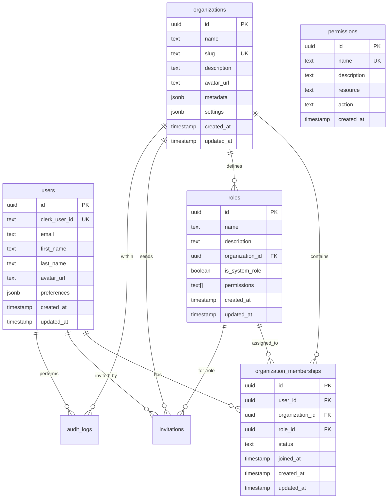

# Database Schema Documentation

This directory contains the database migrations for the Account Management & Organizational Modeling system.

## Migration Files

### 20240101000000_initial_schema.sql
Creates the core database tables:
- `users` - User profiles extended from Clerk authentication
- `organizations` - Organization/tenant entities
- `organization_memberships` - User-organization relationships
- `roles` - Organization-specific roles with permissions
- `permissions` - System-wide permission definitions
- `invitations` - Organization invitation system
- `audit_logs` - Security and activity audit trail

### 20240101000001_rls_policies.sql
Implements Row Level Security (RLS) policies for tenant isolation:
- Enables RLS on all tables
- Creates helper functions for user context
- Implements tenant-aware access policies
- Ensures cross-tenant data isolation

### 20240101000002_seed_data.sql
Seeds the database with system data:
- System permissions for all platform features
- Automatic system role creation (Admin, Member, Viewer)
- Default organization setup triggers
- System organization for platform administration

## Database Schema Overview



## System Roles

Each organization automatically gets three system roles:

### Admin
- Full administrative access
- Can manage organization settings
- Can invite/remove members
- Can assign roles
- Can manage all agents and datasets
- Can view audit logs and billing

### Member  
- Standard access to platform features
- Can create and manage agents
- Can create and update datasets
- Can view organization information
- Cannot manage other members

### Viewer
- Read-only access
- Can view agents and datasets
- Can view organization information
- Cannot create or modify resources

## Permissions System

The system uses a granular permission model with the following categories:

- **User Management**: `user.read`, `user.update`, `user.delete`
- **Organization Management**: `organization.read`, `organization.update`, `organization.delete`, `organization.create`
- **Member Management**: `member.read`, `member.invite`, `member.remove`, `member.update_role`
- **Role Management**: `role.read`, `role.create`, `role.update`, `role.delete`
- **Agent Management**: `agent.read`, `agent.create`, `agent.update`, `agent.delete`, `agent.execute`
- **Dataset Management**: `dataset.read`, `dataset.create`, `dataset.update`, `dataset.delete`
- **Audit & Billing**: `audit.read`, `billing.read`, `billing.manage`
- **System Administration**: `admin`, `system.configure`

## Security Features

### Row Level Security (RLS)
- All tables have RLS enabled
- Policies enforce tenant isolation
- Users can only access data from organizations they belong to
- Cross-tenant access is prevented at the database level

### Audit Logging
- All significant actions are logged
- Includes user context, organization context, and metadata
- Supports security monitoring and compliance

### Automatic Role Assignment
- Organization creators automatically get Admin role
- System roles are created automatically for new organizations
- Invitation system maintains security boundaries

## Running Migrations

To apply these migrations to your Supabase instance:

```bash
# Apply all migrations
supabase migration up

# Verify the schema
npm run verify-database
```

## Environment Variables

Make sure these environment variables are set:

```env
NEXT_PUBLIC_SUPABASE_URL=your_supabase_url
NEXT_PUBLIC_SUPABASE_ANON_KEY=your_supabase_anon_key
```

## Testing the Setup

Use the verification script to ensure everything is working:

```bash
npx tsx scripts/verify-database.ts
```

This will check:
- All required tables exist
- System permissions are seeded
- System roles are created
- Database connectivity works